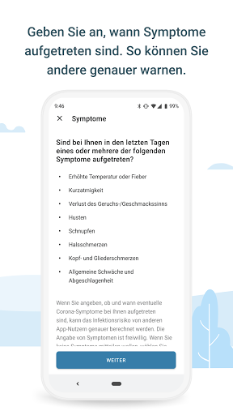
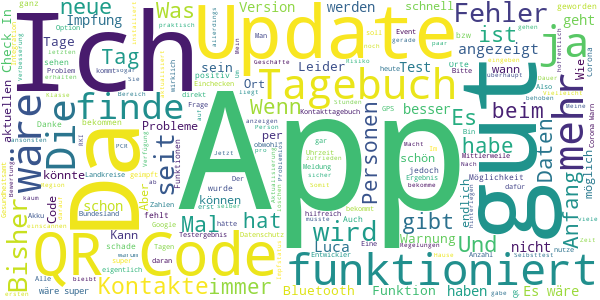
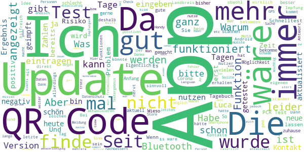
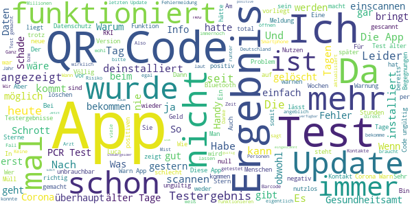

# Corona-Warn-App
App version ``2.0.5``

Analyzed with [covid-apps-observer](http://github.com/covid-apps-observer) project, version ``0.1``

## App overview
| | |
|-------------------------|-------------------------| 
| **Name**&nbsp;&nbsp;&nbsp;&nbsp;&nbsp;&nbsp;&nbsp;&nbsp;&nbsp;&nbsp;&nbsp;&nbsp;&nbsp;&nbsp;&nbsp;&nbsp;&nbsp;&nbsp;&nbsp;&nbsp;&nbsp;&nbsp;&nbsp;&nbsp;&nbsp;&nbsp;&nbsp;&nbsp;&nbsp;&nbsp;&nbsp;&nbsp;&nbsp;&nbsp;&nbsp;&nbsp;&nbsp;&nbsp;&nbsp;&nbsp;  | Corona-Warn-App |
| **Unique identifier** | de.rki.coronawarnapp |
| **Link to Google Play** | [https://play.google.com/store/apps/details?id=de.rki.coronawarnapp](https://play.google.com/store/apps/details?id=de.rki.coronawarnapp) |
| **Summary**  | Gemeinsam Corona bekämpfen |
| **Privacy policy** | [https://www.coronawarn.app/assets/documents/cwa-privacy-notice-de.pdf](https://www.coronawarn.app/assets/documents/cwa-privacy-notice-de.pdf) |
| **Latest version** | 2.0.5 |
| **Last update** | 2021-04-27 18:50:21 |
| **Recent changes** | Mit diesem Update beheben wir einen Fehler. |
| **Installs**  | 10.000.000+ |
| **Category** | Gesundheit & Fitness |
| **First release** | 12.06.2020 |
| **Size**  | 26M |
| **Supported Android version**  | 6.0 oder höher |

### Description
> Das Robert Koch-Institut (RKI) als zentrale Einrichtung des Bundes im Bereich der Öffentlichen Gesundheit und als nationales Public-Health-Institut veröffentlicht die Corona-Warn-App für die deutsche Bundesregierung und für die Bundesrepublik Deutschland. Die App fungiert als digitale Ergänzung zu Abstandhalten, Hygiene und Alltagsmaske. Die App basiert auf Bluetooth-Technologie und der Exposure Notification API von Google. Wer sie nutzt, hilft, Infektionsketten schnell nachzuverfolgen und zu durchbrechen. Die App merkt sich dezentral unsere Begegnungen mit anderen und informiert uns digital, wenn wir Begegnungen mit nachweislich infizierten Personen hatten. Dabei sammelt sie jedoch zu keiner Zeit Informationen zur Identität ihrer Nutzerinnen und Nutzer. Wer wir sind und wo wir sind, bleibt geheim – und unsere Privatsphäre bestens geschützt.
 WIE DIE APP FUNKTIONIERT
 Die Risiko-Ermittlung der App ist das Herzstück der Software und sollte immer aktiviert sein. Wann immer sich Nutzerinnen und Nutzer begegnen, tauschen ihre Smartphones über Bluetooth verschlüsselte Zufalls-IDs aus.
 Diese geben nur Auskunft darüber, über welche Dauer und mit welchem Abstand eine Begegnung stattfand. Welche Person sich hinter einem Code verbirgt, ist für niemanden nachvollziehbar. Die Corona-Warn-App erhebt keine Informationen über den Ort der Begegnung oder den Standort der Nutzerinnen und Nutzer.
 Entsprechend der maximalen Corona-Inkubationszeit werden alle Zufalls-IDs, die unser Smartphone sammelt, für 14 Tage auf dem Smartphone gespeichert – und dann gelöscht.
 Nur wenn eine Person sich über die App freiwillig als nachweislich infiziert meldet, erhalten daraufhin alle früheren Begegnungen eine Warnung auf ihr Smartphone.
 Niemand erfährt, wann, wo oder mit wem eine entsprechende Risiko-Begegnung stattfand. Die infizierte Person bleibt anonym.
 Mit der Benachrichtigung erhalten die betroffenen Nutzer/-innen klare Handlungsempfehlungen. Wichtig: Auch die Daten der Benachrichtigten sind zu keiner Zeit einsehbar.
 WIE DIE DATEN SICHER BLEIBEN
 Die Corona-Warn-App soll uns zwar täglich begleiten, sie wird uns jedoch nie kennenlernen. Dadurch kann sie niemandem verraten, wer wir sind. Der Datenschutz bleibt über die gesamte Nutzungsdauer zu 100 Prozent gewahrt.
 • Keine Anmeldung: Es müssen keine E-Mail-Adresse und kein Name hinterlegt werden.
 • Keine Rückschlüsse auf Identitäten: Bei einer Begegnung mit einem anderen Menschen tauschen die Smartphones nur Zufalls-IDs aus. Diese messen, über welche Dauer und mit welchem Abstand ein Kontakt stattfand. Sie lassen aber keine Rückschlüsse auf Personen und Standorte zu.
 • Dezentrale Speicherung: Die Daten werden nur auf dem Smartphone gespeichert und nach 14 Tagen gelöscht.
 • Keine Einsicht für Dritte: Sowohl die Personen, die eine nachgewiesene Infektion melden, als auch die Benachrichtigten sind nicht nachverfolgbar – nicht für die Bundesregierung, nicht für das Robert Koch-Institut, nicht für andere User und auch nicht für die Betreiber der App-Stores.
 Diese App ist nicht zum Gebrauch außerhalb Deutschlands bestimmt. Die Corona-Warn-App ist die zentrale Corona-App für Deutschland und sie ist an das deutsche Gesundheitssystem angeschlossen. Trotzdem ist die Corona-Warn-App auch in diesem Land verfügbar. Sie ist gedacht für alle, die in Deutschland leben, arbeiten, Urlaub machen oder sich regelmäßig oder über längere Zeit in Deutschland aufhalten.
 Es gelten die Nutzungsbedingungen der Corona-Warn-App: https://www.coronawarn.app/assets/documents/cwa-eula-de.pdf. Durch die Installation und Nutzung dieser App stimmen Sie den Nutzungsbedingungen zu.

### User interface
The developers of the app provide the following screenshots in the Google play store.
| | | |
|:-------------------------:|:-------------------------:|:-------------------------:|
 |   |   |   | 
 |   |   |   | 
 |   |  

## Development team
In the following we report the main information provided by the development team in the Google play store.

| | |
|-------------------------|-------------------------|
| **Developer**  | Robert Koch-Institut |
| **Website**  | [https://www.coronawarn.app](https://www.coronawarn.app) |
| **Email** | CoronaWarnApp@rki.de |
| **Physical address**  | [Robert Koch-Institut Nordufer 20 13353 Berlin](https://www.google.com/maps/search/Robert%20Koch-Institut%20Nordufer%2020%2013353%20Berlin) (Google Maps) |
| **Other developed apps**  | [https://play.google.com/store/apps/developer?id=Robert+Koch-Institut](https://play.google.com/store/apps/developer?id=Robert+Koch-Institut) |

## Android support

| | |
|-------------------------|-------------------------|
| **Declared target Android version**  | Android10, version 10 (API level 29) |
| **Effective target Android version**  | Android10, version 10 (API level 29) |
| **Minimum supported Android version**  | Marshmallow, version 6.0 (API level 23) |
| **Maximum target Android version**  | - |

The larger the difference between the minimum and maximum supported Android versions, the better. A larger difference means a wider audience. For example, old phones have a very low Android version, so a high minimum supported Android version means that the app cannot be used by users with old phones, thus leading to accessibility problems. 

## Requested permissions

In the following we report the complete list of the permissions requested by the app. 

| **Permission** | **Protection level** | **Description** | 
|-------------------------|-------------------------|-------------------------|
 **android.permission ACCESS_NETWORK_STATE** | Normal | Allows applications to access information about networks. 
 **android.permission BLUETOOTH** | Normal | Allows applications to connect to paired bluetooth devices. 
 **android.permission CAMERA** | :warning:**Dangerous** | Required to be able to access the camera device. 
 **android.permission FOREGROUND_SERVICE** | Normal | Allows a regular application to use Service.startForeground. 
 **android.permission INTERNET** | Normal | Allows applications to open network sockets. 
 **android.permission RECEIVE_BOOT_COMPLETED** | Normal | Allows an application to receive the Intent.ACTION_BOOT_COMPLETED that is broadcast after the system finishes booting. 
 **android.permission REQUEST_IGNORE_BATTERY_OPTIMIZATIONS** | Normal | Permission an application must hold in order to use Settings.ACTION_REQUEST_IGNORE_BATTERY_OPTIMIZATIONS. 
 **android.permission WAKE_LOCK** | Normal | Allows using PowerManager WakeLocks to keep processor from sleeping or screen from dimming. 

## Mentioned servers

| **Server** | **Registrant** | **Registrant country** | **Creation date** | 
|-------------------------|-------------------------|-------------------------|-------------------------|
 | google.com | Google LLC | :us: US | 1997-09-15 04:00:00 |
 | android.com | Google LLC | :us: US | 1997-06-23 04:00:00 |

## Security analysis 

Below we report the main security warnings raised by our execution of the [Androwarn](https://github.com/maaaaz/androwarn) security analysis tool.

**Connection interfaces exfiltration**
> - This application reads details about the currently active data network 
> - This application tries to find out if the currently active data network is metered 

**Telephony services abuse**
> - This application makes phone calls 

**Suspicious connection establishment**
> - This application opens a Socket and connects it to the remote address '; port is out of range' on the 'N/A' port  
> - This application opens a Socket and connects it to the remote address 'Lcom/android/tools/r8/GeneratedOutlineSupport;->outline26(Ljava/lang/String;)Ljava/lang/StringBuilder;' on the 'N/A' port  
> - This application opens a Socket and connects it to the remote address 'Ljava/net/Proxy;->type()Ljava/net/Proxy$Type;' on the 'N/A' port  
> - This application opens a Socket and connects it to the remote address 'Method sendUrgentData() is not supported.' on the 'N/A' port  
> - This application opens a Socket and connects it to the remote address 'Method setHandshakeTimeout() is not supported.' on the 'N/A' port  
> - This application opens a Socket and connects it to the remote address 'Method setOOBInline() is not supported.' on the 'N/A' port  
> - This application opens a Socket and connects it to the remote address 'Method setSoWriteTimeout() is not supported.' on the 'N/A' port  
> - This application opens a Socket and connects it to the remote address 'Socket closed' on the 'N/A' port  
> - This application opens a Socket and connects it to the remote address 'Socket is closed' on the 'N/A' port  
> - This application opens a Socket and connects it to the remote address 'Socket is closed.' on the 'N/A' port  
> - This application opens a Socket and connects it to the remote address 'Socket is not connected.' on the 'N/A' port  
> - This application opens a Socket and connects it to the remote address 'socket is closed' on the 'N/A' port  
> - This application opens a Socket and connects it to the remote address 'timeout' on the 'N/A' port  

**Code execution**
> - This application loads a native library 
> - This application loads a native library: 'conscrypt_gmscore_jni' 
> - This application loads a native library: 'conscrypt_jni' 

## User ratings and reviews

Below we provide information about how end users are reacting to the app in terms of ratings and reviews in the Google Play store.

### Ratings

The Corona-Warn-App app has been installed by more than **10000000** times. At this time, **119277** rated the app and its average score is **2.9861364**. Below we show the distribution of the ratings across the usual star-based rating of Google Play

:star::star::star::star::star:: 42241

:star::star::star::star:: 12278

:star::star::star:: 10773

:star::star:: 9555

:star:: 44430

### Reviews 

#### 5-star reviews

> Ich finde es gut aber nicht genau soll noch einbischen verbessert werden  :date: __2021-04-29 12:28:07__

> Ich bin sehr zufrieden. Der Datenschutz ist sehr gut und die App arbeitet stabil und unauffällig im Hintergrund. --- Bitte die APP-BESCHREIBUNG überarbeiten, da steht nichts über QR-Scan-Funktionalität und nichts über (geplante) Funktionsübernahmen aus der 'Luca'-App.  :date: __2021-04-29 12:18:33__

> Update durchgeführt, QR-Code für Unternehmen erstellt! Kunden können kommen. Super App, Kritische Kommentare kann ich nicht nachvollziehen. Der Datenschutz ist doch gewährleistet. Mit der Möglichkeit ein Kontakttagebuch zu führen, Nachtrag: Es ist noch eine Übersicht mit Inzidenz Wert etc. dazu gekommen weiter so. 80 Mio. Downloads wären hilfreich. Nachverfolgung wäre fast ein Kinderspiel"  :date: __2021-04-29 11:33:57__

> Die Erfahrung gibt mir zusätzliche Sicherheit. Was mit seit langem fehlt ist die Möglichkeit, daß ich eingeben kann, wann und das ich erfolgreich geimpft wurde !!!!!  :date: __2021-04-29 09:47:48__

> Die neue Check-in-Funktion ist top!  :date: __2021-04-29 08:45:41__

> Wird, langsam zwar, immer besser. Die Pro-Stunde-Aufzeichnung der gesammelten IDs der Corona Tracing App wäre noch klasse... "Schade" nur, dass die Politik unverständlicjer- und verschwendericherweise der zentralen Luca-App das Wort redet (und das Geld)...  :date: __2021-04-29 08:15:49__

> Top  :date: __2021-04-29 08:15:23__

> Warum sind Screenshots in der App verboten??  :date: __2021-04-29 05:37:45__

> Schön, dass es jetzt auch die Event/Checkin-Funktion gibt! Besser als auf dubiose, unsichere oder trackbare Alternativen angewiesen zu sein.  :date: __2021-04-29 02:30:28__

> Macht was sie soll.  :date: __2021-04-29 01:40:37__

#### 4-star reviews

> Die App kann keine PCR Test Barcode mehr einscannen, vor einigen Monaten ging es noch. Kann die jetzt nur noch QR-Codes einscannen? Manuelle Eingabe von Barcode gibt es nicht. Als Folge, kann man sein Testergebnis über die App nicht mehr abrufen, schade.  :date: __2021-04-29 13:30:28__

> Ich finde die App gut und finde es schade, wie krass sie in Verruf ist. Wenn hier jemand ein Problem meldet, wird darauf schnell geantwortet. Einige Kritiken mögen ja irgendwo auch berechtigt sein, aber ich finde, dass ihr im großen und ganzen das gut hin bekommt. Und dass sich hier Menschen über Datenschutz aufregen und gleichzeitig andere Apps laden, die wirklich detailliert abspeichern, wie man sich bewegt hat und welche Orte man besucht hat, ist schon sehr dumm...  :date: __2021-04-29 09:42:37__

> Also,ich habe gestern meinen QR Code gescannt ,und habe tatsächlich heute ein Ergebnis bekommen,es hat funktioniert.klasse. Hätte ich nicht gedacht,da ich bei anderen gelesen habe,das das nicht funktioniert. Der Rest funktioniert auch, ich muss allerdings dazu sagen,das ich gestern ein Google Update,und die App aktualisiert,habe ,vielleicht liegt es daran ,das es funktioniert. Deshalb gibt es vier Sterne. Sonst bin ich mit der App zu Frieden. Dankeschön. Bleiben sie gesund.  :date: __2021-04-29 08:54:13__

> Funktioniert gut, kann man sein Impfstatus auch in der App dokumentieren? Könnte ggf ja hilfreich sein.  :date: __2021-04-29 06:58:28__

> Es wäre nicht schlecht, wenn es ein Lebenszeichen von der App gäbe, das sie wirklich arbeitet. z. B. Anzahl der getrakten Personen (pro Stunde/Tag) oder eine Warnung darauf, daß ich mich an einem Ort mit viele Personen aufhalte.  :date: __2021-04-29 04:50:45__

> Problemlos installiert und lief bisher recht stabil.  :date: __2021-04-28 23:14:44__

> Bisher eigentlich zufrieden, aber App ist rot ausgeschlagen für ein Ereignis eine Woche her. Die Uhrzeit, nicht der Ort, des möglichen Kontaktes wäre noch super, damit man nicht die Welt anrufen muss und selber eingrenzen zu können und ggf Freunde zu etc zu warnen die die App selber evtl nicht haben. Es wäre super wenn man auch negativ getestet PCR Ergebnisse ohne QR Code angeben könnte genauso wie eine hoffentlich bald erfolgte Impfung.  :date: __2021-04-28 22:24:47__

> so langsam wird es. der Akku-Verbrauch hält sich tatsächlich in Grenzen. Das Tagebuch kann man ja für besondere Tage benutzen, jedenfalls Tage ich nicht jeden Tag ein: mein Mann. Zu Hause. Die Statistik-Daten bekommt man schnell und konzentriert. Jetzt sind die Codes für die Raum-Warnungen dazu gekommen... ich warte noch auf Integration der Impfung ;) als Nachweis.  :date: __2021-04-28 21:51:25__

> Eine, in meinen Augen sicherlich nützliche App, jedoch hatte ich seit der Installation (ich war fast von Anfang an dabei) nur eine (!) Risiko-Begegnung angezeigt bekommen. M.M.n. sollte noch ein Link impletiert werden, welcher auf eine offizielle Seite im Netz mit den aktuellen Corona-Zahlen (und den damit einhergehenden Lockerungen/ Verschärfungen) verweist. Man kennt sich nicht mehr aus! Der QR-Code wird, sobald "Gastronomie" wieder möglich ist, gerne den Gästen zur Verfügung gestellt.  :date: __2021-04-28 21:25:22__

> Also bis jetzt läuft sie gut. Keine Abstürze oder ähnliches. Da ich aber nicht weiß ob sie so funktioniert wie sie soll gebe ich erst nur 4 Sterne. Eigentlich kann ich ja froh sein das bedeutet ja das ich keinen Kontakt bis jetzt hatte. Hoffe es bleibt dabei  :date: __2021-04-28 20:45:33__

#### 3-star reviews

> Wäre es möglich Termineinträge aus Outlook, Google -Kalender und anderen Kalendern-Apps direkt ins das Tagebuch zu übernehmen, damit nicht alles neu eingetippt werden muss?  :date: __2021-04-29 12:55:15__

> Ich habe keine Ahnung ob die App wirklich funktioniert und was soll das mit dem, sind sie schon getestet, ist das nur für einen durchgeführten PCR test? Denn einen Code bei meinen schnelltests habe ich nie erhalten.  :date: __2021-04-29 11:21:16__

> Hab den Scan gerade durchlaufen lassen, bezüglich Risikobegegnungen und was wird mir angezeigt?! ,,Heute um 02:15 Uhr aktualisiert". Aber nach dem ich die App zurück gestellt habe, hat wieder alles funktioniert.  :date: __2021-04-29 09:16:56__

> Ich würde es begrüßen, wenn ich auch eintragen könnte, dass ich geimpft bin.  :date: __2021-04-29 06:39:58__

> Ich nutze die App, seit sie auf dem Markt ist und bin soweit zufrieden. In Zeiten der Bundes-Notbremse fehlen mir aber bei den RKI-Zahlen die Werte meiner Stadt. Ich würde gerne, ähnlich wie bei Wetter-Apps gerne eine oder mehrere Städte eingeben können und dann deren Inzidenzen sehen. Schön wäre es, wenn auch irgendwie der Notbremsenstatus dazu angezeigt würde. Ganz perfekt wäre es dann noch, wenn sich der Impfstatus damit dokumentieren ließe. Das würde die Verbreitung der App sicher fördern.  :date: __2021-04-29 06:12:52__

> Ich bin seit Anfang dabei. Und jetzt kommt nur noch '13 von 14 Tagen aktiv' oder 'es ist etwas schief gelaufen'. Wird das behoben werden. Update 29.04.2021: Letzte Risikoermittlung vorgestern.....?  :date: __2021-04-29 02:28:19__

> So ist die App ganz in Ordnung aber finde es schon blöd, dass man den QR Code nur einmal scannen kann.  :date: __2021-04-28 23:12:01__

> Ein positives Testergebnis kann man nur mit einer Tan eingeben. Wenn man keine Tan hat, muss man nochmal bei einer Hotline anrufen, um sich eine Tan geben zu lassen. Nach diversen Tests, tagelangem Warten auf Kontaktaufnahme durch das Gesundheitsamt und noch längerem Warten auf schriftlichen Bescheid, ist es eine Hürde zu viel m.E. nochmals selbst aktiv werden zu müssen, um eine App zu pflegen, die scheinbar sowieso bei vielen mehr schlecht als recht funktioniert.  :date: __2021-04-28 21:57:07__

> Teilweise Verbesserungswürdig. Gerade in der Übersicht.  :date: __2021-04-28 19:34:34__

> Sinnvoll wäre eine Möglichkeit die Impfungen zu scannen. Mit dem Imfpass zu reisen, ist nicht die Lösung!  :date: __2021-04-28 19:30:03__

#### 2-star reviews

> Leider wird zum Zweck des QR Code scannen die Kamera nicht eingebunden. Bei mir bleibt der Bildschirm im QR Fenster schwarze. In den Einstellungen hat die App Zugriffsrechte auf die Kamera.  :date: __2021-04-29 07:15:10__

> Seit letztem Update viel zu hoher Accu-Verbrauch!!!!! (8,2%) auf S20 Ultra  :date: __2021-04-29 06:42:24__

> Idee und Gestaltung der App ist gut. Wenn aber nur etwa 16 % der Menschen ihre Infektion über die App melden, dann ist der Nutzen doch arg gering. Wenn man dann noch einen Anteil abzieht, der die App eventuell nicht richtig nutzt.. Unterm Strich leider kein Must Have, somdern nur ein Tropfen auf dem heißen Stein.  :date: __2021-04-29 06:28:31__

> Bringt leider nicht's  :date: __2021-04-28 18:51:56__

> Unübersichtlich Viele versteckte Datenübermittlung. Alleine beim installieren. Mehrfache Fenster mit bestätige die dieses und jenes. Dann ist es nicht ganz klar wo man seinen Test einscannen soll. Das könnte deutlicher gemacht werden.  :date: __2021-04-28 08:27:43__

> Nutze die App, aber wirklich überzeugt bin ich nicht.  :date: __2021-04-28 08:21:40__

> Die Armseligkeit Dieser App zeigt sich schon daran, dass die Betreiber der Software nicht mal in der Lage sind, wenigstens tagaktuelle Zahlen zum Infektionsgeschehen zu bieten. Die Zahlen vom Vortag interessieren doch überhaupt nicht mehr. Schade um das Geld, das hier verschwendet wurde. Die Antwort stimmt so nicht: heute (28.04.2021 um 07.45 Uhr) stehen die Daten vom 26.04. - das soll tagaktuell sein?  :date: __2021-04-28 07:52:13__

> Leider kann man den QR Code eines Testes nur 1x scannen. Bei meinem Scannvorgang kam die Meldung "QR Code nicht lesbar. Bitte Netzwerkverbindung prüfen". Habe danach den Code nochmal gescannt. Jetzt kommt neue Meldung: QR Code ungültig oder wurde auf einem anderen Smartphone schon gescannt". ... Jetzt habe ich mich umsonst testen lassen und meine Termine darf ich auch absagen ...  :date: __2021-04-28 06:10:30__

> Seit mehr als 24 h läuft eine Aktualisierung... Kein Ende abzusehen...  :date: __2021-04-28 02:09:22__

> Der QR-Code zur Kontaktverfolgung funktioniert überhaupt nicht. Man solle ein anderen QR Code nehmen.... Haha wenn das Geschäft nur einen hat....  :date: __2021-04-27 19:08:35__

#### 1-star reviews

> QR-Code eingescannt. Nach 48 Stunden immer noch kein Ergebnis in der App. Nur für den Hinweis: "Ein Ergebnis wird auch vom Gesundheitsamt mitgeteilt" ist die App nicht von Nutzen.  :date: __2021-04-29 13:28:09__

> Der QR Code des PCR Tests lässt sich nicht scannen. Frage ist jetzt, wie ich an mein Ergebnis kommen soll?  :date: __2021-04-29 13:18:58__

> Leider nutzlos, weil sie nicht von jedem benutzt wird und infizierte (anonym) nicht sicher erkannt werden. Schön gemacht aber sinnlos. Schade für die Mühe. BTW, Freiwilligkeit hat beim Mensch noch nie funktioniert. Sonst bräuchten wir nicht all die 100.000 Regeln und Gesetze.  :date: __2021-04-29 12:58:06__

> Diese app ist schmutz  :date: __2021-04-29 12:58:03__

> Für was braucht man die App noch, wenn fast all geimpft sind, bzw wir Herdenimmunitat haben? Dies soll ja bereits im September sein. Kinder u10 haben selten Handys . Da ist eine gute Impfausweis App besser. Übrigens emfinde ich es als Nötigung, Erpressung was hier mit Impfen passiert. Lässt man sich nicht Impfen, dann gibts keine Grundrechte.. Das ist Impfzwang. Erkrankte haben oft Fieber und sollen dann noch tan besorgen, ihre Arbeit machen und helfen Labore anzubinden? Meisterleistung👍.  :date: __2021-04-29 12:23:46__

> Seit 4tagen keine Testergebnisse. Schrott  :date: __2021-04-29 11:44:10__

> Total überflüssig! Ich habe jetzt schon MEHRFACH im Bekanntenkreis mitbekommen, dass vom Gesundheitsamt geraten wurde, das Ergebnis eines POSITIVEN Tests nicht in der App einzutragen, weil "es eh nichts bringt und niemand es macht". Teilweise haben die Gesundheitsämter über Feiertage hinweg 2 Wochen gebraucht, um die Unterlagen zu schicken (mit Testergebnis!) ... dafür brauche ich dann keine App ...  :date: __2021-04-29 11:02:03__

> Die schlechteste App die ich mir je runtergeladen hab.. und dann auch noch eine, die angeblich soooo wichtig sein soll... das Testergebnis meiner Tochter konnte ich immer noch nicht einsehen, geschweigedenn das diese infonr unter der man eine tan bekommen soll mit Kompetenz gesegnet sei, was aber nun auch egal ist.. an anderen Stellen bekommt man sein Testergebnis gott sei dank noch auf recht altmodischen, jedoch zuverlässig und unkompliziertem weg. Und vor allem ziemlich zeitnah..  :date: __2021-04-29 10:54:44__

> App abgestürzt und neu installiert jetz kann ich mein qr Code nicht mehr einscannen um test Ergebnis abzurufen  :date: __2021-04-29 10:28:04__

> Völlig sinnlose app  :date: __2021-04-29 10:19:44__

