# Corona-Warn-App
App version ``2.1.2``

Analyzed with [covid-apps-observer](http://github.com/covid-apps-observer) project, version ``0.1``

## App overview
| | |
|-------------------------|-------------------------| 
| **Name**&nbsp;&nbsp;&nbsp;&nbsp;&nbsp;&nbsp;&nbsp;&nbsp;&nbsp;&nbsp;&nbsp;&nbsp;&nbsp;&nbsp;&nbsp;&nbsp;&nbsp;&nbsp;&nbsp;&nbsp;&nbsp;&nbsp;&nbsp;&nbsp;&nbsp;&nbsp;&nbsp;&nbsp;&nbsp;&nbsp;&nbsp;&nbsp;&nbsp;&nbsp;&nbsp;&nbsp;&nbsp;&nbsp;&nbsp;&nbsp;  | Corona-Warn-App |
| **Unique identifier** | de.rki.coronawarnapp |
| **Link to Google Play** | [https://play.google.com/store/apps/details?id=de.rki.coronawarnapp](https://play.google.com/store/apps/details?id=de.rki.coronawarnapp) |
| **Summary**  | Gemeinsam Corona bekämpfen |
| **Privacy policy** | [https://www.coronawarn.app/assets/documents/cwa-privacy-notice-de.pdf](https://www.coronawarn.app/assets/documents/cwa-privacy-notice-de.pdf) |
| **Latest version** | 2.1.2 |
| **Last update** | 2021-04-30 18:50:31 |
| **Recent changes** | Dieses Update bietet Ihnen neben Fehlerbehebungen folgende neue und geänderte Funktionen:  - Registrierung von Antigen-Schnelltests   Sie können nun zusätzlich zu PCR-Tests auch Antigen-Schnelltests per QR-Code scannen, anzeigen und bei Bedarf andere warnen. - Hotlines nun auch aus dem Ausland erreichbar   Die Technische Hotline und TAN-Hotline sind nun auch aus dem Ausland erreichbar. Dabei fallen die Gebühren des jeweiligen Telefonanbieters an. |
| **Installs**  | 10.000.000+ |
| **Category** | Gesundheit & Fitness |
| **First release** | 12.06.2020 |
| **Size**  | 16M |
| **Supported Android version**  | 6.0 oder höher |

### Description
> Das Robert Koch-Institut (RKI) als zentrale Einrichtung des Bundes im Bereich der Öffentlichen Gesundheit und als nationales Public-Health-Institut veröffentlicht die Corona-Warn-App für die deutsche Bundesregierung und für die Bundesrepublik Deutschland. Die App fungiert als digitale Ergänzung zu Abstandhalten, Hygiene und Alltagsmaske. Die App basiert auf Bluetooth-Technologie und der Exposure Notification API von Google. Wer sie nutzt, hilft, Infektionsketten schnell nachzuverfolgen und zu durchbrechen. Die App merkt sich dezentral unsere Begegnungen mit anderen und informiert uns digital, wenn wir Begegnungen mit nachweislich infizierten Personen hatten. Dabei sammelt sie jedoch zu keiner Zeit Informationen zur Identität ihrer Nutzerinnen und Nutzer. Wer wir sind und wo wir sind, bleibt geheim – und unsere Privatsphäre bestens geschützt.
 WIE DIE APP FUNKTIONIERT
 Die Risiko-Ermittlung der App ist das Herzstück der Software und sollte immer aktiviert sein. Wann immer sich Nutzerinnen und Nutzer begegnen, tauschen ihre Smartphones über Bluetooth verschlüsselte Zufalls-IDs aus.
 Diese geben nur Auskunft darüber, über welche Dauer und mit welchem Abstand eine Begegnung stattfand. Welche Person sich hinter einem Code verbirgt, ist für niemanden nachvollziehbar. Die Corona-Warn-App erhebt keine Informationen über den Ort der Begegnung oder den Standort der Nutzerinnen und Nutzer.
 Entsprechend der maximalen Corona-Inkubationszeit werden alle Zufalls-IDs, die unser Smartphone sammelt, für 14 Tage auf dem Smartphone gespeichert – und dann gelöscht.
 Nur wenn eine Person sich über die App freiwillig als nachweislich infiziert meldet, erhalten daraufhin alle früheren Begegnungen eine Warnung auf ihr Smartphone.
 Niemand erfährt, wann, wo oder mit wem eine entsprechende Risiko-Begegnung stattfand. Die infizierte Person bleibt anonym.
 Mit der Benachrichtigung erhalten die betroffenen Nutzer/-innen klare Handlungsempfehlungen. Wichtig: Auch die Daten der Benachrichtigten sind zu keiner Zeit einsehbar.
 WIE DIE DATEN SICHER BLEIBEN
 Die Corona-Warn-App soll uns zwar täglich begleiten, sie wird uns jedoch nie kennenlernen. Dadurch kann sie niemandem verraten, wer wir sind. Der Datenschutz bleibt über die gesamte Nutzungsdauer zu 100 Prozent gewahrt.
 • Keine Anmeldung: Es müssen keine E-Mail-Adresse und kein Name hinterlegt werden.
 • Keine Rückschlüsse auf Identitäten: Bei einer Begegnung mit einem anderen Menschen tauschen die Smartphones nur Zufalls-IDs aus. Diese messen, über welche Dauer und mit welchem Abstand ein Kontakt stattfand. Sie lassen aber keine Rückschlüsse auf Personen und Standorte zu.
 • Dezentrale Speicherung: Die Daten werden nur auf dem Smartphone gespeichert und nach 14 Tagen gelöscht.
 • Keine Einsicht für Dritte: Sowohl die Personen, die eine nachgewiesene Infektion melden, als auch die Benachrichtigten sind nicht nachverfolgbar – nicht für die Bundesregierung, nicht für das Robert Koch-Institut, nicht für andere User und auch nicht für die Betreiber der App-Stores.
 Diese App ist nicht zum Gebrauch außerhalb Deutschlands bestimmt. Die Corona-Warn-App ist die zentrale Corona-App für Deutschland und sie ist an das deutsche Gesundheitssystem angeschlossen. Trotzdem ist die Corona-Warn-App auch in diesem Land verfügbar. Sie ist gedacht für alle, die in Deutschland leben, arbeiten, Urlaub machen oder sich regelmäßig oder über längere Zeit in Deutschland aufhalten.
 Es gelten die Nutzungsbedingungen der Corona-Warn-App: https://www.coronawarn.app/assets/documents/cwa-eula-de.pdf. Durch die Installation und Nutzung dieser App stimmen Sie den Nutzungsbedingungen zu.

### User interface
The developers of the app provide the following screenshots in the Google play store.
| | | |
|:-------------------------:|:-------------------------:|:-------------------------:|
 | 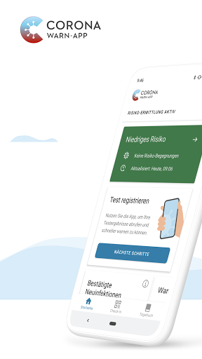  | 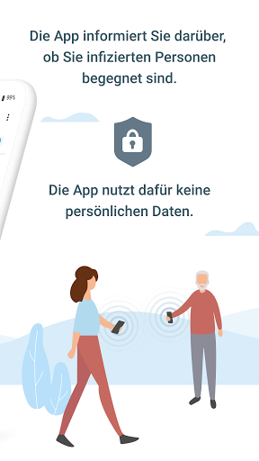  | 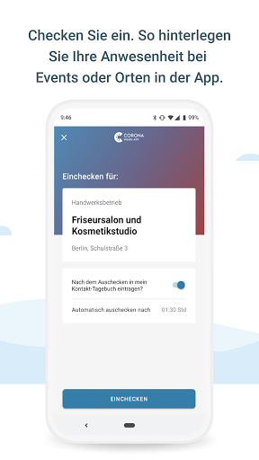  | 
 | 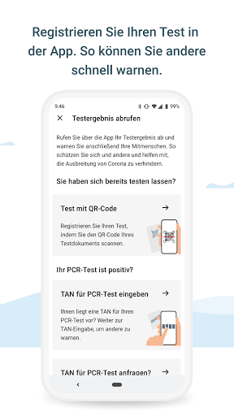  | 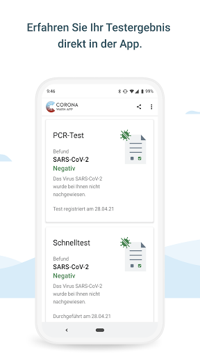  | 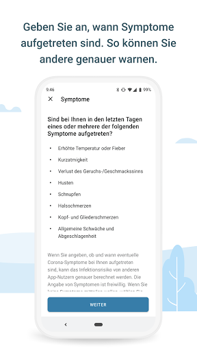  | 
 | 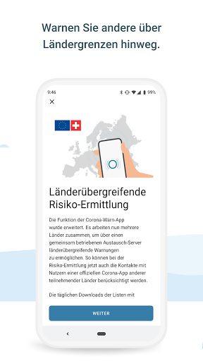  | 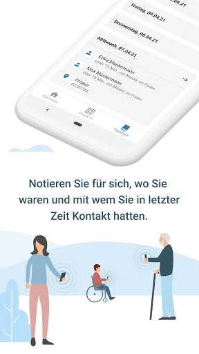 

## Development team
In the following we report the main information provided by the development team in the Google play store.

| | |
|-------------------------|-------------------------|
| **Developer**  | Robert Koch-Institut |
| **Website**  | [https://www.coronawarn.app](https://www.coronawarn.app) |
| **Email** | CoronaWarnApp@rki.de |
| **Physical address**  | [Robert Koch-Institut Nordufer 20 13353 Berlin](https://www.google.com/maps/search/Robert%20Koch-Institut%20Nordufer%2020%2013353%20Berlin) (Google Maps) |
| **Other developed apps**  | [https://play.google.com/store/apps/developer?id=Robert+Koch-Institut](https://play.google.com/store/apps/developer?id=Robert+Koch-Institut) |

## Android support

| | |
|-------------------------|-------------------------|
| **Declared target Android version**  | Android10, version 10 (API level 29) |
| **Effective target Android version**  | Android10, version 10 (API level 29) |
| **Minimum supported Android version**  | Marshmallow, version 6.0 (API level 23) |
| **Maximum target Android version**  | - |

The larger the difference between the minimum and maximum supported Android versions, the better. A larger difference means a wider audience. For example, old phones have a very low Android version, so a high minimum supported Android version means that the app cannot be used by users with old phones, thus leading to accessibility problems. 

## Requested permissions

In the following we report the complete list of the permissions requested by the app. 

| **Permission** | **Protection level** | **Description** | 
|-------------------------|-------------------------|-------------------------|
 **android.permission ACCESS_NETWORK_STATE** | Normal | Allows applications to access information about networks. 
 **android.permission BLUETOOTH** | Normal | Allows applications to connect to paired bluetooth devices. 
 **android.permission CAMERA** | :warning:**Dangerous** | Required to be able to access the camera device. 
 **android.permission FOREGROUND_SERVICE** | Normal | Allows a regular application to use Service.startForeground. 
 **android.permission INTERNET** | Normal | Allows applications to open network sockets. 
 **android.permission RECEIVE_BOOT_COMPLETED** | Normal | Allows an application to receive the Intent.ACTION_BOOT_COMPLETED that is broadcast after the system finishes booting. 
 **android.permission REQUEST_IGNORE_BATTERY_OPTIMIZATIONS** | Normal | Permission an application must hold in order to use Settings.ACTION_REQUEST_IGNORE_BATTERY_OPTIMIZATIONS. 
 **android.permission WAKE_LOCK** | Normal | Allows using PowerManager WakeLocks to keep processor from sleeping or screen from dimming. 

## Mentioned servers

| **Server** | **Registrant** | **Registrant country** | **Creation date** | 
|-------------------------|-------------------------|-------------------------|-------------------------|
 | google.com | Google LLC | :us: US | 1997-09-15 04:00:00 |
 | android.com | Google LLC | :us: US | 1997-06-23 04:00:00 |

## Security analysis 

Below we report the main security warnings raised by our execution of the [Androwarn](https://github.com/maaaaz/androwarn) security analysis tool.

**Connection interfaces exfiltration**
> - This application reads details about the currently active data network 
> - This application tries to find out if the currently active data network is metered 

**Telephony services abuse**
> - This application makes phone calls 

**Suspicious connection establishment**
> - This application opens a Socket and connects it to the remote address '; port is out of range' on the 'N/A' port  
> - This application opens a Socket and connects it to the remote address 'Lcom/android/tools/r8/GeneratedOutlineSupport;->outline26(Ljava/lang/String;)Ljava/lang/StringBuilder;' on the 'N/A' port  
> - This application opens a Socket and connects it to the remote address 'Ljava/net/Proxy;->type()Ljava/net/Proxy$Type;' on the 'N/A' port  
> - This application opens a Socket and connects it to the remote address 'Method sendUrgentData() is not supported.' on the 'N/A' port  
> - This application opens a Socket and connects it to the remote address 'Method setHandshakeTimeout() is not supported.' on the 'N/A' port  
> - This application opens a Socket and connects it to the remote address 'Method setOOBInline() is not supported.' on the 'N/A' port  
> - This application opens a Socket and connects it to the remote address 'Method setSoWriteTimeout() is not supported.' on the 'N/A' port  
> - This application opens a Socket and connects it to the remote address 'Socket closed' on the 'N/A' port  
> - This application opens a Socket and connects it to the remote address 'Socket is closed' on the 'N/A' port  
> - This application opens a Socket and connects it to the remote address 'Socket is closed.' on the 'N/A' port  
> - This application opens a Socket and connects it to the remote address 'Socket is not connected.' on the 'N/A' port  
> - This application opens a Socket and connects it to the remote address 'socket is closed' on the 'N/A' port  
> - This application opens a Socket and connects it to the remote address 'timeout' on the 'N/A' port  

**Code execution**
> - This application loads a native library 
> - This application loads a native library: 'conscrypt_gmscore_jni' 
> - This application loads a native library: 'conscrypt_jni' 

## User ratings and reviews

Below we provide information about how end users are reacting to the app in terms of ratings and reviews in the Google Play store.

### Ratings

The Corona-Warn-App app has been installed by more than **10000000** times. At this time, **121358** rated the app and its average score is **3.0493715**. Below we show the distribution of the ratings across the usual star-based rating of Google Play

:star::star::star::star::star:: 44195

:star::star::star::star:: 13020

:star::star::star:: 11714

:star::star:: 9441

:star:: 42988

### Reviews 

#### 5-star reviews

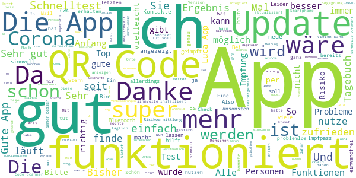

> Ist einfach suppiiiiiiiiii🤗  :date: __2021-05-13 17:02:40__

> Sehr gut für Nachverfolgung  :date: __2021-05-13 14:57:50__

> A. 10.5.21  :date: __2021-05-13 13:53:37__

> Mega  :date: __2021-05-13 13:49:28__

> Ich bin sehr zufrieden!!  :date: __2021-05-13 13:00:48__

> Funktioniert bis jetzt ohne Fehler  :date: __2021-05-13 12:58:18__

> Die Kochen waren App ist auch richtig gut  :date: __2021-05-13 12:29:57__

> Update: inzwischen läuft die CWA ohne Probleme. Durch die QR-Codes und den in Kürze kommenden digitalen "Corona Impfpass" zu empfehlen. Der CCTG Fork kann zusätzlich auch die Zahl gesammelter Codes anzeigen oder covid-lens.github.io Geräte mit aktivem exposure notification framework anzeigen. Vielleicht Funktionen die zu mehr Vertrauen in die App beitragen könnten.  :date: __2021-05-13 12:18:36__

> Ein kleiner Baustein bei der Pandemiebekämpfung. Danke an alle die mitmachen 😘 um andere zu warnen.  :date: __2021-05-13 12:13:47__

> Ich nutze die App von Anfang an und finde sie gut und sinnvoll. Besonders die Erweiterungen. Seit dem heutigen Update auf 2.2.1 leider eine Inkompatibilitätsmeldung. Angeblich kann mein Bluetooth keine Warnungen verschicken, sondern nur empfangen. Das ist natürlich nicht sinnvoll. Bisher hatte ich die Meldung nicht. Was ist da los? Ich habe keine Änderungen an den Einstellungen vorgenommen und nutze ein Huawei P8 Lite mit Android 6.  :date: __2021-05-13 11:28:50__

#### 4-star reviews

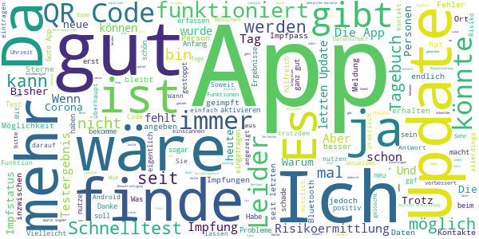

> Die App wird besser! Die neue Funktion ein eigenen QR-Code zu generieren um sich im Geschäft besser registrieren zu lassen kam meiner Meinung ein Jahr zu Spät. Aber jetzt ist sie endlich da. Sie sollte aber leichter, sprich gleich auf der Startseite der App auswählbar sein!!!  :date: __2021-05-13 17:43:41__

> Ich kann die App nicht aktualisieren .Wann gibt es den Digitalen Impfpass hier in der App?  :date: __2021-05-13 16:54:03__

> Ansich nicht schlecht, aber nur 1 Aktualisierung pro 24 Stunden und man kann nirgendwo eingeben, dass man geimpft ist.  :date: __2021-05-13 16:44:28__

> Es wäre schön, wenn man den QR Code aus einer Datei oder Mail übernehmen könnte. Das geht bei anderen Apps ja auch.  :date: __2021-05-13 16:42:50__

> Aktuell keine Probleme. Tut hoffentlich was sie soll, soweit so gut.  :date: __2021-05-13 10:07:31__

> Ich finde die Idee der App gut. Es funktioniert aber nur richtig wenn viele mitmachen. Was ich auch gut finde ist, dass es die Coronazahlen anzeigt.Werbung habe Ich keine. Es gibt mir immer die Benachrichtigung ich solle drauf schauen. Die Risikoermittlung dauert nur einpaar Minuten. Es zeigte mir immer keine Risicobegegnung an. Entweder liegt es daran dass sie Kaputt ist, oder ich habe wirklich keine Begegnungen.Negative Selbsttests kann man nicht angeben was auch nicht schlimm ist.  :date: __2021-05-13 08:01:36__

> Da ist der Wurm drin, jetzt funktioniert Risikobewertung wieder nicht mehr. 🙄 🌟🌟🌟🌟🌟 Ich kann nur f mich sprechen: ein Abstrich war offensichtlich falsch-Positiv (kann etwas Blut d Test verfälschen?). Das Ergebnis (negativ) kam zeitgleich mit dem Anruf d Gesundheitsamtes, wg hohem Testaufkommen, dauerte es 1 Tag länger. Die Corona-Warn-App funktioniert b der Ergebnisbekanntgabe definitiv (d.h. dass unser Labor m dabei ist), ich habe sie seit dem 1. Release drauf Well done 👍 \*\**RIP KULLO\*\**  :date: __2021-05-12 22:03:19__

> Moin. Bringt doch bitte mal die Impfung rein. So das man wer geimpft das hier einpflegen kann.  :date: __2021-05-12 16:23:43__

> Ich kann den QR Code für den Antigen-Schnelltest nur scannen. Dafür müsste ich ihn ausdrucken. Einfacher wäre es, wenn ich den QR-Code von meinem Smartphone abrufen könnte.  :date: __2021-05-12 12:40:19__

> Müsste mehr Daten erfassen, ich versteh nicht warum das abgelehnt wird. Manchmal ist Datenschutz völliger Blödsinn!  :date: __2021-05-12 10:34:30__

#### 3-star reviews

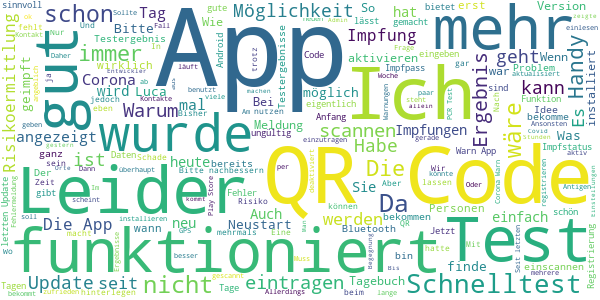

> Hab' mein Handy vom "Admin-Modus" in 'Mehrbenutzermodus' umgewandelt und im Nicht-Admin-Modus versucht, die Corona-Warn-App (zu installieren und) zu aktivieren. Jetzt kommt die Meldung, das der "Covid-19-Benachrichtigungsdienst nicht aktiviert sei und ich die App nicht nutzen kann." Funktioniert die App 'nur' mit Admin-Account? Ansonsten bleibt gesund!!  :date: __2021-05-13 18:08:00__

> Ich fande es gut wenn man seinen impfstatus allgemein impfstatus mit reinnimmt  :date: __2021-05-13 17:53:46__

> Finde das Spiel nicht so schön. Man kann nicht wirklich was machen. Es gehen zwar zahlen hoch und runter , aber ich kann auf keines bieten oder verkaufen . 3 Sterne für den Entwickler sonst 0. Macht keinen Spaß  :date: __2021-05-13 09:34:18__

> Frage wann kommt der Digetale Impf Ausweis für die App werde in den nächsten Tagen das erste Mal geimpft  :date: __2021-05-13 09:11:15__

> Funktioniert soweit, aber bislang nur eine Meldung einer angeblichen Begegnung zu einem Zeitpunkt, als ich allein zuhause war. Ärgerlich, dass ich meinen Impfstatus nicht hinterlegen kann, auch zu Nachweis-/Ausweiszwecken.  :date: __2021-05-12 22:38:44__

> Bis vor ein paar Tagen gut, jetzt leider unzuverlässig. Seit gestern ist die Risikoermittlung plötzlich nicht mehr aktiv, ohne dass ich an den Einstellungen etwas geändert habe. Sie lässt sich aber auch nicht wieder aktivieren. Update: Nach dem Neustart zeigte die App gestern den Risikostatus an. Heute Morgen erneut neu gestartet, aber die App gar nicht geöffnet und den Risikostatus nicht abgefragt sondern jetzt erst (abends) die App geöffnet - Risikoermittlung nicht aktiv.  :date: __2021-05-12 18:34:31__

> Hat oefters Fehlmeldungen, Anmeldung muss wiederholt werden.  :date: __2021-05-12 18:33:09__

> Benutzt eigentlich irgendein Entwickler das Tagebuch ?! Dann hätten wir bestimmt schon die Möglichkeit Orte/Personen zu gruppieren. Oder Orte/Personen zu verknüpfen. ZB. für einen typischen Arbeitstag, Freizeitgruppe, Sportgruppe  :date: __2021-05-12 13:28:48__

> Mein Testergebnis wurde nach 20 Stunden angezeigt. Allerdings wird neuerdings mehrmals am Tag die Risikoermittlung automatisch gestoppt. Sie lässt sich auch manuell nicht wieder einschalten, sondern ich muss jedesmal die App neu starten. Bluetooth ist an und auch Netzwerk. Einen Neustart des Handys habe ich bereits 2x probiert. Die App geht dann mehrere Stunden, danach ist die Risikoermittlung wieder aus.  :date: __2021-05-12 13:04:41__

> Tagebuch schön und gut. Aber wieso kann ich immer noch nicht melden, wenn ich bereits vollständig geimpft bin? Das hat einfach zu so einer App dazu zu gehören. PS: Lobenswert ist die prompte Rückmeldung. Daher vergebe ich schon einmal einen Stern mehr...  :date: __2021-05-12 12:48:34__

#### 2-star reviews

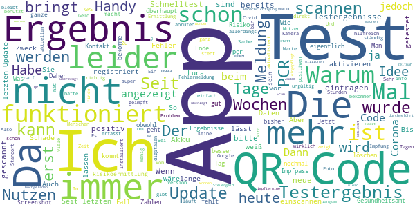

> Die App nützt mir nichts, da sie ständig mein Bluetooth ausschaltet und mir dann sagt, dass ein Fehler aufgetreten ist, weil Bluetooth ausgeschalten ist.  :date: __2021-05-13 16:09:58__

> Nach über einen Jahr im Gebrauch, kann ich sagen das mir die App nix gebracht hat. Hatte so viele mit Corona in meiner Umgebung auf der Arbeit und habe noch nicht mal eine Risiko Bedrohung bekommen. Habe aber auch kein Corona-Virus bekommen, vielleicht hat sie doch geholfen 😅  :date: __2021-05-13 15:32:26__

> Idee gut, leider wurden bisher alle von mir durchgeführten und eingescannten Tests nicht angezeigt. Habe daher wenig Vertrauen, dass sie überhaupt funktioniert. Ich habe aus beruflichen Gründen täglich Kontakt zu 70-80 Personen und noch keine einzige Warnung....  :date: __2021-05-13 14:41:56__

> Mit den Fehlerprotokollen kann ich nicht viel anfangen. Ich weiss nicht, was das bringen soll. Helfen würde mir der digita le Impfausweis. Warum dauert das so lange bis der kommt?  :date: __2021-05-13 13:38:01__

> Ich bin ein Fan von der Idee mit der App. Deshalb habe ich mich gefreut, als mein Arzt mir nach dem PCR Test einen QRCode in die Hand drückte. Also Code mit der App gescannt - das war am Montag. Nun am Donnerstag schreibe ich diese Rezension, da in der App immer noch steht, dass mein Test noch nicht abgeschlossen ist. Vermutlich kann die App nichts für. Aber egal, es scheint dass wir einfach nicht Digital können, Prozesse Schnittstellen etc. zu standardisien. In Summe unbrauchbar. Sry  :date: __2021-05-13 12:58:49__

> Nutzlos Bei Warnungen wird es von dem Gesundheitsamt heruntergespielt und kein PCR Test gemacht. PCR Testergebnisse werden nicht übermittelt. Über das Labor hatte ich das Ergebnis binnen 27 Stunden. Die App zeigt nach fünf Tagen immer noch kein Ergebnis an. Da wurden Millionen für eine aus meiner Sicht nutzlose App ausgegeben. Sehr traurig. Das liegt sicher nicht immer an den App-Erstellern.  :date: __2021-05-13 08:55:44__

> Angeblich kann man Schnelltests scannen...bekommen aber immer die gleiche Meldung "QR Code ungültig" Alsoooo, was soll ich mit dieser App??  :date: __2021-05-12 22:58:17__

> Warum kann man keine negativen test vom schnelltest eintragen da gibt es kein qr Nachtrag Sie schreiben das man schnelltest jetzt registrieren kann aber leider geht es nicht da bei den test Ergebnissen kein QR Code gibt auch bei selbsttestungen die positiv oder negativ ausfallen kann man nicht in die APP eintragen un so andere zuwarnen schade dabei wollen wir doch alle die Pandemie besiegen  :date: __2021-05-12 21:27:55__

> Update 2.2: bei mir funktioniert der Abruf von Schnelltest Ergebnissen leider nicht.  :date: __2021-05-12 18:56:28__

> In der neuesten Version schmiert die Risikoermittlung dauernd ab und lässt sich nicht mehr starten. Ich mag mich nicht durch die RKI FAQ quälen. Lieber deinstalliere ich die App. Geht schneller ;)........ Neustart war hilfreich... Danke :)  :date: __2021-05-12 18:00:30__

#### 1-star reviews

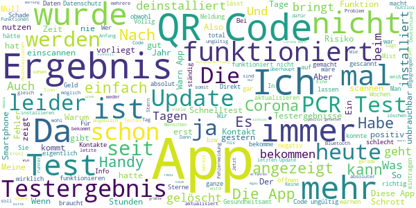

> Kann einen an mich per Email geschickten QR Code eines Schnell (Apotheke) Testes nicht einscannen. Manuell eingeben geht auch nicht.  :date: __2021-05-13 17:33:26__

> Die App kann auf meinem 4 Jahre alten Huawei P6 nicht installiert werden. Alle anderen Apps laufen auf dem Smartphone problemlos. Ja, Playstore funktioniert einwandfrei. Auf dem erst 4 Jahre alten Smartphone ist Android 5.1 installiert, ein Update ist nicht möglich. Hier sollte die App angepasst werden, letztendlich sind noch viele dieser Geräte im Umlauf. WhatsApp, Facebook und Co. Funktionieren schließlich auch problemlos.  :date: __2021-05-13 16:45:40__

> Habe mir die App erst aufs Handy gemacht. Kann nicht eintragen das Ich eine Genesene bin.  :date: __2021-05-13 15:46:15__

> Wunderbar, da wird an einer funktionierenden App soviel rumgefummelt und verschlimmbessert das man nicht mehr durchsteigt und sie letztendlich nicht mehr funktioniert. So schließt sich der Kreis "Pandemiebekämpfung".  :date: __2021-05-13 15:42:21__

> Kam keine Benachrichtigung. *Edit* Die Aufgabe von der App ist es ja, die Test Ergebnisse digital zu übermitteln! Mir wurde vom Gesundheitsamt gesagt, das Ergebnis vom Pcr Test sei in spätestens 3 Tagen da und kann in der App abgerufen werden. Allerdings kam da nie mein Test an und musste selber das Gesundheitsamt anrufen und nachfragen.  :date: __2021-05-13 13:55:23__

> Vom Gesundheitsamt bekommt man bei einem positiven Testergebnis nach einem PCR-Test keinen QR-Code zum Abscannen oder eine TAN mitgeteilt. Beim Telefonat mit dem Amt liegt der Focus mit Sicherheit nicht auf diesen Angaben und es wird vergessen. Die Wenigsten werden einen weiteren Anruf mit Warteschlange tätigen und somit entfällt der Eintrag in diese App. Somit keine Warnung und der Nutzen der App somit nur begrenzt. Nicht durchdacht oder von der Behörde schlecht umgesetzt.  :date: __2021-05-13 13:49:22__

> Funktioniert einfach nicht.  :date: __2021-05-13 13:06:09__

> schlecht  :date: __2021-05-13 12:44:46__

> Wollte einen QR Code vom Schnelltest Scannen, bekam aber die Meldung Code ungültig. Wenn ich keine negativ Tests registrieren kann ist die App für mich nutzlos. Wird wieder deinstalliert....  :date: __2021-05-13 12:40:53__

> In einem Wort beschreiben : Unnötig  :date: __2021-05-13 12:38:04__

