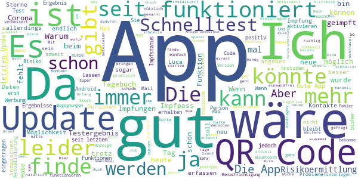
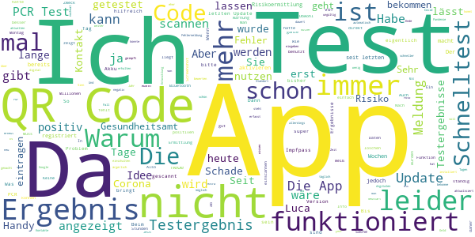
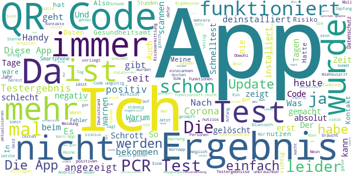

# Corona-Warn-App
App version ``2.1.2``

Analyzed with [covid-apps-observer](http://github.com/covid-apps-observer) project, version ``0.1``

## App overview
| | |
|-------------------------|-------------------------| 
| **Name**&nbsp;&nbsp;&nbsp;&nbsp;&nbsp;&nbsp;&nbsp;&nbsp;&nbsp;&nbsp;&nbsp;&nbsp;&nbsp;&nbsp;&nbsp;&nbsp;&nbsp;&nbsp;&nbsp;&nbsp;&nbsp;&nbsp;&nbsp;&nbsp;&nbsp;&nbsp;&nbsp;&nbsp;&nbsp;&nbsp;&nbsp;&nbsp;&nbsp;&nbsp;&nbsp;&nbsp;&nbsp;&nbsp;&nbsp;&nbsp;  | Corona-Warn-App |
| **Unique identifier** | de.rki.coronawarnapp |
| **Link to Google Play** | [https://play.google.com/store/apps/details?id=de.rki.coronawarnapp](https://play.google.com/store/apps/details?id=de.rki.coronawarnapp) |
| **Summary**  | Gemeinsam Corona bekämpfen |
| **Privacy policy** | [https://www.coronawarn.app/assets/documents/cwa-privacy-notice-de.pdf](https://www.coronawarn.app/assets/documents/cwa-privacy-notice-de.pdf) |
| **Latest version** | 2.1.2 |
| **Last update** | 2021-04-30 18:50:31 |
| **Recent changes** | Dieses Update bietet Ihnen neben Fehlerbehebungen folgende neue und geänderte Funktionen:  - Registrierung von Antigen-Schnelltests   Sie können nun zusätzlich zu PCR-Tests auch Antigen-Schnelltests per QR-Code scannen, anzeigen und bei Bedarf andere warnen. - Hotlines nun auch aus dem Ausland erreichbar   Die Technische Hotline und TAN-Hotline sind nun auch aus dem Ausland erreichbar. Dabei fallen die Gebühren des jeweiligen Telefonanbieters an. |
| **Installs**  | 10.000.000+ |
| **Category** | Gesundheit & Fitness |
| **First release** | 12.06.2020 |
| **Size**  | 16M |
| **Supported Android version**  | 6.0 oder höher |

### Description
> Das Robert Koch-Institut (RKI) als zentrale Einrichtung des Bundes im Bereich der Öffentlichen Gesundheit und als nationales Public-Health-Institut veröffentlicht die Corona-Warn-App für die deutsche Bundesregierung und für die Bundesrepublik Deutschland. Die App fungiert als digitale Ergänzung zu Abstandhalten, Hygiene und Alltagsmaske. Die App basiert auf Bluetooth-Technologie und der Exposure Notification API von Google. Wer sie nutzt, hilft, Infektionsketten schnell nachzuverfolgen und zu durchbrechen. Die App merkt sich dezentral unsere Begegnungen mit anderen und informiert uns digital, wenn wir Begegnungen mit nachweislich infizierten Personen hatten. Dabei sammelt sie jedoch zu keiner Zeit Informationen zur Identität ihrer Nutzerinnen und Nutzer. Wer wir sind und wo wir sind, bleibt geheim – und unsere Privatsphäre bestens geschützt.
 WIE DIE APP FUNKTIONIERT
 Die Risiko-Ermittlung der App ist das Herzstück der Software und sollte immer aktiviert sein. Wann immer sich Nutzerinnen und Nutzer begegnen, tauschen ihre Smartphones über Bluetooth verschlüsselte Zufalls-IDs aus.
 Diese geben nur Auskunft darüber, über welche Dauer und mit welchem Abstand eine Begegnung stattfand. Welche Person sich hinter einem Code verbirgt, ist für niemanden nachvollziehbar. Die Corona-Warn-App erhebt keine Informationen über den Ort der Begegnung oder den Standort der Nutzerinnen und Nutzer.
 Entsprechend der maximalen Corona-Inkubationszeit werden alle Zufalls-IDs, die unser Smartphone sammelt, für 14 Tage auf dem Smartphone gespeichert – und dann gelöscht.
 Nur wenn eine Person sich über die App freiwillig als nachweislich infiziert meldet, erhalten daraufhin alle früheren Begegnungen eine Warnung auf ihr Smartphone.
 Niemand erfährt, wann, wo oder mit wem eine entsprechende Risiko-Begegnung stattfand. Die infizierte Person bleibt anonym.
 Mit der Benachrichtigung erhalten die betroffenen Nutzer/-innen klare Handlungsempfehlungen. Wichtig: Auch die Daten der Benachrichtigten sind zu keiner Zeit einsehbar.
 WIE DIE DATEN SICHER BLEIBEN
 Die Corona-Warn-App soll uns zwar täglich begleiten, sie wird uns jedoch nie kennenlernen. Dadurch kann sie niemandem verraten, wer wir sind. Der Datenschutz bleibt über die gesamte Nutzungsdauer zu 100 Prozent gewahrt.
 • Keine Anmeldung: Es müssen keine E-Mail-Adresse und kein Name hinterlegt werden.
 • Keine Rückschlüsse auf Identitäten: Bei einer Begegnung mit einem anderen Menschen tauschen die Smartphones nur Zufalls-IDs aus. Diese messen, über welche Dauer und mit welchem Abstand ein Kontakt stattfand. Sie lassen aber keine Rückschlüsse auf Personen und Standorte zu.
 • Dezentrale Speicherung: Die Daten werden nur auf dem Smartphone gespeichert und nach 14 Tagen gelöscht.
 • Keine Einsicht für Dritte: Sowohl die Personen, die eine nachgewiesene Infektion melden, als auch die Benachrichtigten sind nicht nachverfolgbar – nicht für die Bundesregierung, nicht für das Robert Koch-Institut, nicht für andere User und auch nicht für die Betreiber der App-Stores.
 Diese App ist nicht zum Gebrauch außerhalb Deutschlands bestimmt. Die Corona-Warn-App ist die zentrale Corona-App für Deutschland und sie ist an das deutsche Gesundheitssystem angeschlossen. Trotzdem ist die Corona-Warn-App auch in diesem Land verfügbar. Sie ist gedacht für alle, die in Deutschland leben, arbeiten, Urlaub machen oder sich regelmäßig oder über längere Zeit in Deutschland aufhalten.
 Es gelten die Nutzungsbedingungen der Corona-Warn-App: https://www.coronawarn.app/assets/documents/cwa-eula-de.pdf. Durch die Installation und Nutzung dieser App stimmen Sie den Nutzungsbedingungen zu.

### User interface
The developers of the app provide the following screenshots in the Google play store.
| | | |
|:-------------------------:|:-------------------------:|:-------------------------:|
 |   |   |   | 
 |   |   |   | 
 |   |  

## Development team
In the following we report the main information provided by the development team in the Google play store.

| | |
|-------------------------|-------------------------|
| **Developer**  | Robert Koch-Institut |
| **Website**  | [https://www.coronawarn.app](https://www.coronawarn.app) |
| **Email** | CoronaWarnApp@rki.de |
| **Physical address**  | [Robert Koch-Institut Nordufer 20 13353 Berlin](https://www.google.com/maps/search/Robert%20Koch-Institut%20Nordufer%2020%2013353%20Berlin) (Google Maps) |
| **Other developed apps**  | [https://play.google.com/store/apps/developer?id=Robert+Koch-Institut](https://play.google.com/store/apps/developer?id=Robert+Koch-Institut) |

## Android support

| | |
|-------------------------|-------------------------|
| **Declared target Android version**  | Android10, version 10 (API level 29) |
| **Effective target Android version**  | Android10, version 10 (API level 29) |
| **Minimum supported Android version**  | Marshmallow, version 6.0 (API level 23) |
| **Maximum target Android version**  | - |

The larger the difference between the minimum and maximum supported Android versions, the better. A larger difference means a wider audience. For example, old phones have a very low Android version, so a high minimum supported Android version means that the app cannot be used by users with old phones, thus leading to accessibility problems. 

## Requested permissions

In the following we report the complete list of the permissions requested by the app. 

| **Permission** | **Protection level** | **Description** | 
|-------------------------|-------------------------|-------------------------|
 **android.permission ACCESS_NETWORK_STATE** | Normal | Allows applications to access information about networks. 
 **android.permission BLUETOOTH** | Normal | Allows applications to connect to paired bluetooth devices. 
 **android.permission CAMERA** | :warning:**Dangerous** | Required to be able to access the camera device. 
 **android.permission FOREGROUND_SERVICE** | Normal | Allows a regular application to use Service.startForeground. 
 **android.permission INTERNET** | Normal | Allows applications to open network sockets. 
 **android.permission RECEIVE_BOOT_COMPLETED** | Normal | Allows an application to receive the Intent.ACTION_BOOT_COMPLETED that is broadcast after the system finishes booting. 
 **android.permission REQUEST_IGNORE_BATTERY_OPTIMIZATIONS** | Normal | Permission an application must hold in order to use Settings.ACTION_REQUEST_IGNORE_BATTERY_OPTIMIZATIONS. 
 **android.permission WAKE_LOCK** | Normal | Allows using PowerManager WakeLocks to keep processor from sleeping or screen from dimming. 

## Mentioned servers

| **Server** | **Registrant** | **Registrant country** | **Creation date** | 
|-------------------------|-------------------------|-------------------------|-------------------------|
 | google.com | Google LLC | :us: US | 1997-09-15 04:00:00 |
 | android.com | Google LLC | :us: US | 1997-06-23 04:00:00 |

## Security analysis 

Below we report the main security warnings raised by our execution of the [Androwarn](https://github.com/maaaaz/androwarn) security analysis tool.

**Connection interfaces exfiltration**
> - This application reads details about the currently active data network 
> - This application tries to find out if the currently active data network is metered 

**Telephony services abuse**
> - This application makes phone calls 

**Suspicious connection establishment**
> - This application opens a Socket and connects it to the remote address '; port is out of range' on the 'N/A' port  
> - This application opens a Socket and connects it to the remote address 'Lcom/android/tools/r8/GeneratedOutlineSupport;->outline26(Ljava/lang/String;)Ljava/lang/StringBuilder;' on the 'N/A' port  
> - This application opens a Socket and connects it to the remote address 'Ljava/net/Proxy;->type()Ljava/net/Proxy$Type;' on the 'N/A' port  
> - This application opens a Socket and connects it to the remote address 'Method sendUrgentData() is not supported.' on the 'N/A' port  
> - This application opens a Socket and connects it to the remote address 'Method setHandshakeTimeout() is not supported.' on the 'N/A' port  
> - This application opens a Socket and connects it to the remote address 'Method setOOBInline() is not supported.' on the 'N/A' port  
> - This application opens a Socket and connects it to the remote address 'Method setSoWriteTimeout() is not supported.' on the 'N/A' port  
> - This application opens a Socket and connects it to the remote address 'Socket closed' on the 'N/A' port  
> - This application opens a Socket and connects it to the remote address 'Socket is closed' on the 'N/A' port  
> - This application opens a Socket and connects it to the remote address 'Socket is closed.' on the 'N/A' port  
> - This application opens a Socket and connects it to the remote address 'Socket is not connected.' on the 'N/A' port  
> - This application opens a Socket and connects it to the remote address 'socket is closed' on the 'N/A' port  
> - This application opens a Socket and connects it to the remote address 'timeout' on the 'N/A' port  

**Code execution**
> - This application loads a native library 
> - This application loads a native library: 'conscrypt_gmscore_jni' 
> - This application loads a native library: 'conscrypt_jni' 

## User ratings and reviews

Below we provide information about how end users are reacting to the app in terms of ratings and reviews in the Google Play store.

### Ratings

The Corona-Warn-App app has been installed by more than **10000000** times. At this time, **121358** rated the app and its average score is **3.0493715**. Below we show the distribution of the ratings across the usual star-based rating of Google Play

:star::star::star::star::star:: 44195

:star::star::star::star:: 13020

:star::star::star:: 11714

:star::star:: 9441

:star:: 42988

### Reviews 

#### 5-star reviews

> Es ist richtig zu Impfen hauptsächlich im sozialen Brennpunkt muss der Impfwagen kommen.  :date: __2021-05-09 16:31:05__

> Sehr genau 👍🏻  :date: __2021-05-09 16:30:07__

> Diese App wartet mit ständigen Verbesserungen auf. Check In Funktion möglich, Schnelltestergebnisse können eingetragen werden, dazu das zielgenaue Warnen durch Personen, die Ihr Testergebnis mitteilen. Man braucht keine weitere App.  :date: __2021-05-09 15:08:39__

> Gut! Wäre ergänzend super, wenn man die C-Impfungen darin dokumentieren könnte. Danke.  :date: __2021-05-09 11:37:38__

> Ein negativer Bericht stärkt mein positives Verhalten.  :date: __2021-05-09 10:45:50__

> Seit 8.5. ca. 19.30 lässt sich die Risikoermittlung nicht mehr aktivieren 🌟🌟🌟🌟🌟 Ich kann nur f mich sprechen: ein Abstrich war offensichtlich falsch-Positiv (kann etwas Blut d Test verfälschen?). Das Ergebnis (negativ) kam zeitgleich mit dem Anruf d Gesundheitsamtes, wg hohem Testaufkommen, dauerte es 1 Tag länger. Die Corona-Warn-App funktioniert bei der Ergebnisbekanntgabe definitiv (d.h. dass unser Labor mit dabei ist), ich habe sie seit dem 1. Release drauf Well done 👍 \*\**RIP KULLO\*\**  :date: __2021-05-09 01:20:44__

> Insgesamt funktioniert die App. Mehrfach gewarnt bei überprüfbaren Infektionen im Gesundheitswesen. 1 Stern Abzug für trägen Start. Gibts wieder, wenn die Checkin Funktion für Läden verfügbar ist. Das ganze Gemeckere kann ich nicht ganz nachvollziehen. Stern dazu. Check in möglich.  :date: __2021-05-08 18:19:06__

> Ich hab die App seit Beginn drauf. Was ich mich als "Doppelt-Geimpfte" nun frage, ob der Impfstatus vielleicht auch in der App hinterlegt werden sollte, weil dadurch das Risiko wen zu infizieren deutlich minimiert bis weg ist.  :date: __2021-05-08 18:08:31__

> Gute App und einfach zu bedienen  :date: __2021-05-08 17:02:57__

> Xs $  :date: __2021-05-08 13:51:42__

#### 4-star reviews

> Die Luca-QR-Codes funktionieren leider immer noch nicht..  :date: __2021-05-09 16:28:13__

> Leider finde ich keine Möglichkeit einzutragen, dass ich geimpft bin. Dadurch entsteht ein falsches Bild , wenn ich angebe, trotz Kontakt keinen Abstrich zu machen  :date: __2021-05-09 15:46:08__

> Gute App, aber Nachbesserung ist nötig, denn seit dem letzten Update auf die Version 2.1.2 ist die App leider regelmäßig nicht mehr aktiv und muss dann jedes Mal neu eingestellt werden. Das ist ärgerlich wenn man sich darauf verlassen soll das die App auch wirklich läuft.  :date: __2021-05-09 13:54:34__

> Trotz aktivierter Risiko Ermittlung zeigt die App seit heute daß diese deaktiviert ist. Trotz mehrfachen betätigen des " Schiebers' immer wieder die Meldung Ermittlung gestoppt..  :date: __2021-05-09 13:28:07__

> Wo kann ich hinterlegen, dass ich 2fach geimpft bin? Wann kann man die App dazu nutzen den Impfstatus vorzuzeigen. Genau diese Funktion würde die App nützlich machen.  :date: __2021-05-09 13:04:16__

> Problem "Risikoermittlung nicht einzuschalten" konnte (nur) durch Neustart gelöst werden. Und Danke für die schnelle Antwort!  :date: __2021-05-09 11:14:16__

> Es wäre echt praktisch, wenn ich meine Covid-Impfungen mit angeben könnte. Ich hab die app an,wenn ich mit meinem Kind unterwegs bin.  :date: __2021-05-09 08:15:09__

> Die App ist an sich sehr nice ich finde es einfach super das es so eine App gibt danke schön an die intwikler 🌟🌟🌟🌟 Also 4 sterne und halb =)  :date: __2021-05-09 00:50:43__

> Corona... ich hasse dieses Wort... Aber die App ist trotzdem gut gelungen. Vielleicht ein schöneres und übersichtlicheres Layout aber nix desto Trotz, macht sie das was sie soll.  :date: __2021-05-08 23:14:18__

> Zum Glück ist eure ep noch nicht angeschlagenen  :date: __2021-05-08 17:49:03__

#### 3-star reviews

> Sie bietet einen schnellen Überblick über die Zahlen Deutschlands. Angeblich kann man nun auch die Schnelltest eintragen. Dumm nur, dass diese in BW mit Strichcode und nicht QR sind. Also geht es doch nicht. Peinlich.  :date: __2021-05-09 17:14:57__

> Die App schaltet sich nach dem letzten Update immer wieder aus. Bitte nachbessern  :date: __2021-05-09 12:42:24__

> App wird immer besser. Wenn man jetzt auch noch die Impfungen eingeben könnte wären wir noch einen Schritt weiter!!  :date: __2021-05-09 10:55:56__

> Seit dem neusten Update unbenutzbar. Wenn ich die App öffne, kommt mindestens einmal am Tag der Hinweis, dass die Risikoermittlung deaktiviert ist, obwohl ich die Einstellungen nicht verändert habe. Wie kann ich mich also daraif verlassen, dass die Ermittlung tatsächlich 24/7 funktioniert?  :date: __2021-05-09 08:33:48__

> An sich ok. Einfach zu bedienen und tut ihren Zweck bloß hab ich teils das Problem das sich die Risikoermittelung einfach abschaltet steht dan auf gestoppt. Den schiebe Schalter in der app kann ich auch nicht bedienen trotz GPS und Bluetooth aktiv. Das einzige was half war ein Neustart des Handys. GalaxyS5  :date: __2021-05-09 03:37:02__

> Ich wollte gerade das Ergebnis meines Schnelltests einlesen. QR- Code ist angeblich fehlerhaft. Bei meiner Frau auch. Wieder mal vom Bund unterstützt "Bananen-Software" unters Volk gebracht, ",reift beim Kunden ".  :date: __2021-05-08 20:35:05__

> An sich eine gute App. Verständlich und recht einfach zu bedienen. Es wäre nur gut, wenn man auch die Impfungen vermerken kann.  :date: __2021-05-08 16:08:45__

> Eigentlich ganz zufrieden aber es ist blöd das die Testergebnisse nicht angezeigt werden oder Fehlermeldungen beim anfragen kommen.  :date: __2021-05-08 15:07:09__

> Ich wollte heute mein Testergebnis mit der App anzeigen lassen. Bei mir ist es nicht möglich mit dem Hinweis:"QR-Code ist ungültig oder bereits auf einem anderen Handy registriert. " Schade, so hab ich mir das Testergebnis halt anders heruntergeladen.  :date: __2021-05-08 12:01:09__

> Die angebliche Registrierung eines Schnelltest über den QR Code funktioniert nicht. War das nicht so angekündigt? Ich würde gerne auf die Frage des RKI antworten was mich an der App genau stört. Leider ist aber auch eine direkte Antwort nicht möglich. Dies und der sich für mich nicht erschließende Vorteil beim Einkaufen oder Restaurant Besuch etc. hat mich zu dieser Bewertung animiert. Gerne nenne ich noch einmal das nicht funktionierende Einlesen des QR Codes eines Schnelltests.  :date: __2021-05-08 10:56:01__

#### 2-star reviews

> Ich finde die Idee dahin super, jedoch sollten Testergebnisse, die vom Gesundheitsamt durchgeführt wurden, auch zeitnah hochgeladen werden um ein angemessenen Nutzen aus dieser App zu ziehen. Mein Test ist bereits 10 Tage her und ich habe immer noch keine Benachrichtigung. Selbst wenn ich eine bekommen sollte, soll die app doch auch andere Nutzer warnen können, für den Fall das ich oder wer anders positiv getestet wird.  :date: __2021-05-09 17:21:51__

> Schlimm wieviel Millionen in diese Low Budget App geflossen sind. Wenn ich nur einen digitalen Test habe, wieso kann ich dann kein Bild wählen statt ein Foto zu machen? Vielea umständlich und nicht zu Ende überlegt. Zudem nicht wirklich hilfreich. Sehr enttäuschend für so viel Steuergeld!  :date: __2021-05-09 14:09:46__

> Ich habe jetzt bereits 2 Mal einen PCR-Test machen lassen und diesen in der App registriert. Die Ergebnisse werden aber nicht angezeigt. Beim ersten Mal war nach 2 Wochen noch kein Ergebnis da und im aktuellen Fall warte ich auch schon wieder 3 Tage. Über die App des Testlabors kommt das Ergebnis zuverlässig.  :date: __2021-05-09 12:31:02__

> Was nützt mir die App wenn sie alle 2 Tage abstürzt und neu gestartet werden muss. Für eine lückenlose Nachverfolgung ist sie so unbrauchbar.  :date: __2021-05-09 08:32:11__

> Zu langsam. Nicht einmal die impftermine kann man eintragen. Corona app... Witz über die impftermine könnte automarisch der digitale Pass eingearbeitet werden. Aber huch, erst die Datenschützer fragen. Fazit... Ne app die nichts bringt  :date: __2021-05-09 04:29:50__

> Bis nicht wirklich überzeugt.  :date: __2021-05-08 19:42:44__

> Sehr schlecht  :date: __2021-05-08 18:55:07__

> Ab wann können die Impfnachweise eingepflegt werden?  :date: __2021-05-08 17:05:25__

> Schnelltest-Scan funktioniert in Aachen nicht!  :date: __2021-05-08 13:44:31__

> In letzter Zeit werden die Infektionszahlen nicht mehr angezeigt, warum?  :date: __2021-05-08 13:32:42__

#### 1-star reviews

> Ich warte seit vier tagen auf mein Ergebnis und auf einmal war der registrierte Test in der App einfach weg und da man den qr code nur einmal scannen kann, kann ich mein ergebnis über die App nicht aufrufen  :date: __2021-05-09 14:51:44__

> Risikoermittlung hat sich automatisch deaktiviert und lässt sich auch nicht mehr dauerhaft aktivieren. Springt immer wieder auf deaktiviert zurück.  :date: __2021-05-09 14:06:56__

> Oh nvm tatsächlich  :date: __2021-05-09 12:57:43__

> Testergebnisse werden nach Wochen immer noch nicht angezeigt.  :date: __2021-05-09 12:09:53__

> Diese App ist der größte Müll was es je im Store gegeben hat.  :date: __2021-05-09 10:34:40__

> Müll  :date: __2021-05-09 10:30:54__

> Keine Erfahrung gemacht  :date: __2021-05-09 08:21:23__

> Müll  :date: __2021-05-09 07:51:40__

> schon den zweiten tag nicht aktualisiert  :date: __2021-05-09 06:21:47__

> Etwas, das nur meinem Energieversorger und Netzanbieter dient, brauche ich nicht  :date: __2021-05-09 06:09:11__

