# Corona-Warn-App
App version ``2.2.1``

Analyzed with [covid-apps-observer](http://github.com/covid-apps-observer) project, version ``0.1``

## App overview
| | |
|-------------------------|-------------------------| 
| **Name**&nbsp;&nbsp;&nbsp;&nbsp;&nbsp;&nbsp;&nbsp;&nbsp;&nbsp;&nbsp;&nbsp;&nbsp;&nbsp;&nbsp;&nbsp;&nbsp;&nbsp;&nbsp;&nbsp;&nbsp;&nbsp;&nbsp;&nbsp;&nbsp;&nbsp;&nbsp;&nbsp;&nbsp;&nbsp;&nbsp;&nbsp;&nbsp;&nbsp;&nbsp;&nbsp;&nbsp;&nbsp;&nbsp;&nbsp;&nbsp;  | Corona-Warn-App |
| **Unique identifier** | de.rki.coronawarnapp |
| **Link to Google Play** | [https://play.google.com/store/apps/details?id=de.rki.coronawarnapp](https://play.google.com/store/apps/details?id=de.rki.coronawarnapp) |
| **Summary**  | Gemeinsam Corona bekämpfen |
| **Privacy policy** | [https://www.coronawarn.app/assets/documents/cwa-privacy-notice-de.pdf](https://www.coronawarn.app/assets/documents/cwa-privacy-notice-de.pdf) |
| **Latest version** | 2.2.1 |
| **Last update** | 2021-05-10 18:06:38 |
| **Recent changes** | Dieses Update bietet Ihnen neben Fehlerbehebungen folgende neue Funktionen:  - Aufzeichnung von Fehleranalyse-Protokollen Sie können nun im Rahmen des technischen Supports für die App ein Fehlerprotokoll erstellen, das die Analyse möglicher Fehler erleichtert und zu einer schnelleren Fehlerbehebung beitragen kann.  - Anlegen von Schnelltest-Profilen Mit dem Schnelltest-Profil kann die Teststelle Ihre persönlichen Daten schnell und einfach per QR-Code-Scan in das System übertragen. |
| **Installs**  | 10.000.000+ |
| **Category** | Gesundheit & Fitness |
| **First release** | 12.06.2020 |
| **Size**  | 16M |
| **Supported Android version**  | 6.0 oder höher |

### Description
> Das Robert Koch-Institut (RKI) als zentrale Einrichtung des Bundes im Bereich der Öffentlichen Gesundheit und als nationales Public-Health-Institut veröffentlicht die Corona-Warn-App für die deutsche Bundesregierung und für die Bundesrepublik Deutschland. Die App fungiert als digitale Ergänzung zu Abstandhalten, Hygiene und Alltagsmaske. Die App basiert auf Bluetooth-Technologie und der Exposure Notification API von Google. Wer sie nutzt, hilft, Infektionsketten schnell nachzuverfolgen und zu durchbrechen. Die App merkt sich dezentral unsere Begegnungen mit anderen und informiert uns digital, wenn wir Begegnungen mit nachweislich infizierten Personen hatten. Dabei sammelt sie jedoch zu keiner Zeit Informationen zur Identität ihrer Nutzerinnen und Nutzer. Wer wir sind und wo wir sind, bleibt geheim – und unsere Privatsphäre bestens geschützt.
 WIE DIE APP FUNKTIONIERT
 Die Risiko-Ermittlung der App ist das Herzstück der Software und sollte immer aktiviert sein. Wann immer sich Nutzerinnen und Nutzer begegnen, tauschen ihre Smartphones über Bluetooth verschlüsselte Zufalls-IDs aus.
 Diese geben nur Auskunft darüber, über welche Dauer und mit welchem Abstand eine Begegnung stattfand. Welche Person sich hinter einem Code verbirgt, ist für niemanden nachvollziehbar. Die Corona-Warn-App erhebt keine Informationen über den Ort der Begegnung oder den Standort der Nutzerinnen und Nutzer.
 Entsprechend der maximalen Corona-Inkubationszeit werden alle Zufalls-IDs, die unser Smartphone sammelt, für 14 Tage auf dem Smartphone gespeichert – und dann gelöscht.
 Nur wenn eine Person sich über die App freiwillig als nachweislich infiziert meldet, erhalten daraufhin alle früheren Begegnungen eine Warnung auf ihr Smartphone.
 Niemand erfährt, wann, wo oder mit wem eine entsprechende Risiko-Begegnung stattfand. Die infizierte Person bleibt anonym.
 Mit der Benachrichtigung erhalten die betroffenen Nutzer/-innen klare Handlungsempfehlungen. Wichtig: Auch die Daten der Benachrichtigten sind zu keiner Zeit einsehbar.
 WIE DIE DATEN SICHER BLEIBEN
 Die Corona-Warn-App soll uns zwar täglich begleiten, sie wird uns jedoch nie kennenlernen. Dadurch kann sie niemandem verraten, wer wir sind. Der Datenschutz bleibt über die gesamte Nutzungsdauer zu 100 Prozent gewahrt.
 • Keine Anmeldung: Es müssen keine E-Mail-Adresse und kein Name hinterlegt werden.
 • Keine Rückschlüsse auf Identitäten: Bei einer Begegnung mit einem anderen Menschen tauschen die Smartphones nur Zufalls-IDs aus. Diese messen, über welche Dauer und mit welchem Abstand ein Kontakt stattfand. Sie lassen aber keine Rückschlüsse auf Personen und Standorte zu.
 • Dezentrale Speicherung: Die Daten werden nur auf dem Smartphone gespeichert und nach 14 Tagen gelöscht.
 • Keine Einsicht für Dritte: Sowohl die Personen, die eine nachgewiesene Infektion melden, als auch die Benachrichtigten sind nicht nachverfolgbar – nicht für die Bundesregierung, nicht für das Robert Koch-Institut, nicht für andere User und auch nicht für die Betreiber der App-Stores.
 Diese App ist nicht zum Gebrauch außerhalb Deutschlands bestimmt. Die Corona-Warn-App ist die zentrale Corona-App für Deutschland und sie ist an das deutsche Gesundheitssystem angeschlossen. Trotzdem ist die Corona-Warn-App auch in diesem Land verfügbar. Sie ist gedacht für alle, die in Deutschland leben, arbeiten, Urlaub machen oder sich regelmäßig oder über längere Zeit in Deutschland aufhalten.
 Es gelten die Nutzungsbedingungen der Corona-Warn-App: https://www.coronawarn.app/assets/documents/cwa-eula-de.pdf. Durch die Installation und Nutzung dieser App stimmen Sie den Nutzungsbedingungen zu.

### User interface
The developers of the app provide the following screenshots in the Google play store.
| | | |
|:-------------------------:|:-------------------------:|:-------------------------:|
 | 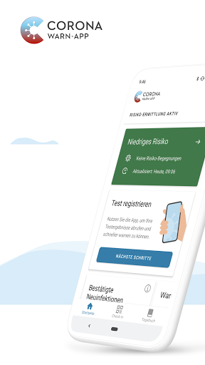  | 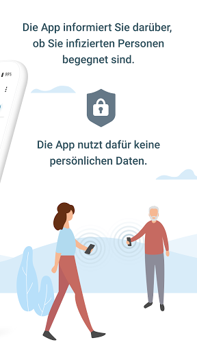  | 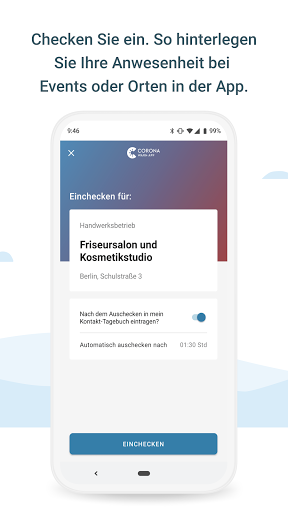  | 
 |   | 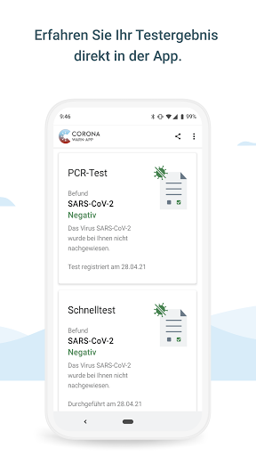  | 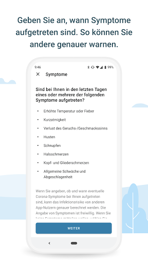  | 
 | 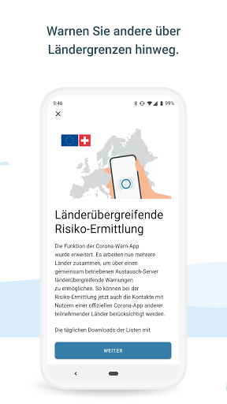  | 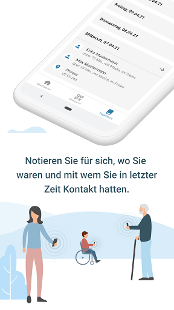 

## Development team
In the following we report the main information provided by the development team in the Google play store.

| | |
|-------------------------|-------------------------|
| **Developer**  | Robert Koch-Institut |
| **Website**  | [https://www.coronawarn.app](https://www.coronawarn.app) |
| **Email** | CoronaWarnApp@rki.de |
| **Physical address**  | [Robert Koch-Institut Nordufer 20 13353 Berlin](https://www.google.com/maps/search/Robert%20Koch-Institut%20Nordufer%2020%2013353%20Berlin) (Google Maps) |
| **Other developed apps**  | [https://play.google.com/store/apps/developer?id=Robert+Koch-Institut](https://play.google.com/store/apps/developer?id=Robert+Koch-Institut) |

## Android support

| | |
|-------------------------|-------------------------|
| **Declared target Android version**  | Android10, version 10 (API level 29) |
| **Effective target Android version**  | Android10, version 10 (API level 29) |
| **Minimum supported Android version**  | Marshmallow, version 6.0 (API level 23) |
| **Maximum target Android version**  | - |

The larger the difference between the minimum and maximum supported Android versions, the better. A larger difference means a wider audience. For example, old phones have a very low Android version, so a high minimum supported Android version means that the app cannot be used by users with old phones, thus leading to accessibility problems. 

## Requested permissions

In the following we report the complete list of the permissions requested by the app. 

| **Permission** | **Protection level** | **Description** | 
|-------------------------|-------------------------|-------------------------|
 **android.permission ACCESS_NETWORK_STATE** | Normal | Allows applications to access information about networks. 
 **android.permission BLUETOOTH** | Normal | Allows applications to connect to paired bluetooth devices. 
 **android.permission CAMERA** | :warning:**Dangerous** | Required to be able to access the camera device. 
 **android.permission FOREGROUND_SERVICE** | Normal | Allows a regular application to use Service.startForeground. 
 **android.permission INTERNET** | Normal | Allows applications to open network sockets. 
 **android.permission RECEIVE_BOOT_COMPLETED** | Normal | Allows an application to receive the Intent.ACTION_BOOT_COMPLETED that is broadcast after the system finishes booting. 
 **android.permission REQUEST_IGNORE_BATTERY_OPTIMIZATIONS** | Normal | Permission an application must hold in order to use Settings.ACTION_REQUEST_IGNORE_BATTERY_OPTIMIZATIONS. 
 **android.permission WAKE_LOCK** | Normal | Allows using PowerManager WakeLocks to keep processor from sleeping or screen from dimming. 

## Mentioned servers

| **Server** | **Registrant** | **Registrant country** | **Creation date** | 
|-------------------------|-------------------------|-------------------------|-------------------------|
 | google.com | Google LLC | :us: US | 1997-09-15 04:00:00 |
 | android.com | Google LLC | :us: US | 1997-06-23 04:00:00 |

## Security analysis 

Below we report the main security warnings raised by our execution of the [Androwarn](https://github.com/maaaaz/androwarn) security analysis tool.

**Connection interfaces exfiltration**
> - This application reads details about the currently active data network 
> - This application tries to find out if the currently active data network is metered 

**Telephony services abuse**
> - This application makes phone calls 

**Suspicious connection establishment**
> - This application opens a Socket and connects it to the remote address '; port is out of range' on the 'N/A' port  
> - This application opens a Socket and connects it to the remote address 'Lcom/android/tools/r8/GeneratedOutlineSupport;->outline26(Ljava/lang/String;)Ljava/lang/StringBuilder;' on the 'N/A' port  
> - This application opens a Socket and connects it to the remote address 'Ljava/net/Proxy;->type()Ljava/net/Proxy$Type;' on the 'N/A' port  
> - This application opens a Socket and connects it to the remote address 'Method sendUrgentData() is not supported.' on the 'N/A' port  
> - This application opens a Socket and connects it to the remote address 'Method setHandshakeTimeout() is not supported.' on the 'N/A' port  
> - This application opens a Socket and connects it to the remote address 'Method setOOBInline() is not supported.' on the 'N/A' port  
> - This application opens a Socket and connects it to the remote address 'Method setSoWriteTimeout() is not supported.' on the 'N/A' port  
> - This application opens a Socket and connects it to the remote address 'Socket closed' on the 'N/A' port  
> - This application opens a Socket and connects it to the remote address 'Socket is closed' on the 'N/A' port  
> - This application opens a Socket and connects it to the remote address 'Socket is closed.' on the 'N/A' port  
> - This application opens a Socket and connects it to the remote address 'Socket is not connected.' on the 'N/A' port  
> - This application opens a Socket and connects it to the remote address 'socket is closed' on the 'N/A' port  
> - This application opens a Socket and connects it to the remote address 'timeout' on the 'N/A' port  

**Code execution**
> - This application loads a native library 
> - This application loads a native library: 'conscrypt_gmscore_jni' 
> - This application loads a native library: 'conscrypt_jni' 

## User ratings and reviews

Below we provide information about how end users are reacting to the app in terms of ratings and reviews in the Google Play store.

### Ratings

The Corona-Warn-App app has been installed by more than **10000000** times. At this time, **122360** rated the app and its average score is **3.0781136**. Below we show the distribution of the ratings across the usual star-based rating of Google Play

:star::star::star::star::star:: 44836

:star::star::star::star:: 13821

:star::star::star:: 12046

:star::star:: 9379

:star:: 42278

### Reviews 

#### 5-star reviews

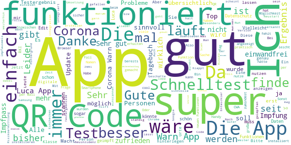

> Endlich!  :date: __2021-05-22 16:25:54__

> Gansgut  :date: __2021-05-22 16:03:27__

> Macht was sie soll. Aber warum wird ein registrierter noch gültiger Test vom Gerät gelöscht, wenn man versucht ihn ein zweites Mal auf dem gleichen Gerät zu registrieren. Habe es beim ersten Mal mit scannen des QR Code gemacht und dann beim zweiten Mal auf dem Handy über den Link direkt in die Corona App (zur Übung), dabei wurde die erste Registrierung dann gelöscht. Da steht zwar das man einen Test nur einmal Registrieren kann, aber das der bei einem zweiten Versuch gelöscht wird steht da nicht  :date: __2021-05-22 15:51:13__

> 👍  :date: __2021-05-22 15:19:23__

> Einfach und sehr gut .... Bis jetzt habe ich Gefallen.... Mich stört nur eins das man keine Persönlichen Angaben gibt sonst bis jetzt sehr gut. 😊  :date: __2021-05-22 14:59:17__

> Habe auch die Luca-App und auch das Tagebuch  :date: __2021-05-22 03:06:48__

> Gute privacy  :date: __2021-05-22 01:12:45__

> Ich feiere die App.  :date: __2021-05-22 00:35:31__

> Die App ansich ist echt gut entwickelt, aufgrund der Vielzahl der geimpften derzeit wäre noch eine Überlegung die Impfung mit in dem Programm zu implementieren. Natürlich nur möglich mit dem QR Code von der Terminbestätugung, aber wahrscheinlich nicht möglich, weil nicht ersichtlich ob die Leute auch da waren, aber vielleicht gibt es ja eine Möglichkeit. Vorteil wäre dass man nicht ständig den Impfpass mitführen muss.  :date: __2021-05-21 21:46:56__

> Es wäre noch gut wenn bei dem Schnelltest Ergebnis der Namen der getesteten Person stehen würde . Im Einzelhandel wird teilweise der Personalausweis verlangt um festzustellen ob man die getestete Person ist . Ansonsten ist die App sehr hilfreich und läuft einwandfrei  :date: __2021-05-21 20:32:30__

#### 4-star reviews

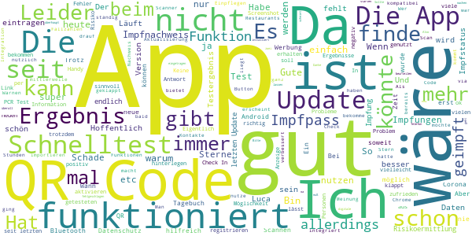

> Die App sollte nicht mitten in der Nacht Erinnerungen an die Aktualsieirung des Status generieren. Da schläft man nämlich normalerweise. Bis dann die Erinnerung lautstark hochpoppt.  :date: __2021-05-22 13:08:49__

> Als dezentrale Lösung zwischenzeitlich gut. Abzug, da die direkte Registrierung eines Schnelltests anscheinend nur über Chrome möglich ist.  :date: __2021-05-22 12:41:29__

> Läuft! Ein zusätzlicher Link in der App der direkt zu den aktuellsten, offiziellen Fallzahlen führt wäre hilfreich Update (Mai 2021): Dass die deutschlandweiten Fallzahlen mittlerweile enthalten sind ist gut. Allerdings hat doch mittlerweile wirklich jeder verstanden, dass besonders die lokalen Inzidenzwerte, etc. aus Sicht der Nutzer wichtig sind. Wieso bietet eine millionenschwere App eine derartige Funktion immer noch nicht nach 12+ Monaten Pandemie?!?  :date: __2021-05-22 12:08:34__

> Eigentlich ok vom Ansatz, man pflegt auch schön das Tagebuch etc. um mitzuhelfen. Leider enttäuscht die App beim Melden des Testergebnissen aus dem Labor. Das Ergebnis liegt schon 2 Tage vor, die App meint immer noch, kein Ergebnis. Vermutlich aber Fehler beim Labor.  :date: __2021-05-22 09:56:24__

> Da die Nutzerzahlen (ungleich Downloads!) lt. Zeit-Artikel sinken, sollte der Impfnachweis möglichst bald in dieser App integriert werden. Nicht unsonst kommen zu den Ärzten, die impfen, die Menschen in Scharen ... Der Sommerurlaub steht auf dem Spiel ;-) . Man muss sie bei ihren kleinen privaten Befindlichkeiten/Bedürfnissen packen!  :date: __2021-05-22 09:06:49__

> In Kombi mit Luca-App total ok  :date: __2021-05-22 08:36:47__

> Völlig verblüffend klappte heute neuerdings das halbautomatische Einpflegen eines negstiven Schnelltestes. Wobei das grundlegende Problem der Betreiber der Schnelltestplanung war.  :date: __2021-05-21 19:46:12__

> War beim Schnelltest und habe das Ergebnis runtergeladen. Scan des QR-Code aus der App schlug fehl ("nicht kompatibel"). Übertragung aus der Ergebnismitteilung des Testanbieters ging ebenfalls nicht (Klick auf "Ergebnis in die Corona-Warn-App übertragen" -> Ihr Browser ist nicht kompatibel. Browser gewechselt von Samsung auf Chrome, ging trotzdem nicht).  :date: __2021-05-21 14:37:13__

> Bin bis jetzt sehr zufrieden QR checkin werde ich noch testen  :date: __2021-05-21 14:35:43__

> Seit einigen Tagen werden die Risiko Daten nur einmal pro 24 Stunden aktualisiert , ist das so gewollt  :date: __2021-05-20 22:25:42__

#### 3-star reviews

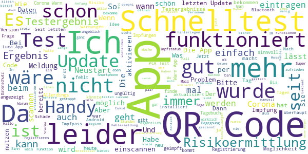

> Funktioniert nur mäßig Infektionsdaten bleiben auf dem Stand vom 20.03.21. Alle anderen Daten, z.B. Tagebuch, sind aktuell. Laden der App dauert ziemlich lang. Der Rest funktioniert soweit ich es abschätzen kann.  :date: __2021-05-22 00:10:07__

> Vor 3 Stunden einen Schnelltest registriert und gefreut, wie einfach und schnell alles ging. Beim erneuten Aufrufen (bei einer Veranstaltung) war das Ergebnis nicht mehr da. Super!  :date: __2021-05-21 18:57:12__

> App öffnet sich seit Update nicht mehr ?  :date: __2021-05-21 15:23:15__

> Weiterentwicklung ist schon ok, aber mir fehlen da noch sachen. Wie die Eingabe der Impfung zum Beispiel. Wenn wirklich nachgeimpft werden muss, wäre das doch sinnvoll. Und auch zur Ermittlung von Ansteckungsrisiken.  :date: __2021-05-21 13:47:51__

> Der QR Code der Teststelle liess sich nicht in die Corona-Warn-App einpflegen  :date: __2021-05-21 13:20:55__

> Ein aktuelles Testergebnis kann nicht einfach so in der App hinzugefügt werden. Zuerst ist man gezwungen, Google Chrome zu nutzen. Dann braucht man entweder einen Ausdruck vom QRC, oder muss diesen an ein anderes Smartphone senden, um von dort abzuscannen. In meinem Fall wurde auch das abgelehnt, da der QRC angeblich ungültig sei. In einer anderen App (Luca) war dies alles spielend leicht möglich. Weiter funktioniert die Risiko- Aktualisierung häufig nicht, und muss manuell angestoßen werden.  :date: __2021-05-21 11:58:44__

> Finde die App super und nutze sie auch, seitdem sie verfügbar ist. Toll auch, dass man seit Anfang Mai per QR-Code zum Test einchecken und das Testergebnis einlesen kann - theoretisch. ABER: Was nützt mir das im richtigen Leben, wenn ich am 19.5. zum DRK-Testzentrum in MR komme und da erfahre: "Check-In mit CWA geht bei uns nicht." Und: "QR-Code zum Testergebnis haben wir nicht." Wie soll ich hier 5 Sterne für die App vergeben, wenn die Funktionalität in der Praxis teilweise nicht nutzbar ist???  :date: __2021-05-21 07:40:10__

> Man weiß leider nicht bei Meldungen wo örtlich bzw.auch räumlich die Gefährdungen waren. Eine sog.Hot Spot Meldung fehlt einfach nach so vielen Tests die bisher gemacht wurden.  :date: __2021-05-21 06:52:23__

> Kann ich an den Orten wo ich mich mit der Luca App einchecke mit der Corona Warn App das selbe tun?  :date: __2021-05-20 22:01:10__

> Und wo ist bitte dieser Impfpass in der App?  :date: __2021-05-20 21:43:08__

#### 2-star reviews

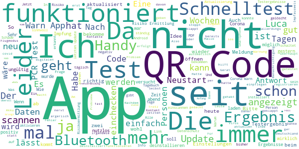

> 30.12.: funktioniert prima, das Tagebuch finde ich sehr sinnvoll. Update 21.05.21: neuerdings stellt sich die Risikoermittlung andauernd aus. Warum? Das war vorher nicht, als Einstellungen im Handy sind korrekt. Bitte beheben, sonst macht das keinen Sinn. Und gleich vorweg - Bluetooth, WLAN und /oder mobile Daten sind permanent an... 22.05. Auch ein weiterer Neustart bringt nichts.  :date: __2021-05-22 17:21:50__

> Es ist zu schwierig andere zu warnen! Und bei einer Nutzerzahl von im Schnitt 3000 Mann am Tag sinnlos zu installieren  :date: __2021-05-22 16:09:55__

> Ziemlich nutzlos, da die Datenauswertung nicht konsequent automatisch erfolgt.  :date: __2021-05-22 16:08:38__

> Hat bei mir einmal ewig geladene  :date: __2021-05-22 15:18:55__

> Leider enttäuschend! Nicht mal die dafür vorgesehenen QR Codes werden erkannt!  :date: __2021-05-22 13:44:06__

> Trotz abschalten der Benachrichtigung werde ich zugetextet. Glaube ich werde Deinstallation durchführen Wenn ich zu Hause bin und da bin ich fast immer, schalte ich BT aus um Strom zu sparen. Trotz Benachrichtigung aus in der App und Android kommt die nervige Meldung das meine Kontakte nicht ermittelt werden können. Wie ich bereits erwähnte ist das nicht möglich. Einstellungen werden ignoriert. Sei es in der App oder unter Android. Selbst wenn ich die App stoppen kommt der Müll  :date: __2021-05-22 12:08:14__

> Die Idee mit dem Scanner für Veranstaltung und Geschäft ist ja keine schlechte Idee nur das man für jeden scann sein 📱 neu starten muss kann nicht im Sinne des Nutzers sein  :date: __2021-05-22 11:07:51__

> Ok, konnte die App installieren. Meine Frau aber nicht: Die App funktionierte plötzlich nicht mehr, sie konnte durch nichts aktiviert werden. Also wurde sie deinstalliert. Die Neuinstallation funktionierte nicht. Sie war auf googleplay einfach nicht verfügbar. Eine Neuinstallation war somit nicht möglich. Ist bereits öfter passiert, Fehler konnte aber durch Neuinstallation behoben werden. Diesmal nicht. Da die App nun mehrmals unbemerkt ihren Dienst einstellte wird sie sie nicht mehr nutzen.  :date: __2021-05-21 19:01:56__

> Leider lassen sich Ergebnisse (negatives Testresultat) von Schnelltest-Zentren, trotz QR-Code, nicht einspielen. Wenig mehr nutzen gegenüber Start der APP. Seit Anfang habe ich diese APP installiert aber leider wenig Entwicklung...  :date: __2021-05-21 14:36:31__

> Kein einlesen von Luca - Codes, kein einlesen von Schnelltests, keine lokalen Inzidenzen, kein Impfnachweis... Momentan für mich relativ nutzlos. Update: Standart - Antwort auf JEDE kritische Anmerkung ist ebenfalls recht nutzlos und sinnfrei.  :date: __2021-05-21 13:27:14__

#### 1-star reviews

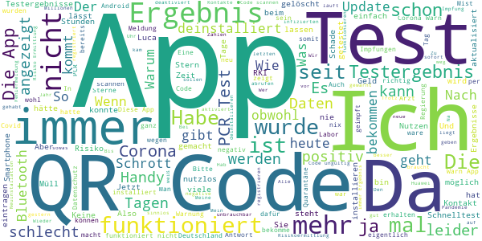

> Bin momentan beruflich in Bahrain, die dortige app funktioniert 10mal besser und vor allen Dingen einfacher. Die deutsche app wieder deinstalliert. Schande für solch ein Schrott made in Germany  :date: __2021-05-22 15:36:21__

> Der QR-Code meiner Schnelltests wird immer als ungültig gemeldet.  :date: __2021-05-22 15:28:45__

> Die App hat mir das Testergebnis des PCR Tests nicht angezeigt. Da erschien immer, Ergebnis liegt noch nicht vor. Ich bekam das Ergebnis dann per Post.  :date: __2021-05-22 14:40:18__

> Zu wenig Möglichkeiten und zu ungenau  :date: __2021-05-22 14:20:16__

> Schrott! Der "Nutzen" dieser App ist hinlänglich bekannt und diskutiert. Wenn man in einer Pandemie den Datenschutz vor die Kontaktnachverfolgung stellt, dann kommt eben ein zahnloser Tiger raus! Da bringt eine Luca-App für eine Kontaktnachverfolgung wesentlich größeren Nutzen! Und wenn man sein positives Ergebnis nicht mal einstellen kann, nur weil es bereits über die App Laborergebnis abgerufen wurde, dann kann man die App getrost dahin stellen wo sie hingehört - auf den Datenfriedhof!  :date: __2021-05-22 13:38:55__

> QR Ungültig :/  :date: __2021-05-22 12:17:54__

> Wäre eine gute App....wenn sie funktionieren würde, hab 4 Tage auf mein Ergebniss PCR- Test gewartet. Danach beim Gesundheitsamt angerufen die sagten Deinstalieren und alles noch einmal Instalieren da Fehlermeldung kam. Danach ging nichts mehr da der Code nicht erneut gescannt werden konnte.  :date: __2021-05-22 11:46:44__

> Wenn ich den Barcode meines Schnelltests einlesen will, erscheint die Fehlermeldung, dass dieser Code bereits anderweitig verwendet wurde. Obwohl ich mir den Code mit dem Testergebnis erst vom Testanbieter am PC anzeigen lasse. Für komme ich nicht an den Code heran.  :date: __2021-05-22 11:31:44__

> Für was brauch ich das wenn das Testergebnis nicht angezeigt wird. PCR test  :date: __2021-05-22 11:25:11__

> Ich fühle mich unwohl mit der App auf dem Handy. Die niedrige Bewertung und die bekannte Unzuverlässigkeit der Applikation, das ganzen löchrige System das dahintersteht fördert nicht das Vertrauen in die Stabilität, Sicherheit und Zuverlässigkeit dieser Applikation. Selbstverständlich wird versucht die hohe Investition zu rechtfertigen und die mangelhafte Struktur durch tägliches Flickwerk am Leben zu halten. Hoffen wir auf Besserung und sind allzeit vorsichtig und vorausschauend.  :date: __2021-05-22 11:13:50__

