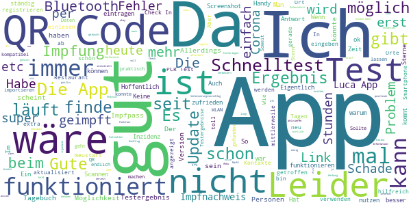
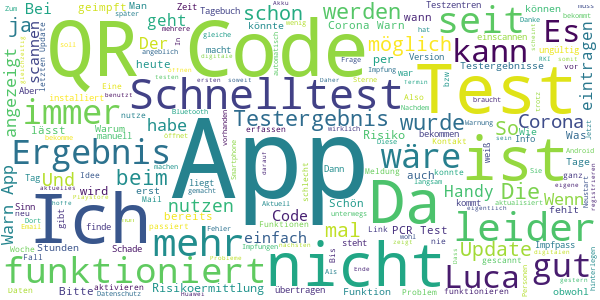

# Corona-Warn-App
App version ``2.2.1``

Analyzed with [covid-apps-observer](http://github.com/covid-apps-observer) project, version ``0.1``

## App overview
| | |
|-------------------------|-------------------------| 
| **Name**&nbsp;&nbsp;&nbsp;&nbsp;&nbsp;&nbsp;&nbsp;&nbsp;&nbsp;&nbsp;&nbsp;&nbsp;&nbsp;&nbsp;&nbsp;&nbsp;&nbsp;&nbsp;&nbsp;&nbsp;&nbsp;&nbsp;&nbsp;&nbsp;&nbsp;&nbsp;&nbsp;&nbsp;&nbsp;&nbsp;&nbsp;&nbsp;&nbsp;&nbsp;&nbsp;&nbsp;&nbsp;&nbsp;&nbsp;&nbsp;  | Corona-Warn-App |
| **Unique identifier** | de.rki.coronawarnapp |
| **Link to Google Play** | [https://play.google.com/store/apps/details?id=de.rki.coronawarnapp](https://play.google.com/store/apps/details?id=de.rki.coronawarnapp) |
| **Summary**  | Gemeinsam Corona bekämpfen |
| **Privacy policy** | [https://www.coronawarn.app/assets/documents/cwa-privacy-notice-de.pdf](https://www.coronawarn.app/assets/documents/cwa-privacy-notice-de.pdf) |
| **Latest version** | 2.2.1 |
| **Last update** | 2021-05-10 18:06:38 |
| **Recent changes** | Dieses Update bietet Ihnen neben Fehlerbehebungen folgende neue Funktionen:  - Aufzeichnung von Fehleranalyse-Protokollen Sie können nun im Rahmen des technischen Supports für die App ein Fehlerprotokoll erstellen, das die Analyse möglicher Fehler erleichtert und zu einer schnelleren Fehlerbehebung beitragen kann.  - Anlegen von Schnelltest-Profilen Mit dem Schnelltest-Profil kann die Teststelle Ihre persönlichen Daten schnell und einfach per QR-Code-Scan in das System übertragen. |
| **Installs**  | 10.000.000+ |
| **Category** | Gesundheit & Fitness |
| **First release** | 12.06.2020 |
| **Size**  | 16M |
| **Supported Android version**  | 6.0 oder höher |

### Description
> Das Robert Koch-Institut (RKI) als zentrale Einrichtung des Bundes im Bereich der Öffentlichen Gesundheit und als nationales Public-Health-Institut veröffentlicht die Corona-Warn-App für die deutsche Bundesregierung und für die Bundesrepublik Deutschland. Die App fungiert als digitale Ergänzung zu Abstandhalten, Hygiene und Alltagsmaske. Die App basiert auf Bluetooth-Technologie und der Exposure Notification API von Google. Wer sie nutzt, hilft, Infektionsketten schnell nachzuverfolgen und zu durchbrechen. Die App merkt sich dezentral unsere Begegnungen mit anderen und informiert uns digital, wenn wir Begegnungen mit nachweislich infizierten Personen hatten. Dabei sammelt sie jedoch zu keiner Zeit Informationen zur Identität ihrer Nutzerinnen und Nutzer. Wer wir sind und wo wir sind, bleibt geheim – und unsere Privatsphäre bestens geschützt.
 WIE DIE APP FUNKTIONIERT
 Die Risiko-Ermittlung der App ist das Herzstück der Software und sollte immer aktiviert sein. Wann immer sich Nutzerinnen und Nutzer begegnen, tauschen ihre Smartphones über Bluetooth verschlüsselte Zufalls-IDs aus.
 Diese geben nur Auskunft darüber, über welche Dauer und mit welchem Abstand eine Begegnung stattfand. Welche Person sich hinter einem Code verbirgt, ist für niemanden nachvollziehbar. Die Corona-Warn-App erhebt keine Informationen über den Ort der Begegnung oder den Standort der Nutzerinnen und Nutzer.
 Entsprechend der maximalen Corona-Inkubationszeit werden alle Zufalls-IDs, die unser Smartphone sammelt, für 14 Tage auf dem Smartphone gespeichert – und dann gelöscht.
 Nur wenn eine Person sich über die App freiwillig als nachweislich infiziert meldet, erhalten daraufhin alle früheren Begegnungen eine Warnung auf ihr Smartphone.
 Niemand erfährt, wann, wo oder mit wem eine entsprechende Risiko-Begegnung stattfand. Die infizierte Person bleibt anonym.
 Mit der Benachrichtigung erhalten die betroffenen Nutzer/-innen klare Handlungsempfehlungen. Wichtig: Auch die Daten der Benachrichtigten sind zu keiner Zeit einsehbar.
 WIE DIE DATEN SICHER BLEIBEN
 Die Corona-Warn-App soll uns zwar täglich begleiten, sie wird uns jedoch nie kennenlernen. Dadurch kann sie niemandem verraten, wer wir sind. Der Datenschutz bleibt über die gesamte Nutzungsdauer zu 100 Prozent gewahrt.
 • Keine Anmeldung: Es müssen keine E-Mail-Adresse und kein Name hinterlegt werden.
 • Keine Rückschlüsse auf Identitäten: Bei einer Begegnung mit einem anderen Menschen tauschen die Smartphones nur Zufalls-IDs aus. Diese messen, über welche Dauer und mit welchem Abstand ein Kontakt stattfand. Sie lassen aber keine Rückschlüsse auf Personen und Standorte zu.
 • Dezentrale Speicherung: Die Daten werden nur auf dem Smartphone gespeichert und nach 14 Tagen gelöscht.
 • Keine Einsicht für Dritte: Sowohl die Personen, die eine nachgewiesene Infektion melden, als auch die Benachrichtigten sind nicht nachverfolgbar – nicht für die Bundesregierung, nicht für das Robert Koch-Institut, nicht für andere User und auch nicht für die Betreiber der App-Stores.
 Diese App ist nicht zum Gebrauch außerhalb Deutschlands bestimmt. Die Corona-Warn-App ist die zentrale Corona-App für Deutschland und sie ist an das deutsche Gesundheitssystem angeschlossen. Trotzdem ist die Corona-Warn-App auch in diesem Land verfügbar. Sie ist gedacht für alle, die in Deutschland leben, arbeiten, Urlaub machen oder sich regelmäßig oder über längere Zeit in Deutschland aufhalten.
 Es gelten die Nutzungsbedingungen der Corona-Warn-App: https://www.coronawarn.app/assets/documents/cwa-eula-de.pdf. Durch die Installation und Nutzung dieser App stimmen Sie den Nutzungsbedingungen zu.

### User interface
The developers of the app provide the following screenshots in the Google play store.
| | | |
|:-------------------------:|:-------------------------:|:-------------------------:|
 |   |   |   | 
 |   |   |   | 
 |   |  

## Development team
In the following we report the main information provided by the development team in the Google play store.

| | |
|-------------------------|-------------------------|
| **Developer**  | Robert Koch-Institut |
| **Website**  | [https://www.coronawarn.app](https://www.coronawarn.app) |
| **Email** | CoronaWarnApp@rki.de |
| **Physical address**  | [Robert Koch-Institut Nordufer 20 13353 Berlin](https://www.google.com/maps/search/Robert%20Koch-Institut%20Nordufer%2020%2013353%20Berlin) (Google Maps) |
| **Other developed apps**  | [https://play.google.com/store/apps/developer?id=Robert+Koch-Institut](https://play.google.com/store/apps/developer?id=Robert+Koch-Institut) |

## Android support

| | |
|-------------------------|-------------------------|
| **Declared target Android version**  | Android10, version 10 (API level 29) |
| **Effective target Android version**  | Android10, version 10 (API level 29) |
| **Minimum supported Android version**  | Marshmallow, version 6.0 (API level 23) |
| **Maximum target Android version**  | - |

The larger the difference between the minimum and maximum supported Android versions, the better. A larger difference means a wider audience. For example, old phones have a very low Android version, so a high minimum supported Android version means that the app cannot be used by users with old phones, thus leading to accessibility problems. 

## Requested permissions

In the following we report the complete list of the permissions requested by the app. 

| **Permission** | **Protection level** | **Description** | 
|-------------------------|-------------------------|-------------------------|
 **android.permission ACCESS_NETWORK_STATE** | Normal | Allows applications to access information about networks. 
 **android.permission BLUETOOTH** | Normal | Allows applications to connect to paired bluetooth devices. 
 **android.permission CAMERA** | :warning:**Dangerous** | Required to be able to access the camera device. 
 **android.permission FOREGROUND_SERVICE** | Normal | Allows a regular application to use Service.startForeground. 
 **android.permission INTERNET** | Normal | Allows applications to open network sockets. 
 **android.permission RECEIVE_BOOT_COMPLETED** | Normal | Allows an application to receive the Intent.ACTION_BOOT_COMPLETED that is broadcast after the system finishes booting. 
 **android.permission REQUEST_IGNORE_BATTERY_OPTIMIZATIONS** | Normal | Permission an application must hold in order to use Settings.ACTION_REQUEST_IGNORE_BATTERY_OPTIMIZATIONS. 
 **android.permission WAKE_LOCK** | Normal | Allows using PowerManager WakeLocks to keep processor from sleeping or screen from dimming. 

## Mentioned servers

| **Server** | **Registrant** | **Registrant country** | **Creation date** | 
|-------------------------|-------------------------|-------------------------|-------------------------|
 | google.com | Google LLC | :us: US | 1997-09-15 04:00:00 |
 | android.com | Google LLC | :us: US | 1997-06-23 04:00:00 |

## Security analysis 

Below we report the main security warnings raised by our execution of the [Androwarn](https://github.com/maaaaz/androwarn) security analysis tool.

**Connection interfaces exfiltration**
> - This application reads details about the currently active data network 
> - This application tries to find out if the currently active data network is metered 

**Telephony services abuse**
> - This application makes phone calls 

**Suspicious connection establishment**
> - This application opens a Socket and connects it to the remote address '; port is out of range' on the 'N/A' port  
> - This application opens a Socket and connects it to the remote address 'Lcom/android/tools/r8/GeneratedOutlineSupport;->outline26(Ljava/lang/String;)Ljava/lang/StringBuilder;' on the 'N/A' port  
> - This application opens a Socket and connects it to the remote address 'Ljava/net/Proxy;->type()Ljava/net/Proxy$Type;' on the 'N/A' port  
> - This application opens a Socket and connects it to the remote address 'Method sendUrgentData() is not supported.' on the 'N/A' port  
> - This application opens a Socket and connects it to the remote address 'Method setHandshakeTimeout() is not supported.' on the 'N/A' port  
> - This application opens a Socket and connects it to the remote address 'Method setOOBInline() is not supported.' on the 'N/A' port  
> - This application opens a Socket and connects it to the remote address 'Method setSoWriteTimeout() is not supported.' on the 'N/A' port  
> - This application opens a Socket and connects it to the remote address 'Socket closed' on the 'N/A' port  
> - This application opens a Socket and connects it to the remote address 'Socket is closed' on the 'N/A' port  
> - This application opens a Socket and connects it to the remote address 'Socket is closed.' on the 'N/A' port  
> - This application opens a Socket and connects it to the remote address 'Socket is not connected.' on the 'N/A' port  
> - This application opens a Socket and connects it to the remote address 'socket is closed' on the 'N/A' port  
> - This application opens a Socket and connects it to the remote address 'timeout' on the 'N/A' port  

**Code execution**
> - This application loads a native library 
> - This application loads a native library: 'conscrypt_gmscore_jni' 
> - This application loads a native library: 'conscrypt_jni' 

## User ratings and reviews

Below we provide information about how end users are reacting to the app in terms of ratings and reviews in the Google Play store.

### Ratings

The Corona-Warn-App app has been installed by more than **10000000** times. At this time, **122360** rated the app and its average score is **3.0781136**. Below we show the distribution of the ratings across the usual star-based rating of Google Play

:star::star::star::star::star:: 44836

:star::star::star::star:: 13821

:star::star::star:: 12046

:star::star:: 9379

:star:: 42278

### Reviews 

#### 5-star reviews

> Tolle Sache sollte jeder auf sein Handy laden.  :date: __2021-06-06 13:12:01__

> Das Speichern von Schnelltests funktioniert gut und ist viel praktischer, als ständig mit irgendwelchen PDFs zu hantieren.  :date: __2021-06-05 18:20:57__

> Wann kann man seinen Impfstatus eintragen und Bereitstellen?  :date: __2021-06-05 11:35:01__

> Ok  :date: __2021-06-04 20:46:50__

> Komme gut mit derApp zurecht  :date: __2021-06-04 19:51:55__

> Sehr gute Erfahrungen  :date: __2021-06-04 13:00:00__

> Die Entwickler der Corona-Warn-App wählten den richtigen Ansatz -> dezentrale Speicherung von Informationen. Tipp: Fragt beim Shop/Restaurant, ob (neben der desaströsen Luca App) nicht auch der Check-in QR Code der Corona-Warn-App ausgehängt werden könnte!  :date: __2021-06-03 21:24:02__

> funktioniert seit dem ersten Tag und im Bekanntenkreis höre ich nichts anderes ... die niedrig wertenden Stimmen kann ich nicht nachvollziehen, häufig liest man da von App-fremden Beschwerden, was hier fehl am Platz ist ... sehr bedauerlich  :date: __2021-06-03 20:03:48__

> Sehr gute App  :date: __2021-06-03 19:10:46__

> Gelungen, gibt Sicherheit  :date: __2021-06-03 18:20:09__

#### 4-star reviews

> Finde die app hilft echt weiter wäre es vielleicht auch möglich das dann auch ein tragen kann das man geimpft ist  :date: __2021-06-06 14:55:18__

> Manche Testergebnisse nicht abrufbar 😏  :date: __2021-06-06 13:36:25__

> Bitte die eincheckfunktion mit der Luca App kompatibel machen. Update: Dank der Rückmeldung vom Entwickler habe ich dann doch noch die Möglichkeit gefunden einen Test in die App importieren zu lassen. War mein Fehler 😆  :date: __2021-06-05 20:39:17__

> Ich finde die App sehr praktisch, vorallem die Veranstaltungs-QR-Codes. Jedoch fände ich es toll, wenn es einen digitalen Impfpass schon in der App gäbe und wenn ich einen Landkreis Filter setzen könnte. Deswegen 4 Sterne.  :date: __2021-06-05 14:36:28__

> Im Moment aktualisiert sich meine App nicht, ich habe ständig die Daten von vor zwei Tagen vorliegen...  :date: __2021-06-05 06:20:01__

> Durch Updates besser geworden, mit vielen Menüpunkten. Leider liegen die Appbenutzer ihre Einträge schlecht, oder verwenden die App kaum, deshalb kaum nützlich!  :date: __2021-06-05 01:01:35__

> Gute und sinnvolle App um das Virus einzudemmen  :date: __2021-06-04 16:46:03__

> App funktioniert nicht mehr. Auch eine Neuinstallation konnte nicht helfen. Das Problem scheint an meinem WLAN gelegen zu haben. Ein Neustart und Auschalten des WLANs war erfolgreich. Die ist wieder einsatzfähig.🙂  :date: __2021-06-04 13:48:51__

> Kann man den QR-Code auch bei den BE.SAFE-Teststellen nutzen?  :date: __2021-06-04 13:46:16__

> Na toll endlich geht das mit der Testintegration .... super 👍  :date: __2021-06-04 10:54:07__

#### 3-star reviews

> Leider kann man nicht mehrere Schnelltesttermine in der App gleichzeitig verwalten. Es geht nur ein offener Termin. Das muss sich ändern.  :date: __2021-06-06 11:41:02__

> Nachtrag Juni 2021: Nachdem ich jetzt ein aktuelles Smartphone habe mit Android 11 scheint die Software zu funktionieren. Akku Verbrauch scheint auch nicht höher zu sein. Nutze dazu auch die Infos vom RKI und die Luca App, da leider jeder seine eigene Software rausbringt... Mal kucken wie das weiter geht mit den digitalen Impfpässen !!!  :date: __2021-06-06 11:23:50__

> Schade, dass das scannen von Luca Codes wohl noch nicht geht, wann wird das behoben?  :date: __2021-06-06 10:32:35__

> Leider wird bei mir das Testergebnis nicht in die App eingefügt. (Bei meinem Partner, der den gleichen Test zur selben Zeit machte schon) mir wird angezeigt, dass ich die Corona Warn App installieren soll... Klicke ich darauf öffnet sich der Playstore. Dort kann ich dir App dann öffnen... weiter passiert nichts. Beim Scannen des QR Codes wird angezeigt, dass der Code ungültig ist. App wurde bereits neu installiert und Handy neu gestartet.  :date: __2021-06-05 15:03:00__

> Habe heute das zweite mal meinen corona test auf die warn App geladen. Beim ersten mal hat es wunderbar funktioniert. Beim zweiten Mal war der registrierte test weg nachdem ich die warn App geschlossen habe. Wenn ich den überträgt von Email auf warn App wiederhole wird mir gesagt das der QR Code schon benutzt ist.  :date: __2021-06-05 13:08:43__

> Die App ansich ist nicht schlecht. Dass ein Test aber nur einmal gescannt werden kann, ist katastrophal, vor allem, wenn man keine Warnung hat, dass ein alter Test gelöscht werden muss, bevor ein neuer gescannt werden kann! So ist man echt angeschmiert, weil man ja den negativen PCR Test nicht vorzeigen kann.  :date: __2021-06-05 11:06:10__

> Ich muss sagen, Respekt an das RKI, ich sehe das hier auf so gut wie jede Rezension eingegangen wird und das respektiere ich extrem. Ich hoffe einfach das wir es bald hinter uns haben und bedanke mich für eure Mühe.  :date: __2021-06-05 07:53:20__

> Ich finde es total blöd, daß man hier dauerhaft Bluetooth anhaben muss, das kostet Akku ohne Ende, deshalb habe ich sie wieder entfernt, sehr nervig  :date: __2021-06-05 07:46:52__

> Eigentlich soweit zufrieden. Seit dem letzten Update schaltet sich aber die Risikoermittlung ständig aus und lässt sich über den Schieberegler auch nicht mehr aktivieren. Das passiert absolut willkürlich und es hilft nur die komplette Neuinstallation der App. Aktuelles Android auf einem Huawei P30 Pro. Probleme gab es vor dem letzten Update nicht.  :date: __2021-06-05 07:38:37__

> Da fehlt etwas in dieser Version der Corona-Warn-App, der sehr gravierend ist und somit ein potenzieller Fehler der jetzigen Corona-Warn-App Version darstellt. < Man kann keine 1. oder 2. Impfungen eintragen/registrieren/vermerken > •Und das am 05.06.2021• Bitte darüber mal nachdenken und überarbeiten bis zum nächsten Update der aktuelleren Version, den sonst müsste ich die App Ende Juni 2021 löschen, nach der 2. Impfung Darum nur 3 Sterne ++Bitte mit der aktuellen Zeit und Situation gehen++  :date: __2021-06-05 05:01:37__

#### 2-star reviews

> In welchen Testcenter wir die coronaapp akzeptiert?? Für die schnelltest?? bei be.safe ist es mit der app nicht möglich Eine Übersicht in der App von den Partnern wäre gut oder als Info danke für die schnelle antwort  :date: __2021-06-06 14:36:43__

> Diese App muss auf jeden Fall besser werden. Ein Test, wo das Ergebnis nach Tagen noch nicht angezeigt wird... Wirklich sinnvoll ist anders!  :date: __2021-06-06 11:42:54__

> Wirkungslos  :date: __2021-06-05 22:23:48__

> Wollte schon des öfteren Schnelltest Ergebnisse einscannen und wirklich jedesmal kam eine Fehlermeldung. Hab die App seit Anfang an, habe wirklich keine Ahnung ob es was bringt 😂😅  :date: __2021-06-05 20:04:09__

> Hilft denen, die nicht jedes Mal Ihre Daten händisch eingeben wollen. Negativ: Leute!!! Überall Papier sparen (Umwelt Umwelt hohoho) aber meine Ergebnisse kann ich nur durch abscannen ausgedruckter (!) Ergebnisse übertragen 🙈🙈🙈 Sorry, bissl arm, oder?  :date: __2021-06-05 19:07:47__

> Seit einiger Zeit stoppt die Risiko ermittlung automatisch. Wenn ich sie dann wieder anstelle, übernimmt sie die Einstellungen nicht. Nachdem mir empfohlen wurde das Handy runterzufahren, funktionierte die Risiko ermittlung tatsächlich wieder, jedoch muss ich das nun täglich machen, manchmal auch 2 mal am Tag, damit die App ordnungsgemäß funktioniert.  :date: __2021-06-05 18:20:01__

> Wie kann ich meine Ergebniss Downloaden und auf Englisch einstellen  :date: __2021-06-05 18:17:59__

> Nachdem die App nicht mehr zu öffnen war, hab ich diese gelöscht, um sie neu zu installieren. Hab nicht dran gedacht, dass die App mit nichts verknüpft ist. Also ist der registrierte Test weg. Datenschutz ist ja eine Sache, aber das man seine Daten nicht wieder bekommen kann, ist auch nicht wirklich praktisch...  :date: __2021-06-05 13:19:51__

> Zweckdienlich aber ansonsten total unnütz. Schwache Leistung. Es sollte vielleicht noch eine Option zur Einwilligung gelockertem Datenschutz geben. Damit die App sich auch mal entwickeln kann. So ist die App Spaß los.  :date: __2021-06-05 10:34:48__

> Seit mehreren WOCHEN ist der Wurm drin, d Risikoermittlung fällt annähernd täglich aus. Scheinbar werden auch ohne offizielle Releases Änderungen geschickt. Neustart behebt d Problem kurzfristig d Risikobewertung lässt sich wieder aktivieren, um dann ohne erkennbaren Grund erneut auszufallen. Fehlerprotokolle habe ich versendet. Zu 2.: Der Link leitet einen hier her u verlangt die Installation von CWA, die aber bereits installiert ist 😐, nicht nachzuvollziehen 2 statt 5 - sorry. \*\**RIP KULLO\*\**  :date: __2021-06-04 22:56:35__

#### 1-star reviews

> Weiß nicht wie sie funktioniert. Steht seit wochen immer das gleiche drauf mit gleichem Datum. Genau die App wird nicht mehr aktualisiert. Es bleibt immer der selbe Tag rot. Versuche die App neu zu starten.  :date: __2021-06-06 15:14:14__

> Der größte und teuerste Murks und rettet nicht ein Leben. Lächerliches Kontakttagebuch und gefakte Zahlen. Wir müssen mit dem Virus leben, aber bitte nicht in dieser ermächtigungsgesetzlichen Diktatur. Wer weiß überhaupt, dass das RKI eine sehr dunkle Vergangenheit in der NS-Zeit hat, zu der J. H. Hacker, Präsident des RKI 2008-2010, gesagt hat "Es war nicht nur wie überall, sondern schlimmer." Das wiederholt sich gerade. Hoffentlich darf dieses Verbrecher-RKI nicht so lange weiter machen.  :date: __2021-06-06 15:13:56__

> Einfach schlecht, weil alles bugt!  :date: __2021-06-06 14:32:38__

> Unter den Voraussetzungen, Tests, Maske, Termin, nur geimpft, genesen, werde ich auch in Zukunft bis auf LM mein Geld lieber Amazon, Netflix und Co geben, als dem stationären Einzelhandel, Kino und Restaurant und das auch nach Impfen. Meine Freundin ist positiv gewesen und keiner wurde gewarnt. Daher gab's mehr positive, als sein musste. Als Erkrankter hat man auch andere Sorgen, als Tan besorgen o. App füttern. Gesundheitsämter arbeiten lieber mit Luca App. CWA ist nicht kostenlos. Steuergeld!  :date: __2021-06-06 13:54:54__

> Trotz kontakt zu Positiven bleibt die App grün. Auch wenn ich den Ort und Name des Positiven eingebe  :date: __2021-06-06 12:41:20__

> Warnung funktioniert nicht. Am Arbeitsplatz gab es definitiv eine Begegnung. App war bei beiden installiert und aktiv, aber keinerlei Meldung.  :date: __2021-06-06 11:52:11__

> Habe heute ein negatives Ergebnis erhalten, und den QR-Code eingescannt. Der Testanbieter hat mir das Ergebnis des Schnelltestnach zwanzig Minuten mitgeteilt. Bis jetzt sagt mir die App, dass das Ergebnis noch nicht vorliegt. Edit: Aktualisieren? Wie bitte? Das ist der Ratschlag? Vielleicht noch das Telefon neu starten? Es funktioniert nicht. Leider wieder einmal  :date: __2021-06-06 11:49:08__

> QR Code lässt sich nicht einscannen  :date: __2021-06-06 10:11:15__

> Einfach unterirdisch  :date: __2021-06-06 10:01:42__

> Warnt nachts um halb drei obwohl ich schon 1 Woche das Haus nicht mehr verlassen habe, aber vor 2tagen Kontakt mit jemanden gehabt haben soll der positiv war  :date: __2021-06-06 08:23:49__

