# Corona-Warn-App
App version ``2.3.2``

Analyzed with [covid-apps-observer](http://github.com/covid-apps-observer) project, version ``0.1``

## App overview
| | |
|-------------------------|-------------------------| 
| **Name**&nbsp;&nbsp;&nbsp;&nbsp;&nbsp;&nbsp;&nbsp;&nbsp;&nbsp;&nbsp;&nbsp;&nbsp;&nbsp;&nbsp;&nbsp;&nbsp;&nbsp;&nbsp;&nbsp;&nbsp;&nbsp;&nbsp;&nbsp;&nbsp;&nbsp;&nbsp;&nbsp;&nbsp;&nbsp;&nbsp;&nbsp;&nbsp;&nbsp;&nbsp;&nbsp;&nbsp;&nbsp;&nbsp;&nbsp;&nbsp;  | Corona-Warn-App |
| **Unique identifier** | de.rki.coronawarnapp |
| **Link to Google Play** | [https://play.google.com/store/apps/details?id=de.rki.coronawarnapp](https://play.google.com/store/apps/details?id=de.rki.coronawarnapp) |
| **Summary**  | Gemeinsam Corona bekämpfen |
| **Privacy policy** | [https://www.coronawarn.app/assets/documents/cwa-privacy-notice-de.pdf](https://www.coronawarn.app/assets/documents/cwa-privacy-notice-de.pdf) |
| **Latest version** | 2.3.2 |
| **Last update** | 2021-06-01 18:05:33 |
| **Recent changes** | Mit diesem Update stellen wir Ihnen neben Fehlerbehebungen auch neue und erweiterte Funktionen zur Verfügung.  Sie können jetzt Ihre Impfzertifikate in der App hinzufügen und per QR-Code vorweisen. 14 Tage nach der letzten Impfung zeigt die App den vollständigen Impfschutz an. |
| **Installs**  | 10.000.000+ |
| **Category** | Gesundheit & Fitness |
| **First release** | 12.06.2020 |
| **Size**  | 16M |
| **Supported Android version**  | 6.0 oder höher |

### Description
> Das Robert Koch-Institut (RKI) als zentrale Einrichtung des Bundes im Bereich der Öffentlichen Gesundheit und als nationales Public-Health-Institut veröffentlicht die Corona-Warn-App für die deutsche Bundesregierung und für die Bundesrepublik Deutschland. Die App fungiert als digitale Ergänzung zu Abstandhalten, Hygiene und Alltagsmaske. Die App basiert auf Bluetooth-Technologie und der Exposure Notification API von Google. Wer sie nutzt, hilft, Infektionsketten schnell nachzuverfolgen und zu durchbrechen. Außerdem bietet die App eine Funktionalität, mit der Sie digitale Impfzertifikate hinzufügen können, um damit Ihren Impfstatus nachzuweisen. Die App merkt sich dezentral unsere Begegnungen mit anderen und informiert uns digital, wenn wir Begegnungen mit nachweislich infizierten Personen hatten. Dabei sammelt sie jedoch zu keiner Zeit Informationen zur Identität ihrer Nutzerinnen und Nutzer. Wer wir sind und wo wir sind, bleibt geheim – und unsere Privatsphäre bestens geschützt.
 WIE DIE APP FUNKTIONIERT
 Die Risiko-Ermittlung der App ist das Herzstück der Software und sollte immer aktiviert sein. Wann immer sich Nutzerinnen und Nutzer begegnen, tauschen ihre Smartphones über Bluetooth verschlüsselte Zufalls-IDs aus.
 Diese geben nur Auskunft darüber, über welche Dauer und mit welchem Abstand eine Begegnung stattfand. Welche Person sich hinter einem Code verbirgt, ist für niemanden nachvollziehbar. Die Corona-Warn-App erhebt keine Informationen über den Ort der Begegnung oder den Standort der Nutzerinnen und Nutzer.
 Entsprechend der maximalen Corona-Inkubationszeit werden alle Zufalls-IDs, die unser Smartphone sammelt, für 14 Tage auf dem Smartphone gespeichert – und dann gelöscht.
 Nur wenn eine Person sich über die App freiwillig als nachweislich infiziert meldet, erhalten daraufhin alle früheren Begegnungen eine Warnung auf ihr Smartphone.
 Niemand erfährt, wann, wo oder mit wem eine entsprechende Risiko-Begegnung stattfand. Die infizierte Person bleibt anonym.
 Mit der Benachrichtigung erhalten die betroffenen Nutzer/-innen klare Handlungsempfehlungen. Wichtig: Auch die Daten der Benachrichtigten sind zu keiner Zeit einsehbar.
 WIE DIE DATEN SICHER BLEIBEN
 Die Corona-Warn-App soll uns zwar täglich begleiten, sie wird uns jedoch nie kennenlernen. Dadurch kann sie niemandem verraten, wer wir sind. Der Datenschutz bleibt über die gesamte Nutzungsdauer zu 100 Prozent gewahrt.
 • Keine Anmeldung: Es müssen keine E-Mail-Adresse und kein Name hinterlegt werden.
 • Keine Rückschlüsse auf Identitäten: Bei einer Begegnung mit einem anderen Menschen tauschen die Smartphones nur Zufalls-IDs aus. Diese messen, über welche Dauer und mit welchem Abstand ein Kontakt stattfand. Sie lassen aber keine Rückschlüsse auf Personen und Standorte zu.
 • Dezentrale Speicherung: Die Daten werden nur auf dem Smartphone gespeichert und nach 14 Tagen gelöscht.
 • Keine Einsicht für Dritte: Sowohl die Personen, die eine nachgewiesene Infektion melden, als auch die Benachrichtigten sind nicht nachverfolgbar – nicht für die Bundesregierung, nicht für das Robert Koch-Institut, nicht für andere User und auch nicht für die Betreiber der App-Stores.
 Diese App ist nicht zum Gebrauch außerhalb Deutschlands bestimmt. Die Corona-Warn-App ist die zentrale Corona-App für Deutschland und sie ist an das deutsche Gesundheitssystem angeschlossen. Trotzdem ist die Corona-Warn-App auch in diesem Land verfügbar. Sie ist gedacht für alle, die in Deutschland leben, arbeiten, Urlaub machen oder sich regelmäßig oder über längere Zeit in Deutschland aufhalten.
 Es gelten die Nutzungsbedingungen der Corona-Warn-App: https://www.coronawarn.app/assets/documents/cwa-eula-de.pdf. Durch die Installation und Nutzung dieser App stimmen Sie den Nutzungsbedingungen zu.

### User interface
The developers of the app provide the following screenshots in the Google play store.
| | | |
|:-------------------------:|:-------------------------:|:-------------------------:|
 | 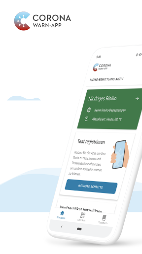  | 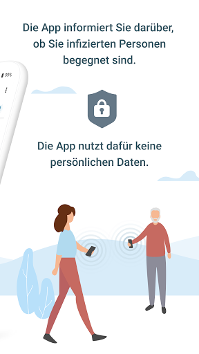  |   | 
 | 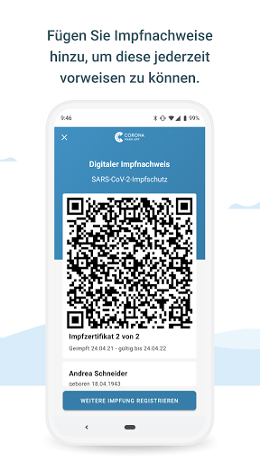  | 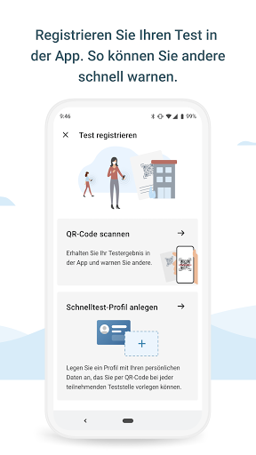  | 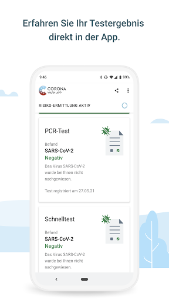  | 
 |   | 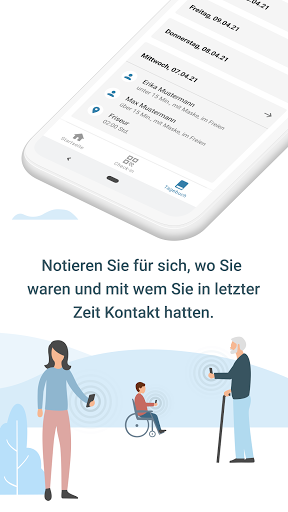 

## Development team
In the following we report the main information provided by the development team in the Google play store.

| | |
|-------------------------|-------------------------|
| **Developer**  | Robert Koch-Institut |
| **Website**  | [https://www.coronawarn.app](https://www.coronawarn.app) |
| **Email** | CoronaWarnApp@rki.de |
| **Physical address**  | [Robert Koch-Institut Nordufer 20 13353 Berlin](https://www.google.com/maps/search/Robert%20Koch-Institut%20Nordufer%2020%2013353%20Berlin) (Google Maps) |
| **Other developed apps**  | [https://play.google.com/store/apps/developer?id=Robert+Koch-Institut](https://play.google.com/store/apps/developer?id=Robert+Koch-Institut) |

## Android support

| | |
|-------------------------|-------------------------|
| **Declared target Android version**  | Android10, version 10 (API level 29) |
| **Effective target Android version**  | Android10, version 10 (API level 29) |
| **Minimum supported Android version**  | Marshmallow, version 6.0 (API level 23) |
| **Maximum target Android version**  | - |

The larger the difference between the minimum and maximum supported Android versions, the better. A larger difference means a wider audience. For example, old phones have a very low Android version, so a high minimum supported Android version means that the app cannot be used by users with old phones, thus leading to accessibility problems. 

## Requested permissions

In the following we report the complete list of the permissions requested by the app. 

| **Permission** | **Protection level** | **Description** | 
|-------------------------|-------------------------|-------------------------|
 **android.permission ACCESS_NETWORK_STATE** | Normal | Allows applications to access information about networks. 
 **android.permission BLUETOOTH** | Normal | Allows applications to connect to paired bluetooth devices. 
 **android.permission CAMERA** | :warning:**Dangerous** | Required to be able to access the camera device. 
 **android.permission FOREGROUND_SERVICE** | Normal | Allows a regular application to use Service.startForeground. 
 **android.permission INTERNET** | Normal | Allows applications to open network sockets. 
 **android.permission RECEIVE_BOOT_COMPLETED** | Normal | Allows an application to receive the Intent.ACTION_BOOT_COMPLETED that is broadcast after the system finishes booting. 
 **android.permission REQUEST_IGNORE_BATTERY_OPTIMIZATIONS** | Normal | Permission an application must hold in order to use Settings.ACTION_REQUEST_IGNORE_BATTERY_OPTIMIZATIONS. 
 **android.permission WAKE_LOCK** | Normal | Allows using PowerManager WakeLocks to keep processor from sleeping or screen from dimming. 

## Mentioned servers

| **Server** | **Registrant** | **Registrant country** | **Creation date** | 
|-------------------------|-------------------------|-------------------------|-------------------------|
 | google.com | Google LLC | :us: US | 1997-09-15 04:00:00 |
 | android.com | Google LLC | :us: US | 1997-06-23 04:00:00 |

## Security analysis 

Below we report the main security warnings raised by our execution of the [Androwarn](https://github.com/maaaaz/androwarn) security analysis tool.

**Connection interfaces exfiltration**
> - This application reads details about the currently active data network 
> - This application tries to find out if the currently active data network is metered 

**Telephony services abuse**
> - This application makes phone calls 

**Suspicious connection establishment**
> - This application opens a Socket and connects it to the remote address '; port is out of range' on the 'N/A' port  
> - This application opens a Socket and connects it to the remote address 'Lcom/android/tools/r8/GeneratedOutlineSupport;->outline42(Ljava/lang/String;)Ljava/lang/StringBuilder;' on the 'N/A' port  
> - This application opens a Socket and connects it to the remote address 'Ljava/net/Proxy;->type()Ljava/net/Proxy$Type;' on the 'N/A' port  
> - This application opens a Socket and connects it to the remote address 'Method sendUrgentData() is not supported.' on the 'N/A' port  
> - This application opens a Socket and connects it to the remote address 'Method setHandshakeTimeout() is not supported.' on the 'N/A' port  
> - This application opens a Socket and connects it to the remote address 'Method setOOBInline() is not supported.' on the 'N/A' port  
> - This application opens a Socket and connects it to the remote address 'Method setSoWriteTimeout() is not supported.' on the 'N/A' port  
> - This application opens a Socket and connects it to the remote address 'Socket closed' on the 'N/A' port  
> - This application opens a Socket and connects it to the remote address 'Socket is closed' on the 'N/A' port  
> - This application opens a Socket and connects it to the remote address 'Socket is closed.' on the 'N/A' port  
> - This application opens a Socket and connects it to the remote address 'Socket is not connected.' on the 'N/A' port  
> - This application opens a Socket and connects it to the remote address 'socket is closed' on the 'N/A' port  
> - This application opens a Socket and connects it to the remote address 'timeout' on the 'N/A' port  

**Code execution**
> - This application loads a native library 
> - This application loads a native library: 'conscrypt_gmscore_jni' 
> - This application loads a native library: 'conscrypt_jni' 

## User ratings and reviews

Below we provide information about how end users are reacting to the app in terms of ratings and reviews in the Google Play store.

### Ratings

The Corona-Warn-App app has been installed by more than **10000000** times. At this time, **124550** rated the app and its average score is **3.3045552**. Below we show the distribution of the ratings across the usual star-based rating of Google Play

:star::star::star::star::star:: 51399

:star::star::star::star:: 15040

:star::star::star:: 13317

:star::star:: 9683

:star:: 35111

### Reviews 

#### 5-star reviews

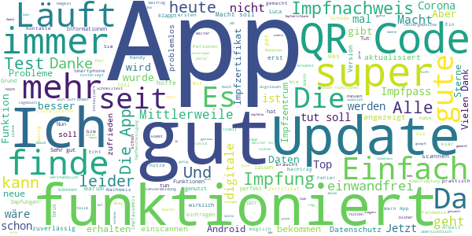

> Es ist eine gelungene Ergänzung, um wieder mehr Freiheiten zu erlangen und mit der App dafür zu sorgen, dass es auch so bleibt!👍👍  :date: __2021-06-11 13:45:25__

> einfache Handhabung, auch für Betriebe.  :date: __2021-06-11 13:39:48__

> Seit heute Fehler 3, keine Kommunikation möglich. Play Dienste 20.30.19 installiert. Warn App App heute gegen 14 Uhr geöffnet. Letzte Aktualisierung gestern gegen 10 Uhr. Auch die Tage davor ist mir aufgefallen, dass er nicht aktualisiert, wenn ich die App öffne und die Aktualisierung manuell anstoße. Ich dachte, die App aktualisiert automatisch im Hintergrund. // EDIT: Ich verwende bereits ENF 1.6. Fehler wird nicht mehr angezeigt. Dennoch aktualisiert sich die App nur einmal am Tag?Edit: Danke  :date: __2021-06-11 13:31:31__

> Macht das was sie soll. Hat auch die Impfnachweisfunktion. Gute Arbeit  :date: __2021-06-11 13:24:45__

> Beste Software überhaupt. Mehr braucht es nicht!  :date: __2021-06-11 13:11:15__

> Der QR Code Scan für das digitale Impfzertifikat funktioniert nicht. Möglicherweise ist der QR den ich vom Arzt erhalten habe zu klein?  :date: __2021-06-11 12:59:51__

> Digitaler Impfpass funktioniert. Die Impfzertifikate habe ich nach dem 2. Termin im Impfzentrum erhalten. Danach kurz die App aktualisiert und die Zertifikate problemlos eingescannt. Passt... ... Und bitte die IMPFZERTIFIKATE einscannen, nicht den Impfnachweis.  :date: __2021-06-11 12:58:42__

> Finde gut, dass man jetzt sogar Schnelltests hinterlegen kann, die Impfungen digital hinterlegt werden können und man sich bei Events registrieren kann. Vielen Dank, weiter so.  :date: __2021-06-11 12:57:31__

> Sehr gut und übersichtlich Bin sehr zufrieden damit.  :date: __2021-06-11 12:54:02__

> Macht genau was sie soll. Anonym BT Kontakte sammeln um die Infektionsketten eingrenzen zu können. Einfache Oberfläche und Bedienbarkeit. Nachtrag: QR Codes vom Impfzentrum, die für die App gemacht wurden, werden (noch) nicht erkannt.  :date: __2021-06-11 12:48:59__

#### 4-star reviews

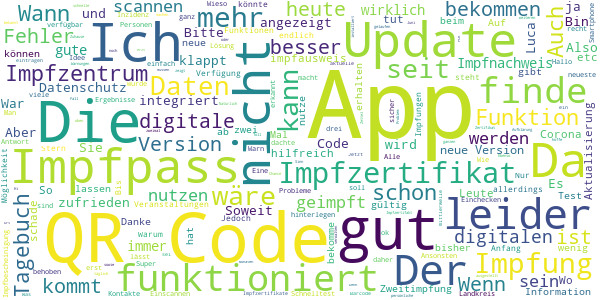

> Wo finde ich das Tagebuch zu der Corona-Warn-App.?  :date: __2021-06-11 13:46:46__

> Impfzertifikat ohne Probleme erstellt!  :date: __2021-06-11 12:31:23__

> App ist gut und tut was sie soll. Ich hoffe der digitale impfausweis fügt sich hier gut ein  :date: __2021-06-11 11:57:53__

> Antwort. Naja die Geschäfte brauche persönliche Daten Adresse etc das gibs hier nicht.  :date: __2021-06-11 11:45:56__

> Die Aktualisierung lässt sich nicht durchführen. Also kommt die Version 1.14 nicht. Die neuen Versionen haben die App merklich aufgewertet. Konnte heute sogar den EU-Impfpass, der auch vorliegt, einpflegen. Weiter so.  :date: __2021-06-11 11:09:35__

> Gut  :date: __2021-06-11 10:28:50__

> Ich finde die App ein gutes Hilfsmittel gegen Corona und finde es schade, dass es nicht mehr Leute nutzen. Denn je mehr Leute davon Gebrauch machen, desto genauer sind die Ergebnisse der App  :date: __2021-06-11 10:26:50__

> War hilfreich  :date: __2021-06-11 09:54:43__

> Verpasste Chance zur Aufklärung. Natürlich funktionieren die ganzen QR-Codes nicht, die man als zweites Impfzertifikat bei der Zweitimpfung erhalten hat, weil diese neu ausgestellt werden müssen. Nicht ohne Grund werden neue QR-Codes von den Impfzentren nach Hause geschickt oder muss sie bei Apotheken abholen... Eine einfache Erklärung auf der App vor dem Einscannen würde genügen. Die App hätte durch Videos so viel mehr Potenzial um zur Aufklärung von Falschinformationen beizutragen.  :date: __2021-06-11 09:42:48__

> Ich finde es gut, dass man mit der App die Schnelltest-Ergebnisse, sowie neuerdings das Impfzertifikat (noch nicht getestet), an einem Ort verwalten kann und sich die Entwickler offensichtlich große Mühe geben, die App möglichst übersichtlich zu gestalten. Ebenso gefällt mir, dass in der App die bundesweite 7-Tage-Inzidenz angezeigt wird. Toll wäre es, wenn man sich zusätzlich die Inzidenz von bis zu drei weiteren Landkreisen in der Kachelansicht anzeigen lassen könnte - wahlweise über GPS oder manuelle Ortsauswahl.  :date: __2021-06-11 09:35:22__

#### 3-star reviews

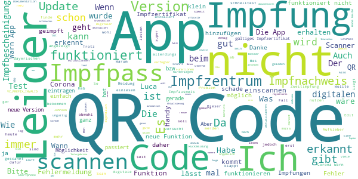

> Kein Code geht, wenn man auf die Homepage direkt geht kein Problem, in der Luca geht es auch nich  :date: __2021-06-11 13:44:50__

> Erkennt den QR Code nicht für die Impfung  :date: __2021-06-11 13:26:07__

> Kein Button erstellt.  :date: __2021-06-11 12:35:57__

> Der Scanner für den impfpass funktioniert nicht ,der liest nichts aus . ich habe einen anderen runter geladen weil ich dachte es liegt am Handy aber mit jedem anderen geht es . habe mit 3 Handys versucht aber der Scanner funktioniert nicht. Es ist kein Papier ,ich habe in meinem impfpass einen Aufkleber und da ist der qr code . ich wurde mit Johnson und johnson geimpft .  :date: __2021-06-11 11:59:56__

> Die App ist soweit gut,das ich darüber in Kenntnis gesetzt werde ob ich Kontakt zu Infizierten Personen hatte o. nicht. Auch die Funktion d.Tagebuchs, wo ich tägl.eintragen kann wo,mit wem ich mich getroffen habe +eigene Einträge machen kann,zur besseren Nachverfolgung. Es gibt jedoch Potential nach oben +auch Schwachstellen die überarbeitet werden müssten. Die neue Version Impfpass per QR-Code funktioniert nicht: FEHLER. Dieser QR-code ist kein gültiges Impfzertifikat.VC_PREFIX_INVALID  :date: __2021-06-11 10:39:31__

> Die App ansich ist nicht schlecht. Dass ein Test aber nur einmal gescannt werden kann, ist katastrophal, vor allem, wenn man keine Warnung hat, dass ein alter Test gelöscht werden muss, bevor ein neuer gescannt werden kann! So ist man echt angeschmiert, weil man ja den negativen PCR Test nicht vorzeigen kann. Zur Antwort: wenn man aber nicht weiß, dass man einen alten Test rauslöschen muss, ist das Mist! Außerdem kann nur 1 Test gescannt  :date: __2021-06-11 10:36:24__

> Leider klappt das scannen der QR-Codes nur schlecht (es dauert lange bis der Cider erkannt wird) im Falle des Nachverfolgens von Treffen/Veranstaltungen beim Impfnachweis geht es zZ gar nicht. Der Code auf dem Impfnachweis ist zu klein (10 mm) selbst bei VERGRÖßERUNG klappt es dann immer noch nicht. BITTE dringend nacharbeiten. Danke.  :date: __2021-06-11 10:12:01__

> Wann erhält man den aktuellen Download zur Registrierung der erfolgten Impfung? Mein Mann hatte sie schon Donnerstag, ich bis jetzt nicht. Hab die App daher deinstalliert und neu geladen, ohne Erfolg.  :date: __2021-06-11 09:08:39__

> Ich stelle mich hinten in der Reihe an... impfnachweiß... nicht einmal eine Meldung dass es erst Arzt, Apotheke etc noch ein Nachweis ausstellen muss... nach 1/2 Std vergeblich mittlerweile 4 QR-Codes zu scannen geb ich auf...  :date: __2021-06-11 09:05:38__

> Update gemacht, QR Code kann nicht eingelesen werden. Meldung: dieser QR Code ist kein gültiges Impfzertifikat. Der QR Code stammt vom Zettel des Impfzentrums. Was tun?  :date: __2021-06-11 08:52:24__

#### 2-star reviews

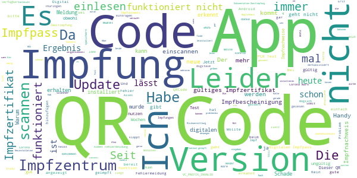

> Habe die Möglichkeit zum Hinzufügen des Impfzertifikats herbeigesehnt. Das Ergebnis ist leider enttäuschend: Der QR-Code meines Stickers ist zu klein. Die Kamera meines Handys kann nicht mehr fokussieren, bei der Nähe die nötig ist, um den Code im Fenster zu positionieren.  :date: __2021-06-11 13:45:23__

> Alles klar, danke für die Antwort. Hatte ich befürchtet, aber toll dass so MatrixCodes bei der Impfung aufgeklebt werden und nun noch mal irgendwer sich ne goldene Nase dran verdient zu verifizieren ob das auch seine Richtigkeit hat. Dann kann man ja auf die Covpass App warten und die WarnApp braucht man dann ja nicht mehr, hab die nun mal deinstalliert.  :date: __2021-06-11 13:27:00__

> Es scheint ein Problem mit der Android-Version der Corona-Warn-App zu geben. Wir hatten die Gelegenheit uns in Polen impfen zu lassen. Das dort auf Papier ausgestellte "EU Digital COVID Certificate" konnte ich über den QR-Code ohne Probleme mit der iOS-Version einlesen (Firmenhandy). Mit der Android-Version (privates Handy) allerdings erscheint die Meldung "Dieser QR-Code ist kein gültiges Impfzertifikat."  :date: __2021-06-11 12:18:05__

> Qr Code Eingabe funktioniert nicht!  :date: __2021-06-11 12:15:23__

> Mein QRCode gilt leider noch nicht als offizielle Impfbescheinigung und wird nicht eingelesen. Was mach ich denn, wenn ich nur diesen Code erhalten habe (vor ca 3 Wochen). Dann nützt mir ja die App nichts  :date: __2021-06-11 11:52:48__

> Wenn ich den Impf-code scannen will kommt Fehlermeldung. Auch sonst Preis/Leistung sehr schlecht. Armes Digital-Deutschland.  :date: __2021-06-11 11:00:48__

> Scannen der Impfbescheinigung nicht möglich. Fehlerbericht geht ebenfalls nicht.  :date: __2021-06-11 10:36:51__

> Meine Impfbescheinigung wird nicht angenommen da ungültig. Hoffe das wenigstens die Impfung an sich "Europakonform" war.  :date: __2021-06-11 09:48:17__

> Es ist immer noch schleierhaft, wozu die app gut sein soll. Leider ist die automatische Informationsweitergabe nicht nicht gegeben, Datenschutz sei gedankt.  :date: __2021-06-11 09:45:46__

> Habe es heute mehrmals versucht. Den oberen Code liest die app nicht ein, den unteren kassiert sie als ungültig. Impfzentrum in meinem Fall Fuerstenfeldbruck. Es ist ein Kreuz.  :date: __2021-06-11 09:19:59__

#### 1-star reviews

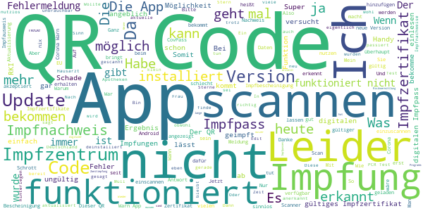

> Leider hatte mein Gesundheitsamt keinerlei Anweisung was mit einer roten Anzeige zu tun ist. Update 06/21: auch bei jetztigen PCR Tests kann mir kein Ergebnis angezeigt werden. Ich weiß von einem engen, positiven Kontakt über mehrere Tage und die App hat nur eine gerine Warnung ausgegeben... Was gar keinen Sinn macht! Die App ist somit wertlos für mich. Edit: Ja, das war der Fall, aber es gab nur eine grüne Warnung mit geringem Risiko.  :date: __2021-06-11 13:08:21__

> Tolle App, bei der es Glückssache ist ob das Ergebnis ankommt oder nicht. PCR Test wurde Montag früh gemacht, Mittwoch Abend immer noch kein Ergebnis, obwohl es dem Hausarzt bereits vorlag und negativ war. Das darf trotzdem nicht sein.  :date: __2021-06-11 13:05:29__

> QR Code funktioniert nicht  :date: __2021-06-11 12:19:24__

> Man kann den Nachweis als Genesener (QR-Code) nicht einscannen. Somit bringt die App für einige sehr viele Leite nichts, die eigentlich damit mehr Freiheit haben könnten  :date: __2021-06-11 12:15:56__

> Kann meinen QR Code nicht scannen. Für mich ist diese App Müll  :date: __2021-06-11 12:12:46__

> Ich habe 2 Impfungen in Frankreich erhalten ! Wollte nun den QR code einpflegen - geht nicht falscher QR Code wird gemeldet ! Aber der QR ist sicher richtig ! Was nun ? Bei TousAntiCovid geht es...  :date: __2021-06-11 12:02:12__

> Funktioniert mit den bisher ausgestellten Impfdokumenationen nicht (trotz vorhandem QR-Code) - so ist es sinnlos.  :date: __2021-06-11 11:46:16__

> QR Code wird nicht gescannt. Samsung Galaxy S7.  :date: __2021-06-11 11:29:43__

> Die Bewertungen passen. Wenn man absolute Harmlosigkeit und beinahe Unbrauchbarkeit anstrebt, dann 5 Sterne, wenn man Brauchbarkeit als Maßstab nimmt, dann max. 1 Sternchen... Inzwischen bin ich 2x geimpft im Impfzentru München. Habe 2 QR codes auf den Bescheinigungen und einen im Impfheft. KEINEN kann die App lesen...Made in Germany, made bei Spahn  :date: __2021-06-11 11:27:38__

> Leider funktioniert das Scannen von Impfung nicht!  :date: __2021-06-11 11:14:52__

