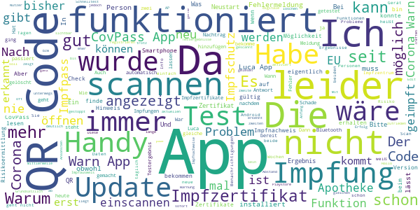

# Corona-Warn-App
App version ``2.3.4``

Analyzed with [covid-apps-observer](http://github.com/covid-apps-observer) project, version ``0.1``

## App overview
| | |
|-------------------------|-------------------------| 
| **Name**&nbsp;&nbsp;&nbsp;&nbsp;&nbsp;&nbsp;&nbsp;&nbsp;&nbsp;&nbsp;&nbsp;&nbsp;&nbsp;&nbsp;&nbsp;&nbsp;&nbsp;&nbsp;&nbsp;&nbsp;&nbsp;&nbsp;&nbsp;&nbsp;&nbsp;&nbsp;&nbsp;&nbsp;&nbsp;&nbsp;&nbsp;&nbsp;&nbsp;&nbsp;&nbsp;&nbsp;&nbsp;&nbsp;&nbsp;&nbsp;  | Corona-Warn-App |
| **Unique identifier** | de.rki.coronawarnapp |
| **Link to Google Play** | [https://play.google.com/store/apps/details?id=de.rki.coronawarnapp](https://play.google.com/store/apps/details?id=de.rki.coronawarnapp) |
| **Summary**  | Gemeinsam Corona bekämpfen |
| **Privacy policy** | [https://www.coronawarn.app/assets/documents/cwa-privacy-notice-de.pdf](https://www.coronawarn.app/assets/documents/cwa-privacy-notice-de.pdf) |
| **Latest version** | 2.3.4 |
| **Last update** | 2021-06-11 18:27:21 |
| **Recent changes** | Mit diesem Update beheben wir einen Fehler. |
| **Installs**  | 10.000.000+ |
| **Category** | Gesundheit & Fitness |
| **First release** | 12.06.2020 |
| **Size**  | 16M |
| **Supported Android version**  | 6.0 oder höher |

### Description
> Das Robert Koch-Institut (RKI) als zentrale Einrichtung des Bundes im Bereich der Öffentlichen Gesundheit und als nationales Public-Health-Institut veröffentlicht die Corona-Warn-App für die deutsche Bundesregierung und für die Bundesrepublik Deutschland. Die App fungiert als digitale Ergänzung zu Abstandhalten, Hygiene und Alltagsmaske. Die App basiert auf Bluetooth-Technologie und der Exposure Notification API von Google. Wer sie nutzt, hilft, Infektionsketten schnell nachzuverfolgen und zu durchbrechen. Außerdem bietet die App eine Funktionalität, mit der Sie digitale Impfzertifikate hinzufügen können, um damit Ihren Impfstatus nachzuweisen. Die App merkt sich dezentral unsere Begegnungen mit anderen und informiert uns digital, wenn wir Begegnungen mit nachweislich infizierten Personen hatten. Dabei sammelt sie jedoch zu keiner Zeit Informationen zur Identität ihrer Nutzerinnen und Nutzer. Wer wir sind und wo wir sind, bleibt geheim – und unsere Privatsphäre bestens geschützt.
 WIE DIE APP FUNKTIONIERT
 Die Risiko-Ermittlung der App ist das Herzstück der Software und sollte immer aktiviert sein. Wann immer sich Nutzerinnen und Nutzer begegnen, tauschen ihre Smartphones über Bluetooth verschlüsselte Zufalls-IDs aus.
 Diese geben nur Auskunft darüber, über welche Dauer und mit welchem Abstand eine Begegnung stattfand. Welche Person sich hinter einem Code verbirgt, ist für niemanden nachvollziehbar. Die Corona-Warn-App erhebt keine Informationen über den Ort der Begegnung oder den Standort der Nutzerinnen und Nutzer.
 Entsprechend der maximalen Corona-Inkubationszeit werden alle Zufalls-IDs, die unser Smartphone sammelt, für 14 Tage auf dem Smartphone gespeichert – und dann gelöscht.
 Nur wenn eine Person sich über die App freiwillig als nachweislich infiziert meldet, erhalten daraufhin alle früheren Begegnungen eine Warnung auf ihr Smartphone.
 Niemand erfährt, wann, wo oder mit wem eine entsprechende Risiko-Begegnung stattfand. Die infizierte Person bleibt anonym.
 Mit der Benachrichtigung erhalten die betroffenen Nutzer/-innen klare Handlungsempfehlungen. Wichtig: Auch die Daten der Benachrichtigten sind zu keiner Zeit einsehbar.
 WIE DIE DATEN SICHER BLEIBEN
 Die Corona-Warn-App soll uns zwar täglich begleiten, sie wird uns jedoch nie kennenlernen. Dadurch kann sie niemandem verraten, wer wir sind. Der Datenschutz bleibt über die gesamte Nutzungsdauer zu 100 Prozent gewahrt.
 • Keine Anmeldung: Es müssen keine E-Mail-Adresse und kein Name hinterlegt werden.
 • Keine Rückschlüsse auf Identitäten: Bei einer Begegnung mit einem anderen Menschen tauschen die Smartphones nur Zufalls-IDs aus. Diese messen, über welche Dauer und mit welchem Abstand ein Kontakt stattfand. Sie lassen aber keine Rückschlüsse auf Personen und Standorte zu.
 • Dezentrale Speicherung: Die Daten werden nur auf dem Smartphone gespeichert und nach 14 Tagen gelöscht.
 • Keine Einsicht für Dritte: Sowohl die Personen, die eine nachgewiesene Infektion melden, als auch die Benachrichtigten sind nicht nachverfolgbar – nicht für die Bundesregierung, nicht für das Robert Koch-Institut, nicht für andere User und auch nicht für die Betreiber der App-Stores.
 Diese App ist nicht zum Gebrauch außerhalb Deutschlands bestimmt. Die Corona-Warn-App ist die zentrale Corona-App für Deutschland und sie ist an das deutsche Gesundheitssystem angeschlossen. Trotzdem ist die Corona-Warn-App auch in diesem Land verfügbar. Sie ist gedacht für alle, die in Deutschland leben, arbeiten, Urlaub machen oder sich regelmäßig oder über längere Zeit in Deutschland aufhalten.
 Es gelten die Nutzungsbedingungen der Corona-Warn-App: https://www.coronawarn.app/assets/documents/cwa-eula-de.pdf. Durch die Installation und Nutzung dieser App stimmen Sie den Nutzungsbedingungen zu.

### User interface
The developers of the app provide the following screenshots in the Google play store.
| | | |
|:-------------------------:|:-------------------------:|:-------------------------:|
 |   |   |   | 
 |   |   |   | 
 |   |  

## Development team
In the following we report the main information provided by the development team in the Google play store.

| | |
|-------------------------|-------------------------|
| **Developer**  | Robert Koch-Institut |
| **Website**  | [https://www.coronawarn.app](https://www.coronawarn.app) |
| **Email** | CoronaWarnApp@rki.de |
| **Physical address**  | [Robert Koch-Institut Nordufer 20 13353 Berlin](https://www.google.com/maps/search/Robert%20Koch-Institut%20Nordufer%2020%2013353%20Berlin) (Google Maps) |
| **Other developed apps**  | [https://play.google.com/store/apps/developer?id=Robert+Koch-Institut](https://play.google.com/store/apps/developer?id=Robert+Koch-Institut) |

## Android support

| | |
|-------------------------|-------------------------|
| **Declared target Android version**  | Android10, version 10 (API level 29) |
| **Effective target Android version**  | Android10, version 10 (API level 29) |
| **Minimum supported Android version**  | Marshmallow, version 6.0 (API level 23) |
| **Maximum target Android version**  | - |

The larger the difference between the minimum and maximum supported Android versions, the better. A larger difference means a wider audience. For example, old phones have a very low Android version, so a high minimum supported Android version means that the app cannot be used by users with old phones, thus leading to accessibility problems. 

## Requested permissions

In the following we report the complete list of the permissions requested by the app. 

| **Permission** | **Protection level** | **Description** | 
|-------------------------|-------------------------|-------------------------|
 **android.permission ACCESS_NETWORK_STATE** | Normal | Allows applications to access information about networks. 
 **android.permission BLUETOOTH** | Normal | Allows applications to connect to paired bluetooth devices. 
 **android.permission CAMERA** | :warning:**Dangerous** | Required to be able to access the camera device. 
 **android.permission FOREGROUND_SERVICE** | Normal | Allows a regular application to use Service.startForeground. 
 **android.permission INTERNET** | Normal | Allows applications to open network sockets. 
 **android.permission RECEIVE_BOOT_COMPLETED** | Normal | Allows an application to receive the Intent.ACTION_BOOT_COMPLETED that is broadcast after the system finishes booting. 
 **android.permission REQUEST_IGNORE_BATTERY_OPTIMIZATIONS** | Normal | Permission an application must hold in order to use Settings.ACTION_REQUEST_IGNORE_BATTERY_OPTIMIZATIONS. 
 **android.permission WAKE_LOCK** | Normal | Allows using PowerManager WakeLocks to keep processor from sleeping or screen from dimming. 

## Mentioned servers

| **Server** | **Registrant** | **Registrant country** | **Creation date** | 
|-------------------------|-------------------------|-------------------------|-------------------------|
 | google.com | Google LLC | :us: US | 1997-09-15 04:00:00 |
 | android.com | Google LLC | :us: US | 1997-06-23 04:00:00 |

## Security analysis 

Below we report the main security warnings raised by our execution of the [Androwarn](https://github.com/maaaaz/androwarn) security analysis tool.

**Connection interfaces exfiltration**
> - This application reads details about the currently active data network 
> - This application tries to find out if the currently active data network is metered 

**Telephony services abuse**
> - This application makes phone calls 

**Suspicious connection establishment**
> - This application opens a Socket and connects it to the remote address '; port is out of range' on the 'N/A' port  
> - This application opens a Socket and connects it to the remote address 'Lcom/android/tools/r8/GeneratedOutlineSupport;->outline42(Ljava/lang/String;)Ljava/lang/StringBuilder;' on the 'N/A' port  
> - This application opens a Socket and connects it to the remote address 'Ljava/net/Proxy;->type()Ljava/net/Proxy$Type;' on the 'N/A' port  
> - This application opens a Socket and connects it to the remote address 'Method sendUrgentData() is not supported.' on the 'N/A' port  
> - This application opens a Socket and connects it to the remote address 'Method setHandshakeTimeout() is not supported.' on the 'N/A' port  
> - This application opens a Socket and connects it to the remote address 'Method setOOBInline() is not supported.' on the 'N/A' port  
> - This application opens a Socket and connects it to the remote address 'Method setSoWriteTimeout() is not supported.' on the 'N/A' port  
> - This application opens a Socket and connects it to the remote address 'Socket closed' on the 'N/A' port  
> - This application opens a Socket and connects it to the remote address 'Socket is closed' on the 'N/A' port  
> - This application opens a Socket and connects it to the remote address 'Socket is closed.' on the 'N/A' port  
> - This application opens a Socket and connects it to the remote address 'Socket is not connected.' on the 'N/A' port  
> - This application opens a Socket and connects it to the remote address 'socket is closed' on the 'N/A' port  
> - This application opens a Socket and connects it to the remote address 'timeout' on the 'N/A' port  

**Code execution**
> - This application loads a native library 
> - This application loads a native library: 'conscrypt_gmscore_jni' 
> - This application loads a native library: 'conscrypt_jni' 

## User ratings and reviews

Below we provide information about how end users are reacting to the app in terms of ratings and reviews in the Google Play store.

### Ratings

The Corona-Warn-App app has been installed by more than **10000000** times. At this time, **126918** rated the app and its average score is **3.407477**. Below we show the distribution of the ratings across the usual star-based rating of Google Play

:star::star::star::star::star:: 54883

:star::star::star::star:: 16140

:star::star::star:: 13986

:star::star:: 9628

:star:: 32281

### Reviews 

#### 5-star reviews

> Sehr gut Empfehlenswert.  :date: __2021-06-26 18:33:18__

> Alles gut geklappt...  :date: __2021-06-26 17:13:02__

> Bisher sehr zufrieden. Kann man auch die Impfzertifikate von unterschiedlichen Personen einscannen?  :date: __2021-06-26 15:45:06__

> Super App, Test- und Impfungsimplementierung funktionieren perfekt.  :date: __2021-06-26 15:37:41__

> Von Anfang an Gut gelaufen bis heute plötzlich den 26-6 funktioniert der Risiko Ermittlungen riegel nicht, springt ständig auf gestoppt zurück, und so bringt diese App mir garnichts mehr, ausserdem wäre es von Vorteil wenigstens 2 QR Code darin zu speichern, weil der andere Partner kein mobile besitzt  :date: __2021-06-26 14:21:49__

> Ich finde die App prima und möchte mich mal beim RKI ganz herzlich für alle Arbeit bedanken. Viele Grüße, D.F.  :date: __2021-06-26 13:41:33__

> Läuft sehr gut  :date: __2021-06-26 12:25:06__

> Bisher gute App. Nutze sie seit Beginn. Habe sie heute kurz deinstalliert und dann wieder neu installiert. Kann nur eine Impfung erfassen und zwar die zweite. Hoffe dass das so in Ordnung ist. Der vollständige Impfschutz wird mit Haken ja bestätigt.  :date: __2021-06-26 12:20:31__

> Bin Nutzer der ersten Stunde. Die App macht was sie soll und die Erweiterungen sind bisher gut. Ich Nutze sie täglich um z.B. das Kontakttagebuch zu führen. Für mich bisher eine der besten "Staats-"App die es gibt. Die App vom DWD ist noch besser.  :date: __2021-06-26 12:05:47__

> Edit: Heute das "Einchecken" probiert. Der QR-Code, der laminiert (geringe (!) Reflexion) und leicht (!) wellig aufgehängt wurde, wurde NICHT erkannt. Vom fremden Handy aus den QR-Code scannen ging problemlos. Edit: Ich habe ewig gebraucht, das Impfzertifikat einzulesen. Problem: Das Feld, auf das man draufklicken soll, ist nicht als "Button" erkennbar.  :date: __2021-06-26 11:23:43__

#### 4-star reviews

> Nach dem neuesten Update ist der bereits eingescannte Impfnachweis verschwunden!!! Korrektur: Der Impfnachweis ist jetzt unter "Zertifikate" zu finden. Alles in Ordnung.  :date: __2021-06-26 18:18:57__

> Das impfzertifikat sollte man schneller zugänglich machen. Als Widget auf dem Start-Screen vielleicht.  :date: __2021-06-26 17:35:11__

> Mir fehlt immer noch, daß die App auch mit dem Gesundheitsamt die Daten weiter gibt.  :date: __2021-06-26 12:30:03__

> Ich finde die App im Prinzip gut und unterstütze diese ausdrücklich. Auch der Datenschutz ist vorbildlich. Also erstmal vielen Dank! In der Android-Version scheint jedoch ein Problem mit der Berechnung des Impfstatus vorzuliegen. \*\** Letzte Impfung: Samstag 12.06.2021 \*\** Vollständiger Impfschutz wird wie folgt angezeigt: \*\** Corona-Warn-App (Android): Samstag 26.06.2021 \*\** Corona-Warn-App (iOS): Sonntag 27.06.2021 \*\** CovPass (Android): Sonntag 27.06.2021 \*\** CovPass (iOS): Sonntag 27.06.2021.  :date: __2021-06-26 12:16:45__

> Wird besser, aber bleibt wegen Vorrang Datenschutz unter den Möglichkeiten!  :date: __2021-06-26 11:17:33__

> Muss mich für meine erste Bewertung entschuldigen, lag an der Arztpraxis die den QR Code ausgedruckt hat. Dieser Ausdruck war so schlecht das die App ihn nicht erkannt hat. Habe mir Heute in der Apotheke einen neuen QR Code geholt und gescannt. Funktionierte auf sofort. Orry noch einmal  :date: __2021-06-26 10:30:13__

> Mittlerweile immer mehr gute Funktionen, z.B. Impfnachweis und, ganz praktisch, Veranstaltungen. Man generiert QR-Code für eine Veranstaltung (Musikprobe) und alle speichern den Code; sehr einfach und nützlich.  :date: __2021-06-26 10:22:02__

> Seit dem Update erscheint der Impfnachweis nicht mehr auf der Startseite. Vor dem Update war der Impfnachweis direkt unter der Risikoermittlung das fand ich viel besser.  :date: __2021-06-26 10:02:44__

> Tut was es soll  :date: __2021-06-26 07:40:46__

> Impfzertifikat eingescannt, 2 Tage später ist es wieder weg? Häh?  :date: __2021-06-26 07:30:20__

#### 3-star reviews

> Die frisch eingescannten Impfcodes,wurden durch das heutige Update total gelöscht.Extra mir die Mühe gemacht,und die besorgt,und nun sind sie weg.  :date: __2021-06-26 17:35:08__

> Das digitale Testzertifikat ist nach über einer Stunde (noch?) nicht abrufbar. Wie lange kann es dauern bis das digitale EU Testzertifikat in der app angezeigt wird?  :date: __2021-06-26 17:32:10__

> Meine beiden Impfungen waren eingescannt, nach dem Update sind sie weg und die App akzeptiert auch keine erneuten Scan.  :date: __2021-06-26 16:11:33__

> Das Verschieben des Impfnachweises von der Startseite ist ein Griff ins Klo :) Was haltet ihr davon, dass ihr die ganzen Statistikendaten (R-Wert, Inzidenz usw.) Auf eine Seite packt und auf der Startseite die Dinge aufführt, die man jeden Tag braucht? App öffnen, Impfnachweis oder Testergebnis sofort in der Anzeige.  :date: __2021-06-26 15:15:19__

> Funktionen werden immer wieder ausgeweitet. Warum wird nicht wie in der CovPass App ein QR Code für den Impfschutz angezeigt sondern nur die einzelnen Impfungen?  :date: __2021-06-26 11:09:24__

> Warum kann ich nur mein Impfzertifikat einscannen und nicht zusätzlich das meiner Frau?  :date: __2021-06-26 11:03:43__

> Nach Smartphone-Wechsel und Datenübertragung bei Neueinrichtung wird das Tagebuch nicht übernommen.  :date: __2021-06-26 09:17:39__

> Warum gibt es keinen Hinweis durch die App wenn es ein Update gibt? Diese müssen immer manuell durchgeführt werden . Bei der aktuellen Version wird auch keine Update Möglichkeit im Playstore angeboten. Nur Öffnen und deinstallieren ist möglich. PS:Die Funktion "Automatische Updates" ist im Playstore aktiviert  :date: __2021-06-26 09:07:19__

> Okay, an app muss sein  :date: __2021-06-26 09:06:19__

> 26.06.2021 Leider verschlimmbessert.Impfzertifikat ist nicht gleich sichtbar bei Öffnung der App, muss erst suchen.  :date: __2021-06-26 09:05:40__

#### 2-star reviews

> Neuerdings nervt es, leider. Seit einiger Zeit meldet sich diese App ständig grundlos und erinnert mich daran, daß es sie gibt. Dabei öffnete ich sie zuletzt schon mehrfach, bloß damit diese dumme Meldung nicht mehr kommt. Sie erscheint trotzdem. Mitzuteilen hatte sie mir in dem knappen Jahr Nutzungsdauer nie etwas anderes, als daß das Risiko gering sei. Habe sie heute deinstalliert. Was sollen diese nervigen Erinnerungen? Die App kann sich doch einfach erst dann melden, wenn ein Risiko besteht.  :date: __2021-06-26 18:41:29__

> Eigentlich sollte man mit der App auch das Zertifikat des Partners einscannen können, wird aber leider von der App verhindert. Auch frage ich mich, warum die Kontakte bereits nach 14 Tagen gelöscht werden. Wer Covid nicht rechtzeitig erkennt und warnt, macht das dann häufig zu spät. Meine Verwandschaft hat die App inzwischen gelöscht, da leider unbrauchbar.  :date: __2021-06-26 18:13:48__

> Habe QR Code vom Impfzertifikat eingesannct jetzt finde ich es nicht mehr.  :date: __2021-06-26 16:50:04__

> leider ist es nicht möglich, mit einem aktuellen Smartphone, OnePlus 8 Pro, den QR-Code auf dem Ersatzformular zur Dokumentation der Durchgeführten Impfung zu scannen.  :date: __2021-06-26 16:16:14__

> Fehler 39508 auf Moto G play! Gerade jetzt wären wir froh, wenn die App funktionieren würde! 1. UPDATE: Jetzt funktioniert sie! Deshalb neue Bewertung. 2. UPDATE: Heute morgen war ich noch "vollständig geimpft", jetzt nicht mehr, "sondern vollständiger Impfschutz in null Tagen", also noch kein Impfschutz. Daher: Runter auf 2 Sterne.  :date: __2021-06-26 15:54:13__

> Na ja geht so!!!! Schnelltest kann man nicht den QR Code einlesen. Immer Fehlermeldung! Dann ist die App recht unnütz um jemanden seinen Schnelltest zu zeigen.  :date: __2021-06-26 14:11:00__

> Ich wurde jetzt geimpft, kann jedoch den kleinen QR-Code in meinem Impfheft nicht einscannen. Ich hoffe, daran wird gearbeitet? Da dies für mich persönlich das Nützlichste an der App wäre, ist meine Bewertung jetzt stark gesunken. Sobald dies funktioniert, gibt's wieder 5 Sterne.  :date: __2021-06-26 13:59:08__

> Ich kann mich anderen Bewertungen nur anschließen. Die ständigen Erinnerungen den Status zu überprüfen nerven nur stören beim Kundengesprächen. Und das obwohl ich die Erinnerungen abgeschaltet habe. Das ist Mist  :date: __2021-06-26 12:01:00__

> Seit gestern erscheint immer der Hinweis: Risikoermittling gestoppt. Auch nach dem Aktivieren ändert sich das nicht  :date: __2021-06-26 09:42:39__

> Für Schnelltests ungeeignet. Der Test wird nach 48 Stunden automatisch aus der App gelöscht. Für z.B. Grenzpendler werden aber 72 Stunden akzeptiert. Das heißt, wer sich auf die App verlässt steht nach 48 Stunden plötzlich ohne Testergebnis da.  :date: __2021-06-26 09:35:15__

#### 1-star reviews

> Durch das Update heute morgen ist die Möglichkeit, ein Impfzertifikat zu hinterlegen, verschwunden.  :date: __2021-06-26 18:29:53__

> Zu wenig Aussage kräftig. Grad mit Blick auf die Delta Variante! Eigentlich genau wie am Anfang - wenig nützlich.  :date: __2021-06-26 18:28:25__

> Leider wieder keine Verbesserung nach dem Update: 1.Check- in wird nicht gespeichert, keine History möglich. Der Check-in selbst funktioniert problemlos, aber das war es dann auch schon. Nachverfolgen so nicht möglich. 2. Die Übermittlung der Testergebnisse durch einscannen des Codes ist eher untauglich. Da die Tests online gebucht wurden, liegt der QR Code natürlich digital vor, die App ermöglicht das einlesen aus Dateien aber nicht. Dadurch kann das Ergebnis so nicht abgerufen werden.  :date: __2021-06-26 17:40:58__

> Der QR Code des Impfnachweises lässt sich nicht einscannen  :date: __2021-06-26 16:20:14__

> Nach einigen Tagen wird die automatische Risikoermittlung von der App selbst gestoppt und kann auch nicht mehr in der App aktiviert werden. Es hilft nur eine völlige Deinstallation, bei der sämtliche Daten verloren gehen, und eine anschließende Neuinstallation, auch was die durchgeführten Impfungen angelangt. Gräßlich! Nachtrag: Heute morgen funktionierte die App wieder. Ich warte mal ab und werde weiter berichten. 2 Stunden später ist die Risikoermittlung wieder automatisch gestoppt.  :date: __2021-06-26 15:37:58__

> Keine automatische Aktualisierung, Datenupgrades funktionieren nicht. Eine Katastrophe, wenn man sie nichtbrauchen würde: ....  :date: __2021-06-26 15:19:47__

> Placebo Die einzigen Gewinner sind App Entwickler, kann jeder Informatikstudent im 1. Semester 68 Mio versenkt Ich hatte die App ueber ein Jahr, hat nicht gewarnt, wo es nachweislich haette sein müssen, mehrfach. Das ist an Dilentatismus nicht mehr zu toppen. Gratulation zu diesem Deal  :date: __2021-06-26 14:50:46__

> Macht leider NICHT was sie soll!!!! Ich hatte Kontakt mit jemandem der positiv auf Corona getestet wurde, der über die App das Ergebnis bekommen hat und ich wurde trotzdem NICHT gewarnt!!! So geht das NICHT!!! Und es war keine 14 Tage her und es waren definitiv unter 1 Meter Abstand. Wann kommt der digitale Impfnachweis in der App auf Englisch? Denn auf deutsch ist er in Irland nicht gültig, da ich einen Nachweis auf Englisch brauche zum einreisen ohne PCR- Test.  :date: __2021-06-26 13:40:12__

> Das Scannen des QR-Code eines Impfnachweises funktioniert sehr schlecht. Grundsätzlich sind die Warnmetriken mit den Möglichkeiten einer App sehr fraglich. 9min. Knutschen mit einer:m Covid-Positiven führt nicht zu einer Warnung, jedoch das 1h'ige Arbeiten im Nachbarbüro. Hab die App nur noch, weil ich keine 2'te für den Impfnachweis wollte  :date: __2021-06-26 13:30:46__

> Vollkommen nutzlos!  :date: __2021-06-26 13:25:28__

