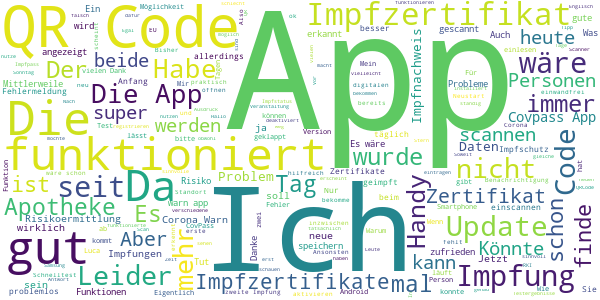
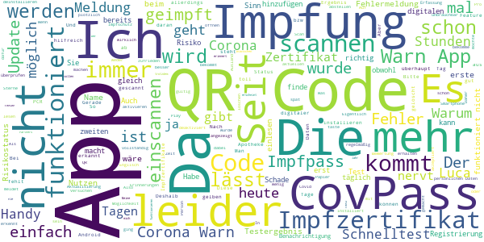
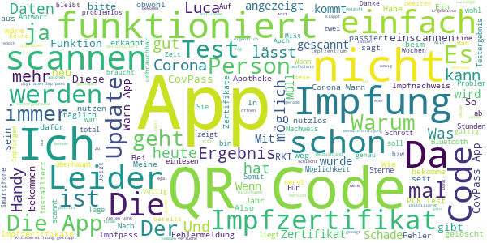

# Corona-Warn-App
App version ``2.3.4``

Analyzed with [covid-apps-observer](http://github.com/covid-apps-observer) project, version ``0.1``

## App overview
| | |
|-------------------------|-------------------------| 
| **Name**&nbsp;&nbsp;&nbsp;&nbsp;&nbsp;&nbsp;&nbsp;&nbsp;&nbsp;&nbsp;&nbsp;&nbsp;&nbsp;&nbsp;&nbsp;&nbsp;&nbsp;&nbsp;&nbsp;&nbsp;&nbsp;&nbsp;&nbsp;&nbsp;&nbsp;&nbsp;&nbsp;&nbsp;&nbsp;&nbsp;&nbsp;&nbsp;&nbsp;&nbsp;&nbsp;&nbsp;&nbsp;&nbsp;&nbsp;&nbsp;  | Corona-Warn-App |
| **Unique identifier** | de.rki.coronawarnapp |
| **Link to Google Play** | [https://play.google.com/store/apps/details?id=de.rki.coronawarnapp](https://play.google.com/store/apps/details?id=de.rki.coronawarnapp) |
| **Summary**  | Gemeinsam Corona bekämpfen |
| **Privacy policy** | [https://www.coronawarn.app/assets/documents/cwa-privacy-notice-de.pdf](https://www.coronawarn.app/assets/documents/cwa-privacy-notice-de.pdf) |
| **Latest version** | 2.3.4 |
| **Last update** | 2021-06-11 18:27:21 |
| **Recent changes** | Mit diesem Update beheben wir einen Fehler. |
| **Installs**  | 10.000.000+ |
| **Category** | Gesundheit & Fitness |
| **First release** | 12.06.2020 |
| **Size**  | 16M |
| **Supported Android version**  | 6.0 oder höher |

### Description
> Das Robert Koch-Institut (RKI) als zentrale Einrichtung des Bundes im Bereich der Öffentlichen Gesundheit und als nationales Public-Health-Institut veröffentlicht die Corona-Warn-App für die deutsche Bundesregierung und für die Bundesrepublik Deutschland. Die App fungiert als digitale Ergänzung zu Abstandhalten, Hygiene und Alltagsmaske. Die App basiert auf Bluetooth-Technologie und der Exposure Notification API von Google. Wer sie nutzt, hilft, Infektionsketten schnell nachzuverfolgen und zu durchbrechen. Außerdem bietet die App eine Funktionalität, mit der Sie digitale Impfzertifikate hinzufügen können, um damit Ihren Impfstatus nachzuweisen. Die App merkt sich dezentral unsere Begegnungen mit anderen und informiert uns digital, wenn wir Begegnungen mit nachweislich infizierten Personen hatten. Dabei sammelt sie jedoch zu keiner Zeit Informationen zur Identität ihrer Nutzerinnen und Nutzer. Wer wir sind und wo wir sind, bleibt geheim – und unsere Privatsphäre bestens geschützt.
 WIE DIE APP FUNKTIONIERT
 Die Risiko-Ermittlung der App ist das Herzstück der Software und sollte immer aktiviert sein. Wann immer sich Nutzerinnen und Nutzer begegnen, tauschen ihre Smartphones über Bluetooth verschlüsselte Zufalls-IDs aus.
 Diese geben nur Auskunft darüber, über welche Dauer und mit welchem Abstand eine Begegnung stattfand. Welche Person sich hinter einem Code verbirgt, ist für niemanden nachvollziehbar. Die Corona-Warn-App erhebt keine Informationen über den Ort der Begegnung oder den Standort der Nutzerinnen und Nutzer.
 Entsprechend der maximalen Corona-Inkubationszeit werden alle Zufalls-IDs, die unser Smartphone sammelt, für 14 Tage auf dem Smartphone gespeichert – und dann gelöscht.
 Nur wenn eine Person sich über die App freiwillig als nachweislich infiziert meldet, erhalten daraufhin alle früheren Begegnungen eine Warnung auf ihr Smartphone.
 Niemand erfährt, wann, wo oder mit wem eine entsprechende Risiko-Begegnung stattfand. Die infizierte Person bleibt anonym.
 Mit der Benachrichtigung erhalten die betroffenen Nutzer/-innen klare Handlungsempfehlungen. Wichtig: Auch die Daten der Benachrichtigten sind zu keiner Zeit einsehbar.
 WIE DIE DATEN SICHER BLEIBEN
 Die Corona-Warn-App soll uns zwar täglich begleiten, sie wird uns jedoch nie kennenlernen. Dadurch kann sie niemandem verraten, wer wir sind. Der Datenschutz bleibt über die gesamte Nutzungsdauer zu 100 Prozent gewahrt.
 • Keine Anmeldung: Es müssen keine E-Mail-Adresse und kein Name hinterlegt werden.
 • Keine Rückschlüsse auf Identitäten: Bei einer Begegnung mit einem anderen Menschen tauschen die Smartphones nur Zufalls-IDs aus. Diese messen, über welche Dauer und mit welchem Abstand ein Kontakt stattfand. Sie lassen aber keine Rückschlüsse auf Personen und Standorte zu.
 • Dezentrale Speicherung: Die Daten werden nur auf dem Smartphone gespeichert und nach 14 Tagen gelöscht.
 • Keine Einsicht für Dritte: Sowohl die Personen, die eine nachgewiesene Infektion melden, als auch die Benachrichtigten sind nicht nachverfolgbar – nicht für die Bundesregierung, nicht für das Robert Koch-Institut, nicht für andere User und auch nicht für die Betreiber der App-Stores.
 Diese App ist nicht zum Gebrauch außerhalb Deutschlands bestimmt. Die Corona-Warn-App ist die zentrale Corona-App für Deutschland und sie ist an das deutsche Gesundheitssystem angeschlossen. Trotzdem ist die Corona-Warn-App auch in diesem Land verfügbar. Sie ist gedacht für alle, die in Deutschland leben, arbeiten, Urlaub machen oder sich regelmäßig oder über längere Zeit in Deutschland aufhalten.
 Es gelten die Nutzungsbedingungen der Corona-Warn-App: https://www.coronawarn.app/assets/documents/cwa-eula-de.pdf. Durch die Installation und Nutzung dieser App stimmen Sie den Nutzungsbedingungen zu.

### User interface
The developers of the app provide the following screenshots in the Google play store.
| | | |
|:-------------------------:|:-------------------------:|:-------------------------:|
 |   |   |   | 
 |   |   |   | 
 |   |  

## Development team
In the following we report the main information provided by the development team in the Google play store.

| | |
|-------------------------|-------------------------|
| **Developer**  | Robert Koch-Institut |
| **Website**  | [https://www.coronawarn.app](https://www.coronawarn.app) |
| **Email** | CoronaWarnApp@rki.de |
| **Physical address**  | [Robert Koch-Institut Nordufer 20 13353 Berlin](https://www.google.com/maps/search/Robert%20Koch-Institut%20Nordufer%2020%2013353%20Berlin) (Google Maps) |
| **Other developed apps**  | [https://play.google.com/store/apps/developer?id=Robert+Koch-Institut](https://play.google.com/store/apps/developer?id=Robert+Koch-Institut) |

## Android support

| | |
|-------------------------|-------------------------|
| **Declared target Android version**  | Android10, version 10 (API level 29) |
| **Effective target Android version**  | Android10, version 10 (API level 29) |
| **Minimum supported Android version**  | Marshmallow, version 6.0 (API level 23) |
| **Maximum target Android version**  | - |

The larger the difference between the minimum and maximum supported Android versions, the better. A larger difference means a wider audience. For example, old phones have a very low Android version, so a high minimum supported Android version means that the app cannot be used by users with old phones, thus leading to accessibility problems. 

## Requested permissions

In the following we report the complete list of the permissions requested by the app. 

| **Permission** | **Protection level** | **Description** | 
|-------------------------|-------------------------|-------------------------|
 **android.permission ACCESS_NETWORK_STATE** | Normal | Allows applications to access information about networks. 
 **android.permission BLUETOOTH** | Normal | Allows applications to connect to paired bluetooth devices. 
 **android.permission CAMERA** | :warning:**Dangerous** | Required to be able to access the camera device. 
 **android.permission FOREGROUND_SERVICE** | Normal | Allows a regular application to use Service.startForeground. 
 **android.permission INTERNET** | Normal | Allows applications to open network sockets. 
 **android.permission RECEIVE_BOOT_COMPLETED** | Normal | Allows an application to receive the Intent.ACTION_BOOT_COMPLETED that is broadcast after the system finishes booting. 
 **android.permission REQUEST_IGNORE_BATTERY_OPTIMIZATIONS** | Normal | Permission an application must hold in order to use Settings.ACTION_REQUEST_IGNORE_BATTERY_OPTIMIZATIONS. 
 **android.permission WAKE_LOCK** | Normal | Allows using PowerManager WakeLocks to keep processor from sleeping or screen from dimming. 

## Mentioned servers

| **Server** | **Registrant** | **Registrant country** | **Creation date** | 
|-------------------------|-------------------------|-------------------------|-------------------------|
 | google.com | Google LLC | :us: US | 1997-09-15 04:00:00 |
 | android.com | Google LLC | :us: US | 1997-06-23 04:00:00 |

## Security analysis 

Below we report the main security warnings raised by our execution of the [Androwarn](https://github.com/maaaaz/androwarn) security analysis tool.

**Connection interfaces exfiltration**
> - This application reads details about the currently active data network 
> - This application tries to find out if the currently active data network is metered 

**Telephony services abuse**
> - This application makes phone calls 

**Suspicious connection establishment**
> - This application opens a Socket and connects it to the remote address '; port is out of range' on the 'N/A' port  
> - This application opens a Socket and connects it to the remote address 'Lcom/android/tools/r8/GeneratedOutlineSupport;->outline42(Ljava/lang/String;)Ljava/lang/StringBuilder;' on the 'N/A' port  
> - This application opens a Socket and connects it to the remote address 'Ljava/net/Proxy;->type()Ljava/net/Proxy$Type;' on the 'N/A' port  
> - This application opens a Socket and connects it to the remote address 'Method sendUrgentData() is not supported.' on the 'N/A' port  
> - This application opens a Socket and connects it to the remote address 'Method setHandshakeTimeout() is not supported.' on the 'N/A' port  
> - This application opens a Socket and connects it to the remote address 'Method setOOBInline() is not supported.' on the 'N/A' port  
> - This application opens a Socket and connects it to the remote address 'Method setSoWriteTimeout() is not supported.' on the 'N/A' port  
> - This application opens a Socket and connects it to the remote address 'Socket closed' on the 'N/A' port  
> - This application opens a Socket and connects it to the remote address 'Socket is closed' on the 'N/A' port  
> - This application opens a Socket and connects it to the remote address 'Socket is closed.' on the 'N/A' port  
> - This application opens a Socket and connects it to the remote address 'Socket is not connected.' on the 'N/A' port  
> - This application opens a Socket and connects it to the remote address 'socket is closed' on the 'N/A' port  
> - This application opens a Socket and connects it to the remote address 'timeout' on the 'N/A' port  

**Code execution**
> - This application loads a native library 
> - This application loads a native library: 'conscrypt_gmscore_jni' 
> - This application loads a native library: 'conscrypt_jni' 

## User ratings and reviews

Below we provide information about how end users are reacting to the app in terms of ratings and reviews in the Google Play store.

### Ratings

The Corona-Warn-App app has been installed by more than **10000000** times. At this time, **126918** rated the app and its average score is **3.407477**. Below we show the distribution of the ratings across the usual star-based rating of Google Play

:star::star::star::star::star:: 54883

:star::star::star::star:: 16140

:star::star::star:: 13986

:star::star:: 9628

:star:: 32281

### Reviews 

#### 5-star reviews

> Top  :date: __2021-06-21 11:57:58__

> Jetzt ist die App endlich auf dem richtigen Weg. Lange hat es gedauert. Zu lange. Update 21.6.: gestern in Kühlungsborn versucht, einen Luca QR Code zu scannen, es kam eine Fehlermeldung, nicht möglich. Mit der Luca App funktionierte es. Sollte das nicht auch hiermit funktionieren?  :date: __2021-06-21 10:19:53__

> Wahrscheinlich die einzige App für Android, die tatsächlich keine persönlichen Daten klaut.  :date: __2021-06-21 07:06:35__

> Meine Erfahrungen sind durchweg positiv. Kontakte mit positiv getesteten wurden mir direkt gemeldet und ich wurde schon vor dem Anruf der Betroffenen über die App gewarnt. Bis auf kleinere Softwarefehler, die in fast jeder App mal prpgrammierseitig auftauchen, kann ich nichts negatives berichten. Tut was sie soll!  :date: __2021-06-21 04:42:56__

> Funktioniert bestens und kombiniert alle wichtigen Dinge, wie die Registrierung bei Events, die Speicherung der Impfung und der Kontaktwarnung.  :date: __2021-06-21 00:23:48__

> War in Ordnung  :date: __2021-06-20 23:04:15__

> Die App kann was sie braucht, tut was sie soll, ist übersichtlich gestaltet und einfach zu bedienen. Ich habe keine Klagen.  :date: __2021-06-20 20:29:08__

> Alles gut so  :date: __2021-06-20 19:31:49__

> Die App funktioniert bisher soweit gut. Als genesener über 6 Monate fehlt mir leider der Nachweis, dass ich trotz einer Impfung, vollständig geimpft bin.  :date: __2021-06-20 16:07:43__

> Bin sehr zufrieden  :date: __2021-06-20 16:03:06__

#### 4-star reviews

> Die App macht das was sie soll. Ich wurde auch sofort gewarnt als ein Kollege erkrankt war und den positiven Test gescannt hat. Nur scannen der Impfbescheinigung klappt nicht so richtig. Code 1 gescannt, erkannt und eingetragen, Code für die zweite Impfung wird erkannt aber abgewiesen. Begründung: Daten seien nicht identisch mit der Erstbescheinigung. Die Covpass-App akzeptiert beide Codes anstandslos.  :date: __2021-06-21 11:45:35__

> Die Funktion sind kompliziert Schon beim Erhalt meiner Impftermine wollte ich diese eintragen. Jetzt könnte ich ein Impfzertifikat einlesen. Ein kostenpflichtiges Impfzertifikat benötige ich nicht. Warum geht es nicht auch über die erfolgen Termine?  :date: __2021-06-21 10:30:31__

> Die qr Codes der zertifikate aus der Apotheke lassen sich nicht speichern. Könnte man vielleicht die Möglichkeit einführen, die impfzertifikate auch über die Zahlen und Nummern-Kombi der "eindeutigen zertifikaterkennung" zu speichern? Edit: der Tipp vom Entwicklerteam hat für einen Code funktioniert, vielen Dank dafür! Der andere scheint zu schlecht von der Apotheke gedruckt zu sein. Entsprechend bleibe ich bei meinem Vorschlag, die "eindeutige zertifikaterkennung" eingeben zu können.  :date: __2021-06-21 08:34:14__

> Die App ist gut und hat ein schönes funktionales Design. Allerdings reagiert der QR-Scanner nicht auf den Code von der Impfung. Der gleiche Code wird von anderen QR-Scannern problemlos erkannt  :date: __2021-06-20 21:51:19__

> Sinnvoll wäre bei dem Ausdruck für eine Veranstaltung, das das Datum der Veranstaltung auf den Ausdruck erscheint. Wenn eine Veranstaltung öfter stattfindet, kann man dann die QR Codes nicht verwechseln.  :date: __2021-06-20 21:22:56__

> Mittlerweile finde ich die Corona Warnapp gut und bin zufrieden mit der App.  :date: __2021-06-20 18:48:09__

> Auch ich habe den Fehler, dass die App mich täglich erinnert, diese zu öffnen. Leider kann man diese spezielle Push-Nachricht nicht blocken, ohne alle anderen Nachrichten ebenfalls auszublenden. Ich habe einen Fehlerbericht gesendet, da man aber keinen Kommentar hinterlassen kann, bin ich mir nicht sicher, ob dieser Fehler überhaupt erkannt wird. Die App neu installieren möchte ich auch nicht, da man die Daten meines Wissens nach nicht in Form eines Backups speichern kann.  :date: __2021-06-20 18:22:01__

> Hallo. Leider kann ich meine 2. Impfung nicht registrieren. Mein Apotheker hat meinen 2 Vornamen vergessen. Die Covpass App nimmt beide. Ixh wünsche mir hier eune Abfrage ob die Personen korrekt sind. Doppelvor ubd Nachnahmen Fallen bei der corona warn app durchs Raster. Ein 2. Zertifikat sehe ich als nicht nötig da die covpass app das kann. Bitte Technik übernehmen.  :date: __2021-06-20 16:36:35__

> Na ja ob es wirklich hilft. Warten wir mal ab......  :date: __2021-06-20 11:30:26__

> Wollte heute einen Schnelltest in der App registrieren, hat auch funktioniert, allerdings bekomme ich noch jetzt die Meldung, dass noch kein Ergebnis vorliegt. Tut es faktisch aber schon seit 16 Stunden.  :date: __2021-06-20 00:25:16__

#### 3-star reviews

> Mit der CORONA App kann ich keine Impfnachweise einscannen. Habe die Version 1.14.3.. Eine neue Installation ist mir nicht möglich, weil ich seit geraumer Zeit die App Google Play Store nicht mehr öffnen kann - trotz aller Versuche / Hinweise etc. Komme da nicht weiter. Warum erfolgt eigentlich kein Update durch die CoronaApp selbst? Warum muss eine neue Version neu installiert werden?? Auf jeden Fall stecke ich jetzt erst einmal fest - bis Google weiterhilft.  :date: __2021-06-21 10:58:29__

> Danke für Ihren Hinweis mit Neustart. Freundliche Grüße Funktionierte lange Zeit gut. Seit mehreren Wochen wird die Risikoermittlung Immer mal gestoppt. Dies kann ich nicht ändern.  :date: __2021-06-21 08:36:19__

> Wenn ich ihn scannen möchte, passiert nichts. Es handelt sich um einen QR Code für das Impfzertifikat. Ich hatte gerade noch gelesen, dass man das Handy weiter weg halten soll, das habe ich getestet und es hat auch nicht geklappt. Vielen Dank für die schnelle Antwort. Ich habe gerade geschaut und die Apotheke bei der ich war ist dort auch zu finden. Ich habe ein "EU COVID-19 IMPFZERTIFIKAT" erhalten. Das hatte ich gestern schon getestet und klappt leider auch nicht :(  :date: __2021-06-21 08:26:00__

> Im Home Office sind die ständigen Warnungen, dass Bluetooth und Standort deaktiviert sind, sehr störend. Es wäre schön, diese Warnung deaktivieren zu können, denn sobald ich unterwegs bin, aktiviere ich es.  :date: __2021-06-21 07:30:09__

> In letzter Zeit kommt immer wieder und viel zu oft die lästige Benachrichtigung: "Ihr Risikostatus. Bitte denken Sie daran, die Corona-Warn-App regelmäßig zu öffnen, um Ihren Risikostatus zu überprüfen." Das tue ich sowieso, aber die ständige Benachrichtigung ist lästig. Deshalb habe ich der Warn-App alle Benachrichtigungen erstmal verboten. Wenn das nicht geändert wird, deinstalliere ich sie.  :date: __2021-06-20 21:59:24__

> Das Scannen des QR-Codes funktioniert weder bei der Dokumentation meiner Erst- noch bei der meiner Zweitimpfung. Das war eigentlich der einzige Grund, warum ich mir diese App installiert habe, der Rest ist für mich eher nice to have. Ist das Problem bekannt? UPDATE: Es handelt sich um die Impfdokumentationen des Bayrischen Impfzentrum, welche ich in dem mir zugeilten Impfzentrum erhalten habe. Andere Dokumente habe ich nicht vorliegen.  :date: __2021-06-20 19:24:26__

> vernünftige App, dachte ich zu Beginn. Mittlerweile eher überflüssig......  :date: __2021-06-20 18:35:15__

> Ich finde es gut, dass wir damit helfen Corona einzudämmen. Dann wäre ich gern bereit mit zu helfen. Aber was ist mit der neuen Delta Variante??  :date: __2021-06-20 14:43:21__

> Nach 3 Tagen konnte endlich eine Apotheke den digitalen Impfnachweis erstellen. Einfügen in die App ging ohne Probleme. Der Login in Geschäften funktioniert aber noch immer nicht, weil nicht mit Luca kompatibel.  :date: __2021-06-20 13:55:02__

> Hallo, er wäre nicht schlecht, wenn man doppelt oder falsch eingegebene Personen oder Orte im Tagebuch korrigieren könnte.  :date: __2021-06-20 11:32:27__

#### 2-star reviews

> Es wäre schön den digitalen Impfausweis bei der Rückkehr aus dem Ausland durch die App in die digitalen Einreiseanmeldung zu integrieren. In Dänemark erwartet man ein grünes Symbol für vollständig geimpfte. Wird so nicht akzeptiert.!!!! Schade, das Testen ging deshalb dort wieder los  :date: __2021-06-21 11:16:23__

> Wird die App mal länger nicht geöffnet, deaktiviert sich die Erfassung und lässt sich auch nicht wieder aktivieren. Die App funktionierte seit ihrem Start fast problemlos. Nun musste ich bereits zum dritten Male die App löschen und neu installieren um wieder eine Aktivität zu bekommen. An Tagen, die man zuhause verbringt, sollte eine tägliche Kontrolle der App nicht nötig sein. Muss man deshalb gleich die Erfassung anderer Geräte deaktivieren? Bitte um schnelle Bearbeitung dieses Problems.  :date: __2021-06-20 23:33:36__

> Die ansich sinnvolle AB. Hat woll immer noch Macken, habe nun zum zweiten mal sämtliche Eintragungen vom Tagebuch verloren, also die Eintragungen der lezten 14 Tage sind plötzlich weg.... Was nützt ein täglich penibeles eintragen wenn dann auf einmal alles weg ist.....?  :date: __2021-06-20 22:38:11__

> Im Großen und Ganzen empfinde ich hat sich die App sehr gemacht, aber das nach 48 Stunden der Test entfernt wird finde ich nicht in Ordnung. Wir waren jetzt in Meck-Pomm und Schleswig-Holstein, da ist ein Test 72 Stunden gültig, über eine Überarbeitung sollte man da eventuell mal nachdenken  :date: __2021-06-20 19:53:36__

> Unausgereift, man soll Schnelltests einlesen können? Man müsste aber die zugesandten PDFs erst ausdrucken zum einlesen. !!  :date: __2021-06-20 19:14:47__

> QR-Code scannen funktioniert nicht  :date: __2021-06-20 16:12:16__

> Nach so vielen Monaten Entwicklungszeit und Millionen, die dieses Projekt verschlungen hat, kann man nicht einmal die per Mail zugesandten QR-Codes einlesen, ohne die Mail vorher auszudrucken... völlig praxisfremd, es wundert nicht, dass die App so schlecht angenommen wird.  :date: __2021-06-20 09:05:50__

> Sollten die Daten hier und bei der andere App denn dikitalen Impfpass nicht zweisprachig stehen? So das wenn jemand in Urlaub fliegt denn dikitalen Impfpass der Behörden dort vorzeigen kann das er geimpft ist? Das ist doch der Sinn der Sache gewesen weshalb es digitalisiert worden ist oder? Aber nirgendwo bei die Daten der Person eine englische Übersetzung. Oder sollen wir die gelben Impfpässe und die Registrierung von die Apotheke in Papier Format immer noch mit schleppen?  :date: __2021-06-20 03:20:57__

> Corona App und Luca App ist eine fehlende Software. Die beide Vertragen sich nicht. Vermehrt kann ich mich nicht Abmelden. Ohne Worte.  :date: __2021-06-19 21:42:13__

> Kann mich nur über diese app aufregen. Qr Code scan vergebens versucht. Funktioniert null  :date: __2021-06-19 18:31:01__

#### 1-star reviews

> Die App hat wohl ein Student im 1 Semester programmiert. Total fürn a....  :date: __2021-06-21 12:00:42__

> Die App ist Schrott..am 16.06. den PCR Test hinzugefügt ein Ergebnis ist bis jetzt noch nicht da...musste beim Gesundheitsamt anrufen um zu erfahren das ich negativ bin.  :date: __2021-06-21 11:40:34__

> War zu frieden seit kurzen kommt immer öfters ich soll die Risiko Ermittlung durch führen das beste war 3 mal in Abstand von 6std am Tag jetzt noch einmal am Tag obwohl man vorher rein geschaut habe das nervt bin am überlegen die app zu deinstallieren  :date: __2021-06-21 11:31:22__

> Leider lässt sich der QR Code für den Impfnachweis nicht scannen. Weiß nicht was ich noch tun soll....  :date: __2021-06-21 11:26:44__

> Leider besteht seit der Einführung, immer noch keine Kompatibilität zu Luca Check-In QR Code, obwohl dies stark beworben wurde.  :date: __2021-06-21 10:53:00__

> Leider kann ich den QR Code nicht scannen an was kann das liegen?  :date: __2021-06-21 10:35:31__

> Warum kann ich den Schnelltest nicht scannen?  :date: __2021-06-21 10:16:37__

> QR Codes als digitaler Impfnachweis lassen sich nicht scannen. Keine Fehlermeldung, nichts, keine Reaktion. Poco f3 pro  :date: __2021-06-21 09:32:15__

> Für mich nicht gut  :date: __2021-06-21 07:59:24__

> Ich sollte eigentlich hier mein Testergebnis bekommen. Als ich mehrere Wochen ohne Ergebnis gewartet habe, dass etwas kam, hieß es er wäre nun aufgrund der vergangenen Zeit ungültig. Es verfehlt irgendwie den Sinn sich testen zu lassen, wenn man dann nicht einmal ein Ergebnis bekommt.  :date: __2021-06-21 06:27:51__

