# Corona-Warn-App
App version ``2.4.2``

Analyzed with [covid-apps-observer](http://github.com/covid-apps-observer) project, version ``0.1``

## App overview
| | |
|-------------------------|-------------------------| 
| **Name**&nbsp;&nbsp;&nbsp;&nbsp;&nbsp;&nbsp;&nbsp;&nbsp;&nbsp;&nbsp;&nbsp;&nbsp;&nbsp;&nbsp;&nbsp;&nbsp;&nbsp;&nbsp;&nbsp;&nbsp;&nbsp;&nbsp;&nbsp;&nbsp;&nbsp;&nbsp;&nbsp;&nbsp;&nbsp;&nbsp;&nbsp;&nbsp;&nbsp;&nbsp;&nbsp;&nbsp;&nbsp;&nbsp;&nbsp;&nbsp;  | Corona-Warn-App |
| **Unique identifier** | de.rki.coronawarnapp |
| **Link to Google Play** | [https://play.google.com/store/apps/details?id=de.rki.coronawarnapp](https://play.google.com/store/apps/details?id=de.rki.coronawarnapp) |
| **Summary**  | Gemeinsam Corona bekämpfen |
| **Privacy policy** | [https://www.coronawarn.app/assets/documents/cwa-privacy-notice-de.pdf](https://www.coronawarn.app/assets/documents/cwa-privacy-notice-de.pdf) |
| **Latest version** | 2.4.2 |
| **Last update** | 2021-06-24 22:48:58 |
| **Recent changes** | Mit diesem Update beheben wir einen Fehler. |
| **Installs**  | 10.000.000+ |
| **Category** | Gesundheit & Fitness |
| **First release** | 12.06.2020 |
| **Size**  | 16M |
| **Supported Android version**  | 6.0 oder höher |

### Description
> Das Robert Koch-Institut (RKI) als zentrale Einrichtung des Bundes im Bereich der Öffentlichen Gesundheit und als nationales Public-Health-Institut veröffentlicht die Corona-Warn-App für die deutsche Bundesregierung und für die Bundesrepublik Deutschland. Die App fungiert als digitale Ergänzung zu Abstandhalten, Hygiene und Alltagsmaske. Die App basiert auf Bluetooth-Technologie und der Exposure Notification API von Google. Wer sie nutzt, hilft, Infektionsketten schnell nachzuverfolgen und zu durchbrechen. Außerdem bietet die App eine Funktionalität, mit der Sie digitale Impfzertifikate hinzufügen können, um damit Ihren Impfstatus nachzuweisen. Die App merkt sich dezentral unsere Begegnungen mit anderen und informiert uns digital, wenn wir Begegnungen mit nachweislich infizierten Personen hatten. Dabei sammelt sie jedoch zu keiner Zeit Informationen zur Identität ihrer Nutzerinnen und Nutzer. Wer wir sind und wo wir sind, bleibt geheim – und unsere Privatsphäre bestens geschützt.
 WIE DIE APP FUNKTIONIERT
 Die Risiko-Ermittlung der App ist das Herzstück der Software und sollte immer aktiviert sein. Wann immer sich Nutzerinnen und Nutzer begegnen, tauschen ihre Smartphones über Bluetooth verschlüsselte Zufalls-IDs aus.
 Diese geben nur Auskunft darüber, über welche Dauer und mit welchem Abstand eine Begegnung stattfand. Welche Person sich hinter einem Code verbirgt, ist für niemanden nachvollziehbar. Die Corona-Warn-App erhebt keine Informationen über den Ort der Begegnung oder den Standort der Nutzerinnen und Nutzer.
 Entsprechend der maximalen Corona-Inkubationszeit werden alle Zufalls-IDs, die unser Smartphone sammelt, für 14 Tage auf dem Smartphone gespeichert – und dann gelöscht.
 Nur wenn eine Person sich über die App freiwillig als nachweislich infiziert meldet, erhalten daraufhin alle früheren Begegnungen eine Warnung auf ihr Smartphone.
 Niemand erfährt, wann, wo oder mit wem eine entsprechende Risiko-Begegnung stattfand. Die infizierte Person bleibt anonym.
 Mit der Benachrichtigung erhalten die betroffenen Nutzer/-innen klare Handlungsempfehlungen. Wichtig: Auch die Daten der Benachrichtigten sind zu keiner Zeit einsehbar.
 WIE DIE DATEN SICHER BLEIBEN
 Die Corona-Warn-App soll uns zwar täglich begleiten, sie wird uns jedoch nie kennenlernen. Dadurch kann sie niemandem verraten, wer wir sind. Der Datenschutz bleibt über die gesamte Nutzungsdauer zu 100 Prozent gewahrt.
 • Keine Anmeldung: Es müssen keine E-Mail-Adresse und kein Name hinterlegt werden.
 • Keine Rückschlüsse auf Identitäten: Bei einer Begegnung mit einem anderen Menschen tauschen die Smartphones nur Zufalls-IDs aus. Diese messen, über welche Dauer und mit welchem Abstand ein Kontakt stattfand. Sie lassen aber keine Rückschlüsse auf Personen und Standorte zu.
 • Dezentrale Speicherung: Die Daten werden nur auf dem Smartphone gespeichert und nach 14 Tagen gelöscht.
 • Keine Einsicht für Dritte: Sowohl die Personen, die eine nachgewiesene Infektion melden, als auch die Benachrichtigten sind nicht nachverfolgbar – nicht für die Bundesregierung, nicht für das Robert Koch-Institut, nicht für andere User und auch nicht für die Betreiber der App-Stores.
 Diese App ist nicht zum Gebrauch außerhalb Deutschlands bestimmt. Die Corona-Warn-App ist die zentrale Corona-App für Deutschland und sie ist an das deutsche Gesundheitssystem angeschlossen. Trotzdem ist die Corona-Warn-App auch in diesem Land verfügbar. Sie ist gedacht für alle, die in Deutschland leben, arbeiten, Urlaub machen oder sich regelmäßig oder über längere Zeit in Deutschland aufhalten.
 Es gelten die Nutzungsbedingungen der Corona-Warn-App: https://www.coronawarn.app/assets/documents/cwa-eula-de.pdf. Durch die Installation und Nutzung dieser App stimmen Sie den Nutzungsbedingungen zu.

### User interface
The developers of the app provide the following screenshots in the Google play store.
| | | |
|:-------------------------:|:-------------------------:|:-------------------------:|
 | 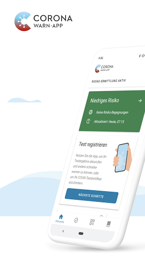  | 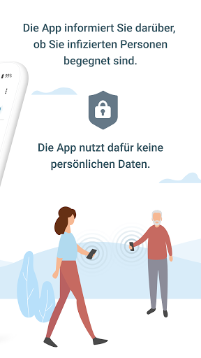  | 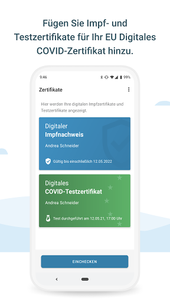  | 
 | 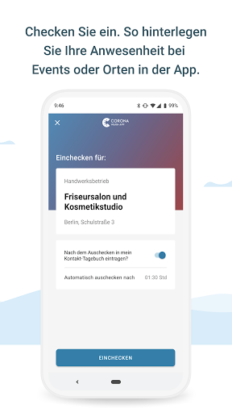  | 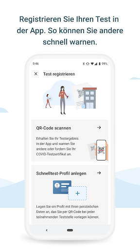  | 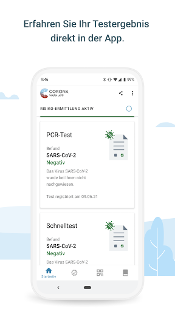  | 
 | 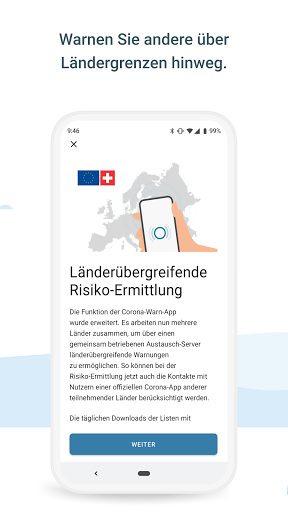  | 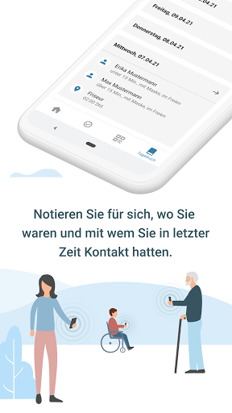 

## Development team
In the following we report the main information provided by the development team in the Google play store.

| | |
|-------------------------|-------------------------|
| **Developer**  | Robert Koch-Institut |
| **Website**  | [https://www.coronawarn.app](https://www.coronawarn.app) |
| **Email** | CoronaWarnApp@rki.de |
| **Physical address**  | [Robert Koch-Institut Nordufer 20 13353 Berlin](https://www.google.com/maps/search/Robert%20Koch-Institut%20Nordufer%2020%2013353%20Berlin) (Google Maps) |
| **Other developed apps**  | [https://play.google.com/store/apps/developer?id=Robert+Koch-Institut](https://play.google.com/store/apps/developer?id=Robert+Koch-Institut) |

## Android support

| | |
|-------------------------|-------------------------|
| **Declared target Android version**  | Android10, version 10 (API level 29) |
| **Effective target Android version**  | Android10, version 10 (API level 29) |
| **Minimum supported Android version**  | Marshmallow, version 6.0 (API level 23) |
| **Maximum target Android version**  | - |

The larger the difference between the minimum and maximum supported Android versions, the better. A larger difference means a wider audience. For example, old phones have a very low Android version, so a high minimum supported Android version means that the app cannot be used by users with old phones, thus leading to accessibility problems. 

## Requested permissions

In the following we report the complete list of the permissions requested by the app. 

| **Permission** | **Protection level** | **Description** | 
|-------------------------|-------------------------|-------------------------|
 **android.permission ACCESS_NETWORK_STATE** | Normal | Allows applications to access information about networks. 
 **android.permission BLUETOOTH** | Normal | Allows applications to connect to paired bluetooth devices. 
 **android.permission CAMERA** | :warning:**Dangerous** | Required to be able to access the camera device. 
 **android.permission FOREGROUND_SERVICE** | Normal | Allows a regular application to use Service.startForeground. 
 **android.permission INTERNET** | Normal | Allows applications to open network sockets. 
 **android.permission RECEIVE_BOOT_COMPLETED** | Normal | Allows an application to receive the Intent.ACTION_BOOT_COMPLETED that is broadcast after the system finishes booting. 
 **android.permission REQUEST_IGNORE_BATTERY_OPTIMIZATIONS** | Normal | Permission an application must hold in order to use Settings.ACTION_REQUEST_IGNORE_BATTERY_OPTIMIZATIONS. 
 **android.permission WAKE_LOCK** | Normal | Allows using PowerManager WakeLocks to keep processor from sleeping or screen from dimming. 

## Mentioned servers

| **Server** | **Registrant** | **Registrant country** | **Creation date** | 
|-------------------------|-------------------------|-------------------------|-------------------------|
 | google.com | Google LLC | :us: US | 1997-09-15 04:00:00 |
 | android.com | Google LLC | :us: US | 1997-06-23 04:00:00 |

## Security analysis 

Below we report the main security warnings raised by our execution of the [Androwarn](https://github.com/maaaaz/androwarn) security analysis tool.

**Connection interfaces exfiltration**
> - This application reads details about the currently active data network 
> - This application tries to find out if the currently active data network is metered 

**Telephony services abuse**
> - This application makes phone calls 

**Suspicious connection establishment**
> - This application opens a Socket and connects it to the remote address '; port is out of range' on the 'N/A' port  
> - This application opens a Socket and connects it to the remote address 'Lcom/android/tools/r8/GeneratedOutlineSupport;->outline42(Ljava/lang/String;)Ljava/lang/StringBuilder;' on the 'N/A' port  
> - This application opens a Socket and connects it to the remote address 'Ljava/net/Proxy;->type()Ljava/net/Proxy$Type;' on the 'N/A' port  
> - This application opens a Socket and connects it to the remote address 'Method sendUrgentData() is not supported.' on the 'N/A' port  
> - This application opens a Socket and connects it to the remote address 'Method setHandshakeTimeout() is not supported.' on the 'N/A' port  
> - This application opens a Socket and connects it to the remote address 'Method setOOBInline() is not supported.' on the 'N/A' port  
> - This application opens a Socket and connects it to the remote address 'Method setSoWriteTimeout() is not supported.' on the 'N/A' port  
> - This application opens a Socket and connects it to the remote address 'Socket closed' on the 'N/A' port  
> - This application opens a Socket and connects it to the remote address 'Socket is closed' on the 'N/A' port  
> - This application opens a Socket and connects it to the remote address 'Socket is closed.' on the 'N/A' port  
> - This application opens a Socket and connects it to the remote address 'Socket is not connected.' on the 'N/A' port  
> - This application opens a Socket and connects it to the remote address 'socket is closed' on the 'N/A' port  
> - This application opens a Socket and connects it to the remote address 'timeout' on the 'N/A' port  

**Code execution**
> - This application loads a native library 
> - This application loads a native library: 'conscrypt_gmscore_jni' 
> - This application loads a native library: 'conscrypt_jni' 

## User ratings and reviews

Below we provide information about how end users are reacting to the app in terms of ratings and reviews in the Google Play store.

### Ratings

The Corona-Warn-App app has been installed by more than **10000000** times. At this time, **127758** rated the app and its average score is **3.4599023**. Below we show the distribution of the ratings across the usual star-based rating of Google Play

:star::star::star::star::star:: 56079

:star::star::star::star:: 17169

:star::star::star:: 14411

:star::star:: 9630

:star:: 30469

### Reviews 

#### 5-star reviews

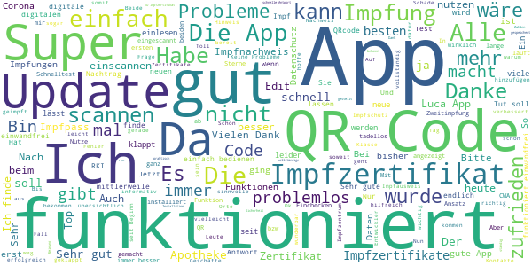

> Super  :date: __2021-06-28 01:13:07__

> Keine Probleme seit der Installation. Daumen hoch.  :date: __2021-06-27 22:33:19__

> Endlich kann der Nachweis digital über die vollständige Impfung dokumentiert werden.  :date: __2021-06-27 21:36:29__

> i luv it  :date: __2021-06-27 21:33:20__

> Ich finde das Gut lg Jadran Baier  :date: __2021-06-27 21:22:23__

> Super App. Ein Stück Sicherheit für alle.  :date: __2021-06-27 20:52:23__

> Bei anfragen und Rezensionen bekommt man schnell Antwort und Hilfe bei Problemen ❗❗  :date: __2021-06-27 20:36:04__

> C 1 1 2,  :date: __2021-06-27 19:26:00__

> Ich finde die App sehr gut. Der digitale Impfnachweis ist jetzt übrigens unten in der Leiste unter Zertifikate. Nur als Hinweis, falls jemand noch sucht.  :date: __2021-06-27 19:17:15__

> Impfzertifikat hinterlegen funktioniert wunderbar. Schnelltest und PCR-Test aus kooperierenden Laboren funktioniert ebenfalls wunderbar. Gutes Konzept zum Datenschutz mit offenem Quellcode.  :date: __2021-06-27 19:11:33__

#### 4-star reviews

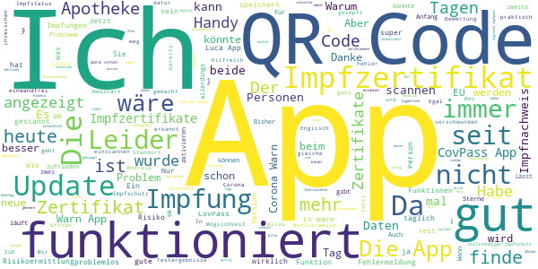

> Bisher sehr zufrieden mit dieser sehr Daten-sparsamen App. Leider funktioniert mein Impfzertifikat nicht korrekt damit. Das Zertifikat bleibt grau und es wird angezeigt, "vollständiger Impfschutz in 0 Tagen". Etwas seltsam. In der CovPass-App dagegen wird das gleiche Zertifikat als gültig angezeigt.  :date: __2021-06-28 01:03:32__

> Macht was sie soll.Hat sich einiges getan.  :date: __2021-06-27 22:21:37__

> Funktionen werden immer wieder ausgeweitet. Hätten wir uns nicht dem Datenschutz Hype unterworfen wären bestimmt weitere Features möglich. Bei der Luca-App waren die Politiker großzügiger. Warum wird nicht wie in der CovPass App ein QR Code für den Impfschutz angezeigt sondern nur die einzelnen Impfungen?  :date: __2021-06-27 21:15:30__

> 🙂  :date: __2021-06-27 20:57:51__

> Für eine Nutzung des Zertifikats in der EU ist auch eine Übersetzung in Englisch, Französisch und Spanisch notwendig. Die fehlt. Sonst Top-App.  :date: __2021-06-27 20:06:15__

> Ich hatte nie Probleme mit der App. Seit heute heißt es immer das die Risikoermittlung gestoppt wurde. Bluetooth ist eingeschalten. Den Schieber kann ich auf Aktivieren schalten, es geht aber von alleine wieder auf deaktivieren....  :date: __2021-06-27 18:44:14__

> Wo ist denn plötzlich meine eingetragene Impfung hin? Gestern war sie noch drin...  :date: __2021-06-27 18:41:27__

> Habe ein ähnliches Problem mit dem QR-Code: Die App speichert jeweils nur einen Impftermin, egal ob den 1. oder 2., was die Installation einer weiteren Anwendung erforderlich machte - schade. Fehlermeldung besagt, dass die persönlichen Daten nicht übereinstimmen und nur die Daten einer Person erfasst werden können (CovPass akzeptiert beide). Abhilfe wäre prima... Danke.  :date: __2021-06-27 18:20:55__

> Musste die App leider deinstallieren, da sie immer Ursache 3 meldete. Nun nach Neuinstallation geht es wieder. Ist die Kontaktaufzeichnung der letzten 14 Tagen nun aber gelöscht und wertlos ? Wie kann ich das prüfen ? App zeigt jetzt "unbekanntes Risiko" an, da sie noch nicht lange genug für die Risikoermittlung aktiv wäre. In den Covid-19 Benachrichtigungen werden allerdings 14 Überprüfungen für heute angezeigt. UPDATE: Zwei Tage nach Neuinstallation ist wieder Ursache 3 (39508) da.  :date: __2021-06-27 18:17:25__

> Ich finde es saublöd, daß der gerade vor 2 Tagen eingelesene, digitale Impfpass mit dem heutigen Update wieder verschwunden ist.  :date: __2021-06-27 18:01:10__

#### 3-star reviews

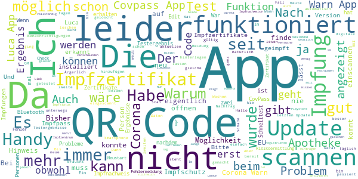

> Nach letztem Update erscheint nicht mehr bei vollständiger Impfung " vollständig geimpft" sondern " vollständiger Impfschutz in 0 Tagen" sehr irritierend.  :date: __2021-06-28 00:40:26__

> Ich habe diese App von Anfang an, selbst Personen die Infiziert sind oder waren, kommt bei mir nur der grüne Hinweis alles okay. Was soll das? Hat viel gekostet und bringt nix. Überlege die App zu löschen.  :date: __2021-06-27 23:04:26__

> Das mit den fast täglichen Erinnerungen, die App aufzumachen, obwohl sich nichts am Status geändert hat, ist wirklich nervig ! Das nervt so arg, dass bestimmt einige nur deswegen die Benachrichtigungen ausschalten ! Und dann ist das genau Gegenteil erreicht.  :date: __2021-06-27 22:04:43__

> Leider können beim digitalen Impfzertifikat nicht mehrere Personen erfasst werden.  :date: __2021-06-27 21:30:18__

> Funktion Impfzertifikat verschwunden seit dem heutigen Update . Androidversion .  :date: __2021-06-27 21:13:47__

> Warum ist die Impfung jetzt nicht mehr auf der Startseite abrufbar? War sehr praktisch.  :date: __2021-06-27 21:03:33__

> Update auf 2.4.2 "Fehlerbeseitigung?" Damit ist mein Impfzertifikat verschwunden. Prima!  :date: __2021-06-27 19:58:02__

> Es wird besser, aber LUCA ist dennoch einfacher zu händeln. Bissel peinlich finde ich. Edit 27.06.21 Testergebniss in der APP abzulegen nicht möglich... QR Code ungültig. Beim Termin machen ploppte auch nen LINK zur APP auf, draufgeklickt, aber natürlich kein Ergebnis da ja erst Termin vereinbart.vielleicht funktioniert er deshalb jetzt nicht mehr. Link zur LUCA APP genutzt, Zack Ergebnis Schnelltest übertragen. mal schauen was das mit dem Impfzertifikat gibt. Statt einer zentralen App 3 Apps.  :date: __2021-06-27 19:02:00__

> Hallo RKI, nachdem ich die App auf die neueste Version geupdatet habe, sind meine zwei eingescannten Impfungen verschwunden. Da sie nur 1x eingescannt werden können... wisst ihr ja selber oder? Wird es gefixt und sie sind wieder da? Oder muss ich jetzt extra nochmal in die Apotheke?  :date: __2021-06-27 18:19:49__

> Wieso werden die Impfzertifikate beim Update gelöscht? Ärgerlich! Das Schnelltestprofil ist sinnlos,wenn selbst ein zentrales städtisches Impfzentrum den Code mangels Scanner nicht einlesen kann. Auch habe ich bislang noch keinen Veranstaltungscode zum bessern Schutz der Teilnehmer gesehen. Es müsste dazu einen Anreiz geben,z.B.bei niedrigen Inzidentien den Wegfall der Maskenpflicht oder des Schnelltests.  :date: __2021-06-27 17:24:22__

#### 2-star reviews

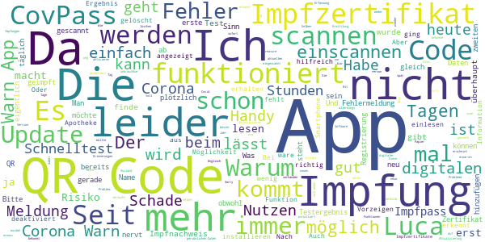

> Obwohl eigentlich seit gestern die zwei Wochen seit der zweiten Impfung um sind, steht nun schon den zweiten Tag "Vollständiger Impfschutz in 0 Tagen". Soll das der Nachweis für "vollst. geimpft" sein? Des weiteren steht, dass das Zertifikat ein Jahr lang nach der Eingabe des Barcodes und nicht nach der Impfung gültig ist. Das macht irgendwie ziemlich wenig Sinn! Von einer App deren Entwicklung so viel Geld kostet, sollte man etwas mehr Sorgfalt & Qualitätskontrolle erwarten dürfen  :date: __2021-06-28 00:25:45__

> Vor einer Woche meine Impfungen hinterlegt und nach dem Update alles gelöscht. Sorry, aber das ist dilettantisch.  :date: __2021-06-27 18:42:43__

> Was soll der Unsinn? Heute ein Update der App und mein Impfzertifikat ist nicht mehr vorhanden.  :date: __2021-06-27 16:57:21__

> Aktuelle Version 2.4.2: - Gelegentlich deaktiviert sich die Risiko-Ermittlung selbstständig, ohne dass am Handy etwas geändert worden wäre (Bluetooth ein/aus oder ähnliches). Dieser Fehler aus der Anfangszeit sollte doch irgendwann mal endlich ausgemerzt sein. - Seit dem automatischen Update zu einer der neuesten Versionen erscheint plötzlich die Meldung "Inkompabilitätswarnung - das Smartphone kann Benachrichtigungen nur empfangen aber nicht versenden" (ab welcher Version das erstmals erschien kann ich nicht sagen). Was ist das nun wieder? War das schon immer so und die Entwickler haben es erst nach einem Jahr gemerkt? Oder wurden nach bewährter Manier alte Fehler durch neue ersetzt? Und das wichtigste: - Wieso kann die App noch immer keine Luca-QR-Codes lesen? Die haben sich ja leider als Quasi-Standard etabliert (in manchen Bundesländern sogar verpflichtend), aber nicht jeder möchte seine kompletten Kontaktdaten an eine private Firma weitergeben um dann Werbeanrufe zu erhalten (wie bei mir geschehen - Luca danach sofort wieder deinstalliert). Gerade wenn der Luca-Code regional von der öffentlichen Hand vorgeschrieben wird dann muss die Corona-App diesen Code auch zwingend lesen können! Bitte schnellstmöglich nachbessern, das darf bei den abartigen Summen die diese App gekostet hat wohl erwartet werden!  :date: __2021-06-27 16:10:03__

> Warum ist plötzlich der digitale Impfnachweis verschwunden? Es ist auch nicht mehr möglich, ihn erneut einzustellen,einzuscannen. Der Menü Punkt ist auch nicht mehr da.  :date: __2021-06-27 16:03:26__

> Ich habe vor über einer Woche meinen digitalen Impfnachweis gescannt und das hat gut geklappt. Seit dem neuen Update ist sowohl mein Impfnachweis verschwunden als auch die Möglichkeit diese überhaupt zu erneut einzupflegen. Dies hat nichts mit Fehlerbehebung zu tun sondern ist ein riesen Rückschritt!!  :date: __2021-06-27 16:02:50__

> Mein impfzertifikat ist weg von der app einschecken  :date: __2021-06-27 15:59:00__

> Bisher war mein Eindruck von der App weder positiv noch negativ. Gefühlt hatte der Datenschutz höhere Priorität als der praktische Nutzen. Die seit kurzem mögliche Integration des Impfzertifikats fand ich gut und es funktionierte. Heute ein Riesenschreck (nach Update 2.4.2) beim Vorzeigen am Einlass zum Konzert: Das Zertifikat war weg! Zum Glück hatte man Einsehen und ließ mich trotzdem rein, weil es bei meiner Frau da war. Jetzt sehe ich einen neuen Menüpunkt, hinter dem es steckt - unmöglich!  :date: __2021-06-27 15:35:38__

> Nach dem neuen Release ist mein Impfzertifikat weg!  :date: __2021-06-27 14:32:16__

> Warum schaltet meine App alle 14 Tage ab und ist nach 2 bis 3 Tagen plötzlichen wieder da  :date: __2021-06-27 13:56:58__

#### 1-star reviews

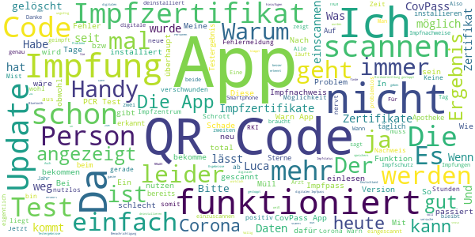

> Der größte u. teuerste Schund u. rettet kein Leben. Lächerliches Kontakttagebuch u. gefakte Zahlen. Wir müssen mit dem Virus leben, aber nicht in dieser ermächtigungsgesetzlichen Diktatur. Wer weiß überhaupt, dass das RKI eine sehr dunkle Vergangenheit in der NS-Zeit hat, zu der J. H. Hacker, Präsident des RKI 2008-2010, gesagt hat "Es war nicht nur wie überall, sondern schlimmer." Das wiederholt sich gerade.Wie lange dürfen diese Verbrecher um den Tierarzt Wieler noch ungestraft weiter machen?  :date: __2021-06-28 02:20:43__

> Schade das man noch 1 Stern geben muss, Impf nachweis steht seit Tagen auf 0 Tagen, vollständiger Impfschutz wird nicht dargestellt. Zum Glück gibt es Covpass, dann kann man diesen Mist hier deinstallieren.  :date: __2021-06-28 00:10:36__

> Nach letzten Update Impfdaten weg  :date: __2021-06-27 23:45:35__

> Funktioniert bei mir nicht, da meine Play-Dienste die "Cov19-Benachrichtigungen" nicht installiert haben (Android11/OriginOS) Lösung: Corona Contact Tracing über F-Droid installieren -> gleiche Funktion.  :date: __2021-06-27 23:44:01__

> Seit über einem Jahr kein einziges mal gewarnt o.ä. Jetzt deinstalliert, da für nichts zu viele Rechte gebraucht werden 🤷‍♂️  :date: __2021-06-27 22:03:06__

> Total bescheuert!!! Habe mal Handy geklaut gekriegt! Oder der Akku ist leer!! Usw!!! Da nützt einem dieser Mist auch nichts!! Wenn dann gehört das in einen Impfausweis!!! Den habe ich seit meiner Geburt und da ist alles eingetragen, der ist immer da wo alle meine Dokumente sind!!! Als wieso eine App??? Außerdem braucht man dafür auch ein gut funktionierendes Internet und das ist leider nicht überall da!  :date: __2021-06-27 21:31:45__

> Bisher war alles OK. Mit neuer Version QR-Code des impfzertifikat eingescannt.Danach auch alles OK , beide Impfnachweise waren vorhanden. An nächsten Tag ( Version ist 2.4.2) ist das Impzertifikat wieder weg.Es gibt noch nicht einmal mehr das neue Eingabefeld um den QR-Code erneut einzuscannen.???  :date: __2021-06-27 20:25:48__

> Es lassen sich nur Impfzertifikate für 1 Person einlesen. Was soll das - in der Info vom Impfzentrum stand, dass Zertifikate für mehrere Personen gespeichert werden können.  :date: __2021-06-27 20:23:34__

> Nach dem Update ist mein Impfzertifikat weg. Testen Sie Updates überhaupt vor der Freigabe??? Ich kann es mit der "neuen" auch nicht wieder einscannen. Ich muss sehr an mich halten!!!  :date: __2021-06-27 20:10:53__

> Scannen von Impfzertifikat nicht möglich, Zertifikat wird als ungültig gekennzeichnet.  :date: __2021-06-27 20:04:47__

