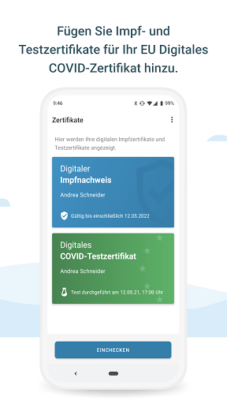
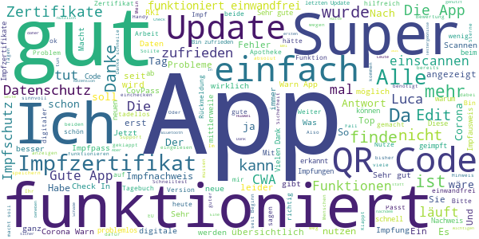

# Corona-Warn-App
App version ``2.4.3``

Analyzed with [covid-apps-observer](http://github.com/covid-apps-observer) project, version ``0.1``

## App overview
| | |
|-------------------------|-------------------------| 
| **Name**&nbsp;&nbsp;&nbsp;&nbsp;&nbsp;&nbsp;&nbsp;&nbsp;&nbsp;&nbsp;&nbsp;&nbsp;&nbsp;&nbsp;&nbsp;&nbsp;&nbsp;&nbsp;&nbsp;&nbsp;&nbsp;&nbsp;&nbsp;&nbsp;&nbsp;&nbsp;&nbsp;&nbsp;&nbsp;&nbsp;&nbsp;&nbsp;&nbsp;&nbsp;&nbsp;&nbsp;&nbsp;&nbsp;&nbsp;&nbsp;  | Corona-Warn-App |
| **Unique identifier** | de.rki.coronawarnapp |
| **Link to Google Play** | [https://play.google.com/store/apps/details?id=de.rki.coronawarnapp](https://play.google.com/store/apps/details?id=de.rki.coronawarnapp) |
| **Summary**  | Gemeinsam Corona bekämpfen |
| **Privacy policy** | [https://www.coronawarn.app/assets/documents/cwa-privacy-notice-de.pdf](https://www.coronawarn.app/assets/documents/cwa-privacy-notice-de.pdf) |
| **Latest version** | 2.4.3 |
| **Last update** | 2021-06-30 15:53:14 |
| **Recent changes** | Version 2.4.3: Mit diesem Update beheben wir Fehler mit der Darstellung des vollständigen Impfschutzes und einer Downloadfunktion.  Was war neu mit Version 2.4: - Sie können nun ein offizielles digitales COVID-Testzertifikat der EU anfordern und anschließend den zugehörigen QR-Code im neuen &quot;Zertifikate&quot;-Bereich der App innerhalb der EU verwenden, um negative Testergebnisse nachzuweisen (z.B. für Reisen). - Sobald Ihr Testergebnis vorliegt, wird es nun auch Ihrem Kontakt-Tagebuch hinzugefügt. |
| **Installs**  | 10.000.000+ |
| **Category** | Gesundheit & Fitness |
| **First release** | 12.06.2020 |
| **Size**  | 16M |
| **Supported Android version**  | 6.0 oder höher |

### Description
> Das Robert Koch-Institut (RKI) als zentrale Einrichtung des Bundes im Bereich der Öffentlichen Gesundheit und als nationales Public-Health-Institut veröffentlicht die Corona-Warn-App für die deutsche Bundesregierung und für die Bundesrepublik Deutschland. Die App fungiert als digitale Ergänzung zu Abstandhalten, Hygiene und Alltagsmaske. Die App basiert auf Bluetooth-Technologie und der Exposure Notification API von Google. Wer sie nutzt, hilft, Infektionsketten schnell nachzuverfolgen und zu durchbrechen. Außerdem bietet die App eine Funktionalität, mit der Sie digitale Impfzertifikate hinzufügen können, um damit Ihren Impfstatus nachzuweisen. Die App merkt sich dezentral unsere Begegnungen mit anderen und informiert uns digital, wenn wir Begegnungen mit nachweislich infizierten Personen hatten. Dabei sammelt sie jedoch zu keiner Zeit Informationen zur Identität ihrer Nutzerinnen und Nutzer. Wer wir sind und wo wir sind, bleibt geheim – und unsere Privatsphäre bestens geschützt.
 WIE DIE APP FUNKTIONIERT
 Die Risiko-Ermittlung der App ist das Herzstück der Software und sollte immer aktiviert sein. Wann immer sich Nutzerinnen und Nutzer begegnen, tauschen ihre Smartphones über Bluetooth verschlüsselte Zufalls-IDs aus.
 Diese geben nur Auskunft darüber, über welche Dauer und mit welchem Abstand eine Begegnung stattfand. Welche Person sich hinter einem Code verbirgt, ist für niemanden nachvollziehbar. Die Corona-Warn-App erhebt keine Informationen über den Ort der Begegnung oder den Standort der Nutzerinnen und Nutzer.
 Entsprechend der maximalen Corona-Inkubationszeit werden alle Zufalls-IDs, die unser Smartphone sammelt, für 14 Tage auf dem Smartphone gespeichert – und dann gelöscht.
 Nur wenn eine Person sich über die App freiwillig als nachweislich infiziert meldet, erhalten daraufhin alle früheren Begegnungen eine Warnung auf ihr Smartphone.
 Niemand erfährt, wann, wo oder mit wem eine entsprechende Risiko-Begegnung stattfand. Die infizierte Person bleibt anonym.
 Mit der Benachrichtigung erhalten die betroffenen Nutzer/-innen klare Handlungsempfehlungen. Wichtig: Auch die Daten der Benachrichtigten sind zu keiner Zeit einsehbar.
 WIE DIE DATEN SICHER BLEIBEN
 Die Corona-Warn-App soll uns zwar täglich begleiten, sie wird uns jedoch nie kennenlernen. Dadurch kann sie niemandem verraten, wer wir sind. Der Datenschutz bleibt über die gesamte Nutzungsdauer zu 100 Prozent gewahrt.
 • Keine Anmeldung: Es müssen keine E-Mail-Adresse und kein Name hinterlegt werden.
 • Keine Rückschlüsse auf Identitäten: Bei einer Begegnung mit einem anderen Menschen tauschen die Smartphones nur Zufalls-IDs aus. Diese messen, über welche Dauer und mit welchem Abstand ein Kontakt stattfand. Sie lassen aber keine Rückschlüsse auf Personen und Standorte zu.
 • Dezentrale Speicherung: Die Daten werden nur auf dem Smartphone gespeichert und nach 14 Tagen gelöscht.
 • Keine Einsicht für Dritte: Sowohl die Personen, die eine nachgewiesene Infektion melden, als auch die Benachrichtigten sind nicht nachverfolgbar – nicht für die Bundesregierung, nicht für das Robert Koch-Institut, nicht für andere User und auch nicht für die Betreiber der App-Stores.
 Diese App ist nicht zum Gebrauch außerhalb Deutschlands bestimmt. Die Corona-Warn-App ist die zentrale Corona-App für Deutschland und sie ist an das deutsche Gesundheitssystem angeschlossen. Trotzdem ist die Corona-Warn-App auch in diesem Land verfügbar. Sie ist gedacht für alle, die in Deutschland leben, arbeiten, Urlaub machen oder sich regelmäßig oder über längere Zeit in Deutschland aufhalten.
 Es gelten die Nutzungsbedingungen der Corona-Warn-App: https://www.coronawarn.app/assets/documents/cwa-eula-de.pdf. Durch die Installation und Nutzung dieser App stimmen Sie den Nutzungsbedingungen zu.

### User interface
The developers of the app provide the following screenshots in the Google play store.
| | | |
|:-------------------------:|:-------------------------:|:-------------------------:|
 |   |   |   | 
 |   |   |   | 
 |   |  

## Development team
In the following we report the main information provided by the development team in the Google play store.

| | |
|-------------------------|-------------------------|
| **Developer**  | Robert Koch-Institut |
| **Website**  | [https://www.coronawarn.app](https://www.coronawarn.app) |
| **Email** | CoronaWarnApp@rki.de |
| **Physical address**  | [Robert Koch-Institut Nordufer 20 13353 Berlin](https://www.google.com/maps/search/Robert%20Koch-Institut%20Nordufer%2020%2013353%20Berlin) (Google Maps) |
| **Other developed apps**  | [https://play.google.com/store/apps/developer?id=Robert+Koch-Institut](https://play.google.com/store/apps/developer?id=Robert+Koch-Institut) |

## Android support

| | |
|-------------------------|-------------------------|
| **Declared target Android version**  | Android10, version 10 (API level 29) |
| **Effective target Android version**  | Android10, version 10 (API level 29) |
| **Minimum supported Android version**  | Marshmallow, version 6.0 (API level 23) |
| **Maximum target Android version**  | - |

The larger the difference between the minimum and maximum supported Android versions, the better. A larger difference means a wider audience. For example, old phones have a very low Android version, so a high minimum supported Android version means that the app cannot be used by users with old phones, thus leading to accessibility problems. 

## Requested permissions

In the following we report the complete list of the permissions requested by the app. 

| **Permission** | **Protection level** | **Description** | 
|-------------------------|-------------------------|-------------------------|
 **android.permission ACCESS_NETWORK_STATE** | Normal | Allows applications to access information about networks. 
 **android.permission BLUETOOTH** | Normal | Allows applications to connect to paired bluetooth devices. 
 **android.permission CAMERA** | :warning:**Dangerous** | Required to be able to access the camera device. 
 **android.permission FOREGROUND_SERVICE** | Normal | Allows a regular application to use Service.startForeground. 
 **android.permission INTERNET** | Normal | Allows applications to open network sockets. 
 **android.permission RECEIVE_BOOT_COMPLETED** | Normal | Allows an application to receive the Intent.ACTION_BOOT_COMPLETED that is broadcast after the system finishes booting. 
 **android.permission REQUEST_IGNORE_BATTERY_OPTIMIZATIONS** | Normal | Permission an application must hold in order to use Settings.ACTION_REQUEST_IGNORE_BATTERY_OPTIMIZATIONS. 
 **android.permission WAKE_LOCK** | Normal | Allows using PowerManager WakeLocks to keep processor from sleeping or screen from dimming. 

## Mentioned servers

| **Server** | **Registrant** | **Registrant country** | **Creation date** | 
|-------------------------|-------------------------|-------------------------|-------------------------|
 | google.com | Google LLC | :us: US | 1997-09-15 04:00:00 |
 | android.com | Google LLC | :us: US | 1997-06-23 04:00:00 |

## Security analysis 

Below we report the main security warnings raised by our execution of the [Androwarn](https://github.com/maaaaz/androwarn) security analysis tool.

**Connection interfaces exfiltration**
> - This application reads details about the currently active data network 
> - This application tries to find out if the currently active data network is metered 

**Telephony services abuse**
> - This application makes phone calls 

**Suspicious connection establishment**
> - This application opens a Socket and connects it to the remote address '; port is out of range' on the 'N/A' port  
> - This application opens a Socket and connects it to the remote address 'Lcom/android/tools/r8/GeneratedOutlineSupport;->outline42(Ljava/lang/String;)Ljava/lang/StringBuilder;' on the 'N/A' port  
> - This application opens a Socket and connects it to the remote address 'Ljava/net/Proxy;->type()Ljava/net/Proxy$Type;' on the 'N/A' port  
> - This application opens a Socket and connects it to the remote address 'Method sendUrgentData() is not supported.' on the 'N/A' port  
> - This application opens a Socket and connects it to the remote address 'Method setHandshakeTimeout() is not supported.' on the 'N/A' port  
> - This application opens a Socket and connects it to the remote address 'Method setOOBInline() is not supported.' on the 'N/A' port  
> - This application opens a Socket and connects it to the remote address 'Method setSoWriteTimeout() is not supported.' on the 'N/A' port  
> - This application opens a Socket and connects it to the remote address 'Socket closed' on the 'N/A' port  
> - This application opens a Socket and connects it to the remote address 'Socket is closed' on the 'N/A' port  
> - This application opens a Socket and connects it to the remote address 'Socket is closed.' on the 'N/A' port  
> - This application opens a Socket and connects it to the remote address 'Socket is not connected.' on the 'N/A' port  
> - This application opens a Socket and connects it to the remote address 'socket is closed' on the 'N/A' port  
> - This application opens a Socket and connects it to the remote address 'timeout' on the 'N/A' port  

**Code execution**
> - This application loads a native library 
> - This application loads a native library: 'conscrypt_gmscore_jni' 
> - This application loads a native library: 'conscrypt_jni' 

## User ratings and reviews

Below we provide information about how end users are reacting to the app in terms of ratings and reviews in the Google Play store.

### Ratings

The Corona-Warn-App app has been installed by more than **10000000** times. At this time, **128431** rated the app and its average score is **3.486924**. Below we show the distribution of the ratings across the usual star-based rating of Google Play

:star::star::star::star::star:: 56834

:star::star::star::star:: 17798

:star::star::star:: 14587

:star::star:: 9495

:star:: 29717

### Reviews 

#### 5-star reviews

> Sehr gut.  :date: __2021-07-11 12:26:13__

> Einfach perfekt  :date: __2021-07-11 12:23:24__

> Finde ich gut, leider von viel zu wenig Menschen ernsthaft genutzt  :date: __2021-07-11 12:15:44__

> Nach dem letzten Update kann Corona Warn App nicht mehr aktualisiert werden. So nützt das mir wenig. Sollte das Google Play Dienste Update nicht bald kommen, wird die App wieder deinstalliert. Sollte so ein Dienste Update nicht vor dem App Update verteilt werden? Ergänzung: mittlerweile funktioniert alles so wie es soll. Jetzt müssten nur noch mehr Leute die App auch verwenden. Seit dem O7. Juli wird der Risikostatus in der App nicht mehr aktualisiert. Was kann ich tun?  :date: __2021-07-11 11:35:30__

> Läuft problemlos  :date: __2021-07-11 10:58:08__

> Erweiterung sind Top // elektronischer Impfpaß // Check-In  :date: __2021-07-11 10:45:39__

> Update: Jetzt funktioniert wieder alles.  :date: __2021-07-11 09:36:35__

> Der Funktionsumfang wächst stetig und alles wichtige ist mit an Bord. Ich halte Sie für zu teuer (Preis der Regierung).  :date: __2021-07-11 09:07:34__

> in diesen Zeiten eine wichtige App. Statt darüber zu motzen sollte sie jeder - wirklich JEDER - ordentlich nutzen.  :date: __2021-07-11 08:47:32__

> Sehr gut  :date: __2021-07-11 07:25:26__

#### 4-star reviews

> Bisher gut. Aber leider aktualisiert sich die App nicht mehr. Bluetooth und Standort eingeschaltet, Schieberegler in der App auf aktualisiert gestellt. FAQ Liste mit fehlerhinweis hilft nicht weiter....und nun?  :date: __2021-07-11 11:23:39__

> Jetzt wird es, passt 👍🍀  :date: __2021-07-11 10:50:16__

> Super App, verwende sie schon lange und bin sehr zufrieden! Ein Stern Abzug leider, weil es (noch) nicht möglich ist, mehrere Impfzertifikate, z.B. des Partners/der Partnerin zu speichern. Daher muss parallel CovPass genutzt werden. Wird an dieser Funktion evtl. schon gearbeitet? Edit: Einchecken ist anonym natürlich nicht möglich, da liegt der Ball aber leider bei den Landesregierungen, also kein Fehler der App  :date: __2021-07-11 09:16:03__

> Eigentlich macht die App genau das, was sie soll: Sie bietet die Möglichkeit, anonym eine Information über eine eigene Corona-Infektion mit einer in der Größe sonst nicht anonym erreichbaren Empfängerkreis zu teilen. Wer mehr möchte, muss leider zusätzliche Apps installieren. Bei der jetzt möglichen Erfassung der Impfzertifikate wird für die Ermittlung der Gültigkeitsdauer das Eingabedatum auf dem Gerät + 1 Jahr genommen. Die CovPass App nimmt das Impfdatum.  :date: __2021-07-11 08:51:47__

> Am Anfang war ich skeptisch, dank des Nachbesserns der App nutze ich sie häufig und vollumfassend. Ein kleiner Hinweis: Wenn man nachträglich Personen oder Orte im Tagebuch bearbeiten oder löschen könnte. Sonst: Weiter so, ihr habt echt was aus der App gemacht 👍  :date: __2021-07-10 23:11:34__

> Leider kann man hier nur eine Person eintragen, entgegen dem Cov Pass  :date: __2021-07-10 22:39:26__

> Okay  :date: __2021-07-10 17:05:13__

> Nach Impfung statt 14 Tage wurden 15 Tage berechnet.  :date: __2021-07-10 16:11:30__

> # Funktioniert die Eincheck-Funktion nur, wenn man online ist? Ich wollte das heute nutzen, hat aber nicht funktioniert - ich hatte allerdings keinen Empfang bzw. war nicht online - liegt das daran? # Die App funktioniert nur mit aktivierten Standortdiensten (Samsung S7). Ich habe Bedenken, dass dadurch andere Apps auf meine Standortdaten zugreifen können.  :date: __2021-07-10 13:50:07__

> Im Laufe der Zeit immer besser geworden. Was mir aber derzeit am meisten fehlt: Eine Verlaufsansicht von Inzidenz-, R-Wert etc. über Zeit. Nur immer den aktuellsten Wert abrufen zu können ist suboptimal. Die Daten sind ja da, muss also nur eingebaut werden. Bleiben Sie gesund!  :date: __2021-07-10 11:15:26__

#### 3-star reviews

> Nachtrag: Lässt sich leider nur eine Person als Vollgeimpfter speichern. Das ist schlecht. Das Tagebuch ist leicht zu händeln und die App selber ist beständiger geworden. Schade nur, dass nicht alle sie nutzen. Ich war auch ein Gegner am Anfang, aber jeder, der ein Smartphone sein eigen nennt, sollte sich heutzutage keinen Kopf über Datenschutz machen. Man ist gläsern wenn man ein Smartphone nutzt oder seine Familie im FB offen zur Schau stellt. Da spricht komischerweise keiner von Datenschutz.  :date: __2021-07-10 22:31:42__

> Gute Idee, nur scheitert der QR Scanner an den kleinen Codes im Impfpass 😑. Ergo in die Apotheke, größeren Code holen, diesen dann extra einscannen. Mit anderen QR Code Scannern geht es, es liegt also nicht am Handy. Sehen also nur nett aus, auf den kleinen klebern, haben nur eben keinen Nutzen. Aber 20'es Jahrhundert können wir eben nicht auf Anhieb. Mehr Sterne, wenn hier nachgebessert wird.  :date: __2021-07-10 20:27:40__

> Ich habe gestern einen Test gemacht, und ihn heute erst in die App geladen. Die App zeigt nun allerdings an, dass der Test von heute sei, und somit aktuell sei ...  :date: __2021-07-10 20:18:57__

> Hier sollte mehr kommen...  :date: __2021-07-10 12:09:02__

> Die App ist im Prinzip gut. Das PCR Testergebnis hat online sehrgut funktioniert. Die Infos über Neuinfizierte finde ich nicht gut gelungen. (Die Facebook Info der Bundesregierung) finde ich besser. Das Tagebuch ist umständlich zu bedienen. Die Chack- in Funktion funktioniert nicht. Ein Negatives Testergebnis vom Betrieb, Papier Form lässt sich in die App nicht aufnehmen. Um es auf dem Smartphone mit sich zu führen.  :date: __2021-07-10 11:26:39__

> Bei Impfzertifikaten wird als Gültigkeit bis 1Jahr nach AUSTELLUNG angezeigt, es gilt aber bis +14Tage + 1Jahr nach der Zweitimpfung. Gruß an den PO: bitte mit der Fachlichkeit auseinandersetzen.  :date: __2021-07-10 11:11:35__

> Ich habe gestern in 2 verschiedenen Lokalen versucht, die Funktion "Check-in" zu nutzen. Funktionierte nicht, "ungültiger QR-Code" wurde angezeigt. (Meine App ist auf dem neuesten Stand) Muss ich jetzt die Luca-App auch noch installieren?  :date: __2021-07-10 08:34:24__

> Nachdem ein Bekannter einen positiven Schnelltest in der App meldete, meldete die App ein erhöhtes Risiko für mich verbunden mit der Aufforderung mich nach Hause zu begeben und Kontakte zu meiden. Nachdem der PCR-Test dann negativ war, löschte mein Bekannter den negativen Schnelltest wieder. Bei mir zeigt die App aber weiterhin ein erhöhtes Risiko an. Wenn ich nicht von meinem Bekannten informiert worden wäre, bzw. es sich um eine fremde Person handeln würde würde ich ohne Grund zuhause sitzen  :date: __2021-07-10 07:28:42__

> Noch immer kann man keinen QR Code der Luca App Scannen. Zum Start der Ferien und vielen Urlaubern ein MUSS, dass endlich in Griff zu bekommen.  :date: __2021-07-09 22:34:11__

> Nach dem letzten Update schaltet sich die Risikoermittlung wieder automatisch aus - unbemerkt. Das kann nicht Sinn der Sache sein!  :date: __2021-07-09 18:36:05__

#### 2-star reviews

> Meine codes für die Impfung bereits 2x gescannt nach Update. Und wieder sind sie verschwunden bzw nicht aufrufbar. In der App gibt's nix wo man diese aufrufen könnte .  :date: __2021-07-11 09:05:54__

> Die App zeigt überhaupt kein Risiko an, weder niedrig noch hoch. Von Anfang an. Die Einstellungen sind alle korrekt. Wenn ich nicht schon Testergebnisse und Zertifikat drauf hätte, würde ich sie deinstallieren.  :date: __2021-07-10 22:39:03__

> Ich kann nicht nachvollziehen wie man mit 65 Mio so einen Mist produziert. Sitze beim Bäcker und kann mich mit dieser App nicht via qr Code registrieren. Dazu muss ich ich die Luca App haben. Mal ehrlich.. geht's noch....und dann rumquacken das die App nicht genutzt wird.  :date: __2021-07-10 19:31:52__

> Schade, dass bei meiner letzten Rezension in der Antwort nicht darauf eingegangen wurde, warum es das Impfzertifikat nicht auch in Englisch wiedergegeben wird. Damit ist die App außerhalb des deutschsprachigen Raums nutzlos. Wäre einfach alles in Deutsch und Englisch abzulegen.  :date: __2021-07-10 15:13:14__

> Zur Qualität der App kann ich wenig sagen. Sie scheint ganz gut zu laufen, allerdings versagt sie gerade auf ganzer Linie. Bin mehrfach negativ getestet worden, mittlerweile zwei Mal geimpft und habe auch den vollen Impfschutz (hoffe ich - mit Blick auf die Delta-Mutante). Leider lehnt die App den QR-Code ab, der mir heute ausgehändigt wurde. Seitens einer städtischen Gesundheitsbehörde. Also da stimmt etwas nicht. Mal schauen, ob das mit der anderen App besser funktioniert (CovPass).  :date: __2021-07-10 14:38:35__

> Seit dem letzten Update nervt die App nur noch mit Meldungen. Deinstalliert  :date: __2021-07-10 11:14:40__

> Das Einlesen des QR-Codes macht mir Sorgen. Das Ergebnis sieht total anders aus als auf dem Zertifikat, das ich vom RKI bekommen habe. (Die Cov-Pass-App kann das hingegen!) Allerdings ist die Zertifikatskennung korrekt. Warum der QR Code nicht? Habe endlich gefunden, wie man das löschen kann. Die abgebildete Klötzchenstruktur ist völlig anders als auf dem erhaltenen Ausdruck - das kann man mit bloßem Auge sehen. Ich vertraue lieber der Cov-Pass-App, hier stimmen alle Krümel ...  :date: __2021-07-10 09:49:05__

> Ist die Impfpass Funktion nicht mehr vorhanden?  :date: __2021-07-09 18:56:34__

> Habe gerade das Update gemacht und war eigentlich ab heute vollständig geimpft, bzw der Schutz ab heut voll....und nun nach Update auf einmal erst ab morgen vollständiger Impfschutz????????? Was ist denn das für ein.....????!!!!  :date: __2021-07-09 18:37:02__

> Hallo, warum kann die App nicht auch das Zertifikat meiner Frau speichern. Eine weitere App, nur um für die Zertifikate der Familie zu speichern, finde ich nicht sehr benutzerfreundlich. MfG Thorsten  :date: __2021-07-09 18:28:31__

#### 1-star reviews

> Bei einem nicht einheitlichen Coronaschutzprogramm ist das auch nur eine weitere sinnlose App! Warum brauche ich bei Veranstaltung A die "Corona-Warn-App" und bei Veranstaltung B einen anderen Anbieter? Warum bekommt es unser Gesundheitsministerium einfach nicht hin etwas Einheitliches zu erschaffen?  :date: __2021-07-11 12:27:56__

> Ergebnis vom PCR Test kommt einfach nicht. Test war vor 3 Tagen um 13 Uhr. Ergebnis konnte über das Labor direkt um 18 Uhr geben werden. Hier in der App nichts zu sehen weit und breit  :date: __2021-07-11 12:26:32__

> Sehr fragwürdig. Ich hatte diese App auf dem Handy meiner Mutter installiert, damit Sie Ihr Impfausweis scannt, hat auch funktioniert. Aus Spaß habe ich den QR Code bei mir auch gescannt und es hat bei mir auch funktioniert, somit könnten theoretisch mehrere Menschen den selben Impfausweis mit sich führen, weil ja eh kaum kontrolliert wird. Die App müsste erkennen, dass ein QR-Code, hinsichtlich des Impfausweises bereits hinterlegt ist, damit garantiert ist, dass es keine Fälschung gibt.  :date: __2021-07-11 11:49:02__

> Eine App egal welche, kann nicht vor Krankheiten schützen sowenig wie die Politik. Ich werde keine App egal wofür nutzen, ich bin erwachsen kann selbst entscheiden. Sind in dieser Republik alle verrückt geworden alles zu befürworten? Wird nichts mehr hinterfragt? Ich lasse mir eine Kopie meines Impfpasses von der Stadt beglaubigen und gut ist. Ich nutze keine App da mein Handy oft Zuhause bleibt und meinen Impfpass schleppe ich auch nicht mit mir rum!!  :date: __2021-07-11 11:39:55__

> Nutzlos  :date: __2021-07-11 11:15:55__

> Warum nur ein Zertifikat ? Meine Frau besitzt kein Handy. Sie Schweizer App macht das besser  :date: __2021-07-11 10:01:53__

> Sehr wichtig  :date: __2021-07-11 09:09:46__

> Sinnlos  :date: __2021-07-11 08:57:35__

> Die Risikoermittlung lässt sich nicht aktivieren. Auch nicht nach Neustart. Das macht so keinen Sinn. Auch meine 2.Impfe konnte ich erst einen Tag später einscannen. Das viele Geld was für die Entwicklung verbrannt wurde, sollte besser für soziale Zwecke verwendet werden.  :date: __2021-07-11 08:15:32__

> Der größte u. teuerste Dreck u. rettet kein Leben. Lächerliches Kontakttagebuch u. gefakte Zahlen. Wir müssen mit dem Virus leben, aber nicht in dieser ermächtigungsgesetzlichen Diktatur. Wer weiß, dass das RKI eine sehr dunkle Vergangenheit in der NS-Zeit hat, zu der J. H. Hacker, Präsident des RKI 2008-2010, gesagt hat "Es war nicht nur wie überall, sondern schlimmer." Das wiederholt sich gerade.Wann werden diese Verbrecher rund um den Tierarzt Wieler endlich vor Gericht gestellt?  :date: __2021-07-11 01:02:45__

