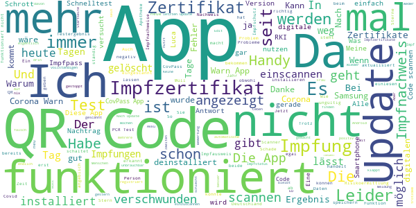

# Corona-Warn-App
App version ``2.4.3``

Analyzed with [covid-apps-observer](http://github.com/covid-apps-observer) project, version ``0.1``

## App overview
| | |
|-------------------------|-------------------------| 
| **Name**&nbsp;&nbsp;&nbsp;&nbsp;&nbsp;&nbsp;&nbsp;&nbsp;&nbsp;&nbsp;&nbsp;&nbsp;&nbsp;&nbsp;&nbsp;&nbsp;&nbsp;&nbsp;&nbsp;&nbsp;&nbsp;&nbsp;&nbsp;&nbsp;&nbsp;&nbsp;&nbsp;&nbsp;&nbsp;&nbsp;&nbsp;&nbsp;&nbsp;&nbsp;&nbsp;&nbsp;&nbsp;&nbsp;&nbsp;&nbsp;  | Corona-Warn-App |
| **Unique identifier** | de.rki.coronawarnapp |
| **Link to Google Play** | [https://play.google.com/store/apps/details?id=de.rki.coronawarnapp](https://play.google.com/store/apps/details?id=de.rki.coronawarnapp) |
| **Summary**  | Gemeinsam Corona bekämpfen |
| **Privacy policy** | [https://www.coronawarn.app/assets/documents/cwa-privacy-notice-de.pdf](https://www.coronawarn.app/assets/documents/cwa-privacy-notice-de.pdf) |
| **Latest version** | 2.4.3 |
| **Last update** | 2021-06-30 15:53:14 |
| **Recent changes** | Version 2.4.3: Mit diesem Update beheben wir Fehler mit der Darstellung des vollständigen Impfschutzes und einer Downloadfunktion.  Was war neu mit Version 2.4: - Sie können nun ein offizielles digitales COVID-Testzertifikat der EU anfordern und anschließend den zugehörigen QR-Code im neuen &quot;Zertifikate&quot;-Bereich der App innerhalb der EU verwenden, um negative Testergebnisse nachzuweisen (z.B. für Reisen). - Sobald Ihr Testergebnis vorliegt, wird es nun auch Ihrem Kontakt-Tagebuch hinzugefügt. |
| **Installs**  | 10.000.000+ |
| **Category** | Gesundheit & Fitness |
| **First release** | 12.06.2020 |
| **Size**  | 16M |
| **Supported Android version**  | 6.0 oder höher |

### Description
> Das Robert Koch-Institut (RKI) als zentrale Einrichtung des Bundes im Bereich der Öffentlichen Gesundheit und als nationales Public-Health-Institut veröffentlicht die Corona-Warn-App für die deutsche Bundesregierung und für die Bundesrepublik Deutschland. Die App fungiert als digitale Ergänzung zu Abstandhalten, Hygiene und Alltagsmaske. Die App basiert auf Bluetooth-Technologie und der Exposure Notification API von Google. Wer sie nutzt, hilft, Infektionsketten schnell nachzuverfolgen und zu durchbrechen. Außerdem bietet die App eine Funktionalität, mit der Sie digitale Impfzertifikate hinzufügen können, um damit Ihren Impfstatus nachzuweisen. Die App merkt sich dezentral unsere Begegnungen mit anderen und informiert uns digital, wenn wir Begegnungen mit nachweislich infizierten Personen hatten. Dabei sammelt sie jedoch zu keiner Zeit Informationen zur Identität ihrer Nutzerinnen und Nutzer. Wer wir sind und wo wir sind, bleibt geheim – und unsere Privatsphäre bestens geschützt.
 WIE DIE APP FUNKTIONIERT
 Die Risiko-Ermittlung der App ist das Herzstück der Software und sollte immer aktiviert sein. Wann immer sich Nutzerinnen und Nutzer begegnen, tauschen ihre Smartphones über Bluetooth verschlüsselte Zufalls-IDs aus.
 Diese geben nur Auskunft darüber, über welche Dauer und mit welchem Abstand eine Begegnung stattfand. Welche Person sich hinter einem Code verbirgt, ist für niemanden nachvollziehbar. Die Corona-Warn-App erhebt keine Informationen über den Ort der Begegnung oder den Standort der Nutzerinnen und Nutzer.
 Entsprechend der maximalen Corona-Inkubationszeit werden alle Zufalls-IDs, die unser Smartphone sammelt, für 14 Tage auf dem Smartphone gespeichert – und dann gelöscht.
 Nur wenn eine Person sich über die App freiwillig als nachweislich infiziert meldet, erhalten daraufhin alle früheren Begegnungen eine Warnung auf ihr Smartphone.
 Niemand erfährt, wann, wo oder mit wem eine entsprechende Risiko-Begegnung stattfand. Die infizierte Person bleibt anonym.
 Mit der Benachrichtigung erhalten die betroffenen Nutzer/-innen klare Handlungsempfehlungen. Wichtig: Auch die Daten der Benachrichtigten sind zu keiner Zeit einsehbar.
 WIE DIE DATEN SICHER BLEIBEN
 Die Corona-Warn-App soll uns zwar täglich begleiten, sie wird uns jedoch nie kennenlernen. Dadurch kann sie niemandem verraten, wer wir sind. Der Datenschutz bleibt über die gesamte Nutzungsdauer zu 100 Prozent gewahrt.
 • Keine Anmeldung: Es müssen keine E-Mail-Adresse und kein Name hinterlegt werden.
 • Keine Rückschlüsse auf Identitäten: Bei einer Begegnung mit einem anderen Menschen tauschen die Smartphones nur Zufalls-IDs aus. Diese messen, über welche Dauer und mit welchem Abstand ein Kontakt stattfand. Sie lassen aber keine Rückschlüsse auf Personen und Standorte zu.
 • Dezentrale Speicherung: Die Daten werden nur auf dem Smartphone gespeichert und nach 14 Tagen gelöscht.
 • Keine Einsicht für Dritte: Sowohl die Personen, die eine nachgewiesene Infektion melden, als auch die Benachrichtigten sind nicht nachverfolgbar – nicht für die Bundesregierung, nicht für das Robert Koch-Institut, nicht für andere User und auch nicht für die Betreiber der App-Stores.
 Diese App ist nicht zum Gebrauch außerhalb Deutschlands bestimmt. Die Corona-Warn-App ist die zentrale Corona-App für Deutschland und sie ist an das deutsche Gesundheitssystem angeschlossen. Trotzdem ist die Corona-Warn-App auch in diesem Land verfügbar. Sie ist gedacht für alle, die in Deutschland leben, arbeiten, Urlaub machen oder sich regelmäßig oder über längere Zeit in Deutschland aufhalten.
 Es gelten die Nutzungsbedingungen der Corona-Warn-App: https://www.coronawarn.app/assets/documents/cwa-eula-de.pdf. Durch die Installation und Nutzung dieser App stimmen Sie den Nutzungsbedingungen zu.

### User interface
The developers of the app provide the following screenshots in the Google play store.
| | | |
|:-------------------------:|:-------------------------:|:-------------------------:|
 |   |   |   | 
 |   |   |   | 
 |   |  

## Development team
In the following we report the main information provided by the development team in the Google play store.

| | |
|-------------------------|-------------------------|
| **Developer**  | Robert Koch-Institut |
| **Website**  | [https://www.coronawarn.app](https://www.coronawarn.app) |
| **Email** | CoronaWarnApp@rki.de |
| **Physical address**  | [Robert Koch-Institut Nordufer 20 13353 Berlin](https://www.google.com/maps/search/Robert%20Koch-Institut%20Nordufer%2020%2013353%20Berlin) (Google Maps) |
| **Other developed apps**  | [https://play.google.com/store/apps/developer?id=Robert+Koch-Institut](https://play.google.com/store/apps/developer?id=Robert+Koch-Institut) |

## Android support

| | |
|-------------------------|-------------------------|
| **Declared target Android version**  | Android10, version 10 (API level 29) |
| **Effective target Android version**  | Android10, version 10 (API level 29) |
| **Minimum supported Android version**  | Marshmallow, version 6.0 (API level 23) |
| **Maximum target Android version**  | - |

The larger the difference between the minimum and maximum supported Android versions, the better. A larger difference means a wider audience. For example, old phones have a very low Android version, so a high minimum supported Android version means that the app cannot be used by users with old phones, thus leading to accessibility problems. 

## Requested permissions

In the following we report the complete list of the permissions requested by the app. 

| **Permission** | **Protection level** | **Description** | 
|-------------------------|-------------------------|-------------------------|
 **android.permission ACCESS_NETWORK_STATE** | Normal | Allows applications to access information about networks. 
 **android.permission BLUETOOTH** | Normal | Allows applications to connect to paired bluetooth devices. 
 **android.permission CAMERA** | :warning:**Dangerous** | Required to be able to access the camera device. 
 **android.permission FOREGROUND_SERVICE** | Normal | Allows a regular application to use Service.startForeground. 
 **android.permission INTERNET** | Normal | Allows applications to open network sockets. 
 **android.permission RECEIVE_BOOT_COMPLETED** | Normal | Allows an application to receive the Intent.ACTION_BOOT_COMPLETED that is broadcast after the system finishes booting. 
 **android.permission REQUEST_IGNORE_BATTERY_OPTIMIZATIONS** | Normal | Permission an application must hold in order to use Settings.ACTION_REQUEST_IGNORE_BATTERY_OPTIMIZATIONS. 
 **android.permission WAKE_LOCK** | Normal | Allows using PowerManager WakeLocks to keep processor from sleeping or screen from dimming. 

## Mentioned servers

| **Server** | **Registrant** | **Registrant country** | **Creation date** | 
|-------------------------|-------------------------|-------------------------|-------------------------|
 | google.com | Google LLC | :us: US | 1997-09-15 04:00:00 |
 | android.com | Google LLC | :us: US | 1997-06-23 04:00:00 |

## Security analysis 

Below we report the main security warnings raised by our execution of the [Androwarn](https://github.com/maaaaz/androwarn) security analysis tool.

**Connection interfaces exfiltration**
> - This application reads details about the currently active data network 
> - This application tries to find out if the currently active data network is metered 

**Telephony services abuse**
> - This application makes phone calls 

**Suspicious connection establishment**
> - This application opens a Socket and connects it to the remote address '; port is out of range' on the 'N/A' port  
> - This application opens a Socket and connects it to the remote address 'Lcom/android/tools/r8/GeneratedOutlineSupport;->outline42(Ljava/lang/String;)Ljava/lang/StringBuilder;' on the 'N/A' port  
> - This application opens a Socket and connects it to the remote address 'Ljava/net/Proxy;->type()Ljava/net/Proxy$Type;' on the 'N/A' port  
> - This application opens a Socket and connects it to the remote address 'Method sendUrgentData() is not supported.' on the 'N/A' port  
> - This application opens a Socket and connects it to the remote address 'Method setHandshakeTimeout() is not supported.' on the 'N/A' port  
> - This application opens a Socket and connects it to the remote address 'Method setOOBInline() is not supported.' on the 'N/A' port  
> - This application opens a Socket and connects it to the remote address 'Method setSoWriteTimeout() is not supported.' on the 'N/A' port  
> - This application opens a Socket and connects it to the remote address 'Socket closed' on the 'N/A' port  
> - This application opens a Socket and connects it to the remote address 'Socket is closed' on the 'N/A' port  
> - This application opens a Socket and connects it to the remote address 'Socket is closed.' on the 'N/A' port  
> - This application opens a Socket and connects it to the remote address 'Socket is not connected.' on the 'N/A' port  
> - This application opens a Socket and connects it to the remote address 'socket is closed' on the 'N/A' port  
> - This application opens a Socket and connects it to the remote address 'timeout' on the 'N/A' port  

**Code execution**
> - This application loads a native library 
> - This application loads a native library: 'conscrypt_gmscore_jni' 
> - This application loads a native library: 'conscrypt_jni' 

## User ratings and reviews

Below we provide information about how end users are reacting to the app in terms of ratings and reviews in the Google Play store.

### Ratings

The Corona-Warn-App app has been installed by more than **10000000** times. At this time, **128431** rated the app and its average score is **3.486924**. Below we show the distribution of the ratings across the usual star-based rating of Google Play

:star::star::star::star::star:: 56834

:star::star::star::star:: 17798

:star::star::star:: 14587

:star::star:: 9495

:star:: 29717

### Reviews 

#### 5-star reviews

> Tut, was sie soll. Alles prima. Gut, dass es die App kostenlos gibt!  :date: __2021-07-04 16:14:50__

> App macht was sie soll....ist informativ und funktioniert .....  :date: __2021-07-04 15:20:04__

> Nach dem letzten Update funktioniert auch die Übertragung des Impfzertifikats einwandfrei  :date: __2021-07-04 14:39:11__

> Tests zu registrieren ist einfach und auch der Rest scheint sehr gut zu funktionieren Und was Datenschutz angeht ist diese App der luca app um Welten vorraus  :date: __2021-07-04 13:53:26__

> Finde ich gut 👍  :date: __2021-07-04 13:25:48__

> Mittlerweile bin ich sehr zufrieden. Finde es gut das Impfnachweise mit eingebunden werden.  :date: __2021-07-04 13:04:53__

> Top. Datenschutz 1A  :date: __2021-07-04 13:04:24__

> Das digitale Testzertifikat ist nach über einer Stunde (noch?) nicht abrufbar. Wie lange kann es dauern bis das digitale EU Testzertifikat in der app angezeigt wird? edit: danke für die schnelle Antwort. ich kann glaube ich nicht direkt zurück antworten, daher der edit. Ja, das ist der Fall. Folgende exception kommt auf: "de.rki.coronawarnapp.covidcertificate.exception.TestCertificateServerException: Private key request failed." edit 2: es scheint jetzt alles zu funktionieren. Ihr seid super :)  :date: __2021-07-04 11:17:48__

> Sehr zufrieden. Informativ, effektiv und eine extra App für den digitalen Impfpass erübrigt sich. Passt!  :date: __2021-07-04 09:34:28__

> Dir App funktioniert sehr gut .  :date: __2021-07-04 09:19:25__

#### 4-star reviews

> Das Menü ist gut zu verstehen  :date: __2021-07-04 13:51:22__

> Frage: Wie soll ich den QR Code Scannen, wenn mittlerweile die Testzentren uns via Email die Ergebnisse liefern. Warum gibt's da keine andere Möglichkeit? Vielleicht ein Foto aus dem Album scannen?  :date: __2021-07-04 11:10:53__

> Soweit, so gut. Ich habe vor vier Tagen die 2. Impfung bekommen. Also heute ist der 3. Tag nach der Impfung. Die App zeigt: Vollständiger Impfschutz in 12 Tagen. Irgendwie werde ich aus der Zählweise nicht schlau. Ab heute ist der volle Impfschutz am 12. Tag ab heute? Oder nach dem 12. Tag? Wegen notwendiger Auslandsfahrt geht es um diesen einen Tag.  :date: __2021-07-04 10:33:14__

> Seit die App täglich(!) Pushnachrichten sendet, musste ich die Benachrichtigungen ausstellen und überlege, die App nicht mehr zu nutzen. Ich habe sie bisher gewissenhaft und von Anfang an genutzt, aber während einer Niedriginzidenzzeit sind solche täglichen Erinnerungen einfach übertrieben.  :date: __2021-07-04 10:23:33__

> Soweit okay, aber wann kann man die Zertifikate von weiteren Personen einlesen?  :date: __2021-07-03 22:36:14__

> Den QR-Code konnte ich Scannen und wenn ich versuche den noch einmal zu scannen erhalte ich auch eine Fehlermeldung (kann ich nicht interpretiere), aber wie kann ich mir das Zertifikat ansehen, bzw. auf Verlangen vorzeigen? Das ist doof das nd nicht praxistauglich. Ich hoffe, dass es bald funktioniert. Habe es gefunden. Direkt über Test scannen. Also, Augen auf . 😉 Funktion war nach einem Neustart vorhanden. Also, alles ok  :date: __2021-07-03 22:12:30__

> Ok  :date: __2021-07-03 19:55:15__

> Hallo, die App wird immer besser und ist informativ. Allerdings hatte ich folgendes Problem, da nicht jeder in unserer Familie ein Handy besitzt wollte ich mehrere Zertifikate verschiedener Personen einscannen. Dies ging leider nicht! Bei der Cov-Pass App war das möglich. Wäre schön wenn das noch in die App implementiert werden könnte. Gruß  :date: __2021-07-03 17:54:11__

> Ich habe die App von Beginn an installiert und schaue jeden Tag rein. Aber seit dem letzten oder vorletzten Update nervt es mich furchtbar, dass ich mehrmals täglich aufgefordert werde, per Push, die App aufzurufen. Falls ich Kontakt mit positiven Leuten gehabt habe, werde ich doch sowieso benachrichtigt...also, was soll das dann? Kann man das bitte wieder abstellen?  :date: __2021-07-03 15:28:19__

> Hallo, das Hinzufügen von Zertifikaten funktioniert leider nur für eine Person und Smartphone. Oma & Opa haben aber leider nur ein Smartphone. Bitte baut die Funktion aus so das man mehrere Zertifikat in der App hinterlegen kann. Danke  :date: __2021-07-03 15:02:36__

#### 3-star reviews

> Alle verfügbaren QR Scanner funktionieren nicht. Sonst wären es 5 Sterne.  :date: __2021-07-04 13:40:19__

> Achtung jjľjjjl v  :date: __2021-07-04 13:10:43__

> Die App zieht viel zu viel Akku da das Bluetooth ständig abgeschaltet bleiben muss  :date: __2021-07-04 12:32:12__

> Sinnlose App im Namen des Datenschutzes. Könnte so viel . Kann so wenig.. Jetzt kann man handisch Namen und Orte pflegen... mit ner App die Zugriff auf GPS hat. Wundert mich das man das nicht vorher ausdrucken und Faxen muss. Wer zur Hölle pflegt denn das da manuell täglich ein ... Wie der digitale perso und die egk eine weitere lachnummer unserer Bundes- IT.. Update: Sie macht sich langsam. Gut ist sie bestimmt sobald corona zu Ende ist  :date: __2021-07-04 09:54:21__

> Kann keine Luca-QR Codes lesen.  :date: __2021-07-04 08:01:36__

> Bei mir bis jetzt jetzt immer grün  :date: __2021-07-03 22:16:02__

> Es können zwar Impfzertifikate über QR-Code geladen werden. Mit Genesenenzertifikaten funktioniert dies nach meiner Erfahrung noch nicht. Schade.  :date: __2021-07-03 19:00:49__

> Leider kann der digitale Impfnachweis nur mit dem QR-Code-Scanner hinzugefügt werden. Dabei kann weder die Kamera gewechselt, noch ein QR Code aus der Gallerie genutzt werden. M.E. gibt es genug Usecases, bspw. eine defekte Hauptkamera, welche mehr Funktionen nötig erscheinen lassen.  :date: __2021-07-03 17:19:07__

> Die App scheint den Akku schneller zu leeren.  :date: __2021-07-03 12:07:30__

> Wenn zu wenig MENSCHEN diese App nutzen was bringt es dann?Warum funktioniert das Code System mal ja mal Nein..  :date: __2021-07-03 11:59:49__

#### 2-star reviews

> Schon wieder nur halber Kram...Impfzertifikate von Angehörigen die kein Smartphone haben können nicht angelegt werden...dazu ist wieder eine andere App notwendig..diese App ist von Anbeginn eine einzige Baustelle  :date: __2021-07-04 17:31:43__

> Der QR Code wird nicht erkannt. Auch nach mehrmaligen einscannversuchen geht es einfach nicht. Es gibt auch keinen Hinweis beim einscannen, warum es nicht geht. Schade!  :date: __2021-07-04 13:21:12__

> Die Entwickler sollten vielleicht mal bei den Entwicklern der Luka App in die Lehre gehen der QR Scanner bei der Luka App funktioniert einwandfrei und schnell und hier zickt der QR Scanner fürchterlich rum bis er sich irgendwann entscheidet doch den Code zu erkennen  :date: __2021-07-04 12:06:45__

> Warum wird nicht der Luca-App QR-Code akzeptiert?! Die sonst gute App funktioniert NICHT, wie überall beschrieben, ausschließlich mit Bluetooth, sondern ZWINGEND NUR MIT GPS! Ergebnis: Da GPS sehr viel Strom benötigt, hält der Akku nur knapp einen Tag. Workarround: Zuhause Bluetooth und GPS ausschalten. Fazit: Für Android (fast) nicht geeignet, leider. Auch die Erklärung des RKI zu den technischen Umständen für Bluetooth und GPS ändert ja nichts an dem Umstand und damit an der Bewertung.  :date: __2021-07-04 10:17:34__

> Bin genesen und mit Moderna geimpft. Als Genesener bekommt man nur eine Impfung. Ich habe die Impfung eingegeben diese wird aber nur als unvollständig angezeigt. Ich bekomme halt nur eine. Da solltet ihr nochmal ran gehen.  :date: __2021-07-04 10:01:55__

> Das Einlesen des QR-Codes macht mir Sorgen. Das Ergebnis sieht total anders aus als auf dem Zertifikat, das ich vom RKI bekommen habe. (Die Cov-Pass-App kann das hingegen!) Allerdings ist die Zertifikatskennung korrekt. Warum der QR Code nicht?  :date: __2021-07-04 09:45:59__

> Was nutzen einem die Zusatzfunktionen, wenn dann doch zusätzliche APP´s notwendig sind um diese sinnvoll zu nutzen? Es kann nur ein Impfpass eingelesen werden, will man auch den Partner einlesen, benötigt man die CovPass APP! An zwei Weingütern kam beim QR-Code einlesen auf zwei Geräten die Meldung dies sei "kein Luca kompatibler QR-Code"! Aber das Einlesen in der Luca APP geht ohne Probleme! Anstatt einer habe ich jetzt 3 APP´s installiert und hoffe, dass zumindest die Grundfunktion der APP funktioniert?!  :date: __2021-07-04 09:35:45__

> Störung bei der Risikoermittlung fehlerhaft wird ermittelt  :date: __2021-07-04 04:45:22__

> UNVERÄNDERT seit mehreren WOCHEN ist der Wurm drin, d Risikoermittlung fällt annähernd tägl aus. Auch mit 2.4.3: trotz Update fällt d Risikoermittlung ca. 2 h später wieder aus! Neustart behebt das Problem kurzfristig die Risikobewertung lässt sich wieder aktivieren, um dann ohne erkennbaren Grund erneut auszufallen. Zu 2.: Der Link leitet einen hier her u verlangt die Installation v CWA, d aber bereits installiert ist 😐, nicht nachzuvollziehen 2 statt 5 - sorry. \*\**RIP KULLO\*\**  :date: __2021-07-04 02:35:13__

> Kann das Testzertifikat abrufen ist immer Fehler. Bitte um Hilfe  :date: __2021-07-04 00:10:41__

#### 1-star reviews

> Test QR-Code angeblich ungültig, funktioniert aber anschließend bei CovPass. Die Verfolgung funktioniert bei mir nicht, da meine Play-Dienste die "Cov19-Benachrichtigungen" nicht installiert haben (Android11/OriginOS) Lösung: Corona Contact Tracing über F-Droid installieren -> gleiche Funktion. Fazit: Diese App ist für mich völlig unbrauchbar.  :date: __2021-07-04 17:09:50__

> Soeben versucht meinen Antigen- Schnelltest in meiner Corona-Warn-App runterzuladen. Qr-Code nicht erkannt??  :date: __2021-07-04 16:22:56__

> Da habt ihr wieder Mal eine Bewertung zum Löschen ....Schade um die Steuern.  :date: __2021-07-04 16:17:39__

> Was ein Schwachsinn! Seit dem letzten Update sind meine Impf-Zertifikate nicht mehr in der App und beim erneuten Scan erhalte ich die Meldung, dass der QR Code ungültig ist. Ich werde diese App nicht mehr verwenden.  :date: __2021-07-04 16:05:36__

> 2. Impfzertifikat für Ehegatten etc. können nicht importiert werden. Jetzt fliegt die App endgültig runter!  :date: __2021-07-04 15:33:47__

> Leuchtet im dunkeln.  :date: __2021-07-04 15:24:18__

> Geht leider nicht beim samsung s3  :date: __2021-07-04 13:58:03__

> Die App hat sich bei der Kontaktnachvervolgung aufgehängt, seit dem 26.06 immer das selbe Problem, heute ist der 04.07.21 und es wird immer noch der 26.06 angezeigt. App deinstalliert.  :date: __2021-07-04 13:53:10__

> QR-Code Scanner funktioniert weder hier noch in der CovPass App. Hab ein nagelneues Samsung A52 5G  :date: __2021-07-04 12:59:40__

> Obwohl die App gelöscht wurde, werden personenbezogene Daten weiterverwendet. Ich erhielt eine Info per SMS, über Gesundheitsanweisungen, nachdem ich aus dem Ausland einreiste. Die Nummer ist sonst nirgendwo bekannt.  :date: __2021-07-04 12:05:06__

