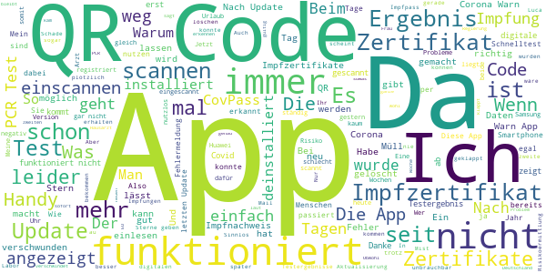

# Corona-Warn-App
App version ``2.5.1``

Analyzed with [covid-apps-observer](http://github.com/covid-apps-observer) project, version ``0.1``

## App overview
| | |
|-------------------------|-------------------------| 
| **Name**&nbsp;&nbsp;&nbsp;&nbsp;&nbsp;&nbsp;&nbsp;&nbsp;&nbsp;&nbsp;&nbsp;&nbsp;&nbsp;&nbsp;&nbsp;&nbsp;&nbsp;&nbsp;&nbsp;&nbsp;&nbsp;&nbsp;&nbsp;&nbsp;&nbsp;&nbsp;&nbsp;&nbsp;&nbsp;&nbsp;&nbsp;&nbsp;&nbsp;&nbsp;&nbsp;&nbsp;&nbsp;&nbsp;&nbsp;&nbsp;  | Corona-Warn-App |
| **Unique identifier** | de.rki.coronawarnapp |
| **Link to Google Play** | [https://play.google.com/store/apps/details?id=de.rki.coronawarnapp](https://play.google.com/store/apps/details?id=de.rki.coronawarnapp) |
| **Summary**  | Gemeinsam Corona bekämpfen |
| **Privacy policy** | [https://www.coronawarn.app/assets/documents/cwa-privacy-notice-de.pdf](https://www.coronawarn.app/assets/documents/cwa-privacy-notice-de.pdf) |
| **Latest version** | 2.5.1 |
| **Last update** | 2021-07-07 18:08:36 |
| **Recent changes** | Dieses Update bietet Ihnen folgende neue Funktionen:  - Sie können nun in der App digitale COVID-Genesenenzertifikate der EU hinzufügen. Damit können Sie z.B. bei Reisen innerhalb der EU eine frühere Infektion nachweisen. - Sie können nun digitale COVID-Zertifikate der EU von Familienmitgliedern in der App hinzufügen und verwalten, um diese z.B. bei Auslandsreisen vorzeigen zu können. - Es sind nun unterschiedliche Impfstatistiken zu geimpften Personen und verabreichten Impfdosen verfügbar. |
| **Installs**  | 10.000.000+ |
| **Category** | Gesundheit & Fitness |
| **First release** | 12.06.2020 |
| **Size**  | 17M |
| **Supported Android version**  | 6.0 oder höher |

### Description
> Das Robert Koch-Institut (RKI) als zentrale Einrichtung des Bundes im Bereich der Öffentlichen Gesundheit und als nationales Public-Health-Institut veröffentlicht die Corona-Warn-App für die deutsche Bundesregierung und für die Bundesrepublik Deutschland. Die App fungiert als digitale Ergänzung zu Abstandhalten, Hygiene und Alltagsmaske. Die App basiert auf Bluetooth-Technologie und der Exposure Notification API von Google. Wer sie nutzt, hilft, Infektionsketten schnell nachzuverfolgen und zu durchbrechen. Außerdem bietet die App eine Funktionalität, mit der Sie digitale Impfzertifikate hinzufügen können, um damit Ihren Impfstatus nachzuweisen. Die App merkt sich dezentral unsere Begegnungen mit anderen und informiert uns digital, wenn wir Begegnungen mit nachweislich infizierten Personen hatten. Dabei sammelt sie jedoch zu keiner Zeit Informationen zur Identität ihrer Nutzerinnen und Nutzer. Wer wir sind und wo wir sind, bleibt geheim – und unsere Privatsphäre bestens geschützt.
 WIE DIE APP FUNKTIONIERT
 Die Risiko-Ermittlung der App ist das Herzstück der Software und sollte immer aktiviert sein. Wann immer sich Nutzerinnen und Nutzer begegnen, tauschen ihre Smartphones über Bluetooth verschlüsselte Zufalls-IDs aus.
 Diese geben nur Auskunft darüber, über welche Dauer und mit welchem Abstand eine Begegnung stattfand. Welche Person sich hinter einem Code verbirgt, ist für niemanden nachvollziehbar. Die Corona-Warn-App erhebt keine Informationen über den Ort der Begegnung oder den Standort der Nutzerinnen und Nutzer.
 Entsprechend der maximalen Corona-Inkubationszeit werden alle Zufalls-IDs, die unser Smartphone sammelt, für 14 Tage auf dem Smartphone gespeichert – und dann gelöscht.
 Nur wenn eine Person sich über die App freiwillig als nachweislich infiziert meldet, erhalten daraufhin alle früheren Begegnungen eine Warnung auf ihr Smartphone.
 Niemand erfährt, wann, wo oder mit wem eine entsprechende Risiko-Begegnung stattfand. Die infizierte Person bleibt anonym.
 Mit der Benachrichtigung erhalten die betroffenen Nutzer/-innen klare Handlungsempfehlungen. Wichtig: Auch die Daten der Benachrichtigten sind zu keiner Zeit einsehbar.
 WIE DIE DATEN SICHER BLEIBEN
 Die Corona-Warn-App soll uns zwar täglich begleiten, sie wird uns jedoch nie kennenlernen. Dadurch kann sie niemandem verraten, wer wir sind. Der Datenschutz bleibt über die gesamte Nutzungsdauer zu 100 Prozent gewahrt.
 • Keine Anmeldung: Es müssen keine E-Mail-Adresse und kein Name hinterlegt werden.
 • Keine Rückschlüsse auf Identitäten: Bei einer Begegnung mit einem anderen Menschen tauschen die Smartphones nur Zufalls-IDs aus. Diese messen, über welche Dauer und mit welchem Abstand ein Kontakt stattfand. Sie lassen aber keine Rückschlüsse auf Personen und Standorte zu.
 • Dezentrale Speicherung: Die Daten werden nur auf dem Smartphone gespeichert und nach 14 Tagen gelöscht.
 • Keine Einsicht für Dritte: Sowohl die Personen, die eine nachgewiesene Infektion melden, als auch die Benachrichtigten sind nicht nachverfolgbar – nicht für die Bundesregierung, nicht für das Robert Koch-Institut, nicht für andere User und auch nicht für die Betreiber der App-Stores.
 Diese App ist nicht zum Gebrauch außerhalb Deutschlands bestimmt. Die Corona-Warn-App ist die zentrale Corona-App für Deutschland und sie ist an das deutsche Gesundheitssystem angeschlossen. Trotzdem ist die Corona-Warn-App auch in diesem Land verfügbar. Sie ist gedacht für alle, die in Deutschland leben, arbeiten, Urlaub machen oder sich regelmäßig oder über längere Zeit in Deutschland aufhalten.
 Es gelten die Nutzungsbedingungen der Corona-Warn-App: https://www.coronawarn.app/assets/documents/cwa-eula-de.pdf. Durch die Installation und Nutzung dieser App stimmen Sie den Nutzungsbedingungen zu.

### User interface
The developers of the app provide the following screenshots in the Google play store.
| | | |
|:-------------------------:|:-------------------------:|:-------------------------:|
 |   |   |   | 
 |   |   |   | 
 |   |  

## Development team
In the following we report the main information provided by the development team in the Google play store.

| | |
|-------------------------|-------------------------|
| **Developer**  | Robert Koch-Institut |
| **Website**  | [https://www.coronawarn.app](https://www.coronawarn.app) |
| **Email** | CoronaWarnApp@rki.de |
| **Physical address**  | [Robert Koch-Institut Nordufer 20 13353 Berlin](https://www.google.com/maps/search/Robert%20Koch-Institut%20Nordufer%2020%2013353%20Berlin) (Google Maps) |
| **Other developed apps**  | [https://play.google.com/store/apps/developer?id=Robert+Koch-Institut](https://play.google.com/store/apps/developer?id=Robert+Koch-Institut) |

## Android support

| | |
|-------------------------|-------------------------|
| **Declared target Android version**  | Android10, version 10 (API level 29) |
| **Effective target Android version**  | Android10, version 10 (API level 29) |
| **Minimum supported Android version**  | Marshmallow, version 6.0 (API level 23) |
| **Maximum target Android version**  | - |

The larger the difference between the minimum and maximum supported Android versions, the better. A larger difference means a wider audience. For example, old phones have a very low Android version, so a high minimum supported Android version means that the app cannot be used by users with old phones, thus leading to accessibility problems. 

## Requested permissions

In the following we report the complete list of the permissions requested by the app. 

| **Permission** | **Protection level** | **Description** | 
|-------------------------|-------------------------|-------------------------|
 **android.permission ACCESS_NETWORK_STATE** | Normal | Allows applications to access information about networks. 
 **android.permission BLUETOOTH** | Normal | Allows applications to connect to paired bluetooth devices. 
 **android.permission CAMERA** | :warning:**Dangerous** | Required to be able to access the camera device. 
 **android.permission FOREGROUND_SERVICE** | Normal | Allows a regular application to use Service.startForeground. 
 **android.permission INTERNET** | Normal | Allows applications to open network sockets. 
 **android.permission RECEIVE_BOOT_COMPLETED** | Normal | Allows an application to receive the Intent.ACTION_BOOT_COMPLETED that is broadcast after the system finishes booting. 
 **android.permission REQUEST_IGNORE_BATTERY_OPTIMIZATIONS** | Normal | Permission an application must hold in order to use Settings.ACTION_REQUEST_IGNORE_BATTERY_OPTIMIZATIONS. 
 **android.permission WAKE_LOCK** | Normal | Allows using PowerManager WakeLocks to keep processor from sleeping or screen from dimming. 

## Mentioned servers

| **Server** | **Registrant** | **Registrant country** | **Creation date** | 
|-------------------------|-------------------------|-------------------------|-------------------------|
 | google.com | Google LLC | :us: US | 1997-09-15 04:00:00 |
 | android.com | Google LLC | :us: US | 1997-06-23 04:00:00 |

## Security analysis 

Below we report the main security warnings raised by our execution of the [Androwarn](https://github.com/maaaaz/androwarn) security analysis tool.

**Connection interfaces exfiltration**
> - This application reads details about the currently active data network 
> - This application tries to find out if the currently active data network is metered 

**Telephony services abuse**
> - This application makes phone calls 

**Suspicious connection establishment**
> - This application opens a Socket and connects it to the remote address '; port is out of range' on the 'N/A' port  
> - This application opens a Socket and connects it to the remote address 'Lcom/android/tools/r8/GeneratedOutlineSupport;->outline42(Ljava/lang/String;)Ljava/lang/StringBuilder;' on the 'N/A' port  
> - This application opens a Socket and connects it to the remote address 'Ljava/net/Proxy;->type()Ljava/net/Proxy$Type;' on the 'N/A' port  
> - This application opens a Socket and connects it to the remote address 'Method sendUrgentData() is not supported.' on the 'N/A' port  
> - This application opens a Socket and connects it to the remote address 'Method setHandshakeTimeout() is not supported.' on the 'N/A' port  
> - This application opens a Socket and connects it to the remote address 'Method setOOBInline() is not supported.' on the 'N/A' port  
> - This application opens a Socket and connects it to the remote address 'Method setSoWriteTimeout() is not supported.' on the 'N/A' port  
> - This application opens a Socket and connects it to the remote address 'Socket closed' on the 'N/A' port  
> - This application opens a Socket and connects it to the remote address 'Socket is closed' on the 'N/A' port  
> - This application opens a Socket and connects it to the remote address 'Socket is closed.' on the 'N/A' port  
> - This application opens a Socket and connects it to the remote address 'Socket is not connected.' on the 'N/A' port  
> - This application opens a Socket and connects it to the remote address 'socket is closed' on the 'N/A' port  
> - This application opens a Socket and connects it to the remote address 'timeout' on the 'N/A' port  

**Code execution**
> - This application loads a native library 
> - This application loads a native library: 'conscrypt_gmscore_jni' 
> - This application loads a native library: 'conscrypt_jni' 

## User ratings and reviews

Below we provide information about how end users are reacting to the app in terms of ratings and reviews in the Google Play store.

### Ratings

The Corona-Warn-App app has been installed by more than **10000000** times. At this time, **129770** rated the app and its average score is **3.4768057**. Below we show the distribution of the ratings across the usual star-based rating of Google Play

:star::star::star::star::star:: 56826

:star::star::star::star:: 18157

:star::star::star:: 14981

:star::star:: 9677

:star:: 30129

### Reviews 

#### 5-star reviews

> Supet  :date: __2021-07-23 19:05:17__

> Tolle App, weiter so. Beste App ever.  :date: __2021-07-23 18:56:31__

> Ich finde die App gut. Bisher hat das Einchecken gut funktioniert und die Impfung hochladen ging fix. Man hat alles nötige dabei 👍  :date: __2021-07-23 17:23:40__

> Tolle App läuft störungsfrei  :date: __2021-07-23 14:02:13__

> Funktioniert im Alltag (NRW) besser als die Luca App.  :date: __2021-07-23 12:48:37__

> Es wäre gut, wenn die App auch Impfzertifikate anderer Personen (Familienmitglieder oä) verwalten könnte, wie dies mit CovPass möglich ist. Nachtrag: Respekt, das neue feature ist ja sehr schnell verfügbar!  :date: __2021-07-23 12:39:07__

> Nutze die App wieder seitdem ich sie als Impfpass verwenden kann wieder. Kann man nicht beschweren. Lediglich ist das Einscannen des Zertifikats nur bei sehr guten Lichtverhältnissen möglich.  :date: __2021-07-23 12:12:18__

> Einfach und gut.  :date: __2021-07-23 11:30:42__

> Ist gut.  :date: __2021-07-23 10:03:41__

> Die App ist Klasse. Die Zertifikate lassen sich ganz einfach scannen,prima. Sonst funktioniert die App auch tadellos. Zeigt Riskobegnungen an,und es klappt alles reibungslos. Manchmal verstehe ich nur nicht ,warum manche die App so schlecht bewerten,dabei ist sie gut und es funktioniert alles einwandfrei. Sonst alles bestens.  :date: __2021-07-23 09:00:00__

#### 4-star reviews

> Danke für die Rückmeldung. Nach dem Lesen Ihres Feedbacks bin ich in die App gegangen und habe nach den Zertifikaten geschaut. Habe die Auflistung von beiden gefunden. Danach hat die App erneut aktualisiert und die Übersicht ist nun auf dem aktuellen Stand. --- Meine App aktualisiert sich jeden Tag, allerdings bleiben der Bereich von Neuinfektionen etc. auf dem Stand 02.07.21. Auch die Übersicht zum Impfschutz nach der zweiten Impfung bekomme ich nicht angezeigt. Version 2.5.1  :date: __2021-07-23 20:28:37__

> Leider funktioniert bei mir der Check in nicht. Wenn ich die Kamera auf einen QR Code für die Corona App halte, passiert nichts - keine Fehlermeldung, keine Verarbeitung. Halte ich die Kamera für einen QR Code der Luca App erscheint eine Fehlermeldung.  :date: __2021-07-23 15:44:19__

> Gute App, die ich auch gerne nutze. Nach dem neusten Update (22.07.21) wird allerdings leider nicht mehr direkt auf der Startseite der Impfstatus (inkl. gültig bis) angezeigt und wenn ich auf die Impfzertifikate gehe, habe ich vermeintlich in 2023 die 2. Impfung erhalten. Liegt es am Update oder ggf. daran, dass ich die Zertifikate auf beiden Handies eingescannt habe?  :date: __2021-07-23 13:17:41__

> An sich alles top. Ich würde nur empfehlen, eine Sperre für Screenshots einzubauen. Zu mindest für die QR-Code Seiten.  :date: __2021-07-23 13:01:21__

> Meisten kann man im Lokal nur mit der Luca-App einchecken, obwohl es diese App auch kann und hier mehr Möglichkeiten zusammen kommen als in den anderen Apps. 1 App für vieles.  :date: __2021-07-23 11:46:35__

> Die APP ist recht gut durchdacht und Quell-offen. Ein Tipp aus der französischen CoronaAPP an RKI/IBM: Inzidenz und weitere BasisInfos zusätzlich auch nach PLZ. Ansonsten, weiter so. 👍😊  :date: __2021-07-23 07:36:31__

> Einfach gestaltete App. Habe mich, wenn Genesene, auf das Update gefreut. Dich ich erhalte immer nur die Indikation 1 von 1 Impfung. Nirgends steht, dass ich einen vollständigen Impfschutz habe. Das irritiert mich und ich muss weiterhin das Schreiben des Gesundheitsamtes mit mir führen oder aber zusätzlich eine weitere App laden. Was ich für unnütz halte. Gibt es weitere Entwicklungen diesbezüglich? Danke  :date: __2021-07-23 07:35:47__

> Seit dem letzten Update wird im Impfzertifikat nicht mehr "vollständig geimpft" angezeigt. Man muss umständlich zum Impfdatum und der Anzahl der Impfungen (1 von 1 oder 2 von 2) navigieren. Die fehlende Angabe "vollständig geimpft" hätte mir gerade fast den Check-in im Urlaub verhagelt.  :date: __2021-07-22 17:08:30__

> Registrierung der zweiten Impfung ist nicht möglich, Fehler: vc name missmatch / Registrierung bei CovPass App war ohne Probleme möglich. Problem wurde behoben.  :date: __2021-07-22 12:27:43__

> Kann meine Impfzerfitikat nicht hinzufügen. Scannt nicht! Doch jetzt geschafft. Man muss bisle hin und her bewegen.  :date: __2021-07-21 12:23:41__

#### 3-star reviews

> Wie dumm, dass man einen PCR Test QR-Code nur einmal scannen kann. Ich wollte ihn erneut einscannen, weil es hieß, gestern kommt mein Ergebnis und heute am Abend war immer noch nichts da. Toll jetzt habe ich kein Testzertifikat mehr auf dem Handy. Sinnlos  :date: __2021-07-23 19:43:04__

> Stehe im Krankenhaus und will mein Impfzertifikat aufrufen, nichts geht. Sehr peinlich und ärgerlich. Auch ein Neustart hilft nicht. Seit dem Update ist das Zertifikat weg!!! Update: Hallo vielen Dank für die schnelle Antwort. Anscheinend ist das Zertifikat nicht weg, sondern sieht deutlich anders aus. Selbst im Krankenhaus konnte niemand etwas damit anfangen. Vielleicht sollte die Gültigkeit für Menschen direkt lesbar sein.  :date: __2021-07-23 19:02:37__

> Die App zeigt jetzt als Zertifikat einen QR Code, ohne dessen Bedeutung anzugeben. Im Restaurant war also nicht erkennbar dass dies die zweite Impfung dokumentiert. Damit muss ich dann noch zusätzlich den Papierbeleg vorzeigen. Das ist eine mangelhafte Lösung. Bin mal gespannt ob das Zertifikat auf der App in Tschechien und Griechenland funktioniert.  :date: __2021-07-23 17:50:32__

> Es wäre gut, wenn die Daten zentral gespeichert werden. Das kann man mehrere Rechenzentren und CO2 sparen. Mein Kritikpunkt ist außerdem, dass die Benachrichtigungen, wenn jemand mit Corona infiziert ist, das die Informationen nicht richtig funktionieren.  :date: __2021-07-23 17:27:06__

> Es lassen sich die Impfzertifikate nicht scannen.  :date: __2021-07-23 16:34:36__

> An sich ja ne gute Sache. Allerdings kann ich mein Impfzertifikat dort nicht scannen und mich somit auch nicht als vollständig geimpft ausweisen. Sehr ärgerlich. Bitte beheben  :date: __2021-07-23 12:19:19__

> App Design ist toll. Aber leider ist die Funktion mit dem dezentralen Ansatz und viel Freiwilligkeit leider nicht zu gebrauchen. Sieht man ja jetzt an der Luca App für die bestimmt noch mal so viel Steuergeld ausgegeben wird wie für die CWA.  :date: __2021-07-23 10:46:25__

> Nachtrag zum Nachtrag: Beide Apps (Corona Warn App als auch CovPass) zeigen den vollständigen Impfschutz, den Namen und das Geburtsdatum und können beide erfolgreich mit CovPassCheck geprüft werden. Es verwirren nur die unterschiedlichen QR-Codes beider Apps für den gleichen Inhalt. Das wirft auch die Frage auf, ob beide gleichermaßen im Ausland angekannt werden oder ob man beide Apps braucht. Nebenbei: Corona Warn App hat hier zügig reagiert, CovPass dagegen noch gar nicht. Nachtrag nun zum Impfzertifikat: Warum zeigt die App ein anderes Ergebnis (Text und QR-Code) als die Cov Pass App obwohl bei beiden Apps die beiden gleichen Impfzertifikate eingelesen wurden? Die App macht, was sie soll. Sie funkt per Bluetooth und saugt damit den Akku etwas schneller leer. Der zwangsweise aktivierte GPS-Empfänger, der angeblich nicht ausgewertet wird, trägt wohl auch noch seinen Anteil dazu bei. Ansonsten ist die App recht langweilig. Keine verschiedenen Level zum Durchspielen, kein Highscore, keine List von Superspreadern, wo man sich an den Mitbewerbern messen kann. Aber vielleicht kommt das noch. Wahrscheinlich haben wir mittlerweile so wenige Neuinfektionen, dass die App noch gar keine aufgedeckt hat. Dann kann es auch keine Liste geben. Warten wir einfach mal ab ...  :date: __2021-07-23 10:27:13__

> Meine Testergebnisse bekomme ich leider nie angezeigt. Ich hab jedes mal schon den Anruf aus der Arztpraxis mit der Information dass das Ergebnis negativ war, aber selbst nach mehreren Tagen "liegt noch kein Ergebnis vor"  :date: __2021-07-23 08:54:33__

> Ich finde schade, daß Test-Ergebnisse von den eigenen Kindern (ohne eigenes Smartphone) nicht zusätzlich in der App hochgeladen werden können.  :date: __2021-07-23 08:19:18__

#### 2-star reviews

> Eigentlich eine tolle Idee. ABER: wenn man sich darauf verlassen muss, dass irgendwelche Dokumente abrufbar sind, darf es nicht passieren,dass sie plötzlich weg sind. Da helfen auch keine Tipps von Google oder ein erneutes Einscannen (wenn es denn hilft), wenn man irgendwo steht und das Impfzertifikat JETZT benötigt. Edit: wieder Zuhause: nach dem Druck auf den Scannen-Button ist auf dem Handy ein QR-Code zu sehen und mein Name. Keine weiteren Daten in menschenlesbarer Form. Fehlt da was?  :date: __2021-07-23 19:20:05__

> Scannt kein QR-Code code  :date: __2021-07-23 19:05:17__

> Schlecht  :date: __2021-07-23 16:09:32__

> Leider ist seit einiger Zeit keine Information über irgendwelche Begegnungen zu erkennen: Begegnungenwurden nochnichtüberprüft. Es wurde u.a. "Fehler 3" genannt.  :date: __2021-07-23 14:08:20__

> Zertifikat nach Update verloren. Wie bei allen anderen Kommentaren bringt natürlich auch hier ein beenden nichts...  :date: __2021-07-23 13:39:07__

> ⚠ bei Aktualisierung der App wird das Impfzertifikat gelöscht. Das geht gar nicht und muss zügig behoben werden. Gut das ich für den Fall immer eine Impfbescheinigung in der Tasche habe.  :date: __2021-07-23 10:02:12__

> App deinstalliert hatte nicht reagiert trotz bekannten Kontakt 2 mal u auch bei 3 ten im persönlichen Umfeld. Da die Kampagne zu Impfungen u Maßnahmen meiner Meinung nach nun langsam zu ,zu viel Unrecht u Ungleichbehandlung im Sinne GG.führen distanzier ich mich von meinem vorherigen Zuspruch so wie Unterstützung durch Nutzung dieser u diversen Apps so wie auch ähnliche u andere Maßnahmen zu Corona ! Dankeschön für die vergangene Zeit mit dieser App  :date: __2021-07-22 23:02:42__

> PCR Test hinzugefügt. Positiv getestet worden und in der App ist kein Ergebnis zu sehen. Auf der Internetseite des Labors kann ich das Testergebnis abrufen. Bald ist meine Covid Erkrankung vorbei. Dann braucht auch niemand mehr gewarnt werden. Infektionskette unterbrechen Funktioniert glaube ich anders  :date: __2021-07-22 20:38:34__

> Nach 52 Stunden noch kein PCR Testergebnis, obwohl laut Arzt längst das Negativresultat vorliegt... zudem trotz bestem Internet ständig Meldungen, die Verbindung sei unterbrochen... nervig!  :date: __2021-07-22 13:33:36__

> War bisher zufrieden, aber jetzt bei der Einreise aus einem Risikogebiet zeigt sich, dass das digitale Impfzertifikat total nutzlos ist, wenn ich es nicht an mein zuständiges Landratsamt übermitteln kann! Wäre ja mal sinnvoll gewesen, die Bundes-Coronaapp mit der Bundes-Einreiseanmeldung abzustimmen. So ist alles wieder nur nervig und kompliziert. Braucht man sich nicht wundern, wenn sich keiner mehr anmeldet, weil kontrolliert wird ja eh nur stichprobehalber (also nicht).  :date: __2021-07-21 17:33:21__

#### 1-star reviews

> Nach CovPass auch in dieser App kein Scann möglich. Wo unsere Staatsdiener involviert sind klappt garnichts. Das ist digitales Deutschland,ich kann garnicht so viel essen wie ich kotzen könnte.Kein Stern für so einen Müll.🤮🤮🤮🤮 jetzt wird man hier noch für blöd erklärt, "das falsche Dokument versuchen zu scannen" ich war am 19.07.2021 zur 2. Impfung,also hab ich das EU Digitales Covid-Impfzertifikat. Wenn ich schon EU Digital lese wird mir schon schlecht.  :date: __2021-07-23 20:20:04__

> App zeigt zwar an das mein pcr test negativ ist aber das Zertifikat selbst wird nicht angezeigt, ( Ihr offizielles digitales COVID Zertifikat liegt noch nicht vor, sobald es vorliegt wird es Ihnen in der App angezeigt) laut Telefonat mit dem zuständigen Labor ist das Ergebnis ausgewertet aber an das Ergebnis zu kommen ist schwer da das Labor aus Datenschutzgründen das Ergebnis nicht per e-mail schicken darf... PCR test verfällt morgen (72 Std.) Und war somit umsonst da ich kein Dokument habe  :date: __2021-07-23 20:09:40__

> Meine app zeigt immer nur an das ich niedriges Risiko habe. Komisch meine Frau sitzt direkt neben mir und ist Kontaktperson Nummer eins. Eine Kollegin ist positiv und trotzdem niedriges Risiko? Ein Hoch auf den entwickler. Seit 4 Tagen warte ich mittlerweile das mein Testergebnis in dieser super tollen App aktualisiert wird. Mein Arzt hat das Ergebnis schon, die App wohl noch nicht. Wahnsinn, und sowas soll helfen wieder Normalität zu bekommen  :date: __2021-07-23 19:09:03__

> QR Code wird nicht erkannt  :date: __2021-07-23 18:33:52__

> Wann kommt der digitale Impfnachweis in der App auf Englisch? Denn auf deutsch ist er in Irland nicht gültig, da ich einen Nachweis auf Englisch brauche zum einreisen ohne PCR- Test.  :date: __2021-07-23 17:44:45__

> Er scannt mein impfzertifikat nicht  :date: __2021-07-23 16:19:18__

> Diese App taugt nicht. Warum hat mein Hausarzt das Ergebnis eher als diese App? Warum habe ich trotz negativem Befund noch kein Zertifikat das ich an das Landratsamt schicken kann? Gott sei Dank habe ich den Test bei meinem Hausarzt gemacht und nicht kostenlos bei einer Anlaufstelle sonst könnte ich meinen Kühlschrank nach 6 Tagen immer noch nicht füllen, auf dem Land ist liefern lassen nämlich nicht möglich. Diese App wird jetzt sofort deinstalliert. Der Abstrich wurde gestern um 10 Uhr gemacht. Das Ergebnis kam einen Tag später (heute) um 13:30 Uhr. Das Zertifikat wie gesagt ist noch nicht da (15:00). Die Mail mit Befund von meinem Hausarzt aber schon. Wenn ich könnte würde ich gar keinen Stern geben.  :date: __2021-07-23 15:02:12__

> Versucht auf neuem Handy zu scannen. Geht nicht weil auf anderem Handy schon registriert. Warum geht es bei anderen Apps ohne Probleme. Da nützt mir die ganze app nix.  :date: __2021-07-23 13:56:23__

> Ich hab Corona!!!!!!!!!!!!!!!!!! Ich werde sterben!!!!!!!!!!!  :date: __2021-07-23 13:31:04__

> Obwohl die App angeblich seit dem 07.07. auf dem neuesten Stand sein sollte, hat sie nur Funktionen Stand Version 2.5.1;die Eingabe von Impfnachweisen ist nicht möglich.  :date: __2021-07-23 12:03:42__

