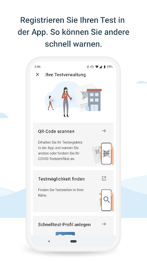
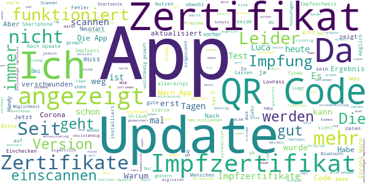

# Corona-Warn-App
App version ``2.6.1``

Analyzed with [covid-apps-observer](http://github.com/covid-apps-observer) project, version ``0.1``

## App overview
| | |
|-------------------------|-------------------------| 
| **Name**&nbsp;&nbsp;&nbsp;&nbsp;&nbsp;&nbsp;&nbsp;&nbsp;&nbsp;&nbsp;&nbsp;&nbsp;&nbsp;&nbsp;&nbsp;&nbsp;&nbsp;&nbsp;&nbsp;&nbsp;&nbsp;&nbsp;&nbsp;&nbsp;&nbsp;&nbsp;&nbsp;&nbsp;&nbsp;&nbsp;&nbsp;&nbsp;&nbsp;&nbsp;&nbsp;&nbsp;&nbsp;&nbsp;&nbsp;&nbsp;  | Corona-Warn-App |
| **Unique identifier** | de.rki.coronawarnapp |
| **Link to Google Play** | [https://play.google.com/store/apps/details?id=de.rki.coronawarnapp](https://play.google.com/store/apps/details?id=de.rki.coronawarnapp) |
| **Summary**  | Gemeinsam Corona bekämpfen |
| **Privacy policy** | [https://www.coronawarn.app/assets/documents/cwa-privacy-notice-de.pdf](https://www.coronawarn.app/assets/documents/cwa-privacy-notice-de.pdf) |
| **Latest version** | 2.6.1 |
| **Last update** | 2021-07-23 16:31:39 |
| **Recent changes** | Dieses Update bietet Ihnen neben Fehlerbehebungen folgende neue Funktionen.  Sie können nun: - Vor einer Reise Zertifikate für ein gewähltes Land auf Gültigkeit prüfen. - Bis zu fünf lokale 7-Tage-Inzidenzen in der App hinzufügen. - Ihr Schnelltest-Profil in der App bearbeiten, um zum Beispiel Ihre Adresse zu ändern. |
| **Installs**  | 10.000.000+ |
| **Category** | Gesundheit & Fitness |
| **First release** | 12.06.2020 |
| **Size**  | 13M |
| **Supported Android version**  | 6.0 oder höher |

### Description
> Das Robert Koch-Institut (RKI) als zentrale Einrichtung des Bundes im Bereich der Öffentlichen Gesundheit und als nationales Public-Health-Institut veröffentlicht die Corona-Warn-App für die deutsche Bundesregierung und für die Bundesrepublik Deutschland. Die App fungiert als digitale Ergänzung zu Abstandhalten, Hygiene und Alltagsmaske. Die App basiert auf Bluetooth-Technologie und der Exposure Notification API von Google. Wer sie nutzt, hilft, Infektionsketten schnell nachzuverfolgen und zu durchbrechen. Außerdem bietet die App eine Funktionalität, mit der Sie digitale Impfzertifikate hinzufügen können, um damit Ihren Impfstatus nachzuweisen. Die App merkt sich dezentral unsere Begegnungen mit anderen und informiert uns digital, wenn wir Begegnungen mit nachweislich infizierten Personen hatten. Dabei sammelt sie jedoch zu keiner Zeit Informationen zur Identität ihrer Nutzerinnen und Nutzer. Wer wir sind und wo wir sind, bleibt geheim – und unsere Privatsphäre bestens geschützt.
 WIE DIE APP FUNKTIONIERT
 Die Risiko-Ermittlung der App ist das Herzstück der Software und sollte immer aktiviert sein. Wann immer sich Nutzerinnen und Nutzer begegnen, tauschen ihre Smartphones über Bluetooth verschlüsselte Zufalls-IDs aus.
 Diese geben nur Auskunft darüber, über welche Dauer und mit welchem Abstand eine Begegnung stattfand. Welche Person sich hinter einem Code verbirgt, ist für niemanden nachvollziehbar. Die Corona-Warn-App erhebt keine Informationen über den Ort der Begegnung oder den Standort der Nutzerinnen und Nutzer.
 Entsprechend der maximalen Corona-Inkubationszeit werden alle Zufalls-IDs, die unser Smartphone sammelt, für 14 Tage auf dem Smartphone gespeichert – und dann gelöscht.
 Nur wenn eine Person sich über die App freiwillig als nachweislich infiziert meldet, erhalten daraufhin alle früheren Begegnungen eine Warnung auf ihr Smartphone.
 Niemand erfährt, wann, wo oder mit wem eine entsprechende Risiko-Begegnung stattfand. Die infizierte Person bleibt anonym.
 Mit der Benachrichtigung erhalten die betroffenen Nutzer/-innen klare Handlungsempfehlungen. Wichtig: Auch die Daten der Benachrichtigten sind zu keiner Zeit einsehbar.
 WIE DIE DATEN SICHER BLEIBEN
 Die Corona-Warn-App soll uns zwar täglich begleiten, sie wird uns jedoch nie kennenlernen. Dadurch kann sie niemandem verraten, wer wir sind. Der Datenschutz bleibt über die gesamte Nutzungsdauer zu 100 Prozent gewahrt.
 • Keine Anmeldung: Es müssen keine E-Mail-Adresse und kein Name hinterlegt werden.
 • Keine Rückschlüsse auf Identitäten: Bei einer Begegnung mit einem anderen Menschen tauschen die Smartphones nur Zufalls-IDs aus. Diese messen, über welche Dauer und mit welchem Abstand ein Kontakt stattfand. Sie lassen aber keine Rückschlüsse auf Personen und Standorte zu.
 • Dezentrale Speicherung: Die Daten werden nur auf dem Smartphone gespeichert und nach 14 Tagen gelöscht.
 • Keine Einsicht für Dritte: Sowohl die Personen, die eine nachgewiesene Infektion melden, als auch die Benachrichtigten sind nicht nachverfolgbar – nicht für die Bundesregierung, nicht für das Robert Koch-Institut, nicht für andere User und auch nicht für die Betreiber der App-Stores.
 Diese App ist nicht zum Gebrauch außerhalb Deutschlands bestimmt. Die Corona-Warn-App ist die zentrale Corona-App für Deutschland und sie ist an das deutsche Gesundheitssystem angeschlossen. Trotzdem ist die Corona-Warn-App auch in diesem Land verfügbar. Sie ist gedacht für alle, die in Deutschland leben, arbeiten, Urlaub machen oder sich regelmäßig oder über längere Zeit in Deutschland aufhalten.
 Es gelten die Nutzungsbedingungen der Corona-Warn-App: https://www.coronawarn.app/assets/documents/cwa-eula-de.pdf. Durch die Installation und Nutzung dieser App stimmen Sie den Nutzungsbedingungen zu.

### User interface
The developers of the app provide the following screenshots in the Google play store.
| | | |
|:-------------------------:|:-------------------------:|:-------------------------:|
 |   |   |   | 
 |   |   |   | 
 |   |  

## Development team
In the following we report the main information provided by the development team in the Google play store.

| | |
|-------------------------|-------------------------|
| **Developer**  | Robert Koch-Institut |
| **Website**  | [https://www.coronawarn.app](https://www.coronawarn.app) |
| **Email** | CoronaWarnApp@rki.de |
| **Physical address**  | [Robert Koch-Institut Nordufer 20 13353 Berlin](https://www.google.com/maps/search/Robert%20Koch-Institut%20Nordufer%2020%2013353%20Berlin) (Google Maps) |
| **Other developed apps**  | [https://play.google.com/store/apps/developer?id=Robert+Koch-Institut](https://play.google.com/store/apps/developer?id=Robert+Koch-Institut) |

## Android support

| | |
|-------------------------|-------------------------|
| **Declared target Android version**  | - |
| **Effective target Android version**  | - |
| **Minimum supported Android version**  | Marshmallow, version 6.0 (API level 23) |
| **Maximum target Android version**  | - |

The larger the difference between the minimum and maximum supported Android versions, the better. A larger difference means a wider audience. For example, old phones have a very low Android version, so a high minimum supported Android version means that the app cannot be used by users with old phones, thus leading to accessibility problems. 

## Requested permissions

In the following we report the complete list of the permissions requested by the app. 

| **Permission** | **Protection level** | **Description** | 
|-------------------------|-------------------------|-------------------------|
 **android.permission ACCESS_NETWORK_STATE** | Normal | Allows applications to access information about networks. 
 **android.permission BLUETOOTH** | Normal | Allows applications to connect to paired bluetooth devices. 
 **android.permission CAMERA** | :warning:**Dangerous** | Required to be able to access the camera device. 
 **android.permission FOREGROUND_SERVICE** | Normal | Allows a regular application to use Service.startForeground. 
 **android.permission INTERNET** | Normal | Allows applications to open network sockets. 
 **android.permission RECEIVE_BOOT_COMPLETED** | Normal | Allows an application to receive the Intent.ACTION_BOOT_COMPLETED that is broadcast after the system finishes booting. 
 **android.permission REQUEST_IGNORE_BATTERY_OPTIMIZATIONS** | Normal | Permission an application must hold in order to use Settings.ACTION_REQUEST_IGNORE_BATTERY_OPTIMIZATIONS. 
 **android.permission WAKE_LOCK** | Normal | Allows using PowerManager WakeLocks to keep processor from sleeping or screen from dimming. 

## Mentioned servers

| **Server** | **Registrant** | **Registrant country** | **Creation date** | 
|-------------------------|-------------------------|-------------------------|-------------------------|
 | adobe.com | Adobe Inc. | :us: US | 1986-11-17 05:00:00 |
 | google.com | Google LLC | :us: US | 1997-09-15 04:00:00 |
 | android.com | Google LLC | :us: US | 1997-06-23 04:00:00 |

## Security analysis 

Below we report the main security warnings raised by our execution of the [Androwarn](https://github.com/maaaaz/androwarn) security analysis tool.

**Connection interfaces exfiltration**
> - This application reads details about the currently active data network 
> - This application tries to find out if the currently active data network is metered 

**Telephony services abuse**
> - This application makes phone calls 

**Suspicious connection establishment**
> - This application opens a Socket and connects it to the remote address '; port is out of range' on the 'N/A' port  
> - This application opens a Socket and connects it to the remote address 'Lcom/android/tools/r8/GeneratedOutlineSupport;->outline47(Ljava/lang/String;)Ljava/lang/StringBuilder;' on the 'N/A' port  
> - This application opens a Socket and connects it to the remote address 'Ljava/net/Proxy;->type()Ljava/net/Proxy$Type;' on the 'N/A' port  
> - This application opens a Socket and connects it to the remote address 'Method sendUrgentData() is not supported.' on the 'N/A' port  
> - This application opens a Socket and connects it to the remote address 'Method setHandshakeTimeout() is not supported.' on the 'N/A' port  
> - This application opens a Socket and connects it to the remote address 'Method setOOBInline() is not supported.' on the 'N/A' port  
> - This application opens a Socket and connects it to the remote address 'Method setSoWriteTimeout() is not supported.' on the 'N/A' port  
> - This application opens a Socket and connects it to the remote address 'Socket closed' on the 'N/A' port  
> - This application opens a Socket and connects it to the remote address 'Socket is closed' on the 'N/A' port  
> - This application opens a Socket and connects it to the remote address 'Socket is closed.' on the 'N/A' port  
> - This application opens a Socket and connects it to the remote address 'Socket is not connected.' on the 'N/A' port  
> - This application opens a Socket and connects it to the remote address 'socket is closed' on the 'N/A' port  
> - This application opens a Socket and connects it to the remote address 'timeout' on the 'N/A' port  

**Code execution**
> - This application loads a native library: 'conscrypt_gmscore_jni' 
> - This application loads a native library: 'conscrypt_jni' 

## User ratings and reviews

Below we provide information about how end users are reacting to the app in terms of ratings and reviews in the Google Play store.

### Ratings

The Corona-Warn-App app has been installed by more than **10000000** times. At this time, **130442** rated the app and its average score is **3.480979**. Below we show the distribution of the ratings across the usual star-based rating of Google Play

:star::star::star::star::star:: 57155

:star::star::star::star:: 18386

:star::star::star:: 15035

:star::star:: 9776

:star:: 30090

### Reviews 

#### 5-star reviews

> Wind ich super gut  :date: __2021-07-30 16:44:02__

> Mittlerweile bietet die App fast alle Funktionen rund um das Thema. Leider sind die QR-Codes der Luca-App (noch) nicht kompatibel.  :date: __2021-07-30 16:13:36__

> ... und da ist der 5. Stern! Herausragende App. Gute App, 5. Stern, wenn auch Regionen in Deutschland gezeigt werden.  :date: __2021-07-30 15:10:08__

> Ich finde es gut aber nicht genau soll noch einbischen verbessert werden  :date: __2021-07-30 14:21:28__

> 7 - Sterne 🌟 🌟 🌟 🌟 🌟 🌟 🌟 Seit dem vorletzten Update kann ich nicht nur meine Impf-Zertifikate hinzufügen, sondern auch die meines Sohnes. Die App ist im gesamten zuverlässig und ohne Probleme. Dafür vielen Dank an das Robert Koch Institut am Nordufer in Berlin Wedding. Das blaue Licht in den Räumen, wenn man des Nachts von der gegenüber liegenden Straßenseite, auf das RKI geschaut hat, vergesse ich nie. #BleibenSieALLEGesund im RKI Berlin - Wedding - Nordufer.  :date: __2021-07-30 14:21:18__

> Ich fände es noch super wenn man den Inzidenz Wert der eigenen Region dort sehen würde. Je mehr praktische Funktionen die App hat, desto mehr Leute werden sie einfach auch aus diesen Gründen nutzen. Update: Wunsch erfüllt. Super App. Mittlerweile wirklich mehr als empfehlenswert. Eine andere ist nicht mehr nötig. Gute Arbeit.  :date: __2021-07-30 14:16:54__

> Sehr gut zu handhaben  :date: __2021-07-30 12:51:47__

> Kurz: Corona Warn App gut, Luca: schlecht. Aber eine Anregung: Wenn man ein Impfzertifikat hat, das als "mein Zertifikat" markiert wurde, wäre es super, wenn man über einen zweiten Schalter noch einstellen könnte, dass dieses bei Start der App bildschirmfüllend als erstes angezeigt wird. Sonst hat die EU Cov Pass App immer den Vorteil, dass sie beim Vorzeigen einfach schneller ist... und ständiges Vorzeigen in Restaurants etc. ist DIE Werbung für eine App. Siehe Luca.  :date: __2021-07-30 12:17:30__

> Ich hätte gerne bei der Corona-App folgendes Zusatzfeature: Eine knackige Übersicht zu den aktuellen Einschränkungen im jeweiligen Bundesland. Außerdem die aktuellen Fallzahlen. Eine solche Übersicht könnte zu mehr Nutzung führen. Update: viele Zusatzfeautures mittlerweile. Gute Arbeit. Daher 5 statt 4 Sterne.  :date: __2021-07-30 12:15:26__

> Danke für die schnelle Antwort. Jetzt hat alles funktioniert :)  :date: __2021-07-30 11:59:07__

#### 4-star reviews

> Hallo, wie kann ich mein EU-Impfzertifikat , dass ich in der App gespeichert habe für die Einreiseanmekdung für Deutschland hochladen? Vielen Dank für eine Antwort  :date: __2021-07-30 10:42:22__

> Gut  :date: __2021-07-30 10:37:16__

> Die App ist umfangreich, zeigt aber keinen visuell hervorgehobenen Status, wenn man als vollständig geimpft gilt.  :date: __2021-07-30 10:05:09__

> Immer noch krine Unterstützung für luca app QR-Code Events  :date: __2021-07-29 22:21:00__

> Warum funktioniert Einchecken nicht! Zu viel verschiedenen Standards.  :date: __2021-07-29 20:34:52__

> Der qr Code hat zu viele Punkte um bei schlechtem Licht gescannt zu werden. Warum wird das Licht nicht aktiviert?  :date: __2021-07-29 19:25:50__

> In den letzten Monaten funktionierte die App unauffällig. Leider ist sie weitgehend nutzlos, da nur ein Bruchteil der Infizierten sie hat oder andere über sie warnt. Es wäre sehr wünschenswert, wenn man die Anzahl der erfassten Kontakte in der App sehen könnte, um zu sehen dass die App überhaupt funktioniert.  :date: __2021-07-29 18:27:51__

> Ist noch ausbaufähig. Die Aktualisierung funktioniert nicht immer. Ich muss sie dann erst deaktivieren und neu starten. Wenn man schon 2 mal geimpft wurde und man hat den Code zugesendet bekommen,ist es nicht richtig ersichtlich, wie man den Code einscannen. Jetzt geht es weil ich das festgestellt habe. Vorher gab es nur für Events.  :date: __2021-07-29 15:49:47__

> Gute App, zwar manchmal noch mit "Kinderkrankheiten" aber alles in Allem gut  :date: __2021-07-29 15:17:08__

> Diese App ist super, aber ich kann mein Impfnachweis nicht einscannen, das ist nervig. Edit: Habe es jetzt in einer anderen App eingescannt.  :date: __2021-07-29 13:14:08__

#### 3-star reviews

> Statistik, Statistik, Statistik... Ich will keine Dr.-Arbeit schreiben. Ich will die Inzidenz und die damit verbundenen Massnahmen/Einschränkungen kurz und bündig wissen. Lokale Inzidenz, Testnachweis, Impfnachweis, Check-in, Tagebuch, alles super, find ich persönlich sehr gut. Aber bitte einfache übersichtliche Angaben. Nicht noch mehr überladen. Erweiterte Angaben und Statistiken sollten für interessierte eher in Untermenüs Platz finden. (Ich nutze diese App von Beginn an.)  :date: __2021-07-30 14:31:09__

> Warum können die Impfzertifikate nicht mehr eingescannt werden, sondern nur noch mit der CovPass App?  :date: __2021-07-30 09:50:36__

> Seit ich gestern die App aktualisiert habe, erscheinen die Impfungen nicht mehr unter dem Zertifikat. Ist das " EU Covid Zertifikat" dasselbe? Wenn ja, finde ich, dass man das hätte kommunizieren können, da vorher ja auch Impfung 1 und Impfung 2 und gültig bis explizit bei dem Impfzertifikat dabei stand!  :date: __2021-07-30 07:27:59__

> Scannt kein QR-Code code für impfZertifikat  :date: __2021-07-29 22:43:14__

> Obwohl ich zum ersten mal versuche, steht da dass der QR-Code ungültig ist  :date: __2021-07-29 22:03:32__

> Hatte bis jetzt nichts aus zu setzen...auch der "Countdown" bis zum vollständigen Impfschutz hat funktioniert..ABER...jetzt wird kein vollständiger Impfschutz angezeigt...für mich ist die App so nicht brauchbar...hab sie gelöscht...nochmal hochgeladen...funktioniert trotzdem nicht...hat jemand einen Tip? Ich habe wie gesagt die App gelöscht....mein Handy neu gestartet...die App nochmal installiert... Zur besseren Erklärung...die Zertifikate lassen sich einscannen "Kachel 1" zur ersten Impfung bleibt "grau unterlegt" "Kachel 2" zur zweiten Impfung ist "blau unterlegt" Aber nirgends steht "Vollständiger Impfschutz" oder "Impfschutz bis..."...  :date: __2021-07-29 18:19:52__

> Warum hinterlegt man nicht farblich das Zertifikat, wenn man zweimal geimpft und die 15 tägige Wartezeit hinter sich hat? GRÜN = vollständig, ROT = unvollständig. Besonders wichtig, wenn die Zertifikate mehrere Personen gespeichert sind. Das muss doch direkt ins Auge stechen oder soll jeder Berechtigte erst die Tagedifferenz ausrechnen?  :date: __2021-07-29 16:55:59__

> Qr code scannen geht nicht. Noch nie eine Risiko Begegnung angezeigt bekommen, obwohl ich sie ganz sicher hatte. (Die betroffenen hatten auch die Corona Warn App). Richtiger mist, funktioniert nicht. Nachtrag: Ich musste ein Stativ zum Scannen verwenden und eine andere Belichtung. Handelte sich um ein Impfzertifikat.  :date: __2021-07-29 16:25:58__

> seit einem update(???) jedenfalls seit 2-3 tagen geht die risikoermittlung ständig automatisch auf AUS und wenn ich reingehe und den slider auf "ein" stelle, gibt es keinen button um diese Einstellung zu bestätigen, übernehmen oder halt speichern. einfach nur wieder rückwärts raus aus dem screen wo man die ermittlung einschalten kann, bewirkt auch nur dass sie wieder aus ist. warum UPDATE 29.07.2021: danke für ihre antwort, aber der fehler ist immer noch genau so wie vorher. (huawei P30pro)  :date: __2021-07-29 14:48:14__

> Startseite lädt selben Tests mehrmals (herunter) und braucht dafür viel Zeit. Die Prüfung wird jedes mal wiederholt wenn man in der App zwischen Startseite und Zertifikate wechselt. In meinem Fall bei einem Schnelltest. Aktuell geht es relativ schnell über WLAN und mobile Daten. Gestern hat es über WLAN bestimmt 15 Sekunden gedauert. Auf mobil hatte ich jedoch nicht umgestellt. Es erscheint mir jedoch wenig sinnvoll mehrmals pro Minute zu prüfen. Edit 3: Das ist verständlich, aber nicht dass dies mehrmals pro Minute passiert.  :date: __2021-07-29 13:36:37__

#### 2-star reviews

> Eß  :date: __2021-07-30 16:33:02__

> Leider kann die App, ebenso wie die CovPass App nicht herunterladen werden, wenn man nicht im deutschen Play Store angemeldet ist. Somit ist sie für meine Frau und sicherlich vielen anderen Ausländern, die hier leben nicht erhältlich. Bitte global freischalten, wie es auch viele andere Länder machen. Vielen Dank.  :date: __2021-07-29 21:13:09__

> Wieso kann man immer noch nicht einen POS. Selbsttest hinterlegt, der verknüpft Infos erhält wie man sich nun weiter verhalten soll?!?? Die Funktion über ein Testzentrum funktioniert gut und einwandfrei. Aber wenn ich mich selbst zuhause POS. teste wären die Eingabe der Daten und weiteres Vorgehen hilfreich und beruhigend (m.M.n.!)  :date: __2021-07-29 18:47:09__

> Android Handy, Check in, Scannen ist nur in einem weiteren Lokal nicht möglich. Fehlermeldung, kein Event und Ort vorhanden. Bei meinem Kollegen, I Phone, funktionierte es tatellos.  :date: __2021-07-29 12:14:35__

> Fehler bei Verifizierung des QR Codes des Impfzertifikats: de.rki.coronawarnapp.covidcertificate.validation.core.common.exception.DccValidationException: Update of onboarded countries failed with server error. de.rki.coronawarnapp.covidcertificate.validation.core.common.exception.DccValidationException: Update of onboarded countries failed with server error. at de.rki.coronawarnapp.covidcertificate.validation.core.server.DccValidationServer$dccCountryJson$2.invokeSuspend(DccValidationServer.kt  :date: __2021-07-29 09:19:27__

> Seit zwei Wochen erhalte ich täglich eine Benachrichtigung, dass ich meinen Risikostatus überprüfen soll. Dieser Quatsch wird nur dazu führen, dass ich der App die Berechtigung für Benachrichtigungen entziehe. Sicherlich nicht im Sinne der Erfinder*innen...  :date: __2021-07-28 16:50:05__

> Warum wird nicht alles in einer App erfasst  :date: __2021-07-28 12:12:21__

> Leider lässt sich mein QR-Code (auch der zweite für die 2.Impfung) nicht scannen. Verzweifel so langsam, habe etliche Apps ausprobiert, es liegt definitiv nicht am Impfzertifikat, dieses habe ich heute frisch beim Arzt bekommen. Versuche es im Laufe der Woche nochmal, ansonsten werde ich wohl steht's den Impfpass oder das Zertifikat mitnehmen müssen. Vielleicht kann mir jemand vom Support hier helfen oder gar ein anderer User der ähnliche Probleme mit der Corona Warn App hatte.  :date: __2021-07-27 23:05:58__

> Nur 2 schnelltest gleizeit speicherbar , was ist mit kinder ab 6 jahre ? Antwort auf Ihre Antwort:Habe die Version 2.5.1 und da steht Die App kann Maximal 1 Schnelltest und 1 PCR Test verwalten . Unter Zertifikate wird der Schnelltest nicht Akzeptiert. Nur unter Test registrieren... müsste aber meine Tochter mit registrieren für den Schnelltest.  :date: __2021-07-27 19:48:32__

> Warnfunktion ist ganz OK. Dumm ist aber, dass die B-Abstandsschätzung nur mit Ortungsfunktion läuft, was aber wohl an Google liegt. Die TAN Hotline kann man vergessen, wenn der QR Code nicht funktioniert.  :date: __2021-07-27 18:50:21__

#### 1-star reviews

> Registrierung von Corona schnelltest nicht möglich= Meldung Ungültiger QR Code. Trotz CWA angebundenen Testzentrum und Einwilligung zur Datenverarbeitung. Darum nutze ich jetzt das zweiseitige Dokument des Testzentrums. Steht ja alles drauf. Die App hab ich nach einem Jahr Nutzlosigkeit wieder deinstalliert...  :date: __2021-07-30 16:48:49__

> Seit dem letzten Update ist mein Zertifikat weg. Wozu brauche ich dann ein Update?  :date: __2021-07-30 13:34:28__

> Was ist denn jetzt richtig und gültig? Erkennt Malta eine Kreuzimpfung an oder nicht?  :date: __2021-07-30 13:04:22__

> Scanner Fehler! Digitaler Impfpass lässt sich auf meinem Samsung Geräten ( s10e) nicht scannen. Ansonsten super App. Wenn der Fehler behoben ist gibt es auch wieder die top Bewertung Ich habe alles Ordnungsgemäß ausgeführt ( ich habe einen IT Hintergrund) Mit der CovPass App hat alles geklappt.  :date: __2021-07-30 12:08:35__

> Schlecht ist die app nicht aber da mit dem Akku und mit der Schilderung des Akku Einstellungen ist komplett gelogen  :date: __2021-07-30 09:55:24__

> Wann kommt endlich die versprochene Kompatibilität mit den QR-Codes der Luca-App? Erst hieß es, die Codes sind kompatibel. Dann, im April, stellte sich heraus, daß das doch nicht der Fall ist. Das Problem sollte aber in 2-3 Wochen behoben sein. Seitdem keine echte Info mehr zu dem Thema!  :date: __2021-07-30 06:41:47__

> Der größte u. teuerste Schrott der Welt u. rettet kein Leben. Lächerliches Kontakttagebuch u. gefakte Zahlen. Wir müssen mit dem Virus leben, aber nicht in dieser ermächtigungsgesetzlichen Diktatur. Wer weiß, dass das RKI eine sehr dunkle Vergangenheit in der NS-Zeit hat, zu der J. H. Hacker, Präsident des RKI 2008-2010, gesagt hat "Es war nicht nur wie überall, sondern schlimmer." Das wiederholt sich gerade.Wann werden diese Verbrecher rund um den Tierarzt Wieler endlich vor Gericht gestellt?  :date: __2021-07-30 00:13:52__

> Wir haben 22 Uhr und die APP zeigt an das die App heute um 2 Uhr Aktualisiert wurde alle 6 Stunden soll die APP Sich Aktualisieren und ich bin mehrmals am Tag im W-Lan ich habe alles aktiviert zugelasß  :date: __2021-07-29 22:41:52__

> Wollte mein positives testergebnis hochladen, welches ja bestätigt, dass ich genesen bin, aber wenn sich in der app die kamera öffnet, verlangt diese ausschließlich nach irgendeinem einem qr-code??? Mache ich etwas falsch? Wo genau kann ich denn nun den nachweis hochladen, dass ich genesen bin?  :date: __2021-07-29 20:56:04__

> Überwachungs app 🤣😁  :date: __2021-07-29 20:04:00__

