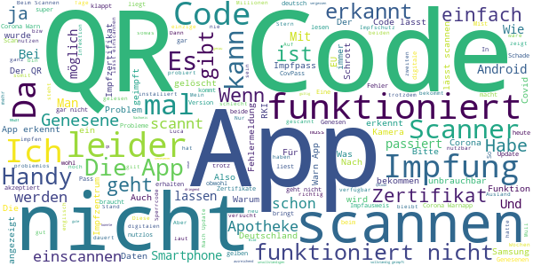

# CovPass
App version ``0.160.7``

Analyzed with [covid-apps-observer](http://github.com/covid-apps-observer) project, version ``0.1``

## App overview
| | |
|-------------------------|-------------------------| 
| **Name**&nbsp;&nbsp;&nbsp;&nbsp;&nbsp;&nbsp;&nbsp;&nbsp;&nbsp;&nbsp;&nbsp;&nbsp;&nbsp;&nbsp;&nbsp;&nbsp;&nbsp;&nbsp;&nbsp;&nbsp;&nbsp;&nbsp;&nbsp;&nbsp;&nbsp;&nbsp;&nbsp;&nbsp;&nbsp;&nbsp;&nbsp;&nbsp;&nbsp;&nbsp;&nbsp;&nbsp;&nbsp;&nbsp;&nbsp;&nbsp;  | CovPass |
| **Unique identifier** | de.rki.covpass.app |
| **Link to Google Play** | [https://play.google.com/store/apps/details?id=de.rki.covpass.app](https://play.google.com/store/apps/details?id=de.rki.covpass.app) |
| **Summary**  | Mit CovPass bequem die Impfung anhand des digitalen EU-Zertifikates nachweisen |
| **Privacy policy** | [https://www.digitaler-impfnachweis-app.de/webviews/client-app/privacy/](https://www.digitaler-impfnachweis-app.de/webviews/client-app/privacy/) |
| **Latest version** | 0.160.7 |
| **Last update** | 2021-06-18 17:39:09 |
| **Recent changes** | Als Hotfix wurde die Prüfung der Schema-Versionsnummer angepasst, um die Interoperabilität bezüglich Schema-Versionen anderer EU-Länder sicherzustellen. |
| **Installs**  | 1.000.000+ |
| **Category** | Gesundheit & Fitness |
| **First release** | 09.06.2021 |
| **Size**  | 12M |
| **Supported Android version**  | 6.0 oder höher |

### Description
> Das Robert Koch-Institut (RKI) als zentrale Einrichtung des Bundes im Bereich der Öffentlichen Gesundheit und als nationales Public-Health-Institut veröffentlicht die CovPass-App für die deutsche Bundesregierung. Mit der App lassen sich Corona-Impfungen direkt auf dem Smartphone speichern. Wer sie nutzt, kann seinen Impfschutz schnell, sicher und digital nachweisen. Mit der App kann auch der Impfschutz anderer Personen (zum Beispiel Familienangehörige) auf dem Smartphone nachgewiesen werden. Die Nutzerinnen und Nutzer der App entscheiden, wann und wem sie ihre Informationen und Daten vorzeigen. 
  
 WIE DIE APP FUNKTIONIERT 
  
 Der Nachweis von Corona-Impfungen ist die zentrale Funktion der CovPass-App. Wann immer Nutzerinnen und Nutzer ihren Impfschutz nachweisen, werden nur die nötigsten Informationen und Daten per QR-Code angezeigt.  
  
 Der QR-Code gibt Auskunft über den Impfstatus einer Person. Zur eindeutigen Identifikation werden zudem der Name und das Geburtsdatum bei einer Überprüfung angezeigt. Die App übermittelt zu keinem Zeitpunkt personenbezogene Informationen und Daten.   
  
 Der Impfschutz kann auch für andere Personen (zum Beispiel Familienangehörige) auf dem Smartphone abgelegt werden. Damit die CovPass-App den QR-Code anzeigen kann, müssen vorab alle für den kompletten Impfschutz notwendigen Corona-Impfungen in der App gespeichert werden. Anschließend zeigt die App den QR-Code im Startbildschirm an. Dieser kann bei Bedarf vorgezeigt werden. 
  
 Corona-Impfungen werden auf Wunsch mit dem Impfzertifikat bescheinigt. Das Impfzertifikat wird nach der Impfung vom medizinischen Personal erstellt. Es enthält einen QR-Code, der mit der App gescannt werden kann. Dazu ist die Kamera des Smartphones über den QR-Code zu halten. Die Impfung wird direkt auf das Smartphone geladen. 
 Sie erkennen das richtige Zertifikat in Deutschland daran, dass der Aussteller das Robert Koch-Institut ist. QR-Codes von zum Beispiel Impfbescheinigungen oder QR-Codes auf einigen Chargen-Aufklebern aus dem gelben Impfbuch können nicht hinzugefügt werden.
  
 Die Daten der geimpften Person sind lokal auf dem Smartphone gespeichert. Nur die Nutzerinnen und Nutzer entscheiden, wann und wem sie die Informationen und Daten vorzeigen. 
  
  
 WIE DIE DATEN SICHER BLEIBEN 
  
 Der Datenschutz bleibt über die gesamte Nutzungsdauer gewahrt.  
  
 - Keine Anmeldung: Es ist keine Registrierung mit einer E-Mail-Adresse notwendig. 
 - Lokale Datenspeicherung: Ihre vollständigen Impfdaten sind nur auf Ihrem Smartphone gespeichert. 
 - Datensparsamkeit: Der QR-Code als Nachweis für den vollständigen Impfschutz wird mit dem in der EU abgestimmten minimalen Datenumfang angezeigt. Nach der Prüfung des QR-Codes werden nur der Impfstatus, der Name und das Geburtsdatum angezeigt.   
 - Kryptografische Sicherheit: Der QR-Code ist mit einer starken Signatur geschützt und kann nicht gefälscht werden.

### User interface
The developers of the app provide the following screenshots in the Google play store.
| | | |
|:-------------------------:|:-------------------------:|:-------------------------:|
 |   |   |   | 
 |   |   |   | 
 |   |   |   | 
 |  

## Development team
In the following we report the main information provided by the development team in the Google play store.

| | |
|-------------------------|-------------------------|
| **Developer**  | Robert Koch-Institut |
| **Website**  | [https://www.digitaler-impfnachweis-app.de/kontakt/](https://www.digitaler-impfnachweis-app.de/kontakt/) |
| **Email** | support@covpass-app.de |
| **Physical address**  | [Robert Koch-Institut Nordufer 20 13353 Berlin](https://www.google.com/maps/search/Robert%20Koch-Institut%20Nordufer%2020%2013353%20Berlin) (Google Maps) |
| **Other developed apps**  | [https://play.google.com/store/apps/developer?id=Robert+Koch-Institut](https://play.google.com/store/apps/developer?id=Robert+Koch-Institut) |

## Android support

| | |
|-------------------------|-------------------------|
| **Declared target Android version**  | - |
| **Effective target Android version**  | - |
| **Minimum supported Android version**  | Marshmallow, version 6.0 (API level 23) |
| **Maximum target Android version**  | - |

The larger the difference between the minimum and maximum supported Android versions, the better. A larger difference means a wider audience. For example, old phones have a very low Android version, so a high minimum supported Android version means that the app cannot be used by users with old phones, thus leading to accessibility problems. 

## Requested permissions

In the following we report the complete list of the permissions requested by the app. 

| **Permission** | **Protection level** | **Description** | 
|-------------------------|-------------------------|-------------------------|
 **android.permission ACCESS_NETWORK_STATE** | Normal | Allows applications to access information about networks. 
 **android.permission CAMERA** | :warning:**Dangerous** | Required to be able to access the camera device. 
 **android.permission FOREGROUND_SERVICE** | Normal | Allows a regular application to use Service.startForeground. 
 **android.permission INTERNET** | Normal | Allows applications to open network sockets. 
 **android.permission RECEIVE_BOOT_COMPLETED** | Normal | Allows an application to receive the Intent.ACTION_BOOT_COMPLETED that is broadcast after the system finishes booting. 
 **android.permission WAKE_LOCK** | Normal | Allows using PowerManager WakeLocks to keep processor from sleeping or screen from dimming. 

## Mentioned servers

| **Server** | **Registrant** | **Registrant country** | **Creation date** | 
|-------------------------|-------------------------|-------------------------|-------------------------|
 | europa.eu | - | - | - |
 | snomed.info | IHTSDO | GB | 2001-09-13 05:40:58 |

## Security analysis 

Below we report the main security warnings raised by our execution of the [Androwarn](https://github.com/maaaaz/androwarn) security analysis tool.

**Connection interfaces exfiltration**
> - This application reads details about the currently active data network 
> - This application tries to find out if the currently active data network is metered 

**Suspicious connection establishment**
> - This application opens a Socket and connects it to the remote address ' returned no addresses for  ; port is out of range' on the 'N/A' port  
> - This application opens a Socket and connects it to the remote address '' on the 'N/A' port  
> - This application opens a Socket and connects it to the remote address 'Ljava/lang/StringBuilder;->toString()Ljava/lang/String;' on the 'N/A' port  
> - This application opens a Socket and connects it to the remote address 'Ljava/net/Proxy;->type()Ljava/net/Proxy$Type;' on the 'N/A' port  
> - This application opens a Socket and connects it to the remote address 'Method sendUrgentData() is not supported.' on the 'N/A' port  
> - This application opens a Socket and connects it to the remote address 'Method setHandshakeTimeout() is not supported.' on the 'N/A' port  
> - This application opens a Socket and connects it to the remote address 'Method setOOBInline() is not supported.' on the 'N/A' port  
> - This application opens a Socket and connects it to the remote address 'Method setSoWriteTimeout() is not supported.' on the 'N/A' port  
> - This application opens a Socket and connects it to the remote address 'Socket closed' on the 'N/A' port  
> - This application opens a Socket and connects it to the remote address 'Socket is closed' on the 'N/A' port  
> - This application opens a Socket and connects it to the remote address 'Socket is closed.' on the 'N/A' port  
> - This application opens a Socket and connects it to the remote address 'Socket is not connected.' on the 'N/A' port  
> - This application opens a Socket and connects it to the remote address 'socket is closed' on the 'N/A' port  
> - This application opens a Socket and connects it to the remote address 'timeout' on the 'N/A' port  

**Code execution**
> - This application loads a native library: 'conscrypt_jni' 

## User ratings and reviews

Below we provide information about how end users are reacting to the app in terms of ratings and reviews in the Google Play store.

### Ratings

The CovPass app has been installed by more than **1000000** times. At this time, **2460** rated the app and its average score is **3.830357**. Below we show the distribution of the ratings across the usual star-based rating of Google Play

:star::star::star::star::star:: 1465

:star::star::star::star:: 234

:star::star::star:: 161

:star::star:: 80

:star:: 520

### Reviews 

#### 5-star reviews

> Funktioniert super. Machts leben einfacher  :date: __2021-06-28 00:52:02__

> Löst genau meine Problemstellung  :date: __2021-06-27 23:06:01__

> Die App enthält alles was benötigt wird  :date: __2021-06-27 23:03:05__

> Sehr einfach und unkompliziert, danke.  :date: __2021-06-27 22:00:23__

> Funktioniert einwandfrei und beeindruckend schnell!  :date: __2021-06-27 21:51:45__

> Erkennt auch österreichische Impfungen! Der generierte QR-Code funktioniert auch mit greencheck.gv.at  :date: __2021-06-27 20:49:04__

> Tiptop  :date: __2021-06-27 20:44:48__

> Bis jetzt alles Top  :date: __2021-06-27 19:59:41__

> Die simpelste App um den Impfstatus zu speichern und zu präsentieren. Gut gemacht!  :date: __2021-06-27 19:20:29__

> Top  :date: __2021-06-27 19:15:24__

#### 4-star reviews

> Grundsätzlich alles richtig gemacht mit der App. Leider im Ausland nicht einsetzbar, da laut EU der Nachweis auch Englisch, Französisch und Spanisch übersetzt sein muss. Diese Funktion fehlt.  :date: __2021-06-27 20:00:36__

> App funktioniert super, runterladen ebenso, aber: wie bekomme ich die App auf meine Smartphone - Oberfläche??  :date: __2021-06-27 16:24:24__

> Alles easy. Installieren, scannen, fertig. Aber was ist mit einem Sprachpaket, ich dachte dies sei ein europäische Projekt ?  :date: __2021-06-27 15:56:11__

> Hallo! ich arbeite in einer Apotheke und stelle dort Impf-Zertifikate aus. Bei wenigen Kunden tritt mit dieser App teilweise ein Fehler auf, mit dem Text von in etwa: Zertifikat nicht gültig.. nicht durch RKI ausgestellt. Häufig handelt es sich dabei um ein iPhone 12 Mini, teilweise aber auch um andere Modelle... Diese QR Codes können dann aber meist mit der CoronaWarn App (oder Luca) gescannt werden. Anscheinend scheint es noch einen nicht einfach zu reproduzierenden Bug in dieser App zu geben (auch iOS Version). Bitte versucht das zu fixen, danke! ;)  :date: __2021-06-27 15:18:49__

> Wenn mir die App doch das Reisen innerhalb der EU erleichtern soll, warum gibt es dann die paar entscheidenden Sätze, Informationen über Impfstatus etc. nicht wenigstens in Englisch 🙄  :date: __2021-06-27 14:09:54__

> App heute istalliert und problemlos die Apotheken-QR-Codes von der ersten und zweiten Impfung von meiner Frau und von mir eingescannt. Verbesserungswürdig ist die große Schrift des Vor- und Nachnamens, welche nicht skalierbar ist. Beim Doppelvornamen gemäß Personalausweis werden diese auf meinem Pixel 5 nicht in einer Zeile mit dem Nachnamen unter dem QR-Code dargestellt.  :date: __2021-06-27 11:26:35__

> Das Scannen des QR Codes ging zuerst nicht. Es stellte sich heraus, dass an dem QR Code beim Ausdruck in der Apotheke ein Millimeter fehlte. Da kann die App nichts dafür, aber das Zertifikat so zu designen, dass das vermutlich ständig passiert, weil der QR-Code soweit am Rand liegt ... Nehmen Sie's mir nicht übel, aber wenn es ein Fettnäpfchen gibt, dann finden es die offiziellen Stellen bestimmt.  :date: __2021-06-27 10:53:02__

> Dauerte ein wenig bis das der Code gelesen werden konnte. Wenn der Druck nicht sauber genug ist, oder man hat eine Verunreinigung an der Kamera dann kann die App leider denn QR Code nicht lesen. Wenn es denn funktioniert ist es einfach weil man muss nicht zusätzlich noch etwas eingeben. Das erledigt das Dokument und die App von alleine. Bin zufrieden und kann es empfehlen. Und keine Werbung durch die App  :date: __2021-06-27 07:09:41__

> Ging bei mir zuerst auch nicht, update gemacht, Handy aus und an etc. nichts ging ... Lösung: Smartphone gaaaaaaanz weit vom Code weghalten, dann funktionierte es tadellos.  :date: __2021-06-26 14:49:48__

> Fehler wird nicht bemerkt! In der Apotheke wurde mir ein QR-Code ausgedruckt. Weder die Software dort noch die App merkte beim Scannen des Codes, dass bei Impfung 1 und Impfung 2 mein Geburtsdatum einen Zahlendreher enthielt. Das habe ich erst einen Tag später bemerkt. Tolle Programmierung 🙄  :date: __2021-06-26 13:57:11__

#### 3-star reviews

> Ganz gut und schnell eingescannt... muss dazu sagen habe mein pass und den Impfpass zur Apotheke gebracht und die haben mir den Scanner noch am selben Tag mit gegeben und hat sofort geklappt...  :date: __2021-06-27 23:59:59__

> Ich bin srhr zufrieden,hab die App und kann meine Impfungen nachweisen, habe Android 10.0 als Betriebssytem. Meine Frau hat ein Wiko Smartphone aber über die aktuelle Version kann sie die covpass App nicht runterladen... blöd... gibt es Lösungen....? Deshalb nur 3 * LG Rainer  :date: __2021-06-27 21:27:27__

> Wir haben nur eine Impfung bekommen, corona genesen. Total doof das man den genesen Nachweis nicht fotografieren kann. Muss immer zusätzlich Dokument mit mir rum tragen.  :date: __2021-06-27 19:53:28__

> Es können leider nur von 2 Personen die Convid-Impfungen eingescannt werden. Von mehr Personen wäre wünschenswert, da die Eltern/Schwiegereltern kein Handy haben  :date: __2021-06-27 19:34:04__

> Also auf meinem Android Tablet kann ich den QR Code scannen und der CovPass funktioniert einwandfrei. Soweit bin ich zufrieden,nun kommt der Teil für mein Smartphone (Apple iPhone,also iOS Betriebssystem).Da funktioniert das scannen des QR Codes leider gar nicht. Der QR Code gehört nicht zu einem digitalen COVID-Zertifikat der EU. Hab mir jetzt notgedrungen die Warnapp runtergeladen und da funktioniert das. Bitte um Lösung des Problems.  :date: __2021-06-27 16:37:34__

> Habe für 3 personen die zertifikate gespeichert. Die 2 Impfungen erschienen jeweils bei diesen. Bei einer weiteren Person werden Erstimpfung und Zweitimpfung jeweils sepperat aufgeführt. Diese Person ist somit Zweifach vorhanden. Gibt es da eine Lösung? Ansonsten ist die App klasse, da der unhandliche Impfausweis nicht mitgeschleppt werden muss. Weiterhin muss bei verlangen nicht jedes Familienmitglied das Mobiltelefon zücken um sich zu legitimieren.  :date: __2021-06-27 15:09:01__

> App scannt den Barcode nicht. Das Bild der Kamera ist total dunkel und wenn man sie über den Barcode hält, passiert einfach nichts.. Edit: Hat endlich den Code gescannt. Nicht zu weit weg und nicht zu nah drann darf man sein. Wie wäre es mal mit einem Rahmen zur Orientierung beim Scannen?  :date: __2021-06-27 08:50:35__

> App scant die Codes nicht Kann man testen,wie man will,nix.Wieder de installiert.  :date: __2021-06-26 17:37:34__

> QR Code funktioniert gut, aber warum alle Informationen nur auf Deutsch sind? Für andere Länder (für Urlaub, z.B.) ist unbrauchbar. Leider kann man nicht prüfen welche Info in QR Code gespeichert ist und in welche Sprachen. Es wäre vielleicht gut (zur Sicherheit) dieses Certificate als PDF ins App hinzufügen, da dieser ist mehrsprachig.  :date: __2021-06-26 11:43:46__

> Impfzertifikat nur in deutscher Sprache. Bei Reisen ins Ausland nicht wirklich hilfreich. Apple ist da schon einen Schritt weiter🙈  :date: __2021-06-26 11:40:44__

#### 2-star reviews

> Scannen der Codes funktioniert super. Was jedoch unglaublich ist, nur der QR Code für die 2.Impfung reicht, damit ein vollständiger Schutz angezeigt wird. Wenn man jetzt aber eben nur 1 Impfung bekommt, weil gesenesen und das Impfzentrum/Apotheke fälschlicherweiße die eine Impfung als 2.Impfung ausstellt, kann man 2 Impfungen ausweisen, auch wenn man nur 1 bekommen hat. Diese Falschzertifikate werden aktuell zuhauf von Impfzentren ausgestellt. Eklatante Fehlanzeige, sollte geändert werden!  :date: __2021-06-27 20:45:16__

> Wy , 0yy,e  :date: __2021-06-27 18:10:47__

> Hallo bei mir geht gar nix der QR code wird nicht angenommen  :date: __2021-06-27 17:36:04__

> Da steht man am Einlass vor dem Hallenbad, hat einen Termin gebucht, und die App lässt sich nicht starten, um den Impfnachweis vorzuzeigen. Klasse (weißer Screenshot)! Sicherheitshalber das nächste mal den gelben Impfpass mitnehmen. War ja sicherlich auch so gedacht.  :date: __2021-06-27 12:04:57__

> Funktioniert. Allerdings muss eine App, die speziell bei Reisen wichtig wird, unbedingt verschiedene Sprachen unterstützen (nicht nur geräteabhängig sondern bedarfsweise, wenn man den Impfnachweis vorzeigen muss). Wenn ich jemandem, der nicht Deutsch spricht nicht glaubhaft versichern kann, dass ich geimpft bin verfehlt die App ihre Aufgabe.  :date: __2021-06-27 12:03:46__

> Für genesene muss es möglich sein, vollständig mit 1x impfen, zu scannen  :date: __2021-06-27 09:29:27__

> Leider kann diese App nicht runtergeladen werden - warum nicht?  :date: __2021-06-26 22:29:35__

> Die App funktioniert gut und ich kann auch meinen Code ohne Probleme scannen. Allerdings wird das falsche Datum für den vollständigen Impfschutz angezeigt, z.B. bei Zweitimpfung am 01.06. der vollständige Impfschutz ab 16.06. !!! Meine Frau und ich haben jeweils den Code des anderen im Handy, um nur eines dabei haben zu müssen. Ihres ist ein iPhone, und dort wird das Datum korrekt angezeigt. Ebenso wird das korrekte Datum in der Corona-Warn-App angezeigt.  :date: __2021-06-26 21:26:15__

> Die App ist sehr einfach zu bedienen. Zu einfach! Denn es ist nicht möglich die einzelnen Impfungen, oder zumindest den Zugriff auf die App, mit einem Passwort zu schützen. Die Impfungen sind somit für jeden lesbar, kopierer und auch zu löschen, wenn erstmal Zugriff auf das Smartphone möglich ist. Man mahnt bei Erhalt des QR-Codes dringend an diesen unter Verschluss zu halten weil diese Daten sonst missbraucht werden könnten, aber in der App sind diese Daten ungeschützt zu lesen und löschen!  :date: __2021-06-26 17:46:31__

> Keine Funktion für Genesene  :date: __2021-06-26 15:10:21__

#### 1-star reviews

> Ich bin genesen und kann den Nachweis nicht digitalisieren. Und da ich nur eine Impfung habe, bringt mir die App genau nichts. Gibt ja nur ein paar Millionen Genesene, die kann man ja Mal vergessen. Hätte mich auch gewundert wenn Mal irgendwas bei denen halbwegs richtig klappt ...  :date: __2021-06-27 22:00:59__

> Die App funktioniert nicht, der QR Code wird nicht gelesen.  :date: __2021-06-27 21:17:50__

> Kann keine Sticker aus dem gelben Impfpass scannen. Nutzlos.  :date: __2021-06-27 20:08:23__

> QR Codes lassen sich beide nicht Scannen. Mit einem billigen QR Scanner geht es wunderbar. Gute Arbeit!  :date: __2021-06-27 19:19:07__

> QR-Code wird auf allen 3 vorhandenen Smartphones als ungültig abgewiesen. Codes vom Impfzentrum ausgedruckt und ganz sicher gültig. Corona Warnapp macht keine Probleme. Nach 2 Sekunden gescannt und gut. Was läuft da schief bei CovApp ??  :date: __2021-06-27 19:17:17__

> Wenn ich meine 2. Impfung scanne, wird diese als die Erste angezeigt. Mit dem Hinweis das ich nicht ausreichend geimpft bin. Das funktioniert bei der Corona-Warnapp fehlerfrei.  :date: __2021-06-27 19:05:51__

> Für mich als Genesener ist die App nicht nutzbar. Mir wird angezeigt das ich nur 1 von 2 Impfungen habe und einen unvollständigen Impfschutz habe. Ich muss also Trotzdem mein Impfheft mitnehmen. Hier sollte man dringend nachbessern.  :date: __2021-06-27 18:46:43__

> Frechheit das mann mit einer schlechten handykamera auflösung den qr code nicht einscannen kann. Und ich jz mit dem impfpass bzw dem Zertifikat rum laufen muss egal ob covpass app oder corona warnapp  :date: __2021-06-27 18:36:59__

> Bei mir steht immer die Nachricht. Möglicherweise wurde das Zertifikat von einer nicht autorisierten Einrichtung erstellt oder die App ist nicht auf dem aktuellen Stand. PS ich habe das Zertifikat von der Apotheke bekommen.  :date: __2021-06-27 18:07:19__

> Total unnützlich, die App kann den Code aus dem Impfpass nicht lesen und beim Hausarzt gibt es kein weiteres Impfzetifikat geschweige denn ein Code der einzuscannen wäre.  :date: __2021-06-27 17:33:21__

