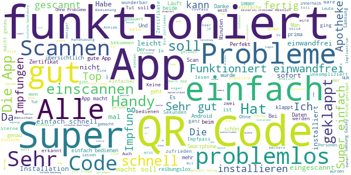
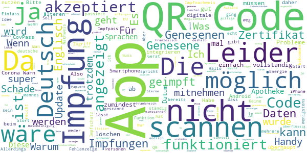

# CovPass
App version ``0.160.7``

Analyzed with [covid-apps-observer](http://github.com/covid-apps-observer) project, version ``0.1``

## App overview
| | |
|-------------------------|-------------------------| 
| **Name**&nbsp;&nbsp;&nbsp;&nbsp;&nbsp;&nbsp;&nbsp;&nbsp;&nbsp;&nbsp;&nbsp;&nbsp;&nbsp;&nbsp;&nbsp;&nbsp;&nbsp;&nbsp;&nbsp;&nbsp;&nbsp;&nbsp;&nbsp;&nbsp;&nbsp;&nbsp;&nbsp;&nbsp;&nbsp;&nbsp;&nbsp;&nbsp;&nbsp;&nbsp;&nbsp;&nbsp;&nbsp;&nbsp;&nbsp;&nbsp;  | CovPass |
| **Unique identifier** | de.rki.covpass.app |
| **Link to Google Play** | [https://play.google.com/store/apps/details?id=de.rki.covpass.app](https://play.google.com/store/apps/details?id=de.rki.covpass.app) |
| **Summary**  | Mit CovPass bequem die Impfung anhand des digitalen EU-Zertifikates nachweisen |
| **Privacy policy** | [https://www.digitaler-impfnachweis-app.de/webviews/client-app/privacy/](https://www.digitaler-impfnachweis-app.de/webviews/client-app/privacy/) |
| **Latest version** | 0.160.7 |
| **Last update** | 2021-06-18 17:39:09 |
| **Recent changes** | Als Hotfix wurde die Prüfung der Schema-Versionsnummer angepasst, um die Interoperabilität bezüglich Schema-Versionen anderer EU-Länder sicherzustellen. |
| **Installs**  | 1.000.000+ |
| **Category** | Gesundheit & Fitness |
| **First release** | 09.06.2021 |
| **Size**  | 12M |
| **Supported Android version**  | 6.0 oder höher |

### Description
> Das Robert Koch-Institut (RKI) als zentrale Einrichtung des Bundes im Bereich der Öffentlichen Gesundheit und als nationales Public-Health-Institut veröffentlicht die CovPass-App für die deutsche Bundesregierung. Mit der App lassen sich Corona-Impfungen direkt auf dem Smartphone speichern. Wer sie nutzt, kann seinen Impfschutz schnell, sicher und digital nachweisen. Mit der App kann auch der Impfschutz anderer Personen (zum Beispiel Familienangehörige) auf dem Smartphone nachgewiesen werden. Die Nutzerinnen und Nutzer der App entscheiden, wann und wem sie ihre Informationen und Daten vorzeigen. 
  
 WIE DIE APP FUNKTIONIERT 
  
 Der Nachweis von Corona-Impfungen ist die zentrale Funktion der CovPass-App. Wann immer Nutzerinnen und Nutzer ihren Impfschutz nachweisen, werden nur die nötigsten Informationen und Daten per QR-Code angezeigt.  
  
 Der QR-Code gibt Auskunft über den Impfstatus einer Person. Zur eindeutigen Identifikation werden zudem der Name und das Geburtsdatum bei einer Überprüfung angezeigt. Die App übermittelt zu keinem Zeitpunkt personenbezogene Informationen und Daten.   
  
 Der Impfschutz kann auch für andere Personen (zum Beispiel Familienangehörige) auf dem Smartphone abgelegt werden. Damit die CovPass-App den QR-Code anzeigen kann, müssen vorab alle für den kompletten Impfschutz notwendigen Corona-Impfungen in der App gespeichert werden. Anschließend zeigt die App den QR-Code im Startbildschirm an. Dieser kann bei Bedarf vorgezeigt werden. 
  
 Corona-Impfungen werden auf Wunsch mit dem Impfzertifikat bescheinigt. Das Impfzertifikat wird nach der Impfung vom medizinischen Personal erstellt. Es enthält einen QR-Code, der mit der App gescannt werden kann. Dazu ist die Kamera des Smartphones über den QR-Code zu halten. Die Impfung wird direkt auf das Smartphone geladen. 
 Sie erkennen das richtige Zertifikat in Deutschland daran, dass der Aussteller das Robert Koch-Institut ist. QR-Codes von zum Beispiel Impfbescheinigungen oder QR-Codes auf einigen Chargen-Aufklebern aus dem gelben Impfbuch können nicht hinzugefügt werden.
  
 Die Daten der geimpften Person sind lokal auf dem Smartphone gespeichert. Nur die Nutzerinnen und Nutzer entscheiden, wann und wem sie die Informationen und Daten vorzeigen. 
  
  
 WIE DIE DATEN SICHER BLEIBEN 
  
 Der Datenschutz bleibt über die gesamte Nutzungsdauer gewahrt.  
  
 - Keine Anmeldung: Es ist keine Registrierung mit einer E-Mail-Adresse notwendig. 
 - Lokale Datenspeicherung: Ihre vollständigen Impfdaten sind nur auf Ihrem Smartphone gespeichert. 
 - Datensparsamkeit: Der QR-Code als Nachweis für den vollständigen Impfschutz wird mit dem in der EU abgestimmten minimalen Datenumfang angezeigt. Nach der Prüfung des QR-Codes werden nur der Impfstatus, der Name und das Geburtsdatum angezeigt.   
 - Kryptografische Sicherheit: Der QR-Code ist mit einer starken Signatur geschützt und kann nicht gefälscht werden.

### User interface
The developers of the app provide the following screenshots in the Google play store.
| | | |
|:-------------------------:|:-------------------------:|:-------------------------:|
 |   |   |   | 
 |   |   |   | 
 |   |   |   | 
 |  

## Development team
In the following we report the main information provided by the development team in the Google play store.

| | |
|-------------------------|-------------------------|
| **Developer**  | Robert Koch-Institut |
| **Website**  | [https://www.digitaler-impfnachweis-app.de/kontakt/](https://www.digitaler-impfnachweis-app.de/kontakt/) |
| **Email** | support@covpass-app.de |
| **Physical address**  | [Robert Koch-Institut Nordufer 20 13353 Berlin](https://www.google.com/maps/search/Robert%20Koch-Institut%20Nordufer%2020%2013353%20Berlin) (Google Maps) |
| **Other developed apps**  | [https://play.google.com/store/apps/developer?id=Robert+Koch-Institut](https://play.google.com/store/apps/developer?id=Robert+Koch-Institut) |

## Android support

| | |
|-------------------------|-------------------------|
| **Declared target Android version**  | - |
| **Effective target Android version**  | - |
| **Minimum supported Android version**  | Marshmallow, version 6.0 (API level 23) |
| **Maximum target Android version**  | - |

The larger the difference between the minimum and maximum supported Android versions, the better. A larger difference means a wider audience. For example, old phones have a very low Android version, so a high minimum supported Android version means that the app cannot be used by users with old phones, thus leading to accessibility problems. 

## Requested permissions

In the following we report the complete list of the permissions requested by the app. 

| **Permission** | **Protection level** | **Description** | 
|-------------------------|-------------------------|-------------------------|
 **android.permission ACCESS_NETWORK_STATE** | Normal | Allows applications to access information about networks. 
 **android.permission CAMERA** | :warning:**Dangerous** | Required to be able to access the camera device. 
 **android.permission FOREGROUND_SERVICE** | Normal | Allows a regular application to use Service.startForeground. 
 **android.permission INTERNET** | Normal | Allows applications to open network sockets. 
 **android.permission RECEIVE_BOOT_COMPLETED** | Normal | Allows an application to receive the Intent.ACTION_BOOT_COMPLETED that is broadcast after the system finishes booting. 
 **android.permission WAKE_LOCK** | Normal | Allows using PowerManager WakeLocks to keep processor from sleeping or screen from dimming. 

## Mentioned servers

| **Server** | **Registrant** | **Registrant country** | **Creation date** | 
|-------------------------|-------------------------|-------------------------|-------------------------|
 | europa.eu | - | - | - |
 | snomed.info | IHTSDO | GB | 2001-09-13 05:40:58 |

## Security analysis 

Below we report the main security warnings raised by our execution of the [Androwarn](https://github.com/maaaaz/androwarn) security analysis tool.

**Connection interfaces exfiltration**
> - This application reads details about the currently active data network 
> - This application tries to find out if the currently active data network is metered 

**Suspicious connection establishment**
> - This application opens a Socket and connects it to the remote address ' returned no addresses for  ; port is out of range' on the 'N/A' port  
> - This application opens a Socket and connects it to the remote address '' on the 'N/A' port  
> - This application opens a Socket and connects it to the remote address 'Ljava/lang/StringBuilder;->toString()Ljava/lang/String;' on the 'N/A' port  
> - This application opens a Socket and connects it to the remote address 'Ljava/net/Proxy;->type()Ljava/net/Proxy$Type;' on the 'N/A' port  
> - This application opens a Socket and connects it to the remote address 'Method sendUrgentData() is not supported.' on the 'N/A' port  
> - This application opens a Socket and connects it to the remote address 'Method setHandshakeTimeout() is not supported.' on the 'N/A' port  
> - This application opens a Socket and connects it to the remote address 'Method setOOBInline() is not supported.' on the 'N/A' port  
> - This application opens a Socket and connects it to the remote address 'Method setSoWriteTimeout() is not supported.' on the 'N/A' port  
> - This application opens a Socket and connects it to the remote address 'Socket closed' on the 'N/A' port  
> - This application opens a Socket and connects it to the remote address 'Socket is closed' on the 'N/A' port  
> - This application opens a Socket and connects it to the remote address 'Socket is closed.' on the 'N/A' port  
> - This application opens a Socket and connects it to the remote address 'Socket is not connected.' on the 'N/A' port  
> - This application opens a Socket and connects it to the remote address 'socket is closed' on the 'N/A' port  
> - This application opens a Socket and connects it to the remote address 'timeout' on the 'N/A' port  

**Code execution**
> - This application loads a native library: 'conscrypt_jni' 

## User ratings and reviews

Below we provide information about how end users are reacting to the app in terms of ratings and reviews in the Google Play store.

### Ratings

The CovPass app has been installed by more than **1000000** times. At this time, **2460** rated the app and its average score is **3.830357**. Below we show the distribution of the ratings across the usual star-based rating of Google Play

:star::star::star::star::star:: 1465

:star::star::star::star:: 234

:star::star::star:: 161

:star::star:: 80

:star:: 520

### Reviews 

#### 5-star reviews

> Bei mir hat alles funktioniert sie ist sehr gut auch beim scennen hat es eben falls funktioniert  :date: __2021-06-21 12:20:13__

> Sehr gute apps  :date: __2021-06-21 11:40:28__

> Gute app  :date: __2021-06-21 10:54:13__

> Alle Familien-Impfungen in einer App! Einfach und schnell lässt sich die App installieren. Schön, dass man auch andere mit verwalten kann. Schnell einzuscannen. Ein klares Lob von mir!  :date: __2021-06-21 10:51:24__

> Eine sinnvoll Applikation, leicht zu bedienen und einwandfrei in der Funktion. Die Weiterentwicklung der App findet statt und wird weitere nützliche Funktionen beinhalten. Die negativen Kommentare und schlechten Bewertungen von vielen sind nicht gerade scharfsinnig. Der Code kann ab sofort in registrierten Apotheken unter Vorlage des gelben Impfpass, in die App übertragen werden. Das ist doch nicht so schwer zu verstehen!  :date: __2021-06-21 10:46:56__

> Sehr gute Maßnahme um seinen Impf.-Schutz nachzuweisen.  :date: __2021-06-21 10:24:39__

> Macht, was es soll. Ich bin zufrieden. Verbesserungsbedürftig ist die Fehlermeldung, die angezeigt wird, wenn man ohne Internetverbindung einen QR-Code scannt: Demnach ist der Code von einer nicht autorisierten Stelle ausgestellt worden ODER es besteht keine Internetverbindung. Eine differenzierte Meldung würde hier sicherlich weniger Verwirrung stiften.  :date: __2021-06-21 10:08:50__

> Alles hat reibungslos funktioniert. Aber Bewertungen hier zu lesen macht ein riesen Spaß, denn da sieht man immer wieder wie unbeholfen die Menschen mittlerweile sind und nur noch am meckern sind, dabei liegt es an ihnen selber 😀  :date: __2021-06-21 09:34:25__

> Einfaches einscannen der QR Codes Sehr bedienerfreundlich.  :date: __2021-06-21 09:04:51__

> Funktioniert einwandfrei und ist sehr übersichtlich. Die 1 Sterne Bewertungen kann ich nicht nachvollziehen.  :date: __2021-06-21 08:45:20__

#### 4-star reviews

> Hi RKI, habe gelesen dass sich bei den 14 Tagen bis zum vollen Impfschutz nach der Zweitimpfung tricksen lässt. Zudem soll sich die App incl. Daten auf beliebig viele Smartphones kopieren lassen. Wann werden diese Sicherheitslücken geschlossen und mit welcher Version? Grüße!  :date: __2021-06-21 10:21:14__

> Hm, nach tagelangen Versuchen hat die App jetzt tatsächlich die QR Codes gescannt. Tut also, was sie soll, mit viel Geduld allerdings.  :date: __2021-06-21 10:18:50__

> Gute App. Einfach gehalten. Es gibt 5 Sterne, wenn das ganze auch in englischer Sprache da steht. Für das Ausland wäre das besser  :date: __2021-06-20 16:56:02__

> Soweit ganz übersichtlich. Leider für Barrierefreiheit über talkback die Hilfe Taste sowie die plus Taste zum Hinzufügen eines QR-Codes nicht beschriftet  :date: __2021-06-20 08:51:09__

> macht was es soll, Code scannen....Impfung nachweisen. Aber wenn das ganze EU-weit fuktionieren soll...warum nur auf deutsch und nicht wenigstens bei den elemantaren Dingen wie z.b. "Vollständiger Impfschutz" in Englisch?!?!?!?  :date: __2021-06-19 21:39:22__

> Kann man noch die Option hinzufügen das nur die App in Spanisch/ Englisch angezeigt wird. Würde beim checkin helfen im Ausland. Ansonsten gut umgesetzt  :date: __2021-06-19 18:47:50__

> Schnell u einfach zu machen.  :date: __2021-06-19 17:17:35__

> App auf Huawei p30, Android 10 geladen. Funktioniert. Auf p10, Android 8 wird es gar nicht erst zum Download angezeigt. Hat jemand eine Idee?  :date: __2021-06-19 16:06:37__

> Nach längerer, logischer Wartezeit etwas genau passendes zur Verfügung gestellt.  :date: __2021-06-19 15:57:47__

> Heute installiert,eine gute weitere hilfreiche Sache. Generell mal ein riesen großes LOB ans RKI. Habt bis dato einen top Job gemacht(finde ich)!  :date: __2021-06-19 15:11:11__

#### 3-star reviews

> Leider wird die Gültigkeit des Impfzertifikats nicht angezeigt. Erst durch die Corona-Warn-App habe ich erfahren, dass unsere Impfzertifikate nur ein Jahr gültig sind.  :date: __2021-06-21 12:12:50__

> Es werden in der Hauptansicht alle Vornamen gemäß Personalausweis angezeigt. Bedingt durch die Schriftgröße ist kein Platz mehr für den Nachnamen. So ist bei mir unter dem QR Code nur "Vorname1 Vorname2" zu sehen. Der Familienname fehlt und ist nur in den Details sichtbar. Das ist in der offiziellen Corona Warn App besser gelöst. Erst mit manuellem Hochschieben des QR Codes wird der Familienname sichtbar.  :date: __2021-06-21 11:18:38__

> Die wichtigste Information in der App ist der Text, den man am wenigsten sieht “Vollständiger Impfschutz“. Den Barcode interessiert niemand, den vielleicht auf Seite 2? Und beim Text vielleicht eine verständnis Hilfe “Vollständigen Impfschutz hergestellt“ alles in Schriftgröße XL. Dann tut die App noch mehr was sie soll. ;-)  :date: __2021-06-21 08:01:08__

> Leider keine Kontaktoption in der App um weitere Fragen einzureichen. Antworten auf die FAQ leider lückenhaft.  :date: __2021-06-20 21:06:12__

> Gut, bin zufrieden  :date: __2021-06-20 19:15:45__

> Grundsätzlich finde ich die App gut. Die Handhabung ist einfach. Wie schon andere Kommentatoren geschrieben haben, finde ich es auch unbegreiflich, dass die App nicht wenigstens zweisprachig (DE / EN) ist, zumal sie ja vorallem auf Reisen zum Einsatz kommen soll. Also empfiehlt es sich auch noch das von der Apotheke erstellte Zertifikat mitzunehmen, das ist nämlich zweisprachig.  :date: __2021-06-20 19:06:01__

> Leider ist die App nur in Deutschland verfügbar. für Grenzgänger, die in Deutschland geimpft wurden, ist es nicht möglich die App runterzuladen. Gerne EUROPAWEIT bzw WELTWEIT die App freischalten  :date: __2021-06-20 17:41:38__

> Das Problem ist, dass wenn eine Aktualisierung verfügbar ist, der QR Code nicht mehr angezeigt wird und man muss dass Zertifikat wieder neu einscannen.  :date: __2021-06-20 14:52:18__

> Nach zig Versuchen den QR Code einzuscannen, hat es endlich geklappt. Mail Anfragen werden nicht beantwortet, wenn man Probleme hat.  :date: __2021-06-20 10:11:41__

> Moin, ich hatte die app instaliert, aber der QR code wurde nicht erkannt....Problem: ich hatte keine QR code App auf meinem Gerät! Nachdem ich mir einen solchen runter geladen hatte funktionierte es sofort problemlos ! Warum kann man sowas nicht direkt in der App mit hinterlegen? Ohne den unbedarften einwurf meiner Mama wär ich nie auf die Idee gekommen das es an der banalen Kleinikkeit scheitert! LG ines  :date: __2021-06-20 10:10:36__

#### 2-star reviews

> Bitte die Möglichkeit schaffen, den CovPass in die digitale Einreiseanmeldung zu integrieren. Musste das Formular einscannen. Es geht einfacher. In Dänemark wurde weder der CovPass, noch die Corona App von Museen akzeptiert, da sie einen QR Code mit grünen HHintergrund erwarten. Schade testen ging dort weiter.  :date: __2021-06-21 11:11:09__

> Wenn ich mir vorstelle, ich soll am Airport einschecken und die Impfungen nachweisen und dann ist gerade mal wieder eine langsam laufende Aktualisierung fällig .....  :date: __2021-06-21 11:07:41__

> Nur auf Deutsch. Wann lernen die denn endlich global zu denken? Macht doch die App wenigstens auf Englisch, das ist doch keine Kunst. Damit kann dann jedes Land was anfangen....vorhe gibt es von mir deshalb nur 2 Sterne.  :date: __2021-06-21 05:56:35__

> Ich bin Genesen und habe deshalb nur eine Impfung bekommen, zähle aber trotzdem als vollständig geimpft. Leider gibt es keinerlei Möglichkeit dies einzutragen /nachzuweisen. Daher ist die App für mich und wahrscheinlich viele andere Genesene leider sinnlos.  :date: __2021-06-20 20:13:34__

> Leider nur 2 Sterne... Die Idee ist ja ganz gut, aber die Umsetzung überhaupt nicht. Für Genesene die nur eine Impfdosis brauchen, muss man trotzdem die Genesenen Papiere mit führen!! Warum kann man dieses nicht integrieren. Wofür Digitalisieren, wenn ich trotzdem Papiere mitschleppen muss. Dann kann ich auch den Impfpass mitnehmen und lass mein Handy daheim. Bitte die Genesenen Bescheinigung noch integrieren,damit es sich lohnt als Genesener den DigitalenPass zu nutzen.  :date: __2021-06-20 10:49:42__

> Leider kann ich nur das Zertifikat meiner 2. IMPFUNG Speichern. Wenn ich das 1. Zertifikat drin habe, sagt das System: Personen stimmen nicht überein. Nicht sehr ausgereift das ganze.  :date: __2021-06-20 09:22:52__

> Sie funktioniert eigentlich gut nur was ich sehr dum finde ist das meine Oma mit ihrem Handy android 5 nicht die app benutzen kann wie behindert ist das den es werden zum groß Teil ältere geimpft die haben nicht alle das neueste Handy finden ich sehr schlecht gemacht  :date: __2021-06-19 13:46:02__

> Kann den QR Code vom EU Impfpass nicht scannen  :date: __2021-06-19 09:14:04__

> Die App schafft es nicht mal, bei einem Samsung S6 die Kamera so anzusteuern, dass ein Scan des QR Codes möglich ist. Das Bild bleibt viel zu dunkel, der Scan funktioniert nicht.  :date: __2021-06-19 08:31:17__

> Ein Wunder der Softwareentwicklung. Eine App um einen auch auf der Papiervorlage gültigen QRCode am Handy anzuzeigen. Da würde auch ein Foto genügen. Oder man installiert die App, und macht dann einen Screenshot seines 'CovPass Impfnachweises'. Danach kann man die App getrost wieder deinstallieren und den Screenshot als Hintergrund des Sperrbildschirms verwenden. Das spart Zeit, jedes Mal diesen Mist extra 'starten' zu müssen und liefert zudem keine weiteren Infos an Google, RKI und Co..  :date: __2021-06-18 23:29:22__

#### 1-star reviews

> QR-Code lässt sich nicht scannen.  :date: __2021-06-21 11:43:11__

> Versuche seit 4 Tagen zum Installieren 😣☹  :date: __2021-06-21 11:18:43__

> Funktioniert nicht  :date: __2021-06-21 11:02:57__

> Braucht ein freier Bürger nicht.  :date: __2021-06-21 10:08:14__

> Die App erkennt den QR-Code der Apotheke nicht. Ich habe keine Ahnung, woran dass liegt. Ich bitte um Abhilfe!  :date: __2021-06-21 10:07:39__

> Nicht in der Lage mit Genesenen umzugehen. Unfähige Politiker und Programmierer verstecken sich mal wieder hinter dem Datenschutz  :date: __2021-06-21 09:40:15__

> QR-Code lässt sich nicht einscannen. Keine Fehlermeldung, nichts, einfach keine Reaktion. Poco f3 pro  :date: __2021-06-21 09:31:12__

> Der Genesenen-Status kann nicht erfasst werden. Nach meiner Coronainfektion habe ich nun meine Impfung (nur 1 nötig) bekommen und gelte als vollständig geschützt. Das kann ich nur leider nicht nachweisen, da die App das nicht erkennt.  :date: __2021-06-21 09:05:29__

> Kann leider meinen gültigen QR-Code nicht einscannen, da man z.B. keine Taschenlampe anmachen kann!!! Mit Google Lens geht es übrigens... Über ein Update würde ich mich sehr freuen! LG Martina  :date: __2021-06-21 08:47:14__

> Der Scan funktioniert nicht!!  :date: __2021-06-21 08:27:37__

