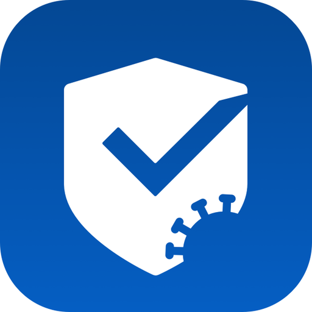
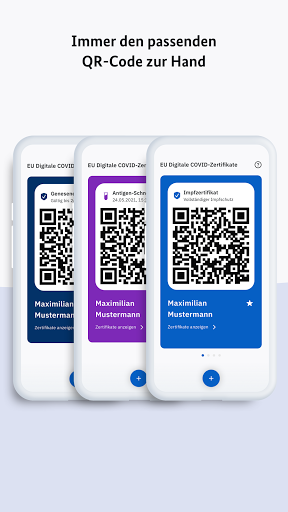

# CovPass
App version ``1.16.4``

Analyzed with [covid-apps-observer](http://github.com/covid-apps-observer) project, version ``0.1``

## App overview
| | |
|-------------------------|-------------------------| 
| **Name**&nbsp;&nbsp;&nbsp;&nbsp;&nbsp;&nbsp;&nbsp;&nbsp;&nbsp;&nbsp;&nbsp;&nbsp;&nbsp;&nbsp;&nbsp;&nbsp;&nbsp;&nbsp;&nbsp;&nbsp;&nbsp;&nbsp;&nbsp;&nbsp;&nbsp;&nbsp;&nbsp;&nbsp;&nbsp;&nbsp;&nbsp;&nbsp;&nbsp;&nbsp;&nbsp;&nbsp;&nbsp;&nbsp;&nbsp;&nbsp;  | CovPass |
| **Unique identifier** | de.rki.covpass.app |
| **Link to Google Play** | [https://play.google.com/store/apps/details?id=de.rki.covpass.app](https://play.google.com/store/apps/details?id=de.rki.covpass.app) |
| **Summary**  | Weisen Sie Ihre Impfung, Ihre Genesung oder Ihr negatives Testergebnis nach. |
| **Privacy policy** | [https://www.digitaler-impfnachweis-app.de/webviews/client-app/privacy/](https://www.digitaler-impfnachweis-app.de/webviews/client-app/privacy/) |
| **Latest version** | 1.16.4 |
| **Last update** | 2021-07-01 13:21:23 |
| **Recent changes** | Mit dieser Version wurde ein Hinweis zum Impfzertifikat nach Genesung hinzugefügt.  |
| **Installs**  | 5.000.000+ |
| **Category** | Gesundheit & Fitness |
| **First release** | 09.06.2021 |
| **Size**  | 12M |
| **Supported Android version**  | 6.0 oder höher |

### Description
> Das Robert Koch-Institut (RKI) als zentrale Einrichtung des Bundes im Bereich der Öffentlichen Gesundheit und als nationales Public-Health-Institut veröffentlicht die CovPass-App für die deutsche Bundesregierung. Mit der App lassen sich die EU Digitalen COVID Zertifikate direkt auf dem Smart-phone speichern. Wer sie nutzt, kann seinen Impfschutz, seine Genesung oder sein negatives Testergebnis schnell, sicher und digital nachweisen. Mit der App können auch die EU Digitalen COVID Zertifikate anderer Personen (zum Beispiel Familienangehörige) auf dem Smartphone nachgewiesen werden. Die Nutzerinnen und Nutzer der App entscheiden, wann und wem sie ihre Informationen und Daten vorzeigen.
 Die CovPass-App ist ein kostenloses Angebot des Robert Koch-Instituts.
 WIE DIE APP FUNKTIONIERT
 Der Nachweis über die Corona-Impfungen, über die Genesung von der Corona-Infektion oder über ein negatives Corona-Testergebnis ist die zentrale Funktion der CovPass-App. Wann immer Nutze-rinnen und Nutzer ihren Corona-Status nachweisen, werden nur die für die Überprüfung notwendigen Informationen und Daten per QR-Code angezeigt. 
 Der QR-Code gibt Auskunft über den Status eines Impf-, Test- oder Genesenenzertifikats. Zur ein-deutigen Identifikation werden zudem der Name und das Geburtsdatum bei einer Überprüfung an-gezeigt. Die App übermittelt zu keinem Zeitpunkt personenbezogene Informationen und Daten.  
 Das EU Digitale COVID Zertifikat kann auch für andere Personen (zum Beispiel Familienangehörige) auf dem Smartphone abgelegt werden. Anschließend wird der aktuelle QR-Code im Startbildschirm der App angezeigt. Dieser kann bei Bedarf vorgezeigt werden.
 Corona-Impfungen werden auf Wunsch mit dem EU Digitalen COVID Impfzertifikat bescheinigt. Das Impfzertifikat wird nach der Impfung vom medizinischen Personal erstellt. Es enthält einen QR-Code, der mit der App gescannt werden kann. Dazu ist die Kamera des Smartphones über den QR-Code zu halten. Die Impfung wird direkt auf das Smartphone geladen. 
 Negative Corona-Tests werden mit dem EU Digitalen COVID Testzertifikat bescheinigt. Das Testzertifikat wird von der Apotheke, von der Arztpraxis oder von speziellen Testzentren erstellt. Dieses enthält einen QR-Code, der mit der App gescannt werden kann. Das negative Testergebnis wird an-schließend auf dem Smartphone gespeichert.
 Genesungen von der Corona-Infektion werden mit dem EU Digitalen COVID Genesenenzertifikat bescheinigt. Das Genesenenzertifikat erhalten Sie nach überstandener Corona-Erkrankung von Ihrer Hausärztin oder Ihrem Hausarzt. Es enthält einen QR-Code, der mit der App gescannt werden kann. Die Genesung wird anschließend auf dem Smartphone dokumentiert. 
 Die Daten des EU Digitalen COVID Zertifikats sind lokal auf dem Smartphone gespeichert. Nur die Nutzerinnen und Nutzer entscheiden, wann und wem sie die Informationen und Daten vorzeigen.
 WIE DIE DATEN SICHER BLEIBEN
 Der Datenschutz bleibt über die gesamte Nutzungsdauer gewahrt. 
 •	Keine Anmeldung: Es ist keine Registrierung mit einer E-Mail-Adresse notwendig.
 •	Lokale Datenspeicherung: Ihre vollständigen Daten sind nur auf Ihrem Smartphone gespeichert.
 •	Datensparsamkeit: Der QR-Code wird mit dem in der EU abgestimmten minimalen Datenumfang angezeigt. Nach der Prüfung des QR-Codes werden nur der Status des Zertifikats, der Name und das Geburtsdatum angezeigt.  
 •	Kryptografische Sicherheit: Der QR-Code ist mit einer starken Signatur geschützt und kann nicht gefälscht werden.

### User interface
The developers of the app provide the following screenshots in the Google play store.
| | | |
|:-------------------------:|:-------------------------:|:-------------------------:|
 |   |   |   | 
 |   |   |   | 
 |   |   |   | 
 |  

## Development team
In the following we report the main information provided by the development team in the Google play store.

| | |
|-------------------------|-------------------------|
| **Developer**  | Robert Koch-Institut |
| **Website**  | [https://www.digitaler-impfnachweis-app.de/kontakt/](https://www.digitaler-impfnachweis-app.de/kontakt/) |
| **Email** | support@covpass-app.de |
| **Physical address**  | [Robert Koch-Institut Nordufer 20 13353 Berlin](https://www.google.com/maps/search/Robert%20Koch-Institut%20Nordufer%2020%2013353%20Berlin) (Google Maps) |
| **Other developed apps**  | [https://play.google.com/store/apps/developer?id=Robert+Koch-Institut](https://play.google.com/store/apps/developer?id=Robert+Koch-Institut) |

## Android support

| | |
|-------------------------|-------------------------|
| **Declared target Android version**  | - |
| **Effective target Android version**  | - |
| **Minimum supported Android version**  | Marshmallow, version 6.0 (API level 23) |
| **Maximum target Android version**  | - |

The larger the difference between the minimum and maximum supported Android versions, the better. A larger difference means a wider audience. For example, old phones have a very low Android version, so a high minimum supported Android version means that the app cannot be used by users with old phones, thus leading to accessibility problems. 

## Requested permissions

In the following we report the complete list of the permissions requested by the app. 

| **Permission** | **Protection level** | **Description** | 
|-------------------------|-------------------------|-------------------------|
 **android.permission ACCESS_NETWORK_STATE** | Normal | Allows applications to access information about networks. 
 **android.permission CAMERA** | :warning:**Dangerous** | Required to be able to access the camera device. 
 **android.permission FOREGROUND_SERVICE** | Normal | Allows a regular application to use Service.startForeground. 
 **android.permission INTERNET** | Normal | Allows applications to open network sockets. 
 **android.permission RECEIVE_BOOT_COMPLETED** | Normal | Allows an application to receive the Intent.ACTION_BOOT_COMPLETED that is broadcast after the system finishes booting. 
 **android.permission WAKE_LOCK** | Normal | Allows using PowerManager WakeLocks to keep processor from sleeping or screen from dimming. 

## Mentioned servers

| **Server** | **Registrant** | **Registrant country** | **Creation date** | 
|-------------------------|-------------------------|-------------------------|-------------------------|
 | europa.eu | - | - | - |
 | snomed.info | IHTSDO | GB | 2001-09-13 05:40:58 |
 | loinc.org | Contact Privacy Inc. Customer 124813267 | :canada: CA | 2000-01-14 16:04:24 |

## Security analysis 

Below we report the main security warnings raised by our execution of the [Androwarn](https://github.com/maaaaz/androwarn) security analysis tool.

**Connection interfaces exfiltration**
> - This application reads details about the currently active data network 
> - This application tries to find out if the currently active data network is metered 

**Suspicious connection establishment**
> - This application opens a Socket and connects it to the remote address ' returned no addresses for  ; port is out of range' on the 'N/A' port  
> - This application opens a Socket and connects it to the remote address '' on the 'N/A' port  
> - This application opens a Socket and connects it to the remote address 'Ljava/lang/StringBuilder;->toString()Ljava/lang/String;' on the 'N/A' port  
> - This application opens a Socket and connects it to the remote address 'Ljava/net/Proxy;->type()Ljava/net/Proxy$Type;' on the 'N/A' port  
> - This application opens a Socket and connects it to the remote address 'Method sendUrgentData() is not supported.' on the 'N/A' port  
> - This application opens a Socket and connects it to the remote address 'Method setHandshakeTimeout() is not supported.' on the 'N/A' port  
> - This application opens a Socket and connects it to the remote address 'Method setOOBInline() is not supported.' on the 'N/A' port  
> - This application opens a Socket and connects it to the remote address 'Method setSoWriteTimeout() is not supported.' on the 'N/A' port  
> - This application opens a Socket and connects it to the remote address 'Socket closed' on the 'N/A' port  
> - This application opens a Socket and connects it to the remote address 'Socket is closed' on the 'N/A' port  
> - This application opens a Socket and connects it to the remote address 'Socket is closed.' on the 'N/A' port  
> - This application opens a Socket and connects it to the remote address 'Socket is not connected.' on the 'N/A' port  
> - This application opens a Socket and connects it to the remote address 'socket is closed' on the 'N/A' port  
> - This application opens a Socket and connects it to the remote address 'timeout' on the 'N/A' port  

**Code execution**
> - This application loads a native library: 'conscrypt_jni' 

## User ratings and reviews

Below we provide information about how end users are reacting to the app in terms of ratings and reviews in the Google Play store.

### Ratings

The CovPass app has been installed by more than **5000000** times. At this time, **5549** rated the app and its average score is **3.102848**. Below we show the distribution of the ratings across the usual star-based rating of Google Play

:star::star::star::star::star:: 2301

:star::star::star::star:: 474

:star::star::star:: 386

:star::star:: 272

:star:: 2116

### Reviews 

#### 5-star reviews

> Läuft macht was sie soll.  :date: __2021-07-04 17:54:49__

> Läuft gut. Datensparsam, übersichtlich.  :date: __2021-07-04 17:45:12__

> Zack, zack, beide Codes gescannt!!!  :date: __2021-07-04 16:55:03__

> Ich halte die app für Sehr sehr gut. Ich würde es begrüßen, da die app in der gesamten EU einsetzbar ist, man die Sprache des Landes auswählen könnte das man besuchen will ( zb E F I S) Schönen Tag noch! Günter böhm  :date: __2021-07-04 16:39:03__

> Bei mir hat es bisher sehr gut geklappt.  :date: __2021-07-04 16:04:28__

> Macht was sie soll... Danke  :date: __2021-07-04 16:02:58__

> Weiss nicht was manche davon haben hier etwas falsches zu schreiben? Ist in deutscher und englischer Sprache!!!  :date: __2021-07-04 15:53:04__

> Sehr einfach zu handhaben und schlank. Fotografieren des Barcodes und Hinterlegung in der App ohne Probleme und in ein paar Sekunden erledigt.  :date: __2021-07-04 15:21:51__

> Klappte sofort alles (Zertifikate in der Apotheke ausstellen lassen) Die neueste Version berücksichtigt auch Zertifikate für Genesung:-)  :date: __2021-07-04 14:25:22__

> Funktioniert bestens.  :date: __2021-07-04 12:55:16__

#### 4-star reviews

> Die App funktioniert super - es sollte noch a Familyfunktion geben ... Frau, Kind mit drauf 😍👍 ggf mit Nachnamen unverheiratet ... ein Berg von Mobiltelefonen mitschleppen 😂? Theater Kino Restaurant ... Je weniger Handy so besser ist es ... Eine Digitale App für die ganze Family 👍  :date: __2021-07-04 17:04:26__

> Die App funktioniert einwandfrei. Aber:Wie kann ich das Zertifikat ausdrucken? Wünschenswert wäre die Möglichkeit das Zertifikat als PDF abzuspeichern.  :date: __2021-07-04 11:36:39__

> App funktionierte eigentlich gut für den Teil 1, aber der 2. ImpfQR nach einer Kreuzimpfung lässt sich einfach nicht erkennen sprich einlesen. Frage : liegt das an der App oder am digitalen Code (der vom Impfzentrum zugeschickt wurde? Danke für alle Informationen  :date: __2021-07-04 09:48:35__

> Ein Darkmode fehlt noch  :date: __2021-07-03 23:31:46__

> Eingerichtet einfach aber noch nicht gebraucht  :date: __2021-07-03 22:17:05__

> QR-Code vom Testergebnis nicht einlesbar :-(  :date: __2021-07-03 17:20:21__

> Kinderleicht auch ohne Erklärung zu nutzen. Mehrere QR-Codes für verschiedene Personen einzulesen ist in Sekunden erledigt.  :date: __2021-07-03 14:51:04__

> Keine Rückmeldung über den erfolgreichen QR Scan, dies sollte verbessert werden, man hält das Smartphone auf Code 1 und Code 2 aber nix , anschließend sind beide in der App ohne physische Rückmeldung über den erfolgreichen Scan, ansonsten funktioniert die App ohne Probleme  :date: __2021-07-03 13:01:44__

> Berichtigung zu meiner ersten Aussage. Heute ( einen Tag später) hat das herunterladen des QR- Code geklapt. Also KEIN Schrott.  :date: __2021-07-03 11:20:55__

> Leider kann ich nicht Sternen geben, bei mir hat an Anfang nicht geklappt und es war ein Problem in den Namen, fällt denn ein Akzent und das hatte nicht eingenommen den Koda haben mir neue koda und das klappte wunderbar, von der zweite Mal, wenn ich fliegen werde ich es Sternen geben ..in moment bin sehr sufriden  :date: __2021-07-03 11:05:56__

#### 3-star reviews

> War alles perfekt, dann kam der Tag als die 14 Tage um waren und alles war weg. Perfekt!  :date: __2021-07-04 15:07:00__

> Wieso geht das nicht der Qr-code nicht einlesen kannst.  :date: __2021-07-04 14:49:23__

> Nach dem Update, keine Funktion mehr. Deinstallieren und neu ein Scannen, dann funktioniert Sie wieder. Ansonsten praktisch.  :date: __2021-07-04 13:34:11__

> Smartphone ok aber auf Tablet geht der Code nicht scannen  :date: __2021-07-04 11:21:15__

> Warum gibt es kein widgets von der App bei Android  :date: __2021-07-04 11:02:19__

> Leicht zu installieren und den Impfpass zu bestätigen  :date: __2021-07-04 11:00:14__

> Macht was es soll. Aber, sobald am Smartphone die Display-Einstellungen für Darstellung und Schriftgröße seniorengerecht auf "groß" sind, wird der Text unter dem QR-Code umgebrochen und durch den Farbverlauf (für was braucht es den?) überdeckt. Das ist unpraktisch und zeigt, dass nicht daran gedacht wurde, dass ältere Menschen ihr Smartphones auf ihre Bedürfnisse einstellen! Kleine Anregung: Bei vollständigem Impfschutz den Hintergrund auf grün umschalten.  :date: __2021-07-04 09:26:59__

> Viel zu schlechte Bewertungen. Armutszeugnis des RKI. Ich warte auf Verbesserungen, bevor ich der App eine Chance gebe.  :date: __2021-07-04 09:12:29__

> Neue Version unterbindet Screenshots - was ein Mist! Konnte man mit der letzten Version noch einen Schreenshot machen um sich z.B. ein laminiertes Kärtchen zu drucken, ist das jetzt nach dem Update nicht mehr möglich. Ich mag keine Apps welche mich bevormunden und gängeln, aus welchem Grund auch immer. Werde mir natürlich anders behelfen, diese Sperre ist überwindbar. Trotzdem unnötig und und ärgerlich.  :date: __2021-07-03 21:16:08__

> Das Einscannen ist etwas fummelig. Was nicht geht, das beim aktualisieren die App gelöscht wird, und alle Impfdaten weg sind. Wer diese App aktualisieren möchte, sollte seine Impfzertifikate zur Hand haben, die müssen wieder neu eingescannt werden. Ein Umstand, der auch mitgeteilt werden sollte. Daher nur 3 Sterne.  :date: __2021-07-03 19:15:23__

#### 2-star reviews

> Leider nützt die App nur denen, die nicht an Corona erkrankt waren und daher 2 Impfungen erhalten. Jene die erkrankt waren und dadurch nur eine Impfung erhalten, haben hier Pech, es zeigt nur an "Impfung 1 von 2" und "Impfstatus unvollständig"...tja wieder mal nicht zuende gedacht  :date: __2021-07-04 01:48:34__

> Weg isses? Bis gestern war es da, vorhin die App geöffnet, Zertifikat ist weg. Super. Muss ich es jetzt jede Woche neu einscannen?  :date: __2021-07-03 23:43:20__

> Gute App..leider nur in Deutsch und damit in Ausland verwirrend und nicht richtig zu gebrauchen..ich kann mir gut vorstellen das in USA die Amis darüber sich Lustig machen. In Italien ist die App in Englisch und Italienisch..Zusätzlich ist das Original Zeichen der EU abgebildet. Deutschland deine Digitalisierung..Amen  :date: __2021-07-03 21:37:59__

> Nach dem Neustart der App war das Zertifikat weg. Sollte es neu erstellen. Eine Katastrophe, wenn man wie ich gerade im EU-Ausland ist und nicht nachweisen kann, dass man 2x geimpft ist.  :date: __2021-07-03 21:12:11__

> Leider ist mein Smartphone mit Android 10 nicht mit der App kompatibel, Meldung kommt beim Playstore vor der Installation, es handelt sich um ein OPPO RENO4 5G, habe trotzdem installiert und meine Codes eingescannt und nun steht nur der Vorname bei dem Code, obwohl auf der Impfbescheinigung mein vollständiger Name eingetragen wurde, nun warte ich auf das Update..., das heutige Update hat es nicht gebracht, in der Luca App wird mein vollständiger Name angezeigt, iwie komisch!  :date: __2021-07-03 14:53:44__

> Am Anfang war alles super, als ich die App ein paar Tage später öffnen wollte ging leider gar nichts mehr. Hab sie deinstalliert und wieder installiert, momentan geht es. Ich hoffe es bleibt auch so, sonst bringt sie ja nichts. Wäre sehr ärgerlich!  :date: __2021-07-03 13:58:27__

> Nachdem eine der ersten versionen problemlos funktionierte, ist es seit 1.16.0 (auch 1.16.4) mäßig mit dem Scan. 17 scan versuche für 2 QR Codes !! Darstellungen des finalen Zertifikats auf 2 verschiedenen Handys bei Version 1.16.4 unterschiedlich (mal mit Namen s20 und mal ohne Namen s10)  :date: __2021-07-03 13:17:59__

> Sophos Intercept X schlägt Alarm..... Reputationsprobleme?!?  :date: __2021-07-03 13:16:48__

> Leider lässt sich die App nicht öffnen was kann ich tun  :date: __2021-07-03 13:13:12__

> App funktioniert im Moment nicht. Wenn das auf dem Flughafen so läuft, hat man keine guten Karten.  :date: __2021-07-03 12:05:11__

#### 1-star reviews

> Seit dem letzten Update lässt sich die App nicht mehr starten!!!! Bitte sofort beheben! Ich würde mich auf die App nicht verlassen!!! Könnte im Urlaub peinlich werden! Solche fatalen programierungsfehler bei so einer schlanken App dürfen nicht. passieren!!!  :date: __2021-07-04 17:35:02__

> Nach dem letzten Update ist die App wieder auf Null gestellt und die eingescannte Impfbescheinigung ist verschwunden. Ich glaube die Programmierer werden nicht gut bezahlt, sonst würden sie doch Testläufe machen bevor sie ein Update rausschicken.  :date: __2021-07-04 17:08:00__

> Diese App ist wirklich für den A....man kann nicht den Impfcod abscannen.Funktioniert garnicht. Absoluter Mist.  :date: __2021-07-04 17:01:42__

> Geht nach Update nicht mehr. Stehe am Flughafen, ganz großes Kino!  :date: __2021-07-04 16:55:39__

> Leider kann ich meinen QR-CODE nicht einscannen. Keine Ahnung ob das an dem Handy liegt oder an der APP. Hat jemand Erfahrung mit einem SAMSUNG Galaxy S20FE ?  :date: __2021-07-04 16:55:21__

> Es hat nur 1 Woche funktioniert. Seit 3 Tage geht's nicht mehr.  :date: __2021-07-04 16:46:30__

> Warum ist die App nicht für Version 5 verfügbar? Nicht jeder besitzt immer das aktuellste Handy! Auch diesen Personen sollte die einzige Möglichkeit zur Digitalisierung des Nachweises nicht verwehrt werden.  :date: __2021-07-04 16:44:46__

> QR-Code einscannen funktioniert nicht, der Code wird scheinbar nicht erkannt. Somit ist die App unbrauchbar.  :date: __2021-07-04 16:11:47__

> Funktioniert seit Tagen nicht  :date: __2021-07-04 16:07:04__

> Voll der Mist, hielt ganze 2 Tage und jetzt nur weiße Seite....werde den CovPass sicher nicht mehr verwenden  :date: __2021-07-04 15:48:38__

