# CovPass
App version ``1.28.3``

Analyzed with [covid-apps-observer](http://github.com/covid-apps-observer) project, version ``0.1``

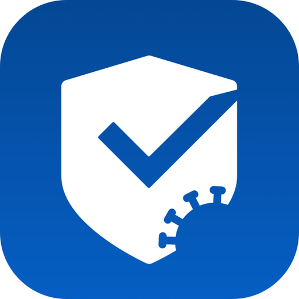

## App overview
| | |
|-------------------------|-------------------------| 
| **Name**&nbsp;&nbsp;&nbsp;&nbsp;&nbsp;&nbsp;&nbsp;&nbsp;&nbsp;&nbsp;&nbsp;&nbsp;&nbsp;&nbsp;&nbsp;&nbsp;&nbsp;&nbsp;&nbsp;&nbsp;&nbsp;&nbsp;&nbsp;&nbsp;&nbsp;&nbsp;&nbsp;&nbsp;&nbsp;&nbsp;&nbsp;&nbsp;&nbsp;&nbsp;&nbsp;&nbsp;&nbsp;&nbsp;&nbsp;&nbsp;  | CovPass |
| **Unique identifier** | de.rki.covpass.app |
| **Link to Google Play** | [https://play.google.com/store/apps/details?id=de.rki.covpass.app](https://play.google.com/store/apps/details?id=de.rki.covpass.app) |
| **Summary**  | Weisen Sie Ihre Impfung, Ihre Genesung oder Ihr negatives Testergebnis nach. |
| **Privacy policy** | [https://www.digitaler-impfnachweis-app.de/webviews/client-app/privacy/](https://www.digitaler-impfnachweis-app.de/webviews/client-app/privacy/) |
| **Latest version** | 1.28.3 |
| **Last update** | 2021-07-06 17:21:19 |
| **Recent changes** | In dieser Version wurden die Regeln für ein gültiges beziehungsweise ungültiges Zertifikat erweitert.  |
| **Installs**  | 5.000.000+ |
| **Category** | Gesundheit & Fitness |
| **First release** | 09.06.2021 |
| **Size**  | 12M |
| **Supported Android version**  | 6.0 oder höher |

### Description
> Das Robert Koch-Institut (RKI) als zentrale Einrichtung des Bundes im Bereich der Öffentlichen Gesundheit und als nationales Public-Health-Institut veröffentlicht die CovPass-App für die deutsche Bundesregierung. Mit der App lassen sich die EU Digitalen COVID Zertifikate direkt auf dem Smart-phone speichern. Wer sie nutzt, kann seinen Impfschutz, seine Genesung oder sein negatives Testergebnis schnell, sicher und digital nachweisen. Mit der App können auch die EU Digitalen COVID Zertifikate anderer Personen (zum Beispiel Familienangehörige) auf dem Smartphone nachgewiesen werden. Die Nutzerinnen und Nutzer der App entscheiden, wann und wem sie ihre Informationen und Daten vorzeigen.
 Die CovPass-App ist ein kostenloses Angebot des Robert Koch-Instituts.
 WIE DIE APP FUNKTIONIERT
 Der Nachweis über die Corona-Impfungen, über die Genesung von der Corona-Infektion oder über ein negatives Corona-Testergebnis ist die zentrale Funktion der CovPass-App. Wann immer Nutze-rinnen und Nutzer ihren Corona-Status nachweisen, werden nur die für die Überprüfung notwendigen Informationen und Daten per QR-Code angezeigt. 
 Der QR-Code gibt Auskunft über den Status eines Impf-, Test- oder Genesenenzertifikats. Zur ein-deutigen Identifikation werden zudem der Name und das Geburtsdatum bei einer Überprüfung an-gezeigt. Die App übermittelt zu keinem Zeitpunkt personenbezogene Informationen und Daten.  
 Das EU Digitale COVID Zertifikat kann auch für andere Personen (zum Beispiel Familienangehörige) auf dem Smartphone abgelegt werden. Anschließend wird der aktuelle QR-Code im Startbildschirm der App angezeigt. Dieser kann bei Bedarf vorgezeigt werden.
 Corona-Impfungen werden auf Wunsch mit dem EU Digitalen COVID Impfzertifikat bescheinigt. Das Impfzertifikat wird nach der Impfung vom medizinischen Personal erstellt. Es enthält einen QR-Code, der mit der App gescannt werden kann. Dazu ist die Kamera des Smartphones über den QR-Code zu halten. Die Impfung wird direkt auf das Smartphone geladen. 
 Negative Corona-Tests werden mit dem EU Digitalen COVID Testzertifikat bescheinigt. Das Testzertifikat wird von der Apotheke, von der Arztpraxis oder von speziellen Testzentren erstellt. Dieses enthält einen QR-Code, der mit der App gescannt werden kann. Das negative Testergebnis wird an-schließend auf dem Smartphone gespeichert.
 Genesungen von der Corona-Infektion werden mit dem EU Digitalen COVID Genesenenzertifikat bescheinigt. Das Genesenenzertifikat erhalten Sie nach überstandener Corona-Erkrankung von Ihrer Hausärztin oder Ihrem Hausarzt. Es enthält einen QR-Code, der mit der App gescannt werden kann. Die Genesung wird anschließend auf dem Smartphone dokumentiert. 
 Die Daten des EU Digitalen COVID Zertifikats sind lokal auf dem Smartphone gespeichert. Nur die Nutzerinnen und Nutzer entscheiden, wann und wem sie die Informationen und Daten vorzeigen.
 WIE DIE DATEN SICHER BLEIBEN
 Der Datenschutz bleibt über die gesamte Nutzungsdauer gewahrt. 
 •	Keine Anmeldung: Es ist keine Registrierung mit einer E-Mail-Adresse notwendig.
 •	Lokale Datenspeicherung: Ihre vollständigen Daten sind nur auf Ihrem Smartphone gespeichert.
 •	Datensparsamkeit: Der QR-Code wird mit dem in der EU abgestimmten minimalen Datenumfang angezeigt. Nach der Prüfung des QR-Codes werden nur der Status des Zertifikats, der Name und das Geburtsdatum angezeigt.  
 •	Kryptografische Sicherheit: Der QR-Code ist mit einer starken Signatur geschützt und kann nicht gefälscht werden.

### User interface
The developers of the app provide the following screenshots in the Google play store.
| | | |
|:-------------------------:|:-------------------------:|:-------------------------:|
 | 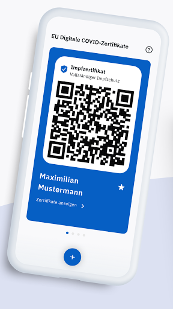  |   | 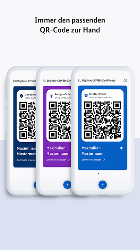  | 
 |   | 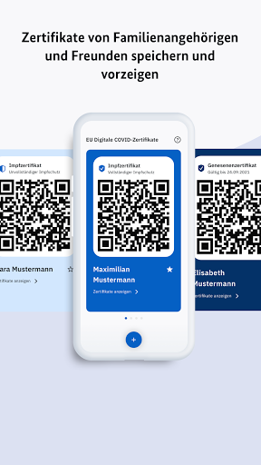  |   | 
 | 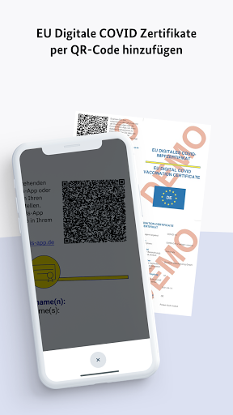  | 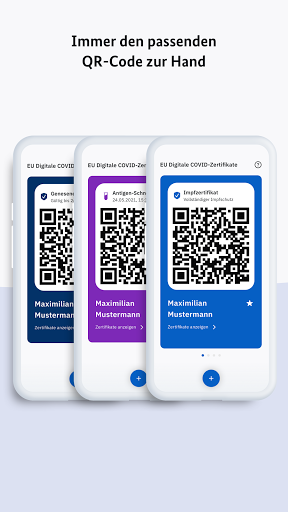  | 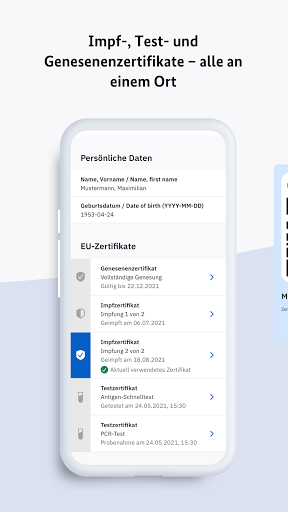  | 
 |  

## Development team
In the following we report the main information provided by the development team in the Google play store.

| | |
|-------------------------|-------------------------|
| **Developer**  | Robert Koch-Institut |
| **Website**  | [https://www.digitaler-impfnachweis-app.de/kontakt/](https://www.digitaler-impfnachweis-app.de/kontakt/) |
| **Email** | support@covpass-app.de |
| **Physical address**  | [Robert Koch-Institut Nordufer 20 13353 Berlin](https://www.google.com/maps/search/Robert%20Koch-Institut%20Nordufer%2020%2013353%20Berlin) (Google Maps) |
| **Other developed apps**  | [https://play.google.com/store/apps/developer?id=Robert+Koch-Institut](https://play.google.com/store/apps/developer?id=Robert+Koch-Institut) |

## Android support

| | |
|-------------------------|-------------------------|
| **Declared target Android version**  | - |
| **Effective target Android version**  | - |
| **Minimum supported Android version**  | Marshmallow, version 6.0 (API level 23) |
| **Maximum target Android version**  | - |

The larger the difference between the minimum and maximum supported Android versions, the better. A larger difference means a wider audience. For example, old phones have a very low Android version, so a high minimum supported Android version means that the app cannot be used by users with old phones, thus leading to accessibility problems. 

## Requested permissions

In the following we report the complete list of the permissions requested by the app. 

| **Permission** | **Protection level** | **Description** | 
|-------------------------|-------------------------|-------------------------|
 **android.permission ACCESS_NETWORK_STATE** | Normal | Allows applications to access information about networks. 
 **android.permission CAMERA** | :warning:**Dangerous** | Required to be able to access the camera device. 
 **android.permission FOREGROUND_SERVICE** | Normal | Allows a regular application to use Service.startForeground. 
 **android.permission INTERNET** | Normal | Allows applications to open network sockets. 
 **android.permission RECEIVE_BOOT_COMPLETED** | Normal | Allows an application to receive the Intent.ACTION_BOOT_COMPLETED that is broadcast after the system finishes booting. 
 **android.permission WAKE_LOCK** | Normal | Allows using PowerManager WakeLocks to keep processor from sleeping or screen from dimming. 

## Mentioned servers

| **Server** | **Registrant** | **Registrant country** | **Creation date** | 
|-------------------------|-------------------------|-------------------------|-------------------------|
 | europa.eu | - | - | - |
 | snomed.info | IHTSDO | GB | 2001-09-13 05:40:58 |
 | loinc.org | Contact Privacy Inc. Customer 124813267 | :canada: CA | 2000-01-14 16:04:24 |

## Security analysis 

Below we report the main security warnings raised by our execution of the [Androwarn](https://github.com/maaaaz/androwarn) security analysis tool.

**Connection interfaces exfiltration**
> - This application reads details about the currently active data network 
> - This application tries to find out if the currently active data network is metered 

**Suspicious connection establishment**
> - This application opens a Socket and connects it to the remote address ' returned no addresses for  ; port is out of range' on the 'N/A' port  
> - This application opens a Socket and connects it to the remote address '' on the 'N/A' port  
> - This application opens a Socket and connects it to the remote address 'Ljava/lang/StringBuilder;->toString()Ljava/lang/String;' on the 'N/A' port  
> - This application opens a Socket and connects it to the remote address 'Ljava/net/Proxy;->type()Ljava/net/Proxy$Type;' on the 'N/A' port  
> - This application opens a Socket and connects it to the remote address 'Method sendUrgentData() is not supported.' on the 'N/A' port  
> - This application opens a Socket and connects it to the remote address 'Method setHandshakeTimeout() is not supported.' on the 'N/A' port  
> - This application opens a Socket and connects it to the remote address 'Method setOOBInline() is not supported.' on the 'N/A' port  
> - This application opens a Socket and connects it to the remote address 'Method setSoWriteTimeout() is not supported.' on the 'N/A' port  
> - This application opens a Socket and connects it to the remote address 'Socket closed' on the 'N/A' port  
> - This application opens a Socket and connects it to the remote address 'Socket is closed' on the 'N/A' port  
> - This application opens a Socket and connects it to the remote address 'Socket is closed.' on the 'N/A' port  
> - This application opens a Socket and connects it to the remote address 'Socket is not connected.' on the 'N/A' port  
> - This application opens a Socket and connects it to the remote address 'socket is closed' on the 'N/A' port  
> - This application opens a Socket and connects it to the remote address 'timeout' on the 'N/A' port  

**Code execution**
> - This application loads a native library: 'conscrypt_jni' 

## User ratings and reviews

Below we provide information about how end users are reacting to the app in terms of ratings and reviews in the Google Play store.

### Ratings

The CovPass app has been installed by more than **5000000** times. At this time, **6785** rated the app and its average score is **3.3141026**. Below we show the distribution of the ratings across the usual star-based rating of Google Play

:star::star::star::star::star:: 3063

:star::star::star::star:: 739

:star::star::star:: 452

:star::star:: 330

:star:: 2201

### Reviews 

#### 5-star reviews

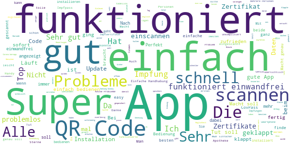

> Die App hat gegenüber der Corona-Warn-App den großen Vorteil, Zertifikate für mehrere Personen zu speichern. Falls mal eine(r) das Handy vergisst oder der Akku leer ist.  :date: __2021-07-11 11:47:11__

> Die Apo ist gut  :date: __2021-07-11 11:04:24__

> Ist eine sehr tolle app ohne Werbung 👍👍👍  :date: __2021-07-11 10:56:41__

> Ich weiß nicht was das soll. Die App funktioniert einwandfrei und englisch ist auch dabei.  :date: __2021-07-11 09:51:58__

> Einfach... Tut was es soll.... Ohne viel Schnickschnack...  :date: __2021-07-11 09:37:10__

> Einfach und schnell zu empfehlen  :date: __2021-07-11 08:54:17__

> Funktioniert einwandfrei  :date: __2021-07-11 08:44:05__

> Supi  :date: __2021-07-11 02:14:39__

> Läuft einwandfrei, auch nach dem Update.  :date: __2021-07-11 00:34:32__

> Gut  :date: __2021-07-10 21:07:41__

#### 4-star reviews

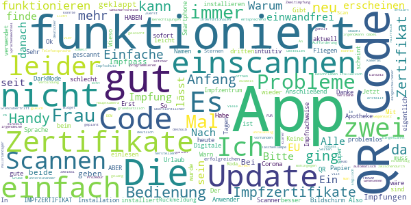

> Habe meine u.die von meiner Frau Zertifikate in Verbindung mit dem Ausweis immer dabei  :date: __2021-07-10 18:21:29__

> obwohl zum internationalen Einsatz geplant leider nur in deutscher Sprache, echt?  :date: __2021-07-10 16:23:53__

> Es wäre gut, wenn man die App in der Sprache umstellen könnte, zb für den Grenzübertritt. Die App ist aktuell nicht Mal über die Telefonsprache auf Englisch oder Italienisch setzbar (im Gegensatz zur Corona Warn App).  :date: __2021-07-10 09:15:14__

> Einfache Bedienung  :date: __2021-07-09 23:45:38__

> Man könnte vllt ein widget herstellen sodass man nicht immer die app öffnen muss.  :date: __2021-07-09 19:53:31__

> M. E. hat die App mehr Berechtigungen als notwendig. An sich scheint sie einfach zu funktionieren. Ich verstehe aber nicht, warum meine zwei Impfzertifikate einzeln in der App erscheinen, wohingegen die zwei meiner Frau direkt in einem untereinander erscheinen, was deutlich übersichtlicher und klarer ist. Eingescannt habe ich alle gleich: Zuerst das der Erst- und danach das der Zweitimpfung. Habe meine auch zweimal zwischendurch gelöscht und neu gescannt, aber die erscheinen auf zwei Seiten.  :date: __2021-07-09 19:41:34__

> Die App ist grundsätzlich gut. Leider hat sie irgendeine meiner vier Kameras am Handy für das Scannen des QR-Codes verwendet, deshalb war das Licht entsprechend schlecht und der QR-Code wurde als unzulässig erklärt. Bitte die App so programmieren, dass sie automatisch die Hauptkamera verwendet! Mit eingeschaltener Taschenlampe ging es dann irgendwann.  :date: __2021-07-09 18:33:20__

> Gut  :date: __2021-07-09 14:29:39__

> Gut  :date: __2021-07-09 14:12:39__

> Ok  :date: __2021-07-09 13:31:45__

#### 3-star reviews

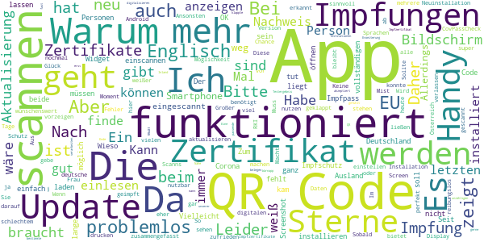

> Die App tut was sie soll. Eine Erweiterung damit man alle Impfungen digitalisieren kann ist wünschenswert. So benötigt man am Ende doch noch seinen Impfpass im Aus und Inland um alle anderen Impfungen zu belegen. Wenn mann alle Impfungen anzeigen lassen kann gerne 5 Sterne  :date: __2021-07-11 12:00:42__

> Impfzertifikat scannen/anzeigen funktioniert problemlos. Aber warum akzeptiert die App nur ganz bestimmte Testergebnis QR Codes? Von den unzähligen Teststationen in unserer Nähe bietet das passende (EU) Zertifikat keine an. Corona Warnapp kann doch auch (fast alle) QR Codes verarbeiten, warum nicht hier?  :date: __2021-07-11 11:23:41__

> Das Scannen des QR-Codes klappte erst nach dem gefühlt hundertsten Versuch. Ansonsten funktioniert alles wie vorgesehen.  :date: __2021-07-11 10:06:36__

> Die App scant den QR code nicht,auch nach mehrfacher Deistalation  :date: __2021-07-11 05:26:16__

> Warum gibt es die App nicht im F-Droid Store? Und was ist mit allen weiteren Impfungen, meiner Meinung nach wieder nur eine halbe Sache!  :date: __2021-07-10 17:10:22__

> Es fehlt eine Option, die Anzeigesprache in der App auf Englisch oder am besten gleich auf europa- oder weltweite Sprachen einstellen zu können. Zeigt man im Ausland die deutsche Oberfläche, muss man alles mühsam erklären.  :date: __2021-07-10 15:19:50__

> Es kann man nicht scannen  :date: __2021-07-10 12:13:25__

> Bei mir ist die Seite auch nur noch weiß.  :date: __2021-07-10 10:50:15__

> Der QRCode Scanner zickt ziemlich rum. Codes, die in der Corona Warn App derselben Handys ( kam bei mehreren Personen mit verschiedenen Geräten vor) problemlos sofort erkannt wurden, ließen sich in Covpass nicht oder nur nach vielen Versuchen scannen. Keine Ecken zum "Einrahmen", kein automatisches zoomen, ein eher hilfloses herumschwenken. Geht vielleicht nur bei perfektem Laserausdruck.  :date: __2021-07-10 08:11:57__

> Kann auch die Zertifikate der anderen EU Länder problemlos einlesen. Leider lässt sich die App aber nur auf einem deutschen Android installieren. EU Einreisende können die App daher in Deutschland nicht nutzen und müssen dann alternativ ihr Zertifikat als Pdf oder Zettel vorzeigen.  :date: __2021-07-09 21:53:06__

#### 2-star reviews

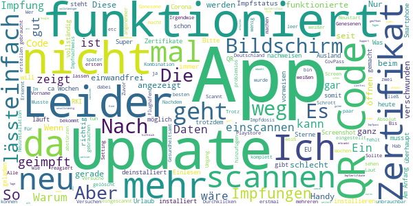

> Scannt nicht, deinstalliert. Noch mal installiert, jetzt ließ sich der QR-Code nach mehreren Versuchen einscannen.  :date: __2021-07-11 12:05:20__

> Wie schon beschrieben geht es gar nicht das die Zertifikate nach einem Update nicht mehr angezeigt werden. Wenn das einem Unwissenden im Urlaub passiert und er seine "Zettel" nicht dabei hat bekommt er Kreislauf. Ein Hinweis wie sie wieder sichtbar gemacht werden wäre wichtig.  :date: __2021-07-10 20:21:26__

> Primitiv  :date: __2021-07-10 16:26:33__

> App lässt sich nicht installieren, wenn die Settings für den Playstore nicht auf Deutschland eingestellt sind. Für US Setting ist die App nicht verfügbar. App somit für Personen, die nicht EU sind aber sich hier aufhalten nicht verwendbar!  :date: __2021-07-10 11:10:00__

> Nur eine weiße seite  :date: __2021-07-09 22:17:30__

> Leider lässt sich die App nicht mehr starten.  :date: __2021-07-09 22:08:41__

> der App funktioniert. ABER! QR wird vom RKI erzeugt und verschlüsselt. Sogar Screenshots sind im verboten. Doch jegliche QR-apps können es einlesen und mühelos bearbeiten und replizieren. Diese können wieder mit CovPass von allen (Bartender, Security, Kellner usw.) eingescannt und auf eingene Geräte gespeichert werden. Vielleicht einfach digitale Zertifikate (pem/crt) erzeugen und auf Bildschirm nur große grüne Haken zeigen?!  :date: __2021-07-09 22:05:05__

> Nach Update alles weg? Nein. Die App zeigt sich wie erstmals gestartet, bei komplettem Durchklicken ist alles wieder da.  :date: __2021-07-09 21:48:58__

> Keine Eintragung für Genäse möglich  :date: __2021-07-09 17:12:49__

> Absolut unbrauchbar. QR Codes lassen sich beim besten Willen nicht scannen.  :date: __2021-07-09 16:15:05__

#### 1-star reviews

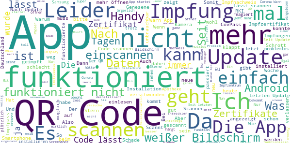

> Kriege dauernd die Meldung, dass das Zertifikat keine gültige Signatur enthält. Ausgesprochen merkwürdig und frustrierend ... Geht sicher auch besser!  :date: __2021-07-11 12:18:28__

> Mein Scanner weist die App als App mit niedriger Reputation aus. Zu viele Zugriffe auf andere Handy-Funktionen. Läuft automatisch im Hintergrund....  :date: __2021-07-11 12:10:30__

> Seit dem letzten Update funktioniert die App nicht mehr.  :date: __2021-07-11 11:14:34__

> Screenshots sind nicht erlaubt. Das führt dazu, dass man kein Nachweis für Zwecke der Einreiseanmeldung erstellen kann. Wenn man dann dafür immer noch Papierdokument braucht, ist diese App völlig sinnlos und eine Verschwendung von Steuergeldern.  :date: __2021-07-11 10:43:57__

> EU-Tests aus Zypern lassen sich nicht scannen. Unbrauchbarer Müll. Dann lieber vor Ort ein Zertifikat ausdrucken lassen....  :date: __2021-07-11 09:49:52__

> Auf meinem MotoG5 Plus mit Android 8.1.0 können keine Zertifikate gescannt werden. Die Kamera startet, der QR Code ist klar zu sehen, aber es passiert weiter nichts. Ist so für mich nicht zu gebrauchen.  :date: __2021-07-11 09:07:27__

> Anfangs funktionierte es. Dann waren plötzlich meine Daten weg und ich wurde mit "Willkommen" begrüßt- was soll das? Warum passiert sowas. Habe echt keinen Nerv das ständig neu zu scannen. Wer weiß, ob die App meine Daten jetzt nochmal nimmt?  :date: __2021-07-11 08:55:24__

> Notwendig, um sein Leben zurück zu bekommen. Leider erinnert es mich an das Dritte Reich: Damals gab's einen Anstecker namens Ariernachweis, um in Läden und Bunker zu kommen. Diese Zeiten sind zurück.  :date: __2021-07-11 07:38:34__

> Reiseapp auf DEUTSCH. Jetzt mal ehrlich... Welche Bande von zerebralen Einzellern war denn da bitte am Werk? 🤣  :date: __2021-07-11 04:27:17__

> Nach Update funktioniert sie nicht mehr  :date: __2021-07-10 23:40:31__

