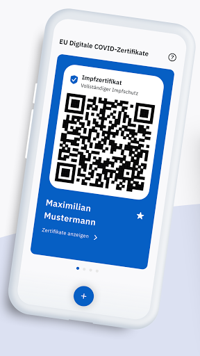
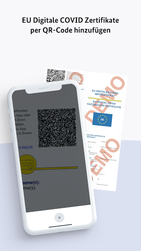

# CovPass
App version ``1.28.4``

Analyzed with [covid-apps-observer](http://github.com/covid-apps-observer) project, version ``0.1``

## App overview
| | |
|-------------------------|-------------------------| 
| **Name**&nbsp;&nbsp;&nbsp;&nbsp;&nbsp;&nbsp;&nbsp;&nbsp;&nbsp;&nbsp;&nbsp;&nbsp;&nbsp;&nbsp;&nbsp;&nbsp;&nbsp;&nbsp;&nbsp;&nbsp;&nbsp;&nbsp;&nbsp;&nbsp;&nbsp;&nbsp;&nbsp;&nbsp;&nbsp;&nbsp;&nbsp;&nbsp;&nbsp;&nbsp;&nbsp;&nbsp;&nbsp;&nbsp;&nbsp;&nbsp;  | CovPass |
| **Unique identifier** | de.rki.covpass.app |
| **Link to Google Play** | [https://play.google.com/store/apps/details?id=de.rki.covpass.app](https://play.google.com/store/apps/details?id=de.rki.covpass.app) |
| **Summary**  | Weisen Sie Ihre Impfung, Ihre Genesung oder Ihr negatives Testergebnis nach. |
| **Privacy policy** | [https://www.digitaler-impfnachweis-app.de/webviews/client-app/privacy/](https://www.digitaler-impfnachweis-app.de/webviews/client-app/privacy/) |
| **Latest version** | 1.28.4 |
| **Last update** | 2021-07-12 12:51:28 |
| **Recent changes** | Mit diesem Release wurde mehrere Bugs gefixt und Hinweise zur sicheren Nutzung der App ergänzt.  |
| **Installs**  | 5.000.000+ |
| **Category** | Gesundheit & Fitness |
| **First release** | 09.06.2021 |
| **Size**  | 13M |
| **Supported Android version**  | 6.0 oder höher |

### Description
> Das Robert Koch-Institut (RKI) als zentrale Einrichtung des Bundes im Bereich der Öffentlichen Gesundheit und als nationales Public-Health-Institut veröffentlicht die CovPass-App für die deutsche Bundesregierung. Mit der App lassen sich die EU Digitalen COVID Zertifikate direkt auf dem Smart-phone speichern. Wer sie nutzt, kann seinen Impfschutz, seine Genesung oder sein negatives Testergebnis schnell, sicher und digital nachweisen. Mit der App können auch die EU Digitalen COVID Zertifikate anderer Personen (zum Beispiel Familienangehörige) auf dem Smartphone nachgewiesen werden. Die Nutzerinnen und Nutzer der App entscheiden, wann und wem sie ihre Informationen und Daten vorzeigen.
 Die CovPass-App ist ein kostenloses Angebot des Robert Koch-Instituts.
 WIE DIE APP FUNKTIONIERT
 Der Nachweis über die Corona-Impfungen, über die Genesung von der Corona-Infektion oder über ein negatives Corona-Testergebnis ist die zentrale Funktion der CovPass-App. Wann immer Nutze-rinnen und Nutzer ihren Corona-Status nachweisen, werden nur die für die Überprüfung notwendigen Informationen und Daten per QR-Code angezeigt. 
 Der QR-Code gibt Auskunft über den Status eines Impf-, Test- oder Genesenenzertifikats. Zur ein-deutigen Identifikation werden zudem der Name und das Geburtsdatum bei einer Überprüfung an-gezeigt. Die App übermittelt zu keinem Zeitpunkt personenbezogene Informationen und Daten.  
 Das EU Digitale COVID Zertifikat kann auch für andere Personen (zum Beispiel Familienangehörige) auf dem Smartphone abgelegt werden. Anschließend wird der aktuelle QR-Code im Startbildschirm der App angezeigt. Dieser kann bei Bedarf vorgezeigt werden.
 Corona-Impfungen werden auf Wunsch mit dem EU Digitalen COVID Impfzertifikat bescheinigt. Das Impfzertifikat wird nach der Impfung vom medizinischen Personal erstellt. Es enthält einen QR-Code, der mit der App gescannt werden kann. Dazu ist die Kamera des Smartphones über den QR-Code zu halten. Die Impfung wird direkt auf das Smartphone geladen. 
 Negative Corona-Tests werden mit dem EU Digitalen COVID Testzertifikat bescheinigt. Das Testzertifikat wird von der Apotheke, von der Arztpraxis oder von speziellen Testzentren erstellt. Dieses enthält einen QR-Code, der mit der App gescannt werden kann. Das negative Testergebnis wird an-schließend auf dem Smartphone gespeichert.
 Genesungen von der Corona-Infektion werden mit dem EU Digitalen COVID Genesenenzertifikat bescheinigt. Das Genesenenzertifikat erhalten Sie nach überstandener Corona-Erkrankung von Ihrer Hausärztin oder Ihrem Hausarzt. Es enthält einen QR-Code, der mit der App gescannt werden kann. Die Genesung wird anschließend auf dem Smartphone dokumentiert. 
 Die Daten des EU Digitalen COVID Zertifikats sind lokal auf dem Smartphone gespeichert. Nur die Nutzerinnen und Nutzer entscheiden, wann und wem sie die Informationen und Daten vorzeigen.
 WIE DIE DATEN SICHER BLEIBEN
 Der Datenschutz bleibt über die gesamte Nutzungsdauer gewahrt. 
 •	Keine Anmeldung: Es ist keine Registrierung mit einer E-Mail-Adresse notwendig.
 •	Lokale Datenspeicherung: Ihre vollständigen Daten sind nur auf Ihrem Smartphone gespeichert.
 •	Datensparsamkeit: Der QR-Code wird mit dem in der EU abgestimmten minimalen Datenumfang angezeigt. Nach der Prüfung des QR-Codes werden nur der Status des Zertifikats, der Name und das Geburtsdatum angezeigt.  
 •	Kryptografische Sicherheit: Der QR-Code ist mit einer starken Signatur geschützt und kann nicht gefälscht werden.

### User interface
The developers of the app provide the following screenshots in the Google play store.
| | | |
|:-------------------------:|:-------------------------:|:-------------------------:|
 |   |   |   | 
 |   |   |   | 
 |   |   |   | 
 |  

## Development team
In the following we report the main information provided by the development team in the Google play store.

| | |
|-------------------------|-------------------------|
| **Developer**  | Robert Koch-Institut |
| **Website**  | [https://www.digitaler-impfnachweis-app.de/kontakt/](https://www.digitaler-impfnachweis-app.de/kontakt/) |
| **Email** | support@covpass-app.de |
| **Physical address**  | [Robert Koch-Institut Nordufer 20 13353 Berlin](https://www.google.com/maps/search/Robert%20Koch-Institut%20Nordufer%2020%2013353%20Berlin) (Google Maps) |
| **Other developed apps**  | [https://play.google.com/store/apps/developer?id=Robert+Koch-Institut](https://play.google.com/store/apps/developer?id=Robert+Koch-Institut) |

## Android support

| | |
|-------------------------|-------------------------|
| **Declared target Android version**  | - |
| **Effective target Android version**  | - |
| **Minimum supported Android version**  | Marshmallow, version 6.0 (API level 23) |
| **Maximum target Android version**  | - |

The larger the difference between the minimum and maximum supported Android versions, the better. A larger difference means a wider audience. For example, old phones have a very low Android version, so a high minimum supported Android version means that the app cannot be used by users with old phones, thus leading to accessibility problems. 

## Requested permissions

In the following we report the complete list of the permissions requested by the app. 

| **Permission** | **Protection level** | **Description** | 
|-------------------------|-------------------------|-------------------------|
 **android.permission ACCESS_NETWORK_STATE** | Normal | Allows applications to access information about networks. 
 **android.permission CAMERA** | :warning:**Dangerous** | Required to be able to access the camera device. 
 **android.permission FOREGROUND_SERVICE** | Normal | Allows a regular application to use Service.startForeground. 
 **android.permission INTERNET** | Normal | Allows applications to open network sockets. 
 **android.permission RECEIVE_BOOT_COMPLETED** | Normal | Allows an application to receive the Intent.ACTION_BOOT_COMPLETED that is broadcast after the system finishes booting. 
 **android.permission WAKE_LOCK** | Normal | Allows using PowerManager WakeLocks to keep processor from sleeping or screen from dimming. 

## Mentioned servers

| **Server** | **Registrant** | **Registrant country** | **Creation date** | 
|-------------------------|-------------------------|-------------------------|-------------------------|
 | europa.eu | - | - | - |
 | snomed.info | IHTSDO | GB | 2001-09-13 05:40:58 |
 | loinc.org | Contact Privacy Inc. Customer 124813267 | :canada: CA | 2000-01-14 16:04:24 |

## Security analysis 

Below we report the main security warnings raised by our execution of the [Androwarn](https://github.com/maaaaz/androwarn) security analysis tool.

**Connection interfaces exfiltration**
> - This application reads details about the currently active data network 
> - This application tries to find out if the currently active data network is metered 

**Suspicious connection establishment**
> - This application opens a Socket and connects it to the remote address ' returned no addresses for  ; port is out of range' on the 'N/A' port  
> - This application opens a Socket and connects it to the remote address '' on the 'N/A' port  
> - This application opens a Socket and connects it to the remote address 'Ljava/lang/StringBuilder;->toString()Ljava/lang/String;' on the 'N/A' port  
> - This application opens a Socket and connects it to the remote address 'Ljava/net/Proxy;->type()Ljava/net/Proxy$Type;' on the 'N/A' port  
> - This application opens a Socket and connects it to the remote address 'Method sendUrgentData() is not supported.' on the 'N/A' port  
> - This application opens a Socket and connects it to the remote address 'Method setHandshakeTimeout() is not supported.' on the 'N/A' port  
> - This application opens a Socket and connects it to the remote address 'Method setOOBInline() is not supported.' on the 'N/A' port  
> - This application opens a Socket and connects it to the remote address 'Method setSoWriteTimeout() is not supported.' on the 'N/A' port  
> - This application opens a Socket and connects it to the remote address 'Socket closed' on the 'N/A' port  
> - This application opens a Socket and connects it to the remote address 'Socket is closed' on the 'N/A' port  
> - This application opens a Socket and connects it to the remote address 'Socket is closed.' on the 'N/A' port  
> - This application opens a Socket and connects it to the remote address 'Socket is not connected.' on the 'N/A' port  
> - This application opens a Socket and connects it to the remote address 'socket is closed' on the 'N/A' port  
> - This application opens a Socket and connects it to the remote address 'timeout' on the 'N/A' port  

**Code execution**
> - This application loads a native library: 'conscrypt_jni' 

## User ratings and reviews

Below we provide information about how end users are reacting to the app in terms of ratings and reviews in the Google Play store.

### Ratings

The CovPass app has been installed by more than **5000000** times. At this time, **8123** rated the app and its average score is **3.7261775**. Below we show the distribution of the ratings across the usual star-based rating of Google Play

:star::star::star::star::star:: 4610

:star::star::star::star:: 836

:star::star::star:: 453

:star::star:: 293

:star:: 1931

### Reviews 

#### 5-star reviews

> Super schnell und unkompliziert. Kann die 1Sterne Rezensionen überhaupt nicht nachvollziehen. Selbst bei meiner Mutter ihrem 4Jahre alten Handy war das einscannen des QR Codes ein Klacks.  :date: __2021-07-19 11:05:55__

> Sehr gut funktioniert, sehr einfach. Ich weiss nicht wie andere Impfzentren verfahren, aber ich wurde darüber aufgeklärt, dass diese App nur im Inland gilt. Im Ausland braucht man Impfpass bzw. Einlegeblätter.  :date: __2021-07-19 10:51:13__

> Installieren, scannen fertig alles super  :date: __2021-07-19 08:57:13__

> Tut was sie soll, nutze sie um meinen impfstatus vorzuzeigen.  :date: __2021-07-19 05:50:41__

> Nichts zu bemängeln. Impfnachweis für die ganze Familie in einer App. 🙂  :date: __2021-07-18 22:05:35__

> Praktisch für die Reise. Europa lässt sich damit händeln.  :date: __2021-07-18 21:48:20__

> Einfach im Aufbau, leichtestes Einlesen des QR Codes,extrem leichte Handhabung,bestmögliche ImpfpassApp  :date: __2021-07-18 21:13:49__

> Die aktuelle Version vom 18.07 2021 funktioniert ganz einwandfrei. Ich bin begeistert.  :date: __2021-07-18 20:24:43__

> Alles bislang gut und keine Probleme.  :date: __2021-07-18 19:24:02__

> Funktioniert super einfach und schnell mit Xiaomi Note 8 Smartphone.  :date: __2021-07-18 19:12:39__

#### 4-star reviews

> Geht schlecht  :date: __2021-07-19 06:57:05__

> Gut strukturierte App, QR Codes lassen sich problemlos einlesen,  :date: __2021-07-19 02:48:06__

> Die App hatte meine Impfung erst nach 13 Tagen am Abend nach mehrmaligem neu einscannen als Vollständig erkannt, ansonsten hatte ich bis jetzt keine Probleme damit.  :date: __2021-07-18 23:58:13__

> Kann bislang nichts Negatives berichten. App zeigt problemlos den Code und den Namen an. Wenn bei der Überprüfung durch Dritte der Name nicht überprüft wird, dafür kann die App ja nichts. Für Menschen mit z.B. älteren Angehörigen finde ich die Funktion sinnvoll, dass Codes anderer Menschen gespeichert werden können. Edit: -1* es sollte vielleicht das Gerätedatum mit angezeigt werden, da bei umstellen des Datums der Vollschutz früher ermogelt werden kann, als er tatsächlich vorhanden ist.  :date: __2021-07-18 20:34:55__

> Ist für Ausland-Deutsche im PlayStore (fast) unerreichbar zu installieren; Hotline hat an dem Installationsproblem kein Interesse, antwortet auf Mail mit FAQ-Links. Habe nachträglich doch noch eine hilfreiche Antwort bekommen. (deshalb "Aufwertung der *-Zahl").  :date: __2021-07-18 16:38:26__

> Finde die App super, scannen war easy und es läuft auch alles. Ich würde mir aber wünschen, dass man verschiedene Sprachen einstellen kann. Schließlich soll das Zertifikat ja auch im Ausland nützlich sein.  :date: __2021-07-18 12:38:38__

> Geht oft nicht auf  :date: __2021-07-18 11:21:31__

> Hab mehrmals versucht zu scannen. Bis ich das nur ganz leicht gewölbte Blatt (war zum Transport gefaltet) mit dem Code flach auf den Tisch drückte (1-2mm), und siehe da. Es hat dann sofort funktioniert.  :date: __2021-07-18 10:57:33__

> Wäre hilfreich, wenn Englisch unterstützt wird. Man braucht es nicht nur in Deutschland, wenn man in Urlaub ist.  :date: __2021-07-18 01:15:32__

> 😀  :date: __2021-07-17 22:43:29__

#### 3-star reviews

> Grundsätzlich einfache App und macht was sie soll. Aber: Warum kann ich den Impfnachweis nicht für die Einreiseanmeldung exportieren? Screenshots sind nicht erlaubt und auch sonst gibt es diesbezüglich keine Funktion. Also doch wieder den Impfpass fotografieren. Das ginge besser.  :date: __2021-07-19 11:22:53__

> Ist von der Bedienung ok. Aber warum zum Henker wird die komplette Immunisierung nicht mit GRÜNEM HINTERGRUND angezeigt???  :date: __2021-07-18 14:59:39__

> Eigentlich ist die App eine tolle Sache, funktioniert bei mir auch problemlos. ABER leider war es dem Personal in Italien nicht möglich das Dokument zu lesen, weil naja sprachprobleme und kein Qr Scanner zur Hand war. Außerdem ist es kein anerkanntes Reisedokument nochmal schade. ALSO IMPFBUCH ODER DIE PAPIERFORM MITNEHMEN dann klappt es auch überall problemlos.  :date: __2021-07-18 00:27:25__

> an sich eine gute App... leider nur auf deutsch...  :date: __2021-07-17 20:10:17__

> Bitte den angezeigten Text in Englisch übersetzen damit es an ausländischen Flughäfen anerkannt wird  :date: __2021-07-17 18:13:00__

> Na ja, doll ist diese App nun nicht, aber sie erfüllt ihren Zweck. Man muss beim Scannen der QR-Codes auf jeden Fall sehr viel Geduld mitbringen. Ab dann ist alles gut.  :date: __2021-07-17 16:09:28__

> Funktion wird geradeso erfüllt. Zusatzleistungen wie "Häufige Fragen" sind nicht abrufbar. Warum auch, bin ja nur ein User.  :date: __2021-07-17 15:12:32__

> Ich vermute, das hilft für den Urlaub gleich Null. Vorab: scan der QR codes ging prima. Die Anzeige des Impfschutz in Deutsch hilft im Ausland nichts! Der angezeigte QR Code in der App zeigt beim Scannen nur Hyroglyphen. Im Ausland haben die Zollbeamten natürlich bessere Lesegeräte, die das lesen können 🤔😂...vergesst es. Da gibt es sicher keinen internationalen Standard. Eine Anzeige in Englisch wäre wünschenswert.  :date: __2021-07-17 11:29:00__

> Auch hier wie bei der Corona Warnapp: Zertifikate nach Update verschwunden. Was soll das, wenn nach jedem Update alles neu eingescannt werden muss und ich im Zweifel deshalb die Zertifikate immer in Papierform dabei haben muss. Klasse vor allem, wenn man unterwegs ist! Ergänzung: Zertifikate sind jetzt plötzlich wieder sichtbar. Evtl. muss man die App nach dem Update nochmals etwas später neu starten  :date: __2021-07-17 09:22:52__

> Der Bildschirm ist beim Scannen sehr dunkel, dadurch klappte es erst nach vielen Versuchen doch noch. Wenn ich lese, dass nach Updates alle gescannten Daten weg sind, lässt es vermuten, dass die Entwickler dieser App wahre Profis sind. Mal sehen, wie das bei mir mit der App läuft...  :date: __2021-07-16 18:42:21__

#### 2-star reviews

> Kann meinen qr Code nicht laden  :date: __2021-07-19 12:01:59__

> Andere Apps scannen das Zertifikat schon beim ersten Versuch und nicht erst nach dem 40.  :date: __2021-07-19 11:56:21__

> Eigentlich war alles ok bis ich jetzt hier im Urlaub das Einreiseformular für Deutschland ausfüllen wollte ! Warum kann man von seinem eigenen Daten keinen Screenshot machen würde alles viel leichter machen sind doch meine Daten und nicht die vom Robert Koch Institut kotzt mich echt an !  :date: __2021-07-18 15:04:00__

> Nette App, nur niemand hat bisher den Code eingescannt. Und das obwohl ich in vielen Restaurants war und quer durch Europa geflogen bin. Die meisten gucken nur nach den Barcode und dem Datum. Der Qr-Code könnte genauso gut zu einem Youtube Video führen, bemerken würde das niemand. Ein EU einheitliches Impfzertifikat existiert nur in der Theorie.  :date: __2021-07-18 12:20:26__

> Erste Rezension wurde gelöscht! Zuerst wurde der QR Code nicht gescannt. Es ist notwendig, dass das Zertifikat flach auf dem Tisch liegt.  :date: __2021-07-18 08:12:28__

> .. Z  :date: __2021-07-18 07:34:17__

> Naja, an sich eine sehr gute App, jetzt kommt aber leider das aber, und zwar hat es wirklich verdammt lange gebraucht bis der Qr Code Scanner mal den QR mal gescannt hat, also wer wirklich viel, wirklich sehr viel Zeit hat, kann sich das einrichten.. Leider haben die keine 2€ mehr dafür rein gesteckt das es besser funktioniert..  :date: __2021-07-17 23:25:42__

> Mm, Look loo LLP . OK.l L s aus qsqs odeO Tel >πzmjlp  :date: __2021-07-17 17:35:14__

> Hallo. Ich habe die App schon des öfteren gebraucht hat auch super geklappt,bis auf heute ich musste sie öffnen und alles ist gelöscht nichts mehr da ,was ist da los? Und nein ich habe nichts an meinen Einstellungen geändert und habe auch kein altes Handy.  :date: __2021-07-17 16:06:20__

> QR Code Scanner katastrophal.  :date: __2021-07-17 12:17:51__

#### 1-star reviews

> Empfindlichkeit eurer Scannfunktion ist mangelhaft, kein Einscannen möglich.  :date: __2021-07-19 12:53:23__

> Ich konnte meinen QR Code nicht einscannen.  :date: __2021-07-19 12:43:25__

> Alles sehr tolle Gedanken☝️. Wenn die App auch funktionieren würde‼️ der Code lässt sich nicht scannen. Dasselbe Problem gibt es bei der App Covid Check. Was nach dem Impressum vor dem selben Hersteller ist. 🤔🤔🤔.  :date: __2021-07-19 12:29:54__

> App funktioniert, ist aber irgendwie sinnfrei... Im Grunde fotographiert die App nur den QR Code des Impfzertifikats und speichert den zum vorzeigen ab, kann eigendlich jedes Handy von selbst.  :date: __2021-07-19 12:25:50__

> Habe über die Apotheke die Impfzertifikate erhalten und in der CovPass erfolgreich eingelesen. In der CovPass Check App erhalte ich die Mitteilung, dass das Zertifikat ungültig sei und der QR-Code nicht zu einem digitalen Covid Zertifikat der EU gehöre.  :date: __2021-07-19 11:31:52__

> Nach jeder Aktualisierung ist der impfausweis/ qr Code weg. Nicht zu empfehlen.  :date: __2021-07-19 11:15:37__

> Keine Screenshots erlaubt - Sinnlose App.  :date: __2021-07-19 11:15:36__

> QR Codes eingescannt. Nach ca. 2 Wochen alle Daten weg. Den Bewertungen nach zu Urteilen leider kein Einzelfall.  :date: __2021-07-19 10:41:17__

> Wie bei Andra. Anfangs alles okay. Doch heute musste ich feststellen, dass nichts mehr geht. Was ist da los?  :date: __2021-07-19 10:35:20__

> So richtig cool wäre, wenn denn der Scanner auch funktionierte! Alles träumt von Automatisierung und KI und dann arbeitet noch nicht einmal die Eingabefunktion...  :date: __2021-07-19 10:25:15__

