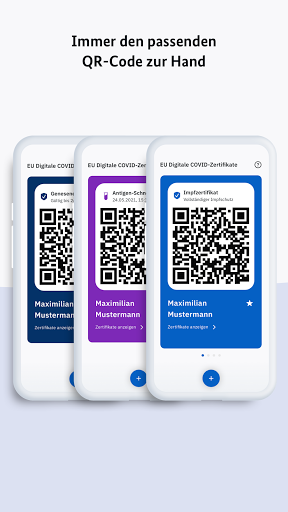
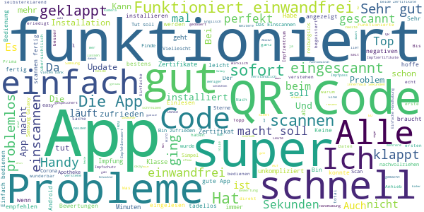
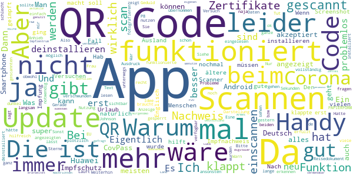

# CovPass
App version ``1.28.4``

Analyzed with [covid-apps-observer](http://github.com/covid-apps-observer) project, version ``0.1``

## App overview
| | |
|-------------------------|-------------------------| 
| **Name**&nbsp;&nbsp;&nbsp;&nbsp;&nbsp;&nbsp;&nbsp;&nbsp;&nbsp;&nbsp;&nbsp;&nbsp;&nbsp;&nbsp;&nbsp;&nbsp;&nbsp;&nbsp;&nbsp;&nbsp;&nbsp;&nbsp;&nbsp;&nbsp;&nbsp;&nbsp;&nbsp;&nbsp;&nbsp;&nbsp;&nbsp;&nbsp;&nbsp;&nbsp;&nbsp;&nbsp;&nbsp;&nbsp;&nbsp;&nbsp;  | CovPass |
| **Unique identifier** | de.rki.covpass.app |
| **Link to Google Play** | [https://play.google.com/store/apps/details?id=de.rki.covpass.app](https://play.google.com/store/apps/details?id=de.rki.covpass.app) |
| **Summary**  | Weisen Sie Ihre Impfung, Ihre Genesung oder Ihr negatives Testergebnis nach. |
| **Privacy policy** | [https://www.digitaler-impfnachweis-app.de/webviews/client-app/privacy/](https://www.digitaler-impfnachweis-app.de/webviews/client-app/privacy/) |
| **Latest version** | 1.28.4 |
| **Last update** | 2021-07-12 12:51:28 |
| **Recent changes** | Mit diesem Release wurde mehrere Bugs gefixt und Hinweise zur sicheren Nutzung der App ergänzt.  |
| **Installs**  | 5.000.000+ |
| **Category** | Gesundheit & Fitness |
| **First release** | 09.06.2021 |
| **Size**  | 13M |
| **Supported Android version**  | 6.0 oder höher |

### Description
> Das Robert Koch-Institut (RKI) als zentrale Einrichtung des Bundes im Bereich der Öffentlichen Gesundheit und als nationales Public-Health-Institut veröffentlicht die CovPass-App für die deutsche Bundesregierung. Mit der App lassen sich die EU Digitalen COVID Zertifikate direkt auf dem Smart-phone speichern. Wer sie nutzt, kann seinen Impfschutz, seine Genesung oder sein negatives Testergebnis schnell, sicher und digital nachweisen. Mit der App können auch die EU Digitalen COVID Zertifikate anderer Personen (zum Beispiel Familienangehörige) auf dem Smartphone nachgewiesen werden. Die Nutzerinnen und Nutzer der App entscheiden, wann und wem sie ihre Informationen und Daten vorzeigen.
 Die CovPass-App ist ein kostenloses Angebot des Robert Koch-Instituts.
 WIE DIE APP FUNKTIONIERT
 Der Nachweis über die Corona-Impfungen, über die Genesung von der Corona-Infektion oder über ein negatives Corona-Testergebnis ist die zentrale Funktion der CovPass-App. Wann immer Nutze-rinnen und Nutzer ihren Corona-Status nachweisen, werden nur die für die Überprüfung notwendigen Informationen und Daten per QR-Code angezeigt. 
 Der QR-Code gibt Auskunft über den Status eines Impf-, Test- oder Genesenenzertifikats. Zur ein-deutigen Identifikation werden zudem der Name und das Geburtsdatum bei einer Überprüfung an-gezeigt. Die App übermittelt zu keinem Zeitpunkt personenbezogene Informationen und Daten.  
 Das EU Digitale COVID Zertifikat kann auch für andere Personen (zum Beispiel Familienangehörige) auf dem Smartphone abgelegt werden. Anschließend wird der aktuelle QR-Code im Startbildschirm der App angezeigt. Dieser kann bei Bedarf vorgezeigt werden.
 Corona-Impfungen werden auf Wunsch mit dem EU Digitalen COVID Impfzertifikat bescheinigt. Das Impfzertifikat wird nach der Impfung vom medizinischen Personal erstellt. Es enthält einen QR-Code, der mit der App gescannt werden kann. Dazu ist die Kamera des Smartphones über den QR-Code zu halten. Die Impfung wird direkt auf das Smartphone geladen. 
 Negative Corona-Tests werden mit dem EU Digitalen COVID Testzertifikat bescheinigt. Das Testzertifikat wird von der Apotheke, von der Arztpraxis oder von speziellen Testzentren erstellt. Dieses enthält einen QR-Code, der mit der App gescannt werden kann. Das negative Testergebnis wird an-schließend auf dem Smartphone gespeichert.
 Genesungen von der Corona-Infektion werden mit dem EU Digitalen COVID Genesenenzertifikat bescheinigt. Das Genesenenzertifikat erhalten Sie nach überstandener Corona-Erkrankung von Ihrer Hausärztin oder Ihrem Hausarzt. Es enthält einen QR-Code, der mit der App gescannt werden kann. Die Genesung wird anschließend auf dem Smartphone dokumentiert. 
 Die Daten des EU Digitalen COVID Zertifikats sind lokal auf dem Smartphone gespeichert. Nur die Nutzerinnen und Nutzer entscheiden, wann und wem sie die Informationen und Daten vorzeigen.
 WIE DIE DATEN SICHER BLEIBEN
 Der Datenschutz bleibt über die gesamte Nutzungsdauer gewahrt. 
 •	Keine Anmeldung: Es ist keine Registrierung mit einer E-Mail-Adresse notwendig.
 •	Lokale Datenspeicherung: Ihre vollständigen Daten sind nur auf Ihrem Smartphone gespeichert.
 •	Datensparsamkeit: Der QR-Code wird mit dem in der EU abgestimmten minimalen Datenumfang angezeigt. Nach der Prüfung des QR-Codes werden nur der Status des Zertifikats, der Name und das Geburtsdatum angezeigt.  
 •	Kryptografische Sicherheit: Der QR-Code ist mit einer starken Signatur geschützt und kann nicht gefälscht werden.

### User interface
The developers of the app provide the following screenshots in the Google play store.
| | | |
|:-------------------------:|:-------------------------:|:-------------------------:|
 |   |   |   | 
 |   |   |   | 
 |   |   |   | 
 |  

## Development team
In the following we report the main information provided by the development team in the Google play store.

| | |
|-------------------------|-------------------------|
| **Developer**  | Robert Koch-Institut |
| **Website**  | [https://www.digitaler-impfnachweis-app.de/kontakt/](https://www.digitaler-impfnachweis-app.de/kontakt/) |
| **Email** | support@covpass-app.de |
| **Physical address**  | [Robert Koch-Institut Nordufer 20 13353 Berlin](https://www.google.com/maps/search/Robert%20Koch-Institut%20Nordufer%2020%2013353%20Berlin) (Google Maps) |
| **Other developed apps**  | [https://play.google.com/store/apps/developer?id=Robert+Koch-Institut](https://play.google.com/store/apps/developer?id=Robert+Koch-Institut) |

## Android support

| | |
|-------------------------|-------------------------|
| **Declared target Android version**  | - |
| **Effective target Android version**  | - |
| **Minimum supported Android version**  | Marshmallow, version 6.0 (API level 23) |
| **Maximum target Android version**  | - |

The larger the difference between the minimum and maximum supported Android versions, the better. A larger difference means a wider audience. For example, old phones have a very low Android version, so a high minimum supported Android version means that the app cannot be used by users with old phones, thus leading to accessibility problems. 

## Requested permissions

In the following we report the complete list of the permissions requested by the app. 

| **Permission** | **Protection level** | **Description** | 
|-------------------------|-------------------------|-------------------------|
 **android.permission ACCESS_NETWORK_STATE** | Normal | Allows applications to access information about networks. 
 **android.permission CAMERA** | :warning:**Dangerous** | Required to be able to access the camera device. 
 **android.permission FOREGROUND_SERVICE** | Normal | Allows a regular application to use Service.startForeground. 
 **android.permission INTERNET** | Normal | Allows applications to open network sockets. 
 **android.permission RECEIVE_BOOT_COMPLETED** | Normal | Allows an application to receive the Intent.ACTION_BOOT_COMPLETED that is broadcast after the system finishes booting. 
 **android.permission WAKE_LOCK** | Normal | Allows using PowerManager WakeLocks to keep processor from sleeping or screen from dimming. 

## Mentioned servers

| **Server** | **Registrant** | **Registrant country** | **Creation date** | 
|-------------------------|-------------------------|-------------------------|-------------------------|
 | europa.eu | - | - | - |
 | snomed.info | IHTSDO | GB | 2001-09-13 05:40:58 |
 | loinc.org | Contact Privacy Inc. Customer 124813267 | :canada: CA | 2000-01-14 16:04:24 |

## Security analysis 

Below we report the main security warnings raised by our execution of the [Androwarn](https://github.com/maaaaz/androwarn) security analysis tool.

**Connection interfaces exfiltration**
> - This application reads details about the currently active data network 
> - This application tries to find out if the currently active data network is metered 

**Suspicious connection establishment**
> - This application opens a Socket and connects it to the remote address ' returned no addresses for  ; port is out of range' on the 'N/A' port  
> - This application opens a Socket and connects it to the remote address '' on the 'N/A' port  
> - This application opens a Socket and connects it to the remote address 'Ljava/lang/StringBuilder;->toString()Ljava/lang/String;' on the 'N/A' port  
> - This application opens a Socket and connects it to the remote address 'Ljava/net/Proxy;->type()Ljava/net/Proxy$Type;' on the 'N/A' port  
> - This application opens a Socket and connects it to the remote address 'Method sendUrgentData() is not supported.' on the 'N/A' port  
> - This application opens a Socket and connects it to the remote address 'Method setHandshakeTimeout() is not supported.' on the 'N/A' port  
> - This application opens a Socket and connects it to the remote address 'Method setOOBInline() is not supported.' on the 'N/A' port  
> - This application opens a Socket and connects it to the remote address 'Method setSoWriteTimeout() is not supported.' on the 'N/A' port  
> - This application opens a Socket and connects it to the remote address 'Socket closed' on the 'N/A' port  
> - This application opens a Socket and connects it to the remote address 'Socket is closed' on the 'N/A' port  
> - This application opens a Socket and connects it to the remote address 'Socket is closed.' on the 'N/A' port  
> - This application opens a Socket and connects it to the remote address 'Socket is not connected.' on the 'N/A' port  
> - This application opens a Socket and connects it to the remote address 'socket is closed' on the 'N/A' port  
> - This application opens a Socket and connects it to the remote address 'timeout' on the 'N/A' port  

**Code execution**
> - This application loads a native library: 'conscrypt_jni' 

## User ratings and reviews

Below we provide information about how end users are reacting to the app in terms of ratings and reviews in the Google Play store.

### Ratings

The CovPass app has been installed by more than **5000000** times. At this time, **8123** rated the app and its average score is **3.7261775**. Below we show the distribution of the ratings across the usual star-based rating of Google Play

:star::star::star::star::star:: 4610

:star::star::star::star:: 836

:star::star::star:: 453

:star::star:: 293

:star:: 1931

### Reviews 

#### 5-star reviews

> okay  :date: __2021-07-23 21:11:58__

> Sehr gut!  :date: __2021-07-23 19:55:36__

> Android 11: Installation und Zertifikate per QR-Codes einlesen lief schnell und problemlos.  :date: __2021-07-23 19:15:19__

> Sehr gut. Eingescannt und wird sofort alles angezeigt.tut was es soll :))  :date: __2021-07-23 18:57:47__

> Eine schöne Erleichterung  :date: __2021-07-23 17:56:44__

> Sehr schnell auf das Handy aufgespielt.  :date: __2021-07-23 17:37:12__

> QR-Code: Einscannen hat bei mir zuerst überhaupt nicht geklappt. Irgendwann habe ich den QR Code von der 1. Impfung genommen, der ging sofort und danach ging auch der QR Code von der 2. Impfung.  :date: __2021-07-23 16:40:16__

> Einfache Handhabung. App öffnen und der QR Code wird angezeigt.  :date: __2021-07-23 15:22:57__

> In Ordnung  :date: __2021-07-23 14:49:00__

> YES ALMOST MASS WE HELP INFORMATIO WORLD THANK YOU 🌎🌐🌏🇩🇪🇩🇪🇩🇪🇺🇸🇺🇸🇺🇸🇺🇸🇺🇸❤❤❤👍👍  :date: __2021-07-23 14:17:16__

#### 4-star reviews

> hat beim 2. Versuch geklappt!  :date: __2021-07-23 12:16:54__

> So an sich eigentlich eine gute App, nur das Scannen erwies sich schwer. Hier glaube ich aber, lag es bei mir an der Druckqualität des Codes, von daher halb so wild. Ich habe letztendlich den QR-Code übrr die Luca-App gescannt (hat super funktioniert), einen Screenshot gemacht und dann über den PC das Bild des klaren QR-Codes aufgerufen. Daraufhin funktionierte das Scannen auch super schnell und unkompliziert. Vondaher meiner Meinung nach wirklich akzeptabel. :-)  :date: __2021-07-23 12:02:42__

> Die App macht das was sie machen soll. Aber in ganz Europa (ich glaube sogar auf der ganzen Welt} wird das als "Green Pass" bezeichnet und die App Farbe ist auch grün. Nur in Deutschland ein helles blau. Sollte man das nicht ändern?  :date: __2021-07-23 11:08:46__

> Bin am testen.  :date: __2021-07-23 07:24:42__

> Diese App ist soweit ganz gut. Aber sie hat einen Fehler. Sie kann den QR-Code nur aus einer einzigen Richtung scannen. Damit is sie eigentlich nicht konform mit dem QR Standard.  :date: __2021-07-22 20:52:23__

> Ein Widget wäre angebracht, um schnellzugriff zu erhalten!  :date: __2021-07-22 19:46:33__

> Scan hat einwandfrei geklappt. Schade, dass man keine weitere Person verwalten kann.  :date: __2021-07-22 19:04:20__

> Hallo. Ich habe mir die CovPass App am 21.7.21 runtergeladen. Habe eine Weile hin und her überlegt diese App oder Corona Warn App. Lese mir immer die letzten 4 Rezensionen durch. Bei mir ging alles 1a. Habe ein Samsung Galaxy A42 5g. Den QR-Code von dem A4 Zettel aus der Apotheke gescannt. Hatte es mir bischen komplizierter vorgestellt. Ist doch praktischer, den Impfausweis auf dem Handy zu haben. Handy hat man immer dabei.  :date: __2021-07-22 13:34:03__

> Muss nicht bei beide Zertifikate grüne Haken sein?  :date: __2021-07-22 11:49:42__

> Schade das die APP nur in Deutsch ist. Ich finde das die Weltsprachen Englisch und Französisch fehlen.  :date: __2021-07-22 08:30:58__

#### 3-star reviews

> Ein Nachweis vom Impfzentrum wird nicht auf einem Huawei P8 akzeptiert. Benutze ich die App auf einem anderen P20 Handy klappt alles.  :date: __2021-07-23 17:42:12__

> Man hat eine App, die wir leider nur einmal nutzen konnten. Nirgendwo wird sie verwendet bzw. kann sie genutzt werden. 2 Mal wurden wir nach der Luka App gefragt. Was soll ein digitaler Corona Nachweis, wenn er im eigenen Land nicht verwendbar ist. Weiterhin Zettel ausfüllen. Armes Deutschland. 🙄  :date: __2021-07-23 11:00:35__

> Läuft genauso super, wie alle Corona Maßnahmen, die man mit Hilfe der EU erarbeitet hat. Siehe aktuelle Nachrichten, dass aufgrund von Sicherheitsmängeln, momentan keine digitalen Zertifikate mehr ausgestellt werden können. Hatte also gestern vormittag noch Glück. Falls die jetzt aber während meines Urlaubs auf die Idee kommen sollten, dass dieser Nachweis nicht mehr gültig wäre, dann gibt's wohl schöne Schadensersatzforderungen.  :date: __2021-07-22 18:00:50__

> Das Scannen funktionierte bei mir anfangs auch nicht, aber durch die Einstellung des Energiesparmodus auf "Keine Beschränkungen" und somit "Energiesparen schränkt App-Aktivitäten nicht ein" konnte ich es dann doch noch innerhalb von wenigen Sekunden einscannen.  :date: __2021-07-22 12:03:37__

> Tut was er soll wenn man beide Impfungen hochgeladen hat. Bei Johnson&Johnson unnötig, da auch nach den 14 Tagen weiterhin der Status unvollständiger Impfschutz angezeigt wird.  :date: __2021-07-22 09:50:59__

> 3 öU2d x de c na  :date: __2021-07-22 09:31:38__

> Macht was sie soll, aber nicht mehr... Weshalb ist die app for Screenshots gesperrt? Erfahrungsgemäß wollen die meisten hotels o.ä. eine Email mit dem qr Code, was ohne Screenshotfunktion sehr umständlich ist.  :date: __2021-07-21 22:42:18__

> Funktioniert alles. Nur das QR-Code erkennen geht etwas schwierig! 10 Versuche minimum.  :date: __2021-07-21 21:57:57__

> Blockiert unter Android 9 die Tastatur der Enpass Passwort App. Daher habe ich CovPass wieder deinstalliert.  :date: __2021-07-21 15:18:36__

> Hat die App wirklich eine scan Funktion? Bei mir, huawei p8 jedenfalls nicht. Aber nach mehrstündigen Pause und neuem Versuch.  :date: __2021-07-21 14:09:44__

#### 2-star reviews

> Liess sich nicht herunterladen.  :date: __2021-07-23 18:17:56__

> AN Alle der Code geht nicht aufgrund des Papiers und der Druckqualität. Ladet euch die Luca app herunter dort geht der scan, dann per Screenshot an anderes Gerät wie Handy oder PC senden und dort abscannen... Dann geht es direkt!! Bitte an alle teilen  :date: __2021-07-23 17:08:28__

> Hatte die App herunter geladen und alles war ok. Dokumente haben sich einfach scannen lassen. Von heute auf morgen hat die App nicht mehr funktioniert. Nach dem Öffnen war der Bildschirm bis auf die blaue Kopfzeile nur noch weiss und man konnte nichts mehr machen. Habe sie deinstalliert  :date: __2021-07-23 17:04:21__

> Bei mir hat nur die luca app die Codes von der Apotheke gescannt. Covpass und coronawarn keine Chance. Durch einen Tipp bin ich drauf gekommen, den Code aus luca zu screenshoten und auf ein anderes Gerät zu schicken. Von dort aus hab ichs dann mit Covpass und coronawarn gescannt, dann hats geklappt. 2 Sterne weils nicht so umständlich sein sollte, aber im Endeffekt jetzt doch funktioniert!  :date: __2021-07-23 14:40:36__

> Nur Deutsch als Spracheinstellung. Englisch wird seit Wochen angekündigt (FAQ) aber nichts passiert. Folgt das RKI hier vielleicht dem Wunsch der Bundesregierung für uns alle Auslandsreisen möglichst schwer zu machen... ein Schelm wer böses hierbei denkt...  :date: __2021-07-23 09:50:20__

> Impzertifikate ließen sich ohne Probleme einlesen. Ich finde nicht gut, dass die Bemerkung "vollständiger Impfschutz" in Minischrift versteckt ist. Sollte Groß und Grün sein! Unmöglich ist, dass man nicht auf die wichtigsten Sprachen umschalten kann. Macht das Reisen beschwerlich.  :date: __2021-07-22 20:34:14__

> Habe die App installiert ohne Probleme hab Huawei P30 wollte den QR-Code scannen beim 1. Blat hat es doch es hat lange gedauert beim 2. Blat auf Teufel komm raus es will einfach nicht gehen ich bin fertig mit meinem Latein man weiß einfach nicht genau wie man das QR-Code stellen soll es gibt kein Zeichen ich weiß gar nicht mehr wie ich das erste Mal es geschafft habe mann bewegt links rechts oben unten doch es tut sich nichts die Frage ist warum hat es beim 1. funktioniert um beim 2. nicht  :date: __2021-07-22 18:28:17__

> Impfung für Genesene ist erst nach zwei Wochen gültig. Sollte eigentlich sofort gültig sein laut RKI  :date: __2021-07-22 18:14:53__

> Aus irgendwelchen Gründen konnte die App den QR-Code nicht vom Blatt abscannen. Weder auf meinem S7 noch auf dem S9 meines Freundes. Ich habe dann den Code über die Luca-App gescannt, einen Screenshot gemacht und diesen dann auf dem PC in voller Helligkeit angezeigt. Darüber konnte er dann gescannt werden. Es kann aber nicht sein, dass die App es selbst nicht auf die Reihe bekommt, vom Blatt zu scannen, wenn man nur dieses Blatt zur Verfügung gestellt bekommt.  :date: __2021-07-22 16:45:15__

> Leider funktioniert der QR Code Scanner nicht so wie er soll es fehlt schlicht ein Feld Zum reinhalten des QR Codes. Man sitzt fast 10 Minuten oder länger da um die Codes zu scannen sorry aber das muss echt verbessert werden  :date: __2021-07-22 15:33:12__

#### 1-star reviews

> Konnte den ersten qr code nur sehr sehr schwer scannen (60 sek) . Viel zu dunkel . Lag an der App. Den Zweien hat die App nicht mehr verarbeitet. Huawei p30pro  :date: __2021-07-23 19:28:56__

> Leider kann Mein Xiaomi Note 11 Pro nichts mit der App anfangen weder funktioniert der QR Code Reader noch sonst etwas, bitte behebt den Fehler in der App.  :date: __2021-07-23 18:08:01__

> Schmutz app sinnlos  :date: __2021-07-23 16:44:43__

> Die App erkennt die QR-Codes nicht.  :date: __2021-07-23 16:21:48__

> Meine Kamera kann das Zertifikat einfach nicht erkennen. Egal was ich mache und wie ich mein Smartphone halte , der QR Code wird nicht gelesen. Mein Android ist 7.0 Was mache ich falsch ?  :date: __2021-07-23 16:03:59__

> Ich würde auch 0 Sterne geben.  :date: __2021-07-23 15:16:29__

> Es war zu erwarten das nichts geht. 3 Menschen wurden gleichzeitig zum 2ten mal geimpft. Person 1 Status unvollständig nur eine Impfung Person 2 OR Code falsch Person 3 hat funktioniert Ganz großes Kino  :date: __2021-07-23 13:37:33__

> Plötzlich funktioniert die App nicht mehr bzw meine Impfungen werden nicht mehr angezeigt  :date: __2021-07-23 12:58:04__

> Der Scan funktioniert nicht.  :date: __2021-07-23 12:50:44__

> Scannt Code nicht  :date: __2021-07-23 12:26:44__

