# CovPass
App version ``1.28.7``

Analyzed with [covid-apps-observer](http://github.com/covid-apps-observer) project, version ``0.1``

## App overview
| | |
|-------------------------|-------------------------| 
| **Name**&nbsp;&nbsp;&nbsp;&nbsp;&nbsp;&nbsp;&nbsp;&nbsp;&nbsp;&nbsp;&nbsp;&nbsp;&nbsp;&nbsp;&nbsp;&nbsp;&nbsp;&nbsp;&nbsp;&nbsp;&nbsp;&nbsp;&nbsp;&nbsp;&nbsp;&nbsp;&nbsp;&nbsp;&nbsp;&nbsp;&nbsp;&nbsp;&nbsp;&nbsp;&nbsp;&nbsp;&nbsp;&nbsp;&nbsp;&nbsp;  | CovPass |
| **Unique identifier** | de.rki.covpass.app |
| **Link to Google Play** | [https://play.google.com/store/apps/details?id=de.rki.covpass.app](https://play.google.com/store/apps/details?id=de.rki.covpass.app) |
| **Summary**  | Weisen Sie Ihre Impfung, Ihre Genesung oder Ihr negatives Testergebnis nach. |
| **Privacy policy** | [https://www.digitaler-impfnachweis-app.de/webviews/client-app/privacy/](https://www.digitaler-impfnachweis-app.de/webviews/client-app/privacy/) |
| **Latest version** | 1.28.7 |
| **Last update** | 2021-07-29 14:49:22 |
| **Recent changes** | Mit dieser Version werden weitere bekannte Fehler behoben. |
| **Installs**  | 5.000.000+ |
| **Category** | Gesundheit & Fitness |
| **First release** | 09.06.2021 |
| **Size**  | 13M |
| **Supported Android version**  | 6.0 oder höher |

### Description
> Das Robert Koch-Institut (RKI) als zentrale Einrichtung des Bundes im Bereich der Öffentlichen Gesundheit und als nationales Public-Health-Institut veröffentlicht die CovPass-App für die deutsche Bundesregierung. Mit der App lassen sich die Digitalen COVID-Zertifikate der EU direkt auf dem Smartphone speichern. Wer sie nutzt, kann seinen Impfschutz, seine Genesung oder sein negatives Testergebnis schnell, sicher und digital nachweisen. Mit der App können auch die Digitalen COVID-Zertifikate der EU anderer Personen (zum Beispiel Familienangehörige) auf dem Smartphone nachgewiesen werden. Die Nutzerinnen und Nutzer der App entscheiden, wann und wem sie ihre Informationen und Daten vorzeigen.
 Die CovPass-App ist ein kostenloses Angebot des Robert Koch-Instituts.
 WIE DIE APP FUNKTIONIERT
 Der Nachweis über die Corona-Impfungen, über die Genesung von der Corona-Infektion oder über ein negatives Corona-Testergebnis ist die zentrale Funktion der CovPass-App. Wann immer Nutzerinnen und Nutzer ihren Corona-Status nachweisen, werden nur die für die Überprüfung notwendigen Informationen und Daten per QR-Code angezeigt. 
 Der QR-Code gibt Auskunft über den Status eines Impf-, Test- oder Genesenenzertifikats. Zur eindeutigen Identifikation werden zudem der Name und das Geburtsdatum bei einer Überprüfung angezeigt. Die App übermittelt zu keinem Zeitpunkt personenbezogene Informationen und Daten.  
 Das Digitale COVID-Zertifikat der EU kann auch für andere Personen (zum Beispiel Familienangehörige) auf dem Smartphone abgelegt werden. Anschließend wird der aktuelle QR-Code im Startbildschirm der App angezeigt. Dieser kann bei Bedarf vorgezeigt werden.
 Corona-Impfungen werden auf Wunsch mit dem Digitalen COVID-Zertifikat der EU bescheinigt. Das Impfzertifikat wird nach der Impfung vom medizinischen Personal erstellt. Es enthält einen QR-Code, der mit der App gescannt werden kann. Dazu ist die Kamera des Smartphones über den QR-Code zu halten. Die Impfung wird direkt auf das Smartphone geladen. 
 Negative Corona-Tests werden mit dem Digitalen COVID-Zertifikat der EU bescheinigt. Das Testzertifikat wird von der Apotheke, von der Arztpraxis oder von speziellen Testzentren erstellt. Dieses enthält einen QR-Code, der mit der App gescannt werden kann. Das negative Testergebnis wird anschließend auf dem Smartphone gespeichert.
 Genesungen von der Corona-Infektion werden mit dem Digitalen COVID-Zertifikat der EU bescheinigt. Das Genesenenzertifikat erhalten Sie nach überstandener Corona-Erkrankung von Ihrer Hausärztin oder Ihrem Hausarzt. Es enthält einen QR-Code, der mit der App gescannt werden kann. Die Genesung wird anschließend auf dem Smartphone dokumentiert. 
 Die Daten des Digitalen COVID-Zertifikat der EU sind lokal auf dem Smartphone gespeichert. Nur die Nutzerinnen und Nutzer entscheiden, wann und wem sie die Informationen und Daten vorzeigen.
 WIE DIE DATEN SICHER BLEIBEN
 Der Datenschutz bleibt über die gesamte Nutzungsdauer gewahrt. 
 •	Keine Anmeldung: Es ist keine Registrierung mit einer E-Mail-Adresse notwendig.
 •	Lokale Datenspeicherung: Ihre vollständigen Daten sind nur auf Ihrem Smartphone gespeichert.
 •	Datensparsamkeit: Der QR-Code wird mit dem in der EU abgestimmten minimalen Datenumfang angezeigt. Nach der Prüfung des QR-Codes werden nur der Status des Zertifikats, der Name und das Geburtsdatum angezeigt.  
 •	Kryptografische Sicherheit: Der QR-Code ist mit einer elektronische Signatur geschützt und kann nicht gefälscht werden.

### User interface
The developers of the app provide the following screenshots in the Google play store.
| | | |
|:-------------------------:|:-------------------------:|:-------------------------:|
 | 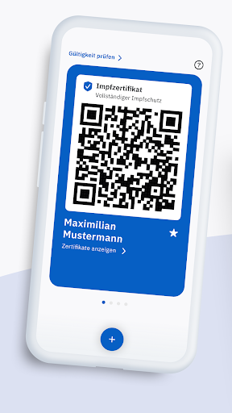  | 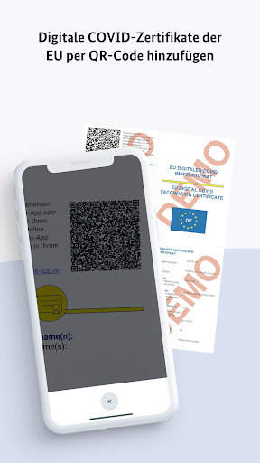  | 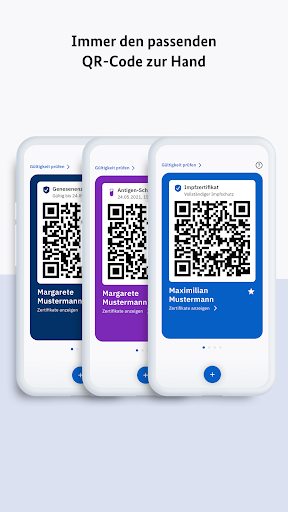  | 
 | 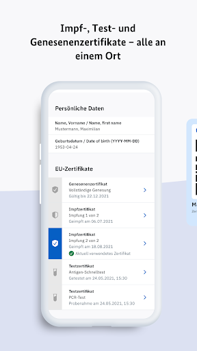  | 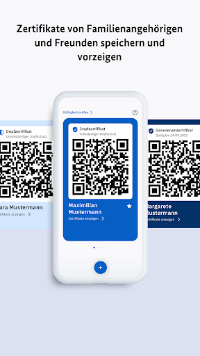  | 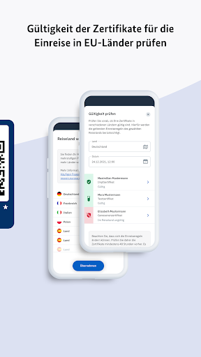  | 
 |   |   |   | 
 |   |   |   | 

## Development team
In the following we report the main information provided by the development team in the Google play store.

| | |
|-------------------------|-------------------------|
| **Developer**  | Robert Koch-Institut |
| **Website**  | [https://www.digitaler-impfnachweis-app.de/kontakt/](https://www.digitaler-impfnachweis-app.de/kontakt/) |
| **Email** | support@covpass-app.de |
| **Physical address**  | [Robert Koch-Institut Nordufer 20 13353 Berlin](https://www.google.com/maps/search/Robert%20Koch-Institut%20Nordufer%2020%2013353%20Berlin) (Google Maps) |
| **Other developed apps**  | [https://play.google.com/store/apps/developer?id=Robert+Koch-Institut](https://play.google.com/store/apps/developer?id=Robert+Koch-Institut) |

## Android support

| | |
|-------------------------|-------------------------|
| **Declared target Android version**  | - |
| **Effective target Android version**  | - |
| **Minimum supported Android version**  | Marshmallow, version 6.0 (API level 23) |
| **Maximum target Android version**  | - |

The larger the difference between the minimum and maximum supported Android versions, the better. A larger difference means a wider audience. For example, old phones have a very low Android version, so a high minimum supported Android version means that the app cannot be used by users with old phones, thus leading to accessibility problems. 

## Requested permissions

In the following we report the complete list of the permissions requested by the app. 

| **Permission** | **Protection level** | **Description** | 
|-------------------------|-------------------------|-------------------------|
 **android.permission ACCESS_NETWORK_STATE** | Normal | Allows applications to access information about networks. 
 **android.permission CAMERA** | :warning:**Dangerous** | Required to be able to access the camera device. 
 **android.permission FOREGROUND_SERVICE** | Normal | Allows a regular application to use Service.startForeground. 
 **android.permission INTERNET** | Normal | Allows applications to open network sockets. 
 **android.permission RECEIVE_BOOT_COMPLETED** | Normal | Allows an application to receive the Intent.ACTION_BOOT_COMPLETED that is broadcast after the system finishes booting. 
 **android.permission WAKE_LOCK** | Normal | Allows using PowerManager WakeLocks to keep processor from sleeping or screen from dimming. 

## Mentioned servers

| **Server** | **Registrant** | **Registrant country** | **Creation date** | 
|-------------------------|-------------------------|-------------------------|-------------------------|
 | europa.eu | - | - | - |
 | snomed.info | IHTSDO | GB | 2001-09-13 05:40:58 |
 | loinc.org | Contact Privacy Inc. Customer 124813267 | :canada: CA | 2000-01-14 16:04:24 |

## Security analysis 

Below we report the main security warnings raised by our execution of the [Androwarn](https://github.com/maaaaz/androwarn) security analysis tool.

**Connection interfaces exfiltration**
> - This application reads details about the currently active data network 
> - This application tries to find out if the currently active data network is metered 

**Suspicious connection establishment**
> - This application opens a Socket and connects it to the remote address ' returned no addresses for  ; port is out of range' on the 'N/A' port  
> - This application opens a Socket and connects it to the remote address '' on the 'N/A' port  
> - This application opens a Socket and connects it to the remote address 'Ljava/lang/StringBuilder;->toString()Ljava/lang/String;' on the 'N/A' port  
> - This application opens a Socket and connects it to the remote address 'Ljava/net/Proxy;->type()Ljava/net/Proxy$Type;' on the 'N/A' port  
> - This application opens a Socket and connects it to the remote address 'Method sendUrgentData() is not supported.' on the 'N/A' port  
> - This application opens a Socket and connects it to the remote address 'Method setHandshakeTimeout() is not supported.' on the 'N/A' port  
> - This application opens a Socket and connects it to the remote address 'Method setOOBInline() is not supported.' on the 'N/A' port  
> - This application opens a Socket and connects it to the remote address 'Method setSoWriteTimeout() is not supported.' on the 'N/A' port  
> - This application opens a Socket and connects it to the remote address 'Socket closed' on the 'N/A' port  
> - This application opens a Socket and connects it to the remote address 'Socket is closed' on the 'N/A' port  
> - This application opens a Socket and connects it to the remote address 'Socket is closed.' on the 'N/A' port  
> - This application opens a Socket and connects it to the remote address 'Socket is not connected.' on the 'N/A' port  
> - This application opens a Socket and connects it to the remote address 'socket is closed' on the 'N/A' port  
> - This application opens a Socket and connects it to the remote address 'timeout' on the 'N/A' port  

**Code execution**
> - This application loads a native library: 'conscrypt_jni' 

## User ratings and reviews

Below we provide information about how end users are reacting to the app in terms of ratings and reviews in the Google Play store.

### Ratings

The CovPass app has been installed by more than **5000000** times. At this time, **9494** rated the app and its average score is **3.715534**. Below we show the distribution of the ratings across the usual star-based rating of Google Play

:star::star::star::star::star:: 5357

:star::star::star::star:: 1041

:star::star::star:: 433

:star::star:: 368

:star:: 2295

### Reviews 

#### 5-star reviews

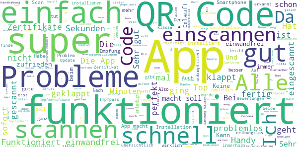

> Scannen funktioniert ohne Probleme. Jetzt mal schauen ob ich se brauchen kann.  :date: __2021-07-30 16:52:21__

> Einfache Bedienung, top  :date: __2021-07-30 16:49:48__

> Tut was sie soll. 👍  :date: __2021-07-30 15:45:06__

> Download hat super geklappt! Code fotografieren hielt genau, ging aber besser als bei der Corona App. Keine Probleme!  :date: __2021-07-30 15:27:39__

> Tut was sie soll  :date: __2021-07-30 15:26:55__

> Auf dem S 20 plus, alles perfekt auch nach apdates. Alles OK..!  :date: __2021-07-30 15:14:33__

> super zum reisen!  :date: __2021-07-30 15:07:43__

> Tolle App 👍Hat auf unseren Samsung Handys (Android 7 bzw. 11) sofort funktioniert. Kann ich echt empfehlen.  :date: __2021-07-30 14:13:14__

> Okay. Kann man aber besser gestalten  :date: __2021-07-30 13:28:51__

> Also ich habe den QR-Code zuerst mit meinem I-Pad mini gescannt und von dort den Code mit dem Handy übernommen, es hat bei mir am Anfang mit dem Handy auch nicht geklappt, vielleicht sollten die Programmierer noch mal nachjustieren. Ein bisschen um die Ecke denken hilft manchmal weiter und nicht gleich aufgeben und negative Kommentare abgeben.  :date: __2021-07-30 13:22:56__

#### 4-star reviews

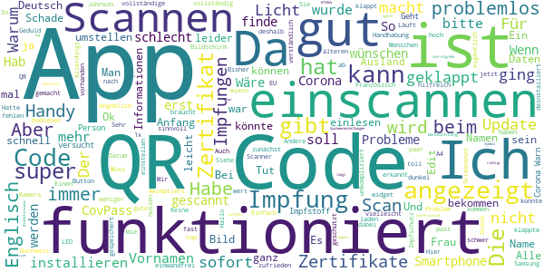

> Akzeptiert Zertifikat am Anfang nicht. Einen Tag später klappte es plötzlich.  :date: __2021-07-30 13:45:21__

> App ist super! Nur wird die App bei mir (Samsung S10e) nicht richtig angezeigt. Das Symbol Informationen liegt auf dem U von EU und mein Name wird nur vollständig angezeigt, wenn ich runterscrolle (ich habe einen 2. Vornamen). Die Schriftgröße und den Bildschirmzoom - aus den Systemeinstellungen - würde ich deshalb ungern wegen einer App umstellen :/  :date: __2021-07-30 13:40:44__

> Macht was sie soll. Nicht mehr und nicht weniger  :date: __2021-07-30 10:55:54__

> QR-Code wurde zunächst nicht erkannt. Tipp: Alle Systemupdates installieren, danach hat es geklappt. Der Scanner braucht viel Geduld, bis er den Code verarbeitet hat.  :date: __2021-07-30 10:15:26__

> Apps bitte auf sd.kart zum verschieben 22mb nehmen Speicher in Smartphone.  :date: __2021-07-30 10:05:50__

> Die App macht was sie soll, ich würde mir wünschen das ich mir eine Wunsch Reihenfolge der Zertifikate festlegen kann bzw. sortieren könnte.  :date: __2021-07-30 09:11:01__

> Scan etwas dunkel, sonst einwandfrei.  :date: __2021-07-29 15:46:09__

> Auch fuer Ungeübte leicht verständlich!  :date: __2021-07-29 13:57:20__

> Wäre nicht schlecht wenn man ein Bild vom Personalausweis noch einfügen könnte bei Unterlagen wenn man die Impfungen alle hat. Um nachzuweisen Obmann es auch ist der die vollständige Impfung hat und nicht jemand anderes.  :date: __2021-07-29 11:10:17__

> Bei gutem Licht ließen sich die Zertifikate dann doch einscannen.  :date: __2021-07-29 09:27:20__

#### 3-star reviews

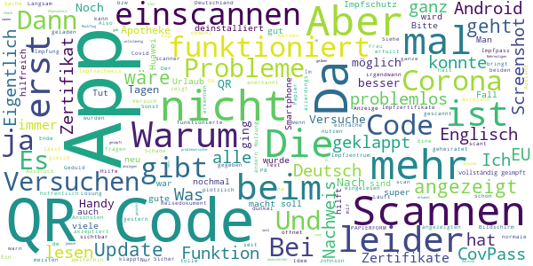

> Die App macht was es soll, jedoch gab es Probleme beim einscannen der Impfzertifikate. Nach Mehrmaligen Versuchen hat es irgendwann funktioniert. Viel problematischer ist die Abwesenheit der Funktion z. B. Die App auf Englisch umzustellen. Beim Rückflug am Check-In Schalter hat die Dame nicht erkannt ob ich vollständig geimpft bin oder nicht. (Konnte halt kein Deutsch). Ich habe dann meinen "analogen" gelben Impfpass gezückt und dann ging auch der Rest problemlos.  :date: __2021-07-30 09:13:11__

> Schade das man keine Adresse oder Namen ändern kann, zb wenn man zwischenzeitlich geheiratet hat oder umgezogen ist . Dann bringt das ganze ja nichts mehr . Und man muss wieder den impffausweis mit sich tragen .  :date: __2021-07-29 21:30:10__

> Ich kann meinen Qr-Code nicht scannen... Edit: normales Zimmerlicht war zu dunkel, erst als die Sonne draufgeschien hat, hat es geklappt... Bei der Corona-warn app hat es ohne Probleme geklappt...  :date: __2021-07-29 20:03:38__

> Es ist mal wieder ein deutsches Trauerspiel! Das negative Testergebnis lässt sich nicht in die offiziellen Covid-Apps einloggen, da der QR-Code nicht kompatibel ist! Notgedrungen wieder Zettelwirtschaft! (Nichtmal die Polizei ist vernünftig digital vernetzt in Deutschland, wie man kürzlich lesen konnte!) Was machen die deutschen Behörden da? Langsam wird mir Angst und Bange, hoffentlich nimmt das nicht irgendwann ein böses Ende!  :date: __2021-07-29 06:44:38__

> Eine einfache Chipkarte wird mir 1000x lieber als App!!!!!!  :date: __2021-07-28 21:11:25__

> Die app hat Probleme den QR Code gleich zu erkennen! Die Bundes App ist da besser.  :date: __2021-07-28 15:45:19__

> QR-code scannen brauchte mehrere Versuche. Hoffe mal App bewärt sich im Alltag  :date: __2021-07-28 15:24:14__

> Nix ist mit einscannen ohne ausreichende Flutlichtbeleuchtung des qr-codes  :date: __2021-07-27 18:04:10__

> Ich habe geheiratet, wo kann ich denn in der App meinen Nachnamen ändern?  :date: __2021-07-27 15:49:32__

> Auf Sony ZX1 Compakt wird der QR-Code, ohne ihn nach oben zu schieben, nicht vollständig angezeigt (unterer Rand verzerrt).  :date: __2021-07-27 08:56:41__

#### 2-star reviews

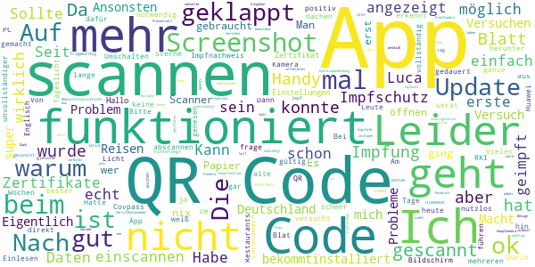

> Leider nicht benutzbar für mich, da meine Hauptkamera beschädigt ist. Präsentiert dann den nicht sehr hilfreichen Hinweis, immer den Ausdruck mit sich zu führen. Verstehe es hier nicht, weshalb man nicht das Umschalten auf die Frontkamera oder das manuelle Eingeben der Zertifikatsnummer zulässt. Ansonsten sieht die App gut aus, aber sehe dies als unnötigerweise unflexibles UX-Design.  :date: __2021-07-30 15:23:27__

> Super. Vielen Dank dass es sich nicht scannen lässt, toll gemacht die App  :date: __2021-07-30 15:13:47__

> Scannen nur bei Tageslicht und Sonne möglich - und das bei einer Hauptfunktion? 10 Jahre alte Apps können das besser. Rest (qr Code anzeigen), funktioniert.  :date: __2021-07-29 21:07:13__

> Leider kein Screenshot möglich, wobei es notwendig ist für Reisen ins Ausland etc.  :date: __2021-07-29 20:18:44__

> Ich frage mich, warum der grüne Impfpass in Deutschland blau ist.  :date: __2021-07-29 08:02:59__

> Gerade versucht einen screenshot zu machen um meinen Impfnachweis für die digitale Einreiseanmeldung hochzuladen. Screenshots bei geöffneter App zu machen ist verboten. Macht das leben damit unnötig schwer. Funktion ansonsten ok.  :date: __2021-07-29 00:04:02__

> Beim 2 ten Versuch hat es dann funktioniert !  :date: __2021-07-28 20:45:28__

> Also nach gefühlt 5h hat es endlich mal geklappt diese App soll nur einen Code Scannen und die Datenspeichern, und das bekommt die App mühsam hin. Das ganze war so ein Akt ich empfehle euch mal die ganze App zu überarbeiten weil so bekommen es ältere Leute nicht hin.  :date: __2021-07-28 20:19:10__

> Seit dem Update startet nicht mehr (white screen). Verlässlich ist anders... :-(  :date: __2021-07-28 17:43:34__

> Eigentlich eine nützliche App, aber: Habe sie nie einsetzen können. In 7 von 7 Restaurants/Cafes kannte man den Digitalen Impfausweis nicht, geschweige denn dass man sich damit verifizieren konnte. Jedes Lokal hatte eigene Registrierungsseiten. Die App kann dafür wenig, aber so ist das System als solches nutzlos. Wirklich schade.  :date: __2021-07-28 07:28:34__

#### 1-star reviews

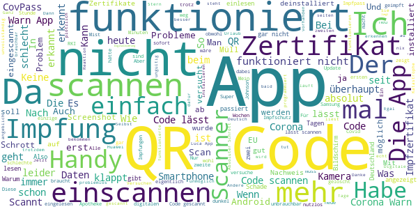

> App arbeitet fehlerhaft. Ist aktuell nicht in der Lage eine Auffrischungsimpfung als dritte hinzuzufügen! Beim Scannen der dritten Impfung wird als vollständigem Impfschutz plötzlich ein unvollständiger, der erst 14 Tage später gültig wird. Ganz schlecht für den Urlaub !!! Drittes Zertifikat aktuell lieber NICHT einscannen!  :date: __2021-07-30 16:51:26__

> Wofür braucht jemand eine App die nicht richtig funktioniert???? Ich bin geimpft (impfpass vorhanden). Seit 2 Wochen ist es nicht möglich mit dem App in Verbindung zu treten.  :date: __2021-07-30 16:05:24__

> Erzählt mir,der Code würde nicht echt sein. Kommt vom original Ausdruck. Was ein Schrott. 😠  :date: __2021-07-30 15:42:19__

> Diese App ist genau so unprofessionell wie das Verhalten von Behörden, Politik und EU während der Pandemie. Selbst QR Code scannen bereitet Probleme. Klar, wenn man bisher nur mit Faxgeräten umgehen musste...  :date: __2021-07-30 15:01:19__

> 10 Jahre alte QR-Scanner funktionieren besser als dieser Schmutz, einfach nur noch lächerlich wie rückständig wir in Sachen IT in Doofland sind und uns trotzdem ach so geil finden🤢🤢🤢  :date: __2021-07-30 13:21:29__

> Da mein QR code sich einfach nicht scenen lässt ist die App nicht brauchbar....  :date: __2021-07-30 12:24:20__

> Kann den QR-Code des Inpfzentrums nicht lesen. Daher ist die App nutzlos.  :date: __2021-07-30 11:26:43__

> Kann mein Impfzertifikat auch nach mehrfachen Versuchen nicht scannen. Die Corona-Warn-App erkannte es hingegen sofort.  :date: __2021-07-30 09:48:59__

> Update 3: Wieder eine neue Version OHNE Englisch Update 2: Immer noch nur auf Deutsch! Und jetzt will z. B. Italien verpflichtend alles auf Italienisch, Englisch oder Französisch. Und NEIN - Deutsch wird nicht akzeptiert . Update: Immer noch nur auf Deutsch! Traurig. Warum zeigt die App nur in Deutsch an??? Italien und andere Länder akzeptieren kein Deutsch! Wow - Deutschland (bezieht sich auf unsere regierenden Verantwortlichen) und digitale Transformation - 2 Welten prallen aufeinander ...  :date: __2021-07-30 09:43:38__

> Erkennt den Code nicht. Die Kamera beim scannen ist auch mega dunkel.  :date: __2021-07-30 07:23:44__

