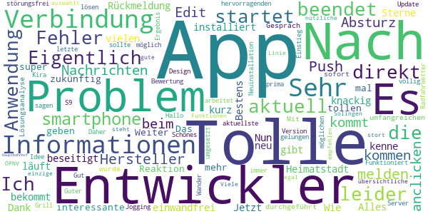
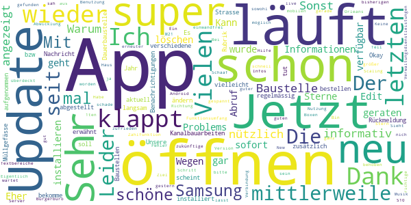
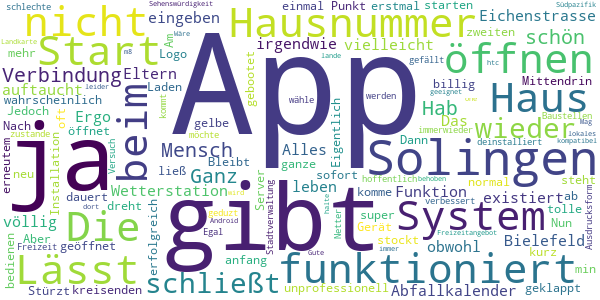
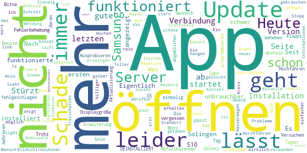

# Mensch, Solingen
App version ``2.2.17``

Analyzed with [covid-apps-observer](http://github.com/covid-apps-observer) project, version ``0.1``

## App overview
| | |
|-------------------------|-------------------------| 
| **Name**&nbsp;&nbsp;&nbsp;&nbsp;&nbsp;&nbsp;&nbsp;&nbsp;&nbsp;&nbsp;&nbsp;&nbsp;&nbsp;&nbsp;&nbsp;&nbsp;&nbsp;&nbsp;&nbsp;&nbsp;&nbsp;&nbsp;&nbsp;&nbsp;&nbsp;&nbsp;&nbsp;&nbsp;&nbsp;&nbsp;&nbsp;&nbsp;&nbsp;&nbsp;&nbsp;&nbsp;&nbsp;&nbsp;&nbsp;&nbsp;  | Mensch, Solingen |
| **Unique identifier** | de.solingen.solingenapp |
| **Link to Google Play** | [https://play.google.com/store/apps/details?id=de.solingen.solingenapp](https://play.google.com/store/apps/details?id=de.solingen.solingenapp) |
| **Summary**  | „Mensch, Solingen – Die offizielle App der Klingenstadt Solingen“ |
| **Privacy policy** | [https://www.solingen.de/de/inhalt/datenschutz/](https://www.solingen.de/de/inhalt/datenschutz/) |
| **Latest version** | 2.2.17 |
| **Last update** | 2020-12-15 11:36:01 |
| **Recent changes** | - Fehler, die zum Absturz führen, behoben - Fehler, die auf ausgewählten Android Geräten zu Startproblemen führen, abgefangen Vorab möchten wir uns zutiefst dafür entschuldigen, dass es in der letzten Zeit vermehrt zu Schwierigkeiten kam. Wir haben daraus gelernt und bedanken uns für eure Geduld und rege Mithilfe. Wir wünschen euch allen erholsame Feiertage und freuen uns, 2021 die App zusammen mit euch noch umfangreicher und besser zu machen! Bleibt gesund und bis bald :-) Euer SolingenApp-Team |
| **Installs**  | 1.000+ |
| **Category** | Reisen & Lokales |
| **First release** | 04.05.2020 |
| **Size**  | 18M |
| **Supported Android version**  | 8.0 oder höher |

### Description
> Die Klingenstadt Solingen präsentiert die Weiterentwicklung der ersten Version „Mensch, Solingen – Corona aktuell“ mit vielen innovativen Features, die das Nützliche mit dem Praktischen verbinden.
 Vorab: Neben den zahlreichen neuen Funktionen wirst du nach wie vor die Möglichkeit haben, alle Corona-relevanten Informationen übersichtlich und zusammengefasst auf einer Seite einzusehen.
 Zu den neuen Funktionen:
 Wetteranzeige
 Beim ersten Blick in die App erwartet dich eine exakte Wetteranzeige zu deinem aktuellen oder ausgewählten Standort. Durch unsere Wetterstationen bist du von nun an nicht mehr auf ungefähre Prognosen aus dem Web angewiesen, sondern kannst dich über die tatsächliche und genaue Wetterlage in Solingen erkundigen.
 Points of Interest 
 Die gelben Buttons zeigen dir, wo sich was in deiner Nähe befindet: Öffentliches W-LAN, Baustellen, Sehenswürdigkeiten, aber auch E-Tankstellen sowie Wohnmobilstellplätze und viele weitere interessante Orte kannst du dir in einer Karte anzeigen lassen.
 Digitales Bürgerbüro
 Richte dir mit dem Abfallkalender deine individuelle Erinnerung ein. Hast du einen Schaden oder eine Unreinheit entdeckt? Informiere uns über den Mängelmelder. Für Hinweise oder Fragen zur App, kannst du einfach unser Kontaktformular nutzen.
 Services
 Möchtest du einen Coworkingplatz buchen oder dich über aktuelle Events oder Veranstaltungen in Solingen informieren? Brauchst du eine zuverlässige Fahrplanauskunft? Oder suchst du einen neuen Job? Das alles kannst du hier direkt erledigen!
 Über die Aktivierung der Push-Nachrichten können wir dir auch kurzfristig wichtige Informationen unmittelbar bereitstellen und dich über aktuelle Meldungen der Klingenstadt benachrichtigen.

### User interface
The developers of the app provide the following screenshots in the Google play store.
| | | |
|:-------------------------:|:-------------------------:|:-------------------------:|
 |   |   |   | 
 |   |  

## Development team
In the following we report the main information provided by the development team in the Google play store.

| | |
|-------------------------|-------------------------|
| **Developer**  | solingen.digital |
| **Website**  | [https://www.solingen.de](https://www.solingen.de) |
| **Email** | app@solingen.de |
| **Physical address**  | - |
| **Other developed apps**  | [https://play.google.com/store/apps/developer?id=solingen.digital](https://play.google.com/store/apps/developer?id=solingen.digital) |

## Android support

| | |
|-------------------------|-------------------------|
| **Declared target Android version**  | Android10, version 10 (API level 29) |
| **Effective target Android version**  | Android10, version 10 (API level 29) |
| **Minimum supported Android version**  | Oreo, version 8.0.0 (API level 26) |
| **Maximum target Android version**  | - |

The larger the difference between the minimum and maximum supported Android versions, the better. A larger difference means a wider audience. For example, old phones have a very low Android version, so a high minimum supported Android version means that the app cannot be used by users with old phones, thus leading to accessibility problems. 

## Requested permissions

In the following we report the complete list of the permissions requested by the app. 

| **Permission** | **Protection level** | **Description** | 
|-------------------------|-------------------------|-------------------------|
 **android.permission ACCESS_COARSE_LOCATION** | :warning:**Dangerous** | Allows an app to access approximate location. 
 **android.permission ACCESS_FINE_LOCATION** | :warning:**Dangerous** | Allows an app to access precise location. 
 **android.permission ACCESS_NETWORK_STATE** | Normal | Allows applications to access information about networks. 
 **android.permission ACCESS_WIFI_STATE** | Normal | Allows applications to access information about Wi-Fi networks. 
 **android.permission BLUETOOTH** | Normal | Allows applications to connect to paired bluetooth devices. 
 **android.permission BLUETOOTH_ADMIN** | Normal | Allows applications to discover and pair bluetooth devices. 
 **android.permission CALL_PHONE** | :warning:**Dangerous** | Allows an application to initiate a phone call without going through the Dialer user interface for the user to confirm the call. 
 **android.permission CAMERA** | :warning:**Dangerous** | Required to be able to access the camera device. 
 **android.permission FOREGROUND_SERVICE** | Normal | Allows a regular application to use Service.startForeground. 
 **android.permission GET_ACCOUNTS** | :warning:**Dangerous** | Allows access to the list of accounts in the Accounts Service. 
 **android.permission INTERNET** | Normal | Allows applications to open network sockets. 
 **android.permission READ_CALENDAR** | :warning:**Dangerous** | Allows an application to read the user's calendar data. 
 **android.permission RECEIVE_BOOT_COMPLETED** | Normal | Allows an application to receive the Intent.ACTION_BOOT_COMPLETED that is broadcast after the system finishes booting. 
 **android.permission VIDEO_CAPTURE** | - | - 
 **android.permission WAKE_LOCK** | Normal | Allows using PowerManager WakeLocks to keep processor from sleeping or screen from dimming. 
 **android.permission WRITE_CALENDAR** | :warning:**Dangerous** | Allows an application to write the user's calendar data. 
 **android.permission WRITE_EXTERNAL_STORAGE** | :warning:**Dangerous** | Allows an application to write to external storage. 
 **com.google.android.c2dm.permission RECEIVE** | - | - 

## Mentioned servers

| **Server** | **Registrant** | **Registrant country** | **Creation date** | 
|-------------------------|-------------------------|-------------------------|-------------------------|
 | google.com | Google LLC | :us: US | 1997-09-15 04:00:00 |
 | googleapis.com | Google LLC | :us: US | 2005-01-25 17:52:26 |
 | youtube.com | Google LLC | :us: US | 2005-02-15 05:13:12 |
 | googleapis.com | Google LLC | :us: US | 2005-01-25 17:52:26 |
 | googleapis.com | Google LLC | :us: US | 2005-01-25 17:52:26 |
 | facebook.com | Facebook, Inc. | :us: US | 1997-03-29 05:00:00 |
 | mammut-hosting.de | - | - | - |
 | quartier-wald.de | - | - | - |
 | vrr.de | - | - | - |
 | solingen.de | - | - | - |
 | chargecloud.de | - | - | - |
 | stein-manuela.de | - | - | - |
 | klette-art.de | - | - | - |
 | regioit.de | - | - | - |
 | maven.org | Whois Privacy Service | :us: US | 2001-06-30 10:38:24 |

## Security analysis 

Below we report the main security warnings raised by our execution of the [Androwarn](https://github.com/maaaaz/androwarn) security analysis tool.

**Connection interfaces exfiltration**
> - This application reads details about the currently active data network 
> - This application tries to find out if the currently active data network is metered 

**Telephony services abuse**
> - This application makes phone calls 

**Suspicious connection establishment**
> - This application opens a Socket and connects it to the remote address '1' on the 'N/A' port  
> - This application opens a Socket and connects it to the remote address '2' on the 'N/A' port  
> - This application opens a Socket and connects it to the remote address '3' on the 'N/A' port  
> - This application opens a Socket and connects it to the remote address 'Ljava/net/Proxy;->type()Ljava/net/Proxy$Type;' on the 'N/A' port  
> - This application opens a Socket and connects it to the remote address 'timeout' on the 'N/A' port  

**Pim data leakage**
> - This application accesses the calendar 

**Code execution**
> - This application loads a native library 
> - This application loads a native library: 'Ljava/lang/System;->mapLibraryName(Ljava/lang/String;)Ljava/lang/String;' 
> - This application executes a UNIX command containing this argument: '/sbin/ldconfig -p' 
> - This application executes a UNIX command containing this argument: '7' 

## User ratings and reviews

Below we provide information about how end users are reacting to the app in terms of ratings and reviews in the Google Play store.

### Ratings

The Mensch, Solingen app has been installed by more than **1000** times. At this time, **66** rated the app and its average score is **2.7575758**. Below we show the distribution of the ratings across the usual star-based rating of Google Play

:star::star::star::star::star:: 13

:star::star::star::star:: 14

:star::star::star:: 5

:star::star:: 12

:star:: 22

### Reviews 

#### 5-star reviews

> Eigentlich eine tolle APP. aktuell startet die. Anwendung leider nicht sondern wird direkt beendet. Ich kann nur einen Fehler an meinen smartphone Hersteller melden. Push Nachrichten kommen zwar an, aber auch hier kommt es beim anclicken zum Absturz. Edit. Nach Rückmeldung der Entwickler Problem beseitigt. Alles Bestens, vielen Dank.  :date: __2020-12-20 08:27:00__

> Nun habe ich die App neu installiert und läuft einwandfrei. Jetzt bekommt sie auch meine 5 Sterne. Es gibt kurz und knackig Informationen. Wie ich meine Heimatstadt kenne, wird es zukünftig noch mehr interessante Informationen in der App geben. Weiter so!  :date: __2020-12-15 22:37:53__

> Das war jetzt aber mal eine super Reaktion der App-Entwickler. Nach einem tollen und umfangreichen Gespräch wurde sofort eine Lösungsanalyse durchgeführt. Mit dem hervorragenden Ergebnis, dass jetzt die aktuellste Version völlig störungsfrei arbeitet. Daher eine 5\*\*\*\** Bewertung. Hallo, wenn das letzte Update das Problem einer möglichen Server Verbindung lösen sollte, ist das nicht gelungen. Es ist immer nur eine Verbindung nach der Neuinstallation möglich.  :date: __2020-12-01 18:22:02__

> Tolle Idee. Gut umgesetzt. Schönes Design. Funktioniert bei meinem S9+ prima. Kira könnte noch was zum Grill-, Jogging-, Wander- oder Radfahrwetter sagen.  :date: __2020-11-13 16:35:42__

> Guter Einstieg, weiter so!  :date: __2020-08-16 14:50:32__

> Tolle übersichtliche App! Viele nützliche Funktionen.... Sehr zu empfehlen!  :date: __2020-08-15 14:43:26__

> Sehr gute App, dass einzige was stört ist wenn man ÖPNV auswählt steht da egal welche Linie nach Solingen Hauptbahnhof.  :date: __2020-08-14 17:39:45__

#### 4-star reviews

> Warum wird die Baustelle auf der L 288 nicht angezeigt ? Sonst ist die App super  :date: __2020-12-17 19:17:54__

> Sehr nützlich und informativ. Informationen sofort nach Abruf verfügbar  :date: __2020-12-16 14:40:02__

> Wegen des Problems mit dem Öffnen der App wurde mir geraten, diese zu löschen und neu zu installieren. Jetzt klappt das Öffnen wieder.  :date: __2020-12-16 09:50:02__

> Kann die App gar nicht öffnen nach dem letzten Update Eher 0 Sterne, geht aber nicht Edit 16.12.20 Vielen Dank für die Rückmeldung. Ich habe die App mittlerweile neu installiert und verschiedene Benachrichtigungen abgestellt. Jetzt läuft sie wieder.  :date: __2020-12-16 08:18:12__

> Ich bekomme regelmässig die Nachricht, dass die App zu langsam läuft. Es könnte vielleicht zusätzlich aufgenommen werden Müllgefässe zu bestellen bzw. zu ändern. Die Rubrik Baustellen scheint nicht aktuell. Unsere Strasse ist durch Kanalbauarbeiten schon seit 1 Jahr eine Dauerbaustelle und ist nicht einmal erwähnt.  :date: __2020-11-29 09:37:31__

> Okay, die App läuft mittlerweile und tut was sie soll. Der Funktionsumfang könnte noch was größer sein. Leider klappt das Scaling nich nicht ganz, zum Teil werden Textbereiche bin anderen Boxen überdeckt (Samsung S10)  :date: __2020-11-28 11:50:51__

> Vielen Dank, läuft jetzt wieder einwandfrei. Eigentlich eine schöne App aber seit dem letzten Update nur noch einmal zu öffnen (Samsung M21, Android 10).  :date: __2020-11-22 02:39:48__

> Bei der 1ten Benutzung sehr zufrieden schöne App... lässt sich leider bei erneuter Nutzung nicht öffnen...schade... Keine Verbindung zum Server möglich...bitte um Hilfe !!!  :date: __2020-11-18 10:22:27__

> Update: Mit Version 2.0.7 sind die bisherigen Fehler schnell behoben worden. Sehr gut. Die zukünftige Abwicklung von Verwaltungsdienstleistungen und Zahlfunktion hin zum mobilen "Bürgerbüro" ist ja das Ziel. Bin mal gespannt. Der 5. Stern wartet schon...  :date: __2020-08-30 10:57:21__

> Sieht schon mal super aus!!! Mit guten Infos. Ein guter Schritt in die richtige Richtung Jetzt sah ich gerade sowohl was Haus Schaaf als auch New Orleans hatten gestern live Musik. Habe ich hier nicht gefunden?  :date: __2020-08-15 10:36:08__

#### 3-star reviews

> Leider startet die App nicht immer vernünftig. Wenn dies der Fall ist, muss ich mein Handy sogar neu starten, da die Fehlermeldung dennoch weiter blinkt- auch wenn die app bereits geschlossen ist.  :date: __2021-01-08 16:41:01__

> APP funktioniert jetzt im Großen und Ganzen ganz gut  :date: __2020-12-16 18:34:19__

> Guter Ansatz auf jeden Fall, nur leider gehen 60% der App nicht. Ein Mangel über die App zu senden z.B. funktioniert nicht. Bitte beheben dann gibt es 5*  :date: __2020-08-22 15:07:48__

> Leider zeigt die App auf meinem Android alles bis auf die Fallzahlen. Anzeige von Text klappt reibungslos. Samsung 9 mit aktuellstem Android.  :date: __2020-06-19 08:13:01__

#### 2-star reviews

> Gibt man bei dem Abfallkalender eine Hausnummer ein die nicht in dem System ist funktioniert die Funktion nicht. Ergo existiert unser Haus nicht und man muss dann eine völlig andere Hausnummer eingeben.Das Haus meiner Eltern gibt es auch nicht aber vielleicht leben wir ja in Bielefeld 😁 Die Wetterstation Eichenstrasse gibt es nicht obwohl sie im System auftaucht. Alles in allem irgendwie sehr unprofessionell und das ganze war wahrscheinlich nicht billig.  :date: __2021-01-08 21:17:37__

> Am anfang hat alles super geklappt.. Nun stockt es und dass Laden der App dauert 2 min bis sie geöffnet werden kann  :date: __2020-12-13 18:47:22__

> Stürzt beim Start oft ab  :date: __2020-12-09 19:49:38__

> Lässt sich nicht öffnen.....  :date: __2020-12-08 13:59:14__

> App öffnet kurz und schließt dann sofort wieder. Mittendrin steht...Verbindung zum Server erfolgreich ❓❓❓ Ja🙂 jetzt funktioniert die App. Aber nur einmal, beim zweiten öffnen dreht nur der gelbe Mensch Solingen Punkt.  :date: __2020-11-26 18:10:56__

> Eigentlich eine tolle App lässt sich aber nicht mehr starten, nur noch kreisenden Mensch Solingen.  :date: __2020-11-26 18:03:07__

> Nach der Installation ließ sich die App normal bedienen. Jedoch nach erneutem Start komme ich nur bis zum Logo. Dann schließt die App wieder. Hab das Gerät neu gebootet. Bleibt so. Hab die App erstmal deinstalliert.  :date: __2020-11-24 10:40:40__

> Ganz schlechte App immerwieder kommt keine Verbindung zustande.  :date: __2020-11-23 16:24:15__

> Die Ausdrucksform gefällt mir nicht, ich möchte von der Stadtverwaltung nicht geduzt werden.  :date: __2020-08-29 13:52:56__

> Netter Versuch - hoffentlich wird die App noch weiter verbessert Egal was ich wähle (Freizeit, Baustellen, Sehenswürdigkeit...) - ich lande immer auf der Landkarte im Südpazifik. Mag ja schön sein dort, halte ich aber als lokales Freizeitangebot für Solingen für nicht ganz geeignet...  :date: __2020-08-23 12:12:57__

#### 1-star reviews

> nach Installation geht leider nichts mehr, kann man vergessen, schade  :date: __2021-01-10 11:33:16__

> Neuste Version installiert, app stürzt dennoch immer ab.  :date: __2020-12-17 11:57:58__

> Eigentlich eine gute Idee, nur öffnet sich die App nicht mehr  :date: __2020-12-16 12:55:28__

> Trotz angeblicher Fehlerbehebung startet die App noch immer nicht. Was ist daran so schwer, eine App zu programmieren, die funktioniert?  :date: __2020-12-15 19:16:19__

> Stürzt schon beim ersten Ausprobieren ab und passt sich nicht an die Displaygröße meines Moto G5 an. Update: Stürzt immer noch ab und auch nach 2 Updates funktioniert der Abfallkalender nicht, unbrauchbar, deshalb DEINSTALLIERT.  :date: __2020-12-15 12:43:52__

> App funktionierte nur am 1. Tag.  :date: __2020-12-11 17:40:47__

> keine Verbindung zum Server ... in einem von 10 Versuchen klappt es  :date: __2020-12-09 20:09:18__

> Die App lässt sich nach der letzten Aktualisierung nicht mehr öffnen.  :date: __2020-12-07 18:49:38__

> Leider lässt sich die App nach der Erweiterung nicht mehr öffnen. Es geht nur einmalig nach Hochfahren des Smartphones, dann kein Kontakt mehr zum Server. Auch mit der letzten Version komme ich nur rein, wenn ich zuerst Stopp erzwingen durchführen. Dann geht es gut  :date: __2020-12-03 17:30:04__

> Android10, Samsung S10+, Neueste Version geladen.--> Startet 1x nach Installation. Danach keine Verbindung zum Server. Schade, an sich eine gute App.  :date: __2020-12-02 21:02:26__

