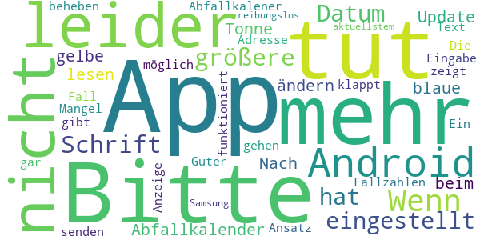

# Mensch, Solingen
App version ``2.2.4``

Analyzed with [covid-apps-observer](http://github.com/covid-apps-observer) project, version ``0.1``

## App overview
| | |
|-------------------------|-------------------------| 
| **Name**&nbsp;&nbsp;&nbsp;&nbsp;&nbsp;&nbsp;&nbsp;&nbsp;&nbsp;&nbsp;&nbsp;&nbsp;&nbsp;&nbsp;&nbsp;&nbsp;&nbsp;&nbsp;&nbsp;&nbsp;&nbsp;&nbsp;&nbsp;&nbsp;&nbsp;&nbsp;&nbsp;&nbsp;&nbsp;&nbsp;&nbsp;&nbsp;&nbsp;&nbsp;&nbsp;&nbsp;&nbsp;&nbsp;&nbsp;&nbsp;  | Mensch, Solingen |
| **Unique identifier** | de.solingen.solingenapp |
| **Link to Google Play** | [https://play.google.com/store/apps/details?id=de.solingen.solingenapp](https://play.google.com/store/apps/details?id=de.solingen.solingenapp) |
| **Summary**  | „Mensch, Solingen – Die offizielle App der Klingenstadt Solingen“ |
| **Privacy policy** | [https://www.solingen.de/de/inhalt/datenschutz/](https://www.solingen.de/de/inhalt/datenschutz/) |
| **Latest version** | 2.2.4 |
| **Last update** | 2020-11-16 17:10:34 |
| **Recent changes** | Neu in dieser Version: - Solingen Liefert - Walder Kunstprojekt (ab 19.11.2020) - Zusätzliche Features im Corona-Tab Außerdem: Diverse Bugfixes |
| **Installs**  | 1.000+ |
| **Category** | Reisen & Lokales |
| **First release** | 04.05.2020 |
| **Size**  | 18M |
| **Supported Android version**  | 8.0 oder höher |

### Description
> Die Klingenstadt Solingen präsentiert die Weiterentwicklung der ersten Version „Mensch, Solingen – Corona aktuell“ mit vielen innovativen Features, die das Nützliche mit dem Praktischen verbinden.
 Vorab: Neben den zahlreichen neuen Funktionen wirst du nach wie vor die Möglichkeit haben, alle Corona-relevanten Informationen übersichtlich und zusammengefasst auf einer Seite einzusehen.
 Zu den neuen Funktionen:
 Wetteranzeige
 Beim ersten Blick in die App erwartet dich eine exakte Wetteranzeige zu deinem aktuellen oder ausgewählten Standort. Durch unsere Wetterstationen bist du von nun an nicht mehr auf ungefähre Prognosen aus dem Web angewiesen, sondern kannst dich über die tatsächliche und genaue Wetterlage in Solingen erkundigen.
 Points of Interest 
 Die gelben Buttons zeigen dir, wo sich was in deiner Nähe befindet: Öffentliches W-LAN, Baustellen, Sehenswürdigkeiten, aber auch E-Tankstellen sowie Wohnmobilstellplätze und viele weitere interessante Orte kannst du dir in einer Karte anzeigen lassen.
 Digitales Bürgerbüro
 Richte dir mit dem Abfallkalender deine individuelle Erinnerung ein. Hast du einen Schaden oder eine Unreinheit entdeckt? Informiere uns über den Mängelmelder. Für Hinweise oder Fragen zur App, kannst du einfach unser Kontaktformular nutzen.
 Services
 Möchtest du einen Coworkingplatz buchen oder dich über aktuelle Events oder Veranstaltungen in Solingen informieren? Brauchst du eine zuverlässige Fahrplanauskunft? Oder suchst du einen neuen Job? Das alles kannst du hier direkt erledigen!
 Über die Aktivierung der Push-Nachrichten können wir dir auch kurzfristig wichtige Informationen unmittelbar bereitstellen und dich über aktuelle Meldungen der Klingenstadt benachrichtigen.

### User interface
The developers of the app provide the following screenshots in the Google play store.
| | | |
|:-------------------------:|:-------------------------:|:-------------------------:|
 |   |   |   | 
 |   |  

## Development team
In the following we report the main information provided by the development team in the Google play store.

| | |
|-------------------------|-------------------------|
| **Developer**  | solingen.digital |
| **Website**  | [https://www.solingen.de](https://www.solingen.de) |
| **Email** | app@solingen.de |
| **Physical address**  | - |
| **Other developed apps**  | [https://play.google.com/store/apps/developer?id=solingen.digital](https://play.google.com/store/apps/developer?id=solingen.digital) |

## Android support

| | |
|-------------------------|-------------------------|
| **Declared target Android version**  | Android10, version 10 (API level 29) |
| **Effective target Android version**  | Android10, version 10 (API level 29) |
| **Minimum supported Android version**  | Oreo, version 8.0.0 (API level 26) |
| **Maximum target Android version**  | - |

The larger the difference between the minimum and maximum supported Android versions, the better. A larger difference means a wider audience. For example, old phones have a very low Android version, so a high minimum supported Android version means that the app cannot be used by users with old phones, thus leading to accessibility problems. 

## Requested permissions

In the following we report the complete list of the permissions requested by the app. 

| **Permission** | **Protection level** | **Description** | 
|-------------------------|-------------------------|-------------------------|
 **android.permission ACCESS_COARSE_LOCATION** | :warning:**Dangerous** | Allows an app to access approximate location. 
 **android.permission ACCESS_FINE_LOCATION** | :warning:**Dangerous** | Allows an app to access precise location. 
 **android.permission ACCESS_NETWORK_STATE** | Normal | Allows applications to access information about networks. 
 **android.permission ACCESS_WIFI_STATE** | Normal | Allows applications to access information about Wi-Fi networks. 
 **android.permission AUDIO_CAPTURE** | - | - 
 **android.permission CALL_PHONE** | :warning:**Dangerous** | Allows an application to initiate a phone call without going through the Dialer user interface for the user to confirm the call. 
 **android.permission CAMERA** | :warning:**Dangerous** | Required to be able to access the camera device. 
 **android.permission GET_ACCOUNTS** | :warning:**Dangerous** | Allows access to the list of accounts in the Accounts Service. 
 **android.permission INTERNET** | Normal | Allows applications to open network sockets. 
 **android.permission MODIFY_AUDIO_SETTINGS** | Normal | Allows an application to modify global audio settings. 
 **android.permission READ_CALENDAR** | :warning:**Dangerous** | Allows an application to read the user's calendar data. 
 **android.permission RECORD_AUDIO** | :warning:**Dangerous** | Allows an application to record audio. 
 **android.permission VIDEO_CAPTURE** | - | - 
 **android.permission WAKE_LOCK** | Normal | Allows using PowerManager WakeLocks to keep processor from sleeping or screen from dimming. 
 **android.permission WRITE_CALENDAR** | :warning:**Dangerous** | Allows an application to write the user's calendar data. 
 **android.permission WRITE_EXTERNAL_STORAGE** | :warning:**Dangerous** | Allows an application to write to external storage. 
 **com.google.android.c2dm.permission RECEIVE** | - | - 

## Mentioned servers

| **Server** | **Registrant** | **Registrant country** | **Creation date** | 
|-------------------------|-------------------------|-------------------------|-------------------------|
 | google.com | Google LLC | :us: US | 1997-09-15 04:00:00 |
 | googleapis.com | Google LLC | :us: US | 2005-01-25 17:52:26 |
 | youtube.com | Google LLC | :us: US | 2005-02-15 05:13:12 |
 | googleapis.com | Google LLC | :us: US | 2005-01-25 17:52:26 |
 | googleapis.com | Google LLC | :us: US | 2005-01-25 17:52:26 |
 | vrr.de | - | - | - |
 | facebook.com | Facebook, Inc. | :us: US | 1997-03-29 05:00:00 |
 | solingen.de | - | - | - |
 | chargecloud.de | - | - | - |
 | mammut-hosting.de | - | - | - |
 | regioit.de | - | - | - |

## Security analysis 

Below we report the main security warnings raised by our execution of the [Androwarn](https://github.com/maaaaz/androwarn) security analysis tool.

**Connection interfaces exfiltration**
> - This application reads details about the currently active data network 
> - This application tries to find out if the currently active data network is metered 

**Telephony services abuse**
> - This application makes phone calls 

**Suspicious connection establishment**
> - This application opens a Socket and connects it to the remote address ' returned no addresses for  ; port is out of range' on the 'N/A' port  
> - This application opens a Socket and connects it to the remote address '' on the 'N/A' port  
> - This application opens a Socket and connects it to the remote address 'Ljava/lang/StringBuilder;->toString()Ljava/lang/String;' on the 'N/A' port  
> - This application opens a Socket and connects it to the remote address 'Ljava/net/Proxy;->type()Ljava/net/Proxy$Type;' on the 'N/A' port  
> - This application opens a Socket and connects it to the remote address 'timeout' on the 'N/A' port  

**Pim data leakage**
> - This application accesses the calendar 

## User ratings and reviews

Below we provide information about how end users are reacting to the app in terms of ratings and reviews in the Google Play store.

### Ratings

The Mensch, Solingen app has been installed by more than **1000** times. At this time, **37** rated the app and its average score is **2.8108108**. Below we show the distribution of the ratings across the usual star-based rating of Google Play

:star::star::star::star::star:: 8

:star::star::star::star:: 8

:star::star::star:: 3

:star::star:: 5

:star:: 13

### Reviews 

#### 5-star reviews

> Tolle Idee. Gut umgesetzt. Schönes Design. Funktioniert bei meinem S9+ prima. Kira könnte noch was zum Grill-, Jogging-, Wander- oder Radfahrwetter sagen.  :date: __2020-11-13 16:35:42__

> Guter Einstieg, weiter so!  :date: __2020-08-16 14:50:32__

> Tolle übersichtliche App! Viele nützliche Funktionen.... Sehr zu empfehlen!  :date: __2020-08-15 14:43:26__

> Sehr gute App, dass einzige was stört ist wenn man ÖPNV auswählt steht da egal welche Linie nach Solingen Hauptbahnhof.  :date: __2020-08-14 17:39:45__

#### 4-star reviews

> Vielen Dank, läuft jetzt wieder einwandfrei. Eigentlich eine schöne App aber seit dem letzten Update nur noch einmal zu öffnen (Samsung M21, Android 10).  :date: __2020-11-22 02:39:48__

> Hatte anfangs Probleme mit Installationen  :date: __2020-11-19 20:44:35__

> Bei der 1ten Benutzung sehr zufrieden schöne App... lässt sich leider bei erneuter Nutzung nicht öffnen...schade... Keine Verbindung zum Server möglich...bitte um Hilfe !!!  :date: __2020-11-18 10:22:27__

> Update: Mit Version 2.0.7 sind die bisherigen Fehler schnell behoben worden. Sehr gut. Die zukünftige Abwicklung von Verwaltungsdienstleistungen und Zahlfunktion hin zum mobilen "Bürgerbüro" ist ja das Ziel. Bin mal gespannt. Der 5. Stern wartet schon...  :date: __2020-08-30 10:57:21__

> Sieht schon mal super aus!!! Mit guten Infos. Ein guter Schritt in die richtige Richtung Jetzt sah ich gerade sowohl was Haus Schaaf als auch New Orleans hatten gestern live Musik. Habe ich hier nicht gefunden?  :date: __2020-08-15 10:36:08__

#### 3-star reviews

> Wenn man eine etwas größere Schrift eingestellt hat, ist das Datum im Abfallkalender für blaue und gelbe Tonne nicht zu lesen. Bitte ändern. Nach dem Update vom 21.08.2020 tut sich beim Abfallkalener jetzt gar nichts mehr. Die Eingabe der Adresse ist noch möglich, dann tut sich nichts mehr.  :date: __2020-08-23 20:30:38__

> Guter Ansatz auf jeden Fall, nur leider gehen 60% der App nicht. Ein Mangel über die App zu senden z.B. funktioniert nicht. Bitte beheben dann gibt es 5*  :date: __2020-08-22 15:07:48__

> Leider zeigt die App auf meinem Android alles bis auf die Fallzahlen. Anzeige von Text klappt reibungslos. Samsung 9 mit aktuellstem Android.  :date: __2020-06-19 08:13:01__

#### 2-star reviews

> Lässt sich nach dem Schließen mit der Zurück-Taste nicht wieder öffnen; Mensch Solingen kreist nur und es gibt keine Verbindung zum Server. Inzidenzzahl in der APP nicht aktuell. Während auf der Internetseite der Stadt Solingen schon der neue Wert vom 21.11. steht, ist in der APP immer noch der Wert vom 19.11. bzw. 20.11. (Internet 21.11.: 233,1 in der APP 20.11.: 266,9, in der Grafik aber dem 19.11. zugeordnet. Wenn schon APP dann doch bitte aktuell!  :date: __2020-11-22 00:07:57__

> Die Ausdrucksform gefällt mir nicht, ich möchte von der Stadtverwaltung nicht geduzt werden.  :date: __2020-08-29 13:52:56__

> Netter Versuch - hoffentlich wird die App noch weiter verbessert Egal was ich wähle (Freizeit, Baustellen, Sehenswürdigkeit...) - ich lande immer auf der Landkarte im Südpazifik. Mag ja schön sein dort, halte ich aber als lokales Freizeitangebot für Solingen für nicht ganz geeignet...  :date: __2020-08-23 12:12:57__

> Gute APP aber leider nicht mit htc one m8 und Android 6 kompatibel. Wäre schön wenn das noch behoben wird.  :date: __2020-05-31 11:55:54__

#### 1-star reviews

> Installiert und läuft nicht. Keine Meldung oder Reaktion, nur der gelber Kreis Mensch Solingen. Hab den Schrott wieder gelöscht, 1 Stern ist schon zuviel.  :date: __2020-11-22 12:52:30__

> Ständig habe ich Probleme die App zu öffnen. S 20 plus  :date: __2020-11-21 11:03:01__

> Nach ein paar Wochen startet die App nicht mehr. Eigentlich eine schöne App...  :date: __2020-11-21 08:20:55__

> Leider lässt sich die App nach der Erweiterung nicht mehr öffnen. Es geht nur einmalig nach Hochfahren des Smartphones, dann kein Kontakt mehr zum Server.  :date: __2020-11-20 15:08:41__

> Seit dem letzten Update nicht mehr zu gebrauchen.  :date: __2020-11-19 23:19:30__

> Nach der Installation und dem 1. Öffnen eine gute App. Leider kein 2. Öffnen möglich. ??? Samsung A50.  :date: __2020-11-19 17:52:38__

> Stürzt schon beim ersten Ausprobieren ab und passt sich nicht an die Displaygröße meines Moto G5 an, bei den Startinformationen ist Text unten nicht lesbar und es kann auch nicht dahin gescrollt werden.  :date: __2020-11-19 17:24:22__

> Die App bleibt direkt auf dem Startbildschirm hängen, ihr habt wohl was mir eurem Entwicklerteam zu besprechen... (Samsung S10)  :date: __2020-11-19 15:46:06__

> Wozu muss ich meinen Standort freischalten um Informationen zu erhalten???  :date: __2020-10-24 23:25:13__

> App bleibt hängen...  :date: __2020-08-24 09:40:56__

