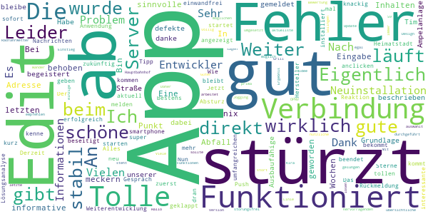
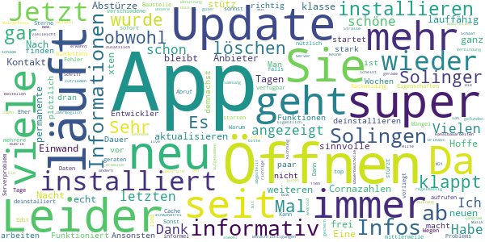
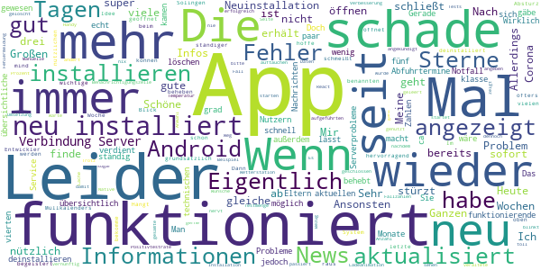
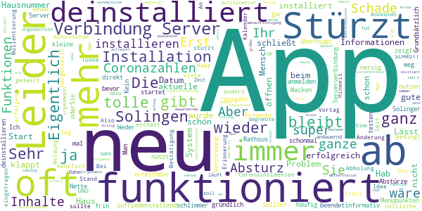
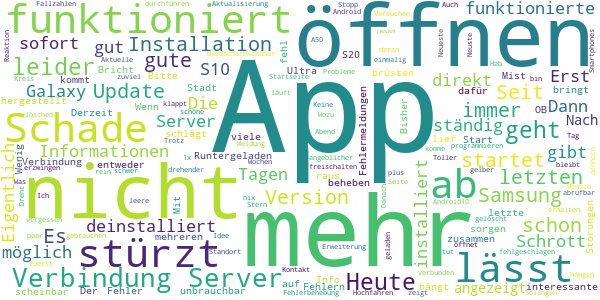

# Mensch, Solingen
App version ``2.2.41``

Analyzed with [covid-apps-observer](http://github.com/covid-apps-observer) project, version ``0.1``

## App overview
| | |
|-------------------------|-------------------------| 
| **Name**&nbsp;&nbsp;&nbsp;&nbsp;&nbsp;&nbsp;&nbsp;&nbsp;&nbsp;&nbsp;&nbsp;&nbsp;&nbsp;&nbsp;&nbsp;&nbsp;&nbsp;&nbsp;&nbsp;&nbsp;&nbsp;&nbsp;&nbsp;&nbsp;&nbsp;&nbsp;&nbsp;&nbsp;&nbsp;&nbsp;&nbsp;&nbsp;&nbsp;&nbsp;&nbsp;&nbsp;&nbsp;&nbsp;&nbsp;&nbsp;  | Mensch, Solingen |
| **Unique identifier** | de.solingen.solingenapp |
| **Link to Google Play** | [https://play.google.com/store/apps/details?id=de.solingen.solingenapp](https://play.google.com/store/apps/details?id=de.solingen.solingenapp) |
| **Summary**  | „Mensch, Solingen – Die offizielle App der Klingenstadt Solingen“ |
| **Privacy policy** | [https://www.solingen.de/de/inhalt/datenschutz/](https://www.solingen.de/de/inhalt/datenschutz/) |
| **Latest version** | 2.2.41 |
| **Last update** | 2021-07-01 10:08:18 |
| **Recent changes** | Gestern haben wir unser Update in Kombination mit den neuen Informationsstelen veröffentlich. Nun schicken wir einige Fehlerbehebungen hinterher.  Die wichtigste Fehlerbehebung: Die Coronazahlen aktualisieren sich wieder!  Bitte stellen Sie vor dem Update sicher, dass die App komplett geschlossen ist. |
| **Installs**  | 5.000+ |
| **Category** | Reisen & Lokales |
| **First release** | 04.05.2020 |
| **Size**  | 17M |
| **Supported Android version**  | 8.0 oder höher |

### Description
> Die Klingenstadt Solingen präsentiert die Weiterentwicklung der ersten Version „Mensch, Solingen – Corona aktuell“ mit vielen innovativen Features, die das Nützliche mit dem Praktischen verbinden.
 Vorab: Neben den zahlreichen neuen Funktionen wirst du nach wie vor die Möglichkeit haben, alle Corona-relevanten Informationen übersichtlich und zusammengefasst auf einer Seite einzusehen.
 Zu den neuen Funktionen:
 Wetteranzeige
 Beim ersten Blick in die App erwartet dich eine exakte Wetteranzeige zu deinem aktuellen oder ausgewählten Standort. Durch unsere Wetterstationen bist du von nun an nicht mehr auf ungefähre Prognosen aus dem Web angewiesen, sondern kannst dich über die tatsächliche und genaue Wetterlage in Solingen erkundigen.
 Points of Interest 
 Die gelben Buttons zeigen dir, wo sich was in deiner Nähe befindet: Öffentliches W-LAN, Baustellen, Sehenswürdigkeiten, aber auch E-Tankstellen sowie Wohnmobilstellplätze und viele weitere interessante Orte kannst du dir in einer Karte anzeigen lassen.
 Digitales Bürgerbüro
 Richte dir mit dem Abfallkalender deine individuelle Erinnerung ein. Hast du einen Schaden oder eine Unreinheit entdeckt? Informiere uns über den Mängelmelder. Für Hinweise oder Fragen zur App, kannst du einfach unser Kontaktformular nutzen.
 Services
 Möchtest du einen Coworkingplatz buchen oder dich über aktuelle Events oder Veranstaltungen in Solingen informieren? Brauchst du eine zuverlässige Fahrplanauskunft? Oder suchst du einen neuen Job? Das alles kannst du hier direkt erledigen!
 Über die Aktivierung der Push-Nachrichten können wir dir auch kurzfristig wichtige Informationen unmittelbar bereitstellen und dich über aktuelle Meldungen der Klingenstadt benachrichtigen.

### User interface
The developers of the app provide the following screenshots in the Google play store.
| | | |
|:-------------------------:|:-------------------------:|:-------------------------:|
 |   |   |   | 
 |   |  

## Development team
In the following we report the main information provided by the development team in the Google play store.

| | |
|-------------------------|-------------------------|
| **Developer**  | solingen.digital |
| **Website**  | [https://www.solingen.de](https://www.solingen.de) |
| **Email** | app@solingen.de |
| **Physical address**  | - |
| **Other developed apps**  | [https://play.google.com/store/apps/developer?id=solingen.digital](https://play.google.com/store/apps/developer?id=solingen.digital) |

## Android support

| | |
|-------------------------|-------------------------|
| **Declared target Android version**  | Android10, version 10 (API level 29) |
| **Effective target Android version**  | Android10, version 10 (API level 29) |
| **Minimum supported Android version**  | Oreo, version 8.0.0 (API level 26) |
| **Maximum target Android version**  | - |

The larger the difference between the minimum and maximum supported Android versions, the better. A larger difference means a wider audience. For example, old phones have a very low Android version, so a high minimum supported Android version means that the app cannot be used by users with old phones, thus leading to accessibility problems. 

## Requested permissions

In the following we report the complete list of the permissions requested by the app. 

| **Permission** | **Protection level** | **Description** | 
|-------------------------|-------------------------|-------------------------|
 **android.permission ACCESS_COARSE_LOCATION** | :warning:**Dangerous** | Allows an app to access approximate location. 
 **android.permission ACCESS_FINE_LOCATION** | :warning:**Dangerous** | Allows an app to access precise location. 
 **android.permission ACCESS_NETWORK_STATE** | Normal | Allows applications to access information about networks. 
 **android.permission ACCESS_WIFI_STATE** | Normal | Allows applications to access information about Wi-Fi networks. 
 **android.permission BLUETOOTH** | Normal | Allows applications to connect to paired bluetooth devices. 
 **android.permission BLUETOOTH_ADMIN** | Normal | Allows applications to discover and pair bluetooth devices. 
 **android.permission CALL_PHONE** | :warning:**Dangerous** | Allows an application to initiate a phone call without going through the Dialer user interface for the user to confirm the call. 
 **android.permission CAMERA** | :warning:**Dangerous** | Required to be able to access the camera device. 
 **android.permission FOREGROUND_SERVICE** | Normal | Allows a regular application to use Service.startForeground. 
 **android.permission GET_ACCOUNTS** | :warning:**Dangerous** | Allows access to the list of accounts in the Accounts Service. 
 **android.permission INTERNET** | Normal | Allows applications to open network sockets. 
 **android.permission READ_CALENDAR** | :warning:**Dangerous** | Allows an application to read the user's calendar data. 
 **android.permission RECEIVE_BOOT_COMPLETED** | Normal | Allows an application to receive the Intent.ACTION_BOOT_COMPLETED that is broadcast after the system finishes booting. 
 **android.permission VIDEO_CAPTURE** | - | - 
 **android.permission WAKE_LOCK** | Normal | Allows using PowerManager WakeLocks to keep processor from sleeping or screen from dimming. 
 **android.permission WRITE_CALENDAR** | :warning:**Dangerous** | Allows an application to write the user's calendar data. 
 **android.permission WRITE_EXTERNAL_STORAGE** | :warning:**Dangerous** | Allows an application to write to external storage. 
 **com.google.android.c2dm.permission RECEIVE** | - | - 

## Mentioned servers

| **Server** | **Registrant** | **Registrant country** | **Creation date** | 
|-------------------------|-------------------------|-------------------------|-------------------------|
 | google.com | Google LLC | :us: US | 1997-09-15 04:00:00 |
 | googleapis.com | Google LLC | :us: US | 2005-01-25 17:52:26 |
 | youtube.com | Google LLC | :us: US | 2005-02-15 05:13:12 |
 | googleapis.com | Google LLC | :us: US | 2005-01-25 17:52:26 |
 | googleapis.com | Google LLC | :us: US | 2005-01-25 17:52:26 |
 | facebook.com | Facebook, Inc. | :us: US | 1997-03-29 05:00:00 |
 | mammut-hosting.de | - | - | - |
 | quartier-wald.de | - | - | - |
 | vrr.de | - | - | - |
 | solingen.de | - | - | - |
 | chargecloud.de | - | - | - |
 | stein-manuela.de | - | - | - |
 | klette-art.de | - | - | - |
 | regioit.de | - | - | - |
 | maven.org | Whois Privacy Service | :us: US | 2001-06-30 10:38:24 |

## Security analysis 

Below we report the main security warnings raised by our execution of the [Androwarn](https://github.com/maaaaz/androwarn) security analysis tool.

**Connection interfaces exfiltration**
> - This application reads details about the currently active data network 
> - This application tries to find out if the currently active data network is metered 

**Telephony services abuse**
> - This application makes phone calls 

**Suspicious connection establishment**
> - This application opens a Socket and connects it to the remote address '1' on the 'N/A' port  
> - This application opens a Socket and connects it to the remote address '2' on the 'N/A' port  
> - This application opens a Socket and connects it to the remote address '3' on the 'N/A' port  
> - This application opens a Socket and connects it to the remote address 'Ljava/net/Proxy;->type()Ljava/net/Proxy$Type;' on the 'N/A' port  
> - This application opens a Socket and connects it to the remote address 'timeout' on the 'N/A' port  

**Pim data leakage**
> - This application accesses the calendar 

**Code execution**
> - This application loads a native library 
> - This application loads a native library: 'Ljava/lang/System;->mapLibraryName(Ljava/lang/String;)Ljava/lang/String;' 
> - This application executes a UNIX command containing this argument: '/sbin/ldconfig -p' 
> - This application executes a UNIX command containing this argument: '7' 

## User ratings and reviews

Below we provide information about how end users are reacting to the app in terms of ratings and reviews in the Google Play store.

### Ratings

The Mensch, Solingen app has been installed by more than **5000** times. At this time, **115** rated the app and its average score is **2.8**. Below we show the distribution of the ratings across the usual star-based rating of Google Play

:star::star::star::star::star:: 23

:star::star::star::star:: 18

:star::star::star:: 18

:star::star:: 23

:star:: 33

### Reviews 

#### 5-star reviews

> Die App ist sehr gut  :date: __2021-07-08 13:35:27__

> Eigentlich eine schöne und sinnvolle App. Leider läuft sie nicht stabil. Bei der Eingabe meiner Adresse unter dem Punkt Abfall stürzt sie ab. 🤔 Edit :Fehler wurde behoben.  :date: __2021-06-07 13:06:03__

> In den letzten Wochen ist die App sehr stabil geworden und funktioniert wirklich gut. An den Inhalten gibt es nix zu meckern. Weiter so.  :date: __2021-04-30 17:19:35__

> Eine wirklich gute und informative App!  :date: __2021-03-28 10:27:14__

> Bin begeistert, danke Tim K. Funktioniert wie beschrieben. Ausbaufähige Grundlage. Habe direkt die defekte Ampelanlage auf unserer Straße gemeldet. Ich bleibe dabei, wenn ihr auch bei der Weiterentwicklung dran bleibt.  :date: __2021-03-20 10:35:26__

> Derzeit stürzt die App beim starten ab, zuerst wird Fehler:100 angezeigt, dann ist die Verbindung zum Server doch erfolgreich und dann stürzt die App ab. Edit: Der Tipp mit der Neuinstallation hat geklappt. Vielen Dank 👍.  :date: __2021-02-17 15:10:54__

> Eigentlich eine tolle APP. aktuell startet die. Anwendung leider nicht sondern wird direkt beendet. Ich kann nur einen Fehler an meinen smartphone Hersteller melden. Push Nachrichten kommen zwar an, aber auch hier kommt es beim anclicken zum Absturz. Edit. Nach Rückmeldung der Entwickler Problem beseitigt. Alles Bestens, vielen Dank.  :date: __2020-12-20 08:27:00__

> Nun habe ich die App neu installiert und läuft einwandfrei. Jetzt bekommt sie auch meine 5 Sterne. Es gibt kurz und knackig Informationen. Wie ich meine Heimatstadt kenne, wird es zukünftig noch mehr interessante Informationen in der App geben. Weiter so!  :date: __2020-12-15 22:37:53__

> Das war jetzt aber mal eine super Reaktion der App-Entwickler. Nach einem tollen und umfangreichen Gespräch wurde sofort eine Lösungsanalyse durchgeführt. Mit dem hervorragenden Ergebnis, dass jetzt die aktuellste Version völlig störungsfrei arbeitet. Daher eine 5\*\*\*\** Bewertung. Hallo, wenn das letzte Update das Problem einer möglichen Server Verbindung lösen sollte, ist das nicht gelungen. Es ist immer nur eine Verbindung nach der Neuinstallation möglich.  :date: __2020-12-01 18:22:02__

> Tolle Idee. Gut umgesetzt. Schönes Design. Funktioniert bei meinem S9+ prima. Kira könnte noch was zum Grill-, Jogging-, Wander- oder Radfahrwetter sagen.  :date: __2020-11-13 16:35:42__

#### 4-star reviews

> Leider stütz die App nach dem Öffnen immer wieder ab auch nach den neuen Updates war sonst ganz informativ Cornazahlen aktualisieren sich nicht mehr seit Tagen . Nacht Kontakt mit dem Anbieter der App und weiteren Infos von ihm läuft die App wieder Einwand frei .  :date: __2021-07-07 08:20:50__

> Eine echt klasse App für Solingen, viele Informationen und sinnvolle Funktionen. Da macht Solingen vieles richtig. Leider Funktioniert die App dann plötzlich alle paar Wochen nicht mehr. Man muss Sie deinstallieren und neu installieren. Das geht leider auf Dauer gar nicht ) - : . Viele Solinger machen das nur ein Mal, obwohl Sie die App auch super finden! Da muss der Entwickler sehr stark dran arbeiten! Ansonsten hat demnächst kein Solinger mehr dieses App installiert, obwohl Sie super ist!!!  :date: __2021-06-13 15:00:45__

> App startet nicht? So geht man dann vor... Eigenschaften der App aufrufen, Cache und Daten löschen. Dann klappt es wieder falls kein Serverproblem vorliegt.  :date: __2021-05-17 23:46:50__

> Sie stürzt zum mindestens immer bei Mängel ab, aber sonnst top die app  :date: __2021-03-11 08:45:04__

> Sehr informel  :date: __2021-02-16 18:55:45__

> App ließ sich über mehrere Tage nicht starten. Es wurde immer der Fehler 100 angezeigt. Habe sie jetzt deinstalliert und neu installiert. Läuft wieder.  :date: __2021-02-13 23:54:38__

> Warum wird die Baustelle auf der L 288 nicht angezeigt ? Sonst ist die App super  :date: __2020-12-17 19:17:54__

> Sehr nützlich und informativ. Informationen sofort nach Abruf verfügbar  :date: __2020-12-16 14:40:02__

> Wegen des Problems mit dem Öffnen der App wurde mir geraten, diese zu löschen und neu zu installieren. Jetzt klappt das Öffnen wieder.  :date: __2020-12-16 09:50:02__

> Kann die App gar nicht öffnen nach dem letzten Update Eher 0 Sterne, geht aber nicht Edit 16.12.20 Vielen Dank für die Rückmeldung. Ich habe die App mittlerweile neu installiert und verschiedene Benachrichtigungen abgestellt. Jetzt läuft sie wieder.  :date: __2020-12-16 08:18:12__

#### 3-star reviews

> Die Informationen und der Service verdient 5 Sterne. Die technischen Probleme (Abfuhrtermine werden nicht angezeigt, App schließt sich, Serverprobleme,..) macht sie jedoch wenig nützlich. Schade  :date: __2021-07-11 09:57:31__

> Eigentlich ist die App super! Allerdings muss ich sie alle drei Monate löschen, da sie nicht mehr funktioniert. Wenn ich sie dann neu installiert habe, funktioniert sie wieder. Ansonsten gäbe es fünf Sterne!  :date: __2021-07-03 23:00:18__

> Eigentlich war es eine gute und übersichtliche App. Doch seit ein paar Tagen funktioniert sie nicht mehr... Sie stürzt ständig ab, die Corona Zahlen werden nicht aktualisiert, ein neu installieren behebt das Problem leider auch nicht.. Wirklich sehr schade!  :date: __2021-07-03 18:53:18__

> Mir geht es wie den anderen Nutzern: seit einigen Wochen immer mal wieder keine aktuellen Nachrichten, außerdem seit drei Tagen keine Verbindung zum Server mehr möglich. Heute werde ich die App zum vierten Mal neu installieren. Das ist schade, denn grundsätzlich finde ich die Idee der App hervorragend: viele wichtige Infos zu Solingen auf einen Blick. Ich hoffe, dass die Entwickler die oben benannten Fehler beheben können. Dann erhält die App auch 5 Sterne.  :date: __2021-07-02 19:53:21__

> Ich war bis jetzt begeistert, nun bekomme ich noch Fehler 100 angezeigt und er schmeißt mich sofort raus.  :date: __2021-07-02 11:53:17__

> Eigentlich eine gute App nur leider ständiger Absturz, so daß ich sie schon mind 5 mal deinstalliert habe und neu installiert habe. Android System  :date: __2021-07-02 09:09:34__

> Hängt sich öfters auf und muss dann neu installiert werden, ansonsten ist sie sehr gut.  :date: __2021-07-01 15:41:54__

> Schöne App mit vielen nützlichen Informationen. Leider hat sie sich letzte Woche nicht mehr geöffnet. (Fehler 100!?) Nach Neuinstallation öffnet sie wieder, stürzt aber jetzt beim Öffnen des Müllkalenders ab.  :date: __2021-06-04 08:23:03__

> Im Großen und Ganzen finde ich die App gut. Allerdings: Mir werden News in der Benachrichtigungszeile angekündigt, die aber in meiner App dann nicht auftauchen. Trotz Verbindung zum Server habe ich veraltete News. Heute zum Beispiel, 2.6.21 kann ich nur News bis zum 28.5. sehen. Cache ist geleert. Seite aktualisiert. Nichts passiert. Schade. Warte auf Verbesserung.  :date: __2021-06-02 13:42:33__

> Leider schließt sich seit Tagen die App sofort, nachdem die Verbindung zum Server erfolgreich angezeigt wurde. Habe die App bereits gelöscht und neu installiert, es ändert sich nix. Sehr schade, habe sie gerne genutzt.  :date: __2021-04-17 20:14:23__

#### 2-star reviews

> Stürzt häufig ab. Erst Serververbindung hergestellt, dann Absturz. Schade eigentlich super für Solinger.  :date: __2021-07-08 18:28:18__

> Grundsätzlich eine tolle App. Sehr informativ und tolle Funktionen. Aber diese Abstürze sind nervig. Ich bin schonmal frih, dass man sich nicht anmelden muss sonst wäre dieses ganze deinstallieren und neu installieren noch schlimmer und ich würde die App gar nicht mehr nutzen.  :date: __2021-07-06 12:00:09__

> Man hat oft keine Verbindung zum Server  :date: __2021-07-04 14:35:23__

> Sehr oft Absturz - "Verbindung zum Server erfolgreich" - und dann ist sie wieder weg. Neu installiert dann klappt es wieder. Kein aktuelles Datum bei z.B. den Coronainzidenzen. Bei Müllentsorung wird nur das aktuelle Datum Abholdatum im Kalender eingetragen - Meldung erst am Tag der Abholung wenn die Tonne schon geleert wurde. Trotz Hinweis, dass die Erinnerung am Vortag erfolgen sollte UND Bestätigung dass das aus so sein sollte, keine Änderung. Also - SCHROTT, der wieder deinstalliert wurde !!  :date: __2021-07-04 12:12:22__

> Eigentlich enthält die App viele nützliche Informationen. Leider stürzt sie immer wieder ab. Seit dem 28.06. ändert sich der Stand der Coronazahlen nicht mehr. Habe sie schon mehrfach neu installiert - Problem bleibt!  :date: __2021-07-01 09:59:20__

> Sinnlose App. Macht von einem Tag auf den anderen was sie will. Gestern ging noch diese oder jene Funktion. Heute schließt sie sich sofort, wenn man den gleichen Punkt anwählt, z.B. Mülltermine abrufen. Straße eingeben, Hausnummer wählen... App beendet sich von alleine. Bereits diverse solche Eingenheiten gemeldet. Geändert (durch Updates) hat sich nichts. Cache geleert. De-/Neuinstalliert. Keine Änderung. Anderes Handy. Gleiches Verhalten. Endgültig deinstalliert. Was nicht funkt. ist sinnlos.  :date: __2021-06-04 10:16:14__

> Funktioniert nur bedingt.stützt immer wieder ab  :date: __2021-05-30 20:57:39__

> An sich eine gute Idee die App mit den angedachten Funktionen und Informationen. Leider funktioniert sie nach der Installation nur eine begrenzte Zeit. Eine neu Installation behebt das Problem. Nur hat man auf immer wieder neu installieren irgendwann keinen nerv mehr dazu. Daher bleibt sie nun deinstalliert.  :date: __2021-05-23 09:24:47__

> Geht so. Stürzt andauernd ab. Sehr oft keine Verbindung zum Server. Ansonsten OK  :date: __2021-03-13 08:43:37__

> Okay, die App läuft mittlerweile und tut was sie soll. Der Funktionsumfang könnte noch was größer sein. Leider klappt das Scaling nich nicht ganz, zum Teil werden Textbereiche bin anderen Boxen überdeckt (Samsung S10) Update: bekam heute die erste Benachrichtigung von der App, und ich bekomme einen dauerhaften Fehler angezeigt... Jetzt deinstalliert, schade  :date: __2021-03-05 17:02:32__

#### 1-star reviews

> Stürzt nach dem Start sofort ab. Schade!  :date: __2021-07-08 22:52:49__

> Stürzt nur noch ab...Schrott!!!  :date: __2021-07-06 10:22:49__

> App stürzt ab (Galaxy S20 Ultra)  :date: __2021-07-05 16:29:20__

> Es gibt zu viele Fehlermeldungen  :date: __2021-07-03 12:07:04__

> Wenig interessante Informationen und ständig Störungen. Mit so etwas muss sich unser OB nicht brüsten@  :date: __2021-05-27 18:44:39__

> Runtergeladen, hängt sich sofort auf,direkt wieder deinstalliert  :date: __2021-04-09 21:01:24__

> Die App funktioniert nicht!  :date: __2021-03-26 12:56:23__

> Der letzte Mist. Bricht entweder direkt zusammen oder Verbindung zum Server schlägt fehl. Deinstalliert.  :date: __2021-03-16 08:36:17__

> Bisher lief die App gut, doch seit einigen Tagen lässt sie sich nicht mehr öffnen. Erst kommt Fehler 100. Dann wird doch die Verbindung zum Server hergestellt und dann stürzt sie ab.  :date: __2021-02-13 15:17:38__

> Derzeit ist keine Info über die App möglich, da es scheinbar zu Fehlern in der Verbindung zum Server gibt.  :date: __2021-01-31 11:15:31__

