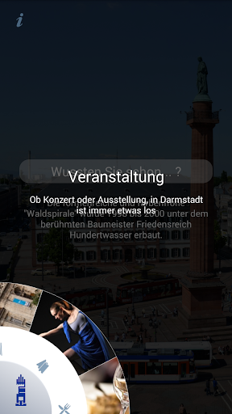
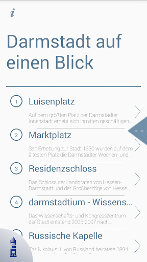
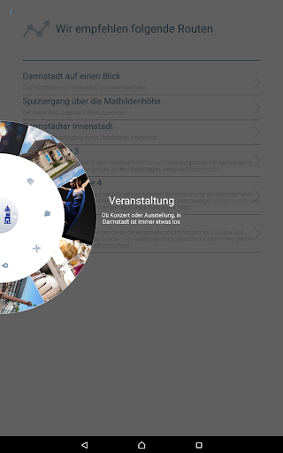
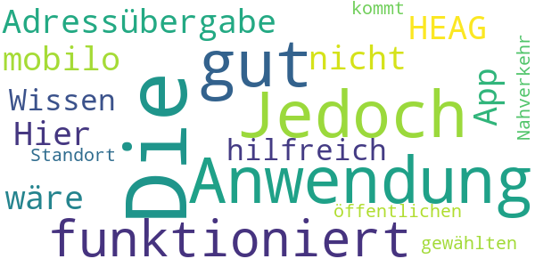
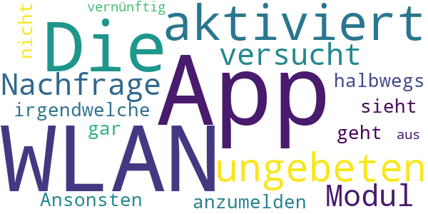
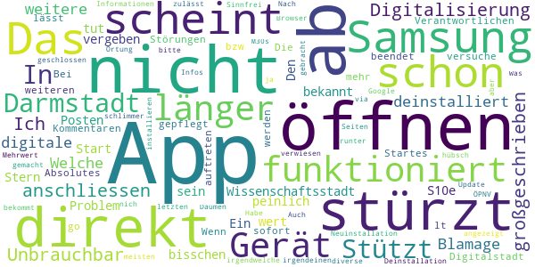

# Darmstadt
App version ``3.9``

Analyzed with [covid-apps-observer](http://github.com/covid-apps-observer) project, version ``0.1``

## App overview
| | |
|-------------------------|-------------------------| 
| **Name**&nbsp;&nbsp;&nbsp;&nbsp;&nbsp;&nbsp;&nbsp;&nbsp;&nbsp;&nbsp;&nbsp;&nbsp;&nbsp;&nbsp;&nbsp;&nbsp;&nbsp;&nbsp;&nbsp;&nbsp;&nbsp;&nbsp;&nbsp;&nbsp;&nbsp;&nbsp;&nbsp;&nbsp;&nbsp;&nbsp;&nbsp;&nbsp;&nbsp;&nbsp;&nbsp;&nbsp;&nbsp;&nbsp;&nbsp;&nbsp;  | Darmstadt |
| **Unique identifier** | de.werdenktwas.darmstadt.cityapp |
| **Link to Google Play** | [https://play.google.com/store/apps/details?id=de.werdenktwas.darmstadt.cityapp](https://play.google.com/store/apps/details?id=de.werdenktwas.darmstadt.cityapp) |
| **Summary**  | Die offizielle Darmstadt App |
| **Privacy policy** | [https://dacityapp.werdenktwas.de/static/nutzungsbedingungen_neu.htm](https://dacityapp.werdenktwas.de/static/nutzungsbedingungen_neu.htm) |
| **Latest version** | 3.9 |
| **Last update** | 2021-03-26 16:02:39 |
| **Recent changes** | Kleine Fehlerbehebungen |
| **Installs**  | 5.000+ |
| **Category** | Reisen & Lokales |
| **First release** | 08.07.2016 |
| **Size**  | 88M |
| **Supported Android version**  | 5.0 oder höher |

### Description
> Die offizielle Darmstadt App wendet sich an Touristen und Besucher der Wissenschaftsstadt Darmstadt. Sie bietet einen Stadtplan mit Sehenswürdigkeiten und Vorschläge für Stadtrundgänge und Hörtouren mit der Straßenbahn sowie Nachrichten aus und um Darmstadt.

### User interface
The developers of the app provide the following screenshots in the Google play store.
| | | |
|:-------------------------:|:-------------------------:|:-------------------------:|
 |   |   |   | 
 |   |   |   | 
 |   |   |   | 
 |   |   |   | 

## Development team
In the following we report the main information provided by the development team in the Google play store.

| | |
|-------------------------|-------------------------|
| **Developer**  | Wissenschaftsstadt Darmstadt |
| **Website**  | [http://www.darmstadt.de](http://www.darmstadt.de) |
| **Email** | darmstadtapp@darmstadt.de |
| **Physical address**  | [Luisenplatz 5 64283 Darmstadt](https://www.google.com/maps/search/Luisenplatz%205%2064283%20Darmstadt) (Google Maps) |
| **Other developed apps**  | [https://play.google.com/store/apps/developer?id=Wissenschaftsstadt+Darmstadt](https://play.google.com/store/apps/developer?id=Wissenschaftsstadt+Darmstadt) |

## Android support

| | |
|-------------------------|-------------------------|
| **Declared target Android version**  | Android10, version 10 (API level 29) |
| **Effective target Android version**  | Android10, version 10 (API level 29) |
| **Minimum supported Android version**  | Lollipop, version 5.0 (API level 21) |
| **Maximum target Android version**  | - |

The larger the difference between the minimum and maximum supported Android versions, the better. A larger difference means a wider audience. For example, old phones have a very low Android version, so a high minimum supported Android version means that the app cannot be used by users with old phones, thus leading to accessibility problems. 

## Requested permissions

In the following we report the complete list of the permissions requested by the app. 

| **Permission** | **Protection level** | **Description** | 
|-------------------------|-------------------------|-------------------------|
 **android.permission ACCESS_COARSE_LOCATION** | :warning:**Dangerous** | Allows an app to access approximate location. 
 **android.permission ACCESS_FINE_LOCATION** | :warning:**Dangerous** | Allows an app to access precise location. 
 **android.permission ACCESS_GPS** | - | - 
 **android.permission ACCESS_NETWORK_STATE** | Normal | Allows applications to access information about networks. 
 **android.permission ACCESS_WIFI_STATE** | Normal | Allows applications to access information about Wi-Fi networks. 
 **android.permission CALL_PHONE** | :warning:**Dangerous** | Allows an application to initiate a phone call without going through the Dialer user interface for the user to confirm the call. 
 **android.permission CAMERA** | :warning:**Dangerous** | Required to be able to access the camera device. 
 **android.permission CHANGE_WIFI_STATE** | Normal | Allows applications to change Wi-Fi connectivity state. 
 **android.permission INTERNET** | Normal | Allows applications to open network sockets. 
 **android.permission READ_EXTERNAL_STORAGE** | :warning:**Dangerous** | Allows an application to read from external storage. 
 **android.permission WRITE_EXTERNAL_STORAGE** | :warning:**Dangerous** | Allows an application to write to external storage. 
 **com.google.android.providers.gsf.permission READ_GSERVICES** | - | - 

## Mentioned servers

| **Server** | **Registrant** | **Registrant country** | **Creation date** | 
|-------------------------|-------------------------|-------------------------|-------------------------|
 | google.com | Google LLC | :us: US | 1997-09-15 04:00:00 |
 | googleapis.com | Google LLC | :us: US | 2005-01-25 17:52:26 |
 | microsoft.com | Microsoft Corporation | :us: US | 1991-05-02 04:00:00 |
 | werdenktwas.de | - | - | - |
 | omniscale.net | - | :de: DE | 2008-10-24 18:54:12 |

## Security analysis 

Below we report the main security warnings raised by our execution of the [Androwarn](https://github.com/maaaaz/androwarn) security analysis tool.

**Telephony identifiers leakage**
> - This application reads the ISO country code equivalent of the current registered operator's MCC (Mobile Country Code) 
> - This application reads the numeric name (MCC+MNC) of current registered operator 
> - This application reads the operator name 

**Connection interfaces exfiltration**
> - This application reads details about the currently active data network 
> - This application tries to find out if the currently active data network is metered 

**Suspicious connection establishment**
> - This application opens a Socket and connects it to the remote address '' on the 'N/A' port  
> - This application opens a Socket and connects it to the remote address 'Ljava/lang/StringBuilder;->toString()Ljava/lang/String;' on the 'N/A' port  
> - This application opens a Socket and connects it to the remote address 'Ljava/net/Proxy;->type()Ljava/net/Proxy$Type;' on the 'N/A' port  
> - This application opens a Socket and connects it to the remote address 'timeout' on the 'N/A' port  

**Code execution**
> - This application loads a native library: 'RSSupport' 
> - This application loads a native library: 'RSSupportIO' 
> - This application loads a native library: 'blasV8' 
> - This application loads a native library: 'c++_shared' 
> - This application loads a native library: 'rsjni_androidx' 
> - This application loads a native library: 'runtimecore' 
> - This application loads a native library: 'runtimecore_java' 

## User ratings and reviews

Below we provide information about how end users are reacting to the app in terms of ratings and reviews in the Google Play store.

### Ratings

The Darmstadt app has been installed by more than **5000** times. At this time, **34** rated the app and its average score is **3.3823528**. Below we show the distribution of the ratings across the usual star-based rating of Google Play

:star::star::star::star::star:: 18

:star::star::star::star:: 1

:star::star::star:: 2

:star::star:: 2

:star:: 11

### Reviews 

#### 5-star reviews

> Top! Auch die Idee, den Login ins Wifi-Darmstadt zu erleichtern... Genau das was ich gesucht habe!  :date: __2020-03-09 20:16:26__

> Schöne, innovative Gestaltung und Steuerung der App. Der Audio-Guide ist super. Enthält nützliche Informationen. Die Anzeige von Veranstaltungen könnte verbessert werden.  :date: __2017-05-16 21:15:12__

#### 4-star reviews

> Die Anwendung ist gut. Jedoch funktioniert die Adressübergabe an die HEAG mobilo App nicht. Hier wäre es hilfreich zu Wissen wie man mit dem öffentlichen Nahverkehr zum gewählten Standort kommt.  :date: __2017-08-11 19:59:53__

#### 3-star reviews

> Die App an sich ist ganz brauchbar, dass sie sich aber permanent per Toast Notification meldet, weil sie sich zu 'Wifi Darmstadt' verbinden will, nervt massiv.  :date: __2017-06-27 19:01:10__

#### 2-star reviews

> Die App aktiviert ungebeten und ohne Nachfrage das WLAN Modul und versucht sich in irgendwelche WLAN anzumelden, das geht gar nicht! Ansonsten sieht die App halbwegs vernünftig aus.  :date: __2018-10-23 10:45:54__

#### 1-star reviews

> Stützt nach dem Öffnen ab.In Darmstadt wird Digitalisierung großgeschrieben 😀  :date: __2021-02-01 07:42:36__

> Ich kann mich nur den anderen anschliessen, nach dem öffnen stürzt sie ab. Unbrauchbar, wird wieder deinstalliert. Welche weitere Blamage für die digitale Wissenschaftsstadt. Den Stern, den ich zum Posten vergeben muss ist die App aber nicht wert  :date: __2021-01-19 21:16:38__

> App stürzt direkt nach Start ab (Samsung S10e). Das Problem scheint schon länger bekannt zu sein, aber es tut sich nichts. Ein bisschen peinlich für die Digitalstadt.  :date: __2020-12-08 08:10:59__

> App funktioniert nicht, bzw. wird direkt während des Startes beendet. Scheint auch nicht von den Verantwortlichen gepflegt zu werden, da die Störungen schon länger auftreten lt. weiteren Kommentaren. Absolutes no go.  :date: __2020-11-23 01:03:25__

> Die App funktioniert auf meinem Gerät nicht.  :date: __2020-11-09 19:23:34__

> Bei mir lässt sich die App nicht mehr öffnen. Wenn ich das versuche wird sie sofort wieder geschlossen. Habe ein Samsung M30s. Auch Deinstallation und Neuinstallation hat nichts gebracht.  :date: __2020-10-10 11:24:43__

> Nach dem letzten Update bekommt man die meisten Informationen nur nich angezeigt, wenn man die Ortung des Geräts zulässt. Was soll das bitte? Das ist ja schlimmer als bei Google. Daumen runter!  :date: __2018-03-09 15:31:50__

> Sinnfrei hübsch gemacht...aber ohne irgendeinen Mehrwert, für diverse Infos soll man andere Apps installieren (ÖPNV) oder wird via Browser auf  irgendwelche Seiten verwiesen.  :date: __2017-12-27 10:44:09__

