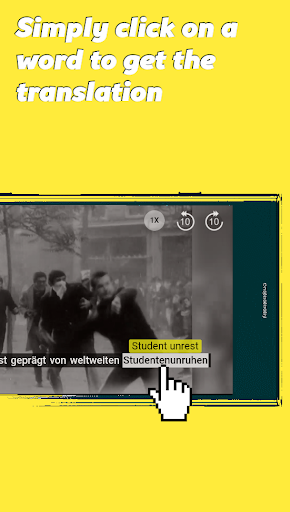
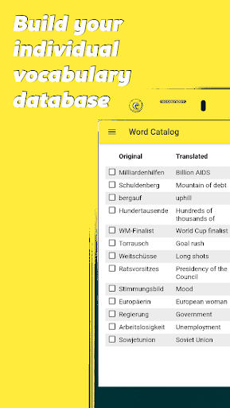

# uugot.it
App version ``Variiert je nach Gerät``

Analyzed with [covid-apps-observer](http://github.com/covid-apps-observer) project, version ``0.1``

## App overview
| | |
|-------------------------|-------------------------| 
| **Name**&nbsp;&nbsp;&nbsp;&nbsp;&nbsp;&nbsp;&nbsp;&nbsp;&nbsp;&nbsp;&nbsp;&nbsp;&nbsp;&nbsp;&nbsp;&nbsp;&nbsp;&nbsp;&nbsp;&nbsp;&nbsp;&nbsp;&nbsp;&nbsp;&nbsp;&nbsp;&nbsp;&nbsp;&nbsp;&nbsp;&nbsp;&nbsp;&nbsp;&nbsp;&nbsp;&nbsp;&nbsp;&nbsp;&nbsp;&nbsp;  | uugot.it |
| **Unique identifier** | it.uugot |
| **Link to Google Play** | [https://play.google.com/store/apps/details?id=it.uugot](https://play.google.com/store/apps/details?id=it.uugot) |
| **Summary**  | <b>Verbessere Deine Sprachkenntnisse - Während du fernsiehst! </b> |
| **Privacy policy** | [-](-) |
| **Latest version** | Variiert je nach Gerät |
| **Last update** | 2020-11-12 23:24:46 |
| **Recent changes** | • Neu: Videos für Kinder (&quot;KiDS&quot;-Channel) • Neu: Upload von privaten Arbeitsblättern (für Lehrende) • Neu: Klassen können jetzt auch gelöscht werden (für Lehrende) • Weitere Verbesserungen und Fehlerbehebungen |
| **Installs**  | 1.000+ |
| **Category** | Lernen |
| **First release** | - |
| **Size**  | Variiert je nach Gerät |
| **Supported Android version**  | Variiert je nach Gerät |

### Description
> <b>Lerne Deutsch während des Fernsehens!</b>
 Ist es nicht genial, <b>Sprachen zu lernen</b> bei etwas, was du gerne machst? Fernsehen ist perfekt dazu geeignet, Sprach-Skills zu verbessern. Und genau dabei hilft dir uugot.it! 
 Such dir eine Sendung aus und nutze die <b>interaktiven Untertitel</b>. Wenn du ein Wort nicht verstehst, lass es dir simultan in deine bevorzugte Sprache übersetzen. Jedes Wort, auf das klickst, wird automatisch erfasst, damit du später damit arbeiten kannst. Erstelle dir eine auf dein Können und deine Interessen abgestimmte virtuelle Lernkartei - mit den Begriffen, die DU (noch) nicht verstehst. 
 <b>Lernen mit uugot.it funktioniert! - Got it?</b>
 Das Prinzip von uugot.it ist wissenschaftlich erprobt und wurde an der Universität Wien nachgewiesen. Zahlreiche Universitäten und Bildungsinstitute setzen uugot.it auch schon im Unterricht ein – und das aus einem bestimmten Grund: uugot.it ist abwechslungsreich, wird doch täglich aktuelles TV-Programm eingebunden – und das ist einzigartig und motivierend.
 Das sagen unsere User! 
 <i> - "Mit uugot.it habe ich ganz einfach neue Wörter gelernt!" – Karen Boedler</i>
 <i> - "Der Vorteil von uugot.it ist: Ich lerne Deutsch, während ich fernsehe. Absolut genial!" – Julia Meraine Kekesi</i>
 <i> - "Mit uugot.it habe ich gelernt, die Umgangssprache besser zu verstehen!" – Lanine Guma</i>
 uugot.it macht Lernen einfach kurzweilig – jeden Tag stehen neue Sendungen zu Verfügung.
 Also los geht's: Fernsehen mit uugot.it -> <b>You get it with uugot.it!</b>
 Aktuell übersetzen wir TV-Sendungen in folgende Sprachen:
 - Arabisch
 - Bosnisch
 - Englisch
 - Dari/Farsi
 - Französisch
 - Italienisch
 - Kroatisch
 - Rumänisch
 - Russisch
 - Serbisch
 - Spanisch
 Ausgezeichnet wurde uugot.it mittlerweile mit zahlreichen Preisen: 
 -	Integrationspreis der Stadt Linz 
 -	Call4Europe Award 
 -	Österreichischer Integrations- und Migrationsaward (2. Platz)
 -	3. Platz Digital Business Trend Award Austria Press Agency
 Entwickelt haben wir uugot.it in enger Zusammenarbeit mit Universitäten und Bildungseinrichtungen - dort wird uugot.it bereits eingesetzt. 
 Wir von uugot.it sind Social Entrepreneurs und möchten für Spracheninteressierte und Zuwanderer das Lernen von Sprache, aber auch das Ankommen in einem neuen Land vereinfachen. Diese Mission treibt uns voran!
 Wir danken dir für deine Unterstützung und für dein Feedback, wie wir uugot.it weiter verbessern können. Deine Mitarbeit ist uns herzlich willkommen – nimm einfach Kontakt zu uns auf!

### User interface
The developers of the app provide the following screenshots in the Google play store.
| | | |
|:-------------------------:|:-------------------------:|:-------------------------:|
 |   |   |   | 
 |   |   |   | 

## Development team
In the following we report the main information provided by the development team in the Google play store.

| | |
|-------------------------|-------------------------|
| **Developer**  | uugot.it GmbH |
| **Website**  | [http://www.uugot.it](http://www.uugot.it) |
| **Email** | android.uu@uugot.it |
| **Physical address**  | - |
| **Other developed apps**  | [https://play.google.com/store/apps/developer?id=uugot.it+GmbH](https://play.google.com/store/apps/developer?id=uugot.it+GmbH) |

## Android support

| | |
|-------------------------|-------------------------|
| **Declared target Android version**  | Pie, version 9 (API level 28) |
| **Effective target Android version**  | Pie, version 9 (API level 28) |
| **Minimum supported Android version**  | KitKat, version 4.4 - 4.4.4 (API level 19) |
| **Maximum target Android version**  | - |

The larger the difference between the minimum and maximum supported Android versions, the better. A larger difference means a wider audience. For example, old phones have a very low Android version, so a high minimum supported Android version means that the app cannot be used by users with old phones, thus leading to accessibility problems. 

## Requested permissions

In the following we report the complete list of the permissions requested by the app. 

| **Permission** | **Protection level** | **Description** | 
|-------------------------|-------------------------|-------------------------|
 **android.permission ACCESS_NETWORK_STATE** | Normal | Allows applications to access information about networks. 
 **android.permission INTERNET** | Normal | Allows applications to open network sockets. 
 **android.permission WAKE_LOCK** | Normal | Allows using PowerManager WakeLocks to keep processor from sleeping or screen from dimming. 
 **com.google.android.c2dm.permission RECEIVE** | - | - 
 **com.google.android.finsky.permission BIND_GET_INSTALL_REFERRER_SERVICE** | - | - 

## Mentioned servers

| **Server** | **Registrant** | **Registrant country** | **Creation date** | 
|-------------------------|-------------------------|-------------------------|-------------------------|
 | googlesyndication.com | Google LLC | :us: US | 2003-01-21 06:17:24 |
 | google.com | Google LLC | :us: US | 1997-09-15 04:00:00 |
 | app-measurement.com | Google LLC | :us: US | 2015-06-19 20:13:31 |
 | gstatic.com | Google LLC | :us: US | 2008-02-11 15:31:25 |
 | whatsapp.com | Whatsapp Inc. | :us: US | 2008-09-04 12:39:12 |
 | googleapis.com | Google LLC | :us: US | 2005-01-25 17:52:26 |
 | googleadservices.com | Google LLC | :us: US | 2003-06-19 16:34:53 |

## Security analysis 

Below we report the main security warnings raised by our execution of the [Androwarn](https://github.com/maaaaz/androwarn) security analysis tool.

**Connection interfaces exfiltration**
> - This application reads details about the currently active data network 
> - This application tries to find out if the currently active data network is metered 

## User ratings and reviews

Below we provide information about how end users are reacting to the app in terms of ratings and reviews in the Google Play store.

### Ratings

The uugot.it app has been installed by more than **1000** times. At this time, **-** rated the app and its average score is **-**. Below we show the distribution of the ratings across the usual star-based rating of Google Play

:star::star::star::star::star:: 0

:star::star::star::star:: 0

:star::star::star:: 0

:star::star:: 0

:star:: 0

### Reviews 

#### 5-star reviews

No recent reviews available with 5 stars.

#### 4-star reviews

No recent reviews available with 4 stars.

#### 3-star reviews

No recent reviews available with 3 stars.

#### 2-star reviews

No recent reviews available with 2 stars.

#### 1-star reviews

No recent reviews available with 1 stars.
