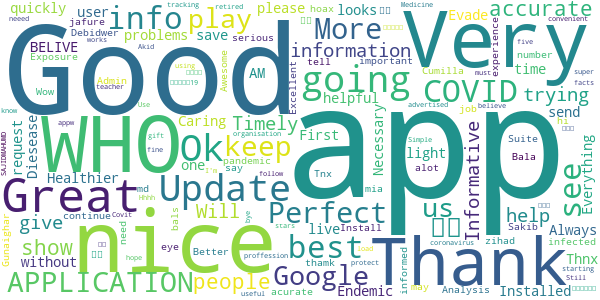
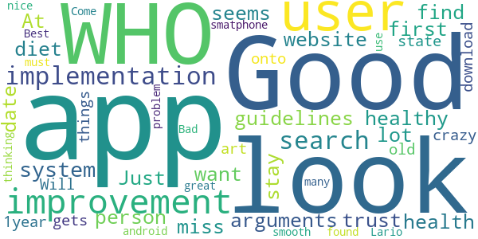
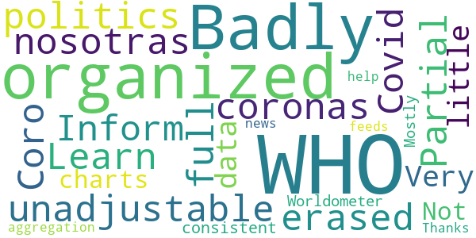
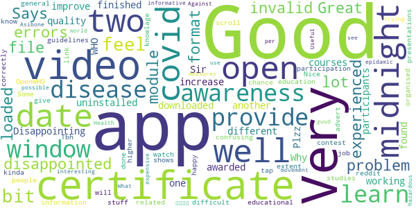
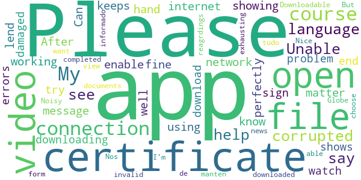
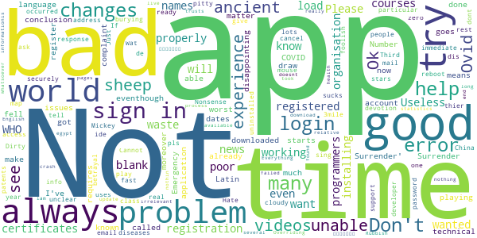

# COVID-related Android apps in Denmark

Author: `Ivano Malavolta` (ivanomalavolta@gmail.com)

Created at: `2020/11/8`

Report generated by the [covid-apps-observer](http://github.com/covid-apps-observer) project, version 0.1

# Table of contents 

- [Background](#background)
    * [Data sources and analyses](#data-sources-and-analyses)
        * [App metadata](#app-metadata)
        * [Requested permissions](#requested-permissions)
        * [Mentioned servers](#mentioned_servers)
        * [Security analysis](#security_analysis)
        * [User ratings and reviews](#user-ratings-and-reviews)
    * [Disclaimer](#disclaimer)
- [WHO Info](#who-info)
- [OpenWHO: Knowledge for Health Emergencies](#openwho-knowledge-for-health-emergencies)
- [Smittestop](#smittestop)

- [Credits](#credits)

# How to read this report

This report has been generated by the [covid-apps-observer](http://github.com/covid-apps-observer) project. The project automatically analyzes the apps by extracting information which is already publicly available either on the web or in the apps binary files. 

Our analysis covers the following apps:
| | |
|-------------------------|-------------------------| 
|  | WHO Info
|  | OpenWHO: Knowledge for Health Emergencies
|  | Smittestop

The details of our analysis are presented in the remainder of this report.

For independent verification, the raw data and the source code of the project is publicly available in its GitHub repository [http://github.com/covid-apps-observer](http://github.com/covid-apps-observer) and its source code has been thoroughly commented in order to provide all the details about how the information provided in this report has been extracted. 

Any feedback, questions, and improvements about the project are very welcome, feel free to create an issue or pull request directly in its GitHub repository: [http://github.com/covid-apps-observer](http://github.com/covid-apps-observer).

## Data sources and analyses

The analysis of each app is structured around five main dimensions: 
* App metadata  
* Requested permissions
* Mentioned servers
* Androwarn analysis
* User ratings and reviews

In the following we describe the data sources and analysis performed for each dimension.

### App metadata

App metadata includes an overview of the main information about the app (for example, its name, releases, privacy policy, etc.), contact information of the development team, and the various Android versions supported by the app. This information is extracted from two main data sources:
* _Google Play store_: we automatically mined the web page of the Google Play store showing the basic information about the app and we parsed it in order to extract information about the app and development team 
* _Android Manifest file_: in our analysis we decompiled the binary file of the app (it is similar to a Zip archive but it contains the code of the app instead of normal files) and we extracted information about the supported Android versions, as it has been listed by its development team.

The extracted app metadata feeds the _App overview_, _Development team_, and _Android support_ sections of this report.
We make use of the [google-play-scraper](https://github.com/JoMingyu/google-play-scraper) tool for extracting the raw data related to this dimension of the project.

### Requested permissions

The Android operating system has a permission model which allows users to grant access to potentially privacy-related information. Every Android app has to explictly declare the permissions it needs to properly function in the Android Manifest file.  

In this report we also show the protection level of each permission, which is a key information for understanding how the requested permissions related to the user's privacy. We carefully analyzed the [official Android documentation (v. 29)](https://developer.android.com/reference/android/Manifest.permission), and it resulted that a permission requested by an Android app can belong to the following protection levels:
* **Dangerous**: higher-risk permissions that would give a requesting app access to private user data or control over the device that can negatively impact the user. Because this type of permission introduces potential risk, the system usually does not automatically grant it to the requesting app. For example, any dangerous permissions requested by an app may be displayed to the user and require confirmation before proceeding.
* **Normal**: this is the default and most common level in Android; normal permissions are lower-risk and give access to isolated app-level features, with minimal risk to other apps, the system, or the user. 
* **Signature**: permissions granted only if the requesting app is signed with the same certificate as the app that declared the permission
* **Appop**: old permission level, a reminiscence of the App Ops tool that Google introduced in Android 4.3.
* **Development**: optional permissions which can be granted to development-oriented apps.
* **Privileged**: permissions who give higher power to mobile apps w.r.t. other apps, such as binding to incoming calls, interacting via bluetooth with other devices without user interaction, etc.
* **Preinstalled**: reserved only for preinstalled apps
* **Installer**: allow the holder to start the permission usage screen for an app
* **RetailDemo**: permissions related to devices used in demonstrations in shops.
* **Pre23**: permissions automatically granted to apps targeting devices running pre-6.0 Android.
* **Upcoming**: permissions which will be released in the next version of the Android platform. 
* **Deprecated**: permissions belonging to old releases of the Android platform, they should not be used by developers since they will not be supported in the near future.
* **Not for use by third-party applications**: permissions which can be requested only by apps developed by Google.
* **Undefined**: this protection level is not documented by Google.

The permissions dimension of this project is based on the [Androguard](https://github.com/androguard/androguard) static analysis tool.

### Mentioned servers

We decompiled each app in order to look for all possible mentions of remote URLs. The mentioned URLs can refer to remote servers the the app is using for either sending or receiving information, web addresses for directing the user to an information website, and so on. 

:warning: It is important to note that this analysis is not meant to be complete and it is very prone to obfuscation. The servers reported here are simply _mentioned_ somewhere in the code of the app and are meant to just give an indication about the "hooks" of the app towards external resources. For example, for an Android app it is normal to contact Google services in order to send/receive push notifications, or to contact the servers of analytics services for having real-time diagnostics about crashes of the app or bugs.

This part of the analysis is based on the [Androguard](https://github.com/androguard/androguard) static analysis tool for identfying the raw URLs mentioned in the app; then, the information about each mentioned server is collected by performing a _whois_ lookup on the first-level domain present in the URL.

### Security analysis

This dimension is based on the [Androwarn](https://github.com/maaaaz/androwarn) structural and data flow analysis of Android bytecode. Androwarn is developed by the University of Lyon/INSA (France) and it has been used in several academic studies. According to its documentation, Androwarn targets the following categories of potential security issues:
* **Telephony identifiers exfiltration**: IMEI, IMSI, MCC, MNC, LAC, CID, operator's name, etc.
* **Device settings exfiltration**: software version, usage statistics, system settings, logs, etc.
* **Geolocation information leakage**: GPS/WiFi geolocation, etc.
* **Connection interfaces information exfiltration**: WiFi credentials, Bluetooth MAC adress, etc.
* **Telephony services abuse**: premium SMS sending, phone call composition, etc.
* **Audio/video flow interception**: call recording, video capture, etc.
* **Remote connection establishment**: socket open call, Bluetooth pairing, APN settings edit, etc.
* **PIM data leakage**: contacts, calendar, SMS, mails, clipboard, etc.
* **External memory operations**: file access on SD card, etc.
* **PIM data modification**: add/delete contacts, calendar events, etc.
* **Arbitrary code execution**: native code using JNI, UNIX command, privilege escalation, etc.
* **Denial of Service**: event notification deactivation, file deletion, process killing, virtual keyboard disable, terminal shutdown/reboot, etc.

Note: We do not consider this data point in the current version of our analyzers since it is too verbose for our purposes.

:warning: It is important to note that Androwarn is a static analysis tool, and as such it performs a variety of heuristics and approximations in its analyses. Said that, the results shown in this report are meant to provide an indication of _potential_ security issues and should be by no means treated as complete and correct.   

### User ratings and reviews

For this dimension we turn again to the web interface of the Google Play store. Firstly, we automatically mine summary statistics about user ratings from the web page of the app under analysis; then, we automatically download the newest 1000 reviews of the app under analysis. For each level of rating (5 stars, 4 stars, , etc., 1 star) we show:
- a word cloud presenting the main terms used by end users in their reviews in the Google Play store
- the last 10 reviews provided by app users in the Google Play store. 

This purposefully simple analysis is meant to help both future users and the development team of the app in understanding what are the main positive and negative points of the app under analysis.

We make use of the [google-play-scraper](https://github.com/JoMingyu/google-play-scraper) tool for extracting the raw data related to this dimension of the project.

## Disclaimer 

This report has been produced independently of any parties and its only objective is to help anybody in better understanding how COVID-related apps work in practice (and compare to each other). The results of this report are limited to the specific version of the software used for running the analyses and on the various heuristics implemented in there. In other words, the results of the analyzers may differ depending on the time and modalities in which they are executed. We do not guarantee that the results of the analyses and the corresponding contents of this report are fully complete or correct. The analysis software is licensed under the [MIT License](https://github.com/iivanoo/covid-apps-observer/blob/master/LICENSE).

# WHO Info
App version ``3.1.1``

Analyzed with [covid-apps-observer](http://github.com/covid-apps-observer) project, version ``0.1``

## App overview
| | |
|-------------------------|-------------------------| 
| **Name**&nbsp;&nbsp;&nbsp;&nbsp;&nbsp;&nbsp;&nbsp;&nbsp;&nbsp;&nbsp;&nbsp;&nbsp;&nbsp;&nbsp;&nbsp;&nbsp;&nbsp;&nbsp;&nbsp;&nbsp;&nbsp;&nbsp;&nbsp;&nbsp;&nbsp;&nbsp;&nbsp;&nbsp;&nbsp;&nbsp;&nbsp;&nbsp;&nbsp;&nbsp;&nbsp;&nbsp;&nbsp;&nbsp;&nbsp;&nbsp;  | WHO Info |
| **Unique identifier** | org.who.infoapp |
| **Link to Google Play** | [https://play.google.com/store/apps/details?id=org.who.infoapp](https://play.google.com/store/apps/details?id=org.who.infoapp) |
| **Summary**  | The official World Health Organization Information App. |
| **Privacy policy** | [https://www.who.int/about/who-we-are/privacy-policy](https://www.who.int/about/who-we-are/privacy-policy) |
| **Latest version** | 3.1.1 |
| **Last update** | 2020-10-30 13:25:32 |
| **Recent changes** | This release addresses an issue related to Covid-19 case numbers reported to WHO. |
| **Installs**  | 100,000+ |
| **Category** | News & Magazines |
| **First release** | Apr 13, 2020 |
| **Size**  | 11M |
| **Supported Android version**  | 4.2 and up |

### Description
> Have the latest health information at your fingertips with the official World Health Organization Information App. This app displays the latest news, events, features and breaking updates on outbreaks. 
  
 WHO works worldwide to promote health, keep the world safe, and serve the vulnerable. 
 Our goal is to ensure that a billion more people have universal health coverage, to protect a billion more people from health emergencies, and provide a further billion people with better health and well-being.

### User interface
The developers of the app provide the following screenshots in the Google play store.
| | | |
|:-------------------------:|:-------------------------:|:-------------------------:|
 |   |   |   | 
 |   |   |   | 
 |   |   |   | 
 |   |   |   | 
 |   |   |   | 
 |   |   |   | 
 |   |   |   | 
 |   |   |   | 

## Development team
In the following we report the main information provided by the development team in the Google play store.

| | |
|-------------------------|-------------------------|
| **Developer**  | World Health Organization |
| **Website**  | [https://www.who.int/](https://www.who.int/) |
| **Email** | dcx@who.int |
| **Physical address**  | [Avenu Appia 20 1211 Geneva Switzerland](https://www.google.com/maps/search/Avenu%20Appia%2020%201211%20Geneva%20Switzerland) (Google Maps) |
| **Other developed apps**  | [https://play.google.com/store/apps/developer?id=World+Health+Organization](https://play.google.com/store/apps/developer?id=World+Health+Organization) |

## Android support

| | |
|-------------------------|-------------------------|
| **Declared target Android version**  | - |
| **Effective target Android version**  | - |
| **Minimum supported Android version**  | Jelly Bean, version 4.2.x (API level 17) |
| **Maximum target Android version**  | - |

The larger the difference between the minimum and maximum supported Android versions, the better. A larger difference means a wider audience. For example, old phones have a very low Android version, so a high minimum supported Android version means that the app cannot be used by users with old phones, thus leading to accessibility problems. 

## Requested permissions

In the following we report the complete list of the permissions requested by the app. 

| **Permission** | **Protection level** | **Description** | 
|-------------------------|-------------------------|-------------------------|
 **android.permission ACCESS_NETWORK_STATE** | Normal | Allows applications to access information about networks. 
 **android.permission INTERNET** | Normal | Allows applications to open network sockets. 
 **android.permission READ_CALENDAR** | :warning:**Dangerous** | Allows an application to read the user's calendar data. 
 **android.permission READ_EXTERNAL_STORAGE** | :warning:**Dangerous** | Allows an application to read from external storage. 
 **android.permission WAKE_LOCK** | Normal | Allows using PowerManager WakeLocks to keep processor from sleeping or screen from dimming. 
 **android.permission WRITE_CALENDAR** | :warning:**Dangerous** | Allows an application to write the user's calendar data. 
 **android.permission WRITE_EXTERNAL_STORAGE** | :warning:**Dangerous** | Allows an application to write to external storage. 
 **com.google.android.c2dm.permission RECEIVE** | - | - 
 **com.google.android.finsky.permission BIND_GET_INSTALL_REFERRER_SERVICE** | - | - 

## Mentioned servers

| **Server** | **Registrant** | **Registrant country** | **Creation date** | 
|-------------------------|-------------------------|-------------------------|-------------------------|
 | adobe.com | Adobe Inc. | :us: US | 1986-11-17 05:00:00 |
 | googlesyndication.com | Google LLC | :us: US | 2003-01-21 06:17:24 |
 | google.com | Google LLC | :us: US | 1997-09-15 04:00:00 |
 | app-measurement.com | Google LLC | :us: US | 2015-06-19 20:13:31 |
 | googleapis.com | Google LLC | :us: US | 2005-01-25 17:52:26 |
 | googleadservices.com | Google LLC | :us: US | 2003-06-19 16:34:53 |

## Security analysis 

Below we report the main security warnings raised by our execution of the [Androwarn](https://github.com/maaaaz/androwarn) security analysis tool.

**Connection interfaces exfiltration**
> - This application reads details about the currently active data network 
> - This application tries to find out if the currently active data network is metered 

**Suspicious connection establishment**
> - This application opens a Socket and connects it to the remote address 'Lfi/iki/elonen/NanoHTTPD$ResponseException;' on the 'N/A' port  
> - This application opens a Socket and connects it to the remote address 'NanoHttpd Shutdown' on the 'N/A' port  

**Code execution**
> - This application loads a native library: 'NativeScript' 
> - This application executes a UNIX command containing this argument: '2' 

## User ratings and reviews

Below we provide information about how end users are reacting to the app in terms of ratings and reviews in the Google Play store.

### Ratings

The WHO Info app has been installed by more than **100000** times. At this time, **1023** rated the app and its average score is **3.6470587**. Below we show the distribution of the ratings across the usual star-based rating of Google Play

:star::star::star::star::star:: 562

:star::star::star::star:: 90

:star::star::star:: 70

:star::star:: 50

:star:: 251

### Reviews 

#### 5-star reviews

> Always the best one!  :date: __2020-11-04 22:22:46__

> Great app  :date: __2020-11-03 15:50:52__

> Good  :date: __2020-10-31 20:49:42__

> 😊😊😊  :date: __2020-10-21 18:17:56__

> I. AM. BELIVE. W. H. O  :date: __2020-10-04 06:51:53__

> I like to see a update on what's going on please  :date: __2020-09-23 12:20:19__

> First time user, but the app looks helpful.  :date: __2020-09-16 19:17:57__

> I request WHO info App. to send Update on Everything Necessary for Healthier Caring to Evade the light of the Endemic Diesease COVID 19 Exposure. G-Suite Admin.  :date: __2020-09-06 03:01:26__

> Perfect  :date: __2020-08-29 03:21:09__

> More experience  :date: __2020-08-28 20:01:16__

#### 4-star reviews

> Not sure yet  :date: __2020-09-27 08:50:53__

> Excellent engineering tools. Your whatsapp number please.  :date: __2020-08-05 11:01:52__

> all the demand who it is hey  :date: __2020-07-20 15:10:48__

> Using this more and more. After the cdc called religion an essential. I don't know what whackadoodle besides trump/pence is messing with the info. Thank you for being a more logical alternative. As usa is being pulled back by whackadoodles and foreign commies.  :date: __2020-07-17 03:09:14__

> Nice  :date: __2020-07-08 17:19:26__

> good  :date: __2020-06-03 00:37:10__

> It's just information, not the actual tracker. But has plenty of information that's 100% accurate.  :date: __2020-05-31 02:37:20__

> I really want to appreciate Dr. Aliu Sam for using his natural roots and herbs medicine to cure me of Syphilis Since 11 months now I have been living with this disease and it has been giving me challenges, I was so perplexed cause I have been taking several drugs to be cured but all have been in vain. One morning I was browsing through the Internet then i saw several testimonies about Dr. Aliu Sam curing people off verious diseases and immediately I contacted Dr. Aliu Sam I told himabout my trou  :date: __2020-05-08 05:33:57__

> It did not detect  :date: __2020-04-29 18:37:26__

> Could do with more accurate information to keep people alive. But no harm done.  :date: __2020-04-29 13:41:12__

#### 3-star reviews

> A good improvement could be the implementation of a search system for arguments that a person want to find ( like the guidelines about health and healthy diet). At first look seems it miss a lot from the website.  :date: __2020-09-27 10:09:16__

> Good App but I don't trust the WHO. Just have the app to stay up to date with the crazy things the WHO gets up to  :date: __2020-07-29 10:34:08__

> Will not download onto my 1year old state of the art smatphone. Bad, as a user of many android apps what are you thinking. I have found more than 3700 other users that can not use this app. Come on you must no you have problem.  :date: __2020-05-26 02:04:59__

> Good  :date: __2020-05-14 21:22:11__

> Best.  :date: __2020-04-20 13:14:33__

> Looks nice great look smooth Lario  :date: __2020-04-18 09:44:30__

#### 2-star reviews

> Coro nosotras coronas  :date: __2020-07-02 06:41:55__

> Partial  :date: __2020-06-22 12:24:23__

> Learn more  :date: __2020-06-15 23:35:50__

> WHO Inform Covid 19  :date: __2020-05-24 17:14:56__

> Very little data or charts. Not consistent with Worldometer. Mostly an aggregation of news feeds about WHO  :date: __2020-05-15 15:38:10__

> Thanks for your help.  :date: __2020-04-22 18:52:40__

#### 1-star reviews

> A wast of time  :date: __2020-11-04 13:04:20__

> “‘Ovid’ is Latin for a sheep. COVID starts with a C, which also means ‘see’ in ancient language. 19 was known as the “Number of Surrender” in ancient times.”  It goes on to draw the conclusion, “C-OVID 19 = ‘See a Sheep Surrender'”.  :date: __2020-11-02 08:06:17__

> Very scammers  :date: __2020-10-19 19:45:47__

> I just downloaded it, but every time I open it just say "an error occur check your connectivity" or something like that... didn't work...  :date: __2020-10-10 17:24:54__

> Does not work  :date: __2020-10-09 00:12:33__

> This is your official application? and sometimes it doesn't work  :date: __2020-10-07 18:26:16__

> I am not able to download it fully its no use to me as i am a type1 Diabetic and Asthmatic i am also in 3rd degree Kidney Failure.  :date: __2020-09-29 02:20:05__

> WHO TRUSTS WHO NOW ¿¿?!?????  :date: __2020-09-25 02:07:50__

> This app sucks  :date: __2020-09-14 21:01:10__

> Every time i open the app,doesnt work just tells us error on my huawei lite p7. Please developer work on it.  :date: __2020-08-18 11:59:51__

# OpenWHO: Knowledge for Health Emergencies
App version ``3.6``

Analyzed with [covid-apps-observer](http://github.com/covid-apps-observer) project, version ``0.1``

## App overview
| | |
|-------------------------|-------------------------| 
| **Name**&nbsp;&nbsp;&nbsp;&nbsp;&nbsp;&nbsp;&nbsp;&nbsp;&nbsp;&nbsp;&nbsp;&nbsp;&nbsp;&nbsp;&nbsp;&nbsp;&nbsp;&nbsp;&nbsp;&nbsp;&nbsp;&nbsp;&nbsp;&nbsp;&nbsp;&nbsp;&nbsp;&nbsp;&nbsp;&nbsp;&nbsp;&nbsp;&nbsp;&nbsp;&nbsp;&nbsp;&nbsp;&nbsp;&nbsp;&nbsp;  | OpenWHO: Knowledge for Health Emergencies |
| **Unique identifier** | de.xikolo.openwho |
| **Link to Google Play** | [https://play.google.com/store/apps/details?id=de.xikolo.openwho](https://play.google.com/store/apps/details?id=de.xikolo.openwho) |
| **Summary**  | Life-saving knowledge for frontline responders in health emergencies. |
| **Privacy policy** | [https://openwho.org/pages/privacy](https://openwho.org/pages/privacy) |
| **Latest version** | 3.6 |
| **Last update** | 2020-10-08 13:10:39 |
| **Recent changes** | - Bug fixes and performance improvements |
| **Installs**  | 1,000,000+ |
| **Category** | Education |
| **First release** | May 17, 2017 |
| **Size**  | 18M |
| **Supported Android version**  | 5.0 and up |

### Description
> OpenWHO is the World Health Organization's (WHO) interactive knowledge-transfer platform offering online courses to improve the response to health emergencies. OpenWHO enables the Organization and its key partners to transfer life-saving knowledge to large numbers of frontline responders.
 With OpenWHO, you have the flexibility to learn at your convenience. Watch the short video lectures and test your knowledge with self-tests when and where you like. The course forum and the collaboration space allow you to get in touch with other participants and experts around the world.
  
 Designed primarily for health care workers, frontline responders, and decision-makers, the app is also a source of information for those affected by disease outbreaks and health emergencies, or for those with a general interest in WHO's work in health emergencies.
  
 It features 6 channels:
 - The <b>Outbreak</b> channel addresses the management of infectious diseases and provides life-saving, scientific information.
 - The <b>Ready for Response</b> channel helps prepare personnel who are training for deployment to work in disease outbreaks and health emergencies.
 - The <b>Get Social</b> channel focuses on social science-based interventions and helps to communicate with affected communities.
 - The <b>Preparing for Pandemics</b> channel brings together courses on various aspects of preparedness, including surveillance, public health measures and risk communication during a pandemic.
 - The <b>COVID-19</b> channel provides learning resources in WHO's 6 official languages (Arabic, Chinese, English, French, Russian and Spanish) for health professionals, decision-makers and the public for the outbreak of coronavirus disease (COVID-19).
 - The <b>COVID-19 National Languages</b> channel provides the same learning resources as the COVID-19 channel but in national languages, such as Indonesian, Japanese and Portuguese. 
  
 OpenWHO courses are available in many languages, including WHO's 6 official languages. 
  
 Download the app now, and join the OpenWHO community.
 This app is developed in cooperation between the Hasso Plattner Institute and the WHO. The learning content is provided exclusively by the WHO.

### User interface
The developers of the app provide the following screenshots in the Google play store.
| | | |
|:-------------------------:|:-------------------------:|:-------------------------:|
 |   |   |   | 
 |   |   |   | 

## Development team
In the following we report the main information provided by the development team in the Google play store.

| | |
|-------------------------|-------------------------|
| **Developer**  | HPI Knowledge Engineering Team |
| **Website**  | [https://openwho.org/](https://openwho.org/) |
| **Email** | openwho-support@hpi.de |
| **Physical address**  | [Prof.-Dr.-Helmert-Str.2-3 14482 Potsdam](https://www.google.com/maps/search/Prof.-Dr.-Helmert-Str.2-3%2014482%20Potsdam) (Google Maps) |
| **Other developed apps**  | [https://play.google.com/store/apps/developer?id=7185448023325736337](https://play.google.com/store/apps/developer?id=7185448023325736337) |

## Android support

| | |
|-------------------------|-------------------------|
| **Declared target Android version**  | - |
| **Effective target Android version**  | - |
| **Minimum supported Android version**  | Lollipop, version 5.0 (API level 21) |
| **Maximum target Android version**  | - |

The larger the difference between the minimum and maximum supported Android versions, the better. A larger difference means a wider audience. For example, old phones have a very low Android version, so a high minimum supported Android version means that the app cannot be used by users with old phones, thus leading to accessibility problems. 

## Requested permissions

In the following we report the complete list of the permissions requested by the app. 

| **Permission** | **Protection level** | **Description** | 
|-------------------------|-------------------------|-------------------------|
 **android.permission ACCESS_NETWORK_STATE** | Normal | Allows applications to access information about networks. 
 **android.permission ACCESS_WIFI_STATE** | Normal | Allows applications to access information about Wi-Fi networks. 
 **android.permission DOWNLOAD_WITHOUT_NOTIFICATION** | - | - 
 **android.permission FOREGROUND_SERVICE** | Normal | Allows a regular application to use Service.startForeground. 
 **android.permission INTERNET** | Normal | Allows applications to open network sockets. 
 **android.permission RECEIVE_BOOT_COMPLETED** | Normal | Allows an application to receive the Intent.ACTION_BOOT_COMPLETED that is broadcast after the system finishes booting. 
 **android.permission WAKE_LOCK** | Normal | Allows using PowerManager WakeLocks to keep processor from sleeping or screen from dimming. 
 **android.permission WRITE_EXTERNAL_STORAGE** | :warning:**Dangerous** | Allows an application to write to external storage. 
 **com.google.android.c2dm.permission RECEIVE** | - | - 
 **com.google.android.finsky.permission BIND_GET_INSTALL_REFERRER_SERVICE** | - | - 

## Mentioned servers

| **Server** | **Registrant** | **Registrant country** | **Creation date** | 
|-------------------------|-------------------------|-------------------------|-------------------------|
 | googlesyndication.com | Google LLC | :us: US | 2003-01-21 06:17:24 |
 | google.com | Google LLC | :us: US | 1997-09-15 04:00:00 |
 | apple.com | Apple Inc. | :us: US | 1987-02-19 05:00:00 |
 | aomedia.org | Contact Privacy Inc. Customer 1243324949 | :canada: CA | 2015-08-24 14:07:31 |
 | dashif.org | VTM Group | :us: US | 2012-04-27 13:02:46 |
 | app-measurement.com | Google LLC | :us: US | 2015-06-19 20:13:31 |
 | w3.org | W3C | :us: US | 1994-07-06 04:00:00 |
 | googleapis.com | Google LLC | :us: US | 2005-01-25 17:52:26 |
 | psdev.de | - | - | - |
 | xmlpull.org | WhoisGuard, Inc. | PA | 2001-11-26 20:33:08 |
 | someurl.com | WhoisGuard, Inc. | PA | 2000-02-08 15:50:35 |
 | crashlytics.com | Google LLC | :us: US | 2011-01-21 15:30:40 |
 | apache.org | The Apache Software Foundation | :us: US | 1995-04-11 04:00:00 |
 | opensource.org | Open Source Initiative | :us: US | 1998-02-11 05:00:00 |
 | creativecommons.org | Creative Commons Corporation | :canada: CA | 2001-01-15 16:51:44 |
 | eclipse.org | Eclipse.org Foundation, Inc. | :canada: CA | 1997-04-14 04:00:00 |
 | gnu.org | Free Software Foundation | :us: US | 1995-11-24 05:00:00 |
 | mozilla.org | Mozilla Corporation | :us: US | 1998-01-24 05:00:00 |
 | googleadservices.com | Google LLC | :us: US | 2003-06-19 16:34:53 |

## Security analysis 

Below we report the main security warnings raised by our execution of the [Androwarn](https://github.com/maaaaz/androwarn) security analysis tool.

**Telephony identifiers leakage**
> - This application reads the ISO country code equivalent of the current registered operator's MCC (Mobile Country Code) 

**Connection interfaces exfiltration**
> - This application reads details about the currently active data network 
> - This application tries to find out if the currently active data network is metered 

**Suspicious connection establishment**
> - This application opens a Socket and connects it to the remote address ' returned no addresses for  ; port is out of range' on the 'N/A' port  
> - This application opens a Socket and connects it to the remote address '' on the 'N/A' port  
> - This application opens a Socket and connects it to the remote address 'Ljava/lang/StringBuilder;->toString()Ljava/lang/String;' on the 'N/A' port  
> - This application opens a Socket and connects it to the remote address 'Ljava/net/Proxy;->type()Ljava/net/Proxy$Type;' on the 'N/A' port  
> - This application opens a Socket and connects it to the remote address 'timeout' on the 'N/A' port  

**Code execution**
> - This application loads a native library 

## User ratings and reviews

Below we provide information about how end users are reacting to the app in terms of ratings and reviews in the Google Play store.

### Ratings

The OpenWHO: Knowledge for Health Emergencies app has been installed by more than **1000000** times. At this time, **3293** rated the app and its average score is **4.2636366**. Below we show the distribution of the ratings across the usual star-based rating of Google Play

:star::star::star::star::star:: 2297

:star::star::star::star:: 359

:star::star::star:: 169

:star::star:: 149

:star:: 319

### Reviews 

#### 5-star reviews

> Good  :date: __2020-11-06 18:32:20__

> Knowledgebase  :date: __2020-11-03 14:05:53__

> thank you so much for app developer  :date: __2020-10-26 06:14:47__

> WHO is really helping the future workers  :date: __2020-10-17 05:46:26__

> Great  :date: __2020-10-16 21:35:14__

> This is really nice and helpful. I really ful to WHO to give us such opportunities to learn many of about health care. And to give us opportunities to learn free and get record of achievement which encourage us to learn more and more.  :date: __2020-10-09 18:45:37__

> It's an incredible app  :date: __2020-10-08 18:52:11__

> I. AM. BELIVE W.H.O  :date: __2020-10-07 07:29:41__

> It's educative  :date: __2020-10-01 11:38:30__

> This app won't open.  :date: __2020-10-01 04:43:02__

#### 4-star reviews

> Online course class is use full  :date: __2020-07-17 11:52:09__

> Excellent information but less attractive for the most  :date: __2020-07-02 17:54:08__

> Good working  :date: __2020-06-28 08:53:05__

> Could you please host the videos also on YouTube, since we cannot access the Vimeo Platform here in Indonesia. Thank you.  :date: __2020-06-24 07:38:57__

> Good source of information  :date: __2020-06-20 09:36:05__

> Excellent Direction~  :date: __2020-06-19 14:08:55__

> Mast  :date: __2020-06-13 09:10:54__

> Good app of thh halt.  :date: __2020-05-31 05:25:43__

> Arch. eng.  :date: __2020-05-22 01:54:14__

> Good  :date: __2020-05-17 08:09:21__

#### 3-star reviews

> I feel a bit disappointed, experienced a lot of errors. My module and videos can't be loaded.  :date: __2020-07-26 17:32:06__

> Great app, but my only problem is that I can't open my certificate file. Says invalid format. Disappointing 😭  :date: __2020-07-23 02:09:56__

> Videos were not working only, so I uninstalled it.  :date: __2020-07-18 08:42:28__

> I have finished two courses on two different date(one before midnight, another after midnight) but found same date on both while I downloaded Certificates. Why is this?  :date: __2020-06-11 19:18:50__

> covid  :date: __2020-06-11 18:37:22__

> Sir, Plzz improve the quality of the certificate awarded by the WHO to the participants to increase more & more participation as well as awareness of the people in this contest organised by OpenWHO.  :date: __2020-05-24 16:44:50__

> Some extent it's very good and its provide guidelines to advert disease.  :date: __2020-05-23 18:33:55__

> Nice app however difficult to watch video presentations  :date: __2020-05-14 19:35:42__

> Very confusing. not happy with the link. I don't know if I have done it correctly.  :date: __2020-05-12 22:12:31__

> Tbh this app is kinda like reddit, you can scroll through windows that shows general knowlage, then you can tap into that window for more information. It's a good app to learn about stuff  :date: __2020-05-09 13:39:53__

#### 2-star reviews

> The app keeps showing me this message (please enable network connection) when I open it, don't know why ?? My internet connection is working fine and I am using all the other apps perfectly well. Can you lend me a hand in this matter.  :date: __2020-11-08 08:31:34__

> After downloading the certificate at the end of the course when u try to open it. It says the file is corrupted or damaged  :date: __2020-09-23 14:26:48__

> Unable to watch the video or download the video.  :date: __2020-08-08 15:29:04__

> I can't open the certificate. Please help me out of this problem  :date: __2020-07-31 05:25:00__

> It shows errors again and again,Can't sign in  :date: __2020-06-26 16:11:53__

> I completed a course and then downloaded certificate it ... But I'm unable too see my certificate as it say corrupted file or invalid file. Please help with reagrdings to it.  :date: __2020-05-27 13:14:22__

> Noisy app.  :date: __2020-04-21 21:34:45__

> Nice  :date: __2020-04-09 16:25:41__

> Please , i want the App in the form of the Globe.  :date: __2020-04-05 14:35:33__

> Nos manten informado de tudo  :date: __2020-03-22 08:51:43__

#### 1-star reviews

> The videos are not playing eventhough I've downloaded them  :date: __2020-11-03 10:43:38__

> “‘Ovid’ is Latin for a sheep. COVID starts with a C, which also means ‘see’ in ancient language. 19 was known as the “Number of Surrender” in ancient times.”  It goes on to draw the conclusion, “C-OVID 19 = ‘See a Sheep Surrender'”.  :date: __2020-11-02 08:04:58__

> Very bad experience i got unable to login very bad i fell worst experience  :date: __2020-09-26 10:55:02__

> Ok  :date: __2020-08-10 23:31:14__

> This is called an "Emergency" app but requires registration? Very disappointing.  :date: __2020-08-06 20:55:46__

> unable to make account and register, also not able to login.  :date: __2020-08-04 11:59:45__

> I can't Login no matter how much I try.  :date: __2020-07-04 14:19:09__

> This app is having technical issues  :date: __2020-07-03 17:13:33__

> Not a good application....It always changes names in certificates and it changes dates also moreover i have done courses and it changes there names also in certificates...so many problems...now what to do  :date: __2020-07-02 03:49:39__

> Not sign in properly many time errors.. Please help me out of this problem. I already registered a complaint that particular problem through mail.  :date: __2020-06-16 05:10:29__

# Smittestop
App version ``1.2``

Analyzed with [covid-apps-observer](http://github.com/covid-apps-observer) project, version ``0.1``

## App overview
| | |
|-------------------------|-------------------------| 
| **Name**&nbsp;&nbsp;&nbsp;&nbsp;&nbsp;&nbsp;&nbsp;&nbsp;&nbsp;&nbsp;&nbsp;&nbsp;&nbsp;&nbsp;&nbsp;&nbsp;&nbsp;&nbsp;&nbsp;&nbsp;&nbsp;&nbsp;&nbsp;&nbsp;&nbsp;&nbsp;&nbsp;&nbsp;&nbsp;&nbsp;&nbsp;&nbsp;&nbsp;&nbsp;&nbsp;&nbsp;&nbsp;&nbsp;&nbsp;&nbsp;  | Smittestop |
| **Unique identifier** | com.netcompany.smittestop_exposure_notification |
| **Link to Google Play** | [https://play.google.com/store/apps/details?id=com.netcompany.smittestop_exposure_notification](https://play.google.com/store/apps/details?id=com.netcompany.smittestop_exposure_notification) |
| **Summary**  | Infect Stops is the official Ministry of Health and Elderly&#39;s COVID-19 app. |
| **Privacy policy** | [https://www.smittestop.dk/databeskyttelse](https://www.smittestop.dk/databeskyttelse) |
| **Latest version** | 1.2 |
| **Last update** | 2020-10-22 14:34:22 |
| **Recent changes** | Optimering af kontaktopsporing |
| **Installs**  | 500,000+ |
| **Category** | Medical |
| **First release** | Jun 17, 2020 |
| **Size**  | 304M |
| **Supported Android version**  | 6.0 and up |

### Description
> Hent appen, og hjælp med at stoppe smittespredning af COVID-19 i Danmark.
  
 Appen smitte
 stop giver os alle sammen mulighed for at være med til at stoppe udbredelsen af COVID-19 i Danmark. Smitte
 stop skal sammen med anbefalingerne fra myndighederne hjælpe os med at passe godt på hinanden, mens samfundet genåbner. 
  
 Med smitte
 stop kan du være med til at bryde smittekæder. Smitte
 stop giver dig mulighed for at få besked, når du har været tæt på en anden bruger af appen, der har fået COVID-19. På den måde, kan du hurtigt følge sundhedsmyndighedernes anbefalinger og derved bryde en mulig smittekæde. Du kan give besked til andre brugere af appen, hvis du bliver testet positiv. De kan ikke se, hvem du er.
 Det er frivilligt at hente og anvende appen, men jo flere, der anvender den, jo flere smittekæder kan appen hjælpe med at bremse. 
  
 Hvordan fungerer smitte
 stop?
 • Når du aktiverer smitte
 stop, bruger din telefon tilfældige Bluetooth-ID’er til at finde ud af, om du muligvis har været tæt på nogen, der har oplyst i appen, at de har COVID-19. De tilfældige ID’er bliver lagret på din telefon og forlader kun din telefon, når du frivilligt og aktivt giver besked i appen med dit NemID, at du har COVID-19.
 • Smitte
 stop bruger din telefons ’Notifikationer om eksponering for COVID-19’, som er udviklet af Apple og Google. 
 • Ingen kan se, hvem du er, og du kan ikke se, hvem du har opholdt dig tæt på. 
 • Ingen myndigheder eller virksomheder har adgang til oplysninger om, hvem du har været i nærheden af, eller hvis du i appen får besked om, at du har været tæt på en COVID-19-positiv
 • Appen bruger ikke GPS til at registrere data  om, hvor du befinder dig.
 • To telefoner genkender hinanden via appen og udveksler tilfældige ID’er gennem bluetooth. 
  
 Arbejdet med at udvikle appens funktioner sker løbende. 
  
 Ved at downloade smitte
 stop accepterer du Vilkår og betingelser. Du skal give samtykke, når du har downloadet appen. 
  
 Smitte
 stop er udviklet af Sundheds- og Ældreministeriet i samarbejde med Styrelsen for Patientsikkerhed, Statens Serum Institut, Sundhedsstyrelsen og Digitaliseringsstyrelsen. Læs mere om appen på: www.smittestop.dk.

### User interface
The developers of the app provide the following screenshots in the Google play store.
| | | |
|:-------------------------:|:-------------------------:|:-------------------------:|
 |   |   |   | 

## Development team
In the following we report the main information provided by the development team in the Google play store.

| | |
|-------------------------|-------------------------|
| **Developer**  | Sundheds- og Ældreministeriet |
| **Website**  | [https://www.smittestop.dk](https://www.smittestop.dk) |
| **Email** | info@sundhed.dk |
| **Physical address**  | [Sundheds- og Ældreministeriet Holbergsgade 6, 1057 København K, Denmark](https://www.google.com/maps/search/Sundheds-%20og%20Ældreministeriet%20Holbergsgade%206,%201057%20København%20K,%20Denmark) (Google Maps) |
| **Other developed apps**  | [https://play.google.com/store/apps/developer?id=Sundheds-+og+%C3%86ldreministeriet](https://play.google.com/store/apps/developer?id=Sundheds-+og+%C3%86ldreministeriet) |

## Android support

| | |
|-------------------------|-------------------------|
| **Declared target Android version**  | Android10, version 10 (API level 29) |
| **Effective target Android version**  | Android10, version 10 (API level 29) |
| **Minimum supported Android version**  | Marshmallow, version 6.0 (API level 23) |
| **Maximum target Android version**  | - |

The larger the difference between the minimum and maximum supported Android versions, the better. A larger difference means a wider audience. For example, old phones have a very low Android version, so a high minimum supported Android version means that the app cannot be used by users with old phones, thus leading to accessibility problems. 

## Requested permissions

In the following we report the complete list of the permissions requested by the app. 

| **Permission** | **Protection level** | **Description** | 
|-------------------------|-------------------------|-------------------------|
 **android.permission ACCESS_NETWORK_STATE** | Normal | Allows applications to access information about networks. 
 **android.permission BLUETOOTH** | Normal | Allows applications to connect to paired bluetooth devices. 
 **android.permission FOREGROUND_SERVICE** | Normal | Allows a regular application to use Service.startForeground. 
 **android.permission INTERNET** | Normal | Allows applications to open network sockets. 
 **android.permission RECEIVE_BOOT_COMPLETED** | Normal | Allows an application to receive the Intent.ACTION_BOOT_COMPLETED that is broadcast after the system finishes booting. 
 **android.permission WAKE_LOCK** | Normal | Allows using PowerManager WakeLocks to keep processor from sleeping or screen from dimming. 

## Mentioned servers

| **Server** | **Registrant** | **Registrant country** | **Creation date** | 
|-------------------------|-------------------------|-------------------------|-------------------------|
 | google.com | Google LLC | :us: US | 1997-09-15 04:00:00 |
 | googleapis.com | Google LLC | :us: US | 2005-01-25 17:52:26 |

## Security analysis 

Below we report the main security warnings raised by our execution of the [Androwarn](https://github.com/maaaaz/androwarn) security analysis tool.

**Connection interfaces exfiltration**
> - This application reads details about the currently active data network 
> - This application tries to find out if the currently active data network is metered 

**Code execution**
> - This application loads a native library: 'mono-native' 
> - This application loads a native library: 'monodroid' 
> - This application loads a native library: 'monosgen-2.0' 
> - This application loads a native library: 'xamarin-app' 
> - This application loads a native library: 'xamarin-debug-app-helper' 

## User ratings and reviews

Below we provide information about how end users are reacting to the app in terms of ratings and reviews in the Google Play store.

### Ratings

The Smittestop app has been installed by more than **500000** times. At this time, **1282** rated the app and its average score is **2.469697**. Below we show the distribution of the ratings across the usual star-based rating of Google Play

:star::star::star::star::star:: 262

:star::star::star::star:: 146

:star::star::star:: 116

:star::star:: 165

:star:: 593

### Reviews 

#### 5-star reviews

> The effort to help is worthy 5 stars  :date: __2020-10-07 15:31:28__

> Det ville fandme være smart, hvis alle havde den app her!  :date: __2020-09-29 22:46:47__

> Du skal downloade denne app så kan du føle dig lidt mere sikker i det offentlige!  :date: __2020-09-24 17:28:21__

> Cannot start on android 11. For others, Android 11 enables to use it without actually having location on. (Google thing)  :date: __2020-09-13 00:21:30__

> Awesome  :date: __2020-08-21 00:40:31__

> Jeg regner med, at appen gør det, den skal. Jeg har ikke fået nogen notifikationer om, at jeg har været i kontakt med en smittet, men ikke alle har den installeret. Det burde virkelig være en indbygget del af operativsystemet, som også kunne anvendes i fremtiden. Jeg stoler personligt nok på Apple og Google til det, men det forstår jeg også godt, hvis andre ikke nødvendigvis gør.  :date: __2020-08-19 13:00:07__

> Virker nu. Den bør vœre obligatorisk.  :date: __2020-08-18 08:40:15__

> very good app, use it to track hot singles nearby  :date: __2020-08-08 17:34:24__

> Useful without being needlessly complicated. The FAQ section gives really good responses to questions and concerns people might have.  :date: __2020-07-31 22:46:21__

> Hello, i love this apps, i dont understand why people dont like sharing their location... If they are letting to cookies to facebook, browsers, etc. which are doing the same thing... I have question, does this work With Croatian COVID-19 Ministry of Health?  :date: __2020-07-31 10:21:12__

#### 4-star reviews

> Make it available also in english. Tak!  :date: __2020-09-27 15:44:33__

> Eagerly awaiting a bugfix for the bug that's in the news. And please allow detecting contacts across a phone "backup, wipe, restore" sequence, as the backup app reported that you don't. Desired bonus featue: Basic stats display like "Active for XX hours with XX different IDs, XXX anonymous contact IDs recorded, 0 contact IDs were infectious, you are NOT registered as infected, latest list of infectIous IDs downloaded yesterday at HH:MM".  :date: __2020-09-26 13:20:28__

> Foreslag: Lav en "Del" knap så man kan sende et direkte link til app'en i App/Play Store via diverse besked apps. Specielt nyttigt for den gruppe der har svært ved at overskue opgaven, selv at skulle søge og downloade app'en.  :date: __2020-09-21 07:41:45__

> Take google and apple out!  :date: __2020-09-12 17:10:38__

> Works, I guess. Needs english version asap for the students and other internationals, though  :date: __2020-08-09 14:14:52__

> To increase trust and adoption this app should be made open source. That way, we all could have a look at the code to see if there's any privacy breach, and could even contribute with an English translation for the app. Plus, Denmark would set the example and other countries would follow. You might think that an open source app is more vuneravle to attacks but this is a very naïve arguments: vulnerabilities are exposed and fixed faster.  :date: __2020-08-07 08:44:54__

> App'en driller, når telefonen sættes i flytilstand og app'en ikke kører helt i baggrunden. Når app'en har et GUI åben, når bluetooth forsvinder, kommer en dialogboks frem, som kræver ny godkendelse af BT. Hvis app'en derimod kører uden GUI, så tåler den fint at BT forsvinder og dukker op igen. Den dialogboks i GUI.-tilstand bør rettes.  :date: __2020-08-04 18:50:15__

> Fint initiativ, app'en er nem at forstå når først den er aktiv. Dog er der alt for meget at læse under første opstart, det bør gemmes væk under en "mere info" - knap. Nogle giver op undervejs. Det alvorligste problem med app'en er dog at så få kender til dens eksistens, i min omgangskreds blandt familie, venner og kolleger er det kun få. Send dog en opfordring via e-Boks og SMS til alle borgere, som man gjorde om smitten i begyndelsen af epidemien!  :date: __2020-07-25 08:35:09__

> Ville være fint hvis den gav en mere synlig påmindelse når den af den ene eller anden årsag bliver offline. Ellers super simpel at sætte op og bruge.  :date: __2020-07-22 09:56:46__

> I guess it works  :date: __2020-07-12 14:22:36__

#### 3-star reviews

> Intentionen er prisværdig men udførelsen halter: I default-konfigurationen, hvor batteri-optimering er aktiv, kan baggrundschecket uprovokeret gå i stå uden at brugeren advares. Fylder 3 gange så meget som andre landes tilsvarende apps. Dvs. apps der også benytter Apple/Googles notifikations-system. Ej open-source.  :date: __2020-10-18 22:00:15__

> Can i change the language to english?  :date: __2020-10-03 21:45:17__

> On my phone, background exposure checks are not regularly performed. Last one was 5 days ago (!), in the past 14 days only 8 checks were made. I suspect this is an API issue rather than an app issue, but it seriously decreases effectiveness of the app. I wonder if it might be possible to add a manual "check now" button.  :date: __2020-09-30 19:53:17__

> Virker som det skal men en så vigtig app som denne burde være open-source  :date: __2020-09-25 14:59:38__

> Idéen med en sådanne app er i virkeligheden super brugbar, dog er effektiviteten af appen direkte sammenhængende med antallet af brugere. Jeg synes derfor ikke at SUM har gjort nok for at reklamere og sprede budskabet om appen. De fleste i min vennegruppe (unge) kender ikke til appen, og jeg har først fornyligt fået mine forældre til at installere appen. Håber i vil overveje dette.  :date: __2020-09-07 18:25:30__

> In these times I see why this app is a must-have. What i don't like is that it empties battery power too fast (on Samsung Galaxy s10+) even when set to medium power saving mode. Perhaps an optimization is required.  :date: __2020-09-07 08:52:51__

> Jeg oplevede i dag at Iris scanner (Samsung S8) pludselig blev aktiv da jeg åbnede Smittestop app'en. Jeg har ellers sørget for at lukke helt ned for Iris scanner fordi jeg oplever ubehag, derfor blev jeg ret overrasket over at den pludselig blev aktiveret (rødt lys) da jeg åbnede Smittestop. Hvis app'en gør hvad den skal er det jo ellers et ret godt værktøj mod Covid19, men er usikker på App'ens status og nu også hvor meget den overvåger...  :date: __2020-08-29 10:28:47__

> The app appears to create occasional interference with my Bluetooth headphones.  :date: __2020-08-19 21:01:24__

> English version would be useful  :date: __2020-08-08 22:15:09__

> My husband's play store is set to the US (unable to change) and we live here in DK. He isn't able to download the app. Why?  :date: __2020-08-07 12:04:20__

#### 2-star reviews

> Registrerer ikke mange kontakter... Og virker ret ligegyldig - men har den da tændt 24 timer i døgnet  :date: __2020-10-19 08:55:27__

> It is not compatible with my (old) mobile  :date: __2020-10-09 13:49:57__

> Ideen med app'en er rigtig god, men den bruger bare alt for meget strøm.  :date: __2020-09-28 07:10:46__

> The app should be able to tell me the number of close contacts per week at e.g. +15 min as a info about my interactions  :date: __2020-09-26 20:35:58__

> Fejl: Smittestop-app deaktiveres på visse android-enheder(!): På nogle Android-telefoner (herunder OnePlus), bliver smittestop-app'en automatisk sendt i en "energibesparende" tilstand, hvis den ikke er blevet åbnet et stykke tid. Da de færreste åbner app'en efter installationen, deaktiveres den altså automatisk uden, at brugeren er opmærksom på det. Jeg har selv haft problemet, som jeg løste ved at tage app'en ud af energispar-funktionen - men det kræver teknisk indsigt - samt en indsats for at identificere hvad problemet er. Jeg forestiller mig, mange brugere har en inaktiv installation ude at vide det. Hvis denne situation opstår hos en bruger, bør App'en bør gøre opmærksom på det - og hjælpe brugeren med at løse situationen.  :date: __2020-09-26 13:03:20__

> You can't even select the text to copy it into translate  :date: __2020-09-25 08:07:45__

> Når app installeres, skrives der at GPS ikke benyttes. Dette gør app'en dog, og det bør skrives korrekt. Både at have Bluetooth og GPS tænd, sluger batteri!  :date: __2020-09-24 23:10:30__

> It drains my phone battery to death, it cannot be used! And by the way, what about some more languages??  :date: __2020-09-13 10:48:02__

> The biggest problem with the cov19 Bluetooth API is that you need to have location on. I don't want to enable GPS all the time, as the app says it self, all apps that have access to location, can use it while enabling location for this app. Don't want GPS enable all the time. I known it's not the apps fault, but googles. Still has a big affecte on who gonna use this app.  :date: __2020-08-31 17:20:46__

> Funktionelt endelig ved at være på plads. Dog trækker omstændighederne og undfangelsen MEGET ned. 20 mio. kroner for en closed source app der kunne være bygget for under 100.000 på samme tid. Måske skulle man også sætte studentermedhjælper, der faktisk har bestået en sproglig eksamen, til at besvare anmeldelser og henvendelser.  :date: __2020-08-15 19:23:19__

#### 1-star reviews

> Need update for the bug in the news! Sometimes must load it manually for sync, 8 days since last sync. Too bad app for too much money.  :date: __2020-10-26 13:33:45__

> Closed source and no English translation...  :date: __2020-10-20 23:15:59__

> Netcompany er et svindelfirma  :date: __2020-10-19 20:54:57__

> Painfully buggy and lacks english language support.  :date: __2020-10-19 18:01:30__

> Hvorfor hører jeg konstant, at app'en er opdateret, medens sidste version er fra 14. august?  :date: __2020-10-09 09:05:16__

> Still no update on announced (2 weeks ago) errors. :-(  :date: __2020-10-08 18:36:01__

> Jdjjnrto the amount of art and design of acmqztttttt ttttaztfz tftttt tasty and healthy new treats these a/\*\*2//24s*2///an Za ttttaztfz and when tazaaratt atq*-  :date: __2020-10-05 13:35:59__

> Den virker vist ikke så godt 😊 Hvornår kommer der en update?  :date: __2020-10-03 12:53:35__

> det arbejder ikke  :date: __2020-09-26 11:06:40__

> Det er meget uheldigt at app'en ikke automatisk starter op hvis man genstarter telefonen. Efter 4 uger opdagede jeg at app'en slet ikke var aktiv - hvilket er helt tosset. Det bliver i simpelthen nød til at rette. App'en stopper og starter ikke igen - meget problematisk.  :date: __2020-09-19 11:10:26__

# Credits

This project makes use of the following main third-party projects:
* Androguard: [https://github.com/androguard/androguard](https://github.com/androguard/androguard)
* Androwarn: [https://github.com/maaaaz/androwarn](https://github.com/maaaaz/androwarn)
* google_play_scraper: [https://github.com/JoMingyu/google-play-scraper](https://github.com/JoMingyu/google-play-scraper)
* whois: [https://github.com/DannyCork/python-whois](https://github.com/DannyCork/python-whois)
* BeautifulSoup: [https://www.crummy.com/software/BeautifulSoup](https://www.crummy.com/software/BeautifulSoup)

Other open-source projects used in this project include: 

- androguard==3.3.5
- appnope==0.1.0
- asn1crypto==1.3.0
- backcall==0.1.0
- beautifulsoup4==4.9.0
- bs4==0.0.1
- certifi==2020.4.5.1
- cffi==1.14.0
- chardet==3.0.4
- click==7.1.2
- colorama==0.4.3
- cryptography==2.9.2
- cycler==0.10.0
- decorator==4.4.2
- future==0.18.2
- google-play-scraper==0.1.1
- idna==2.9
- ipython==7.13.0
- ipython-genutils==0.2.0
- jedi==0.17.0
- Jinja2==2.11.2
- joblib==0.14.1
- kiwisolver==1.2.0
- lxml==4.5.0
- MarkupSafe==1.1.1
- matplotlib==3.2.1
- networkx==2.4
- nltk==3.5
- numpy==1.18.3
- parso==0.7.0
- pexpect==4.8.0
- pickleshare==0.7.5
- Pillow==7.1.2
- play-scraper==0.6.0
- prompt-toolkit==3.0.5
- ptyprocess==0.6.0
- pycountry==19.8.18
- pycparser==2.20
- pydot==1.4.1
- Pygments==2.6.1
- pyOpenSSL==19.1.0
- pyparsing==2.4.7
- python-dateutil==2.8.1
- regex==2020.4.4
- requests==2.23.0
- requests-futures==1.0.0
- six==1.14.0
- soupsieve==2.0
- tld==0.12.1
- tqdm==4.45.0
- traitlets==4.3.3
- urllib3==1.25.9
- wcwidth==0.1.9
- wordcloud==1.7.0

