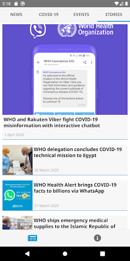
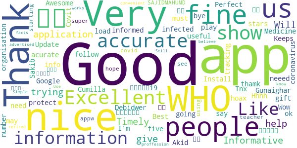
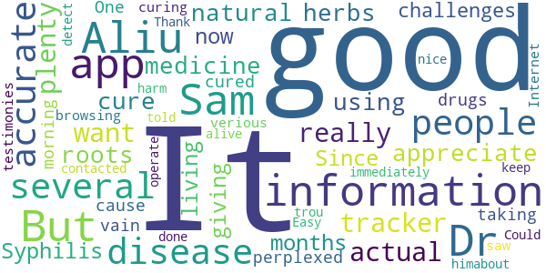
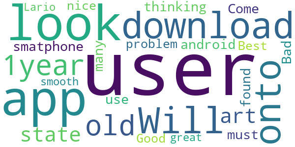
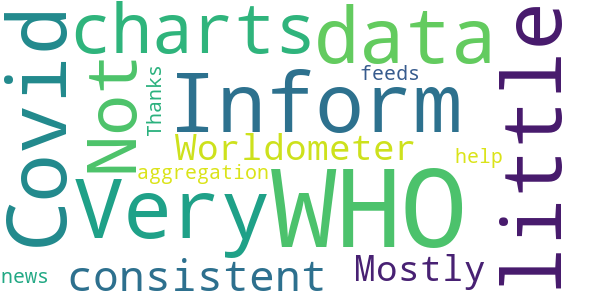
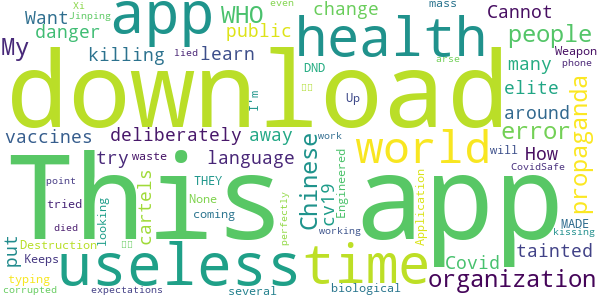
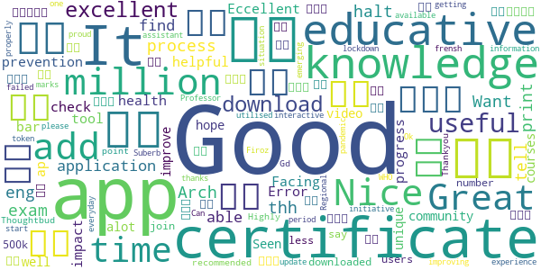
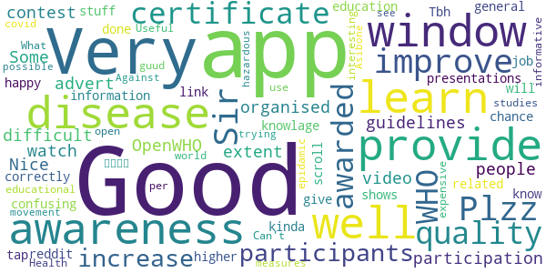
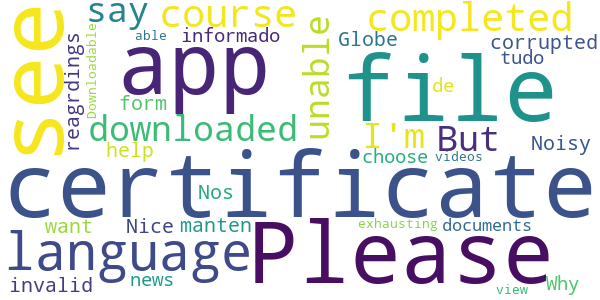
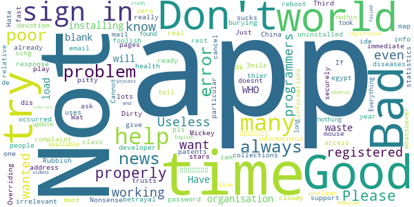

# COVID-related Android apps in Denmark

Author: `Ivano Malavolta` (ivanomalavolta@gmail.com)

Created at: `2020/6/22`

Report generated by the [covid-apps-observer](http://github.com/covid-apps-observer) project, version 0.1

# Table of contents 

- [Background](#background)
    * [Data sources and analyses](#data-sources-and-analyses)
        * [App metadata](#app-metadata)
        * [Requested permissions](#requested-permissions)
        * [Mentioned servers](#mentioned_servers)
        * [Security analysis](#security_analysis)
        * [User ratings and reviews](#user-ratings-and-reviews)
    * [Disclaimer](#disclaimer)
- [WHO Info](#who-info)
- [OpenWHO: Knowledge for Health Emergencies](#openwho-knowledge-for-health-emergencies)
- [Smittestop](#smittestop)

- [Credits](#credits)

# How to read this report

This report has been generated by the [covid-apps-observer](http://github.com/covid-apps-observer) project. The project automatically analyzes the apps by extracting information which is already publicly available either on the web or in the apps binary files. 

Our analysis covers the following apps:
| | |
|-------------------------|-------------------------| 
|  | WHO Info
|  | OpenWHO: Knowledge for Health Emergencies
|  | Smittestop

The details of our analysis are presented in the remainder of this report.

For independent verification, the raw data and the source code of the project is publicly available in its GitHub repository [http://github.com/covid-apps-observer](http://github.com/covid-apps-observer) and its source code has been thoroughly commented in order to provide all the details about how the information provided in this report has been extracted. 

Any feedback, questions, and improvements about the project are very welcome, feel free to create an issue or pull request directly in its GitHub repository: [http://github.com/covid-apps-observer](http://github.com/covid-apps-observer).

## Data sources and analyses

The analysis of each app is structured around five main dimensions: 
* App metadata  
* Requested permissions
* Mentioned servers
* Androwarn analysis
* User ratings and reviews

In the following we describe the data sources and analysis performed for each dimension.

### App metadata

App metadata includes an overview of the main information about the app (for example, its name, releases, privacy policy, etc.), contact information of the development team, and the various Android versions supported by the app. This information is extracted from two main data sources:
* _Google Play store_: we automatically mined the web page of the Google Play store showing the basic information about the app and we parsed it in order to extract information about the app and development team 
* _Android Manifest file_: in our analysis we decompiled the binary file of the app (it is similar to a Zip archive but it contains the code of the app instead of normal files) and we extracted information about the supported Android versions, as it has been listed by its development team.

The extracted app metadata feeds the _App overview_, _Development team_, and _Android support_ sections of this report.
We make use of the [google-play-scraper](https://github.com/JoMingyu/google-play-scraper) tool for extracting the raw data related to this dimension of the project.

### Requested permissions

The Android operating system has a permission model which allows users to grant access to potentially privacy-related information. Every Android app has to explictly declare the permissions it needs to properly function in the Android Manifest file.  

In this report we also show the protection level of each permission, which is a key information for understanding how the requested permissions related to the user's privacy. We carefully analyzed the [official Android documentation (v. 29)](https://developer.android.com/reference/android/Manifest.permission), and it resulted that a permission requested by an Android app can belong to the following protection levels:
* **Dangerous**: higher-risk permissions that would give a requesting app access to private user data or control over the device that can negatively impact the user. Because this type of permission introduces potential risk, the system usually does not automatically grant it to the requesting app. For example, any dangerous permissions requested by an app may be displayed to the user and require confirmation before proceeding.
* **Normal**: this is the default and most common level in Android; normal permissions are lower-risk and give access to isolated app-level features, with minimal risk to other apps, the system, or the user. 
* **Signature**: permissions granted only if the requesting app is signed with the same certificate as the app that declared the permission
* **Appop**: old permission level, a reminiscence of the App Ops tool that Google introduced in Android 4.3.
* **Development**: optional permissions which can be granted to development-oriented apps.
* **Privileged**: permissions who give higher power to mobile apps w.r.t. other apps, such as binding to incoming calls, interacting via bluetooth with other devices without user interaction, etc.
* **Preinstalled**: reserved only for preinstalled apps
* **Installer**: allow the holder to start the permission usage screen for an app
* **RetailDemo**: permissions related to devices used in demonstrations in shops.
* **Pre23**: permissions automatically granted to apps targeting devices running pre-6.0 Android.
* **Upcoming**: permissions which will be released in the next version of the Android platform. 
* **Deprecated**: permissions belonging to old releases of the Android platform, they should not be used by developers since they will not be supported in the near future.
* **Not for use by third-party applications**: permissions which can be requested only by apps developed by Google.
* **Undefined**: this protection level is not documented by Google.

The permissions dimension of this project is based on the [Androguard](https://github.com/androguard/androguard) static analysis tool.

### Mentioned servers

We decompiled each app in order to look for all possible mentions of remote URLs. The mentioned URLs can refer to remote servers the the app is using for either sending or receiving information, web addresses for directing the user to an information website, and so on. 

:warning: It is important to note that this analysis is not meant to be complete and it is very prone to obfuscation. The servers reported here are simply _mentioned_ somewhere in the code of the app and are meant to just give an indication about the "hooks" of the app towards external resources. For example, for an Android app it is normal to contact Google services in order to send/receive push notifications, or to contact the servers of analytics services for having real-time diagnostics about crashes of the app or bugs.

This part of the analysis is based on the [Androguard](https://github.com/androguard/androguard) static analysis tool for identfying the raw URLs mentioned in the app; then, the information about each mentioned server is collected by performing a _whois_ lookup on the first-level domain present in the URL.

### Security analysis

This dimension is based on the [Androwarn](https://github.com/maaaaz/androwarn) structural and data flow analysis of Android bytecode. Androwarn is developed by the University of Lyon/INSA (France) and it has been used in several academic studies. According to its documentation, Androwarn targets the following categories of potential security issues:
* **Telephony identifiers exfiltration**: IMEI, IMSI, MCC, MNC, LAC, CID, operator's name, etc.
* **Device settings exfiltration**: software version, usage statistics, system settings, logs, etc.
* **Geolocation information leakage**: GPS/WiFi geolocation, etc.
* **Connection interfaces information exfiltration**: WiFi credentials, Bluetooth MAC adress, etc.
* **Telephony services abuse**: premium SMS sending, phone call composition, etc.
* **Audio/video flow interception**: call recording, video capture, etc.
* **Remote connection establishment**: socket open call, Bluetooth pairing, APN settings edit, etc.
* **PIM data leakage**: contacts, calendar, SMS, mails, clipboard, etc.
* **External memory operations**: file access on SD card, etc.
* **PIM data modification**: add/delete contacts, calendar events, etc.
* **Arbitrary code execution**: native code using JNI, UNIX command, privilege escalation, etc.
* **Denial of Service**: event notification deactivation, file deletion, process killing, virtual keyboard disable, terminal shutdown/reboot, etc.

Note: We do not consider this data point in the current version of our analyzers since it is too verbose for our purposes.

:warning: It is important to note that Androwarn is a static analysis tool, and as such it performs a variety of heuristics and approximations in its analyses. Said that, the results shown in this report are meant to provide an indication of _potential_ security issues and should be by no means treated as complete and correct.   

### User ratings and reviews

For this dimension we turn again to the web interface of the Google Play store. Firstly, we automatically mine summary statistics about user ratings from the web page of the app under analysis; then, we automatically download the newest 1000 reviews of the app under analysis. For each level of rating (5 stars, 4 stars, , etc., 1 star) we show:
- a word cloud presenting the main terms used by end users in their reviews in the Google Play store
- the last 10 reviews provided by app users in the Google Play store. 

This purposefully simple analysis is meant to help both future users and the development team of the app in understanding what are the main positive and negative points of the app under analysis.

We make use of the [google-play-scraper](https://github.com/JoMingyu/google-play-scraper) tool for extracting the raw data related to this dimension of the project.

## Disclaimer 

This report has been produced independently of any parties and its only objective is to help anybody in better understanding how COVID-related apps work in practice (and compare to each other). The results of this report are limited to the specific version of the software used for running the analyses and on the various heuristics implemented in there. In other words, the results of the analyzers may differ depending on the time and modalities in which they are executed. We do not guarantee that the results of the analyses and the corresponding contents of this report are fully complete or correct. The analysis software is licensed under the [MIT License](https://github.com/iivanoo/covid-apps-observer/blob/master/LICENSE).

# WHO Info
App version ``2.1.2``

Analyzed with [covid-apps-observer](http://github.com/covid-apps-observer) project, version ``0.1``

## App overview
| | |
|-------------------------|-------------------------| 
| **Name**&nbsp;&nbsp;&nbsp;&nbsp;&nbsp;&nbsp;&nbsp;&nbsp;&nbsp;&nbsp;&nbsp;&nbsp;&nbsp;&nbsp;&nbsp;&nbsp;&nbsp;&nbsp;&nbsp;&nbsp;&nbsp;&nbsp;&nbsp;&nbsp;&nbsp;&nbsp;&nbsp;&nbsp;&nbsp;&nbsp;&nbsp;&nbsp;&nbsp;&nbsp;&nbsp;&nbsp;&nbsp;&nbsp;&nbsp;&nbsp;  | WHO Info |
| **Unique identifier** | org.who.infoapp |
| **Link to Google Play** | [https://play.google.com/store/apps/details?id=org.who.infoapp](https://play.google.com/store/apps/details?id=org.who.infoapp) |
| **Summary**  | The official World Health Organization Information App. |
| **Privacy policy** | [https://www.who.int/about/who-we-are/privacy-policy](https://www.who.int/about/who-we-are/privacy-policy) |
| **Latest version** | 2.1.2 |
| **Last update** | 2020-06-05 09:56:16 |
| **Recent changes** | This release resolves some minor fixes. |
| **Installs**  | 100,000+ |
| **Category** | News & Magazines |
| **First release** | Apr 13, 2020 |
| **Size**  | 8.0M |
| **Supported Android version**  | 4.2 and up |

### Description
> Have the latest health information at your fingertips with the official World Health Organization Information App. This app displays the latest news, events, features and breaking updates on outbreaks. 
  
 WHO works worldwide to promote health, keep the world safe, and serve the vulnerable. 
 Our goal is to ensure that a billion more people have universal health coverage, to protect a billion more people from health emergencies, and provide a further billion people with better health and well-being.

### User interface
The developers of the app provide the following screenshots in the Google play store.
| | | |
|:-------------------------:|:-------------------------:|:-------------------------:|
 |   |   |   | 
 |   |   |   | 
 |   |   |   | 
 |   |   |   | 
 |   |   |   | 
 |   |   |   | 

## Development team
In the following we report the main information provided by the development team in the Google play store.

| | |
|-------------------------|-------------------------|
| **Developer**  | World Health Organization |
| **Website**  | [https://www.who.int/](https://www.who.int/) |
| **Email** | dcx@who.int |
| **Physical address**  | [Avenu Appia 20 1211 Geneva Switzerland](https://www.google.com/maps/search/Avenu%20Appia%2020%201211%20Geneva%20Switzerland) (Google Maps) |
| **Other developed apps**  | [https://play.google.com/store/apps/developer?id=World+Health+Organization](https://play.google.com/store/apps/developer?id=World+Health+Organization) |

## Android support

| | |
|-------------------------|-------------------------|
| **Declared target Android version**  | Android10, version 10 (API level 29) |
| **Effective target Android version**  | Android10, version 10 (API level 29) |
| **Minimum supported Android version**  | Jelly Bean, version 4.2.x (API level 17) |
| **Maximum target Android version**  | - |

The larger the difference between the minimum and maximum supported Android versions, the better. A larger difference means a wider audience. For example, old phones have a very low Android version, so a high minimum supported Android version means that the app cannot be used by users with old phones, thus leading to accessibility problems. 

## Requested permissions

In the following we report the complete list of the permissions requested by the app. 

| **Permission** | **Protection level** | **Description** | 
|-------------------------|-------------------------|-------------------------|
 **android.permission INTERNET** | Normal | Allows applications to open network sockets. 
 **android.permission READ_CALENDAR** | :warning:**Dangerous** | Allows an application to read the user's calendar data. 
 **android.permission READ_EXTERNAL_STORAGE** | :warning:**Dangerous** | Allows an application to read from external storage. 
 **android.permission WRITE_CALENDAR** | :warning:**Dangerous** | Allows an application to write the user's calendar data. 
 **android.permission WRITE_EXTERNAL_STORAGE** | :warning:**Dangerous** | Allows an application to write to external storage. 

## Mentioned servers

| **Server** | **Registrant** | **Registrant country** | **Creation date** | 
|-------------------------|-------------------------|-------------------------|-------------------------|
-

## Security analysis 

Below we report the main security warnings raised by our execution of the [Androwarn](https://github.com/maaaaz/androwarn) security analysis tool.

**Connection interfaces exfiltration**
> - This application reads details about the currently active data network 
> - This application tries to find out if the currently active data network is metered 

**Suspicious connection establishment**
> - This application opens a Socket and connects it to the remote address 'Lfi/iki/elonen/NanoHTTPD$ResponseException;' on the 'N/A' port  
> - This application opens a Socket and connects it to the remote address 'NanoHttpd Shutdown' on the 'N/A' port  

**Code execution**
> - This application loads a native library: 'NativeScript' 
> - This application executes a UNIX command containing this argument: '2' 

## User ratings and reviews

Below we provide information about how end users are reacting to the app in terms of ratings and reviews in the Google Play store.

### Ratings

The WHO Info app has been installed by more than **100000** times. At this time, **587** rated the app and its average score is **4.12**. Below we show the distribution of the ratings across the usual star-based rating of Google Play

:star::star::star::star::star:: 399

:star::star::star::star:: 64

:star::star::star:: 17

:star::star:: 5

:star:: 99

### Reviews 

#### 5-star reviews

> jafure  :date: __2020-06-16 06:19:43__

> Good  :date: __2020-06-10 20:34:34__

> hi md zihad mia  :date: __2020-06-10 12:49:41__

> Bala bals  :date: __2020-06-10 06:34:10__

> Ok  :date: __2020-06-10 03:01:27__

> ➕➕🅰🅰🅰➕➕ 🍀🍀😊😊😊🍀🍀 📖📖🙏🙏🙏📖📖  :date: __2020-06-08 13:46:53__

> its good for us thamk you W.H.O  :date: __2020-06-06 16:10:24__

> Cumilla Debidwer Gunaighar  :date: __2020-06-06 15:19:02__

> করুনা বাই রাজ এলাটডামলো  :date: __2020-06-05 23:02:23__

> Shows the acurate number of the infected people  :date: __2020-06-05 20:06:30__

#### 4-star reviews

> good  :date: __2020-06-03 00:37:10__

> It's just information, not the actual tracker. But has plenty of information that's 100% accurate.  :date: __2020-05-31 02:37:20__

> I really want to appreciate Dr. Aliu Sam for using his natural roots and herbs medicine to cure me of Syphilis Since 11 months now I have been living with this disease and it has been giving me challenges, I was so perplexed cause I have been taking several drugs to be cured but all have been in vain. One morning I was browsing through the Internet then i saw several testimonies about Dr. Aliu Sam curing people off verious diseases and immediately I contacted Dr. Aliu Sam I told himabout my trou  :date: __2020-05-08 05:33:57__

> It did not detect  :date: __2020-04-29 18:37:26__

> Could do with more accurate information to keep people alive. But no harm done.  :date: __2020-04-29 13:41:12__

> Its good app. Easy to operate  :date: __2020-04-27 14:08:23__

> It's so nice app  :date: __2020-04-25 14:50:48__

> Thank you, good app.  :date: __2020-04-25 03:11:24__

#### 3-star reviews

> Very good apps  :date: __2020-06-17 19:02:00__

> Will not download onto my 1year old state of the art smatphone. Bad, as a user of many android apps what are you thinking. I have found more than 3700 other users that can not use this app. Come on you must no you have problem.  :date: __2020-05-26 02:04:59__

> Good  :date: __2020-05-14 21:22:11__

> Best.  :date: __2020-04-20 13:14:33__

> Looks nice great look smooth Lario  :date: __2020-04-18 09:44:30__

#### 2-star reviews

> Learn more  :date: __2020-06-15 23:35:50__

> WHO Inform Covid 19  :date: __2020-05-24 17:14:56__

> Very little data or charts. Not consistent with Worldometer. Mostly an aggregation of news feeds about WHO  :date: __2020-05-15 15:38:10__

> Thanks for your help.  :date: __2020-04-22 18:52:40__

#### 1-star reviews

> Jahangir  :date: __2020-06-19 05:46:57__

> Crashed after one minute  :date: __2020-06-15 05:58:08__

> Cannot download cv19 app  :date: __2020-06-08 15:19:41__

> Want to learn  :date: __2020-05-27 11:52:00__

> How can I change the language?  :date: __2020-05-19 00:43:45__

> This app is useless it can't download many times l try  :date: __2020-05-18 07:25:58__

> I don't like this app  :date: __2020-05-14 07:07:35__

> The world health organization are deliberately killing people with tainted vaccines all around the world health should be put away from the elite cartels that danger public health - Covid-19 is a biological Engineered Weapon of mass Destruction  :date: __2020-05-12 23:43:51__

> THEY MADE IT 😷😷😷😷😷  :date: __2020-05-10 15:57:09__

> None  :date: __2020-05-10 11:40:37__

# OpenWHO: Knowledge for Health Emergencies
App version ``3.3.1``

Analyzed with [covid-apps-observer](http://github.com/covid-apps-observer) project, version ``0.1``

## App overview
| | |
|-------------------------|-------------------------| 
| **Name**&nbsp;&nbsp;&nbsp;&nbsp;&nbsp;&nbsp;&nbsp;&nbsp;&nbsp;&nbsp;&nbsp;&nbsp;&nbsp;&nbsp;&nbsp;&nbsp;&nbsp;&nbsp;&nbsp;&nbsp;&nbsp;&nbsp;&nbsp;&nbsp;&nbsp;&nbsp;&nbsp;&nbsp;&nbsp;&nbsp;&nbsp;&nbsp;&nbsp;&nbsp;&nbsp;&nbsp;&nbsp;&nbsp;&nbsp;&nbsp;  | OpenWHO: Knowledge for Health Emergencies |
| **Unique identifier** | de.xikolo.openwho |
| **Link to Google Play** | [https://play.google.com/store/apps/details?id=de.xikolo.openwho](https://play.google.com/store/apps/details?id=de.xikolo.openwho) |
| **Summary**  | Life-saving knowledge for frontline responders in health emergencies. |
| **Privacy policy** | [https://openwho.org/pages/privacy](https://openwho.org/pages/privacy) |
| **Latest version** | 3.3.1 |
| **Last update** | 2020-05-11 10:06:32 |
| **Recent changes** | - Redesign of some UI elements - Bug fixes and performance improvements |
| **Installs**  | 1,000,000+ |
| **Category** | Education |
| **First release** | May 17, 2017 |
| **Size**  | 18M |
| **Supported Android version**  | 5.0 and up |

### Description
> OpenWHO is the World Health Organization's (WHO) interactive knowledge-transfer platform offering online courses to improve the response to health emergencies. OpenWHO enables the Organization and its key partners to transfer life-saving knowledge to large numbers of frontline responders.
 With OpenWHO, you have the flexibility to learn at your convenience. Watch the short video lectures and test your knowledge with self-tests when and where you like. The course forum and the collaboration space allow you to get in touch with other participants and experts around the world.
  
 Designed primarily for health care workers, frontline responders, and decision-makers, the app is also a source of information for those affected by disease outbreaks and health emergencies, or for those with a general interest in WHO's work in health emergencies.
  
 It features 6 channels:
 - The <b>Outbreak</b> channel addresses the management of infectious diseases and provides life-saving, scientific information.
 - The <b>Ready for Response</b> channel helps prepare personnel who are training for deployment to work in disease outbreaks and health emergencies.
 - The <b>Get Social</b> channel focuses on social science-based interventions and helps to communicate with affected communities.
 - The <b>Preparing for Pandemics</b> channel brings together courses on various aspects of preparedness, including surveillance, public health measures and risk communication during a pandemic.
 - The <b>COVID-19</b> channel provides learning resources in WHO's 6 official languages (Arabic, Chinese, English, French, Russian and Spanish) for health professionals, decision-makers and the public for the outbreak of coronavirus disease (COVID-19).
 - The <b>COVID-19 National Languages</b> channel provides the same learning resources as the COVID-19 channel but in national languages, such as Indonesian, Japanese and Portuguese. 
  
 OpenWHO courses are available in many languages, including WHO's 6 official languages. 
  
 Download the app now, and join the OpenWHO community.
 This app is developed in cooperation between the Hasso Plattner Institute and the WHO. The learning content is provided exclusively by the WHO.

### User interface
The developers of the app provide the following screenshots in the Google play store.
| | | |
|:-------------------------:|:-------------------------:|:-------------------------:|
 |   |   |   | 
 |   |   |   | 

## Development team
In the following we report the main information provided by the development team in the Google play store.

| | |
|-------------------------|-------------------------|
| **Developer**  | HPI Knowledge Engineering Team |
| **Website**  | [https://openwho.org/](https://openwho.org/) |
| **Email** | openwho-support@hpi.de |
| **Physical address**  | [Prof.-Dr.-Helmert-Str.2-3 14482 Potsdam](https://www.google.com/maps/search/Prof.-Dr.-Helmert-Str.2-3%2014482%20Potsdam) (Google Maps) |
| **Other developed apps**  | [https://play.google.com/store/apps/developer?id=7185448023325736337](https://play.google.com/store/apps/developer?id=7185448023325736337) |

## Android support

| | |
|-------------------------|-------------------------|
| **Declared target Android version**  | Android10, version 10 (API level 29) |
| **Effective target Android version**  | Android10, version 10 (API level 29) |
| **Minimum supported Android version**  | Lollipop, version 5.0 (API level 21) |
| **Maximum target Android version**  | - |

The larger the difference between the minimum and maximum supported Android versions, the better. A larger difference means a wider audience. For example, old phones have a very low Android version, so a high minimum supported Android version means that the app cannot be used by users with old phones, thus leading to accessibility problems. 

## Requested permissions

In the following we report the complete list of the permissions requested by the app. 

| **Permission** | **Protection level** | **Description** | 
|-------------------------|-------------------------|-------------------------|
 **android.permission ACCESS_NETWORK_STATE** | Normal | Allows applications to access information about networks. 
 **android.permission ACCESS_WIFI_STATE** | Normal | Allows applications to access information about Wi-Fi networks. 
 **android.permission FOREGROUND_SERVICE** | Normal | Allows a regular application to use Service.startForeground. 
 **android.permission INTERNET** | Normal | Allows applications to open network sockets. 
 **android.permission READ_EXTERNAL_STORAGE** | :warning:**Dangerous** | Allows an application to read from external storage. 
 **android.permission RECEIVE_BOOT_COMPLETED** | Normal | Allows an application to receive the Intent.ACTION_BOOT_COMPLETED that is broadcast after the system finishes booting. 
 **android.permission WAKE_LOCK** | Normal | Allows using PowerManager WakeLocks to keep processor from sleeping or screen from dimming. 
 **android.permission WRITE_EXTERNAL_STORAGE** | :warning:**Dangerous** | Allows an application to write to external storage. 
 **com.google.android.c2dm.permission RECEIVE** | - | - 
 **com.google.android.finsky.permission BIND_GET_INSTALL_REFERRER_SERVICE** | - | - 

## Mentioned servers

| **Server** | **Registrant** | **Registrant country** | **Creation date** | 
|-------------------------|-------------------------|-------------------------|-------------------------|
 | googlesyndication.com | Google LLC | :us: US | 2003-01-21 06:17:24 |
 | google.com | Google LLC | :us: US | 1997-09-15 04:00:00 |
 | app-measurement.com | Google LLC | :us: US | 2015-06-19 20:13:31 |
 | apple.com | Apple Inc. | :us: US | 1987-02-19 05:00:00 |
 | aomedia.org | Contact Privacy Inc. Customer 1243324949 | :canada: CA | 2015-08-24 14:07:31 |
 | dashif.org | VTM Group | :us: US | 2012-04-27 13:02:46 |
 | w3.org | W3C | :us: US | 1994-07-06 04:00:00 |
 | googleapis.com | Google LLC | :us: US | 2005-01-25 17:52:26 |
 | googleadservices.com | Google LLC | :us: US | 2003-06-19 16:34:53 |
 | psdev.de | - | - | - |
 | xmlpull.org | WhoisGuard, Inc. | PA | 2001-11-26 20:33:08 |
 | someurl.com | WhoisGuard, Inc. | PA | 2000-02-08 15:50:35 |
 | crashlytics.com | Google LLC | :us: US | 2011-01-21 15:30:40 |
 | apache.org | The Apache Software Foundation | :us: US | 1995-04-11 04:00:00 |
 | opensource.org | Open Source Initiative | :us: US | 1998-02-11 05:00:00 |
 | creativecommons.org | Creative Commons Corporation | :canada: CA | 2001-01-15 16:51:44 |
 | eclipse.org | Eclipse.org Foundation, Inc. | :canada: CA | 1997-04-14 04:00:00 |
 | gnu.org | Free Software Foundation | :us: US | 1995-11-24 05:00:00 |
 | mozilla.org | Mozilla Corporation | :us: US | 1998-01-24 05:00:00 |

## Security analysis 

Below we report the main security warnings raised by our execution of the [Androwarn](https://github.com/maaaaz/androwarn) security analysis tool.

**Telephony identifiers leakage**
> - This application reads the ISO country code equivalent of the current registered operator's MCC (Mobile Country Code) 

**Connection interfaces exfiltration**
> - This application reads details about the currently active data network 
> - This application tries to find out if the currently active data network is metered 

**Suspicious connection establishment**
> - This application opens a Socket and connects it to the remote address ' returned no addresses for  ; port is out of range' on the 'N/A' port  
> - This application opens a Socket and connects it to the remote address '' on the 'N/A' port  
> - This application opens a Socket and connects it to the remote address 'Ljava/lang/StringBuilder;->toString()Ljava/lang/String;' on the 'N/A' port  
> - This application opens a Socket and connects it to the remote address 'Ljava/net/Proxy;->type()Ljava/net/Proxy$Type;' on the 'N/A' port  
> - This application opens a Socket and connects it to the remote address 'timeout' on the 'N/A' port  

**Code execution**
> - This application loads a native library 
> - This application loads a native library: 'bypass' 

## User ratings and reviews

Below we provide information about how end users are reacting to the app in terms of ratings and reviews in the Google Play store.

### Ratings

The OpenWHO: Knowledge for Health Emergencies app has been installed by more than **1000000** times. At this time, **2587** rated the app and its average score is **4.171875**. Below we show the distribution of the ratings across the usual star-based rating of Google Play

:star::star::star::star::star:: 1647

:star::star::star::star:: 363

:star::star::star:: 242

:star::star:: 40

:star:: 293

### Reviews 

#### 5-star reviews

> Good  :date: __2020-06-21 13:44:16__

> Nice  :date: __2020-06-21 11:44:45__

> Nice  :date: __2020-06-20 05:43:12__

> Right informing .  :date: __2020-06-19 19:35:20__

> Nice  :date: __2020-06-19 18:05:45__

> To see corona  :date: __2020-06-19 11:22:26__

> perfect  :date: __2020-06-19 04:06:59__

> Great.. informstive  :date: __2020-06-17 20:12:02__

> Good for all  :date: __2020-06-16 09:05:38__

> It's help full me  :date: __2020-06-14 16:51:52__

#### 4-star reviews

> Good source of information  :date: __2020-06-20 09:36:05__

> Excellent Direction~  :date: __2020-06-19 14:08:55__

> Mast  :date: __2020-06-13 09:10:54__

> Good app of thh halt.  :date: __2020-05-31 05:25:43__

> Arch. eng.  :date: __2020-05-22 01:54:14__

> Good  :date: __2020-05-17 08:09:21__

> Want to print my certificate  :date: __2020-05-15 02:12:18__

> tell me the process of certificate exam in this application?? I couldn't able to find that..!!  :date: __2020-05-13 08:20:42__

> Good app for prevention of health  :date: __2020-05-12 15:26:14__

> Good ap  :date: __2020-05-10 07:41:36__

#### 3-star reviews

> I have finished two courses on two different date(one before midnight, another after midnight) but found same date on both while I downloaded Certificates. Why is this?  :date: __2020-06-11 19:18:50__

> covid  :date: __2020-06-11 18:37:22__

> Sir, Plzz improve the quality of the certificate awarded by the WHO to the participants to increase more & more participation as well as awareness of the people in this contest organised by OpenWHO.  :date: __2020-05-24 16:44:50__

> Some extent it's very good and its provide guidelines to advert disease.  :date: __2020-05-23 18:33:55__

> Nice app however difficult to watch video presentations  :date: __2020-05-14 19:35:42__

> Very confusing. not happy with the link. I don't know if I have done it correctly.  :date: __2020-05-12 22:12:31__

> Tbh this app is kinda like reddit, you can scroll through windows that shows general knowlage, then you can tap into that window for more information. It's a good app to learn about stuff  :date: __2020-05-09 13:39:53__

> Very good app ..give chance to learn higher education...its very good if this app will provide job related educational studies  :date: __2020-05-02 15:54:16__

> Good  :date: __2020-04-29 17:15:00__

> Very interesting.  :date: __2020-04-29 08:44:44__

#### 2-star reviews

> I completed a course and then downloaded certificate it ... But I'm unable too see my certificate as it say corrupted file or invalid file. Please help with reagrdings to it.  :date: __2020-05-27 13:14:22__

> Noisy app.  :date: __2020-04-21 21:34:45__

> Nice  :date: __2020-04-09 16:25:41__

> Please , i want the App in the form of the Globe.  :date: __2020-04-05 14:35:33__

> Nos manten informado de tudo  :date: __2020-03-22 08:51:43__

> Why can't you choose a language???? You have to see the same news or documents in all languages. Its exhausting.  :date: __2020-03-15 19:30:37__

> not able to view videos. not Downloadable too  :date: __2019-06-07 20:15:22__

#### 1-star reviews

> Not sign in properly many time errors.. Please help me out of this problem. I already registered a complaint that particular problem through mail.  :date: __2020-06-16 05:10:29__

> No real news  :date: __2020-06-10 20:20:26__

> Dirty apps  :date: __2020-06-08 01:02:18__

> Not sign in properly Many times error  :date: __2020-05-29 19:05:54__

> Cannot access securely and info very unclear and cloudy  :date: __2020-05-28 05:01:52__

> Not good at all, very bad  :date: __2020-05-25 06:20:08__

> I try lots time to sign in but no response and my 3mile ide are all ready registered  :date: __2020-05-19 16:24:39__

> Just a poor app (Mickey mouse programmers)  :date: __2020-05-19 11:01:08__

> Its not working  :date: __2020-05-13 18:24:22__

> Nonsense app  :date: __2020-05-13 08:19:05__

# Smittestop
App version ``1.0``

Analyzed with [covid-apps-observer](http://github.com/covid-apps-observer) project, version ``0.1``

## App overview
| | |
|-------------------------|-------------------------| 
| **Name**&nbsp;&nbsp;&nbsp;&nbsp;&nbsp;&nbsp;&nbsp;&nbsp;&nbsp;&nbsp;&nbsp;&nbsp;&nbsp;&nbsp;&nbsp;&nbsp;&nbsp;&nbsp;&nbsp;&nbsp;&nbsp;&nbsp;&nbsp;&nbsp;&nbsp;&nbsp;&nbsp;&nbsp;&nbsp;&nbsp;&nbsp;&nbsp;&nbsp;&nbsp;&nbsp;&nbsp;&nbsp;&nbsp;&nbsp;&nbsp;  | Smittestop |
| **Unique identifier** | com.netcompany.smittestop_exposure_notification |
| **Link to Google Play** | [https://play.google.com/store/apps/details?id=com.netcompany.smittestop_exposure_notification](https://play.google.com/store/apps/details?id=com.netcompany.smittestop_exposure_notification) |
| **Summary**  | Infect Stops is the official Ministry of Health and Elderly&#39;s COVID-19 app. |
| **Privacy policy** | [https://www.smittestop.dk/databeskyttelse](https://www.smittestop.dk/databeskyttelse) |
| **Latest version** | 1.0 |
| **Last update** | 2020-06-17 17:57:05 |
| **Recent changes** | Dette er første udgave af smitte|stop. Danmarks officielle COVID-19 app. |
| **Installs**  | 100,000+ |
| **Category** | Medical |
| **First release** | Jun 17, 2020 |
| **Size**  | 97M |
| **Supported Android version**  | 6.0 and up |

### Description
> Hent appen, og hjælp med at stoppe smittespredning af COVID-19 i Danmark.
  
 Appen smitte
 stop giver os alle sammen mulighed for at være med til at stoppe udbredelsen af COVID-19 i Danmark. Smitte
 stop skal sammen med anbefalingerne fra myndighederne hjælpe os med at passe godt på hinanden, mens samfundet genåbner. 
  
 Med smitte
 stop kan du være med til at bryde smittekæder. Smitte
 stop giver dig mulighed for at få besked, når du har været tæt på en anden bruger af appen, der har fået COVID-19. På den måde, kan du hurtigt følge sundhedsmyndighedernes anbefalinger og derved bryde en mulig smittekæde. Du kan give besked til andre brugere af appen, hvis du bliver testet positiv. De kan ikke se, hvem du er.
 Det er frivilligt at hente og anvende appen, men jo flere, der anvender den, jo flere smittekæder kan appen hjælpe med at bremse. 
  
 Hvordan fungerer smitte
 stop?
 • Når du aktiverer smitte
 stop, bruger din telefon tilfældige Bluetooth-ID’er til at finde ud af, om du muligvis har været tæt på nogen, der har oplyst i appen, at de har COVID-19. De tilfældige ID’er bliver lagret på din telefon og forlader kun din telefon, når du frivilligt og aktivt giver besked i appen med dit NemID, at du har COVID-19.
 • Smitte
 stop bruger din telefons ’Notifikationer om eksponering for COVID-19’, som er udviklet af Apple og Google. 
 • Ingen kan se, hvem du er, og du kan ikke se, hvem du har opholdt dig tæt på. 
 • Ingen myndigheder eller virksomheder har adgang til oplysninger om, hvem du har været i nærheden af, eller hvis du i appen får besked om, at du har været tæt på en COVID-19-positiv
 • Appen bruger ikke GPS til at registrere data  om, hvor du befinder dig.
 • To telefoner genkender hinanden via appen og udveksler tilfældige ID’er gennem bluetooth. 
  
 Arbejdet med at udvikle appens funktioner sker løbende. 
  
 Ved at downloade smitte
 stop accepterer du Vilkår og betingelser. Du skal give samtykke, når du har downloadet appen. 
  
 Smitte
 stop er udviklet af Sundheds- og Ældreministeriet i samarbejde med Styrelsen for Patientsikkerhed, Statens Serum Institut, Sundhedsstyrelsen og Digitaliseringsstyrelsen. Læs mere om appen på: www.smittestop.dk.

### User interface
The developers of the app provide the following screenshots in the Google play store.
| | | |
|:-------------------------:|:-------------------------:|:-------------------------:|
 |   |   |   | 

## Development team
In the following we report the main information provided by the development team in the Google play store.

| | |
|-------------------------|-------------------------|
| **Developer**  | Sundheds- og Ældreministeriet |
| **Website**  | [https://www.smittestop.dk](https://www.smittestop.dk) |
| **Email** | info@sundhed.dk |
| **Physical address**  | [Sundheds- og Ældreministeriet Holbergsgade 6, 1057 København K, Denmark](https://www.google.com/maps/search/Sundheds-%20og%20Ældreministeriet%20Holbergsgade%206,%201057%20København%20K,%20Denmark) (Google Maps) |
| **Other developed apps**  | [https://play.google.com/store/apps/developer?id=Sundheds-+og+%C3%86ldreministeriet](https://play.google.com/store/apps/developer?id=Sundheds-+og+%C3%86ldreministeriet) |

## Android support

| | |
|-------------------------|-------------------------|
| **Declared target Android version**  | Android10, version 10 (API level 29) |
| **Effective target Android version**  | Android10, version 10 (API level 29) |
| **Minimum supported Android version**  | Marshmallow, version 6.0 (API level 23) |
| **Maximum target Android version**  | - |

The larger the difference between the minimum and maximum supported Android versions, the better. A larger difference means a wider audience. For example, old phones have a very low Android version, so a high minimum supported Android version means that the app cannot be used by users with old phones, thus leading to accessibility problems. 

## Requested permissions

In the following we report the complete list of the permissions requested by the app. 

| **Permission** | **Protection level** | **Description** | 
|-------------------------|-------------------------|-------------------------|
 **android.permission ACCESS_NETWORK_STATE** | Normal | Allows applications to access information about networks. 
 **android.permission BLUETOOTH** | Normal | Allows applications to connect to paired bluetooth devices. 
 **android.permission FOREGROUND_SERVICE** | Normal | Allows a regular application to use Service.startForeground. 
 **android.permission INTERNET** | Normal | Allows applications to open network sockets. 
 **android.permission RECEIVE_BOOT_COMPLETED** | Normal | Allows an application to receive the Intent.ACTION_BOOT_COMPLETED that is broadcast after the system finishes booting. 
 **android.permission WAKE_LOCK** | Normal | Allows using PowerManager WakeLocks to keep processor from sleeping or screen from dimming. 

## Mentioned servers

| **Server** | **Registrant** | **Registrant country** | **Creation date** | 
|-------------------------|-------------------------|-------------------------|-------------------------|
 | google.com | Google LLC | :us: US | 1997-09-15 04:00:00 |
 | googleapis.com | Google LLC | :us: US | 2005-01-25 17:52:26 |

## Security analysis 

Below we report the main security warnings raised by our execution of the [Androwarn](https://github.com/maaaaz/androwarn) security analysis tool.

**Connection interfaces exfiltration**
> - This application reads details about the currently active data network 
> - This application tries to find out if the currently active data network is metered 

**Code execution**
> - This application loads a native library: 'monodroid' 
> - This application loads a native library: 'monosgen-2.0' 
> - This application loads a native library: 'xamarin-app' 
> - This application loads a native library: 'xamarin-debug-app-helper' 

## User ratings and reviews

Below we provide information about how end users are reacting to the app in terms of ratings and reviews in the Google Play store.

### Ratings

The Smittestop app has been installed by more than **100000** times. At this time, **291** rated the app and its average score is **3.84**. Below we show the distribution of the ratings across the usual star-based rating of Google Play

:star::star::star::star::star:: 151

:star::star::star::star:: 55

:star::star::star:: 17

:star::star:: 20

:star:: 46

### Reviews 

#### 5-star reviews

> Virker uden problemer og tog 1 minut at sætte op. Fint teknologi valg som respekterer privat livet.  :date: __2020-06-19 22:10:06__

> Simpel app med god databeskyttelse.  :date: __2020-06-19 14:48:55__

> Fint lavet.  :date: __2020-06-18 19:39:34__

> Meget simpel og forklarer godt hvordan den fungerer. Håber mange vil bruge den :)  :date: __2020-06-18 16:24:54__

> Meget simpel to-the-point app. Bad kun om adgang til exposure notification, og ikke kamera, lager, gps eller hvad ved jeg.  :date: __2020-06-18 11:10:35__

> Tilpas simpel til at alle kan bruge den. Tilpas sikker til at ingen bør lade være.  :date: __2020-06-18 10:05:05__

> Non-intrusive and securing for the user! I fully approve!  :date: __2020-06-18 09:30:31__

> Fantastisk at den faktisk bruger exposure notifications fra Google selv, i stedet for et selvopfundet system, der ikke respekterer brugerens data og privatliv. Fin og enkel app.  :date: __2020-06-18 08:58:26__

> Den ser ud til at virke på en simpel måde uden alt muligt overflødig.  :date: __2020-06-18 07:08:57__

#### 4-star reviews

> Udmærket ide. Mangler dog noget funktionalitet der selv tænder/slukker for registreringen. Man kunne holde det op mod sit WiFi eller antenne master omkring sin bopæl. Alt dette er information der kan være lokalt, så man ikke skal dele unødige oplysninger.  :date: __2020-06-21 10:22:01__

> Positivt overrasket over at der er brugt en sikker og anonym protokol. Nemt at installere og sætte op. App'et har ikke rettighed til lokation, selvom lokation skal være slået til for at bluetooth virker. Ville have elsket at have kildekoden være offentligt tilgængelig så sikkerheden kunne verificeres.  :date: __2020-06-19 14:55:27__

> Bruger lidt ekstra strøm, men ellers ser app'en ud til at fungere fint. Godt at den blev implementeret med privacy in mind  :date: __2020-06-19 08:21:56__

> En super god ide, og virker godt - Få det spredt på tværs af grænser! Jeg har dog en klage.... Det er uheldigt i kræver telefonen har Google Play, hvad med alle dem med en ny Huawei? Det er virkeligt gode Android telefoner, til en fornuftig pris.  :date: __2020-06-19 03:38:10__

> Easy installation. Would be helpful to have the choice of English language going forward, especially with the border openings.  :date: __2020-06-19 01:45:07__

#### 3-star reviews

> Let at aktivere, men da den ikke virker udenfor Danmark med andre systemer, er den ikke særlig brugbar. Jeg havde håbet lidt på at man ikke skulle have 7 forskellige apps på for at få noget ud af det. At møde en smittet dansker i en lille by i Spanien eller Thailand er nok ikke så stor, som at møde en lokal der er smittet. Det lyder heller ikke til at man får besked med det samme man står over for en smittet person (telefon).  :date: __2020-06-19 18:48:15__

> Sluger en del strøm...  :date: __2020-06-19 15:01:30__

> Positivt: Beder kun om bluetooth-rettigheder, intet andet; dvs god privacy. Negativt: Fylder 182 MB. Det har jeg ikke plads til på min telefon, som ikke er helt ny.  :date: __2020-06-18 23:44:12__

> Jeg kan ikke aktivere bluetooth funktionen i app'en, hvilket gør den ubrugelig. Har Xiaomi Mi9 Se  :date: __2020-06-18 12:02:06__

#### 2-star reviews

> Virker simpel og godt designet, men lever ikke op til præmissen om, kun at bruge Bluetooth til at registrere andre enheder. Der står under indstillinger: "Når du har givet dit samtykke og tilladt Bluetooth, virker appen hele tiden". Det passer ikke, da appen ikke fungerer uden også at tænde for lokation. Både af hensyn til batteri og privatliv, har jeg ikke lyst til at have min lokation aktiv og sende data til Google konstant.  :date: __2020-06-18 08:57:02__

> Der står i app'en at den ikke bruger min lokation. Men app'en kræver at jeg tænder for min gps. Det hænger ikke sammen. Endvidere har min telefon ikke batteri til at have både gps og bluetooth kørende konstant samtidig. Bluetooth kan gå an.  :date: __2020-06-18 08:23:43__

#### 1-star reviews

> En app med at så vigtigt formål som denne skal bare fungere hele tiden. Et par dage efter jeg først installerede og aktiverede appen kom jeg tilfældigvis til at åbne den igen og så at den var inaktiv. Jeg aner ikke hvornår den stoppede med at virke, og jeg kunne ikke aktivere den igen uden at genstarte min telefon først. Det er simpelthen ikke godt nok, som minimum bør der sendes en push notifikation når noget ikke virker.  :date: __2020-06-21 12:08:13__

> Aktiver knap virker ikke på samsung 10+, jeg har forsøgt at opdatere android og google play no luck... apps bør virke lidt out of the box  :date: __2020-06-18 19:49:37__

> Where is the source code? Is public money and is tracking out location, source code to be able to trust it.  :date: __2020-06-18 17:57:18__

> Kan ikke aktivere app  :date: __2020-06-18 15:25:46__

> App'en virker ikke uden at GPS er tændt. Så kære ministerium, kontakt jeres udviklere og fortæl dem om problemet i stedet for at lire et standardsvar af. Edit: I Google COVID-19 Exposure Noti cations Service Additional Terms står der i punkt 3. c. Permissions .: i. Your App may not request the Location, Bluetooth_Admin, Special Access, Privileged, or Signature permissions, or collect any device information to i dentify or track the precise l ocation of end users. Så I må ikke kræve Location.  :date: __2020-06-18 15:19:21__

> Haha, vi vil tro på, at den respekterer privatlivet. Indtil "beklagelige fejl" beviser det modsatte. Nej tak. Den er udviklet uden central database uden myndighedernes gode vilje.  :date: __2020-06-18 10:41:32__

> Jeg sætter pris på forsøget, men når jeg klikker bekræft sker der ikke noget, den står stadig som inaktiv. Den kan ikke starte. Pixel 4XL telefon på nyeste ikke-beta Android.  :date: __2020-06-18 08:55:12__

# Credits

This project makes use of the following main third-party projects:
* Androguard: [https://github.com/androguard/androguard](https://github.com/androguard/androguard)
* Androwarn: [https://github.com/maaaaz/androwarn](https://github.com/maaaaz/androwarn)
* google_play_scraper: [https://github.com/JoMingyu/google-play-scraper](https://github.com/JoMingyu/google-play-scraper)
* whois: [https://github.com/DannyCork/python-whois](https://github.com/DannyCork/python-whois)
* BeautifulSoup: [https://www.crummy.com/software/BeautifulSoup](https://www.crummy.com/software/BeautifulSoup)

Other open-source projects used in this project include: 

- androguard==3.3.5
- appnope==0.1.0
- asn1crypto==1.3.0
- backcall==0.1.0
- beautifulsoup4==4.9.0
- bs4==0.0.1
- certifi==2020.4.5.1
- cffi==1.14.0
- chardet==3.0.4
- click==7.1.2
- colorama==0.4.3
- cryptography==2.9.2
- cycler==0.10.0
- decorator==4.4.2
- future==0.18.2
- google-play-scraper==0.0.2.7
- idna==2.9
- ipython==7.13.0
- ipython-genutils==0.2.0
- jedi==0.17.0
- Jinja2==2.11.2
- joblib==0.14.1
- kiwisolver==1.2.0
- lxml==4.5.0
- MarkupSafe==1.1.1
- matplotlib==3.2.1
- networkx==2.4
- nltk==3.5
- numpy==1.18.3
- parso==0.7.0
- pexpect==4.8.0
- pickleshare==0.7.5
- Pillow==7.1.2
- play-scraper==0.6.0
- prompt-toolkit==3.0.5
- ptyprocess==0.6.0
- pycountry==19.8.18
- pycparser==2.20
- pydot==1.4.1
- Pygments==2.6.1
- pyOpenSSL==19.1.0
- pyparsing==2.4.7
- python-dateutil==2.8.1
- regex==2020.4.4
- requests==2.23.0
- requests-futures==1.0.0
- six==1.14.0
- soupsieve==2.0
- tld==0.12.1
- tqdm==4.45.0
- traitlets==4.3.3
- urllib3==1.25.9
- wcwidth==0.1.9
- wordcloud==1.7.0

