# COVID-related Android apps in Denmark

Author: `Ivano Malavolta` (ivanomalavolta@gmail.com)

Created at: `2021/7/19`

Report generated by the [covid-apps-observer](http://github.com/covid-apps-observer) project, version 0.1

# Table of contents 

- [Background](#background)
    * [Data sources and analyses](#data-sources-and-analyses)
        * [App metadata](#app-metadata)
        * [Requested permissions](#requested-permissions)
        * [Mentioned servers](#mentioned_servers)
        * [Security analysis](#security_analysis)
        * [User ratings and reviews](#user-ratings-and-reviews)
    * [Disclaimer](#disclaimer)
- [WHO Info](#who-info)
- [OpenWHO: Knowledge for Health Emergencies](#openwho-knowledge-for-health-emergencies)
- [Smittestop](#smittestop)

- [Credits](#credits)

# How to read this report

This report has been generated by the [covid-apps-observer](http://github.com/covid-apps-observer) project. The project automatically analyzes the apps by extracting information which is already publicly available either on the web or in the apps binary files. 

Our analysis covers the following apps:
| | |
|-------------------------|-------------------------| 
|  | WHO Info
|  | OpenWHO: Knowledge for Health Emergencies
|  | Smittestop

The details of our analysis are presented in the remainder of this report.

For independent verification, the raw data and the source code of the project is publicly available in its GitHub repository [http://github.com/covid-apps-observer](http://github.com/covid-apps-observer) and its source code has been thoroughly commented in order to provide all the details about how the information provided in this report has been extracted. 

Any feedback, questions, and improvements about the project are very welcome, feel free to create an issue or pull request directly in its GitHub repository: [http://github.com/covid-apps-observer](http://github.com/covid-apps-observer).

## Data sources and analyses

The analysis of each app is structured around five main dimensions: 
* App metadata  
* Requested permissions
* Mentioned servers
* Androwarn analysis
* User ratings and reviews

In the following we describe the data sources and analysis performed for each dimension.

### App metadata

App metadata includes an overview of the main information about the app (for example, its name, releases, privacy policy, etc.), contact information of the development team, and the various Android versions supported by the app. This information is extracted from two main data sources:
* _Google Play store_: we automatically mined the web page of the Google Play store showing the basic information about the app and we parsed it in order to extract information about the app and development team 
* _Android Manifest file_: in our analysis we decompiled the binary file of the app (it is similar to a Zip archive but it contains the code of the app instead of normal files) and we extracted information about the supported Android versions, as it has been listed by its development team.

The extracted app metadata feeds the _App overview_, _Development team_, and _Android support_ sections of this report.
We make use of the [google-play-scraper](https://github.com/JoMingyu/google-play-scraper) tool for extracting the raw data related to this dimension of the project.

### Requested permissions

The Android operating system has a permission model which allows users to grant access to potentially privacy-related information. Every Android app has to explictly declare the permissions it needs to properly function in the Android Manifest file.  

In this report we also show the protection level of each permission, which is a key information for understanding how the requested permissions related to the user's privacy. We carefully analyzed the [official Android documentation (v. 29)](https://developer.android.com/reference/android/Manifest.permission), and it resulted that a permission requested by an Android app can belong to the following protection levels:
* **Dangerous**: higher-risk permissions that would give a requesting app access to private user data or control over the device that can negatively impact the user. Because this type of permission introduces potential risk, the system usually does not automatically grant it to the requesting app. For example, any dangerous permissions requested by an app may be displayed to the user and require confirmation before proceeding.
* **Normal**: this is the default and most common level in Android; normal permissions are lower-risk and give access to isolated app-level features, with minimal risk to other apps, the system, or the user. 
* **Signature**: permissions granted only if the requesting app is signed with the same certificate as the app that declared the permission
* **Appop**: old permission level, a reminiscence of the App Ops tool that Google introduced in Android 4.3.
* **Development**: optional permissions which can be granted to development-oriented apps.
* **Privileged**: permissions who give higher power to mobile apps w.r.t. other apps, such as binding to incoming calls, interacting via bluetooth with other devices without user interaction, etc.
* **Preinstalled**: reserved only for preinstalled apps
* **Installer**: allow the holder to start the permission usage screen for an app
* **RetailDemo**: permissions related to devices used in demonstrations in shops.
* **Pre23**: permissions automatically granted to apps targeting devices running pre-6.0 Android.
* **Upcoming**: permissions which will be released in the next version of the Android platform. 
* **Deprecated**: permissions belonging to old releases of the Android platform, they should not be used by developers since they will not be supported in the near future.
* **Not for use by third-party applications**: permissions which can be requested only by apps developed by Google.
* **Undefined**: this protection level is not documented by Google.

The permissions dimension of this project is based on the [Androguard](https://github.com/androguard/androguard) static analysis tool.

### Mentioned servers

We decompiled each app in order to look for all possible mentions of remote URLs. The mentioned URLs can refer to remote servers the the app is using for either sending or receiving information, web addresses for directing the user to an information website, and so on. 

:warning: It is important to note that this analysis is not meant to be complete and it is very prone to obfuscation. The servers reported here are simply _mentioned_ somewhere in the code of the app and are meant to just give an indication about the "hooks" of the app towards external resources. For example, for an Android app it is normal to contact Google services in order to send/receive push notifications, or to contact the servers of analytics services for having real-time diagnostics about crashes of the app or bugs.

This part of the analysis is based on the [Androguard](https://github.com/androguard/androguard) static analysis tool for identfying the raw URLs mentioned in the app; then, the information about each mentioned server is collected by performing a _whois_ lookup on the first-level domain present in the URL.

### Security analysis

This dimension is based on the [Androwarn](https://github.com/maaaaz/androwarn) structural and data flow analysis of Android bytecode. Androwarn is developed by the University of Lyon/INSA (France) and it has been used in several academic studies. According to its documentation, Androwarn targets the following categories of potential security issues:
* **Telephony identifiers exfiltration**: IMEI, IMSI, MCC, MNC, LAC, CID, operator's name, etc.
* **Device settings exfiltration**: software version, usage statistics, system settings, logs, etc.
* **Geolocation information leakage**: GPS/WiFi geolocation, etc.
* **Connection interfaces information exfiltration**: WiFi credentials, Bluetooth MAC adress, etc.
* **Telephony services abuse**: premium SMS sending, phone call composition, etc.
* **Audio/video flow interception**: call recording, video capture, etc.
* **Remote connection establishment**: socket open call, Bluetooth pairing, APN settings edit, etc.
* **PIM data leakage**: contacts, calendar, SMS, mails, clipboard, etc.
* **External memory operations**: file access on SD card, etc.
* **PIM data modification**: add/delete contacts, calendar events, etc.
* **Arbitrary code execution**: native code using JNI, UNIX command, privilege escalation, etc.
* **Denial of Service**: event notification deactivation, file deletion, process killing, virtual keyboard disable, terminal shutdown/reboot, etc.

Note: We do not consider this data point in the current version of our analyzers since it is too verbose for our purposes.

:warning: It is important to note that Androwarn is a static analysis tool, and as such it performs a variety of heuristics and approximations in its analyses. Said that, the results shown in this report are meant to provide an indication of _potential_ security issues and should be by no means treated as complete and correct.   

### User ratings and reviews

For this dimension we turn again to the web interface of the Google Play store. Firstly, we automatically mine summary statistics about user ratings from the web page of the app under analysis; then, we automatically download the newest 1000 reviews of the app under analysis. For each level of rating (5 stars, 4 stars, , etc., 1 star) we show:
- a word cloud presenting the main terms used by end users in their reviews in the Google Play store
- the last 10 reviews provided by app users in the Google Play store. 

This purposefully simple analysis is meant to help both future users and the development team of the app in understanding what are the main positive and negative points of the app under analysis.

We make use of the [google-play-scraper](https://github.com/JoMingyu/google-play-scraper) tool for extracting the raw data related to this dimension of the project.

## Disclaimer 

This report has been produced independently of any parties and its only objective is to help anybody in better understanding how COVID-related apps work in practice (and compare to each other). The results of this report are limited to the specific version of the software used for running the analyses and on the various heuristics implemented in there. In other words, the results of the analyzers may differ depending on the time and modalities in which they are executed. We do not guarantee that the results of the analyses and the corresponding contents of this report are fully complete or correct. The analysis software is licensed under the [MIT License](https://github.com/iivanoo/covid-apps-observer/blob/master/LICENSE).

# WHO Info
App version ``4.1.0``

Analyzed with [covid-apps-observer](http://github.com/covid-apps-observer) project, version ``0.1``

## App overview
| | |
|-------------------------|-------------------------| 
| **Name**&nbsp;&nbsp;&nbsp;&nbsp;&nbsp;&nbsp;&nbsp;&nbsp;&nbsp;&nbsp;&nbsp;&nbsp;&nbsp;&nbsp;&nbsp;&nbsp;&nbsp;&nbsp;&nbsp;&nbsp;&nbsp;&nbsp;&nbsp;&nbsp;&nbsp;&nbsp;&nbsp;&nbsp;&nbsp;&nbsp;&nbsp;&nbsp;&nbsp;&nbsp;&nbsp;&nbsp;&nbsp;&nbsp;&nbsp;&nbsp;  | WHO Info |
| **Unique identifier** | org.who.infoapp |
| **Link to Google Play** | [https://play.google.com/store/apps/details?id=org.who.infoapp](https://play.google.com/store/apps/details?id=org.who.infoapp) |
| **Summary**  | The official World Health Organization Information App. |
| **Privacy policy** | [https://www.who.int/about/who-we-are/privacy-policy](https://www.who.int/about/who-we-are/privacy-policy) |
| **Latest version** | 4.1.0 |
| **Last update** | 2021-01-14 10:10:28 |
| **Recent changes** | This release introduces &quot;Health Topics&quot;. &quot;Health Topics&quot; provide additional information about favourite health topics. |
| **Installs**  | 500,000+ |
| **Category** | News & Magazines |
| **First release** | Apr 13, 2020 |
| **Size**  | 12M |
| **Supported Android version**  | 4.2 and up |

### Description
> Have the latest health information at your fingertips with the official World Health Organization Information App. This app displays the latest news, events, features and breaking updates on outbreaks. 
  
 WHO works worldwide to promote health, keep the world safe, and serve the vulnerable. 
 Our goal is to ensure that a billion more people have universal health coverage, to protect a billion more people from health emergencies, and provide a further billion people with better health and well-being.

### User interface
The developers of the app provide the following screenshots in the Google play store.
| | | |
|:-------------------------:|:-------------------------:|:-------------------------:|
 |   |   |   | 
 |   |   |   | 
 |   |   |   | 
 |   |   |   | 
 |   |   |   | 
 |   |   |   | 
 |   |   |   | 
 |   |   |   | 

## Development team
In the following we report the main information provided by the development team in the Google play store.

| | |
|-------------------------|-------------------------|
| **Developer**  | World Health Organization |
| **Website**  | [https://www.who.int/](https://www.who.int/) |
| **Email** | dcx@who.int |
| **Physical address**  | [Avenu Appia 20 1211 Geneva Switzerland](https://www.google.com/maps/search/Avenu%20Appia%2020%201211%20Geneva%20Switzerland) (Google Maps) |
| **Other developed apps**  | [https://play.google.com/store/apps/developer?id=World+Health+Organization](https://play.google.com/store/apps/developer?id=World+Health+Organization) |

## Android support

| | |
|-------------------------|-------------------------|
| **Declared target Android version**  | - |
| **Effective target Android version**  | - |
| **Minimum supported Android version**  | Jelly Bean, version 4.2.x (API level 17) |
| **Maximum target Android version**  | - |

The larger the difference between the minimum and maximum supported Android versions, the better. A larger difference means a wider audience. For example, old phones have a very low Android version, so a high minimum supported Android version means that the app cannot be used by users with old phones, thus leading to accessibility problems. 

## Requested permissions

In the following we report the complete list of the permissions requested by the app. 

| **Permission** | **Protection level** | **Description** | 
|-------------------------|-------------------------|-------------------------|
 **android.permission ACCESS_NETWORK_STATE** | Normal | Allows applications to access information about networks. 
 **android.permission INTERNET** | Normal | Allows applications to open network sockets. 
 **android.permission READ_CALENDAR** | :warning:**Dangerous** | Allows an application to read the user's calendar data. 
 **android.permission READ_EXTERNAL_STORAGE** | :warning:**Dangerous** | Allows an application to read from external storage. 
 **android.permission WAKE_LOCK** | Normal | Allows using PowerManager WakeLocks to keep processor from sleeping or screen from dimming. 
 **android.permission WRITE_CALENDAR** | :warning:**Dangerous** | Allows an application to write the user's calendar data. 
 **android.permission WRITE_EXTERNAL_STORAGE** | :warning:**Dangerous** | Allows an application to write to external storage. 
 **com.google.android.c2dm.permission RECEIVE** | - | - 
 **com.google.android.finsky.permission BIND_GET_INSTALL_REFERRER_SERVICE** | - | - 

## Mentioned servers

| **Server** | **Registrant** | **Registrant country** | **Creation date** | 
|-------------------------|-------------------------|-------------------------|-------------------------|
 | adobe.com | Adobe Inc. | :us: US | 1986-11-17 05:00:00 |
 | googlesyndication.com | Google LLC | :us: US | 2003-01-21 06:17:24 |
 | google.com | Google LLC | :us: US | 1997-09-15 04:00:00 |
 | app-measurement.com | Google LLC | :us: US | 2015-06-19 20:13:31 |
 | googleapis.com | Google LLC | :us: US | 2005-01-25 17:52:26 |
 | googleadservices.com | Google LLC | :us: US | 2003-06-19 16:34:53 |

## Security analysis 

Below we report the main security warnings raised by our execution of the [Androwarn](https://github.com/maaaaz/androwarn) security analysis tool.

**Connection interfaces exfiltration**
> - This application reads details about the currently active data network 
> - This application tries to find out if the currently active data network is metered 

**Suspicious connection establishment**
> - This application opens a Socket and connects it to the remote address 'Lfi/iki/elonen/NanoHTTPD$ResponseException;' on the 'N/A' port  
> - This application opens a Socket and connects it to the remote address 'NanoHttpd Shutdown' on the 'N/A' port  

**Code execution**
> - This application loads a native library: 'NativeScript' 
> - This application executes a UNIX command containing this argument: '2' 

## User ratings and reviews

Below we provide information about how end users are reacting to the app in terms of ratings and reviews in the Google Play store.

### Ratings

The WHO Info app has been installed by more than **500000** times. At this time, **1114** rated the app and its average score is **4.108108**. Below we show the distribution of the ratings across the usual star-based rating of Google Play

:star::star::star::star::star:: 754

:star::star::star::star:: 90

:star::star::star:: 60

:star::star:: 60

:star:: 150

### Reviews 

#### 5-star reviews

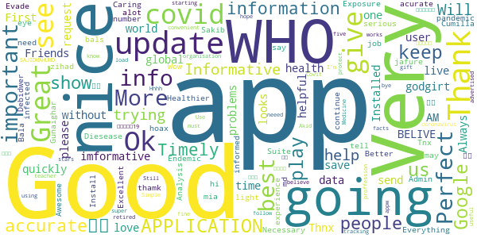

> Friends is godgirt  :date: __2021-04-27 06:51:26__

> Like it  :date: __2021-04-08 13:28:53__

> I love this app its very important for me to see what's going on in the world of Who as very imformative app  :date: __2021-03-30 14:48:27__

> Good  :date: __2021-03-24 19:33:39__

> Very good  :date: __2021-03-23 07:14:57__

> 9/12/2020  :date: __2021-03-12 11:25:34__

> Good  :date: __2021-01-17 13:53:04__

> Gives global data on covid 19 updates.  :date: __2021-01-07 08:43:58__

> Very nice app for health.  :date: __2020-12-12 06:15:46__

> Great. Installed quickly without problems. :-)  :date: __2020-11-15 16:31:45__

#### 4-star reviews

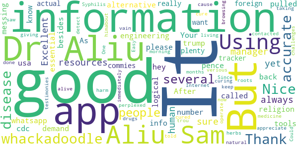

> It's always good in human resources manager  :date: __2021-03-18 00:21:01__

> Not sure yet  :date: __2020-09-27 08:50:53__

> Excellent engineering tools. Your whatsapp number please.  :date: __2020-08-05 11:01:52__

> all the demand who it is hey  :date: __2020-07-20 15:10:48__

> Using this more and more. After the cdc called religion an essential. I don't know what whackadoodle besides trump/pence is messing with the info. Thank you for being a more logical alternative. As usa is being pulled back by whackadoodles and foreign commies.  :date: __2020-07-17 03:09:14__

> Nice  :date: __2020-07-08 17:19:26__

> good  :date: __2020-06-03 00:37:10__

> It's just information, not the actual tracker. But has plenty of information that's 100% accurate.  :date: __2020-05-31 02:37:20__

> I really want to appreciate Dr. Aliu Sam for using his natural roots and herbs medicine to cure me of Syphilis Since 11 months now I have been living with this disease and it has been giving me challenges, I was so perplexed cause I have been taking several drugs to be cured but all have been in vain. One morning I was browsing through the Internet then i saw several testimonies about Dr. Aliu Sam curing people off verious diseases and immediately I contacted Dr. Aliu Sam I told himabout my trou  :date: __2020-05-08 05:33:57__

> It did not detect  :date: __2020-04-29 18:37:26__

#### 3-star reviews

> A good improvement could be the implementation of a search system for arguments that a person want to find ( like the guidelines about health and healthy diet). At first look seems it miss a lot from the website.  :date: __2020-09-27 10:09:16__

> Good App but I don't trust the WHO. Just have the app to stay up to date with the crazy things the WHO gets up to  :date: __2020-07-29 10:34:08__

> Will not download onto my 1year old state of the art smatphone. Bad, as a user of many android apps what are you thinking. I have found more than 3700 other users that can not use this app. Come on you must no you have problem.  :date: __2020-05-26 02:04:59__

> Good  :date: __2020-05-14 21:22:11__

> Best.  :date: __2020-04-20 13:14:33__

> Looks nice great look smooth Lario  :date: __2020-04-18 09:44:30__

#### 2-star reviews

> GOOD  :date: __2021-04-28 06:11:46__

> I had the app only a few seconds. I was wondering if we can use it to track vaccination. I am wondering. The EU develop a digital vaccination pass. Why does this app got not simply enhanced. The old yellow books were also from the WHO. Can you add such a feature? I think it would make really sense if the WHO had this feature in it and it can be globally used.  :date: __2021-04-04 23:04:57__

> Badly organized, unadjustable, and full of politics,i erased it  :date: __2020-11-13 07:29:53__

> Coro nosotras coronas  :date: __2020-07-02 06:41:55__

> Partial  :date: __2020-06-22 12:24:23__

> Learn more  :date: __2020-06-15 23:35:50__

> WHO Inform Covid 19  :date: __2020-05-24 17:14:56__

> Very little data or charts. Not consistent with Worldometer. Mostly an aggregation of news feeds about WHO  :date: __2020-05-15 15:38:10__

> Thanks for your help.  :date: __2020-04-22 18:52:40__

#### 1-star reviews

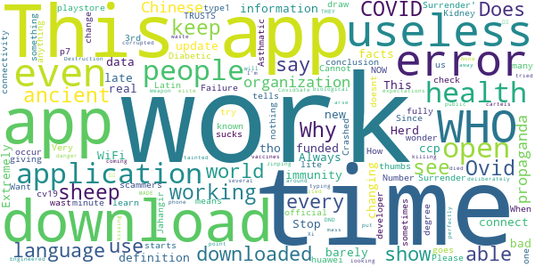

> This app is as is the definition of w.h.o. it barely works, it ccp funded, and is late with useless information.  :date: __2021-03-31 11:03:41__

> Herd immunity is real. Stop changing facts  :date: __2021-03-14 16:25:09__

> I do not like the new update.  :date: __2021-01-19 23:39:15__

> Says I can't connect even tho I have WiFi and data on  :date: __2021-01-04 02:35:04__

> Extremely bad application. Always not working at all. Why do you keep it in the playstore?!  :date: __2020-12-15 16:13:48__

> A wast of time  :date: __2020-11-04 13:04:20__

> “‘Ovid’ is Latin for a sheep. COVID starts with a C, which also means ‘see’ in ancient language. 19 was known as the “Number of Surrender” in ancient times.”  It goes on to draw the conclusion, “C-OVID 19 = ‘See a Sheep Surrender'”.  :date: __2020-11-02 08:06:17__

> Very scammers  :date: __2020-10-19 19:45:47__

> I just downloaded it, but every time I open it just say "an error occur check your connectivity" or something like that... didn't work...  :date: __2020-10-10 17:24:54__

> Does not work  :date: __2020-10-09 00:12:33__

# OpenWHO: Knowledge for Health Emergencies
App version ``3.7``

Analyzed with [covid-apps-observer](http://github.com/covid-apps-observer) project, version ``0.1``

## App overview
| | |
|-------------------------|-------------------------| 
| **Name**&nbsp;&nbsp;&nbsp;&nbsp;&nbsp;&nbsp;&nbsp;&nbsp;&nbsp;&nbsp;&nbsp;&nbsp;&nbsp;&nbsp;&nbsp;&nbsp;&nbsp;&nbsp;&nbsp;&nbsp;&nbsp;&nbsp;&nbsp;&nbsp;&nbsp;&nbsp;&nbsp;&nbsp;&nbsp;&nbsp;&nbsp;&nbsp;&nbsp;&nbsp;&nbsp;&nbsp;&nbsp;&nbsp;&nbsp;&nbsp;  | OpenWHO: Knowledge for Health Emergencies |
| **Unique identifier** | de.xikolo.openwho |
| **Link to Google Play** | [https://play.google.com/store/apps/details?id=de.xikolo.openwho](https://play.google.com/store/apps/details?id=de.xikolo.openwho) |
| **Summary**  | Life-saving knowledge for frontline responders in health emergencies. |
| **Privacy policy** | [https://openwho.org/pages/privacy](https://openwho.org/pages/privacy) |
| **Latest version** | 3.7 |
| **Last update** | 2020-11-23 13:57:15 |
| **Recent changes** | - Bug fixes and performance improvements |
| **Installs**  | 1,000,000+ |
| **Category** | Education |
| **First release** | May 17, 2017 |
| **Size**  | 18M |
| **Supported Android version**  | 5.0 and up |

### Description
> OpenWHO is the World Health Organization's (WHO) interactive knowledge-transfer platform offering online courses to improve the response to health emergencies. OpenWHO enables the Organization and its key partners to transfer life-saving knowledge to large numbers of frontline responders.
 With OpenWHO, you have the flexibility to learn at your convenience. Watch the short video lectures and test your knowledge with self-tests when and where you like. The course forum and the collaboration space allow you to get in touch with other participants and experts around the world.
  
 Designed primarily for health care workers, frontline responders, and decision-makers, the app is also a source of information for those affected by disease outbreaks and health emergencies, or for those with a general interest in WHO's work in health emergencies.
  
 It features 6 channels:
 - The <b>Outbreak</b> channel addresses the management of infectious diseases and provides life-saving, scientific information.
 - The <b>Ready for Response</b> channel helps prepare personnel who are training for deployment to work in disease outbreaks and health emergencies.
 - The <b>Get Social</b> channel focuses on social science-based interventions and helps to communicate with affected communities.
 - The <b>Preparing for Pandemics</b> channel brings together courses on various aspects of preparedness, including surveillance, public health measures and risk communication during a pandemic.
 - The <b>COVID-19</b> channel provides learning resources in WHO's 6 official languages (Arabic, Chinese, English, French, Russian and Spanish) for health professionals, decision-makers and the public for the outbreak of coronavirus disease (COVID-19).
 - The <b>COVID-19 National Languages</b> channel provides the same learning resources as the COVID-19 channel but in national languages, such as Indonesian, Japanese and Portuguese. 
  
 OpenWHO courses are available in many languages, including WHO's 6 official languages. 
  
 Download the app now, and join the OpenWHO community.
 This app is developed in cooperation between the Hasso Plattner Institute and the WHO. The learning content is provided exclusively by the WHO.

### User interface
The developers of the app provide the following screenshots in the Google play store.
| | | |
|:-------------------------:|:-------------------------:|:-------------------------:|
 |   |   |   | 
 |   |   |   | 

## Development team
In the following we report the main information provided by the development team in the Google play store.

| | |
|-------------------------|-------------------------|
| **Developer**  | HPI Knowledge Engineering Team |
| **Website**  | [https://openwho.org/](https://openwho.org/) |
| **Email** | openwho-support@hpi.de |
| **Physical address**  | [Prof.-Dr.-Helmert-Str.2-3 14482 Potsdam](https://www.google.com/maps/search/Prof.-Dr.-Helmert-Str.2-3%2014482%20Potsdam) (Google Maps) |
| **Other developed apps**  | [https://play.google.com/store/apps/developer?id=7185448023325736337](https://play.google.com/store/apps/developer?id=7185448023325736337) |

## Android support

| | |
|-------------------------|-------------------------|
| **Declared target Android version**  | - |
| **Effective target Android version**  | - |
| **Minimum supported Android version**  | Lollipop, version 5.0 (API level 21) |
| **Maximum target Android version**  | - |

The larger the difference between the minimum and maximum supported Android versions, the better. A larger difference means a wider audience. For example, old phones have a very low Android version, so a high minimum supported Android version means that the app cannot be used by users with old phones, thus leading to accessibility problems. 

## Requested permissions

In the following we report the complete list of the permissions requested by the app. 

| **Permission** | **Protection level** | **Description** | 
|-------------------------|-------------------------|-------------------------|
 **android.permission ACCESS_NETWORK_STATE** | Normal | Allows applications to access information about networks. 
 **android.permission ACCESS_WIFI_STATE** | Normal | Allows applications to access information about Wi-Fi networks. 
 **android.permission DOWNLOAD_WITHOUT_NOTIFICATION** | - | - 
 **android.permission FOREGROUND_SERVICE** | Normal | Allows a regular application to use Service.startForeground. 
 **android.permission INTERNET** | Normal | Allows applications to open network sockets. 
 **android.permission RECEIVE_BOOT_COMPLETED** | Normal | Allows an application to receive the Intent.ACTION_BOOT_COMPLETED that is broadcast after the system finishes booting. 
 **android.permission WAKE_LOCK** | Normal | Allows using PowerManager WakeLocks to keep processor from sleeping or screen from dimming. 
 **android.permission WRITE_EXTERNAL_STORAGE** | :warning:**Dangerous** | Allows an application to write to external storage. 
 **com.google.android.c2dm.permission RECEIVE** | - | - 
 **com.google.android.finsky.permission BIND_GET_INSTALL_REFERRER_SERVICE** | - | - 

## Mentioned servers

| **Server** | **Registrant** | **Registrant country** | **Creation date** | 
|-------------------------|-------------------------|-------------------------|-------------------------|
 | googlesyndication.com | Google LLC | :us: US | 2003-01-21 06:17:24 |
 | google.com | Google LLC | :us: US | 1997-09-15 04:00:00 |
 | apple.com | Apple Inc. | :us: US | 1987-02-19 05:00:00 |
 | aomedia.org | Contact Privacy Inc. Customer 1243324949 | :canada: CA | 2015-08-24 14:07:31 |
 | dashif.org | VTM Group | :us: US | 2012-04-27 13:02:46 |
 | app-measurement.com | Google LLC | :us: US | 2015-06-19 20:13:31 |
 | w3.org | W3C | :us: US | 1994-07-06 04:00:00 |
 | googleapis.com | Google LLC | :us: US | 2005-01-25 17:52:26 |
 | psdev.de | - | - | - |
 | xmlpull.org | WhoisGuard, Inc. | PA | 2001-11-26 20:33:08 |
 | crashlytics.com | Google LLC | :us: US | 2011-01-21 15:30:40 |
 | apache.org | The Apache Software Foundation | :us: US | 1995-04-11 04:00:00 |
 | opensource.org | Open Source Initiative | :us: US | 1998-02-11 05:00:00 |
 | creativecommons.org | Creative Commons Corporation | :canada: CA | 2001-01-15 16:51:44 |
 | eclipse.org | Eclipse.org Foundation, Inc. | :canada: CA | 1997-04-14 04:00:00 |
 | gnu.org | Free Software Foundation | :us: US | 1995-11-24 05:00:00 |
 | mozilla.org | Mozilla Corporation | :us: US | 1998-01-24 05:00:00 |
 | googleadservices.com | Google LLC | :us: US | 2003-06-19 16:34:53 |

## Security analysis 

Below we report the main security warnings raised by our execution of the [Androwarn](https://github.com/maaaaz/androwarn) security analysis tool.

**Telephony identifiers leakage**
> - This application reads the ISO country code equivalent of the current registered operator's MCC (Mobile Country Code) 
> - This application reads the MCC+MNC of the provider of the SIM 

**Connection interfaces exfiltration**
> - This application reads details about the currently active data network 
> - This application tries to find out if the currently active data network is metered 

**Suspicious connection establishment**
> - This application opens a Socket and connects it to the remote address ' returned no addresses for  ; port is out of range' on the 'N/A' port  
> - This application opens a Socket and connects it to the remote address '' on the 'N/A' port  
> - This application opens a Socket and connects it to the remote address 'Ljava/lang/StringBuilder;->toString()Ljava/lang/String;' on the 'N/A' port  
> - This application opens a Socket and connects it to the remote address 'Ljava/net/Proxy;->type()Ljava/net/Proxy$Type;' on the 'N/A' port  
> - This application opens a Socket and connects it to the remote address 'timeout' on the 'N/A' port  

**Code execution**
> - This application loads a native library 

## User ratings and reviews

Below we provide information about how end users are reacting to the app in terms of ratings and reviews in the Google Play store.

### Ratings

The OpenWHO: Knowledge for Health Emergencies app has been installed by more than **1000000** times. At this time, **3403** rated the app and its average score is **4.2647057**. Below we show the distribution of the ratings across the usual star-based rating of Google Play

:star::star::star::star::star:: 2403

:star::star::star::star:: 370

:star::star::star:: 130

:star::star:: 130

:star:: 370

### Reviews 

#### 5-star reviews

> Great courses available, glad I signed up!  :date: __2021-05-08 06:00:42__

> nice  :date: __2021-04-26 00:57:17__

> Love social work with love of nation.  :date: __2021-04-22 17:30:04__

> It's very usefull app  :date: __2021-04-18 18:42:21__

> I actually love this app. It's useful! I can read and internalize the whole things there. Thanks a lot!  :date: __2021-04-09 09:11:56__

> I am from India and I trust WHO. All indians love WHO, sobthere isn't much doubt to not believe this app.  :date: __2021-03-31 06:34:06__

> Covid 19 loan  :date: __2021-03-19 17:57:06__

> Good platform for learning  :date: __2021-03-15 18:21:49__

> Better Application health safety  :date: __2021-03-13 19:19:47__

> Yydud  :date: __2021-03-11 11:20:39__

#### 4-star reviews

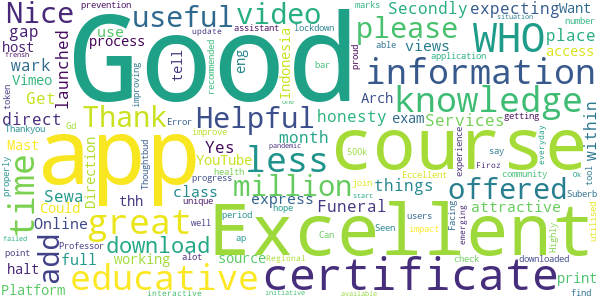

> Funeral Sewa Services  :date: __2021-04-21 07:58:33__

> Helpful  :date: __2021-03-17 21:04:11__

> Excellent  :date: __2021-03-15 02:41:11__

> Get the things that wark in all honesty s Yes it does  :date: __2021-01-11 02:38:09__

> WHO has offered great courses but we're expecting more courses within less time gap as it's been month's since WHO has launched any course.Secondly,there is no direct place offered in the WHO app to express our views.  :date: __2020-12-11 07:27:50__

> Online course class is use full  :date: __2020-07-17 11:52:09__

> Excellent information but less attractive for the most  :date: __2020-07-02 17:54:08__

> Good working  :date: __2020-06-28 08:53:05__

> Could you please host the videos also on YouTube, since we cannot access the Vimeo Platform here in Indonesia. Thank you.  :date: __2020-06-24 07:38:57__

> Good source of information  :date: __2020-06-20 09:36:05__

#### 3-star reviews

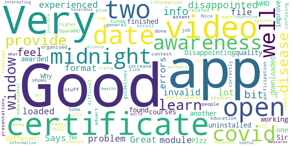

> Good info  :date: __2020-12-24 16:44:57__

> I feel a bit disappointed, experienced a lot of errors. My module and videos can't be loaded.  :date: __2020-07-26 17:32:06__

> Great app, but my only problem is that I can't open my certificate file. Says invalid format. Disappointing 😭  :date: __2020-07-23 02:09:56__

> Videos were not working only, so I uninstalled it.  :date: __2020-07-18 08:42:28__

> I have finished two courses on two different date(one before midnight, another after midnight) but found same date on both while I downloaded Certificates. Why is this?  :date: __2020-06-11 19:18:50__

> covid  :date: __2020-06-11 18:37:22__

> Sir, Plzz improve the quality of the certificate awarded by the WHO to the participants to increase more & more participation as well as awareness of the people in this contest organised by OpenWHO.  :date: __2020-05-24 16:44:50__

> Some extent it's very good and its provide guidelines to advert disease.  :date: __2020-05-23 18:33:55__

> Nice app however difficult to watch video presentations  :date: __2020-05-14 19:35:42__

> Very confusing. not happy with the link. I don't know if I have done it correctly.  :date: __2020-05-12 22:12:31__

#### 2-star reviews

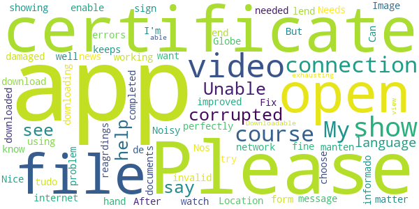

> Location  :date: __2021-05-13 11:57:32__

> Needs to be improved. Image don't show up . Fix needed  :date: __2020-12-23 15:51:31__

> The app keeps showing me this message (please enable network connection) when I open it, don't know why ?? My internet connection is working fine and I am using all the other apps perfectly well. Can you lend me a hand in this matter.  :date: __2020-11-08 08:31:34__

> After downloading the certificate at the end of the course when u try to open it. It says the file is corrupted or damaged  :date: __2020-09-23 14:26:48__

> Unable to watch the video or download the video.  :date: __2020-08-08 15:29:04__

> I can't open the certificate. Please help me out of this problem  :date: __2020-07-31 05:25:00__

> It shows errors again and again,Can't sign in  :date: __2020-06-26 16:11:53__

> I completed a course and then downloaded certificate it ... But I'm unable too see my certificate as it say corrupted file or invalid file. Please help with reagrdings to it.  :date: __2020-05-27 13:14:22__

> Noisy app.  :date: __2020-04-21 21:34:45__

> Nice  :date: __2020-04-09 16:25:41__

#### 1-star reviews

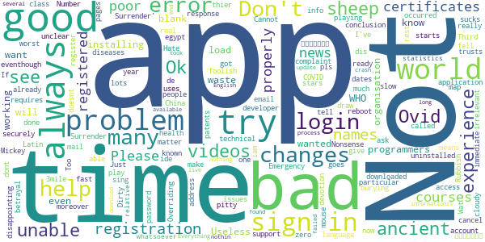

> Too slow  :date: __2021-04-24 23:22:18__

> The videos are not playing eventhough I've downloaded them  :date: __2020-11-03 10:43:38__

> “‘Ovid’ is Latin for a sheep. COVID starts with a C, which also means ‘see’ in ancient language. 19 was known as the “Number of Surrender” in ancient times.”  It goes on to draw the conclusion, “C-OVID 19 = ‘See a Sheep Surrender'”.  :date: __2020-11-02 08:04:58__

> Very bad experience i got unable to login very bad i fell worst experience  :date: __2020-09-26 10:55:02__

> Ok  :date: __2020-08-10 23:31:14__

> This is called an "Emergency" app but requires registration? Very disappointing.  :date: __2020-08-06 20:55:46__

> unable to make account and register, also not able to login.  :date: __2020-08-04 11:59:45__

> I can't Login no matter how much I try.  :date: __2020-07-04 14:19:09__

> This app is having technical issues  :date: __2020-07-03 17:13:33__

> Not a good application....It always changes names in certificates and it changes dates also moreover i have done courses and it changes there names also in certificates...so many problems...now what to do  :date: __2020-07-02 03:49:39__

# Smittestop
App version ``2.3.3``

Analyzed with [covid-apps-observer](http://github.com/covid-apps-observer) project, version ``0.1``

## App overview
| | |
|-------------------------|-------------------------| 
| **Name**&nbsp;&nbsp;&nbsp;&nbsp;&nbsp;&nbsp;&nbsp;&nbsp;&nbsp;&nbsp;&nbsp;&nbsp;&nbsp;&nbsp;&nbsp;&nbsp;&nbsp;&nbsp;&nbsp;&nbsp;&nbsp;&nbsp;&nbsp;&nbsp;&nbsp;&nbsp;&nbsp;&nbsp;&nbsp;&nbsp;&nbsp;&nbsp;&nbsp;&nbsp;&nbsp;&nbsp;&nbsp;&nbsp;&nbsp;&nbsp;  | Smittestop |
| **Unique identifier** | com.netcompany.smittestop_exposure_notification |
| **Link to Google Play** | [https://play.google.com/store/apps/details?id=com.netcompany.smittestop_exposure_notification](https://play.google.com/store/apps/details?id=com.netcompany.smittestop_exposure_notification) |
| **Summary**  | Smittestop is The Danish Ministry of Health&#39;s official COVID-19 app |
| **Privacy policy** | [https://www.smittestop.dk/databeskyttelse](https://www.smittestop.dk/databeskyttelse) |
| **Latest version** | 2.3.3 |
| **Last update** | 2021-03-19 16:38:05 |
| **Recent changes** | Minor bug fix |
| **Installs**  | 500,000+ |
| **Category** | Medical |
| **First release** | Jun 17, 2020 |
| **Size**  | 86M |
| **Supported Android version**  | 6.0 and up |

### Description
> Download the app and help stop the spread of COVID-19 in Denmark and a number of EU countries. 
 Smitte
 stop is a digital contact tracing app. With smitte
 stop we can all contribute to prevent the spread of COVID-19. The app is a supplement to the general guidelines and advice outlined by the Danish public health authorities in an effort to protect yourself and those around you from COVID-19. 
 Once you have downloaded and started using smitte
 stop, you are actively contributing to breaking chains of infection. The app will send you an alert if you have been in close contact with another app user diagnosed with COVID-19. You can then rapidly follow the advice and guidance from the public health authorities on what to next – in this manner, you are actively helping to prevent the spread of COVID-19. 
 If you yourself test positive, you can share your result with other app users. Smitte
 stop will then send alerts to other app users who have spent time near you. These alerts will not identify you as an individual.  
 It is voluntary to download and use the app – but the more people that do so, the more the app can assist us in preventing the spread of the virus. 
 How smitte
 stop works
 • When you activate smitte
 stop, your phone uses random Bluetooth IDs to determine whether you may have in close contact with someone who has shared in smitte
 stop that he or she has been diagnosed with COVID-19. The randomly generated IDs are being stored on your phone. The IDs will only leave your phone when you voluntarily choose to share in the app that you have COVID-19 using your NemID. The IDs change every 10 to 20 minutes and are not tied up to your identity. 
 • Smitte
 stop uses your phone’s COVID-19 Exposure Notifications, developed by Apple and Google. 
 • No one can see your identity nor your location. And you can’t see the identity of those you may have been in close contact with, nor where they have been. 
 • Neither public authorities nor private companies have access to information about who you have been in close contact with. They also do not have access to any information in case you receive an alert in the app that you have been near someone who has reported being diagnosed with COVID-19. 
 • The app does not use GPS-based location to register data about your whereabouts. 
 • Basically, the app works like this: Two phones will recognise each other through the app and will then exchange random IDs by means of Bluetooth. 
 • At least once a day, the system will download keys for the random numbers that have been verified by public health authorities as belonging to people confirmed to be positive for COVID-19.
 Expect updates with new features or improvement of the user experience. 
 When you download smitte
 stop, you agree to Terms and conditions. You must also give consent once you have downloaded the app. 
 Smitte
 stop is developed by the Danish Ministry of Health in cooperation with the Danish Patient Safety Authority, Statens Serum Institut, the Danish Health Authority, and the Agency for Digitisation. 
 Read more about the app at https://smittestop.dk/en

### User interface
The developers of the app provide the following screenshots in the Google play store.
| | | |
|:-------------------------:|:-------------------------:|:-------------------------:|
 | 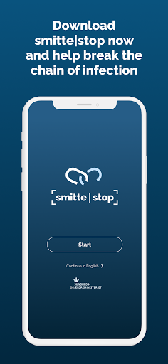  | 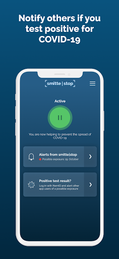  | 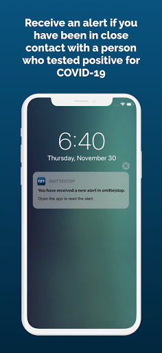  | 

## Development team
In the following we report the main information provided by the development team in the Google play store.

| | |
|-------------------------|-------------------------|
| **Developer**  | Sundheds- og Ældreministeriet |
| **Website**  | [https://www.smittestop.dk](https://www.smittestop.dk) |
| **Email** | info@sundhed.dk |
| **Physical address**  | [Sundheds- og Ældreministeriet Holbergsgade 6, 1057 København K, Denmark](https://www.google.com/maps/search/Sundheds-%20og%20Ældreministeriet%20Holbergsgade%206,%201057%20København%20K,%20Denmark) (Google Maps) |
| **Other developed apps**  | [https://play.google.com/store/apps/developer?id=Sundheds-+og+%C3%86ldreministeriet](https://play.google.com/store/apps/developer?id=Sundheds-+og+%C3%86ldreministeriet) |

## Android support

| | |
|-------------------------|-------------------------|
| **Declared target Android version**  | Android10, version 10 (API level 29) |
| **Effective target Android version**  | Android10, version 10 (API level 29) |
| **Minimum supported Android version**  | Marshmallow, version 6.0 (API level 23) |
| **Maximum target Android version**  | - |

The larger the difference between the minimum and maximum supported Android versions, the better. A larger difference means a wider audience. For example, old phones have a very low Android version, so a high minimum supported Android version means that the app cannot be used by users with old phones, thus leading to accessibility problems. 

## Requested permissions

In the following we report the complete list of the permissions requested by the app. 

| **Permission** | **Protection level** | **Description** | 
|-------------------------|-------------------------|-------------------------|
 **android.permission ACCESS_NETWORK_STATE** | Normal | Allows applications to access information about networks. 
 **android.permission BLUETOOTH** | Normal | Allows applications to connect to paired bluetooth devices. 
 **android.permission FOREGROUND_SERVICE** | Normal | Allows a regular application to use Service.startForeground. 
 **android.permission INTERNET** | Normal | Allows applications to open network sockets. 
 **android.permission READ_APP_BADGE** | - | - 
 **android.permission RECEIVE_BOOT_COMPLETED** | Normal | Allows an application to receive the Intent.ACTION_BOOT_COMPLETED that is broadcast after the system finishes booting. 
 **android.permission WAKE_LOCK** | Normal | Allows using PowerManager WakeLocks to keep processor from sleeping or screen from dimming. 
 **com.anddoes.launcher.permission UPDATE_COUNT** | - | - 
 **com.htc.launcher.permission READ_SETTINGS** | - | - 
 **com.htc.launcher.permission UPDATE_SHORTCUT** | - | - 
 **com.huawei.android.launcher.permission CHANGE_BADGE** | - | - 
 **com.huawei.android.launcher.permission READ_SETTINGS** | - | - 
 **com.huawei.android.launcher.permission WRITE_SETTINGS** | - | - 
 **com.majeur.launcher.permission UPDATE_BADGE** | - | - 
 **com.oppo.launcher.permission READ_SETTINGS** | - | - 
 **com.oppo.launcher.permission WRITE_SETTINGS** | - | - 
 **com.sec.android.provider.badge.permission READ** | - | - 
 **com.sec.android.provider.badge.permission WRITE** | - | - 
 **com.sonyericsson.home.permission BROADCAST_BADGE** | - | - 
 **com.sonymobile.home.permission PROVIDER_INSERT_BADGE** | - | - 
 **me.everything.badger.permission BADGE_COUNT_READ** | - | - 
 **me.everything.badger.permission BADGE_COUNT_WRITE** | - | - 

## Mentioned servers

| **Server** | **Registrant** | **Registrant country** | **Creation date** | 
|-------------------------|-------------------------|-------------------------|-------------------------|
 | google.com | Google LLC | :us: US | 1997-09-15 04:00:00 |
 | googleapis.com | Google LLC | :us: US | 2005-01-25 17:52:26 |

## Security analysis 

Below we report the main security warnings raised by our execution of the [Androwarn](https://github.com/maaaaz/androwarn) security analysis tool.

**Connection interfaces exfiltration**
> - This application reads details about the currently active data network 
> - This application tries to find out if the currently active data network is metered 

**Code execution**
> - This application loads a native library: 'mono-native' 
> - This application loads a native library: 'monodroid' 
> - This application loads a native library: 'monosgen-2.0' 
> - This application loads a native library: 'xamarin-app' 
> - This application loads a native library: 'xamarin-debug-app-helper' 

## User ratings and reviews

Below we provide information about how end users are reacting to the app in terms of ratings and reviews in the Google Play store.

### Ratings

The Smittestop app has been installed by more than **500000** times. At this time, **2210** rated the app and its average score is **2.7828054**. Below we show the distribution of the ratings across the usual star-based rating of Google Play

:star::star::star::star::star:: 580

:star::star::star::star:: 250

:star::star::star:: 280

:star::star:: 310

:star:: 790

### Reviews 

#### 5-star reviews

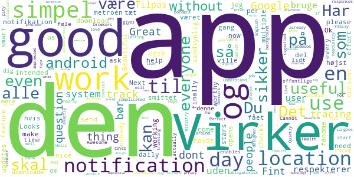

> Works as intended:) please everyone download it to make it even more useful :)  :date: __2021-04-06 19:45:34__

> Ok  :date: __2021-02-03 14:38:06__

> Virker som den skal. Har fået notifikation en gang, om at jeg har været tæt på en smittet - højst sandsynlig i metroen, så den del virker også.  :date: __2021-01-14 12:33:22__

> Looks like the app is finally working now. I have multiple checks per day that come with a notification. And the daily updates are a nice feature too. Next time you need to ask for consent, you have to send us a notification, nobody opens this app every day.  :date: __2020-12-21 13:01:44__

> Beautiful  :date: __2020-11-16 15:17:20__

> The effort to help is worthy 5 stars  :date: __2020-10-07 15:31:28__

> Det ville fandme være smart, hvis alle havde den app her!  :date: __2020-09-29 22:46:47__

> Du skal downloade denne app så kan du føle dig lidt mere sikker i det offentlige!  :date: __2020-09-24 17:28:21__

> Cannot start on android 11. For others, Android 11 enables to use it without actually having location on. (Google thing)  :date: __2020-09-13 00:21:30__

> Awesome  :date: __2020-08-21 00:40:31__

#### 4-star reviews

> Ønskes: mulighed for at fravælge irriterende info-notifikation  :date: __2021-02-05 16:08:10__

> The app used to hsve problems with not syncing data automatically on android phones, but this appears to be fixed. Would be good if it excluded "hot spots" like testing centers from alerts.  :date: __2021-01-14 21:14:11__

> Smittestop app is inactive... Get this message every few days and need to open it to activate it  :date: __2020-12-21 08:46:51__

> Please allow detecting contacts across a phone "backup, wipe, restore" sequence, as the backup app reported that you don't. Desired bonus featue: Basic stats display like "Active for XX hours with XX different IDs, XXX anonymous contact IDs recorded, 0 contact IDs were infectious, you are NOT registered as infected, latest list of infectIous IDs downloaded yesterday at HH:MM".  :date: __2020-12-16 23:30:51__

> Thank you for the English version. Not everyone who wants to use the app is fully fluent in Danish and this makes it possible. Having the Gps and Bluetooth on all the time drains battery, but there is probably nothing you can do about it.  :date: __2020-11-10 09:05:50__

> Make it available also in english. Tak!  :date: __2020-09-27 15:44:33__

> Foreslag: Lav en "Del" knap så man kan sende et direkte link til app'en i App/Play Store via diverse besked apps. Specielt nyttigt for den gruppe der har svært ved at overskue opgaven, selv at skulle søge og downloade app'en.  :date: __2020-09-21 07:41:45__

> Take google and apple out!  :date: __2020-09-12 17:10:38__

> Works, I guess. Needs english version asap for the students and other internationals, though  :date: __2020-08-09 14:14:52__

> To increase trust and adoption this app should be made open source. That way, we all could have a look at the code to see if there's any privacy breach, and could even contribute with an English translation for the app. Plus, Denmark would set the example and other countries would follow. You might think that an open source app is more vuneravle to attacks but this is a very naïve arguments: vulnerabilities are exposed and fixed faster.  :date: __2020-08-07 08:44:54__

#### 3-star reviews

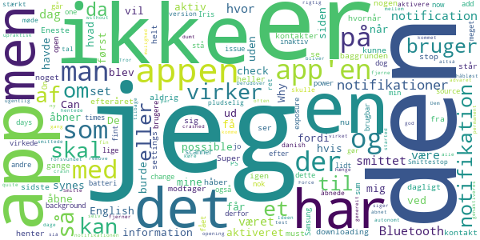

> It started to crash quite often (without opening it I get a notification that it crashed) + is it possible to remove "app is downloading information.." notifications ?  :date: __2021-03-21 10:42:54__

> Ideen med app'en er rigtig god, men det er håbløst upraktisk at den skal genaktiveres en gang i mellem. Den skal kunne køre autonomt i baggrunden.  :date: __2021-02-02 14:55:06__

> Tror ikke helt på den virker. Først havde den en ugentlig notifikation om at den hentede kontakter. Dem har jeg ikke set siden efteråret. Så da jeg åbner app'en nu her, ser den ud som den skal, men der er kommet en ny permanent notifikation som siger den henter kontakter. Så siden efteråret har den altså ikke virket fordi jeg ikke har åbnet appen? Eller hvad?  :date: __2021-01-14 12:09:44__

> Notification "henter information" bliver ved med at hænge der og jeg kan ikke komme af med den. Force stop fjerner, men når jeg åbner app'en er de et tilbage igen. Og den har aldrig advaret mig om noget.  :date: __2021-01-13 09:53:00__

> De sidste par dage er notifikationen "Smitte|stop is downloading information" ikke forsvundet af sig selv og har ikke været til at fjerne. Eneste mulighed er at slå alle notifikationer for appen fra, men så vil man heller ikke få notifikation, når man har været i kontakt med en smittet. Derudover dumt at man generelt ikke kan se, hvornår man har været i kontakt med den smittede, så man ved, hvornår man burde få en test.  :date: __2021-01-13 08:35:08__

> Super fin app set fra brugervenlighed, men her på det sidste, sker det flere gange dagligt jeg får notifikationer om at app'en skal åbnes og aktiveres... Den må virkelig være ustabil...  :date: __2021-01-04 12:25:19__

> Mine notifikationer fortæller mig at jeg ikke modtager notifikationer grundet manglende Bluetooth tilladelse. Jeg har tjekket settings både i app og på telefonen, og Bluetooth burde virke. I mine app settings står der at appen ikke kræver nogen tilladelser. Det kan være at appen virker, men siden jeg modtager kryptiske notikationer, synes jeg den er svær at stole på. Jeg håber der sidder en developer i den anden ende, som kan fortælle mig hvad der er i vejen.  :date: __2021-01-03 22:41:48__

> Why do I get a notification that the app is checking for possible contacts? That must happen in the background, not needed to annoy me many times during other use  :date: __2020-12-27 00:03:00__

> Synes den virkede fint i starten, mens efter seneste opdatering sætter den sig inaktiv hver dag, så jeg skal åbne appen for at den går i aktiv tilstand igen. Er dette et forsøg på at minimere strømforbrug eller fordi appen ikke kan downloade data i baggrunden? Jeg får heldigvis en notifikation om at den er inaktiv, men den kan man jo hurtigt overse hvis man ikke lige kigger på mobilen hele tiden  :date: __2020-12-20 07:49:51__

> Virker, da der kommer notifikationer, men først når jeg åbner appen. Har aldrig fået notifikation uden at åbne appen.  :date: __2020-12-16 18:45:11__

#### 2-star reviews

> Det er irriterende at default settings ikke er uden notifikationer om download. Smitteapp burde ikke give lyd fra sig medmindre jeg skal gøre noget. Dvs blive testet pga. kontakt med en smittet. Ellers er det bare støj. Støj gør at folk bliver irriteret og når det er sjældent den faktisk opfanger en smittet så vil smitteapp blive afinstalleret!  :date: __2021-01-19 10:41:43__

> Der er stop forskel på sensitivitet en af Bluetooth antenner tror jeg. Når jeg færdes med min kæreste får jeg typisk 2-4 matchende Keys og hun får ingen i perioder hvor jeg ikke ser andre mennesker end hende. Så jeg tror ikke på Bluetooth som en afstandsmålingsteknologi. Nu hvor alle bærer maske giver det heller ikke mening at man sksl testes pga. tæt kontakt ens man var beskyttet og når man ikke får tidspunkt for kontakten kan man ikke selv filtrere effektivt. Så et stort potentiale er spildt  :date: __2021-01-13 10:29:58__

> App'en er gået fuldstændig amok. Den giver notifikation hvert 10. sekund, med besked om at "Smitte|Stop is downloading information". Samtidig kan app'en ikke åbnes. Problemet er startet efter ankoms til Grønland. Update: Det viser sig, at fejlen optræder når telefonens tidszone er den lokale (her UTC+3), men hvis telefonen tvinges til at bruge dansk tid, så er alt OK.  :date: __2021-01-06 20:56:52__

> Det er en elendig app. Jeg får flere gange dagligt besked på at genstarte appen og jævnligt besked på at aktivere bluetooth og GPS selv om de er slået til. Det er imponerende der er så mange fejl i en så vigtig så efter så lang tid.  :date: __2021-01-03 06:48:18__

> Denne app er begyndt at sende tomme notifikationer hver morgen, så telefonen siger ding, men der ikke er nogen besked. Kigger man i telefonens notifikationsindstillinger kan man se at ding lyden kommer fra denne app, men åbner man app'en, er det ingen beskeder.  :date: __2020-12-18 07:09:03__

> For ringe at app'en har haft så mange fejl. Først så fangede den ikke folk som du havde været i nærkontakt, derefter giver den dig ikke notifikationer medmindre du åbner app'en. Tager I ikke jeres job seriøst, NetCompany? Jeres app giver en falsk tryghed som kan koste menneskeliv. Meld dog klart ud til folk, hvis jeres app kræver at den skal åbnes med jævne mellemrum. Endnu bedre påmind dem om at åbne app'en. Alt andet er komplet uansvarligt.  :date: __2020-12-18 02:13:32__

> Vigtig app, men den virker elendigt og brugerfladen er utroligt ringe. Den mangler desperat mulighed for at man kan gå ind i app'en og bede om statistik på hvor meget der er checket og en indikator på at den rent faktisk kører. Et tray ikon ville også hjælpe meget.  :date: __2020-12-17 15:45:32__

> Meget simpel to-the-point app. Bad kun om adgang til exposure notification, og ikke kamera, lager, gps eller hvad ved jeg. Derimod virker notificationer dårligt. Man skal helst ikke lukke appen og åbne den jævnligt for at få besked.  :date: __2020-12-17 09:32:14__

> Registrerer ikke mange kontakter... Og virker ret ligegyldig - men har den da tændt 24 timer i døgnet  :date: __2020-10-19 08:55:27__

> It is not compatible with my (old) mobile  :date: __2020-10-09 13:49:57__

#### 1-star reviews

> Good initiative, but the app only asks my phone for exposure details VERY rarely.. so it's not working properly.  :date: __2021-05-21 20:23:31__

> Looks like the app is back to not checking for exposures, even if I open it manually. It suddenly struck me that I hadn't see the "checking for exposure" notification in a while, and lo and behold, there's 0 checks registered by my phone the last 30 days. Furthermore, the app has used 6mb of data since January (seems too little), and 0mb in all of April. I'm going back to my original rating: absolutely atrocious that THIS has been released to the population, as it's completely useless.  :date: __2021-04-17 06:52:29__

> Only using Blue tooth right... Oh wait we need to use your GPS.. for what exchanging local messages over BT right as if..  :date: __2021-04-13 10:55:27__

> Blev nødt til at afinstallere, da den seneste opdatering stopper igen og igen og strømforbruget er helt ekstremt, så højt at telefon advarer om forbruget.  :date: __2021-03-20 10:45:27__

> Dårlig app. Dur ganske enkelt ikke. Stopper jævnligt uden grund, bruger urimeligt CPU og dermed batteri... Og værst: har ikke én eneste gang fundet nærsmittet, selvom jeg flere gange har været i nærheden af en smittet. Hermed afinstalleret. Håber ikke staten har betalt for det ulødige produkt.  :date: __2021-03-19 19:41:31__

> Shows PM/AM times in a 24H setting!  :date: __2021-02-23 21:07:15__

> På det sidste har jeg fået en notifikation hver morgen om at appen er deaktiveret. Ydermere er er jo næsten ubrugeligt at appen ikke fortæller hvilken dag man har været i kontakt med nogen, så man ved hvilke dage man burde blive testet.  :date: __2021-02-15 07:56:43__

> Keeps on pushing notifications on different times at day or night without any new alerts. As we say in Danish: Det er en ommer.  :date: __2021-02-09 17:10:10__

> Keeps crashing every day  :date: __2021-02-08 05:15:34__

> What was the point of this app? Germany opensourced their english app way before smittestop was published, and theirs worked well while smittestop found out only in november that for the entire time theirs didnt. German coronawarnapp has more features and did not destroy the users trust. When i ask danes if they use smittestop app they usually say no or they have never heard of it. I know people who had risk contact over coronawarnapp so im sure it works. Screw this app im using coronawarnapp.  :date: __2021-02-05 12:44:01__

# Credits

This project makes use of the following main third-party projects:
* Androguard: [https://github.com/androguard/androguard](https://github.com/androguard/androguard)
* Androwarn: [https://github.com/maaaaz/androwarn](https://github.com/maaaaz/androwarn)
* google_play_scraper: [https://github.com/JoMingyu/google-play-scraper](https://github.com/JoMingyu/google-play-scraper)
* whois: [https://github.com/DannyCork/python-whois](https://github.com/DannyCork/python-whois)
* BeautifulSoup: [https://www.crummy.com/software/BeautifulSoup](https://www.crummy.com/software/BeautifulSoup)

Other open-source projects used in this project include: 

- androguard==3.3.5
- appnope==0.1.0
- asn1crypto==1.3.0
- backcall==0.1.0
- beautifulsoup4==4.9.0
- bs4==0.0.1
- certifi==2020.4.5.1
- cffi==1.14.0
- chardet==3.0.4
- click==7.1.2
- colorama==0.4.3
- cryptography==2.9.2
- cycler==0.10.0
- decorator==4.4.2
- future==0.18.2
- google-play-scraper==0.1.1
- idna==2.9
- ipython==7.13.0
- ipython-genutils==0.2.0
- jedi==0.17.0
- Jinja2==2.11.2
- joblib==0.14.1
- kiwisolver==1.2.0
- lxml==4.5.0
- MarkupSafe==1.1.1
- matplotlib==3.2.1
- networkx==2.4
- nltk==3.5
- numpy==1.18.3
- parso==0.7.0
- pexpect==4.8.0
- pickleshare==0.7.5
- Pillow==7.1.2
- play-scraper==0.6.0
- prompt-toolkit==3.0.5
- ptyprocess==0.6.0
- pycountry==19.8.18
- pycparser==2.20
- pydot==1.4.1
- Pygments==2.6.1
- pyOpenSSL==19.1.0
- pyparsing==2.4.7
- python-dateutil==2.8.1
- regex==2020.4.4
- requests==2.23.0
- requests-futures==1.0.0
- six==1.14.0
- soupsieve==2.0
- tld==0.12.1
- tqdm==4.45.0
- traitlets==4.3.3
- urllib3==1.25.9
- wcwidth==0.1.9
- wordcloud==1.7.0

