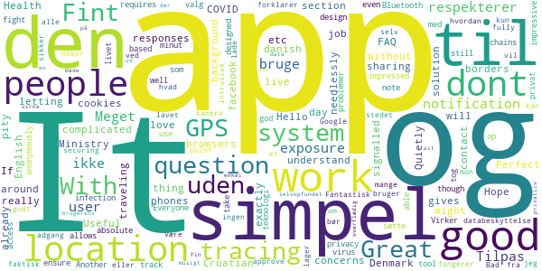
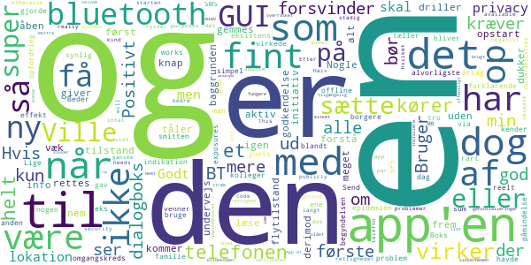
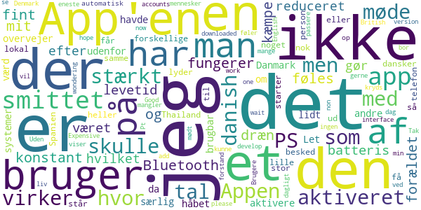
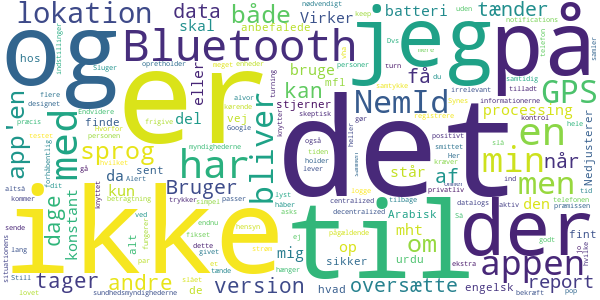
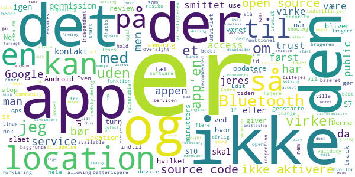

# Smittestop
App version ``1.0.3``

Analyzed with [covid-apps-observer](http://github.com/covid-apps-observer) project, version ``0.1``

## App overview
| | |
|-------------------------|-------------------------| 
| **Name**&nbsp;&nbsp;&nbsp;&nbsp;&nbsp;&nbsp;&nbsp;&nbsp;&nbsp;&nbsp;&nbsp;&nbsp;&nbsp;&nbsp;&nbsp;&nbsp;&nbsp;&nbsp;&nbsp;&nbsp;&nbsp;&nbsp;&nbsp;&nbsp;&nbsp;&nbsp;&nbsp;&nbsp;&nbsp;&nbsp;&nbsp;&nbsp;&nbsp;&nbsp;&nbsp;&nbsp;&nbsp;&nbsp;&nbsp;&nbsp;  | Smittestop |
| **Unique identifier** | com.netcompany.smittestop_exposure_notification |
| **Link to Google Play** | [https://play.google.com/store/apps/details?id=com.netcompany.smittestop_exposure_notification](https://play.google.com/store/apps/details?id=com.netcompany.smittestop_exposure_notification) |
| **Summary**  | Infect Stops is the official Ministry of Health and Elderly&#39;s COVID-19 app. |
| **Privacy policy** | [https://www.smittestop.dk/databeskyttelse](https://www.smittestop.dk/databeskyttelse) |
| **Latest version** | 1.0.3 |
| **Last update** | 2020-07-09 16:56:07 |
| **Recent changes** | Mindre stabilitets- og fejlrettelse |
| **Installs**  | 100,000+ |
| **Category** | Medical |
| **First release** | Jun 17, 2020 |
| **Size**  | 96M |
| **Supported Android version**  | 6.0 and up |

### Description
> Hent appen, og hjælp med at stoppe smittespredning af COVID-19 i Danmark.
  
 Appen smitte
 stop giver os alle sammen mulighed for at være med til at stoppe udbredelsen af COVID-19 i Danmark. Smitte
 stop skal sammen med anbefalingerne fra myndighederne hjælpe os med at passe godt på hinanden, mens samfundet genåbner. 
  
 Med smitte
 stop kan du være med til at bryde smittekæder. Smitte
 stop giver dig mulighed for at få besked, når du har været tæt på en anden bruger af appen, der har fået COVID-19. På den måde, kan du hurtigt følge sundhedsmyndighedernes anbefalinger og derved bryde en mulig smittekæde. Du kan give besked til andre brugere af appen, hvis du bliver testet positiv. De kan ikke se, hvem du er.
 Det er frivilligt at hente og anvende appen, men jo flere, der anvender den, jo flere smittekæder kan appen hjælpe med at bremse. 
  
 Hvordan fungerer smitte
 stop?
 • Når du aktiverer smitte
 stop, bruger din telefon tilfældige Bluetooth-ID’er til at finde ud af, om du muligvis har været tæt på nogen, der har oplyst i appen, at de har COVID-19. De tilfældige ID’er bliver lagret på din telefon og forlader kun din telefon, når du frivilligt og aktivt giver besked i appen med dit NemID, at du har COVID-19.
 • Smitte
 stop bruger din telefons ’Notifikationer om eksponering for COVID-19’, som er udviklet af Apple og Google. 
 • Ingen kan se, hvem du er, og du kan ikke se, hvem du har opholdt dig tæt på. 
 • Ingen myndigheder eller virksomheder har adgang til oplysninger om, hvem du har været i nærheden af, eller hvis du i appen får besked om, at du har været tæt på en COVID-19-positiv
 • Appen bruger ikke GPS til at registrere data  om, hvor du befinder dig.
 • To telefoner genkender hinanden via appen og udveksler tilfældige ID’er gennem bluetooth. 
  
 Arbejdet med at udvikle appens funktioner sker løbende. 
  
 Ved at downloade smitte
 stop accepterer du Vilkår og betingelser. Du skal give samtykke, når du har downloadet appen. 
  
 Smitte
 stop er udviklet af Sundheds- og Ældreministeriet i samarbejde med Styrelsen for Patientsikkerhed, Statens Serum Institut, Sundhedsstyrelsen og Digitaliseringsstyrelsen. Læs mere om appen på: www.smittestop.dk.

### User interface
The developers of the app provide the following screenshots in the Google play store.
| | | |
|:-------------------------:|:-------------------------:|:-------------------------:|
 |   |   |   | 

## Development team
In the following we report the main information provided by the development team in the Google play store.

| | |
|-------------------------|-------------------------|
| **Developer**  | Sundheds- og Ældreministeriet |
| **Website**  | [https://www.smittestop.dk](https://www.smittestop.dk) |
| **Email** | info@sundhed.dk |
| **Physical address**  | [Sundheds- og Ældreministeriet Holbergsgade 6, 1057 København K, Denmark](https://www.google.com/maps/search/Sundheds-%20og%20Ældreministeriet%20Holbergsgade%206,%201057%20København%20K,%20Denmark) (Google Maps) |
| **Other developed apps**  | [https://play.google.com/store/apps/developer?id=Sundheds-+og+%C3%86ldreministeriet](https://play.google.com/store/apps/developer?id=Sundheds-+og+%C3%86ldreministeriet) |

## Android support

| | |
|-------------------------|-------------------------|
| **Declared target Android version**  | Android10, version 10 (API level 29) |
| **Effective target Android version**  | Android10, version 10 (API level 29) |
| **Minimum supported Android version**  | Marshmallow, version 6.0 (API level 23) |
| **Maximum target Android version**  | - |

The larger the difference between the minimum and maximum supported Android versions, the better. A larger difference means a wider audience. For example, old phones have a very low Android version, so a high minimum supported Android version means that the app cannot be used by users with old phones, thus leading to accessibility problems. 

## Requested permissions

In the following we report the complete list of the permissions requested by the app. 

| **Permission** | **Protection level** | **Description** | 
|-------------------------|-------------------------|-------------------------|
 **android.permission ACCESS_NETWORK_STATE** | Normal | Allows applications to access information about networks. 
 **android.permission BLUETOOTH** | Normal | Allows applications to connect to paired bluetooth devices. 
 **android.permission FOREGROUND_SERVICE** | Normal | Allows a regular application to use Service.startForeground. 
 **android.permission INTERNET** | Normal | Allows applications to open network sockets. 
 **android.permission RECEIVE_BOOT_COMPLETED** | Normal | Allows an application to receive the Intent.ACTION_BOOT_COMPLETED that is broadcast after the system finishes booting. 
 **android.permission WAKE_LOCK** | Normal | Allows using PowerManager WakeLocks to keep processor from sleeping or screen from dimming. 

## Mentioned servers

| **Server** | **Registrant** | **Registrant country** | **Creation date** | 
|-------------------------|-------------------------|-------------------------|-------------------------|
 | google.com | Google LLC | :us: US | 1997-09-15 04:00:00 |
 | googleapis.com | Google LLC | :us: US | 2005-01-25 17:52:26 |

## Security analysis 

Below we report the main security warnings raised by our execution of the [Androwarn](https://github.com/maaaaz/androwarn) security analysis tool.

**Connection interfaces exfiltration**
> - This application reads details about the currently active data network 
> - This application tries to find out if the currently active data network is metered 

**Code execution**
> - This application loads a native library: 'monodroid' 
> - This application loads a native library: 'monosgen-2.0' 
> - This application loads a native library: 'xamarin-app' 
> - This application loads a native library: 'xamarin-debug-app-helper' 

## User ratings and reviews

Below we provide information about how end users are reacting to the app in terms of ratings and reviews in the Google Play store.

### Ratings

The Smittestop app has been installed by more than **100000** times. At this time, **592** rated the app and its average score is **3.61**. Below we show the distribution of the ratings across the usual star-based rating of Google Play

:star::star::star::star::star:: 272

:star::star::star::star:: 94

:star::star::star:: 65

:star::star:: 41

:star:: 118

### Reviews 

#### 5-star reviews

> Perfect app. Quietly doing it's job in the background. Hope some day it will work over the borders too when traveling around. It signalled that I have been in contact with other phones already and that's exactly what it should do.  :date: __2020-07-26 06:26:50__

> Great solution! I am impressed by how well the app and tracing system was designed. It's impressive how the design allows to both ensure absolute privacy of all users while still being able to track infection chains anonymously. Good work!  :date: __2020-07-08 17:21:06__

> Everyone should take note that even though the app requires location access, it doesn't use your GPS. It's only for Bluetooth based tracing 👍🏻  :date: __2020-06-27 14:06:19__

> Great app. Another tool in our fight against the virus.  :date: __2020-06-27 11:32:10__

> Virker uden problemer og tog 1 minut at sætte op. Fint teknologi valg som respekterer privat livet.  :date: __2020-06-19 22:10:06__

> Simpel app med god databeskyttelse.  :date: __2020-06-19 14:48:55__

> Fint lavet.  :date: __2020-06-18 19:39:34__

> Meget simpel og forklarer godt hvordan den fungerer. Håber mange vil bruge den :)  :date: __2020-06-18 16:24:54__

> Meget simpel to-the-point app. Bad kun om adgang til exposure notification, og ikke kamera, lager, gps eller hvad ved jeg.  :date: __2020-06-18 11:10:35__

> Tilpas simpel til at alle kan bruge den. Tilpas sikker til at ingen bør lade være.  :date: __2020-06-18 10:05:05__

#### 4-star reviews

> Fint initiativ, app'en er nem at forstå når først den er aktiv. Dog er der alt for meget at læse under første opstart, det bør gemmes væk under en "mere info" - knap. Nogle giver op undervejs. Det alvorligste problem med app'en er dog at så få kender til dens eksistens, i min omgangskreds blandt familie, venner og kolleger er det kun få. Send dog en opfordring via e-Boks og SMS til alle borgere, som man gjorde om smitten i begyndelsen af epidemien!  :date: __2020-07-25 08:35:09__

> Ville være fint hvis den gav en mere synlig påmindelse når den af den ene eller anden årsag bliver offline. Ellers super simpel at sætte op og bruge.  :date: __2020-07-22 09:56:46__

> I guess it works  :date: __2020-07-12 14:22:36__

> Lige til og forklarende. Bruger ikke GPS som nogen ser ud til at tro. Ville dog være rart med en indikation at at den reelt virkede og havde en effekt. F.eks. en sum tæller over exposures på en dag.  :date: __2020-06-26 22:34:09__

> Udmærket ide. Mangler dog noget funktionalitet der selv tænder/slukker for registreringen. Man kunne holde det op mod sit WiFi eller antenne master omkring sin bopæl. Alt dette er information der kan være lokalt, så man ikke skal dele unødige oplysninger. Endnu en ting: lad der være en notikation, når appen er slået til, så man nemt kan se at den er tændt, i stedet for at skulle åbne app.  :date: __2020-06-26 09:27:26__

> Positivt: Beder kun om bluetooth-rettigheder, intet andet; dvs god privacy. Halv-negativt: Fylder 107 MB, hvilket ganske vist er langt bedre end første release, men stadig en del på min telefon, som ikke er helt ny.  :date: __2020-06-23 00:15:32__

> This kind of app really needs the source code to be publicly available for security purposes. Otherwise it will be more prone to vulnerabilities.  :date: __2020-06-22 16:31:42__

> Efter problemer i starten, og et par geninstalleringer virker app'en nu som den skal, super.  :date: __2020-06-22 08:42:29__

> Positivt overrasket over at der er brugt en sikker og anonym protokol. Nemt at installere og sætte op. App'et har ikke rettighed til lokation, selvom lokation skal være slået til for at bluetooth virker. Ville have elsket at have kildekoden være offentligt tilgængelig så sikkerheden kunne verificeres.  :date: __2020-06-19 14:55:27__

> Bruger lidt ekstra strøm, men ellers ser app'en ud til at fungere fint. Godt at den blev implementeret med privacy in mind  :date: __2020-06-19 08:21:56__

#### 3-star reviews

> Appen fungerer fint, men det er et kæmpe dræn at skulle have Bluetooth aktiveret konstant. Det føles forældet og mit batteris levetid har været stærkt reduceret efter jeg har aktiveret appen hvilket gør at jeg stærkt overvejer om det er det værd.  :date: __2020-07-12 13:03:44__

> Let at aktivere, men da den ikke virker udenfor Danmark med andre systemer, er den ikke særlig brugbar. Jeg havde håbet lidt på at man ikke skulle have 7 forskellige apps på for at få noget ud af det. At møde en smittet dansker i en lille by i Spanien eller Thailand er nok ikke så stor, som at møde en lokal der er smittet. Det lyder heller ikke til at man får besked med det samme man står over for en smittet person (telefon). PS : den starter ikke automatisk op...  :date: __2020-07-11 23:34:50__

> Expensive app for Denmark to develop. Good that the app now can be downloaded by non danish accounts.... I was wondering if I should wait for the British one and hope it would work with the danish version..  :date: __2020-07-03 19:54:41__

> Jeg mangler at kunne se Brugere, af App'en. I den forstand at jeg gerne vil have et tal for hvor mange Bruger jeg har mødt på min dag. Pt virker det som ingen bruger App'en. Ps jeg bor ved et kryds hvor der dagligt passere over 2000 mennesker. Et tal der viser at der er 'liv/bruger af App'en Tak. Uden det føler jeg at jeg er den eneste der bruger App'en.  :date: __2020-06-27 01:15:31__

> Can you please add an English interface?  :date: __2020-06-22 22:51:57__

#### 2-star reviews

> Nedjusterer til 2 stjerner. At en engelsk version er på vej er fint, men alt for sent. Og hvad med andre sprog? Arabisk, urdu mfl? Jeg er sikker på at at I kan finde de anbefalede sprog hos sundhedsmyndighederne Det tager et par dage at oversætte. I betragtning af situationens alvor håber jeg en version på flere sprog kommer om få dage. Så meget er der altså heller ikke at oversætte. Det er en ommer.  :date: __2020-07-12 19:36:35__

> Alert notifications keep turning off???  :date: __2020-07-01 06:29:47__

> App'en tænder ikke når jeg trykker bekræft, har både bluetooth, GPS og data slået til  :date: __2020-06-29 11:41:00__

> 1. Bruger appen centralized report processing eller decentralized report processing? 2. Hvorfor er det nødvendigt at logge ind med NemId? Her samler i jo datalogs og knytter det på personen med det pågældende NemId? Dvs. myndighederne har kontrol over præcis hvilke personer der er smittet, da det er knyttet op på NemId.  :date: __2020-06-26 13:38:34__

> Synes ikke at appen opretholder det der bliver lovet mht. At det kun er Bluetooth der skal bruges. Bliver ved med at få en pop-up med, at jeg skal slå min lokation til på telefonen, hvilket gør mig ekstra skeptisk og holder mig endnu mere tilbage på at frigive informationerne mht den del om jeg er testet positivt eller ej vha. NemID. forhåbentlig bliver dette fikset, men tager det for lang tid, bliver appen irrelevant.  :date: __2020-06-26 10:58:40__

> Sluger en del strøm...  :date: __2020-06-22 17:06:19__

> Still asks to turn on GPS, why??!  :date: __2020-06-22 16:08:50__

> Virker simpel og godt designet, men lever ikke op til præmissen om, kun at bruge Bluetooth til at registrere andre enheder. Der står under indstillinger: "Når du har givet dit samtykke og tilladt Bluetooth, virker appen hele tiden". Det passer ikke, da appen ikke fungerer uden også at tænde for lokation. Både af hensyn til batteri og privatliv, har jeg ikke lyst til at have min lokation aktiv og sende data til Google konstant.  :date: __2020-06-18 08:57:02__

> Der står i app'en at den ikke bruger min lokation. Men app'en kræver at jeg tænder for min gps. Det hænger ikke sammen. Endvidere har min telefon ikke batteri til at have både gps og bluetooth kørende konstant samtidig. Bluetooth kan gå an.  :date: __2020-06-18 08:23:43__

#### 1-star reviews

> Der bør tilføjes en funktion der åbner batterispare indstillinger og beder brugeren slå det fra ellers bliver baggrunds-servicen lukket ned så app'en ikke længere er funktionel hvilket også kan læses i flere reviews. En forklaring om hvorfor der bedes om lokation tilladelse ville være smart. Koden bør være open source. Det er en dårlig undskyldning uden hold i virkeligheden at det giver højere risiko for hacks og ironisk om en app lavet til Android der både er open source og baseret på Linux.  :date: __2020-07-19 01:40:11__

> No source code available, do not trust it. Open source software ensures the validity and security of the app by allowing independent review, inspection and oversight, and is further more recommended by the eHealth community and WHO. If the app is vulnerable, showing the source code does not change that vulnerability, nor does it stop anyone for exploiting it, rather it stops all the open source developers from finding and solving the issue.  :date: __2020-07-18 21:05:43__

> Requires location service to be "on" to detect devices near you.. well I'm not going to use the app then. Make it useful with the location setting "off" and I will start to use it. I might not be sharing my location but I do not accept that it needs location access when it is not necessary. Bluetooth works just fine with location service off. I don't care that smittestop doesn't track my movements, but it enforces everyone to turn on location giving Google and other apps access to my location.  :date: __2020-07-10 22:23:12__

> not in English - thus useless  :date: __2020-07-08 18:44:11__

> Aktiver knap virker ikke på samsung 10+, jeg har forsøgt at opdatere android og google play no luck... apps bør virke lidt out of the box.... Den 03.07.2020 virker jeres app stadig ikke. Så er det lige meget hvor mange der downloader app'en!! Selv med jeres nye update...  :date: __2020-07-03 22:32:50__

> Det er da dumt at appen først advare én når man har været i nærheden af en der er smittet. Den burde ha et kort hvor man kan se smitten har været så man ikke går derhen i første omgang.  :date: __2020-06-30 10:39:00__

> 1) cannot be turned on unless force quit 2) public service app like tihs should be open source. Uninstalled again, sadly.  :date: __2020-06-29 23:44:55__

> App tells me to turn on my Bluetooth while Bluetooth is on and app have full permission to utilize it.  :date: __2020-06-29 10:33:46__

> App'en spørger ikke om nogen tilladelser og kan derfor ikke aktiveres. Det er da for åndssvagt!  :date: __2020-06-28 10:48:08__

> Virker ikke på hverken Samsung S7 Edge eller S10+. Kan aktiveres på S7 men beskedsiden opdateres ikke. På S10+ kan der ikke aktiveres. Derudover giver det ingen mening, at der skal 15 minutters tæt kontakt til før der skabes et "match" men det er muligvis Google/Apple frameworket der er årsagen men smitte kræver ikke 15 minutters kontakt. Men kan ske ved eksempelvis et enkelt host eller nys.  :date: __2020-06-27 14:53:04__

