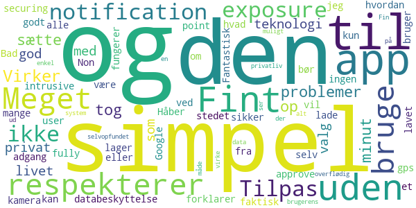
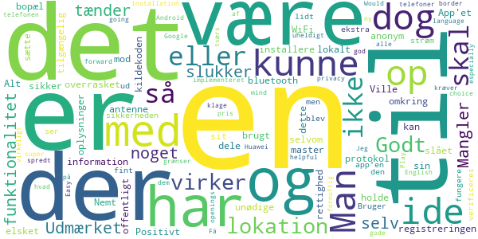
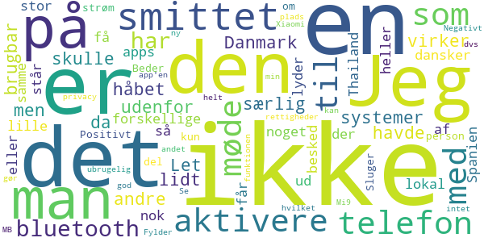
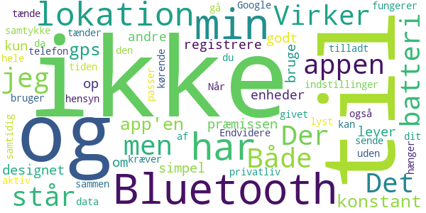
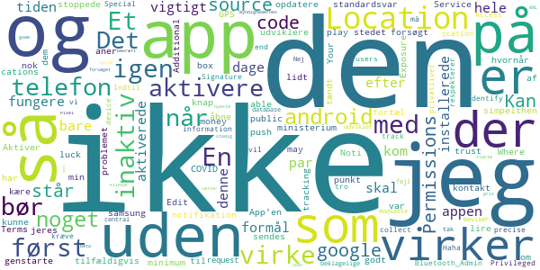

# Smittestop
App version ``1.0``

Analyzed with [covid-apps-observer](http://github.com/covid-apps-observer) project, version ``0.1``

## App overview
| | |
|-------------------------|-------------------------| 
| **Name**&nbsp;&nbsp;&nbsp;&nbsp;&nbsp;&nbsp;&nbsp;&nbsp;&nbsp;&nbsp;&nbsp;&nbsp;&nbsp;&nbsp;&nbsp;&nbsp;&nbsp;&nbsp;&nbsp;&nbsp;&nbsp;&nbsp;&nbsp;&nbsp;&nbsp;&nbsp;&nbsp;&nbsp;&nbsp;&nbsp;&nbsp;&nbsp;&nbsp;&nbsp;&nbsp;&nbsp;&nbsp;&nbsp;&nbsp;&nbsp;  | Smittestop |
| **Unique identifier** | com.netcompany.smittestop_exposure_notification |
| **Link to Google Play** | [https://play.google.com/store/apps/details?id=com.netcompany.smittestop_exposure_notification](https://play.google.com/store/apps/details?id=com.netcompany.smittestop_exposure_notification) |
| **Summary**  | Infect Stops is the official Ministry of Health and Elderly&#39;s COVID-19 app. |
| **Privacy policy** | [https://www.smittestop.dk/databeskyttelse](https://www.smittestop.dk/databeskyttelse) |
| **Latest version** | 1.0 |
| **Last update** | 2020-06-17 17:57:05 |
| **Recent changes** | Dette er første udgave af smitte|stop. Danmarks officielle COVID-19 app. |
| **Installs**  | 100,000+ |
| **Category** | Medical |
| **First release** | Jun 17, 2020 |
| **Size**  | 97M |
| **Supported Android version**  | 6.0 and up |

### Description
> Hent appen, og hjælp med at stoppe smittespredning af COVID-19 i Danmark.
  
 Appen smitte
 stop giver os alle sammen mulighed for at være med til at stoppe udbredelsen af COVID-19 i Danmark. Smitte
 stop skal sammen med anbefalingerne fra myndighederne hjælpe os med at passe godt på hinanden, mens samfundet genåbner. 
  
 Med smitte
 stop kan du være med til at bryde smittekæder. Smitte
 stop giver dig mulighed for at få besked, når du har været tæt på en anden bruger af appen, der har fået COVID-19. På den måde, kan du hurtigt følge sundhedsmyndighedernes anbefalinger og derved bryde en mulig smittekæde. Du kan give besked til andre brugere af appen, hvis du bliver testet positiv. De kan ikke se, hvem du er.
 Det er frivilligt at hente og anvende appen, men jo flere, der anvender den, jo flere smittekæder kan appen hjælpe med at bremse. 
  
 Hvordan fungerer smitte
 stop?
 • Når du aktiverer smitte
 stop, bruger din telefon tilfældige Bluetooth-ID’er til at finde ud af, om du muligvis har været tæt på nogen, der har oplyst i appen, at de har COVID-19. De tilfældige ID’er bliver lagret på din telefon og forlader kun din telefon, når du frivilligt og aktivt giver besked i appen med dit NemID, at du har COVID-19.
 • Smitte
 stop bruger din telefons ’Notifikationer om eksponering for COVID-19’, som er udviklet af Apple og Google. 
 • Ingen kan se, hvem du er, og du kan ikke se, hvem du har opholdt dig tæt på. 
 • Ingen myndigheder eller virksomheder har adgang til oplysninger om, hvem du har været i nærheden af, eller hvis du i appen får besked om, at du har været tæt på en COVID-19-positiv
 • Appen bruger ikke GPS til at registrere data  om, hvor du befinder dig.
 • To telefoner genkender hinanden via appen og udveksler tilfældige ID’er gennem bluetooth. 
  
 Arbejdet med at udvikle appens funktioner sker løbende. 
  
 Ved at downloade smitte
 stop accepterer du Vilkår og betingelser. Du skal give samtykke, når du har downloadet appen. 
  
 Smitte
 stop er udviklet af Sundheds- og Ældreministeriet i samarbejde med Styrelsen for Patientsikkerhed, Statens Serum Institut, Sundhedsstyrelsen og Digitaliseringsstyrelsen. Læs mere om appen på: www.smittestop.dk.

### User interface
The developers of the app provide the following screenshots in the Google play store.
| | | |
|:-------------------------:|:-------------------------:|:-------------------------:|
 |   |   |   | 

## Development team
In the following we report the main information provided by the development team in the Google play store.

| | |
|-------------------------|-------------------------|
| **Developer**  | Sundheds- og Ældreministeriet |
| **Website**  | [https://www.smittestop.dk](https://www.smittestop.dk) |
| **Email** | info@sundhed.dk |
| **Physical address**  | [Sundheds- og Ældreministeriet Holbergsgade 6, 1057 København K, Denmark](https://www.google.com/maps/search/Sundheds-%20og%20Ældreministeriet%20Holbergsgade%206,%201057%20København%20K,%20Denmark) (Google Maps) |
| **Other developed apps**  | [https://play.google.com/store/apps/developer?id=Sundheds-+og+%C3%86ldreministeriet](https://play.google.com/store/apps/developer?id=Sundheds-+og+%C3%86ldreministeriet) |

## Android support

| | |
|-------------------------|-------------------------|
| **Declared target Android version**  | Android10, version 10 (API level 29) |
| **Effective target Android version**  | Android10, version 10 (API level 29) |
| **Minimum supported Android version**  | Marshmallow, version 6.0 (API level 23) |
| **Maximum target Android version**  | - |

The larger the difference between the minimum and maximum supported Android versions, the better. A larger difference means a wider audience. For example, old phones have a very low Android version, so a high minimum supported Android version means that the app cannot be used by users with old phones, thus leading to accessibility problems. 

## Requested permissions

In the following we report the complete list of the permissions requested by the app. 

| **Permission** | **Protection level** | **Description** | 
|-------------------------|-------------------------|-------------------------|
 **android.permission ACCESS_NETWORK_STATE** | Normal | Allows applications to access information about networks. 
 **android.permission BLUETOOTH** | Normal | Allows applications to connect to paired bluetooth devices. 
 **android.permission FOREGROUND_SERVICE** | Normal | Allows a regular application to use Service.startForeground. 
 **android.permission INTERNET** | Normal | Allows applications to open network sockets. 
 **android.permission RECEIVE_BOOT_COMPLETED** | Normal | Allows an application to receive the Intent.ACTION_BOOT_COMPLETED that is broadcast after the system finishes booting. 
 **android.permission WAKE_LOCK** | Normal | Allows using PowerManager WakeLocks to keep processor from sleeping or screen from dimming. 

## Mentioned servers

| **Server** | **Registrant** | **Registrant country** | **Creation date** | 
|-------------------------|-------------------------|-------------------------|-------------------------|
 | google.com | Google LLC | :us: US | 1997-09-15 04:00:00 |
 | googleapis.com | Google LLC | :us: US | 2005-01-25 17:52:26 |

## Security analysis 

Below we report the main security warnings raised by our execution of the [Androwarn](https://github.com/maaaaz/androwarn) security analysis tool.

**Connection interfaces exfiltration**
> - This application reads details about the currently active data network 
> - This application tries to find out if the currently active data network is metered 

**Code execution**
> - This application loads a native library: 'monodroid' 
> - This application loads a native library: 'monosgen-2.0' 
> - This application loads a native library: 'xamarin-app' 
> - This application loads a native library: 'xamarin-debug-app-helper' 

## User ratings and reviews

Below we provide information about how end users are reacting to the app in terms of ratings and reviews in the Google Play store.

### Ratings

The Smittestop app has been installed by more than **100000** times. At this time, **291** rated the app and its average score is **3.84**. Below we show the distribution of the ratings across the usual star-based rating of Google Play

:star::star::star::star::star:: 151

:star::star::star::star:: 55

:star::star::star:: 17

:star::star:: 20

:star:: 46

### Reviews 

#### 5-star reviews

> Virker uden problemer og tog 1 minut at sætte op. Fint teknologi valg som respekterer privat livet.  :date: __2020-06-19 22:10:06__

> Simpel app med god databeskyttelse.  :date: __2020-06-19 14:48:55__

> Fint lavet.  :date: __2020-06-18 19:39:34__

> Meget simpel og forklarer godt hvordan den fungerer. Håber mange vil bruge den :)  :date: __2020-06-18 16:24:54__

> Meget simpel to-the-point app. Bad kun om adgang til exposure notification, og ikke kamera, lager, gps eller hvad ved jeg.  :date: __2020-06-18 11:10:35__

> Tilpas simpel til at alle kan bruge den. Tilpas sikker til at ingen bør lade være.  :date: __2020-06-18 10:05:05__

> Non-intrusive and securing for the user! I fully approve!  :date: __2020-06-18 09:30:31__

> Fantastisk at den faktisk bruger exposure notifications fra Google selv, i stedet for et selvopfundet system, der ikke respekterer brugerens data og privatliv. Fin og enkel app.  :date: __2020-06-18 08:58:26__

> Den ser ud til at virke på en simpel måde uden alt muligt overflødig.  :date: __2020-06-18 07:08:57__

#### 4-star reviews

> Udmærket ide. Mangler dog noget funktionalitet der selv tænder/slukker for registreringen. Man kunne holde det op mod sit WiFi eller antenne master omkring sin bopæl. Alt dette er information der kan være lokalt, så man ikke skal dele unødige oplysninger.  :date: __2020-06-21 10:22:01__

> Positivt overrasket over at der er brugt en sikker og anonym protokol. Nemt at installere og sætte op. App'et har ikke rettighed til lokation, selvom lokation skal være slået til for at bluetooth virker. Ville have elsket at have kildekoden være offentligt tilgængelig så sikkerheden kunne verificeres.  :date: __2020-06-19 14:55:27__

> Bruger lidt ekstra strøm, men ellers ser app'en ud til at fungere fint. Godt at den blev implementeret med privacy in mind  :date: __2020-06-19 08:21:56__

> En super god ide, og virker godt - Få det spredt på tværs af grænser! Jeg har dog en klage.... Det er uheldigt i kræver telefonen har Google Play, hvad med alle dem med en ny Huawei? Det er virkeligt gode Android telefoner, til en fornuftig pris.  :date: __2020-06-19 03:38:10__

> Easy installation. Would be helpful to have the choice of English language going forward, especially with the border openings.  :date: __2020-06-19 01:45:07__

#### 3-star reviews

> Let at aktivere, men da den ikke virker udenfor Danmark med andre systemer, er den ikke særlig brugbar. Jeg havde håbet lidt på at man ikke skulle have 7 forskellige apps på for at få noget ud af det. At møde en smittet dansker i en lille by i Spanien eller Thailand er nok ikke så stor, som at møde en lokal der er smittet. Det lyder heller ikke til at man får besked med det samme man står over for en smittet person (telefon).  :date: __2020-06-19 18:48:15__

> Sluger en del strøm...  :date: __2020-06-19 15:01:30__

> Positivt: Beder kun om bluetooth-rettigheder, intet andet; dvs god privacy. Negativt: Fylder 182 MB. Det har jeg ikke plads til på min telefon, som ikke er helt ny.  :date: __2020-06-18 23:44:12__

> Jeg kan ikke aktivere bluetooth funktionen i app'en, hvilket gør den ubrugelig. Har Xiaomi Mi9 Se  :date: __2020-06-18 12:02:06__

#### 2-star reviews

> Virker simpel og godt designet, men lever ikke op til præmissen om, kun at bruge Bluetooth til at registrere andre enheder. Der står under indstillinger: "Når du har givet dit samtykke og tilladt Bluetooth, virker appen hele tiden". Det passer ikke, da appen ikke fungerer uden også at tænde for lokation. Både af hensyn til batteri og privatliv, har jeg ikke lyst til at have min lokation aktiv og sende data til Google konstant.  :date: __2020-06-18 08:57:02__

> Der står i app'en at den ikke bruger min lokation. Men app'en kræver at jeg tænder for min gps. Det hænger ikke sammen. Endvidere har min telefon ikke batteri til at have både gps og bluetooth kørende konstant samtidig. Bluetooth kan gå an.  :date: __2020-06-18 08:23:43__

#### 1-star reviews

> En app med at så vigtigt formål som denne skal bare fungere hele tiden. Et par dage efter jeg først installerede og aktiverede appen kom jeg tilfældigvis til at åbne den igen og så at den var inaktiv. Jeg aner ikke hvornår den stoppede med at virke, og jeg kunne ikke aktivere den igen uden at genstarte min telefon først. Det er simpelthen ikke godt nok, som minimum bør der sendes en push notifikation når noget ikke virker.  :date: __2020-06-21 12:08:13__

> Aktiver knap virker ikke på samsung 10+, jeg har forsøgt at opdatere android og google play no luck... apps bør virke lidt out of the box  :date: __2020-06-18 19:49:37__

> Where is the source code? Is public money and is tracking out location, source code to be able to trust it.  :date: __2020-06-18 17:57:18__

> Kan ikke aktivere app  :date: __2020-06-18 15:25:46__

> App'en virker ikke uden at GPS er tændt. Så kære ministerium, kontakt jeres udviklere og fortæl dem om problemet i stedet for at lire et standardsvar af. Edit: I Google COVID-19 Exposure Noti cations Service Additional Terms står der i punkt 3. c. Permissions .: i. Your App may not request the Location, Bluetooth_Admin, Special Access, Privileged, or Signature permissions, or collect any device information to i dentify or track the precise l ocation of end users. Så I må ikke kræve Location.  :date: __2020-06-18 15:19:21__

> Haha, vi vil tro på, at den respekterer privatlivet. Indtil "beklagelige fejl" beviser det modsatte. Nej tak. Den er udviklet uden central database uden myndighedernes gode vilje.  :date: __2020-06-18 10:41:32__

> Jeg sætter pris på forsøget, men når jeg klikker bekræft sker der ikke noget, den står stadig som inaktiv. Den kan ikke starte. Pixel 4XL telefon på nyeste ikke-beta Android.  :date: __2020-06-18 08:55:12__

