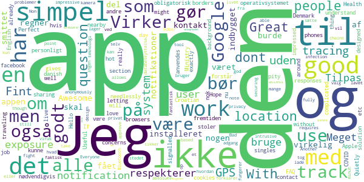
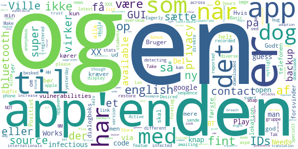
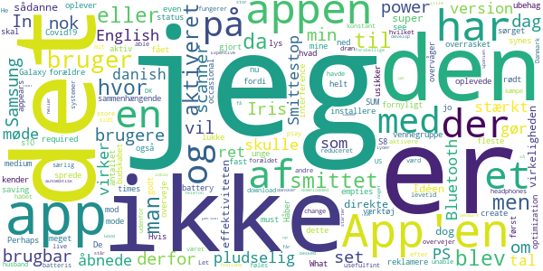
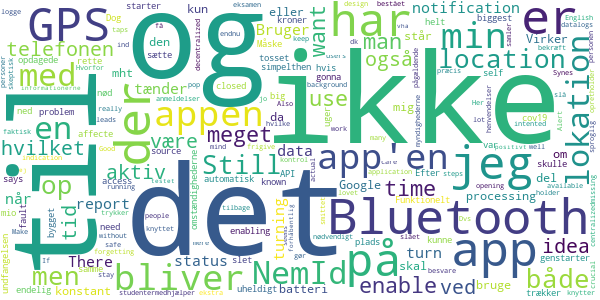
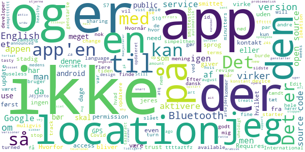

# Smittestop
App version ``1.1``

Analyzed with [covid-apps-observer](http://github.com/covid-apps-observer) project, version ``0.1``

## App overview
| | |
|-------------------------|-------------------------| 
| **Name**&nbsp;&nbsp;&nbsp;&nbsp;&nbsp;&nbsp;&nbsp;&nbsp;&nbsp;&nbsp;&nbsp;&nbsp;&nbsp;&nbsp;&nbsp;&nbsp;&nbsp;&nbsp;&nbsp;&nbsp;&nbsp;&nbsp;&nbsp;&nbsp;&nbsp;&nbsp;&nbsp;&nbsp;&nbsp;&nbsp;&nbsp;&nbsp;&nbsp;&nbsp;&nbsp;&nbsp;&nbsp;&nbsp;&nbsp;&nbsp;  | Smittestop |
| **Unique identifier** | com.netcompany.smittestop_exposure_notification |
| **Link to Google Play** | [https://play.google.com/store/apps/details?id=com.netcompany.smittestop_exposure_notification](https://play.google.com/store/apps/details?id=com.netcompany.smittestop_exposure_notification) |
| **Summary**  | Infect Stops is the official Ministry of Health and Elderly&#39;s COVID-19 app. |
| **Privacy policy** | [https://www.smittestop.dk/databeskyttelse](https://www.smittestop.dk/databeskyttelse) |
| **Latest version** | 1.1 |
| **Last update** | 2020-08-14 14:23:49 |
| **Recent changes** | Mindre stabilitets- og fejlrettelser |
| **Installs**  | 100,000+ |
| **Category** | Medical |
| **First release** | Jun 17, 2020 |
| **Size**  | 304M |
| **Supported Android version**  | 6.0 and up |

### Description
> Hent appen, og hjælp med at stoppe smittespredning af COVID-19 i Danmark.
  
 Appen smitte
 stop giver os alle sammen mulighed for at være med til at stoppe udbredelsen af COVID-19 i Danmark. Smitte
 stop skal sammen med anbefalingerne fra myndighederne hjælpe os med at passe godt på hinanden, mens samfundet genåbner. 
  
 Med smitte
 stop kan du være med til at bryde smittekæder. Smitte
 stop giver dig mulighed for at få besked, når du har været tæt på en anden bruger af appen, der har fået COVID-19. På den måde, kan du hurtigt følge sundhedsmyndighedernes anbefalinger og derved bryde en mulig smittekæde. Du kan give besked til andre brugere af appen, hvis du bliver testet positiv. De kan ikke se, hvem du er.
 Det er frivilligt at hente og anvende appen, men jo flere, der anvender den, jo flere smittekæder kan appen hjælpe med at bremse. 
  
 Hvordan fungerer smitte
 stop?
 • Når du aktiverer smitte
 stop, bruger din telefon tilfældige Bluetooth-ID’er til at finde ud af, om du muligvis har været tæt på nogen, der har oplyst i appen, at de har COVID-19. De tilfældige ID’er bliver lagret på din telefon og forlader kun din telefon, når du frivilligt og aktivt giver besked i appen med dit NemID, at du har COVID-19.
 • Smitte
 stop bruger din telefons ’Notifikationer om eksponering for COVID-19’, som er udviklet af Apple og Google. 
 • Ingen kan se, hvem du er, og du kan ikke se, hvem du har opholdt dig tæt på. 
 • Ingen myndigheder eller virksomheder har adgang til oplysninger om, hvem du har været i nærheden af, eller hvis du i appen får besked om, at du har været tæt på en COVID-19-positiv
 • Appen bruger ikke GPS til at registrere data  om, hvor du befinder dig.
 • To telefoner genkender hinanden via appen og udveksler tilfældige ID’er gennem bluetooth. 
  
 Arbejdet med at udvikle appens funktioner sker løbende. 
  
 Ved at downloade smitte
 stop accepterer du Vilkår og betingelser. Du skal give samtykke, når du har downloadet appen. 
  
 Smitte
 stop er udviklet af Sundheds- og Ældreministeriet i samarbejde med Styrelsen for Patientsikkerhed, Statens Serum Institut, Sundhedsstyrelsen og Digitaliseringsstyrelsen. Læs mere om appen på: www.smittestop.dk.

### User interface
The developers of the app provide the following screenshots in the Google play store.
| | | |
|:-------------------------:|:-------------------------:|:-------------------------:|
 |   |   |   | 

## Development team
In the following we report the main information provided by the development team in the Google play store.

| | |
|-------------------------|-------------------------|
| **Developer**  | Sundheds- og Ældreministeriet |
| **Website**  | [https://www.smittestop.dk](https://www.smittestop.dk) |
| **Email** | info@sundhed.dk |
| **Physical address**  | [Sundheds- og Ældreministeriet Holbergsgade 6, 1057 København K, Denmark](https://www.google.com/maps/search/Sundheds-%20og%20Ældreministeriet%20Holbergsgade%206,%201057%20København%20K,%20Denmark) (Google Maps) |
| **Other developed apps**  | [https://play.google.com/store/apps/developer?id=Sundheds-+og+%C3%86ldreministeriet](https://play.google.com/store/apps/developer?id=Sundheds-+og+%C3%86ldreministeriet) |

## Android support

| | |
|-------------------------|-------------------------|
| **Declared target Android version**  | Android10, version 10 (API level 29) |
| **Effective target Android version**  | Android10, version 10 (API level 29) |
| **Minimum supported Android version**  | Marshmallow, version 6.0 (API level 23) |
| **Maximum target Android version**  | - |

The larger the difference between the minimum and maximum supported Android versions, the better. A larger difference means a wider audience. For example, old phones have a very low Android version, so a high minimum supported Android version means that the app cannot be used by users with old phones, thus leading to accessibility problems. 

## Requested permissions

In the following we report the complete list of the permissions requested by the app. 

| **Permission** | **Protection level** | **Description** | 
|-------------------------|-------------------------|-------------------------|
 **android.permission ACCESS_NETWORK_STATE** | Normal | Allows applications to access information about networks. 
 **android.permission BLUETOOTH** | Normal | Allows applications to connect to paired bluetooth devices. 
 **android.permission FOREGROUND_SERVICE** | Normal | Allows a regular application to use Service.startForeground. 
 **android.permission INTERNET** | Normal | Allows applications to open network sockets. 
 **android.permission RECEIVE_BOOT_COMPLETED** | Normal | Allows an application to receive the Intent.ACTION_BOOT_COMPLETED that is broadcast after the system finishes booting. 
 **android.permission WAKE_LOCK** | Normal | Allows using PowerManager WakeLocks to keep processor from sleeping or screen from dimming. 

## Mentioned servers

| **Server** | **Registrant** | **Registrant country** | **Creation date** | 
|-------------------------|-------------------------|-------------------------|-------------------------|
 | google.com | Google LLC | :us: US | 1997-09-15 04:00:00 |
 | googleapis.com | Google LLC | :us: US | 2005-01-25 17:52:26 |

## Security analysis 

Below we report the main security warnings raised by our execution of the [Androwarn](https://github.com/maaaaz/androwarn) security analysis tool.

**Connection interfaces exfiltration**
> - This application reads details about the currently active data network 
> - This application tries to find out if the currently active data network is metered 

**Code execution**
> - This application loads a native library: 'mono-native' 
> - This application loads a native library: 'monodroid' 
> - This application loads a native library: 'monosgen-2.0' 
> - This application loads a native library: 'xamarin-app' 
> - This application loads a native library: 'xamarin-debug-app-helper' 

## User ratings and reviews

Below we provide information about how end users are reacting to the app in terms of ratings and reviews in the Google Play store.

### Ratings

The Smittestop app has been installed by more than **100000** times. At this time, **809** rated the app and its average score is **3.44**. Below we show the distribution of the ratings across the usual star-based rating of Google Play

:star::star::star::star::star:: 388

:star::star::star::star:: 48

:star::star::star:: 88

:star::star:: 97

:star:: 186

### Reviews 

#### 5-star reviews

> Cannot start on android 11. For others, Android 11 enables to use it without actually having location on. (Google thing)  :date: __2020-09-13 00:21:30__

> Awesome  :date: __2020-08-21 00:40:31__

> Jeg regner med, at appen gør det, den skal. Jeg har ikke fået nogen notifikationer om, at jeg har været i kontakt med en smittet, men ikke alle har den installeret. Det burde virkelig være en indbygget del af operativsystemet, som også kunne anvendes i fremtiden. Jeg stoler personligt nok på Apple og Google til det, men det forstår jeg også godt, hvis andre ikke nødvendigvis gør.  :date: __2020-08-19 13:00:07__

> Virker nu. Den bør vœre obligatorisk.  :date: __2020-08-18 08:40:15__

> very good app, use it to track hot singles nearby  :date: __2020-08-08 17:34:24__

> Useful without being needlessly complicated. The FAQ section gives really good responses to questions and concerns people might have.  :date: __2020-07-31 22:46:21__

> Hello, i love this apps, i dont understand why people dont like sharing their location... If they are letting to cookies to facebook, browsers, etc. which are doing the same thing... I have question, does this work With Croatian COVID-19 Ministry of Health?  :date: __2020-07-31 10:21:12__

> It's a pity that this app isn't in English, as I live in Denmark and my danish isn't very good.  :date: __2020-07-30 20:58:35__

> Perfect app. Quietly doing it's job in the background. Hope some day it will work over the borders too when traveling around. It signalled that I have been in contact with other phones already and that's exactly what it should do.  :date: __2020-07-26 06:26:50__

> Great solution! I am impressed by how well the app and tracing system was designed. It's impressive how the design allows to both ensure absolute privacy of all users while still being able to track infection chains anonymously. Good work!  :date: __2020-07-08 17:21:06__

#### 4-star reviews

> Foreslag: Lav en "Del" knap så man kan sende et direkte link til app'en i App/Play Store via diverse besked apps. Specielt nyttigt for den gruppe der har svært ved at overskue opgaven, selv at skulle søge og downloade app'en.  :date: __2020-09-21 07:41:45__

> Take google and apple out!  :date: __2020-09-12 17:10:38__

> Works, I guess. Needs english version asap for the students and other internationals, though  :date: __2020-08-09 14:14:52__

> To increase trust and adoption this app should be made open source. That way, we all could have a look at the code to see if there's any privacy breach, and could even contribute with an English translation for the app. Plus, Denmark would set the example and other countries would follow. You might think that an open source app is more vuneravle to attacks but this is a very naïve arguments: vulnerabilities are exposed and fixed faster.  :date: __2020-08-07 08:44:54__

> App'en driller, når telefonen sættes i flytilstand og app'en ikke kører helt i baggrunden. Når app'en har et GUI åben, når bluetooth forsvinder, kommer en dialogboks frem, som kræver ny godkendelse af BT. Hvis app'en derimod kører uden GUI, så tåler den fint at BT forsvinder og dukker op igen. Den dialogboks i GUI.-tilstand bør rettes.  :date: __2020-08-04 18:50:15__

> Fint initiativ, app'en er nem at forstå når først den er aktiv. Dog er der alt for meget at læse under første opstart, det bør gemmes væk under en "mere info" - knap. Nogle giver op undervejs. Det alvorligste problem med app'en er dog at så få kender til dens eksistens, i min omgangskreds blandt familie, venner og kolleger er det kun få. Send dog en opfordring via e-Boks og SMS til alle borgere, som man gjorde om smitten i begyndelsen af epidemien!  :date: __2020-07-25 08:35:09__

> Ville være fint hvis den gav en mere synlig påmindelse når den af den ene eller anden årsag bliver offline. Ellers super simpel at sætte op og bruge.  :date: __2020-07-22 09:56:46__

> I guess it works  :date: __2020-07-12 14:22:36__

> Lige til og forklarende. Bruger ikke GPS som nogen ser ud til at tro. Ville dog være rart med en indikation at at den reelt virkede og havde en effekt. F.eks. en sum tæller over exposures på en dag.  :date: __2020-06-26 22:34:09__

> Positivt: Beder kun om bluetooth-rettigheder, intet andet; dvs god privacy. Halv-negativt: Fylder 107 MB, hvilket ganske vist er langt bedre end første release, men stadig en del på min telefon, som ikke er helt ny.  :date: __2020-06-23 00:15:32__

#### 3-star reviews

> Idéen med en sådanne app er i virkeligheden super brugbar, dog er effektiviteten af appen direkte sammenhængende med antallet af brugere. Jeg synes derfor ikke at SUM har gjort nok for at reklamere og sprede budskabet om appen. De fleste i min vennegruppe (unge) kender ikke til appen, og jeg har først fornyligt fået mine forældre til at installere appen. Håber i vil overveje dette.  :date: __2020-09-07 18:25:30__

> In these times I see why this app is a must-have. What i don't like is that it empties battery power too fast (on Samsung Galaxy s10+) even when set to medium power saving mode. Perhaps an optimization is required.  :date: __2020-09-07 08:52:51__

> Jeg oplevede i dag at Iris scanner (Samsung S8) pludselig blev aktiv da jeg åbnede Smittestop app'en. Jeg har ellers sørget for at lukke helt ned for Iris scanner fordi jeg oplever ubehag, derfor blev jeg ret overrasket over at den pludselig blev aktiveret (rødt lys) da jeg åbnede Smittestop. Hvis app'en gør hvad den skal er det jo ellers et ret godt værktøj mod Covid19, men er usikker på App'ens status og nu også hvor meget den overvåger...  :date: __2020-08-29 10:28:47__

> The app appears to create occasional interference with my Bluetooth headphones.  :date: __2020-08-19 21:01:24__

> English version would be useful  :date: __2020-08-08 22:15:09__

> My husband's play store is set to the US (unable to change) and we live here in DK. He isn't able to download the app. Why?  :date: __2020-08-07 12:04:20__

> Appen fungerer fint, men det er et kæmpe dræn at skulle have Bluetooth aktiveret konstant. Det føles forældet og mit batteris levetid har været stærkt reduceret efter jeg har aktiveret appen hvilket gør at jeg stærkt overvejer om det er det værd.  :date: __2020-07-12 13:03:44__

> Let at aktivere, men da den ikke virker udenfor Danmark med andre systemer, er den ikke særlig brugbar. Jeg havde håbet lidt på at man ikke skulle have 7 forskellige apps på for at få noget ud af det. At møde en smittet dansker i en lille by i Spanien eller Thailand er nok ikke så stor, som at møde en lokal der er smittet. Det lyder heller ikke til at man får besked med det samme man står over for en smittet person (telefon). PS : den starter ikke automatisk op...  :date: __2020-07-11 23:34:50__

> Expensive app for Denmark to develop. Good that the app now can be downloaded by non danish accounts.... I was wondering if I should wait for the British one and hope it would work with the danish version..  :date: __2020-07-03 19:54:41__

> Jeg mangler at kunne se Brugere, af App'en. I den forstand at jeg gerne vil have et tal for hvor mange Bruger jeg har mødt på min dag. Pt virker det som ingen bruger App'en. Ps jeg bor ved et kryds hvor der dagligt passere over 2000 mennesker. Et tal der viser at der er 'liv/bruger af App'en Tak. Uden det føler jeg at jeg er den eneste der bruger App'en.  :date: __2020-06-27 01:15:31__

#### 2-star reviews

> It drains my phone battery to death, it cannot be used! And by the way, what about some more languages??  :date: __2020-09-13 10:48:02__

> The biggest problem with the cov19 Bluetooth API is that you need to have location on. I don't want to enable GPS all the time, as the app says it self, all apps that have access to location, can use it while enabling location for this app. Don't want GPS enable all the time. I known it's not the apps fault, but googles. Still has a big affecte on who gonna use this app.  :date: __2020-08-31 17:20:46__

> Funktionelt endelig ved at være på plads. Dog trækker omstændighederne og undfangelsen MEGET ned. 20 mio. kroner for en closed source app der kunne være bygget for under 100.000 på samme tid. Måske skulle man også sætte studentermedhjælper, der faktisk har bestået en sproglig eksamen, til at besvare anmeldelser og henvendelser.  :date: __2020-08-15 19:23:19__

> Make it available in English as well? If you really care all people in dk to stay safe  :date: __2020-08-14 00:17:40__

> Good idea but crucial notification for status is still missing. It seems to work as intented but the design is not with actual users in mind. There is no indication on the status of the application running in the background. This leads to me forgetting turning it on and/or off as I have no idea without opening the app. Also there are too many steps to turn it on (3 taps is a lot).  :date: __2020-07-31 22:16:28__

> Alert notifications keep turning off???  :date: __2020-07-01 06:29:47__

> App'en tænder ikke når jeg trykker bekræft, har både bluetooth, GPS og data slået til  :date: __2020-06-29 11:41:00__

> 1. Bruger appen centralized report processing eller decentralized report processing? 2. Hvorfor er det nødvendigt at logge ind med NemId? Her samler i jo datalogs og knytter det på personen med det pågældende NemId? Dvs. myndighederne har kontrol over præcis hvilke personer der er smittet, da det er knyttet op på NemId.  :date: __2020-06-26 13:38:34__

> Synes ikke at appen opretholder det der bliver lovet mht. At det kun er Bluetooth der skal bruges. Bliver ved med at få en pop-up med, at jeg skal slå min lokation til på telefonen, hvilket gør mig ekstra skeptisk og holder mig endnu mere tilbage på at frigive informationerne mht den del om jeg er testet positivt eller ej vha. NemID. forhåbentlig bliver dette fikset, men tager det for lang tid, bliver appen irrelevant.  :date: __2020-06-26 10:58:40__

> Sluger en del strøm...  :date: __2020-06-22 17:06:19__

#### 1-star reviews

> Det er meget uheldigt at app'en ikke automatisk starter op hvis man genstarter telefonen. Efter 4 uger opdagede jeg at app'en slet ikke var aktiv - hvilket er helt tosset. Det bliver i simpelthen nød til at rette. App'en stopper og starter ikke igen - meget problematisk.  :date: __2020-09-19 11:10:26__

> App should also be in English.  :date: __2020-09-04 01:06:13__

> Version 1.0.3 og den nyere 1.1 crasher under opstart. Tidligere versioner virker. Hvorfor kan man ikke gå tilbage til en version der virker? Skriver til support - igen...  :date: __2020-08-30 20:24:54__

> Why isn't there an English version?  :date: __2020-08-29 18:05:57__

> Aug-26: stadig kun på dansk?!!Nedjusterer fra 2 til 1 stjerne, da den fortsat kun findes på dansk. En engelsk version er muligvis (!) stadig på vej her snart to måneder, og alt for sent. Og hvad med andre sprog? Arabisk, urdu mfl? Jeg er sikker på at I kan finde de anbefalede sprog hos sundhedsmyndighederne Det tager et par dage at oversætte. I betragtning af situationens alvor håber jeg en version på flere sprog kommer om få dage. Så meget er der altså heller ikke at oversætte. Det er en ommer.  :date: __2020-08-26 18:56:21__

> What will this muitimillion expensed app help when downloading is not mandatory like wearing masks in public places?  :date: __2020-08-26 07:31:37__

> Should have English version for internationals  :date: __2020-08-25 17:18:25__

> Only in 1 language 😒  :date: __2020-08-25 09:33:37__

> App should be available in English. International Travelers are a big risk factor and they need to be able to use the app. So even before accepting to any terms and conditions it needs to be possible to change to english and maybe some other languages. Otherwhise the app is useless.  :date: __2020-08-23 10:38:30__

> Requires location to be turned on. And I am not interested in sharing my location constantly with Google! Bluetooth is fine, location no-go. Svar til developer reply: Det er muligt at smittestop app'en opfører sig pænt, men det er der ingen garanti for at andre apps vil.  :date: __2020-08-18 12:05:15__

