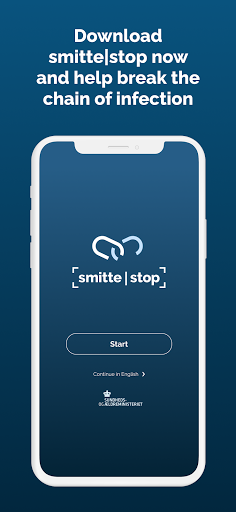
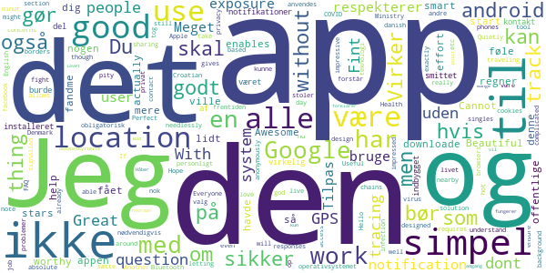
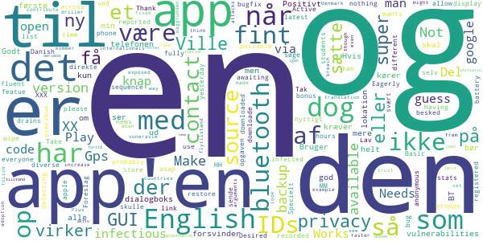
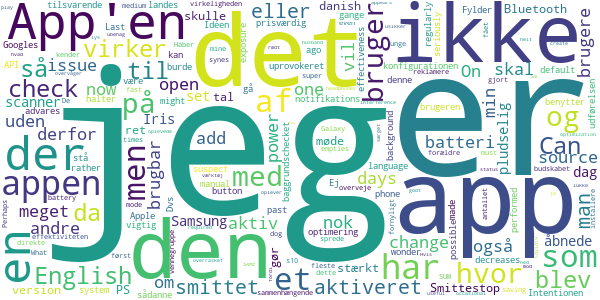
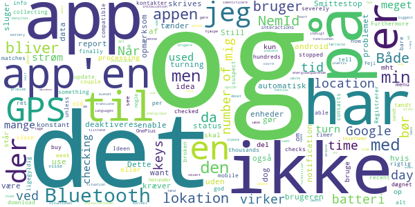
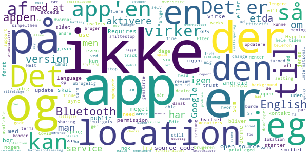

# Smittestop
App version ``2.0.1``

Analyzed with [covid-apps-observer](http://github.com/covid-apps-observer) project, version ``0.1``

## App overview
| | |
|-------------------------|-------------------------| 
| **Name**&nbsp;&nbsp;&nbsp;&nbsp;&nbsp;&nbsp;&nbsp;&nbsp;&nbsp;&nbsp;&nbsp;&nbsp;&nbsp;&nbsp;&nbsp;&nbsp;&nbsp;&nbsp;&nbsp;&nbsp;&nbsp;&nbsp;&nbsp;&nbsp;&nbsp;&nbsp;&nbsp;&nbsp;&nbsp;&nbsp;&nbsp;&nbsp;&nbsp;&nbsp;&nbsp;&nbsp;&nbsp;&nbsp;&nbsp;&nbsp;  | Smittestop |
| **Unique identifier** | com.netcompany.smittestop_exposure_notification |
| **Link to Google Play** | [https://play.google.com/store/apps/details?id=com.netcompany.smittestop_exposure_notification](https://play.google.com/store/apps/details?id=com.netcompany.smittestop_exposure_notification) |
| **Summary**  | Smittestop is The Danish Ministry of Health&#39;s official COVID-19 app |
| **Privacy policy** | [https://www.smittestop.dk/databeskyttelse](https://www.smittestop.dk/databeskyttelse) |
| **Latest version** | 2.0.1 |
| **Last update** | 2020-11-13 15:34:39 |
| **Recent changes** | Improvements to background service |
| **Installs**  | 500,000+ |
| **Category** | Medical |
| **First release** | Jun 17, 2020 |
| **Size**  | 288M |
| **Supported Android version**  | 6.0 and up |

### Description
> Download the app and help stop the spread of COVID-19 in Denmark and a number of EU countries. 
 Smitte
 stop is a digital contact tracing app. With smitte
 stop we can all contribute to prevent the spread of COVID-19. The app is a supplement to the general guidelines and advice outlined by the Danish public health authorities in an effort to protect yourself and those around you from COVID-19. 
 Once you have downloaded and started using smitte
 stop, you are actively contributing to breaking chains of infection. The app will send you an alert if you have been in close contact with another app user diagnosed with COVID-19. You can then rapidly follow the advice and guidance from the public health authorities on what to next – in this manner, you are actively helping to prevent the spread of COVID-19. 
 If you yourself test positive, you can share your result with other app users. Smitte
 stop will then send alerts to other app users who have spent time near you. These alerts will not identify you as an individual.  
 It is voluntary to download and use the app – but the more people that do so, the more the app can assist us in preventing the spread of the virus. 
 How smitte
 stop works
 • When you activate smitte
 stop, your phone uses random Bluetooth IDs to determine whether you may have in close contact with someone who has shared in smitte
 stop that he or she has been diagnosed with COVID-19. The randomly generated IDs are being stored on your phone. The IDs will only leave your phone when you voluntarily choose to share in the app that you have COVID-19 using your NemID. The IDs change every 10 to 20 minutes and are not tied up to your identity. 
 • Smitte
 stop uses your phone’s COVID-19 Exposure Notifications, developed by Apple and Google. 
 • No one can see your identity nor your location. And you can’t see the identity of those you may have been in close contact with, nor where they have been. 
 • Neither public authorities nor private companies have access to information about who you have been in close contact with. They also do not have access to any information in case you receive an alert in the app that you have been near someone who has reported being diagnosed with COVID-19. 
 • The app does not use GPS-based location to register data about your whereabouts. 
 • Basically, the app works like this: Two phones will recognise each other through the app and will then exchange random IDs by means of Bluetooth. 
 • At least once a day, the system will download keys for the random numbers that have been verified by public health authorities as belonging to people confirmed to be positive for COVID-19.
 Expect updates with new features or improvement of the user experience. 
 When you download smitte
 stop, you agree to Terms and conditions. You must also give consent once you have downloaded the app. 
 Smitte
 stop is developed by the Danish Ministry of Health in cooperation with the Danish Patient Safety Authority, Statens Serum Institut, the Danish Health Authority, and the Agency for Digitisation. 
 Read more about the app at https://smittestop.dk/en

### User interface
The developers of the app provide the following screenshots in the Google play store.
| | | |
|:-------------------------:|:-------------------------:|:-------------------------:|
 |   |   |   | 

## Development team
In the following we report the main information provided by the development team in the Google play store.

| | |
|-------------------------|-------------------------|
| **Developer**  | Sundheds- og Ældreministeriet |
| **Website**  | [https://www.smittestop.dk](https://www.smittestop.dk) |
| **Email** | info@sundhed.dk |
| **Physical address**  | [Sundheds- og Ældreministeriet Holbergsgade 6, 1057 København K, Denmark](https://www.google.com/maps/search/Sundheds-%20og%20Ældreministeriet%20Holbergsgade%206,%201057%20København%20K,%20Denmark) (Google Maps) |
| **Other developed apps**  | [https://play.google.com/store/apps/developer?id=Sundheds-+og+%C3%86ldreministeriet](https://play.google.com/store/apps/developer?id=Sundheds-+og+%C3%86ldreministeriet) |

## Android support

| | |
|-------------------------|-------------------------|
| **Declared target Android version**  | Android10, version 10 (API level 29) |
| **Effective target Android version**  | Android10, version 10 (API level 29) |
| **Minimum supported Android version**  | Marshmallow, version 6.0 (API level 23) |
| **Maximum target Android version**  | - |

The larger the difference between the minimum and maximum supported Android versions, the better. A larger difference means a wider audience. For example, old phones have a very low Android version, so a high minimum supported Android version means that the app cannot be used by users with old phones, thus leading to accessibility problems. 

## Requested permissions

In the following we report the complete list of the permissions requested by the app. 

| **Permission** | **Protection level** | **Description** | 
|-------------------------|-------------------------|-------------------------|
 **android.permission ACCESS_NETWORK_STATE** | Normal | Allows applications to access information about networks. 
 **android.permission BLUETOOTH** | Normal | Allows applications to connect to paired bluetooth devices. 
 **android.permission FOREGROUND_SERVICE** | Normal | Allows a regular application to use Service.startForeground. 
 **android.permission INTERNET** | Normal | Allows applications to open network sockets. 
 **android.permission READ_APP_BADGE** | - | - 
 **android.permission RECEIVE_BOOT_COMPLETED** | Normal | Allows an application to receive the Intent.ACTION_BOOT_COMPLETED that is broadcast after the system finishes booting. 
 **android.permission WAKE_LOCK** | Normal | Allows using PowerManager WakeLocks to keep processor from sleeping or screen from dimming. 
 **com.anddoes.launcher.permission UPDATE_COUNT** | - | - 
 **com.htc.launcher.permission READ_SETTINGS** | - | - 
 **com.htc.launcher.permission UPDATE_SHORTCUT** | - | - 
 **com.huawei.android.launcher.permission CHANGE_BADGE** | - | - 
 **com.huawei.android.launcher.permission READ_SETTINGS** | - | - 
 **com.huawei.android.launcher.permission WRITE_SETTINGS** | - | - 
 **com.majeur.launcher.permission UPDATE_BADGE** | - | - 
 **com.oppo.launcher.permission READ_SETTINGS** | - | - 
 **com.oppo.launcher.permission WRITE_SETTINGS** | - | - 
 **com.sec.android.provider.badge.permission READ** | - | - 
 **com.sec.android.provider.badge.permission WRITE** | - | - 
 **com.sonyericsson.home.permission BROADCAST_BADGE** | - | - 
 **com.sonymobile.home.permission PROVIDER_INSERT_BADGE** | - | - 
 **me.everything.badger.permission BADGE_COUNT_READ** | - | - 
 **me.everything.badger.permission BADGE_COUNT_WRITE** | - | - 

## Mentioned servers

| **Server** | **Registrant** | **Registrant country** | **Creation date** | 
|-------------------------|-------------------------|-------------------------|-------------------------|
 | google.com | Google LLC | :us: US | 1997-09-15 04:00:00 |
 | googleapis.com | Google LLC | :us: US | 2005-01-25 17:52:26 |

## Security analysis 

Below we report the main security warnings raised by our execution of the [Androwarn](https://github.com/maaaaz/androwarn) security analysis tool.

**Connection interfaces exfiltration**
> - This application reads details about the currently active data network 
> - This application tries to find out if the currently active data network is metered 

**Code execution**
> - This application loads a native library: 'mono-native' 
> - This application loads a native library: 'monodroid' 
> - This application loads a native library: 'monosgen-2.0' 
> - This application loads a native library: 'xamarin-app' 
> - This application loads a native library: 'xamarin-debug-app-helper' 

## User ratings and reviews

Below we provide information about how end users are reacting to the app in terms of ratings and reviews in the Google Play store.

### Ratings

The Smittestop app has been installed by more than **500000** times. At this time, **1404** rated the app and its average score is **2.6438355**. Below we show the distribution of the ratings across the usual star-based rating of Google Play

:star::star::star::star::star:: 375

:star::star::star::star:: 154

:star::star::star:: 115

:star::star:: 115

:star:: 645

### Reviews 

#### 5-star reviews

> Beautiful  :date: __2020-11-16 15:17:20__

> The effort to help is worthy 5 stars  :date: __2020-10-07 15:31:28__

> Det ville fandme være smart, hvis alle havde den app her!  :date: __2020-09-29 22:46:47__

> Du skal downloade denne app så kan du føle dig lidt mere sikker i det offentlige!  :date: __2020-09-24 17:28:21__

> Cannot start on android 11. For others, Android 11 enables to use it without actually having location on. (Google thing)  :date: __2020-09-13 00:21:30__

> Awesome  :date: __2020-08-21 00:40:31__

> Jeg regner med, at appen gør det, den skal. Jeg har ikke fået nogen notifikationer om, at jeg har været i kontakt med en smittet, men ikke alle har den installeret. Det burde virkelig være en indbygget del af operativsystemet, som også kunne anvendes i fremtiden. Jeg stoler personligt nok på Apple og Google til det, men det forstår jeg også godt, hvis andre ikke nødvendigvis gør.  :date: __2020-08-19 13:00:07__

> Virker nu. Den bør vœre obligatorisk.  :date: __2020-08-18 08:40:15__

> very good app, use it to track hot singles nearby  :date: __2020-08-08 17:34:24__

> Useful without being needlessly complicated. The FAQ section gives really good responses to questions and concerns people might have.  :date: __2020-07-31 22:46:21__

#### 4-star reviews

> Thank you for the English version. Not everyone who wants to use the app is fully fluent in Danish and this makes it possible. Having the Gps and Bluetooth on all the time drains battery, but there is probably nothing you can do about it.  :date: __2020-11-10 09:05:50__

> Make it available also in english. Tak!  :date: __2020-09-27 15:44:33__

> Eagerly awaiting a bugfix for the bug that's in the news. And please allow detecting contacts across a phone "backup, wipe, restore" sequence, as the backup app reported that you don't. Desired bonus featue: Basic stats display like "Active for XX hours with XX different IDs, XXX anonymous contact IDs recorded, 0 contact IDs were infectious, you are NOT registered as infected, latest list of infectIous IDs downloaded yesterday at HH:MM".  :date: __2020-09-26 13:20:28__

> Foreslag: Lav en "Del" knap så man kan sende et direkte link til app'en i App/Play Store via diverse besked apps. Specielt nyttigt for den gruppe der har svært ved at overskue opgaven, selv at skulle søge og downloade app'en.  :date: __2020-09-21 07:41:45__

> Take google and apple out!  :date: __2020-09-12 17:10:38__

> Works, I guess. Needs english version asap for the students and other internationals, though  :date: __2020-08-09 14:14:52__

> To increase trust and adoption this app should be made open source. That way, we all could have a look at the code to see if there's any privacy breach, and could even contribute with an English translation for the app. Plus, Denmark would set the example and other countries would follow. You might think that an open source app is more vuneravle to attacks but this is a very naïve arguments: vulnerabilities are exposed and fixed faster.  :date: __2020-08-07 08:44:54__

> App'en driller, når telefonen sættes i flytilstand og app'en ikke kører helt i baggrunden. Når app'en har et GUI åben, når bluetooth forsvinder, kommer en dialogboks frem, som kræver ny godkendelse af BT. Hvis app'en derimod kører uden GUI, så tåler den fint at BT forsvinder og dukker op igen. Den dialogboks i GUI.-tilstand bør rettes.  :date: __2020-08-04 18:50:15__

> Fint initiativ, app'en er nem at forstå når først den er aktiv. Dog er der alt for meget at læse under første opstart, det bør gemmes væk under en "mere info" - knap. Nogle giver op undervejs. Det alvorligste problem med app'en er dog at så få kender til dens eksistens, i min omgangskreds blandt familie, venner og kolleger er det kun få. Send dog en opfordring via e-Boks og SMS til alle borgere, som man gjorde om smitten i begyndelsen af epidemien!  :date: __2020-07-25 08:35:09__

> Ville være fint hvis den gav en mere synlig påmindelse når den af den ene eller anden årsag bliver offline. Ellers super simpel at sætte op og bruge.  :date: __2020-07-22 09:56:46__

#### 3-star reviews

> Intentionen er prisværdig men udførelsen halter: I default-konfigurationen, hvor batteri-optimering er aktiv, kan baggrundschecket uprovokeret gå i stå uden at brugeren advares. Fylder 3 gange så meget som andre landes tilsvarende apps. Dvs. apps der også benytter Apple/Googles notifikations-system. Ej open-source.  :date: __2020-10-18 22:00:15__

> Can i change the language to english?  :date: __2020-10-03 21:45:17__

> On my phone, background exposure checks are not regularly performed. Last one was 5 days ago (!), in the past 14 days only 8 checks were made. I suspect this is an API issue rather than an app issue, but it seriously decreases effectiveness of the app. I wonder if it might be possible to add a manual "check now" button.  :date: __2020-09-30 19:53:17__

> Virker som det skal men en så vigtig app som denne burde være open-source  :date: __2020-09-25 14:59:38__

> Idéen med en sådanne app er i virkeligheden super brugbar, dog er effektiviteten af appen direkte sammenhængende med antallet af brugere. Jeg synes derfor ikke at SUM har gjort nok for at reklamere og sprede budskabet om appen. De fleste i min vennegruppe (unge) kender ikke til appen, og jeg har først fornyligt fået mine forældre til at installere appen. Håber i vil overveje dette.  :date: __2020-09-07 18:25:30__

> In these times I see why this app is a must-have. What i don't like is that it empties battery power too fast (on Samsung Galaxy s10+) even when set to medium power saving mode. Perhaps an optimization is required.  :date: __2020-09-07 08:52:51__

> Jeg oplevede i dag at Iris scanner (Samsung S8) pludselig blev aktiv da jeg åbnede Smittestop app'en. Jeg har ellers sørget for at lukke helt ned for Iris scanner fordi jeg oplever ubehag, derfor blev jeg ret overrasket over at den pludselig blev aktiveret (rødt lys) da jeg åbnede Smittestop. Hvis app'en gør hvad den skal er det jo ellers et ret godt værktøj mod Covid19, men er usikker på App'ens status og nu også hvor meget den overvåger...  :date: __2020-08-29 10:28:47__

> The app appears to create occasional interference with my Bluetooth headphones.  :date: __2020-08-19 21:01:24__

> English version would be useful  :date: __2020-08-08 22:15:09__

> My husband's play store is set to the US (unable to change) and we live here in DK. He isn't able to download the app. Why?  :date: __2020-08-07 12:04:20__

#### 2-star reviews

> I can see number of keys checked and number of matches in Google menu, but not in the app. Furthermore, after recent update it stopped checking unless you turn GPS on - not just collecting keys, but checking. And finally, it used to do checks few times a day and download few thousands keys each day, buy now it's only couple of hundreds a day. I suspect something is severely broken there.  :date: __2020-11-16 14:30:43__

> Registrerer ikke mange kontakter... Og virker ret ligegyldig - men har den da tændt 24 timer i døgnet  :date: __2020-10-19 08:55:27__

> It is not compatible with my (old) mobile  :date: __2020-10-09 13:49:57__

> Ideen med app'en er rigtig god, men den bruger bare alt for meget strøm.  :date: __2020-09-28 07:10:46__

> The app should be able to tell me the number of close contacts per week at e.g. +15 min as a info about my interactions  :date: __2020-09-26 20:35:58__

> Fejl: Smittestop-app deaktiveres på visse android-enheder(!): På nogle Android-telefoner (herunder OnePlus), bliver smittestop-app'en automatisk sendt i en "energibesparende" tilstand, hvis den ikke er blevet åbnet et stykke tid. Da de færreste åbner app'en efter installationen, deaktiveres den altså automatisk uden, at brugeren er opmærksom på det. Jeg har selv haft problemet, som jeg løste ved at tage app'en ud af energispar-funktionen - men det kræver teknisk indsigt - samt en indsats for at identificere hvad problemet er. Jeg forestiller mig, mange brugere har en inaktiv installation ude at vide det. Hvis denne situation opstår hos en bruger, bør App'en bør gøre opmærksom på det - og hjælpe brugeren med at løse situationen.  :date: __2020-09-26 13:03:20__

> You can't even select the text to copy it into translate  :date: __2020-09-25 08:07:45__

> Når app installeres, skrives der at GPS ikke benyttes. Dette gør app'en dog, og det bør skrives korrekt. Både at have Bluetooth og GPS tænd, sluger batteri!  :date: __2020-09-24 23:10:30__

> It drains my phone battery to death, it cannot be used! And by the way, what about some more languages??  :date: __2020-09-13 10:48:02__

> The biggest problem with the cov19 Bluetooth API is that you need to have location on. I don't want to enable GPS all the time, as the app says it self, all apps that have access to location, can use it while enabling location for this app. Don't want GPS enable all the time. I known it's not the apps fault, but googles. Still has a big affecte on who gonna use this app.  :date: __2020-08-31 17:20:46__

#### 1-star reviews

> Henter ikke længere smitteliste (siden ultimo oktober), medmindre jeg selv starter appen. Måske I skulle kigge lidt på batterioptimering? 22. nov: Hallo er her nogen? Henter stadigvæk ikke smittelisten. 5 ud af 5 tilfældige kollegaer jeg har spurgt har samme problem. Virker det overhovedet for nogen?!?  :date: __2020-11-22 08:21:08__

> Helt uduelig og ubrugelig app. Ikke nok funktionalitet for at kunne bruges til smittesporing af brugeren, og samtidig spild af ressourcer at have kørende på telefon/mobil-enhed. Afinstalleret !!!  :date: __2020-11-22 07:18:34__

> App won't sync anything in the background, must open it every day to sync. It is placed in the battery manager as privileged app, but still no sync. Too bad🤨  :date: __2020-11-21 12:32:29__

> Does not let le report infection.  :date: __2020-11-21 08:08:10__

> No checks in two weeks according to phone settings. Open app to find it has been updated in the background and requires renewed consent to activate again - without prompting me!  :date: __2020-11-21 01:31:16__

> Appen holdt op med at virke ud af det blå! Jeg opdagede kun tilfældigt at den var blevet slået fra.  :date: __2020-11-12 14:43:15__

> Closed source and no English translation...  :date: __2020-10-20 23:15:59__

> Netcompany er et svindelfirma  :date: __2020-10-19 20:54:57__

> Painfully buggy and lacks english language support.  :date: __2020-10-19 18:01:30__

> Hvorfor hører jeg konstant, at app'en er opdateret, medens sidste version er fra 14. august?  :date: __2020-10-09 09:05:16__

