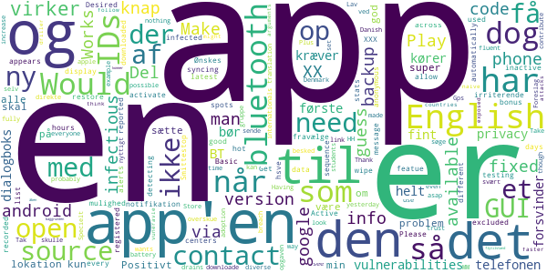

# Smittestop
App version ``2.3.3``

Analyzed with [covid-apps-observer](http://github.com/covid-apps-observer) project, version ``0.1``

## App overview
| | |
|-------------------------|-------------------------| 
| **Name**&nbsp;&nbsp;&nbsp;&nbsp;&nbsp;&nbsp;&nbsp;&nbsp;&nbsp;&nbsp;&nbsp;&nbsp;&nbsp;&nbsp;&nbsp;&nbsp;&nbsp;&nbsp;&nbsp;&nbsp;&nbsp;&nbsp;&nbsp;&nbsp;&nbsp;&nbsp;&nbsp;&nbsp;&nbsp;&nbsp;&nbsp;&nbsp;&nbsp;&nbsp;&nbsp;&nbsp;&nbsp;&nbsp;&nbsp;&nbsp;  | Smittestop |
| **Unique identifier** | com.netcompany.smittestop_exposure_notification |
| **Link to Google Play** | [https://play.google.com/store/apps/details?id=com.netcompany.smittestop_exposure_notification](https://play.google.com/store/apps/details?id=com.netcompany.smittestop_exposure_notification) |
| **Summary**  | Smittestop is The Danish Ministry of Health&#39;s official COVID-19 app |
| **Privacy policy** | [https://www.smittestop.dk/databeskyttelse](https://www.smittestop.dk/databeskyttelse) |
| **Latest version** | 2.3.3 |
| **Last update** | 2021-03-19 16:38:05 |
| **Recent changes** | Minor bug fix |
| **Installs**  | 500,000+ |
| **Category** | Medical |
| **First release** | Jun 17, 2020 |
| **Size**  | 86M |
| **Supported Android version**  | 6.0 and up |

### Description
> Download the app and help stop the spread of COVID-19 in Denmark and a number of EU countries. 
 Smitte
 stop is a digital contact tracing app. With smitte
 stop we can all contribute to prevent the spread of COVID-19. The app is a supplement to the general guidelines and advice outlined by the Danish public health authorities in an effort to protect yourself and those around you from COVID-19. 
 Once you have downloaded and started using smitte
 stop, you are actively contributing to breaking chains of infection. The app will send you an alert if you have been in close contact with another app user diagnosed with COVID-19. You can then rapidly follow the advice and guidance from the public health authorities on what to next – in this manner, you are actively helping to prevent the spread of COVID-19. 
 If you yourself test positive, you can share your result with other app users. Smitte
 stop will then send alerts to other app users who have spent time near you. These alerts will not identify you as an individual.  
 It is voluntary to download and use the app – but the more people that do so, the more the app can assist us in preventing the spread of the virus. 
 How smitte
 stop works
 • When you activate smitte
 stop, your phone uses random Bluetooth IDs to determine whether you may have in close contact with someone who has shared in smitte
 stop that he or she has been diagnosed with COVID-19. The randomly generated IDs are being stored on your phone. The IDs will only leave your phone when you voluntarily choose to share in the app that you have COVID-19 using your NemID. The IDs change every 10 to 20 minutes and are not tied up to your identity. 
 • Smitte
 stop uses your phone’s COVID-19 Exposure Notifications, developed by Apple and Google. 
 • No one can see your identity nor your location. And you can’t see the identity of those you may have been in close contact with, nor where they have been. 
 • Neither public authorities nor private companies have access to information about who you have been in close contact with. They also do not have access to any information in case you receive an alert in the app that you have been near someone who has reported being diagnosed with COVID-19. 
 • The app does not use GPS-based location to register data about your whereabouts. 
 • Basically, the app works like this: Two phones will recognise each other through the app and will then exchange random IDs by means of Bluetooth. 
 • At least once a day, the system will download keys for the random numbers that have been verified by public health authorities as belonging to people confirmed to be positive for COVID-19.
 Expect updates with new features or improvement of the user experience. 
 When you download smitte
 stop, you agree to Terms and conditions. You must also give consent once you have downloaded the app. 
 Smitte
 stop is developed by the Danish Ministry of Health in cooperation with the Danish Patient Safety Authority, Statens Serum Institut, the Danish Health Authority, and the Agency for Digitisation. 
 Read more about the app at https://smittestop.dk/en

### User interface
The developers of the app provide the following screenshots in the Google play store.
| | | |
|:-------------------------:|:-------------------------:|:-------------------------:|
 |   |   |   | 

## Development team
In the following we report the main information provided by the development team in the Google play store.

| | |
|-------------------------|-------------------------|
| **Developer**  | Sundheds- og Ældreministeriet |
| **Website**  | [https://www.smittestop.dk](https://www.smittestop.dk) |
| **Email** | info@sundhed.dk |
| **Physical address**  | [Sundheds- og Ældreministeriet Holbergsgade 6, 1057 København K, Denmark](https://www.google.com/maps/search/Sundheds-%20og%20Ældreministeriet%20Holbergsgade%206,%201057%20København%20K,%20Denmark) (Google Maps) |
| **Other developed apps**  | [https://play.google.com/store/apps/developer?id=Sundheds-+og+%C3%86ldreministeriet](https://play.google.com/store/apps/developer?id=Sundheds-+og+%C3%86ldreministeriet) |

## Android support

| | |
|-------------------------|-------------------------|
| **Declared target Android version**  | Android10, version 10 (API level 29) |
| **Effective target Android version**  | Android10, version 10 (API level 29) |
| **Minimum supported Android version**  | Marshmallow, version 6.0 (API level 23) |
| **Maximum target Android version**  | - |

The larger the difference between the minimum and maximum supported Android versions, the better. A larger difference means a wider audience. For example, old phones have a very low Android version, so a high minimum supported Android version means that the app cannot be used by users with old phones, thus leading to accessibility problems. 

## Requested permissions

In the following we report the complete list of the permissions requested by the app. 

| **Permission** | **Protection level** | **Description** | 
|-------------------------|-------------------------|-------------------------|
 **android.permission ACCESS_NETWORK_STATE** | Normal | Allows applications to access information about networks. 
 **android.permission BLUETOOTH** | Normal | Allows applications to connect to paired bluetooth devices. 
 **android.permission FOREGROUND_SERVICE** | Normal | Allows a regular application to use Service.startForeground. 
 **android.permission INTERNET** | Normal | Allows applications to open network sockets. 
 **android.permission READ_APP_BADGE** | - | - 
 **android.permission RECEIVE_BOOT_COMPLETED** | Normal | Allows an application to receive the Intent.ACTION_BOOT_COMPLETED that is broadcast after the system finishes booting. 
 **android.permission WAKE_LOCK** | Normal | Allows using PowerManager WakeLocks to keep processor from sleeping or screen from dimming. 
 **com.anddoes.launcher.permission UPDATE_COUNT** | - | - 
 **com.htc.launcher.permission READ_SETTINGS** | - | - 
 **com.htc.launcher.permission UPDATE_SHORTCUT** | - | - 
 **com.huawei.android.launcher.permission CHANGE_BADGE** | - | - 
 **com.huawei.android.launcher.permission READ_SETTINGS** | - | - 
 **com.huawei.android.launcher.permission WRITE_SETTINGS** | - | - 
 **com.majeur.launcher.permission UPDATE_BADGE** | - | - 
 **com.oppo.launcher.permission READ_SETTINGS** | - | - 
 **com.oppo.launcher.permission WRITE_SETTINGS** | - | - 
 **com.sec.android.provider.badge.permission READ** | - | - 
 **com.sec.android.provider.badge.permission WRITE** | - | - 
 **com.sonyericsson.home.permission BROADCAST_BADGE** | - | - 
 **com.sonymobile.home.permission PROVIDER_INSERT_BADGE** | - | - 
 **me.everything.badger.permission BADGE_COUNT_READ** | - | - 
 **me.everything.badger.permission BADGE_COUNT_WRITE** | - | - 

## Mentioned servers

| **Server** | **Registrant** | **Registrant country** | **Creation date** | 
|-------------------------|-------------------------|-------------------------|-------------------------|
 | google.com | Google LLC | :us: US | 1997-09-15 04:00:00 |
 | googleapis.com | Google LLC | :us: US | 2005-01-25 17:52:26 |

## Security analysis 

Below we report the main security warnings raised by our execution of the [Androwarn](https://github.com/maaaaz/androwarn) security analysis tool.

**Connection interfaces exfiltration**
> - This application reads details about the currently active data network 
> - This application tries to find out if the currently active data network is metered 

**Code execution**
> - This application loads a native library: 'mono-native' 
> - This application loads a native library: 'monodroid' 
> - This application loads a native library: 'monosgen-2.0' 
> - This application loads a native library: 'xamarin-app' 
> - This application loads a native library: 'xamarin-debug-app-helper' 

## User ratings and reviews

Below we provide information about how end users are reacting to the app in terms of ratings and reviews in the Google Play store.

### Ratings

The Smittestop app has been installed by more than **500000** times. At this time, **2210** rated the app and its average score is **2.7828054**. Below we show the distribution of the ratings across the usual star-based rating of Google Play

:star::star::star::star::star:: 580

:star::star::star::star:: 250

:star::star::star:: 280

:star::star:: 310

:star:: 790

### Reviews 

#### 5-star reviews

> Works as intended:) please everyone download it to make it even more useful :)  :date: __2021-04-06 19:45:34__

> Ok  :date: __2021-02-03 14:38:06__

> Virker som den skal. Har fået notifikation en gang, om at jeg har været tæt på en smittet - højst sandsynlig i metroen, så den del virker også.  :date: __2021-01-14 12:33:22__

> Looks like the app is finally working now. I have multiple checks per day that come with a notification. And the daily updates are a nice feature too. Next time you need to ask for consent, you have to send us a notification, nobody opens this app every day.  :date: __2020-12-21 13:01:44__

> Beautiful  :date: __2020-11-16 15:17:20__

> The effort to help is worthy 5 stars  :date: __2020-10-07 15:31:28__

> Det ville fandme være smart, hvis alle havde den app her!  :date: __2020-09-29 22:46:47__

> Du skal downloade denne app så kan du føle dig lidt mere sikker i det offentlige!  :date: __2020-09-24 17:28:21__

> Cannot start on android 11. For others, Android 11 enables to use it without actually having location on. (Google thing)  :date: __2020-09-13 00:21:30__

> Awesome  :date: __2020-08-21 00:40:31__

#### 4-star reviews

> Ønskes: mulighed for at fravælge irriterende info-notifikation  :date: __2021-02-05 16:08:10__

> The app used to hsve problems with not syncing data automatically on android phones, but this appears to be fixed. Would be good if it excluded "hot spots" like testing centers from alerts.  :date: __2021-01-14 21:14:11__

> Smittestop app is inactive... Get this message every few days and need to open it to activate it  :date: __2020-12-21 08:46:51__

> Please allow detecting contacts across a phone "backup, wipe, restore" sequence, as the backup app reported that you don't. Desired bonus featue: Basic stats display like "Active for XX hours with XX different IDs, XXX anonymous contact IDs recorded, 0 contact IDs were infectious, you are NOT registered as infected, latest list of infectIous IDs downloaded yesterday at HH:MM".  :date: __2020-12-16 23:30:51__

> Thank you for the English version. Not everyone who wants to use the app is fully fluent in Danish and this makes it possible. Having the Gps and Bluetooth on all the time drains battery, but there is probably nothing you can do about it.  :date: __2020-11-10 09:05:50__

> Make it available also in english. Tak!  :date: __2020-09-27 15:44:33__

> Foreslag: Lav en "Del" knap så man kan sende et direkte link til app'en i App/Play Store via diverse besked apps. Specielt nyttigt for den gruppe der har svært ved at overskue opgaven, selv at skulle søge og downloade app'en.  :date: __2020-09-21 07:41:45__

> Take google and apple out!  :date: __2020-09-12 17:10:38__

> Works, I guess. Needs english version asap for the students and other internationals, though  :date: __2020-08-09 14:14:52__

> To increase trust and adoption this app should be made open source. That way, we all could have a look at the code to see if there's any privacy breach, and could even contribute with an English translation for the app. Plus, Denmark would set the example and other countries would follow. You might think that an open source app is more vuneravle to attacks but this is a very naïve arguments: vulnerabilities are exposed and fixed faster.  :date: __2020-08-07 08:44:54__

#### 3-star reviews

> It started to crash quite often (without opening it I get a notification that it crashed) + is it possible to remove "app is downloading information.." notifications ?  :date: __2021-03-21 10:42:54__

> Ideen med app'en er rigtig god, men det er håbløst upraktisk at den skal genaktiveres en gang i mellem. Den skal kunne køre autonomt i baggrunden.  :date: __2021-02-02 14:55:06__

> Tror ikke helt på den virker. Først havde den en ugentlig notifikation om at den hentede kontakter. Dem har jeg ikke set siden efteråret. Så da jeg åbner app'en nu her, ser den ud som den skal, men der er kommet en ny permanent notifikation som siger den henter kontakter. Så siden efteråret har den altså ikke virket fordi jeg ikke har åbnet appen? Eller hvad?  :date: __2021-01-14 12:09:44__

> Notification "henter information" bliver ved med at hænge der og jeg kan ikke komme af med den. Force stop fjerner, men når jeg åbner app'en er de et tilbage igen. Og den har aldrig advaret mig om noget.  :date: __2021-01-13 09:53:00__

> De sidste par dage er notifikationen "Smitte|stop is downloading information" ikke forsvundet af sig selv og har ikke været til at fjerne. Eneste mulighed er at slå alle notifikationer for appen fra, men så vil man heller ikke få notifikation, når man har været i kontakt med en smittet. Derudover dumt at man generelt ikke kan se, hvornår man har været i kontakt med den smittede, så man ved, hvornår man burde få en test.  :date: __2021-01-13 08:35:08__

> Super fin app set fra brugervenlighed, men her på det sidste, sker det flere gange dagligt jeg får notifikationer om at app'en skal åbnes og aktiveres... Den må virkelig være ustabil...  :date: __2021-01-04 12:25:19__

> Mine notifikationer fortæller mig at jeg ikke modtager notifikationer grundet manglende Bluetooth tilladelse. Jeg har tjekket settings både i app og på telefonen, og Bluetooth burde virke. I mine app settings står der at appen ikke kræver nogen tilladelser. Det kan være at appen virker, men siden jeg modtager kryptiske notikationer, synes jeg den er svær at stole på. Jeg håber der sidder en developer i den anden ende, som kan fortælle mig hvad der er i vejen.  :date: __2021-01-03 22:41:48__

> Why do I get a notification that the app is checking for possible contacts? That must happen in the background, not needed to annoy me many times during other use  :date: __2020-12-27 00:03:00__

> Synes den virkede fint i starten, mens efter seneste opdatering sætter den sig inaktiv hver dag, så jeg skal åbne appen for at den går i aktiv tilstand igen. Er dette et forsøg på at minimere strømforbrug eller fordi appen ikke kan downloade data i baggrunden? Jeg får heldigvis en notifikation om at den er inaktiv, men den kan man jo hurtigt overse hvis man ikke lige kigger på mobilen hele tiden  :date: __2020-12-20 07:49:51__

> Virker, da der kommer notifikationer, men først når jeg åbner appen. Har aldrig fået notifikation uden at åbne appen.  :date: __2020-12-16 18:45:11__

#### 2-star reviews

> Det er irriterende at default settings ikke er uden notifikationer om download. Smitteapp burde ikke give lyd fra sig medmindre jeg skal gøre noget. Dvs blive testet pga. kontakt med en smittet. Ellers er det bare støj. Støj gør at folk bliver irriteret og når det er sjældent den faktisk opfanger en smittet så vil smitteapp blive afinstalleret!  :date: __2021-01-19 10:41:43__

> Der er stop forskel på sensitivitet en af Bluetooth antenner tror jeg. Når jeg færdes med min kæreste får jeg typisk 2-4 matchende Keys og hun får ingen i perioder hvor jeg ikke ser andre mennesker end hende. Så jeg tror ikke på Bluetooth som en afstandsmålingsteknologi. Nu hvor alle bærer maske giver det heller ikke mening at man sksl testes pga. tæt kontakt ens man var beskyttet og når man ikke får tidspunkt for kontakten kan man ikke selv filtrere effektivt. Så et stort potentiale er spildt  :date: __2021-01-13 10:29:58__

> App'en er gået fuldstændig amok. Den giver notifikation hvert 10. sekund, med besked om at "Smitte|Stop is downloading information". Samtidig kan app'en ikke åbnes. Problemet er startet efter ankoms til Grønland. Update: Det viser sig, at fejlen optræder når telefonens tidszone er den lokale (her UTC+3), men hvis telefonen tvinges til at bruge dansk tid, så er alt OK.  :date: __2021-01-06 20:56:52__

> Det er en elendig app. Jeg får flere gange dagligt besked på at genstarte appen og jævnligt besked på at aktivere bluetooth og GPS selv om de er slået til. Det er imponerende der er så mange fejl i en så vigtig så efter så lang tid.  :date: __2021-01-03 06:48:18__

> Denne app er begyndt at sende tomme notifikationer hver morgen, så telefonen siger ding, men der ikke er nogen besked. Kigger man i telefonens notifikationsindstillinger kan man se at ding lyden kommer fra denne app, men åbner man app'en, er det ingen beskeder.  :date: __2020-12-18 07:09:03__

> For ringe at app'en har haft så mange fejl. Først så fangede den ikke folk som du havde været i nærkontakt, derefter giver den dig ikke notifikationer medmindre du åbner app'en. Tager I ikke jeres job seriøst, NetCompany? Jeres app giver en falsk tryghed som kan koste menneskeliv. Meld dog klart ud til folk, hvis jeres app kræver at den skal åbnes med jævne mellemrum. Endnu bedre påmind dem om at åbne app'en. Alt andet er komplet uansvarligt.  :date: __2020-12-18 02:13:32__

> Vigtig app, men den virker elendigt og brugerfladen er utroligt ringe. Den mangler desperat mulighed for at man kan gå ind i app'en og bede om statistik på hvor meget der er checket og en indikator på at den rent faktisk kører. Et tray ikon ville også hjælpe meget.  :date: __2020-12-17 15:45:32__

> Meget simpel to-the-point app. Bad kun om adgang til exposure notification, og ikke kamera, lager, gps eller hvad ved jeg. Derimod virker notificationer dårligt. Man skal helst ikke lukke appen og åbne den jævnligt for at få besked.  :date: __2020-12-17 09:32:14__

> Registrerer ikke mange kontakter... Og virker ret ligegyldig - men har den da tændt 24 timer i døgnet  :date: __2020-10-19 08:55:27__

> It is not compatible with my (old) mobile  :date: __2020-10-09 13:49:57__

#### 1-star reviews

> Blev nødt til at afinstallere, da den seneste opdatering stopper igen og igen og strømforbruget er helt ekstremt, så højt at telefon advarer om forbruget.  :date: __2021-03-20 10:45:27__

> Dårlig app. Dur ganske enkelt ikke. Stopper jævnligt uden grund, bruger urimeligt CPU og dermed batteri... Og værst: har ikke én eneste gang fundet nærsmittet, selvom jeg flere gange har været i nærheden af en smittet. Hermed afinstalleret. Håber ikke staten har betalt for det ulødige produkt.  :date: __2021-03-19 19:41:31__

> Shows PM/AM times in a 24H setting!  :date: __2021-02-23 21:07:15__

> På det sidste har jeg fået en notifikation hver morgen om at appen er deaktiveret. Ydermere er er jo næsten ubrugeligt at appen ikke fortæller hvilken dag man har været i kontakt med nogen, så man ved hvilke dage man burde blive testet.  :date: __2021-02-15 07:56:43__

> Keeps on pushing notifications on different times at day or night without any new alerts. As we say in Danish: Det er en ommer.  :date: __2021-02-09 17:10:10__

> Keeps crashing every day  :date: __2021-02-08 05:15:34__

> What was the point of this app? Germany opensourced their english app way before smittestop was published, and theirs worked well while smittestop found out only in november that for the entire time theirs didnt. German coronawarnapp has more features and did not destroy the users trust. When i ask danes if they use smittestop app they usually say no or they have never heard of it. I know people who had risk contact over coronawarnapp so im sure it works. Screw this app im using coronawarnapp.  :date: __2021-02-05 12:44:01__

> Virker ikke. Står konstant som inaktiv og kan ikke starte smittestop Hver gang jeg trykker på start og bekræft sker der ikke noget og den forbliver inaktiv.  :date: __2021-02-03 12:15:27__

> I very much doubt it works at all. Issued me with an alert after I had been at home on my own for several days. My wife gets alerts several times every week and is only in contact with people within our bubble who doesn't even use the app. Completely random. Maybe it's just a trick so that people go and get tested. Would be great if they could give you the date and time of when you were potentially exposed, because then it's very easy to figure out if it works or not.  :date: __2021-01-26 06:10:04__

> Great idea, poor executiom  :date: __2021-01-21 21:31:27__

