# COVID-related Android apps in Spain

Author: `Ivano Malavolta` (ivanomalavolta@gmail.com)

Created at: `2020/12/20`

Report generated by the [covid-apps-observer](http://github.com/covid-apps-observer) project, version 0.1

# Table of contents 

- [Background](#background)
    * [Data sources and analyses](#data-sources-and-analyses)
        * [App metadata](#app-metadata)
        * [Requested permissions](#requested-permissions)
        * [Mentioned servers](#mentioned_servers)
        * [Security analysis](#security_analysis)
        * [User ratings and reviews](#user-ratings-and-reviews)
    * [Disclaimer](#disclaimer)
- [WHO Info](#who-info)
- [COVID-19.eus](#covid-19.eus)
- [STOP COVID19 CAT](#stop-covid19-cat)
- [CONFINAPP](#confinapp)
- [GVA Responde](#gva-responde)
- [CoronaMadrid](#coronamadrid)
- [GVA Coronavirus](#gva-coronavirus)
- [Asistencia COVID-19](#asistencia-covid-19)
- [OpenWHO: Knowledge for Health Emergencies](#openwho-knowledge-for-health-emergencies)
- [CoronaTest Navarra](#coronatest-navarra)
- [Radar COVID](#radar-covid)
- [Salud Andalucía](#salud-andalucía)
- [DKV Quiero cuidarme Más](#dkv-quiero-cuidarme-más)
- [Interactive Clinics](#interactive-clinics)
- [Mediktor](#mediktor)
- [TGN Emergències](#tgn-emergències)
- [El Cabildo en tu móvil](#el-cabildo-en-tu-móvil)
- [BizkaiUP](#bizkaiup)
- [PassCOVID.gal](#passcovid.gal)

- [Credits](#credits)

# How to read this report

This report has been generated by the [covid-apps-observer](http://github.com/covid-apps-observer) project. The project automatically analyzes the apps by extracting information which is already publicly available either on the web or in the apps binary files. 

Our analysis covers the following apps:
| | |
|-------------------------|-------------------------| 
|  | WHO Info
|  | COVID-19.eus
|  | STOP COVID19 CAT
|  | CONFINAPP
|  | GVA Responde
|  | CoronaMadrid
|  | GVA Coronavirus
|  | Asistencia COVID-19
|  | OpenWHO: Knowledge for Health Emergencies
|  | CoronaTest Navarra
|  | Radar COVID
|  | Salud Andalucía
|  | DKV Quiero cuidarme Más
|  | Interactive Clinics
|  | Mediktor
|  | TGN Emergències
|  | El Cabildo en tu móvil
|  | BizkaiUP
|  | PassCOVID.gal

The details of our analysis are presented in the remainder of this report.

For independent verification, the raw data and the source code of the project is publicly available in its GitHub repository [http://github.com/covid-apps-observer](http://github.com/covid-apps-observer) and its source code has been thoroughly commented in order to provide all the details about how the information provided in this report has been extracted. 

Any feedback, questions, and improvements about the project are very welcome, feel free to create an issue or pull request directly in its GitHub repository: [http://github.com/covid-apps-observer](http://github.com/covid-apps-observer).

## Data sources and analyses

The analysis of each app is structured around five main dimensions: 
* App metadata  
* Requested permissions
* Mentioned servers
* Androwarn analysis
* User ratings and reviews

In the following we describe the data sources and analysis performed for each dimension.

### App metadata

App metadata includes an overview of the main information about the app (for example, its name, releases, privacy policy, etc.), contact information of the development team, and the various Android versions supported by the app. This information is extracted from two main data sources:
* _Google Play store_: we automatically mined the web page of the Google Play store showing the basic information about the app and we parsed it in order to extract information about the app and development team 
* _Android Manifest file_: in our analysis we decompiled the binary file of the app (it is similar to a Zip archive but it contains the code of the app instead of normal files) and we extracted information about the supported Android versions, as it has been listed by its development team.

The extracted app metadata feeds the _App overview_, _Development team_, and _Android support_ sections of this report.
We make use of the [google-play-scraper](https://github.com/JoMingyu/google-play-scraper) tool for extracting the raw data related to this dimension of the project.

### Requested permissions

The Android operating system has a permission model which allows users to grant access to potentially privacy-related information. Every Android app has to explictly declare the permissions it needs to properly function in the Android Manifest file.  

In this report we also show the protection level of each permission, which is a key information for understanding how the requested permissions related to the user's privacy. We carefully analyzed the [official Android documentation (v. 29)](https://developer.android.com/reference/android/Manifest.permission), and it resulted that a permission requested by an Android app can belong to the following protection levels:
* **Dangerous**: higher-risk permissions that would give a requesting app access to private user data or control over the device that can negatively impact the user. Because this type of permission introduces potential risk, the system usually does not automatically grant it to the requesting app. For example, any dangerous permissions requested by an app may be displayed to the user and require confirmation before proceeding.
* **Normal**: this is the default and most common level in Android; normal permissions are lower-risk and give access to isolated app-level features, with minimal risk to other apps, the system, or the user. 
* **Signature**: permissions granted only if the requesting app is signed with the same certificate as the app that declared the permission
* **Appop**: old permission level, a reminiscence of the App Ops tool that Google introduced in Android 4.3.
* **Development**: optional permissions which can be granted to development-oriented apps.
* **Privileged**: permissions who give higher power to mobile apps w.r.t. other apps, such as binding to incoming calls, interacting via bluetooth with other devices without user interaction, etc.
* **Preinstalled**: reserved only for preinstalled apps
* **Installer**: allow the holder to start the permission usage screen for an app
* **RetailDemo**: permissions related to devices used in demonstrations in shops.
* **Pre23**: permissions automatically granted to apps targeting devices running pre-6.0 Android.
* **Upcoming**: permissions which will be released in the next version of the Android platform. 
* **Deprecated**: permissions belonging to old releases of the Android platform, they should not be used by developers since they will not be supported in the near future.
* **Not for use by third-party applications**: permissions which can be requested only by apps developed by Google.
* **Undefined**: this protection level is not documented by Google.

The permissions dimension of this project is based on the [Androguard](https://github.com/androguard/androguard) static analysis tool.

### Mentioned servers

We decompiled each app in order to look for all possible mentions of remote URLs. The mentioned URLs can refer to remote servers the the app is using for either sending or receiving information, web addresses for directing the user to an information website, and so on. 

:warning: It is important to note that this analysis is not meant to be complete and it is very prone to obfuscation. The servers reported here are simply _mentioned_ somewhere in the code of the app and are meant to just give an indication about the "hooks" of the app towards external resources. For example, for an Android app it is normal to contact Google services in order to send/receive push notifications, or to contact the servers of analytics services for having real-time diagnostics about crashes of the app or bugs.

This part of the analysis is based on the [Androguard](https://github.com/androguard/androguard) static analysis tool for identfying the raw URLs mentioned in the app; then, the information about each mentioned server is collected by performing a _whois_ lookup on the first-level domain present in the URL.

### Security analysis

This dimension is based on the [Androwarn](https://github.com/maaaaz/androwarn) structural and data flow analysis of Android bytecode. Androwarn is developed by the University of Lyon/INSA (France) and it has been used in several academic studies. According to its documentation, Androwarn targets the following categories of potential security issues:
* **Telephony identifiers exfiltration**: IMEI, IMSI, MCC, MNC, LAC, CID, operator's name, etc.
* **Device settings exfiltration**: software version, usage statistics, system settings, logs, etc.
* **Geolocation information leakage**: GPS/WiFi geolocation, etc.
* **Connection interfaces information exfiltration**: WiFi credentials, Bluetooth MAC adress, etc.
* **Telephony services abuse**: premium SMS sending, phone call composition, etc.
* **Audio/video flow interception**: call recording, video capture, etc.
* **Remote connection establishment**: socket open call, Bluetooth pairing, APN settings edit, etc.
* **PIM data leakage**: contacts, calendar, SMS, mails, clipboard, etc.
* **External memory operations**: file access on SD card, etc.
* **PIM data modification**: add/delete contacts, calendar events, etc.
* **Arbitrary code execution**: native code using JNI, UNIX command, privilege escalation, etc.
* **Denial of Service**: event notification deactivation, file deletion, process killing, virtual keyboard disable, terminal shutdown/reboot, etc.

Note: We do not consider this data point in the current version of our analyzers since it is too verbose for our purposes.

:warning: It is important to note that Androwarn is a static analysis tool, and as such it performs a variety of heuristics and approximations in its analyses. Said that, the results shown in this report are meant to provide an indication of _potential_ security issues and should be by no means treated as complete and correct.   

### User ratings and reviews

For this dimension we turn again to the web interface of the Google Play store. Firstly, we automatically mine summary statistics about user ratings from the web page of the app under analysis; then, we automatically download the newest 1000 reviews of the app under analysis. For each level of rating (5 stars, 4 stars, , etc., 1 star) we show:
- a word cloud presenting the main terms used by end users in their reviews in the Google Play store
- the last 10 reviews provided by app users in the Google Play store. 

This purposefully simple analysis is meant to help both future users and the development team of the app in understanding what are the main positive and negative points of the app under analysis.

We make use of the [google-play-scraper](https://github.com/JoMingyu/google-play-scraper) tool for extracting the raw data related to this dimension of the project.

## Disclaimer 

This report has been produced independently of any parties and its only objective is to help anybody in better understanding how COVID-related apps work in practice (and compare to each other). The results of this report are limited to the specific version of the software used for running the analyses and on the various heuristics implemented in there. In other words, the results of the analyzers may differ depending on the time and modalities in which they are executed. We do not guarantee that the results of the analyses and the corresponding contents of this report are fully complete or correct. The analysis software is licensed under the [MIT License](https://github.com/iivanoo/covid-apps-observer/blob/master/LICENSE).

# WHO Info
App version ``4.0.1``

Analyzed with [covid-apps-observer](http://github.com/covid-apps-observer) project, version ``0.1``

## App overview
| | |
|-------------------------|-------------------------| 
| **Name**&nbsp;&nbsp;&nbsp;&nbsp;&nbsp;&nbsp;&nbsp;&nbsp;&nbsp;&nbsp;&nbsp;&nbsp;&nbsp;&nbsp;&nbsp;&nbsp;&nbsp;&nbsp;&nbsp;&nbsp;&nbsp;&nbsp;&nbsp;&nbsp;&nbsp;&nbsp;&nbsp;&nbsp;&nbsp;&nbsp;&nbsp;&nbsp;&nbsp;&nbsp;&nbsp;&nbsp;&nbsp;&nbsp;&nbsp;&nbsp;  | WHO Info |
| **Unique identifier** | org.who.infoapp |
| **Link to Google Play** | [https://play.google.com/store/apps/details?id=org.who.infoapp](https://play.google.com/store/apps/details?id=org.who.infoapp) |
| **Summary**  | La aplicación oficial de información de la Organización Mundial de la Salud. |
| **Privacy policy** | [https://www.who.int/about/who-we-are/privacy-policy](https://www.who.int/about/who-we-are/privacy-policy) |
| **Latest version** | 4.0.1 |
| **Last update** | 2020-12-03 10:24:14 |
| **Recent changes** | Application UI redesign. Various improvements and bug fixes. |
| **Installs**  | 100.000+ |
| **Category** | Noticias y revistas |
| **First release** | 13 abr 2020 |
| **Size**  | 12M |
| **Supported Android version**  | 4.2 y versiones posteriores |

### Description
> Have the latest health information at your fingertips with the official World Health Organization Information App. This app displays the latest news, events, features and breaking updates on outbreaks. 
  
 WHO works worldwide to promote health, keep the world safe, and serve the vulnerable. 
 Our goal is to ensure that a billion more people have universal health coverage, to protect a billion more people from health emergencies, and provide a further billion people with better health and well-being.

### User interface
The developers of the app provide the following screenshots in the Google play store.
| | | |
|:-------------------------:|:-------------------------:|:-------------------------:|
 |   |   |   | 
 |   |   |   | 
 |   |   |   | 
 |   |   |   | 
 |   |   | 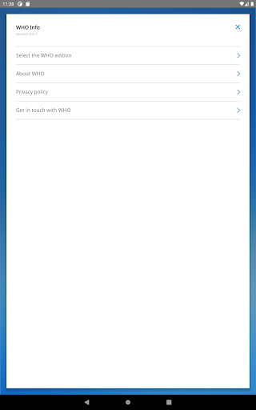  | 
 | 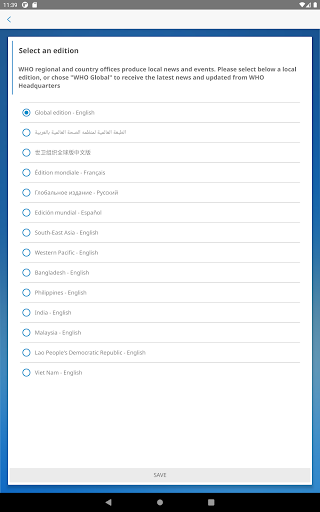  | 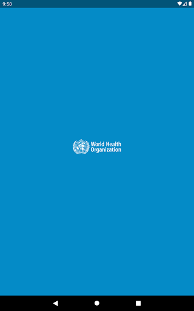  |   | 
 |   |   |   | 
 |   | 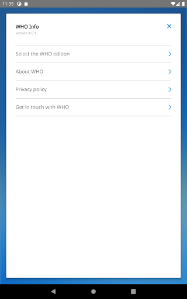  |   | 

## Development team
In the following we report the main information provided by the development team in the Google play store.

| | |
|-------------------------|-------------------------|
| **Developer**  | World Health Organization |
| **Website**  | [https://www.who.int/](https://www.who.int/) |
| **Email** | dcx@who.int |
| **Physical address**  | [Avenu Appia 20 1211 Geneva Switzerland](https://www.google.com/maps/search/Avenu%20Appia%2020%201211%20Geneva%20Switzerland) (Google Maps) |
| **Other developed apps**  | [https://play.google.com/store/apps/developer?id=World+Health+Organization](https://play.google.com/store/apps/developer?id=World+Health+Organization) |

## Android support

| | |
|-------------------------|-------------------------|
| **Declared target Android version**  | - |
| **Effective target Android version**  | - |
| **Minimum supported Android version**  | Jelly Bean, version 4.2.x (API level 17) |
| **Maximum target Android version**  | - |

The larger the difference between the minimum and maximum supported Android versions, the better. A larger difference means a wider audience. For example, old phones have a very low Android version, so a high minimum supported Android version means that the app cannot be used by users with old phones, thus leading to accessibility problems. 

## Requested permissions

In the following we report the complete list of the permissions requested by the app. 

| **Permission** | **Protection level** | **Description** | 
|-------------------------|-------------------------|-------------------------|
 **android.permission ACCESS_NETWORK_STATE** | Normal | Allows applications to access information about networks. 
 **android.permission INTERNET** | Normal | Allows applications to open network sockets. 
 **android.permission READ_CALENDAR** | :warning:**Dangerous** | Allows an application to read the user's calendar data. 
 **android.permission READ_EXTERNAL_STORAGE** | :warning:**Dangerous** | Allows an application to read from external storage. 
 **android.permission WAKE_LOCK** | Normal | Allows using PowerManager WakeLocks to keep processor from sleeping or screen from dimming. 
 **android.permission WRITE_CALENDAR** | :warning:**Dangerous** | Allows an application to write the user's calendar data. 
 **android.permission WRITE_EXTERNAL_STORAGE** | :warning:**Dangerous** | Allows an application to write to external storage. 
 **com.google.android.c2dm.permission RECEIVE** | - | - 
 **com.google.android.finsky.permission BIND_GET_INSTALL_REFERRER_SERVICE** | - | - 

## Mentioned servers

| **Server** | **Registrant** | **Registrant country** | **Creation date** | 
|-------------------------|-------------------------|-------------------------|-------------------------|
 | adobe.com | Adobe Inc. | :us: US | 1986-11-17 05:00:00 |
 | googlesyndication.com | Google LLC | :us: US | 2003-01-21 06:17:24 |
 | google.com | Google LLC | :us: US | 1997-09-15 04:00:00 |
 | app-measurement.com | Google LLC | :us: US | 2015-06-19 20:13:31 |
 | googleapis.com | Google LLC | :us: US | 2005-01-25 17:52:26 |
 | googleadservices.com | Google LLC | :us: US | 2003-06-19 16:34:53 |

## Security analysis 

Below we report the main security warnings raised by our execution of the [Androwarn](https://github.com/maaaaz/androwarn) security analysis tool.

**Connection interfaces exfiltration**
> - This application reads details about the currently active data network 
> - This application tries to find out if the currently active data network is metered 

**Suspicious connection establishment**
> - This application opens a Socket and connects it to the remote address 'Lfi/iki/elonen/NanoHTTPD$ResponseException;' on the 'N/A' port  
> - This application opens a Socket and connects it to the remote address 'NanoHttpd Shutdown' on the 'N/A' port  

**Code execution**
> - This application loads a native library: 'NativeScript' 
> - This application executes a UNIX command containing this argument: '2' 

## User ratings and reviews

Below we provide information about how end users are reacting to the app in terms of ratings and reviews in the Google Play store.

### Ratings

The WHO Info app has been installed by more than **100000** times. At this time, **1080** rated the app and its average score is **4.009259**. Below we show the distribution of the ratings across the usual star-based rating of Google Play

:star::star::star::star::star:: 710

:star::star::star::star:: 90

:star::star::star:: 40

:star::star:: 60

:star:: 180

### Reviews 

#### 5-star reviews

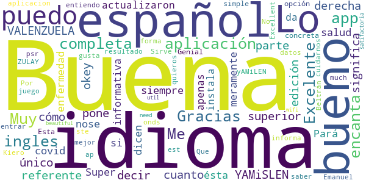

> YAMiSLEN VALENZUELA (1977)  :date: __2020-12-15 16:58:12__

> Lo único que puedo decir es referente al idioma, está en todos los idiomas, en cuanto al español pone; edición en español y en la parte superior derecha, hay cómo una v que significa okey y ya la tenéis en español para siempre, ésta aplicación es meramente informativa, sobre la salud ya sea covid o otra enfermedad  :date: __2020-11-04 08:37:34__

> Super completa. Pará los que dicen q esta en ingles nose si actualizaron pero apenas se instala da la opción de los idiomas. Esta completa concreta y simple. Genial 👌  :date: __2020-10-17 19:00:49__

> Muy buena aplicacion  :date: __2020-10-02 05:14:43__

> Buena  :date: __2020-09-19 23:11:31__

> Muy buena est la ap ⭐⭐⭐⭐⭐  :date: __2020-08-24 00:46:20__

> yAMiLEN (1977)  :date: __2020-08-20 17:49:10__

> Excelente  :date: __2020-08-20 17:37:59__

> Kiero saber lo resultado psr  :date: __2020-07-29 02:55:33__

> 👍👍👍  :date: __2020-07-23 15:29:51__

#### 4-star reviews

> Buena  :date: __2020-11-07 15:21:20__

> La aplicación viene con opción para cambiar el idioma... No se porque la gente no se molesta en indagar eso, la aplicación en sí esta muy bien  :date: __2020-07-09 21:29:22__

> Bueno  :date: __2020-06-29 07:08:43__

> I think you can create a version in Spanish, it's one of the most spoken languages around the world and we need an access in our own native language. Thanks for your effort, I remember an WHO News App some years ago and then it disappeared.  :date: __2020-05-24 03:28:52__

> Nomr intetesa  :date: __2020-04-28 07:09:55__

> Muy buena  :date: __2020-04-23 21:10:36__

#### 3-star reviews

> Un poco buena mas o meno  :date: __2020-07-16 04:50:52__

> Lautaro18  :date: __2020-05-13 06:07:11__

#### 2-star reviews

> Deseo encontrar buenas enseñansas para mejorar nuestras vidas .oquey  :date: __2020-06-28 22:17:04__

> Presta una ayuda buena  :date: __2020-05-07 20:16:33__

#### 1-star reviews

> Mlisima  :date: __2020-10-16 16:11:18__

> Mala muy mala  :date: __2020-09-14 00:43:53__

> Execlente 😉  :date: __2020-08-28 01:52:57__

> No funciona.No la recomendaría para nada.Espero que sea algo que se pueda resolver.Gracias.  :date: __2020-08-06 18:26:06__

> ¡HORRIBLE!  :date: __2020-07-15 00:26:33__

> Esta en inglés que porquería de aplicación por eso 1 estrella  :date: __2020-05-29 00:06:33__

> Pues algo util para algunas cosas  :date: __2020-05-24 03:39:19__

> No está en español. No nos sirve a los hispano parlantes.  :date: __2020-05-20 14:13:49__

> No está en español  :date: __2020-05-20 12:35:15__

> La app es interesante pero yo no sé inglés. Pongan la posibilidad que pueda leerse en español porque soy lector de su página web y es muy interesante y más en éstos tiempos.  :date: __2020-05-19 00:45:01__

# COVID-19.eus
App version ``4.1``

Analyzed with [covid-apps-observer](http://github.com/covid-apps-observer) project, version ``0.1``

## App overview
| | |
|-------------------------|-------------------------| 
| **Name**&nbsp;&nbsp;&nbsp;&nbsp;&nbsp;&nbsp;&nbsp;&nbsp;&nbsp;&nbsp;&nbsp;&nbsp;&nbsp;&nbsp;&nbsp;&nbsp;&nbsp;&nbsp;&nbsp;&nbsp;&nbsp;&nbsp;&nbsp;&nbsp;&nbsp;&nbsp;&nbsp;&nbsp;&nbsp;&nbsp;&nbsp;&nbsp;&nbsp;&nbsp;&nbsp;&nbsp;&nbsp;&nbsp;&nbsp;&nbsp;  | COVID-19.eus |
| **Unique identifier** | com.erictelm2m.colabora |
| **Link to Google Play** | [https://play.google.com/store/apps/details?id=com.erictelm2m.colabora](https://play.google.com/store/apps/details?id=com.erictelm2m.colabora) |
| **Summary**  | Círculos de colaboración, para nuestra salud, para nuestro bienestar. |
| **Privacy policy** | [https://colaboro.erictel.com/privacy](https://colaboro.erictel.com/privacy) |
| **Latest version** | 4.1 |
| **Last update** | 2020-09-04 14:10:20 |
| **Recent changes** | Se incluye la fecha de reporte en las gráficas de contagios |
| **Installs**  | 50.000+ |
| **Category** | Medicina |
| **First release** | 27 mar. 2020 |
| **Size**  | 8,3M |
| **Supported Android version**  | 5.0 y versiones posteriores |

### Description
> COVID-19.eus es una aplicación colaborativa para gestionar la pandemia del COVID-19 en el ámbito de la comunidad autónoma vasca. La aplicación permite hacer un autodiagnóstico del contagio de COVID-19. En caso de ser positivo, el usuario se considerará POSIBLE contagio (según terminología de la OMS) y avisará a todo el cículo de personas, de tal forma que se considerarán en riesgo.
 Junto a esta información el sistema registrará ese dato, de tal forma que se puede seguir un rastro de contagios con esta funcionalidad de círculos. Junto con esta información, se pide el Código Postal, y en caso de infección comunitaria, se podrían también detectar focos de contagio.
 Esta información se utilizará para el análisis y el estudio epidemiológico.

### User interface
The developers of the app provide the following screenshots in the Google play store.
| | | |
|:-------------------------:|:-------------------------:|:-------------------------:|
 |   |  

## Development team
In the following we report the main information provided by the development team in the Google play store.

| | |
|-------------------------|-------------------------|
| **Developer**  | Osakidetza |
| **Website**  | - |
| **Email** | COVID19.APP@osakidetza.eus |
| **Physical address**  | - |
| **Other developed apps**  | [https://play.google.com/store/apps/developer?id=Osakidetza](https://play.google.com/store/apps/developer?id=Osakidetza) |

## Android support

| | |
|-------------------------|-------------------------|
| **Declared target Android version**  | Android10, version 10 (API level 29) |
| **Effective target Android version**  | Android10, version 10 (API level 29) |
| **Minimum supported Android version**  | Lollipop, version 5.0 (API level 21) |
| **Maximum target Android version**  | - |

The larger the difference between the minimum and maximum supported Android versions, the better. A larger difference means a wider audience. For example, old phones have a very low Android version, so a high minimum supported Android version means that the app cannot be used by users with old phones, thus leading to accessibility problems. 

## Requested permissions

In the following we report the complete list of the permissions requested by the app. 

| **Permission** | **Protection level** | **Description** | 
|-------------------------|-------------------------|-------------------------|
 **android.permission ACCESS_NETWORK_STATE** | Normal | Allows applications to access information about networks. 
 **android.permission CAMERA** | :warning:**Dangerous** | Required to be able to access the camera device. 
 **android.permission FOREGROUND_SERVICE** | Normal | Allows a regular application to use Service.startForeground. 
 **android.permission INTERNET** | Normal | Allows applications to open network sockets. 
 **android.permission READ_CONTACTS** | :warning:**Dangerous** | Allows an application to read the user's contacts data. 
 **android.permission RECEIVE_BOOT_COMPLETED** | Normal | Allows an application to receive the Intent.ACTION_BOOT_COMPLETED that is broadcast after the system finishes booting. 
 **android.permission WAKE_LOCK** | Normal | Allows using PowerManager WakeLocks to keep processor from sleeping or screen from dimming. 
 **android.permission WRITE_EXTERNAL_STORAGE** | :warning:**Dangerous** | Allows an application to write to external storage. 
 **com.google.android.c2dm.permission RECEIVE** | - | - 

## Mentioned servers

| **Server** | **Registrant** | **Registrant country** | **Creation date** | 
|-------------------------|-------------------------|-------------------------|-------------------------|
 | google.com | Google LLC | :us: US | 1997-09-15 04:00:00 |
 | erictel.com | MAM Objects S.L. | :es: ES | 1998-07-07 04:00:00 |
 | googleapis.com | Google LLC | :us: US | 2005-01-25 17:52:26 |

## Security analysis 

Below we report the main security warnings raised by our execution of the [Androwarn](https://github.com/maaaaz/androwarn) security analysis tool.

**Connection interfaces exfiltration**
> - This application reads details about the currently active data network 
> - This application tries to find out if the currently active data network is metered 

## User ratings and reviews

Below we provide information about how end users are reacting to the app in terms of ratings and reviews in the Google Play store.

### Ratings

The COVID-19.eus app has been installed by more than **50000** times. At this time, **619** rated the app and its average score is **3.21**. Below we show the distribution of the ratings across the usual star-based rating of Google Play

:star::star::star::star::star:: 192

:star::star::star::star:: 105

:star::star::star:: 93

:star::star:: 99

:star:: 130

### Reviews 

#### 5-star reviews

> On  :date: __2020-11-20 23:46:49__

> 😷😷😷😷😷😷😃😃😃😃😃😃😃😃😃😄😄😄😄😄😄😁😁😁😁😀😀😀😀😀😀😍😍😍  :date: __2020-11-13 17:21:08__

> Yo he llamado para probarla, y hice el tes me trataron muy bien.  :date: __2020-11-02 18:09:08__

> Estoy esperimentado él resultado  :date: __2020-10-25 21:42:28__

> Muy bien  :date: __2020-10-25 16:12:32__

> Todavia no e visto nada en el movit ¿como os voy a decir nada ?.  :date: __2020-10-25 14:44:11__

> Deberíamos tenerla todos por solidaridad  :date: __2020-10-03 23:57:39__

> 🙏🙏🙏  :date: __2020-09-21 11:06:28__

> Discreta  :date: __2020-09-19 11:53:52__

> Me gusta ésta aplicación  :date: __2020-09-19 08:53:56__

#### 4-star reviews

> Tengo un dispositivo Android sin play store y no funciona esta App. Tengo un Huawei, si pueden resolver, me gustaría seguir usándola  :date: __2020-10-25 20:40:51__

> No está claro si es radar covid Euskadi edition o solo contactos estrechos, la verdad, no estaría mal que fuera la primera, pero tiene pinta de ser la segunda, vendría bien un radar covid en euskadi, y necesita más publicidad  :date: __2020-09-16 00:15:11__

> Tenía que poner los pueblos de cada zona, sobre todo los que tienen más de 1000 habitantes. Gracias.  :date: __2020-09-04 11:02:38__

> Si mandas una invitacion a un contacto y no tiene la aplicacion descargada, le da algun tipo de aviso para que se la descargue y acepte la invitacion?  :date: __2020-08-16 15:22:04__

> Estaría bien que funcionara como el bizum, cuando quieres agregar alguien a un círculo que te indique los contactos que ya están registrados. Supongo que si algún conocido indica que es positivo la app te dirá que alguien de un círculo lo es, sin poner nombre ni ninguna información personal?  :date: __2020-08-11 16:48:36__

> ,¿Por que los datos que muestra la aplicación de "positivos de ayer por PCR" no coinciden con los q pública el GV en sus datos diarios?  :date: __2020-08-02 18:03:37__

> Para que esta app funcione o cumpla el objetivo lo debiera instalar toda la poblacion. No sirve para nada con los que estamos. A mi me marca que la ultima actualizacion de datos es del 04 de abril. Estoy a favor de un control mas estricto incluso que por numeros de telefono sepan como nos juntamos y donde para poder hacer un rastreo mas eficaz. No hay otra, mientras una parte de la poblacion sea tan irresponsable. Esto no es broma.  :date: __2020-08-01 11:35:39__

> Esta Aplicación está bien que informa del coronas virus  :date: __2020-07-25 21:40:43__

> Me ha aparecido un mensaje que la sesión ha expirado, que desinstale y vuelva a instalar. Y sigue apareciendo ese mensaje que imposibilita un uso correcto. Se rogaría un arreglo o, al menos, una explicación en la ayuda de la app. Nota añadida: se ha arreglado sin que yo interviniera.  :date: __2020-07-12 00:54:07__

> En la última actualización salta un aviso que dice...la sesión ha expirado desinstala la app y vuelve a instalarla...ya lo he hecho y salta el mismo aviso!! Además ha desaparecido la imagen de perfil.  :date: __2020-06-29 20:20:45__

#### 3-star reviews

> Lo único que no me gusta es que no ponen los datos todos los días , y por eso no me gusta mucho  :date: __2020-11-29 13:37:28__

> No es muy clara  :date: __2020-09-20 17:21:58__

> Recomiendo que eviten enviar Push Notifications a todos los usuarios con mensajes de prueba porque esto hace un poco molesta la App. En general el diseño es bueno y permite navegar fácilmente. Sería interesante implementar un enlace con la App radar covid para que obtengan los contactos desde esa App  :date: __2020-09-17 08:24:44__

> Cuando agregamos a un familiar, o amigo, aparece en el listado sólo el número de teléfono, con lo cual no sé a quién he añadido, puesto que actualmente no sabemos los números de teléfono de casi nadie. Tampoco admite números de fijos...  :date: __2020-08-15 11:19:16__

> No es muy intuitiva la verdad... Creo que no se está publicitando lo suficiente. Si la usamos 4 gatos, no va a servir de mucho. Yo me enteré y me la descargue porque me dijo mi hermano.  :date: __2020-07-22 00:58:53__

> Estaría bien que lo anunciaran en castellano, yo he llegado aquí por un anuncio en daylimotion y nos seguimos empeñando en que todo el mundo sabe euskera cuando no es así, castellano si que sabemos todos. Esto es de interés general, por favor, ponedle sentido y permitidnos enterarnos a la primera. Edito! Mirad la respuesta, me refería a la publicidad de la app, para contestar eso la verdad es que no se para que pagan a un community manager.  :date: __2020-07-01 11:20:50__

> He tenido el mismo problema de que pide reinstalar y no funciona. Hay que ir a aplicaciones, buscar esta aplicación, y en almacenamiento, borrar todos los datos del usuario. Después de esto funciona y mantiene los contactos  :date: __2020-06-30 11:39:10__

> Tenía instalada la aplicación, pero me avisa de que debo descargarla otra vez porque ha expirado, lo hago pero sigue diciéndome lo mismo.  :date: __2020-06-28 14:42:08__

> No puedo cambiar un familiar a home si vive en mi casa, si pudiese hacerlo le daría más estrellas  :date: __2020-06-11 10:47:28__

> Esta bien, Le falta mejoras como poder editar tu información y que se lea mejor el texto para que sea una aplicación familiar y confortable.  :date: __2020-06-08 03:08:14__

#### 2-star reviews

> Me mandaron un mensaje de alerta y ni yo, ni la enfermera, ni dónde me han hecho la PCR saben descifrarlo Me hecho la PCR y me ha dado NEGATIVO. La verdad que no es muy práctica  :date: __2020-12-07 12:17:22__

> No sé si son muy eficaces  :date: __2020-10-04 14:12:34__

> ninguno de mis contactos quiere instalarlo porque no quieren que los controlen. Así no hay manera de que esta app funcione correctamente. Es septiembre ahora y nadie de mi agenda lo instaló, No me sirve así. No hay forma de modificar los datos iniciales, por ejemplo si el entorno en el que vives habia personas de riesgo y ya no estan o ha cambiado tu situacion. No puedes modificarlo si ahora vives solo y el riesgo ha bajado. La desinstalo, en 5 meses no ha mejorado apenas.  :date: __2020-09-15 00:39:23__

> No tengo la opcion de activar rastreo bluethooth, y el acceso a los contactos es cualquier cosa menos intuitiva  :date: __2020-08-31 15:13:23__

> No funciona bien, lleva estancada en número de infectados un, montón de tiempo y se que en mi localidad hay más casos confirmados de los que pone.  :date: __2020-08-25 03:40:04__

> Una aplicación bastante regular. En la última actualización ya no se puede saber cuántos usamos la app. La curva de datos y los boletines normalmente están desactualizados. No se ha publicitado lo suficiente, demasiado círculo para tan poco contacto. Pensando en desinstalarla  :date: __2020-08-14 12:15:22__

> No sirve de mucho. Trabajo en el SAD, y lógicamente los usuarios a los que atiendo el 99% no tienen la app ni sabrían usarla. Por otro lado, no me ha llegado ninguna propuesta de aislamiento cuando en el círculo de mis hijas ha habido positivos y nos recomendaron por teléfono aislamiento mientras esperábamos los resultados (afortunadamente ellas han dado negativo). Vamos, que en mi trabajo puedo pillarlo sin enterarme y no saber de quién. Que no, que no sirve aunque la idea sea buena.  :date: __2020-08-01 12:52:55__

> Se necesita la colaboración y a veces es difícil convencer de la confidencialidad y hay rechazo a colaborar. Un poco más de propaganda de ella y su utilidad.  :date: __2020-07-09 20:05:24__

> Muy difícil de instalar  :date: __2020-07-07 09:34:02__

> Desde ayer no funciona. Dice que la sesión ha expirado y que la desinstale y la vuelva a instalar. A pesar de haberlo hecho varias veces no funciona. Por otro lado, a la hora de añadir personas a los círculos debería dar la posibilidad de añadirlos sin teléfono puesto que si son personas mayores seguramente o tienen un móvil o no tienen ninguno; y por otro lado, es posible que la gente de mis círculos no quiera que le lleguen notificaciones para instalar la app.  :date: __2020-06-28 18:03:44__

#### 1-star reviews

> Si metes codigo postal erroneo no permite modificarlo por lo que no tienes datos reales  :date: __2020-11-30 09:58:40__

> Que sentido tiene la app si no funciona la posibilidad de agregar contactos, otro ejemplo de como funciona la gestión de osakidetza frente a la crisis... en fin, borro la app  :date: __2020-10-25 14:40:50__

> De momento no se si esta istalada no tengo nada que lo diga ni me lo aclaran.  :date: __2020-10-22 14:54:04__

> No deja añadir contactos, me dice que hay una solicitud pendiente pero no hay manera de solucionarlo  :date: __2020-10-21 08:06:14__

> Me la acabo de desinstalar, porque yo creo que no funciona, no da noticias relevantes la última 19 de septiembre, donde está la información??? No sube los contactos, lo siento pero no me sirve  :date: __2020-10-17 15:51:24__

> Poco intuitiva y dificil de usar Despues de hacer los circulos y dar mi estado de salud no he recibido ninguna notificacion. No se si siguen mis contactos dentro de los circulos..... tampoco tiene mucha difusión, me parece una herramienta muy util pero deberia ser mas facil de usar.  :date: __2020-10-03 14:38:34__

> Hola!!! CONSIDERO UNA PERDIDA DE TIEMPO TRADUCIR LA APP DE RADAR COVID ESTATAL SIENDO POSTERIOR A LA DESARROLLADA EN EUSKADI, AQUÍ TENDRÍAMOS QUE USAR COVID-19.EUS QUE ESTABA ANTES Y EN EUSKADI ES LA QUE TENEMOS DESCARGADA HACE TIEMPO😬  :date: __2020-09-26 18:53:02__

> Por un fallo al empezar con el Código postal me pone en otro sitio y no deja modificarlo. He desistalado la app y la he vuelto a instalar y sigue poniendo mal el C. P. Mala APP. Así mal para colaborar. He borrado todos los datos de la aplicación y al volver a meterlos sigue poniendo mal el C. P. Aunque borre los datos en cuanto metes de nuevo los correctos te los vuelve a poner mal. Así vamos.....  :date: __2020-09-23 19:33:57__

> No he podido utilizarla porque pide un código SMS que no se cual es ni cual puede ser. Tanto tiempo de retraso para ahora llegar a esto. Faciliten la aplicación si quieren que se descargue y se use de modo general ya que si lo complican tanto no se descargará. Yo ya la he desinstalado.  :date: __2020-09-18 15:16:15__

> Aparecen notificaciones push a horas extrañas con mensajes sin sentido como URGENTE, REUNIÓN, HOLA. Parece que alguien está jugando. He notificado esto al desarrollador y no contesta nadie. Parece que no hay nadie al volante. Desinstalando...  :date: __2020-09-17 17:25:15__

# STOP COVID19 CAT
App version ``2.1.0``

Analyzed with [covid-apps-observer](http://github.com/covid-apps-observer) project, version ``0.1``

## App overview
| | |
|-------------------------|-------------------------| 
| **Name**&nbsp;&nbsp;&nbsp;&nbsp;&nbsp;&nbsp;&nbsp;&nbsp;&nbsp;&nbsp;&nbsp;&nbsp;&nbsp;&nbsp;&nbsp;&nbsp;&nbsp;&nbsp;&nbsp;&nbsp;&nbsp;&nbsp;&nbsp;&nbsp;&nbsp;&nbsp;&nbsp;&nbsp;&nbsp;&nbsp;&nbsp;&nbsp;&nbsp;&nbsp;&nbsp;&nbsp;&nbsp;&nbsp;&nbsp;&nbsp;  | STOP COVID19 CAT |
| **Unique identifier** | cat.gencat.mobi.StopCovid19Cat |
| **Link to Google Play** | [https://play.google.com/store/apps/details?id=cat.gencat.mobi.StopCovid19Cat](https://play.google.com/store/apps/details?id=cat.gencat.mobi.StopCovid19Cat) |
| **Summary**  | La aplicación móvil de /Salut en relación al Covid-19 |
| **Privacy policy** | [http://sem.gencat.cat/ca/061CatSalutRespon/apps-mobils/STOPCOVID19/condicions-seguretat](http://sem.gencat.cat/ca/061CatSalutRespon/apps-mobils/STOPCOVID19/condicions-seguretat) |
| **Latest version** | 2.1.0 |
| **Last update** | 2020-10-05 08:14:27 |
| **Recent changes** | Aclaramos la política de privacidad y las condiciones de uso de la app. |
| **Installs**  | 500.000+ |
| **Category** | Medicina |
| **First release** | 18 mar. 2020 |
| **Size**  | 7,9M |
| **Supported Android version**  | 5.0 y versiones posteriores |

### Description
> STOP COVID19 CAT es una aplicación móvil de /Salut con un doble objetivo:
 1. Dar respuesta a las necesidades de información de la ciudadanía en relación con el COVID-19, a través de un cuestionario que les indica si tienen posibilidad de tener COVID.
 2. Recoger datos de la población para poder crear mapas de calor para el cuadro de comandamiento.

### User interface
The developers of the app provide the following screenshots in the Google play store.
| | | |
|:-------------------------:|:-------------------------:|:-------------------------:|
 |   | 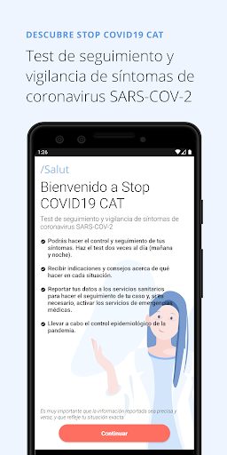  |   | 
 |   | 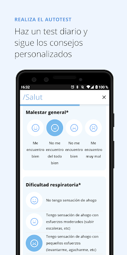 

## Development team
In the following we report the main information provided by the development team in the Google play store.

| | |
|-------------------------|-------------------------|
| **Developer**  | Generalitat de Catalunya |
| **Website**  | [https://salutweb.gencat.cat](https://salutweb.gencat.cat) |
| **Email** | mobilitat.ctti@gencat.cat |
| **Physical address**  | - |
| **Other developed apps**  | [https://play.google.com/store/apps/developer?id=Generalitat+de+Catalunya](https://play.google.com/store/apps/developer?id=Generalitat+de+Catalunya) |

## Android support

| | |
|-------------------------|-------------------------|
| **Declared target Android version**  | Android10, version 10 (API level 29) |
| **Effective target Android version**  | Android10, version 10 (API level 29) |
| **Minimum supported Android version**  | Lollipop, version 5.0 (API level 21) |
| **Maximum target Android version**  | - |

The larger the difference between the minimum and maximum supported Android versions, the better. A larger difference means a wider audience. For example, old phones have a very low Android version, so a high minimum supported Android version means that the app cannot be used by users with old phones, thus leading to accessibility problems. 

## Requested permissions

In the following we report the complete list of the permissions requested by the app. 

| **Permission** | **Protection level** | **Description** | 
|-------------------------|-------------------------|-------------------------|
 **android.permission ACCESS_BACKGROUND_LOCATION** | :warning:**Dangerous** | Allows an app to access location in the background. 
 **android.permission ACCESS_COARSE_LOCATION** | :warning:**Dangerous** | Allows an app to access approximate location. 
 **android.permission ACCESS_FINE_LOCATION** | :warning:**Dangerous** | Allows an app to access precise location. 
 **android.permission ACCESS_NETWORK_STATE** | Normal | Allows applications to access information about networks. 
 **android.permission INTERNET** | Normal | Allows applications to open network sockets. 
 **android.permission WAKE_LOCK** | Normal | Allows using PowerManager WakeLocks to keep processor from sleeping or screen from dimming. 
 **com.google.android.c2dm.permission RECEIVE** | - | - 
 **com.google.android.finsky.permission BIND_GET_INSTALL_REFERRER_SERVICE** | - | - 

## Mentioned servers

| **Server** | **Registrant** | **Registrant country** | **Creation date** | 
|-------------------------|-------------------------|-------------------------|-------------------------|
 | backendcovi2.net | Whois Privacy Service | :us: US | 2020-04-14 18:39:27 |
 | google.com | Google LLC | :us: US | 1997-09-15 04:00:00 |
 | googlesyndication.com | Google LLC | :us: US | 2003-01-21 06:17:24 |
 | app-measurement.com | Google LLC | :us: US | 2015-06-19 20:13:31 |
 | crashlytics.com | Google LLC | :us: US | 2011-01-21 15:30:40 |
 | googleapis.com | Google LLC | :us: US | 2005-01-25 17:52:26 |
 | googleadservices.com | Google LLC | :us: US | 2003-06-19 16:34:53 |

## Security analysis 

Below we report the main security warnings raised by our execution of the [Androwarn](https://github.com/maaaaz/androwarn) security analysis tool.

**Connection interfaces exfiltration**
> - This application reads details about the currently active data network 
> - This application tries to find out if the currently active data network is metered 

**Telephony services abuse**
> - This application makes phone calls 

**Suspicious connection establishment**
> - This application opens a Socket and connects it to the remote address ' returned no addresses for  ; port is out of range' on the 'N/A' port  
> - This application opens a Socket and connects it to the remote address '' on the 'N/A' port  
> - This application opens a Socket and connects it to the remote address 'Ljava/lang/StringBuilder;->toString()Ljava/lang/String;' on the 'N/A' port  
> - This application opens a Socket and connects it to the remote address 'Ljava/net/Proxy;->type()Ljava/net/Proxy$Type;' on the 'N/A' port  
> - This application opens a Socket and connects it to the remote address 'timeout' on the 'N/A' port  

## User ratings and reviews

Below we provide information about how end users are reacting to the app in terms of ratings and reviews in the Google Play store.

### Ratings

The STOP COVID19 CAT app has been installed by more than **500000** times. At this time, **1900** rated the app and its average score is **3.234375**. Below we show the distribution of the ratings across the usual star-based rating of Google Play

:star::star::star::star::star:: 703

:star::star::star::star:: 317

:star::star::star:: 188

:star::star:: 108

:star:: 584

### Reviews 

#### 5-star reviews

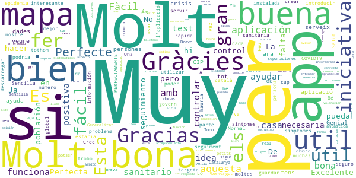

> Creo que puede ser muy útil.  :date: __2020-11-06 15:34:14__

> Es fácil de entender  :date: __2020-09-15 15:09:16__

> Excelente  :date: __2020-09-04 10:58:24__

> Esta app la veo bien  :date: __2020-08-01 12:41:39__

> En mi opinión está bien que tengas que introducir tus datos para que Salut pueda contactar contigo y hacer el seguimiento,pero para mí sería perfecta ya si incorporase la función de Bluetooth para avisar de sintomáticos y/o positivos cercanos.  :date: __2020-07-22 13:01:04__

> Es muy necesaria y óptima debería de tenerla todo el mundo instalada y más ahora  :date: __2020-07-17 06:29:26__

> Ningun problema de conecsion  :date: __2020-06-21 16:11:09__

> Bién  :date: __2020-06-18 08:42:42__

> Buena  :date: __2020-06-17 10:03:23__

> Ja torna a funcionar, moltes gràcies, per la vostre resposta.  :date: __2020-06-14 21:29:30__

#### 4-star reviews

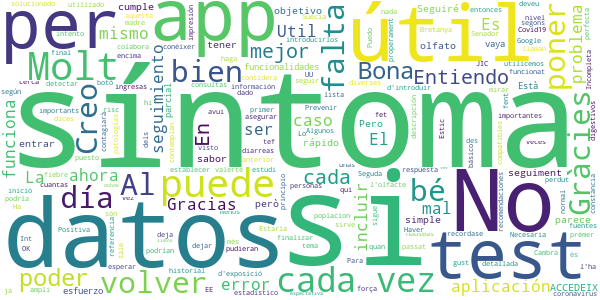

> Bueno esta bien y gracias a la informacion que facilita la institución sanitaria es más fiable.  :date: __2020-11-01 15:32:45__

> Todo bien por el momento. Lo unico es que estoy confinada desde el 22 de Octubre y no logro que me hagan la baja laboral...Quien la debe de tramitar. Gracias..  :date: __2020-10-26 15:08:41__

> No tengo  :date: __2020-10-20 12:07:41__

> Entiendo que es útil a nivel estadístico y que cuantas más personas la utilicemos mejor se colabora para establecer datos importantes. Lo que no es normal es que cada vez que la he utilizado, 3 o 4 veces desde que se inició el tema, tengas que volver a poner todos los datos y encima si consultas tu historial no hay nada.  :date: __2020-10-15 10:28:36__

> A esperar que la app la tenga el 75% de la poplacion.  :date: __2020-08-25 08:22:19__

> En esta aplicación ingresas información pero le falta respuesta y seguimiento.  :date: __2020-08-10 11:17:30__

> Es podría mirar d'introduir aquesta APP per la cerca de Google de risc d'exposició?  :date: __2020-08-06 09:26:39__

> Necesaria para Prevenir Gracias  :date: __2020-07-21 17:40:01__

> No me deja poner el n° de tef, me sale que hay un error. La anterior era perfecta pero esta no funciona. El problema se a solucionado, ahora esta OK.  :date: __2020-06-12 20:44:26__

> Ha funcionat bé des de el primer día  :date: __2020-05-24 18:05:44__

#### 3-star reviews

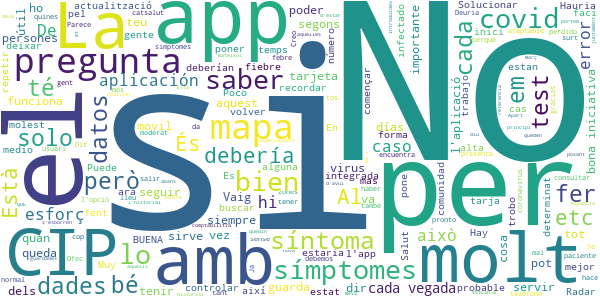

> Buenos días, no puedo acceder a la aplicación. Cuando intento entrar, al introducir el teléfono móvil me pone que se ha producido un error. ¿Que debo hacer en este caso?  :date: __2020-11-17 09:33:20__

> Por qué una app solo para Catalunya si en el resto de España también hay positivos? Separatismo es cuando no ves a tus semejantes iguales a ti, y yo hasta ahora solo veo que todos tenemos pies y manos y cabeza (aunque unos mas grandes que otros), con lo cual no sirve si sales fuera de Catalunya y tampoco sirve si alguien de fuera de Catalunya viene aquí, porque no se va a descargar la app solo para saber si hay positivos "catalanes" a su alrededor. Por una vez, hagamos las cosas al unísono.  :date: __2020-10-27 18:17:23__

> Va bé per controlar els símptomes. Hauria d'estar integrada dintre de La Meva Salut, juntament amb Radar Covid.  :date: __2020-09-10 17:11:13__

> ¿Está integrada con Radar COVID, la app española?  :date: __2020-09-06 13:18:25__

> BUENA  :date: __2020-08-13 15:14:40__

> Puede QUE sea útil.  :date: __2020-08-04 03:39:03__

> 👍👍👍  :date: __2020-07-15 23:38:35__

> Està bé que en la nova actualització et faci un historial, i així quedin guardades les dades, però aquells que la portem fent servir des del principi, on queden aquelles dades? Vaig deixar de fer-la servir un temps i ara em trobo que quan abans em deia cas probable de Covid ara em diu q no, posant els mateixos símptomes. Apart, l'historial me'l comptabilitza des d'avui quan en realitat vaig començar a fer-la servir al Març.  :date: __2020-06-18 10:18:35__

> Al fer una actualització de l'app s'esborren les dades introduïdes, especialment la referència de la tarja que es molt difícil de recordar. Solucionar aquest detall donaria confiança en l'app.  :date: __2020-06-11 21:00:11__

> En la nueva configuración de Google para saber quién está infectado y si has estado cerca, eso que nos han instalado a todo el país, dice que hay que dar permiso a la app de covid de nuestra comunidad para que nos avisen de posibles contactos con infectados. Esta app no tiene ajustes. Hay otra app de covid en nuestra comunidad?  :date: __2020-06-02 14:47:27__

#### 2-star reviews

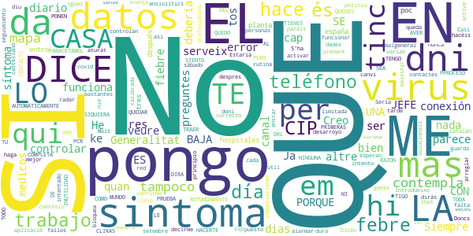

> No serveix per res. S'ha de activar un altre aplicació que controli els contactes de un qui doni positiu a PCR. Ja hi ha el radar covid. A veure quan le active la Generalitat o es que está esperan al 12 de setembre  :date: __2020-08-26 12:05:43__

> Casi nunca funciona  :date: __2020-07-17 03:07:53__

> Em diu que nio tinc zip;)  :date: __2020-07-08 07:46:25__

> Introdueixo les dades pero despres quan confirmo no avança es queda aturat  :date: __2020-06-21 14:00:59__

> Dicen ke asi controlan a diario los datos y no los guarda ya me dirás tú ke manera de controlar.  :date: __2020-04-23 13:11:12__

> LO SIENTO PERO ES UNA COMPLETA INUTILIDAD. SI CLIKAS UNA DE LAS PRIMERAS, LA QUE SEA Y NINGUNA MAS EN TODO EL PPROCESO. AUTOMÁTICAMENTE TE DICE QUE TIENES SINTOMAS Y QUE TE QUEDES EN TU CASA Y PARACETAMOL. 1° SI TRABAJO COMO ME VOY A QUEDAR EN CASA? . QUE LE DICES AL JEFE ?(QUE ME QUEDO EN CASA PORQUE TENGO SINTOMAS. A LO QUE EL JEFE CON TODA RAZON DEL MUNDO TE DIRA TRAER BAJA DRL VIRUS.).AVER QUE HACES. PORQUE HACERTE LA PRUEBA ROTUNDAMENTE NO. SI NI SIQUIERA SE PONEN EN CONTACTO CON TIGO.  :date: __2020-04-10 09:06:41__

> Siempre da error de conexión  :date: __2020-04-05 13:25:16__

> No em serveix de res. Molt limitada en preguntes. Tinc mal de cap que em dura dias, sense febre. Doncs no és corona, és canvi de rutina, prenent ansiolítics.  :date: __2020-04-03 21:17:26__

> Falta mas desarroyo pero es un principio Seria mucho mas util un chat con profesionles medicos diario a las personas con sintomas.Me da bastantes fallos en las comunicaciones se bloquea pero igual es por la red.Lo intento mas tarde.  :date: __2020-04-01 16:41:46__

> No paráis de decirme que haga el seguimiento cada día pero cuando pongo el CIP me dice que no es correcto y con el dni no hace nada, a ver si lo hacéis mejor y solucionais esto  :date: __2020-04-01 15:49:43__

#### 1-star reviews

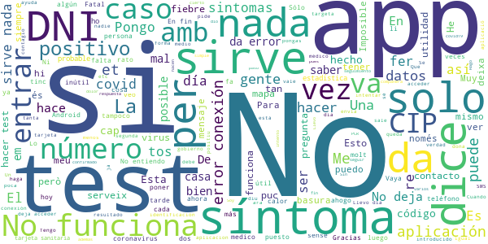

> La primera vez he logrado llegar al paso de recibir el codigo por Sms, lo he puesto pero de allí no se mueve, la segunda vez ya ni he podido intentar enviar el SMS, por mucho que apretaba no pasaba nada. Así no me extraña que no se puedan contabilizar los casos, si no funciona una simple aplicación, que se puede esperar de situaciones más complejas?  :date: __2020-12-16 14:56:06__

> Borrar esta app, es vergonzosa. Despedir al jefe.  :date: __2020-12-14 12:16:10__

> La app no funcina bien. Cuando voy a hacer el test se queda colgada. La he desintalado y vuelto a instalar y nada. Sin el test no sirve para nada. Despues de la reseña, funciono una vez y ahora otra vez no puedo hacer el test  :date: __2020-12-06 21:00:34__

> Fatal  :date: __2020-11-18 15:40:14__

> Soy positivo confirmado, y según app no tengo síntomas, además llevo seis días confirmado y no me ha llamado nadie para hacer seguimiento...y quieren controlar el virus... Edito a su respuesta. Econsulta? Hace tres semanas mandé no una , si no , dos econsulta.. sigo esperando respuesta...y dos citas previas para ver si me hacían más caso.. pues tampoco. Por cierto 061 me dijeron que era cosa del cap no de ellos... fabuloso todo.  :date: __2020-11-14 14:25:46__

> Me pide que ingrese mi codico CIP y me dice que ese código no existe, luego intento ingresar por mi NIE y sale el mismo mensaje "no existe" esta app no sirve para nada.  :date: __2020-11-12 12:45:55__

> Mientras no haces la prueba está bien de ayuda, pero una vez te haces el test y das positivo, no sirve para nada. Yo hoy he hecho test de antígenos y he dado positivo. En cambio relleno los datos y como me han desaparecido varios síntomas, pues me dice que no tengo la Covid. Me da un chasquido el bolo al ver que me dice que no tengo Covid y en cambio hoy me han diagnosticado positivo en el CAP.  :date: __2020-11-09 21:38:15__

> No se si soy o no positivo pero lo que si sé es que mi compañera de trabajo dio positivo en covid19 y yo estado con ella en contacto como muchos más compañeros y estamos esperando que los rastreadores nos llamen eso sí yo tengo que ir ha trabajar como mis otras compañeras hasta que no nos llamen los rastreadores y si yo soy asintomático como mi compañera que dio positivo y trabajamos ha menos de medio metros junto ha otras 8 o 9 personas más no sé yo si está app es fiable  :date: __2020-11-08 17:31:44__

> Vaya test, faltaria preguntar a parte denlos sintomas, si has estado el contacto con personas infectadas, pero bueno a que extrañarse, o61, nefasto, llamadas al cap no hacen ni caso, en fin asi nos va  :date: __2020-11-02 10:04:12__

> No he sido capaz de activar esta aplicación cuando pongo el código que me envían se bloquea y no se puede seguir, arregle la por favor, no nos pidan que colaboremos si nos lo ponen tan difícil  :date: __2020-10-30 11:58:30__

# CONFINAPP
App version ``1.0.0``

Analyzed with [covid-apps-observer](http://github.com/covid-apps-observer) project, version ``0.1``

## App overview
| | |
|-------------------------|-------------------------| 
| **Name**&nbsp;&nbsp;&nbsp;&nbsp;&nbsp;&nbsp;&nbsp;&nbsp;&nbsp;&nbsp;&nbsp;&nbsp;&nbsp;&nbsp;&nbsp;&nbsp;&nbsp;&nbsp;&nbsp;&nbsp;&nbsp;&nbsp;&nbsp;&nbsp;&nbsp;&nbsp;&nbsp;&nbsp;&nbsp;&nbsp;&nbsp;&nbsp;&nbsp;&nbsp;&nbsp;&nbsp;&nbsp;&nbsp;&nbsp;&nbsp;  | CONFINAPP |
| **Unique identifier** | cat.gencat.mobi.confinApp |
| **Link to Google Play** | [https://play.google.com/store/apps/details?id=cat.gencat.mobi.confinApp](https://play.google.com/store/apps/details?id=cat.gencat.mobi.confinApp) |
| **Summary**  | ConfinApp  facilita información sobre el confinamiento por el COVID-19 |
| **Privacy policy** | [http://politiquesdigitals.gencat.cat/ca/pgov_ambits_d_actuacio/administraciodigital/confinapp/politica-de-privacitat/](http://politiquesdigitals.gencat.cat/ca/pgov_ambits_d_actuacio/administraciodigital/confinapp/politica-de-privacitat/) |
| **Latest version** | 1.0.0 |
| **Last update** | 2020-04-07 17:22:27 |
| **Recent changes** | Versión inicial. |
| **Installs**  | 10.000+ |
| **Category** | Viajes y guías |
| **First release** | 7 abr. 2020 |
| **Size**  | 1,8M |
| **Supported Android version**  | 4.1 y versiones posteriores |

### Description
> El Departamento de Políticas Digitales y Administración Pública ha puesto en marcha ConfinApp, una aplicación que nace con la voluntad de convertirse en la herramienta de referencia para la ciudadanía para gestionar la fase de confinamiento y postconfinamiento.
 ConfinApp pretende ser un acompañamiento y la puerta de entrada a toda la información y servicios que el Gobierno de Cataluña pone a disposición de la ciudadanía, autónomos y empresas durante y después del confinamiento.
 Una de las principales funcionalidades es un asistente virtual basado en inteligencia artificial (IA), orientado a dar respuesta a las principales inquietudes o dudas que esta crisis genera entre la ciudadanía, desde aspectos relacionados con las medidas de higiene y salud ; los desplazamientos permitidos y prohibidos durante el Estado de Alarma; certificados y trámites administrativos; coberturas de seguros; aspectos tributarios; ayudas y medidas de apoyo a trabajadores, empresas y autónomos; dudas sobre el curso escolar, etc. Un asistente cognitivo que interactúa con los ciudadanos.
 ConfinApp incorpora, además del asistente, otras funcionalidades como la generación del certificado autorresponsable de desplazamiento en formato digital descargable, la posibilidad de adjuntar el certificado de empresas de servicios esenciales para los desplazamientos de las personas trabajadoras y un test de velocidad de conexión a Internet del usuario para conocer el estado de la conexión e identificar posibles incidencias.

### User interface
The developers of the app provide the following screenshots in the Google play store.
| | | |
|:-------------------------:|:-------------------------:|:-------------------------:|
 |   |   |   | 
 |   |   |   | 
 |   |   |   | 
 |   |   |   | 

## Development team
In the following we report the main information provided by the development team in the Google play store.

| | |
|-------------------------|-------------------------|
| **Developer**  | Generalitat de Catalunya |
| **Website**  | [http://politiquesdigitals.gencat.cat/ca/pgov_ambits_d_actuacio/administraciodigital/confinapp/](http://politiquesdigitals.gencat.cat/ca/pgov_ambits_d_actuacio/administraciodigital/confinapp/) |
| **Email** | mobilitat.ctti@gencat.cat |
| **Physical address**  | - |
| **Other developed apps**  | [https://play.google.com/store/apps/developer?id=Generalitat+de+Catalunya](https://play.google.com/store/apps/developer?id=Generalitat+de+Catalunya) |

## Android support

| | |
|-------------------------|-------------------------|
| **Declared target Android version**  | Android10, version 10 (API level 29) |
| **Effective target Android version**  | Android10, version 10 (API level 29) |
| **Minimum supported Android version**  | Jelly Bean, version 4.1.x (API level 16) |
| **Maximum target Android version**  | - |

The larger the difference between the minimum and maximum supported Android versions, the better. A larger difference means a wider audience. For example, old phones have a very low Android version, so a high minimum supported Android version means that the app cannot be used by users with old phones, thus leading to accessibility problems. 

## Requested permissions

In the following we report the complete list of the permissions requested by the app. 

| **Permission** | **Protection level** | **Description** | 
|-------------------------|-------------------------|-------------------------|
 **android.permission ACCESS_NETWORK_STATE** | Normal | Allows applications to access information about networks. 
 **android.permission INTERNET** | Normal | Allows applications to open network sockets. 
 **android.permission WAKE_LOCK** | Normal | Allows using PowerManager WakeLocks to keep processor from sleeping or screen from dimming. 
 **com.google.android.c2dm.permission RECEIVE** | - | - 
 **com.google.android.finsky.permission BIND_GET_INSTALL_REFERRER_SERVICE** | - | - 

## Mentioned servers

| **Server** | **Registrant** | **Registrant country** | **Creation date** | 
|-------------------------|-------------------------|-------------------------|-------------------------|
 | googlesyndication.com | Google LLC | :us: US | 2003-01-21 06:17:24 |
 | google.com | Google LLC | :us: US | 1997-09-15 04:00:00 |
 | app-measurement.com | Google LLC | :us: US | 2015-06-19 20:13:31 |
 | googleadservices.com | Google LLC | :us: US | 2003-06-19 16:34:53 |

## Security analysis 

Below we report the main security warnings raised by our execution of the [Androwarn](https://github.com/maaaaz/androwarn) security analysis tool.

**Connection interfaces exfiltration**
> - This application reads details about the currently active data network 

## User ratings and reviews

Below we provide information about how end users are reacting to the app in terms of ratings and reviews in the Google Play store.

### Ratings

The CONFINAPP app has been installed by more than **10000** times. At this time, **66** rated the app and its average score is **2.878788**. Below we show the distribution of the ratings across the usual star-based rating of Google Play

:star::star::star::star::star:: 23

:star::star::star::star:: 8

:star::star::star:: 1

:star::star:: 6

:star:: 28

### Reviews 

#### 5-star reviews

> bien rápida  :date: __2020-11-27 19:37:49__

> acurada i informada  :date: __2020-11-10 09:42:11__

> Molt bé. Clar. Avui faig dos trajectes. De Sant Boi a Cornellà i de Cornellà a Canovelles. No quedaria reflectit el primer trajecte  :date: __2020-11-01 10:44:04__

> Util  :date: __2020-10-31 22:47:53__

> Información detallada de utilidad sobre lo relacionado con Covid_19, desde ayudas a última hora  :date: __2020-07-17 13:40:23__

> Buena  :date: __2020-06-16 16:01:27__

> Molt bona  :date: __2020-05-04 22:06:55__

> Molt bona  :date: __2020-05-03 20:55:06__

> La millor manera per estar informat durant aquest període extraordinari  :date: __2020-04-29 00:02:02__

#### 4-star reviews

> Apliqueu un codi QR per millorar certificats.  :date: __2020-11-01 13:45:27__

> De momento va bien  :date: __2020-05-12 11:26:45__

> Molt útil. Dona informació oficial i actualitzada. Permet accedir a les darreres novetats i eines útils per manegar la situació d'excepció  :date: __2020-05-08 09:31:56__

> No lo sé  :date: __2020-05-07 15:44:02__

> Correcta  :date: __2020-04-29 21:40:11__

#### 3-star reviews

> Informacion no actualizada  :date: __2020-09-11 22:37:56__

#### 2-star reviews

> No se puede descargar el certificado  :date: __2020-12-06 18:46:25__

> Cuándo creó mi certificado no lo abre con el lector de PDF de mi móvil, tendríais que solucionar solo esto gracias.  :date: __2020-11-13 14:13:42__

> En concret, a la Fase 1 indica que el bars podrán tenir un aforament fina el 30%...en realitat es del 50%>>>no se si la resta d'informacio que dona nos App es correcta  :date: __2020-05-07 14:41:43__

> Atenció mitjançant un robot. Res de personalitzat  :date: __2020-05-06 21:59:41__

#### 1-star reviews

> La información sobre el confinamiento no se actualiza, sigue saliendo la que se proporcionó a principios de octubre, y a día de hoy a cambiado bastante, ademas de que cuando intento renovar mis certificados me salta error continuamente.  :date: __2020-12-20 20:47:59__

> Absurda. Si puedes rellenarlo, también puedes explicarlo si te paran en un control. Lo importante son los documentos sellados y justificantes. Uno puede inventar que va o viene de donde sea.  :date: __2020-12-19 00:12:50__

> No se abre la aplicación.  :date: __2020-12-04 07:37:31__

> Muy mala no renueva certificado,de pena.  :date: __2020-11-08 10:49:39__

> No funciona, no genera certificados  :date: __2020-11-06 07:31:59__

> SI TENSUMBAEL OIDO TESCUCHA LA NASA..  :date: __2020-11-05 22:51:22__

> No puedo verla en español  :date: __2020-11-03 09:08:33__

> Finciona solo una vez, mala.aplicacion  :date: __2020-11-02 09:43:42__

> No consigo nada  :date: __2020-11-01 21:30:19__

> No me funciona  :date: __2020-11-01 11:50:06__

# GVA Responde
App version ``1.0.10``

Analyzed with [covid-apps-observer](http://github.com/covid-apps-observer) project, version ``0.1``

## App overview
| | |
|-------------------------|-------------------------| 
| **Name**&nbsp;&nbsp;&nbsp;&nbsp;&nbsp;&nbsp;&nbsp;&nbsp;&nbsp;&nbsp;&nbsp;&nbsp;&nbsp;&nbsp;&nbsp;&nbsp;&nbsp;&nbsp;&nbsp;&nbsp;&nbsp;&nbsp;&nbsp;&nbsp;&nbsp;&nbsp;&nbsp;&nbsp;&nbsp;&nbsp;&nbsp;&nbsp;&nbsp;&nbsp;&nbsp;&nbsp;&nbsp;&nbsp;&nbsp;&nbsp;  | GVA Responde |
| **Unique identifier** | es.gva.responde |
| **Link to Google Play** | [https://play.google.com/store/apps/details?id=es.gva.responde](https://play.google.com/store/apps/details?id=es.gva.responde) |
| **Summary**  | DUDAS FRECUENTES NO SANITARIAS SOBRE EL CORONAVIRUS |
| **Privacy policy** | [https://www.gva.es/es/inicio/nota_legal](https://www.gva.es/es/inicio/nota_legal) |
| **Latest version** | 1.0.10 |
| **Last update** | 2020-07-28 13:23:45 |
| **Recent changes** | Nuevo contenido. |
| **Installs**  | 10.000+ |
| **Category** | Comunicación |
| **First release** | 3 abr. 2020 |
| **Size**  | 3,7M |
| **Supported Android version**  | 4.4 y versiones posteriores |

### Description
> INFO VIVIENDA PÚBLICA: GUIA DE ACTUACIÓN DECRETO LEY 6/2020
 DUDAS FRECUENTES APLICACIÓN DECRETO LEY 2/2020 AMPLIACIÓN DE VIVIENDA PÚBLICA EN LA COMUNIDAD VALENCIANA
 La Conselleria de Vivienda, presenta la guía INFO VIVIENDA PÚBLICA que recoge la respuesta oficial a las dudas más frecuentes generadas por la aplicación del decreto de ampliación de vivienda pública en la Comunidad Valenciana mediante los derechos de tanteo y retracto.
 INFO COVID-19 GVA:GUIA DE ACTUACIÓN FRENTE AL COVID 19
 DUDAS FRECUENTES NO SANITARIAS SOBRE EL CORONAVIRUS
 La epidemia del Covid 19 , ha generado una crisis global sin precedentes con un impacto inmenso para la sociedad en muy diversos ámbitos: económico, social, educativo,...
 La Consellería de Justicia, Interior y Administración Pública presenta la guía Info Covid19 GVA, que recoge las dudas más frecuentes no sanitarias generadas  por la ciudadanía, clasificadas por el ámbito de su impacto, y con las respuestas adaptadas al contexto de la Comunidad Valenciana.
 Esta información , de carácter meramente informativo, está en continua revisión.

### User interface
The developers of the app provide the following screenshots in the Google play store.
| | | |
|:-------------------------:|:-------------------------:|:-------------------------:|
 |   |   |   | 
 |   |   |   | 
 |   |   |   | 
 |   |   |   | 
 |   |   |   | 
 |   |   |   | 

## Development team
In the following we report the main information provided by the development team in the Google play store.

| | |
|-------------------------|-------------------------|
| **Developer**  | Generalitat Valenciana |
| **Website**  | [http://www.gva.es](http://www.gva.es) |
| **Email** | responde-app@gva.es |
| **Physical address**  | [Calle Democracia, Nº 77 Valencia (España)  CP: 46018](https://www.google.com/maps/search/Calle%20Democracia,%20Nº%2077%20Valencia%20(España)%20CP:%2046018) (Google Maps) |
| **Other developed apps**  | [https://play.google.com/store/apps/developer?id=6787972071287437379](https://play.google.com/store/apps/developer?id=6787972071287437379) |

## Android support

| | |
|-------------------------|-------------------------|
| **Declared target Android version**  | Android10, version 10 (API level 29) |
| **Effective target Android version**  | Android10, version 10 (API level 29) |
| **Minimum supported Android version**  | KitKat, version 4.4 - 4.4.4 (API level 19) |
| **Maximum target Android version**  | - |

The larger the difference between the minimum and maximum supported Android versions, the better. A larger difference means a wider audience. For example, old phones have a very low Android version, so a high minimum supported Android version means that the app cannot be used by users with old phones, thus leading to accessibility problems. 

## Requested permissions

In the following we report the complete list of the permissions requested by the app. 

| **Permission** | **Protection level** | **Description** | 
|-------------------------|-------------------------|-------------------------|
 **android.permission ACCESS_NETWORK_STATE** | Normal | Allows applications to access information about networks. 
 **android.permission CALL_PHONE** | :warning:**Dangerous** | Allows an application to initiate a phone call without going through the Dialer user interface for the user to confirm the call. 
 **android.permission INTERNET** | Normal | Allows applications to open network sockets. 
 **android.permission WAKE_LOCK** | Normal | Allows using PowerManager WakeLocks to keep processor from sleeping or screen from dimming. 
 **com.google.android.c2dm.permission RECEIVE** | - | - 
 **com.google.android.finsky.permission BIND_GET_INSTALL_REFERRER_SERVICE** | - | - 

## Mentioned servers

| **Server** | **Registrant** | **Registrant country** | **Creation date** | 
|-------------------------|-------------------------|-------------------------|-------------------------|
 | facebook.com | Facebook, Inc. | :us: US | 1997-03-29 05:00:00 |
 | google.com | Google LLC | :us: US | 1997-09-15 04:00:00 |
 | googlesyndication.com | Google LLC | :us: US | 2003-01-21 06:17:24 |
 | app-measurement.com | Google LLC | :us: US | 2015-06-19 20:13:31 |
 | googleapis.com | Google LLC | :us: US | 2005-01-25 17:52:26 |
 | googleadservices.com | Google LLC | :us: US | 2003-06-19 16:34:53 |

## Security analysis 

Below we report the main security warnings raised by our execution of the [Androwarn](https://github.com/maaaaz/androwarn) security analysis tool.

**Telephony identifiers leakage**
> - This application reads the numeric name (MCC+MNC) of current registered operator 
> - This application reads the operator name 

**Connection interfaces exfiltration**
> - This application reads details about the currently active data network 
> - This application tries to find out if the currently active data network is metered 

**Telephony services abuse**
> - This application makes phone calls 

**Pim data leakage**
> - This application accesses the contacts list 

## User ratings and reviews

Below we provide information about how end users are reacting to the app in terms of ratings and reviews in the Google Play store.

### Ratings

The GVA Responde app has been installed by more than **10000** times. At this time, **97** rated the app and its average score is **4.010309**. Below we show the distribution of the ratings across the usual star-based rating of Google Play

:star::star::star::star::star:: 63

:star::star::star::star:: 9

:star::star::star:: 3

:star::star:: 7

:star:: 15

### Reviews 

#### 5-star reviews

> Excelente  :date: __2020-05-29 07:43:47__

> Muy completa y útil.  :date: __2020-05-20 16:38:14__

> Información fiable y actualizada. Excelente aplicación  :date: __2020-05-19 19:28:45__

> Actualización completa y diaria de todo lo que nos afecta como ciudadanos. Muy útil.  :date: __2020-05-14 16:20:01__

> Interesante  :date: __2020-05-10 15:43:13__

> Muy útil y completa  :date: __2020-05-05 13:08:36__

> Muy útil  :date: __2020-04-30 14:33:02__

> Molta claredat en la informació  :date: __2020-04-30 11:16:38__

> Fácil de usar y de entender. Enhorabuena  :date: __2020-04-20 01:25:39__

> Be  :date: __2020-04-14 15:03:50__

#### 4-star reviews

> Pues gratamente sorprendida. Contiene informacion importante y bastante aclaratoria en esta locura de desescalada en la que no se aclara ni dios .... No le doy las 5 estrellas porque, bajo mi punto de vista, creo que le falta incluir las cifras diarias con la evolución de los contagios tanto de España como de la comunidad.  :date: __2020-05-24 13:47:13__

#### 3-star reviews

> Una pregunta:¿Se puede ir a las escuelas de bailes de salón? ahora que han terminado las fases. En el decreto del 19/06/2020, no aparece ninguna referencia.Y escuelas ya han empezado a funcionar.  :date: __2020-06-21 20:22:58__

#### 2-star reviews

> Funcionaba bien pero el contenido no está actualizado desde la entrada en vigor de la nueva normalidad en julio 2020, no han tenido en cuenta las modificaciones posteriores, puntuales o no. Hay discrepancias entre la información y la legislación vigente. Para que sea verdaderamente útil debería está al día.  :date: __2020-11-14 10:54:21__

> Esta completamente desfasada, los que pasan a la fase 1 no sabemos cómo obrar y comportarnos.  :date: __2020-05-10 18:59:19__

> Dónde está el seguimiento de contactos como dice el protocolo PDT-3 creo que sería bastante recomendable, gracias.  :date: __2020-05-01 10:04:18__

> ¿Qué pasa con las custodias compartidas? No he visto nada explicando eso.  :date: __2020-04-19 16:04:41__

> Buena idea aunque parece mentira que con los profesionales informáticos y diseñadores que tenemos se haga algo tan arcaico. Manifiestamente mejorable.  :date: __2020-04-04 10:40:59__

#### 1-star reviews

> Sin un chat o un sistema por el cual podamos hacer nuestras preguntas, esta app no vale nada.  :date: __2020-12-20 16:10:08__

> Simplemente no funciona  :date: __2020-09-02 17:02:50__

> Pobre, mala y encima se engancha. De vergüenza ajena.  :date: __2020-07-24 23:54:32__

> El desorden de su contenido hace que sea poco útil  :date: __2020-07-19 13:20:03__

> Penosa app, se rien en tu cara  :date: __2020-07-01 10:51:54__

> Ineficaz, las respuestas son confusas, ó, ineficaces.  :date: __2020-05-15 07:20:04__

> No me resuelve nada que no me diga las noticias ya....  :date: __2020-05-06 18:45:25__

> Pinches donde pinches no sale nada, sólo una pantalla en blanco. Buena idea sólo falta que funcione  :date: __2020-04-30 22:54:24__

> La instalo y no me deja ver nada .  :date: __2020-04-28 16:46:16__

> No se puede abrir, se detiene costantemente y se cierra  :date: __2020-04-14 23:21:05__

# CoronaMadrid
App version ``1.1.0``

Analyzed with [covid-apps-observer](http://github.com/covid-apps-observer) project, version ``0.1``

## App overview
| | |
|-------------------------|-------------------------| 
| **Name**&nbsp;&nbsp;&nbsp;&nbsp;&nbsp;&nbsp;&nbsp;&nbsp;&nbsp;&nbsp;&nbsp;&nbsp;&nbsp;&nbsp;&nbsp;&nbsp;&nbsp;&nbsp;&nbsp;&nbsp;&nbsp;&nbsp;&nbsp;&nbsp;&nbsp;&nbsp;&nbsp;&nbsp;&nbsp;&nbsp;&nbsp;&nbsp;&nbsp;&nbsp;&nbsp;&nbsp;&nbsp;&nbsp;&nbsp;&nbsp;  | CoronaMadrid |
| **Unique identifier** | org.madrid.CoronaMadrid |
| **Link to Google Play** | [https://play.google.com/store/apps/details?id=org.madrid.CoronaMadrid](https://play.google.com/store/apps/details?id=org.madrid.CoronaMadrid) |
| **Summary**  | Aplicación para la detección y auto-evaluación del Coronavirus, o COVID-19 |
| **Privacy policy** | [https://www.coronamadrid.com/proteccion-de-datos](https://www.coronamadrid.com/proteccion-de-datos) |
| **Latest version** | 1.1.0 |
| **Last update** | 2020-06-25 19:53:43 |
| **Recent changes** | Posibilidad de realizar pruebas a familiares desde el mismo dispositivo |
| **Installs**  | 50.000+ |
| **Category** | Medicina |
| **First release** | 23 mar. 2020 |
| **Size**  | 3,3M |
| **Supported Android version**  | 5.1 y versiones posteriores |

### Description
> La aplicación móvil CoronaMadrid permite a sus usuarios poder detectar, informarse y contactar con las autoridades en cualquier fase de la concepción de la enfermedad COVID-19.
 El virus SARS-CoV-2, también conocido como Coronavirus está en fase de pandemia global y por esta razón nace CoronaMadrid, una aplicación que tiene la misión de ayudar a los ciudadanos a poder detectar si están siendo afectados por la enfermedad y obtener las mejores recomendaciones dependiendo de su estado. En caso de estado grave las autoridades serán conocedoras de la situación y podrán comunicarse directamente con el afectado.

### User interface
The developers of the app provide the following screenshots in the Google play store.
| | | |
|:-------------------------:|:-------------------------:|:-------------------------:|
 |   |   |   | 
 |   |   |   | 
 |   |   |   | 
 |  

## Development team
In the following we report the main information provided by the development team in the Google play store.

| | |
|-------------------------|-------------------------|
| **Developer**  | Comunidad de Madrid |
| **Website**  | [https://coronavirus.comunidad.madrid](https://coronavirus.comunidad.madrid) |
| **Email** | sanidadinforma@salud.madrid.org |
| **Physical address**  | - |
| **Other developed apps**  | [https://play.google.com/store/apps/developer?id=Comunidad+de+Madrid](https://play.google.com/store/apps/developer?id=Comunidad+de+Madrid) |

## Android support

| | |
|-------------------------|-------------------------|
| **Declared target Android version**  | Pie, version 9 (API level 28) |
| **Effective target Android version**  | Pie, version 9 (API level 28) |
| **Minimum supported Android version**  | Jelly Bean, version 4.1.x (API level 16) |
| **Maximum target Android version**  | - |

The larger the difference between the minimum and maximum supported Android versions, the better. A larger difference means a wider audience. For example, old phones have a very low Android version, so a high minimum supported Android version means that the app cannot be used by users with old phones, thus leading to accessibility problems. 

## Requested permissions

In the following we report the complete list of the permissions requested by the app. 

| **Permission** | **Protection level** | **Description** | 
|-------------------------|-------------------------|-------------------------|
 **android.permission ACCESS_COARSE_LOCATION** | :warning:**Dangerous** | Allows an app to access approximate location. 
 **android.permission ACCESS_FINE_LOCATION** | :warning:**Dangerous** | Allows an app to access precise location. 
 **android.permission ACCESS_NETWORK_STATE** | Normal | Allows applications to access information about networks. 
 **android.permission ACCESS_WIFI_STATE** | Normal | Allows applications to access information about Wi-Fi networks. 
 **android.permission INTERNET** | Normal | Allows applications to open network sockets. 
 **com.google.android.c2dm.permission RECEIVE** | - | - 
 **com.google.android.finsky.permission BIND_GET_INSTALL_REFERRER_SERVICE** | - | - 

## Mentioned servers

| **Server** | **Registrant** | **Registrant country** | **Creation date** | 
|-------------------------|-------------------------|-------------------------|-------------------------|
 | android.com | Google LLC | :us: US | 1997-06-23 04:00:00 |
 | googlesyndication.com | Google LLC | :us: US | 2003-01-21 06:17:24 |
 | google.com | Google LLC | :us: US | 1997-09-15 04:00:00 |
 | app-measurement.com | Google LLC | :us: US | 2015-06-19 20:13:31 |
 | facebook.com | Facebook, Inc. | :us: US | 1997-03-29 05:00:00 |
 | pinterest.com | DNStination Inc. | :us: US | 2009-11-26 19:21:23 |
 | twitter.com | Twitter, Inc. | :us: US | 2000-01-21 16:28:17 |
 | googleapis.com | Google LLC | :us: US | 2005-01-25 17:52:26 |
 | googleadservices.com | Google LLC | :us: US | 2003-06-19 16:34:53 |
 | crashlytics.com | Google LLC | :us: US | 2011-01-21 15:30:40 |

## Security analysis 

Below we report the main security warnings raised by our execution of the [Androwarn](https://github.com/maaaaz/androwarn) security analysis tool.

**Telephony identifiers leakage**
> - This application reads the numeric name (MCC+MNC) of current registered operator 
> - This application reads the operator name 
> - This application reads the phone number string for line 1, for example, the MSISDN for a GSM phone 

**Location lookup**
> - This application reads location information from all available providers (WiFi, GPS etc.) 

**Connection interfaces exfiltration**
> - This application reads details about the currently active data network 
> - This application tries to find out if the currently active data network is metered 

**Suspicious connection establishment**
> - This application opens a Socket and connects it to the remote address '' on the 'N/A' port  
> - This application opens a Socket and connects it to the remote address 'Ljava/lang/StringBuilder;->toString()Ljava/lang/String;' on the ': connect, resolve' port  
> - This application opens a Socket and connects it to the remote address 'Ljava/lang/StringBuilder;->toString()Ljava/lang/String;' on the 'N/A' port  
> - This application opens a Socket and connects it to the remote address 'Ljava/net/Proxy;->type()Ljava/net/Proxy$Type;' on the 'N/A' port  
> - This application opens a Socket and connects it to the remote address 'timeout' on the 'N/A' port  

**Pim data leakage**
> - This application accesses the downloads folder 
> - This application accesses data stored in the clipboard 

**Code execution**
> - This application loads a native library 
> - This application loads a native library: 'Ljava/util/Iterator;->next()Ljava/lang/Object;' 
> - This application loads a native library: 'crashlytics' 
> - This application executes a UNIX command containing this argument: '2' 

## User ratings and reviews

Below we provide information about how end users are reacting to the app in terms of ratings and reviews in the Google Play store.

### Ratings

The CoronaMadrid app has been installed by more than **50000** times. At this time, **339** rated the app and its average score is **3.0**. Below we show the distribution of the ratings across the usual star-based rating of Google Play

:star::star::star::star::star:: 118

:star::star::star::star:: 33

:star::star::star:: 37

:star::star:: 27

:star:: 122

### Reviews 

#### 5-star reviews

> Me parece estraordinaria hé indispensable  :date: __2020-11-21 12:12:15__

> Los hospitales de Madrid son de los mejores de Europa.  :date: __2020-09-19 13:38:38__

> Me gustaria hacerme la prueba  :date: __2020-08-28 20:39:45__

> Yo no sé que están valorando aquí porque no es verdad que no puedas cerrar sesión o que no puedas meter fechas o que no puedas localizar centro sanitarios,totalmente falso parece una campaña para fastidiar la app y a los desarrolladores. Toda va perfecto y cada 12 horas puedes volver a evaluar tu salud. Además las recomendaciones son muy buenas respecto al covid-19. App excelente,rápida y facilísima. Gracias  :date: __2020-08-27 09:58:52__

> 5-star para opinar otra copia más Arriba los impuestos saludos suerte cultura y gracias  :date: __2020-08-25 15:59:03__

> Me la acabo de instalar  :date: __2020-08-10 11:40:23__

> Aún no le he usado, pero parece efectiva.  :date: __2020-08-08 18:45:23__

> Muy controlado  :date: __2020-07-24 00:04:41__

> Sencilla de utilizar y muy útil  :date: __2020-07-13 15:36:55__

> Te indica fácilmente si puedes tener coronavirus  :date: __2020-07-13 15:31:42__

#### 4-star reviews

> Bien, estaba tranquilo y confiado en las pautas, gracias Javier  :date: __2020-07-04 11:22:48__

> Parece ser que la aplicación es buena pero cuando introduces o intenta introducir tu fecha de nacimiento no lo puede hacer correctamente por lo menos los que han nacido antes del 2007  :date: __2020-07-01 16:59:45__

> Buena  :date: __2020-07-01 16:28:31__

> Muy util  :date: __2020-06-23 17:50:47__

> Esta bien la aplicación para hacerte autotest de coronavirus pero espero que mejore más está aplicación  :date: __2020-05-29 01:23:56__

> Te va avisando de cuando puedes ir haciéndote el test de las preguntas. Te da pautas a seguir según el resultado que te haya dado  :date: __2020-04-23 17:45:23__

> Buena  :date: __2020-04-13 09:25:49__

> Me ayuda a despejar las dudas  :date: __2020-04-12 14:47:41__

> Buena y tranquilizadora  :date: __2020-04-12 11:18:14__

> Me parece muy bien, pero no es un juicio si no si no, tienen que dejar escribir algo periódicamente, porque puede ser que haya tenido dolor de cabeza 2 días no 15 días. Pero el esfuerzo está bien, entre todos podemos. Aplicación se podía un saludo  :date: __2020-04-09 13:09:58__

#### 3-star reviews

> Está muy bien. No le pongo todas las estrellas porque siempre es subceptible de mejorar.Nada ni nadie es perfecto. Salud y saludos.Gracias  :date: __2020-09-13 07:32:39__

> Quizás en marzo resultaba más útil. Ahora no está mal, pero no sirve realmente de mucho sin un sistema de rastreo.  :date: __2020-08-30 08:19:54__

> Deberían actualizar las recomendaciones. Según la aplicación la mascarilla no es obligatoria....  :date: __2020-08-16 16:37:20__

> Debería actualizarse la información relacionada con la obligatoriedad de llevar mascarilla en todos los casos desde el pasado 30 de agosto.  :date: __2020-08-02 14:27:19__

> La fecha de nacimiento debería poder teclearse. Podria dejar incluir resultado de una prueba de Covid.  :date: __2020-07-23 00:49:34__

> Sería más que adecuado, que en la próxima actualización se modificara la recomendación sobre las mascarillas (ya que desde el 21 de mayo su uso es obligatorio en muchos lugares, con independencia de si se tiene o no síntomas). Gracias.  :date: __2020-05-21 12:01:07__

> De qué me atiendan lo pondre  :date: __2020-05-06 13:23:50__

> El contestar Sí o No, no es suficiénte. A veces hay concretar algo  :date: __2020-04-16 21:04:02__

> Insuficiente.Faltan síntomas como dolor de cabeza, mareos,, conjuntivitis , mucha gente lo está pasando sin los síntomas que aparecen en esta App.  :date: __2020-04-16 08:17:52__

> Creo que deberian modificarla para incluir la pregunta: "¿Has sufrido una repentina perdida de olfato?" Segun parece esto se esta mostrando bastante indicativo de posible contagio por coronavirus.  :date: __2020-04-15 08:06:01__

#### 2-star reviews

> Es muy mala, te hace unas preguntas obvias para que puedas pensar que tienes covid. Pero es lo sabido por todos, tienes fiebre, tos, dificultad respiratoria,... Si dices que si, pues puedes tener la enfermedad. Obvio, como decía, lo siento pero no aporta  :date: __2020-11-03 15:51:48__

> La verdad es que no me extraña que no se descarguen la app, es fatal tener que ingresar la fecha de nacimiento dando para atrás mes a mes (la mía 1954). Tienen que actualizar la forma de ingresar la, con las tecnologías que hay hoy en día es ¡¡¡INCREÍBLE!!!  :date: __2020-10-20 16:56:49__

> Selección de fecha nacimiento muy ineficiente. ¿Búsqueda mes a mes? Revisen la app.  :date: __2020-09-01 08:52:10__

> Que para empezar te pidan fecha de nacimiento y haya que ir mes a mes hasta encontrarla puede desanimar a cualquier persona mayor de 1 año. La aplicacion consiste básicamente en hacerte unas pocas preguntas. Buena iniciativa pero mejorable.  :date: __2020-08-31 20:09:18__

> No la veo ninguna utilidad, pero espero que alguien le valga para algo  :date: __2020-08-05 13:11:10__

> Necesita una mejora para facilitar el rastreo: una simple agenda donde podamos anotar, cada noche ( que notifique), dónde y con quien hemos estado. A falta de una app dedicada con tecnología GPS y Bluetooth, podría ayuda mucho  :date: __2020-07-26 09:34:13__

> Hacer introducir mes a mes la fecha de nacimiento a alguien que haya nacido por ejemplo hace 50 años (no quiero pensar si se está muriendo, o tiene 80 años) me parece una idea maravillosa.  :date: __2020-07-11 20:35:49__

> No se conecta con los servicios de Android de Covid para mandar alertas a los posibles contactos cercanos. Es algo que apenas cuesta y sirve para la trazabilidad de rebrotes... Que en la CCAA de Madrid los hay (aunque pequeños), y no se están trazando por falta de personal cualificado. Por favor Ayuso, aprovéchate de la tecnología que te hace el trabajo y además quedas bien... Si pudiste llevar el Twitter de un perro es lo menos que puedes hacer.  :date: __2020-06-27 17:03:46__

> Lo que te dice lo sabes de antemano  :date: __2020-05-12 16:01:06__

> No vale para mucho, no permite hacer un seguimiento real de la evolución de los síntomas. Muy limitado. Y quienes te llaman ni siquiera son sanitarios a los que se puedan consultarles dudas.  :date: __2020-05-04 22:58:45__

#### 1-star reviews

> Se supone que incluye las pruebas realizada en la SS y otros centros sanitarios. Como la SS no me hizo ni una triste PCR durante las dos bajas que pasé, me las hice por lo privado. Pues no aparece nada en mis pruebas, pese a que me acerqué al centro de salud a informar de mis anticuerpos.  :date: __2020-12-17 20:14:24__

> Mi nombre y DNI porque  :date: __2020-11-19 08:59:29__

> Inutil en todos los sentidos.  :date: __2020-11-14 06:16:26__

> Ni siquiera abre la aplicación...  :date: __2020-10-29 12:50:37__

> Una basura, activar la nacional y dejarse de tontunás. Solo da consejos, inutil como la IDA para detectar casos. Poner mas rastreadores y activar la nacional.  :date: __2020-10-26 10:37:22__

> Es para hacer un diagnóstico no para hacer un rastreo. Ya todos sabemos cuáles son los síntomas de la covid 19  :date: __2020-10-18 19:39:40__

> Ni si quiera se abre la app  :date: __2020-10-18 15:12:51__

> Falta muy mucho por deserrollar  :date: __2020-10-15 19:13:45__

> Muy tarde  :date: __2020-10-12 20:27:52__

> Imposible indicar la edad. Absurdo.  :date: __2020-10-11 14:12:33__

# GVA Coronavirus
App version ``1.2.0``

Analyzed with [covid-apps-observer](http://github.com/covid-apps-observer) project, version ``0.1``

## App overview
| | |
|-------------------------|-------------------------| 
| **Name**&nbsp;&nbsp;&nbsp;&nbsp;&nbsp;&nbsp;&nbsp;&nbsp;&nbsp;&nbsp;&nbsp;&nbsp;&nbsp;&nbsp;&nbsp;&nbsp;&nbsp;&nbsp;&nbsp;&nbsp;&nbsp;&nbsp;&nbsp;&nbsp;&nbsp;&nbsp;&nbsp;&nbsp;&nbsp;&nbsp;&nbsp;&nbsp;&nbsp;&nbsp;&nbsp;&nbsp;&nbsp;&nbsp;&nbsp;&nbsp;  | GVA Coronavirus |
| **Unique identifier** | es.gva.coronavirus |
| **Link to Google Play** | [https://play.google.com/store/apps/details?id=es.gva.coronavirus](https://play.google.com/store/apps/details?id=es.gva.coronavirus) |
| **Summary**  | APP de la Conselleria de Sanitat Universal i Salut Pública sobre COVID-19. |
| **Privacy policy** | [http://coronavirusautotest.san.gva.es/proteccion-datos-es.html](http://coronavirusautotest.san.gva.es/proteccion-datos-es.html) |
| **Latest version** | 1.2.0 |
| **Last update** | 2020-09-28 13:39:10 |
| **Recent changes** | Esta versión ofrece la posibilidad a una persona que ha estado en contacto estrecho con un caso positivo de COVID rellenar un autoinforme diario para indicar si a lo largo del día presenta síntomas. La opción de autoinforme estará disponible en la APP tras el primer contacto telefónico con su médico/a de familia si da su conformidad a realizar el seguimiento de esta manera. Se permite la modificación del autoinforme hasta 5 veces al día, registrándose como válido el último. |
| **Installs**  | 10.000+ |
| **Category** | Salud y bienestar |
| **First release** | 7 abr. 2020 |
| **Size**  | 8,9M |
| **Supported Android version**  | 4.4 y versiones posteriores |

### Description
> Aplicación móvil oficial de la Conselleria de Sanitat Universal i Salut Pública para solicitar cita con tu centro de salud en caso de presentar síntomas clínicos compatibles con infección por COVID-19.
 A través de la APP también se puede acceder a una amplia información sobre la infección causada por coronavirus COVID-19. 
 Los síntomas compatibles con infección por COVID-19 son síntomas de infección de vías respiratorias, estando presente uno o más de los siguientes: 
 - fiebre (más de 37º)
 - tos
 - estornudos
 - dolor de garganta 
 - dificultad respiratoria
 Si se han presentado estos síntomas en los últimos 14 días debes solicitar la cita mediante esta App.
 Si los síntomas que padeces revisten gravedad o tienes una emergencia llama al teléfono 112.
 Las citas a través de esta App están dirigidas a los casos posibles de infección COVID-19.
 La cita se solicita mediante la introducción de tu número SIP y la fecha de nacimiento, y realizando la confirmación del teléfono de contacto. 
 Recibirás una llamada en el plazo máximo de 24 horas desde la confirmación de la creación de la cita. En el caso de no recibirse la llamada en el plazo de 24 horas se puede volver a realizar la petición mediante la App o mediante llamada al teléfono 900 300 555.
 A través de la App se te informará del estado de la cita: solicitada, confirmada, realizada. 
 Si durante la primera llamada telefónica el profesional sanitario de tu centro de salud identifica tu caso como posible de COVID-19, el resto de citas telefónicas para efectuar el seguimiento de tu caso serán programadas por el profesional sanitario. A partir de ese momento, recibirás llamadas periódicas para verificar tu estado de salud y ayudarte en todas las dudas y necesidades que puedas presentar.
 Si presentas otros síntomas diferentes a los indicados, ponte en contacto con tu centro de salud a través de los teléfonos de cita previa habituales. 
 La Conselleria de Sanidad Universal y salud Pública  es la responsable y autora de la información que se muestra en la aplicación, además, garantiza la privacidad y protección de tus datos (http://coronavirusautotest.san.gva.es/proteccion-datos-es.html). Asimismo, la Conselleria garantiza que se almacenará y utilizará la información personal de un modo suficientemente seguro, durante el tiempo necesario y solo para proporcionarte los servicios personalizados anteriormente descritos.
 Para salvaguardar la información de la persona usuaria/paciente, esta aplicación usa el protocolo seguro HTTPS para todas las comunicaciones con los servidores.

### User interface
The developers of the app provide the following screenshots in the Google play store.
| | | |
|:-------------------------:|:-------------------------:|:-------------------------:|
 |   |   |   | 
 |   |   |   | 
 |   |  

## Development team
In the following we report the main information provided by the development team in the Google play store.

| | |
|-------------------------|-------------------------|
| **Developer**  | Generalitat Valenciana |
| **Website**  | [http://infocoronavirus.gva.es/](http://infocoronavirus.gva.es/) |
| **Email** | appsanitatcoronavirus@gva.es |
| **Physical address**  | [Calle Democracia, Nº 77 Valencia (España)  CP: 46018](https://www.google.com/maps/search/Calle%20Democracia,%20Nº%2077%20Valencia%20(España)%20CP:%2046018) (Google Maps) |
| **Other developed apps**  | [https://play.google.com/store/apps/developer?id=6787972071287437379](https://play.google.com/store/apps/developer?id=6787972071287437379) |

## Android support

| | |
|-------------------------|-------------------------|
| **Declared target Android version**  | Pie, version 9 (API level 28) |
| **Effective target Android version**  | Pie, version 9 (API level 28) |
| **Minimum supported Android version**  | KitKat, version 4.4 - 4.4.4 (API level 19) |
| **Maximum target Android version**  | - |

The larger the difference between the minimum and maximum supported Android versions, the better. A larger difference means a wider audience. For example, old phones have a very low Android version, so a high minimum supported Android version means that the app cannot be used by users with old phones, thus leading to accessibility problems. 

## Requested permissions

In the following we report the complete list of the permissions requested by the app. 

| **Permission** | **Protection level** | **Description** | 
|-------------------------|-------------------------|-------------------------|
 **android.permission INTERNET** | Normal | Allows applications to open network sockets. 

## Mentioned servers

| **Server** | **Registrant** | **Registrant country** | **Creation date** | 
|-------------------------|-------------------------|-------------------------|-------------------------|
 | gstatic.com | Google LLC | :us: US | 2008-02-11 15:31:25 |

## Security analysis 

Below we report the main security warnings raised by our execution of the [Androwarn](https://github.com/maaaaz/androwarn) security analysis tool.

-

## User ratings and reviews

Below we provide information about how end users are reacting to the app in terms of ratings and reviews in the Google Play store.

### Ratings

The GVA Coronavirus app has been installed by more than **10000** times. At this time, **63** rated the app and its average score is **3.1111112**. Below we show the distribution of the ratings across the usual star-based rating of Google Play

:star::star::star::star::star:: 28

:star::star::star::star:: 5

:star::star::star:: 3

:star::star:: 0

:star:: 27

### Reviews 

#### 5-star reviews

> Inma Ami, cómo va a ser a nivel nacional, si esta app la ha creado la Generalitat Valenciana para los valencianos y residentes en Valencia que tengan el SIP Valenciano, en fin...  :date: __2020-11-15 10:41:21__

> Bien. Está para lo que está. Los que dicen que no sirve tal vez no saben utilizarla: primero, obviamente tienes que tener SIP porque para eso es de seguimiento en COMUNIDAD VALENCIANA. Es de seguimiento, luego si no has tenido síntomas, pues no la uses (para ver el mapa de covid que piden muchos esta la web y el chatbot). A los que no les funciona recordad que a no ser que os lo pida poner el 0, hay que poner el SIP con LOS NÚMEROS TRAS EL 0...)  :date: __2020-11-04 19:33:35__

> Buena aplcasion  :date: __2020-10-22 20:36:42__

> Me parece una aplicación muy útil. Es fácil de usar, informativa y lo más importante: te atienden rápido.  :date: __2020-10-07 09:42:29__

> No se resien la aplico  :date: __2020-09-23 21:44:49__

> Todavía no probé está actividad pero me parece lo mejor de todo  :date: __2020-09-22 20:21:44__

> Esta guauuu  :date: __2020-05-29 12:25:10__

> Esa aplicacion me gusta porque recargan a todos sus clientesy tambien por que esa aplicacio. Queda muy facil si usted o su papá o su mamá o su hermano etc. Usted puede llamar rapido al ospital y lo atienden rapido  :date: __2020-05-16 18:05:00__

> La app funciona genial, puedes pedir cita telefónica para que te llame tu medic@ de cabecera. Mucho mucho mucho más rápido que por la web, una vez registrado, puedes pedir cita en 2 seg, y cuando lo necesites, en la web no. También te dice si sigues en seguimiento o no. Hay mucha información sobre covid que está genial. La gente que ha valorado mal la app no le ha dedicado ni 1 min.  :date: __2020-04-23 11:48:11__

> Para información sobre el Virus funciona bien. Para pedir cita en caso de no ser para el virus, no hace falta llamar por teléfono como dice una opinión de más abajo, se puede pedir cita directamente desde la app GVA Salut, está explicado en la app y la he utilizado bastantes veces. Se puede elegir hora entre varias disponibles  :date: __2020-04-14 09:34:40__

#### 4-star reviews

> En principio todo ok, no obstante me sale una duda, doy de alta mi SIP, pero es posible añadir la SIP de mi hija que es menor de edad? Gracias.  :date: __2020-08-02 21:52:13__

> Buenas noches. ¿Hay alguna posibilidad de acceder de una manera comoda a los datos de incidencia por municipios? Gracias.  :date: __2020-05-29 01:59:33__

#### 3-star reviews

> Lo que no me gusta es que no está agregada a nivel nacional para el Covid 19 ni salud en general. Aun no la he usado así que no se si cumple con los minimos objetivos. Las estrellas es para pider poner la reseña.  :date: __2020-09-01 21:21:19__

#### 2-star reviews

> Mala app, ni en estas situaciones extremas son capaces de hacer una aplicación en todo el país.  :date: __2020-11-26 21:31:11__

#### 1-star reviews

> no funciona bien no puedo apuntar los síntomas  :date: __2020-11-03 11:11:43__

> No funciona, estará infectada? 😞  :date: __2020-11-01 00:12:04__

> Super lento  :date: __2020-10-28 14:24:20__

> Le he puesto mi numero de SIP y mi nacimiento,le pulso a acceder y no hace nada...  :date: __2020-10-25 19:44:56__

> Me dice q los datos son erroneos y no me permite abrirla  :date: __2020-10-02 23:55:51__

> No tengo ni idea de por qué no funciona la nacional Y además porqué , no informan de esta nueva aplicación y para que sirve Vergüenza siento de sus protocolos  :date: __2020-09-28 19:50:34__

> Que pasa con los que no tienen SIP?  :date: __2020-09-21 23:45:39__

> No funciona, se queda la pantalla en blanco  :date: __2020-09-14 12:05:33__

> Imprescindible SIP. :/  :date: __2020-09-13 07:01:06__

> Esta aplicación ni tiene sentido si lo tienes SIP. Es la misma historia de siempre en el sentido de que es una guerra entre comunidades. No tiene ningún sentido está app. Espero que instalen la de Radar Covid que es a nivel nacional y dejen de hacer el canelo  :date: __2020-09-08 11:20:08__

# Asistencia COVID-19
App version ``1.3.1``

Analyzed with [covid-apps-observer](http://github.com/covid-apps-observer) project, version ``0.1``

## App overview
| | |
|-------------------------|-------------------------| 
| **Name**&nbsp;&nbsp;&nbsp;&nbsp;&nbsp;&nbsp;&nbsp;&nbsp;&nbsp;&nbsp;&nbsp;&nbsp;&nbsp;&nbsp;&nbsp;&nbsp;&nbsp;&nbsp;&nbsp;&nbsp;&nbsp;&nbsp;&nbsp;&nbsp;&nbsp;&nbsp;&nbsp;&nbsp;&nbsp;&nbsp;&nbsp;&nbsp;&nbsp;&nbsp;&nbsp;&nbsp;&nbsp;&nbsp;&nbsp;&nbsp;  | Asistencia COVID-19 |
| **Unique identifier** | es.gob.asistenciacovid19 |
| **Link to Google Play** | [https://play.google.com/store/apps/details?id=es.gob.asistenciacovid19](https://play.google.com/store/apps/details?id=es.gob.asistenciacovid19) |
| **Summary**  | Aplicación para la auto-evaluación del COVID-19 y recomendaciones a seguir. |
| **Privacy policy** | [https://asistencia.covid19.gob.es/politica-de-privacidad](https://asistencia.covid19.gob.es/politica-de-privacidad) |
| **Latest version** | 1.3.1 |
| **Last update** | 2020-10-07 10:32:47 |
| **Recent changes** | Mejoras de rendimiento y corrección de bugs |
| **Installs**  | 100.000+ |
| **Category** | Salud y bienestar |
| **First release** | 5 abr. 2020 |
| **Size**  | 5,4M |
| **Supported Android version**  | 6.0 y versiones posteriores |

### Description
> Esta es una aplicación oficial del Gobierno de España en cooperación con las Comunidades Autónomas adheridas. Por favor, revisa la lista de Comunidades Adheridas en https://asistencia.covid19.gob.es/
  
 La aplicación Asistencia COVID-19 permite autoevaluarse sobre los posibles síntomas de la enfermedad infecciosa COVID-19 e informarse sobre las recomendaciones a seguir.
 La aplicación móvil Asistencia COVID-19 tiene como misión ayudar a la autoevaluación de los ciudadanos de la probabilidad de sufrir la enfermedad infecciosa COVID-19, con el objetivo de reducir el volumen de llamadas al número de emergencias sanitarias, informar a la población, permitir un triaje inicial de posibles casos y un seguimiento posterior por parte de las Autoridades Sanitarias.
  
 La utilización de la Aplicación no constituye un servicio de diagnóstico médico, de atención de urgencias o de prescripción de tratamientos farmacológicos. La utilización de la Aplicación no puede en ningún caso sustituir la consulta presencial personal frente a un profesional médico debidamente cualificado.

### User interface
The developers of the app provide the following screenshots in the Google play store.
| | | |
|:-------------------------:|:-------------------------:|:-------------------------:|
 |   |   |   | 
 |   |   |   | 
 |   |   |   | 
 |  

## Development team
In the following we report the main information provided by the development team in the Google play store.

| | |
|-------------------------|-------------------------|
| **Developer**  | Ministerio de Asuntos Económicos y Transf. Digital |
| **Website**  | [https://asistencia.covid19.gob.es](https://asistencia.covid19.gob.es) |
| **Email** | contacto@covid19.gob.es |
| **Physical address**  | - |
| **Other developed apps**  | [https://play.google.com/store/apps/developer?id=Ministerio+de+Asuntos+Econ%C3%B3micos+y+Transf.+Digital](https://play.google.com/store/apps/developer?id=Ministerio+de+Asuntos+Econ%C3%B3micos+y+Transf.+Digital) |

## Android support

| | |
|-------------------------|-------------------------|
| **Declared target Android version**  | Android10, version 10 (API level 29) |
| **Effective target Android version**  | Android10, version 10 (API level 29) |
| **Minimum supported Android version**  | Marshmallow, version 6.0 (API level 23) |
| **Maximum target Android version**  | - |

The larger the difference between the minimum and maximum supported Android versions, the better. A larger difference means a wider audience. For example, old phones have a very low Android version, so a high minimum supported Android version means that the app cannot be used by users with old phones, thus leading to accessibility problems. 

## Requested permissions

In the following we report the complete list of the permissions requested by the app. 

| **Permission** | **Protection level** | **Description** | 
|-------------------------|-------------------------|-------------------------|
 **android.permission ACCESS_FINE_LOCATION** | :warning:**Dangerous** | Allows an app to access precise location. 
 **android.permission ACCESS_NETWORK_STATE** | Normal | Allows applications to access information about networks. 
 **android.permission CALL_PHONE** | :warning:**Dangerous** | Allows an application to initiate a phone call without going through the Dialer user interface for the user to confirm the call. 
 **android.permission FOREGROUND_SERVICE** | Normal | Allows a regular application to use Service.startForeground. 
 **android.permission INTERNET** | Normal | Allows applications to open network sockets. 
 **android.permission READ_EXTERNAL_STORAGE** | :warning:**Dangerous** | Allows an application to read from external storage. 
 **android.permission READ_PHONE_STATE** | :warning:**Dangerous** | Allows read only access to phone state, including the phone number of the device, current cellular network information, the status of any ongoing calls, and a list of any PhoneAccounts registered on the device. 
 **android.permission WAKE_LOCK** | Normal | Allows using PowerManager WakeLocks to keep processor from sleeping or screen from dimming. 
 **android.permission WRITE_EXTERNAL_STORAGE** | :warning:**Dangerous** | Allows an application to write to external storage. 
 **com.google.android.c2dm.permission RECEIVE** | - | - 
 **com.google.android.finsky.permission BIND_GET_INSTALL_REFERRER_SERVICE** | - | - 

## Mentioned servers

| **Server** | **Registrant** | **Registrant country** | **Creation date** | 
|-------------------------|-------------------------|-------------------------|-------------------------|
 | googlesyndication.com | Google LLC | :us: US | 2003-01-21 06:17:24 |
 | google.com | Google LLC | :us: US | 1997-09-15 04:00:00 |
 | googleadservices.com | Google LLC | :us: US | 2003-06-19 16:34:53 |
 | app-measurement.com | Google LLC | :us: US | 2015-06-19 20:13:31 |
 | crashlytics.com | Google LLC | :us: US | 2011-01-21 15:30:40 |

## Security analysis 

Below we report the main security warnings raised by our execution of the [Androwarn](https://github.com/maaaaz/androwarn) security analysis tool.

**Connection interfaces exfiltration**
> - This application reads details about the currently active data network 

**Telephony services abuse**
> - This application makes phone calls 

**Suspicious connection establishment**
> - This application opens a Socket and connects it to the remote address 'Ljava/net/Proxy;->type()Ljava/net/Proxy$Type;' on the 'N/A' port  
> - This application opens a Socket and connects it to the remote address 'Lt/a/a/a/a;->g(Ljava/lang/String;)Ljava/lang/StringBuilder;' on the 'N/A' port  
> - This application opens a Socket and connects it to the remote address 'hostname == null ' on the 'N/A' port  
> - This application opens a Socket and connects it to the remote address 'timeout' on the 'N/A' port  

## User ratings and reviews

Below we provide information about how end users are reacting to the app in terms of ratings and reviews in the Google Play store.

### Ratings

The Asistencia COVID-19 app has been installed by more than **100000** times. At this time, **435** rated the app and its average score is **3.235294**. Below we show the distribution of the ratings across the usual star-based rating of Google Play

:star::star::star::star::star:: 175

:star::star::star::star:: 47

:star::star::star:: 55

:star::star:: 21

:star:: 137

### Reviews 

#### 5-star reviews

> Importante que funcione en todas las comunidades autonomas, Andalucia pasando como siempre  :date: __2020-11-04 13:16:20__

> A mi me gusta mucho más que una aplicación qué no te preocupes porque tengo la sensación de ser una persona muy sensata y más vale prevenir que curar, según mi COVI-19 lo estoy haciendo bien y yo no arriesgo mí salud habiendo tenido en mi mano el Radar que me avisa si tengo un riesgo a 1m, y alejarme sin arrepentimiento.  :date: __2020-10-11 21:17:42__

> Funciona  :date: __2020-09-28 14:25:24__

> Como puedo saber si tengo el coronavirus pues no tengo síntomas de coronavirus  :date: __2020-09-21 19:32:12__

> Por qué una aplicación como ésta, k puede ser útil no la implementan en todo el territorio obligatoriamente. Ya está bien de perjuicios territoriales y politequeo  :date: __2020-09-19 10:54:02__

> Perfecto 👌 gracias  :date: __2020-09-18 21:29:37__

> Eso esta bien  :date: __2020-09-11 21:20:08__

> Genial gracias  :date: __2020-09-06 15:59:33__

> Muy Bien  :date: __2020-08-31 10:19:26__

> Me gusta  :date: __2020-08-28 01:13:31__

#### 4-star reviews

> Creo que es una opcion importante para luchar contra esta epidemia  :date: __2020-08-29 18:40:13__

> Tengo entendido que esta app te permite saber si has estado en contacto con personas positivas, siempre que esté registrado en la app pero no consigo encontrar dicha opción. La información que tenía no es real?  :date: __2020-08-25 20:20:50__

> Estaria genial si incluyeran sintomas como perdida total de olfato y gusto y dolor de cabeza y poder incluir a personas dentro del ámbito familiar. Ya que hay mucha gente que hemos tenido sintomas y a los pocos días han tenido los mismos síntomas personas dentro de la unidad familiar.  :date: __2020-04-28 12:05:28__

> Deberían detallar algo más algunas preguntas de la evaluación. Por ejemplo que se entiende por contacto estrecho con un paciente positivo. Ya que en mi opinion genera bastantes dudas.  :date: __2020-04-27 21:37:59__

> Cómo se hará con quiénes aún no tienen NIE o DNI? Ejemplo mi mujer es venezolana llegamos hace 5 meses pero aún no salen sus papeles, en ese caso como se hará?  :date: __2020-04-24 00:08:24__

> Mi pregunta es tienes que tener la ubicación activo o algo ?  :date: __2020-04-13 09:01:46__

> Esta bastante bien pero con varias trabas para acceder.  :date: __2020-04-11 21:51:42__

> Para cuando en Andalucía??  :date: __2020-04-09 19:24:15__

> Preguntas, menos ambiguas. Algunas usuarios, estuvimos enfermos a finales de Febrero. Acudí a consulta, con varios síntomas. Prescripción de paracetamol y naranjas.  :date: __2020-04-09 12:30:29__

> Le faltan preguntas sobre otros posibles síntomas  :date: __2020-04-09 10:09:22__

#### 3-star reviews

> Cómo puedo tener el logo en visible.?  :date: __2020-10-08 11:36:07__

> Muchos de esos síntomas vienen asociados con alergias estacionales y es mi caso muchas veces con tos seca falta de gusto y olfato y la misma irritación de garganta da fiebre urticaria y diarrea por los mocos. Cuando alergia y cuando covid?  :date: __2020-09-14 16:33:20__

> Piden muchos datos Personales.  :date: __2020-09-12 08:18:28__

> Voy a tener que desinstalarla porque mi comunidad no está comunicada con ésta, lo lógico es que estuvieran todas conectadas, COMUNIDAD VALENCIANA  :date: __2020-09-01 21:09:54__

> Bueno tienes  :date: __2020-08-30 21:49:13__

> Aparte de los descritos hay síntomas como erupciones cutáneas que no aparecen en la encuesta  :date: __2020-08-30 04:31:24__

> Le doy 3 estrellas ✨ porque no me deja probarla, y me dice que hay un error.  :date: __2020-08-21 22:46:18__

> Como hago para saber de posibles asintomáticos o contagiados, tenía entendido que esta aplicación aparte de evaluarme también me advertía de posibles contagiados  :date: __2020-08-10 18:08:55__

> BIEN ,O NORMAL,intento introducir código que me enviaron y la aplicación me envía a la siguiente página,intento terminar y no puedo, INTENTO AYUDAR AL FILTRADO,de persona descargando sta apli y na de na,ALA POSS AY LO DEJO saludos desde aguimes cruce arinaga , BUEN DIA A TOITOS !!!! NADA lo he vuelto a intentar y nada.intento introducir el código después de tres minutos, y me lleva al siguiente página IMPOSIBLE... Q PUEDO HACER ,programador ??? ANIMO a seguir mejorándolo por FAVOR ! ! !  :date: __2020-08-10 09:24:49__

> Queremos q sea la app para toda España, no entiendo xq no funciona en algunas comunidades  :date: __2020-08-08 15:39:31__

#### 2-star reviews

> Porqué en Galicia no la hay????  :date: __2020-10-04 22:49:36__

> No funciona en casi ninguna comunidad autónoma. En Madrid NO FUNCIONA  :date: __2020-08-25 14:27:01__

> Xxxbyu  :date: __2020-08-22 13:50:46__

> No me reconoce mi numero movil y no me deja acceder a la app, ¿que puedo hacer?  :date: __2020-08-11 21:19:08__

> Esto es una vergüenza, no hay médicos y esperando esperando se empeora la situación y llegaremos a morir por otra cosa que no tiene que ver nada con el covid...y estas app no ayudan a nada pues debería de ser en españa todos juntos .....información conjunta a toda españa. Sacar las personas en erte y no contrar a nuevas personas por 4 euros la hora... colaboración entre todos .gracias por la app poco a poco espero que mejore.  :date: __2020-08-10 10:31:20__

> Esperaba que me de posibles casos proximos de Covid-19. No es lo que yo buscaba  :date: __2020-08-07 22:58:03__

> Me doy dos estrer al principio Funcionaba lo limpiando el tlf de borro todo, al volverlo instalar no me deja poner código de verificación  :date: __2020-08-06 13:56:40__

> que pasa con galicia,no tenemos derecho a saber y protegernos?ya no me gusta se desprecia gran parte de España  :date: __2020-07-20 21:15:06__

> En cataluña porque no esta disponible  :date: __2020-07-01 20:37:46__

> Se entiende era libre de pagar y eso no és asį  :date: __2020-05-05 16:51:12__

#### 1-star reviews

> No funciona bien. Muchos fallos  :date: __2020-12-09 03:48:13__

> 17 apps para 17 taifas. Lo único que hace bien la Administración es robar el fruto de nuestro trabajo para financiar la industria política. Hay muchos primos, amigos y correligionarios a los que mantener. Por cierto tengo aquí una encomienda de gestión para una obra, la dejo en el 6% más gastos de envio.  :date: __2020-12-03 17:16:31__

> Lo he desinstalado porq no me deja poner mi N.I.E ademas que para poner el formato de la fecha de nacimiento tiene que darle hasta que llegue a tu año. Pues si corrigen éstos fallos volveré a intentar usarlo.  :date: __2020-12-01 08:56:18__

> Podian avisar que solo esta activa en algunas comunidades autonomas. No se cual es el criterio de que en algunas este operativa y otras no. Por lo menos la seccion de consejos podria estar operativa para toda España. Yo vivo en Galicia y para mi no es útil.  :date: __2020-11-02 12:30:37__

> No me gusta todavía no es disponible la app para Andalucía  :date: __2020-10-25 15:16:42__

> Falta de información en la provincia de Coruña Galicia  :date: __2020-10-19 14:06:39__

> No funciona  :date: __2020-10-08 22:26:52__

> Mi aplicación se queda pillada en las preguntas de ¿Que enfermedades tienes? Y de hay no s abre más .  :date: __2020-09-29 19:36:44__

> A ver si me explicais esto.si la aplicacion es para detectar positivos,me pregunto.se supone que cuando uno da positivo tiene que estar confinado,como me va a detectar por la calle que hay positivos cerca?  :date: __2020-09-23 21:10:55__

> No se puede instalar  :date: __2020-09-19 22:14:20__

# OpenWHO: Knowledge for Health Emergencies
App version ``3.7``

Analyzed with [covid-apps-observer](http://github.com/covid-apps-observer) project, version ``0.1``

## App overview
| | |
|-------------------------|-------------------------| 
| **Name**&nbsp;&nbsp;&nbsp;&nbsp;&nbsp;&nbsp;&nbsp;&nbsp;&nbsp;&nbsp;&nbsp;&nbsp;&nbsp;&nbsp;&nbsp;&nbsp;&nbsp;&nbsp;&nbsp;&nbsp;&nbsp;&nbsp;&nbsp;&nbsp;&nbsp;&nbsp;&nbsp;&nbsp;&nbsp;&nbsp;&nbsp;&nbsp;&nbsp;&nbsp;&nbsp;&nbsp;&nbsp;&nbsp;&nbsp;&nbsp;  | OpenWHO: Knowledge for Health Emergencies |
| **Unique identifier** | de.xikolo.openwho |
| **Link to Google Play** | [https://play.google.com/store/apps/details?id=de.xikolo.openwho](https://play.google.com/store/apps/details?id=de.xikolo.openwho) |
| **Summary**  | Conocimiento que salva vidas para los respondedores de primera línea en emergencias de salud. |
| **Privacy policy** | [https://openwho.org/pages/privacy](https://openwho.org/pages/privacy) |
| **Latest version** | 3.7 |
| **Last update** | 2020-11-23 13:57:15 |
| **Recent changes** | - Bug fixes and performance improvements |
| **Installs**  | 1.000.000+ |
| **Category** | Educación |
| **First release** | 17 may 2017 |
| **Size**  | 18M |
| **Supported Android version**  | 5.0 y versiones posteriores |

### Description
> OpenWHO is the World Health Organization's (WHO) interactive knowledge-transfer platform offering online courses to improve the response to health emergencies. OpenWHO enables the Organization and its key partners to transfer life-saving knowledge to large numbers of frontline responders.
 With OpenWHO, you have the flexibility to learn at your convenience. Watch the short video lectures and test your knowledge with self-tests when and where you like. The course forum and the collaboration space allow you to get in touch with other participants and experts around the world.
  
 Designed primarily for health care workers, frontline responders, and decision-makers, the app is also a source of information for those affected by disease outbreaks and health emergencies, or for those with a general interest in WHO's work in health emergencies.
  
 It features 6 channels:
 - The <b>Outbreak</b> channel addresses the management of infectious diseases and provides life-saving, scientific information.
 - The <b>Ready for Response</b> channel helps prepare personnel who are training for deployment to work in disease outbreaks and health emergencies.
 - The <b>Get Social</b> channel focuses on social science-based interventions and helps to communicate with affected communities.
 - The <b>Preparing for Pandemics</b> channel brings together courses on various aspects of preparedness, including surveillance, public health measures and risk communication during a pandemic.
 - The <b>COVID-19</b> channel provides learning resources in WHO's 6 official languages (Arabic, Chinese, English, French, Russian and Spanish) for health professionals, decision-makers and the public for the outbreak of coronavirus disease (COVID-19).
 - The <b>COVID-19 National Languages</b> channel provides the same learning resources as the COVID-19 channel but in national languages, such as Indonesian, Japanese and Portuguese. 
  
 OpenWHO courses are available in many languages, including WHO's 6 official languages. 
  
 Download the app now, and join the OpenWHO community.
 This app is developed in cooperation between the Hasso Plattner Institute and the WHO. The learning content is provided exclusively by the WHO.

### User interface
The developers of the app provide the following screenshots in the Google play store.
| | | |
|:-------------------------:|:-------------------------:|:-------------------------:|
 |   |   |   | 
 |   |   |   | 

## Development team
In the following we report the main information provided by the development team in the Google play store.

| | |
|-------------------------|-------------------------|
| **Developer**  | HPI Knowledge Engineering Team |
| **Website**  | [https://openwho.org/](https://openwho.org/) |
| **Email** | openwho-support@hpi.de |
| **Physical address**  | [Prof.-Dr.-Helmert-Str.2-3 14482 Potsdam](https://www.google.com/maps/search/Prof.-Dr.-Helmert-Str.2-3%2014482%20Potsdam) (Google Maps) |
| **Other developed apps**  | [https://play.google.com/store/apps/developer?id=7185448023325736337](https://play.google.com/store/apps/developer?id=7185448023325736337) |

## Android support

| | |
|-------------------------|-------------------------|
| **Declared target Android version**  | - |
| **Effective target Android version**  | - |
| **Minimum supported Android version**  | Lollipop, version 5.0 (API level 21) |
| **Maximum target Android version**  | - |

The larger the difference between the minimum and maximum supported Android versions, the better. A larger difference means a wider audience. For example, old phones have a very low Android version, so a high minimum supported Android version means that the app cannot be used by users with old phones, thus leading to accessibility problems. 

## Requested permissions

In the following we report the complete list of the permissions requested by the app. 

| **Permission** | **Protection level** | **Description** | 
|-------------------------|-------------------------|-------------------------|
 **android.permission ACCESS_NETWORK_STATE** | Normal | Allows applications to access information about networks. 
 **android.permission ACCESS_WIFI_STATE** | Normal | Allows applications to access information about Wi-Fi networks. 
 **android.permission DOWNLOAD_WITHOUT_NOTIFICATION** | - | - 
 **android.permission FOREGROUND_SERVICE** | Normal | Allows a regular application to use Service.startForeground. 
 **android.permission INTERNET** | Normal | Allows applications to open network sockets. 
 **android.permission RECEIVE_BOOT_COMPLETED** | Normal | Allows an application to receive the Intent.ACTION_BOOT_COMPLETED that is broadcast after the system finishes booting. 
 **android.permission WAKE_LOCK** | Normal | Allows using PowerManager WakeLocks to keep processor from sleeping or screen from dimming. 
 **android.permission WRITE_EXTERNAL_STORAGE** | :warning:**Dangerous** | Allows an application to write to external storage. 
 **com.google.android.c2dm.permission RECEIVE** | - | - 
 **com.google.android.finsky.permission BIND_GET_INSTALL_REFERRER_SERVICE** | - | - 

## Mentioned servers

| **Server** | **Registrant** | **Registrant country** | **Creation date** | 
|-------------------------|-------------------------|-------------------------|-------------------------|
 | googlesyndication.com | Google LLC | :us: US | 2003-01-21 06:17:24 |
 | google.com | Google LLC | :us: US | 1997-09-15 04:00:00 |
 | apple.com | Apple Inc. | :us: US | 1987-02-19 05:00:00 |
 | aomedia.org | Contact Privacy Inc. Customer 1243324949 | :canada: CA | 2015-08-24 14:07:31 |
 | dashif.org | VTM Group | :us: US | 2012-04-27 13:02:46 |
 | app-measurement.com | Google LLC | :us: US | 2015-06-19 20:13:31 |
 | w3.org | W3C | :us: US | 1994-07-06 04:00:00 |
 | googleapis.com | Google LLC | :us: US | 2005-01-25 17:52:26 |
 | psdev.de | - | - | - |
 | xmlpull.org | WhoisGuard, Inc. | PA | 2001-11-26 20:33:08 |
 | crashlytics.com | Google LLC | :us: US | 2011-01-21 15:30:40 |
 | apache.org | The Apache Software Foundation | :us: US | 1995-04-11 04:00:00 |
 | opensource.org | Open Source Initiative | :us: US | 1998-02-11 05:00:00 |
 | creativecommons.org | Creative Commons Corporation | :canada: CA | 2001-01-15 16:51:44 |
 | eclipse.org | Eclipse.org Foundation, Inc. | :canada: CA | 1997-04-14 04:00:00 |
 | gnu.org | Free Software Foundation | :us: US | 1995-11-24 05:00:00 |
 | mozilla.org | Mozilla Corporation | :us: US | 1998-01-24 05:00:00 |
 | googleadservices.com | Google LLC | :us: US | 2003-06-19 16:34:53 |

## Security analysis 

Below we report the main security warnings raised by our execution of the [Androwarn](https://github.com/maaaaz/androwarn) security analysis tool.

**Telephony identifiers leakage**
> - This application reads the ISO country code equivalent of the current registered operator's MCC (Mobile Country Code) 
> - This application reads the MCC+MNC of the provider of the SIM 

**Connection interfaces exfiltration**
> - This application reads details about the currently active data network 
> - This application tries to find out if the currently active data network is metered 

**Suspicious connection establishment**
> - This application opens a Socket and connects it to the remote address ' returned no addresses for  ; port is out of range' on the 'N/A' port  
> - This application opens a Socket and connects it to the remote address '' on the 'N/A' port  
> - This application opens a Socket and connects it to the remote address 'Ljava/lang/StringBuilder;->toString()Ljava/lang/String;' on the 'N/A' port  
> - This application opens a Socket and connects it to the remote address 'Ljava/net/Proxy;->type()Ljava/net/Proxy$Type;' on the 'N/A' port  
> - This application opens a Socket and connects it to the remote address 'timeout' on the 'N/A' port  

**Code execution**
> - This application loads a native library 

## User ratings and reviews

Below we provide information about how end users are reacting to the app in terms of ratings and reviews in the Google Play store.

### Ratings

The OpenWHO: Knowledge for Health Emergencies app has been installed by more than **1000000** times. At this time, **3403** rated the app and its average score is **4.2647057**. Below we show the distribution of the ratings across the usual star-based rating of Google Play

:star::star::star::star::star:: 2403

:star::star::star::star:: 370

:star::star::star:: 130

:star::star:: 130

:star:: 370

### Reviews 

#### 5-star reviews

> YAMiSLEN VALENZUELA (1977)  :date: __2020-12-15 17:52:49__

> Muy buena  :date: __2020-11-30 23:24:47__

> Excelente para aprender de forma gratuita, aquellos que se quejan del inglés DEBEN aprender a hablar inglés ya que es necesario para cualquier médico.  :date: __2020-09-21 19:37:37__

> The best way to learn  :date: __2020-09-12 00:34:57__

> Buena  :date: __2020-08-23 08:33:07__

> Felicidades! Excelente servicio  :date: __2020-07-29 00:30:41__

> Excelente  :date: __2020-07-26 02:27:39__

> Buenas app... La recomiendo  :date: __2020-07-18 16:32:54__

> Beppe VergaraAyala  :date: __2020-06-12 16:21:46__

> MObiSTARyAMiLEN.................(1977)  :date: __2020-06-10 19:23:01__

#### 4-star reviews

> Good  :date: __2020-12-08 20:20:35__

> Muy buena  :date: __2020-03-28 16:01:49__

> 0pcional primero veamos como funciona de todas maneras les doy 4 estrellas  :date: __2020-03-27 02:21:02__

#### 3-star reviews

> No aparecen los últimos cursos  :date: __2020-08-20 16:09:33__

> Es curioso como la gente condena una App como desastrosa porque está en inglés y no por su función. Además si uno se registra, si que está en múltiples idiomas, entre ellos el español, así es que los quejillas que vuelvan a hacer las cosas bien 😊  :date: __2020-04-03 00:08:27__

> Español nada  :date: __2020-03-24 20:29:41__

> En verdad no se puede cambiar el idioma, por alguna razón en la aplicación no aplica el cambio  :date: __2020-03-24 05:55:20__

#### 2-star reviews

> Es buena pero tree muchos idiomas  :date: __2020-06-27 00:29:53__

> No se puede cambiarcel idioma como areglar eso porfavor... deberia tener la configuracion  :date: __2020-03-30 03:41:16__

> Está en inglés estaría bueno que lo pongan en español  :date: __2020-03-23 21:46:19__

#### 1-star reviews

> Una basura.  :date: __2020-05-27 15:31:21__

> La aplicacion siempre dice que ocurre un problema para iniciar sesion, la web funciona bien.  :date: __2020-04-15 15:22:50__

> De que sirve esta basura si no muestra los casos  :date: __2020-04-15 05:30:41__

> No da toda la información requerida  :date: __2020-04-13 16:44:48__

> Malo  :date: __2020-04-10 10:05:54__

> Esta en ingles  :date: __2020-04-08 18:02:45__

> Fatal, lo peor que puede haber  :date: __2020-04-08 07:05:03__

> Mala  :date: __2020-04-07 17:39:22__

> Espantosa  :date: __2020-04-06 17:02:20__

> Como se cambia el idioma  :date: __2020-04-04 19:56:48__

# CoronaTest Navarra
App version ``2.6``

Analyzed with [covid-apps-observer](http://github.com/covid-apps-observer) project, version ``0.1``

## App overview
| | |
|-------------------------|-------------------------| 
| **Name**&nbsp;&nbsp;&nbsp;&nbsp;&nbsp;&nbsp;&nbsp;&nbsp;&nbsp;&nbsp;&nbsp;&nbsp;&nbsp;&nbsp;&nbsp;&nbsp;&nbsp;&nbsp;&nbsp;&nbsp;&nbsp;&nbsp;&nbsp;&nbsp;&nbsp;&nbsp;&nbsp;&nbsp;&nbsp;&nbsp;&nbsp;&nbsp;&nbsp;&nbsp;&nbsp;&nbsp;&nbsp;&nbsp;&nbsp;&nbsp;  | CoronaTest Navarra |
| **Unique identifier** | es.navarra.coronatestnavarra |
| **Link to Google Play** | [https://play.google.com/store/apps/details?id=es.navarra.coronatestnavarra](https://play.google.com/store/apps/details?id=es.navarra.coronatestnavarra) |
| **Summary**  | Auto-evaluación del COVID-19 y recomendaciones para ciudadanos de Navarra. |
| **Privacy policy** | [https://www.navarra.es/CoronaTest/index.html#/condiciones](https://www.navarra.es/CoronaTest/index.html#/condiciones) |
| **Latest version** | 2.6 |
| **Last update** | 2020-11-09 13:25:25 |
| **Recent changes** | Corrección de errores y mejoras de rendimiento. |
| **Installs**  | 10.000+ |
| **Category** | Salud y bienestar |
| **First release** | 4 abr. 2020 |
| **Size**  | 12M |
| **Supported Android version**  | 4.4 y versiones posteriores |

### Description
> App desarrollada por el Gobierno de Navarra cuyo objetivo es reducir el volumen de llamadas al número de emergencias sanitarias, tratar las dudas sobre la enfermedad infecciosa COVID-19 (de la familia de infecciones del Coronavirus), tranquilizar a la población, así como permitir un triaje inicial de posibles casos y un seguimiento posterior.

### User interface
The developers of the app provide the following screenshots in the Google play store.
| | | |
|:-------------------------:|:-------------------------:|:-------------------------:|
 |   |   |   | 
 |   |   |   | 

## Development team
In the following we report the main information provided by the development team in the Google play store.

| | |
|-------------------------|-------------------------|
| **Developer**  | Gobierno de Navarra |
| **Website**  | [https://www.navarra.es/coronatest/index.html](https://www.navarra.es/coronatest/index.html) |
| **Email** | contacto.CoronaTestNavarra@navarra.es |
| **Physical address**  | - |
| **Other developed apps**  | [https://play.google.com/store/apps/developer?id=Gobierno+de+Navarra](https://play.google.com/store/apps/developer?id=Gobierno+de+Navarra) |

## Android support

| | |
|-------------------------|-------------------------|
| **Declared target Android version**  | Pie, version 9 (API level 28) |
| **Effective target Android version**  | Pie, version 9 (API level 28) |
| **Minimum supported Android version**  | KitKat, version 4.4 - 4.4.4 (API level 19) |
| **Maximum target Android version**  | - |

The larger the difference between the minimum and maximum supported Android versions, the better. A larger difference means a wider audience. For example, old phones have a very low Android version, so a high minimum supported Android version means that the app cannot be used by users with old phones, thus leading to accessibility problems. 

## Requested permissions

In the following we report the complete list of the permissions requested by the app. 

| **Permission** | **Protection level** | **Description** | 
|-------------------------|-------------------------|-------------------------|
 **android.permission ACCESS_NETWORK_STATE** | Normal | Allows applications to access information about networks. 
 **android.permission INTERNET** | Normal | Allows applications to open network sockets. 
 **android.permission READ_APP_BADGE** | - | - 
 **android.permission VIBRATE** | Normal | Allows access to the vibrator. 
 **android.permission WAKE_LOCK** | Normal | Allows using PowerManager WakeLocks to keep processor from sleeping or screen from dimming. 
 **android.permission WRITE_EXTERNAL_STORAGE** | :warning:**Dangerous** | Allows an application to write to external storage. 
 **com.anddoes.launcher.permission UPDATE_COUNT** | - | - 
 **com.google.android.c2dm.permission RECEIVE** | - | - 
 **com.htc.launcher.permission READ_SETTINGS** | - | - 
 **com.htc.launcher.permission UPDATE_SHORTCUT** | - | - 
 **com.huawei.android.launcher.permission CHANGE_BADGE** | - | - 
 **com.huawei.android.launcher.permission READ_SETTINGS** | - | - 
 **com.huawei.android.launcher.permission WRITE_SETTINGS** | - | - 
 **com.majeur.launcher.permission UPDATE_BADGE** | - | - 
 **com.oppo.launcher.permission READ_SETTINGS** | - | - 
 **com.oppo.launcher.permission WRITE_SETTINGS** | - | - 
 **com.sec.android.provider.badge.permission READ** | - | - 
 **com.sec.android.provider.badge.permission WRITE** | - | - 
 **com.sonyericsson.home.permission BROADCAST_BADGE** | - | - 
 **com.sonymobile.home.permission PROVIDER_INSERT_BADGE** | - | - 
 **es.navarra.coronatestnavarra.permission C2D_MESSAGE** | - | - 
 **me.everything.badger.permission BADGE_COUNT_READ** | - | - 
 **me.everything.badger.permission BADGE_COUNT_WRITE** | - | - 

## Mentioned servers

| **Server** | **Registrant** | **Registrant country** | **Creation date** | 
|-------------------------|-------------------------|-------------------------|-------------------------|
 | googleapis.com | Google LLC | :us: US | 2005-01-25 17:52:26 |
 | google.com | Google LLC | :us: US | 1997-09-15 04:00:00 |
 | whatsapp.com | Whatsapp Inc. | :us: US | 2008-09-04 12:39:12 |
 | gstatic.com | Google LLC | :us: US | 2008-02-11 15:31:25 |

## Security analysis 

Below we report the main security warnings raised by our execution of the [Androwarn](https://github.com/maaaaz/androwarn) security analysis tool.

**Connection interfaces exfiltration**
> - This application reads details about the currently active data network 
> - This application tries to find out if the currently active data network is metered 

**Telephony services abuse**
> - This application makes phone calls 

**Code execution**
> - This application loads a native library: 'sqlc-native-driver' 
> - This application executes a UNIX command containing this argument: '7' 

## User ratings and reviews

Below we provide information about how end users are reacting to the app in terms of ratings and reviews in the Google Play store.

### Ratings

The CoronaTest Navarra app has been installed by more than **10000** times. At this time, **50** rated the app and its average score is **3.84**. Below we show the distribution of the ratings across the usual star-based rating of Google Play

:star::star::star::star::star:: 30

:star::star::star::star:: 5

:star::star::star:: 3

:star::star:: 1

:star:: 11

### Reviews 

#### 5-star reviews

> Boeno  :date: __2020-10-02 16:02:08__

> Es muy útil no te miente la verdad  :date: __2020-07-07 21:08:04__

> ¡Muy útil! Muy buena iniciativa. Encantada con la nueva funcionalidad de seguimiento día a día de la enfermedad.  :date: __2020-04-13 10:50:23__

> Buena app, muy fácil de utilizar. Espero que haya siguientes versiones con más acciones. Además del test y consejos, me parece muy interesante saber cuántos casos hay en tiempo real.  :date: __2020-04-11 00:46:35__

> Muy útil, fácil de manejar y necesaria para evitar más contagios.  :date: __2020-04-09 16:50:45__

> Quería saber si esta aplicación vale para las personas que no tienen ningún síntoma y si es así, que vale estaría bien que lo diríais en todos los medios de comunicación, así habría un censo de quien lo padece y quien no Yo me la he descargado por esa razón. Enhorabuena  :date: __2020-04-08 22:54:30__

> Creo que es muy util y facil entendible  :date: __2020-04-08 19:05:19__

> Muy intuitiva!  :date: __2020-04-05 21:11:04__

> Ayuda a diagnosticar posibles casos positivos  :date: __2020-04-05 11:09:11__

> Útil  :date: __2020-04-05 10:57:45__

#### 4-star reviews

> Facil de usar y con la información necesaria. Creo que ayudaría alguna foto o dibujo explicativo.  :date: __2020-04-05 12:04:59__

#### 3-star reviews

> Problemas con la aplicación. Hoy me ha sacado de la app (entiendo que una actualización ya que yo no he borrado nada) a pesar de no tener perfil en la app me manda mensaje Qué debo hacer  :date: __2020-08-13 20:09:25__

> Pensaba que era como un radar  :date: __2020-07-05 21:37:17__

> La app muestra el teclado y no desaparece al pinchar en siguiente. La forma de solucionarlo es pinchar en la apertura de aplicaciones abiertas y volver a entrar, pero arreglen ese bug.  :date: __2020-04-06 14:49:58__

#### 2-star reviews

> La veo escasa, aunque todo viene bien. Tendría que tener mapas do de te dice si hay alguien cerca con covid  :date: __2020-08-10 13:30:33__

#### 1-star reviews

> Te pide de todo  :date: __2020-08-24 15:59:28__

> Despues de mas de dos meses siguen mandándome dos SMS al dia diciendome que me tome la temperatura. Cuando va a parar??  :date: __2020-08-18 13:14:26__

> Penosa app, se rien en tu cara...  :date: __2020-07-01 10:51:35__

> Solo te dice si estás contagiado en función de que le respondas que tienes síntomas. No da información sobre número de contagiados en la zona ni nada en tiempo real  :date: __2020-05-27 08:17:55__

> Falta la opción tu tuviste síntomas tu pareja le an echo el test 5 semanas de su posible contagio y a dado positivo etc.  :date: __2020-04-28 00:28:42__

> Dos cosas. ¿Una app para algo repetisisimo en internet y que con una tabla o archivo pdf sería mas que suficiente? ¿Meter datos personales para realizar el test? Vaya recopilación de datos de la población!  :date: __2020-04-11 08:43:30__

> Me gustaría poder revisar las pautas recomendadas tras realizar el test, pero para ello me pide volver a realizarlo. Además ofrece muy poca información en comparación con la web. Poco útil para prevención e información.  :date: __2020-04-08 12:26:28__

> Más básica no puede ser, está demostrado que los síntomas de la gente pueden variar mucho y cambiar a lo largo de los días, y de los asintomaticos ni hablemos... Aquí te pregunta si tienes alguno de los 4 síntomas básicos y ala.  :date: __2020-04-05 16:53:05__

> La ultima cuestion puede llevar a error, en primera instancia entendi que tenia que marcar NO, en mi opinion tiene que avisar marcar solo en caso de. En general, no veo que sea una herramienta fiable, ni siquiera como ayuda al prediagnostico ni como herramienta de dispersion de la pandemia. Mas aun pienso que es un obstaculo a cualquier estrategia de mejora. Mi opinion.  :date: __2020-04-05 11:45:39__

# Radar COVID
App version ``1.2.0``

Analyzed with [covid-apps-observer](http://github.com/covid-apps-observer) project, version ``0.1``

## App overview
| | |
|-------------------------|-------------------------| 
| **Name**&nbsp;&nbsp;&nbsp;&nbsp;&nbsp;&nbsp;&nbsp;&nbsp;&nbsp;&nbsp;&nbsp;&nbsp;&nbsp;&nbsp;&nbsp;&nbsp;&nbsp;&nbsp;&nbsp;&nbsp;&nbsp;&nbsp;&nbsp;&nbsp;&nbsp;&nbsp;&nbsp;&nbsp;&nbsp;&nbsp;&nbsp;&nbsp;&nbsp;&nbsp;&nbsp;&nbsp;&nbsp;&nbsp;&nbsp;&nbsp;  | Radar COVID |
| **Unique identifier** | es.gob.radarcovid |
| **Link to Google Play** | [https://play.google.com/store/apps/details?id=es.gob.radarcovid](https://play.google.com/store/apps/details?id=es.gob.radarcovid) |
| **Summary**  | Radar COVID, app oficial de prevención del COVID-19 del Gobierno de España |
| **Privacy policy** | [https://radarcovid.covid19.gob.es/terms-of-service/privacy-policy.html](https://radarcovid.covid19.gob.es/terms-of-service/privacy-policy.html) |
| **Latest version** | 1.2.0 |
| **Last update** | 2020-12-17 18:27:09 |
| **Recent changes** | - Actualización versión DP-3T. - Vista de Estadísticas Radar COVID. - Vista de información del estado de la aplicación. - Recordatorio de apertura de la aplicación. - Contador confinamiento. - Compartir enlace para facilitar descarga. - Añadido idioma Francés. - Introducción de código desde SMS. - Mejoras de accesibilidad:    Aumento de tamaño de texto y contraste.    Cambio en el estilo de los enlaces.    Etiquetado de elementos en pantalla.    Incorporación de encabezados. |
| **Installs**  | 1.000.000+ |
| **Category** | Medicina |
| **First release** | 7 ago 2020 |
| **Size**  | 22M |
| **Supported Android version**  | 6.0 y versiones posteriores |

### Description
> Radar COVID es la aplicación diseñada y dirigida por la Secretaría de Estado de Digitalización e Inteligencia Artificial del Gobierno de España para ayudar a evitar la propagación del coronavirus (COVID-19). 
 Radar COVID te avisa de manera anónima del posible contacto que has podido tener en los últimos 14 días con una persona que haya resultado infectada utilizando la tecnología Bluetooth de bajo consumo.
 Radar COVID además permite:
 -	Comunicar de forma anónima tu diagnóstico positivo.
 -	Comunicar la exposición de forma anónima a las personas con las que has estado en contacto 
 Radar COVID garantiza la seguridad y privacidad y es 100% anónimo. Por ello no solicitamos ni tu nombre, ni tu teléfono, ni tu correo electrónico. 
 Esta aplicación usa ilustraciones de licencia gratuita y que pertenecen a www.freepik.es

### User interface
The developers of the app provide the following screenshots in the Google play store.
| | | |
|:-------------------------:|:-------------------------:|:-------------------------:|
 |   |   |   | 
 |  

## Development team
In the following we report the main information provided by the development team in the Google play store.

| | |
|-------------------------|-------------------------|
| **Developer**  | Ministerio de Asuntos Económicos y Transf. Digital |
| **Website**  | - |
| **Email** | soporte.radarcovid@economia.gob.es |
| **Physical address**  | - |
| **Other developed apps**  | [https://play.google.com/store/apps/developer?id=Ministerio+de+Asuntos+Econ%C3%B3micos+y+Transf.+Digital](https://play.google.com/store/apps/developer?id=Ministerio+de+Asuntos+Econ%C3%B3micos+y+Transf.+Digital) |

## Android support

| | |
|-------------------------|-------------------------|
| **Declared target Android version**  | Android10, version 10 (API level 29) |
| **Effective target Android version**  | Android10, version 10 (API level 29) |
| **Minimum supported Android version**  | Marshmallow, version 6.0 (API level 23) |
| **Maximum target Android version**  | - |

The larger the difference between the minimum and maximum supported Android versions, the better. A larger difference means a wider audience. For example, old phones have a very low Android version, so a high minimum supported Android version means that the app cannot be used by users with old phones, thus leading to accessibility problems. 

## Requested permissions

In the following we report the complete list of the permissions requested by the app. 

| **Permission** | **Protection level** | **Description** | 
|-------------------------|-------------------------|-------------------------|
 **android.permission ACCESS_NETWORK_STATE** | Normal | Allows applications to access information about networks. 
 **android.permission BLUETOOTH** | Normal | Allows applications to connect to paired bluetooth devices. 
 **android.permission FOREGROUND_SERVICE** | Normal | Allows a regular application to use Service.startForeground. 
 **android.permission INTERNET** | Normal | Allows applications to open network sockets. 
 **android.permission RECEIVE_BOOT_COMPLETED** | Normal | Allows an application to receive the Intent.ACTION_BOOT_COMPLETED that is broadcast after the system finishes booting. 
 **android.permission REQUEST_IGNORE_BATTERY_OPTIMIZATIONS** | Normal | Permission an application must hold in order to use Settings.ACTION_REQUEST_IGNORE_BATTERY_OPTIMIZATIONS. 
 **android.permission WAKE_LOCK** | Normal | Allows using PowerManager WakeLocks to keep processor from sleeping or screen from dimming. 

## Mentioned servers

| **Server** | **Registrant** | **Registrant country** | **Creation date** | 
|-------------------------|-------------------------|-------------------------|-------------------------|
 | google.com | Google LLC | :us: US | 1997-09-15 04:00:00 |
 | ietf.org | IETF Trust | :us: US | 1995-03-11 05:00:00 |

## Security analysis 

Below we report the main security warnings raised by our execution of the [Androwarn](https://github.com/maaaaz/androwarn) security analysis tool.

**Connection interfaces exfiltration**
> - This application reads details about the currently active data network 
> - This application tries to find out if the currently active data network is metered 

**Telephony services abuse**
> - This application makes phone calls 

**Suspicious connection establishment**
> - This application opens a Socket and connects it to the remote address '; port is out of range' on the 'N/A' port  
> - This application opens a Socket and connects it to the remote address 'Lcom/android/tools/r8/GeneratedOutlineSupport;->outline15(Ljava/lang/String;)Ljava/lang/StringBuilder;' on the 'N/A' port  
> - This application opens a Socket and connects it to the remote address 'Ljava/net/Proxy;->type()Ljava/net/Proxy$Type;' on the 'N/A' port  
> - This application opens a Socket and connects it to the remote address 'timeout' on the 'N/A' port  

## User ratings and reviews

Below we provide information about how end users are reacting to the app in terms of ratings and reviews in the Google Play store.

### Ratings

The Radar COVID app has been installed by more than **1000000** times. At this time, **13257** rated the app and its average score is **3.0216258**. Below we show the distribution of the ratings across the usual star-based rating of Google Play

:star::star::star::star::star:: 5171

:star::star::star::star:: 1156

:star::star::star:: 1038

:star::star:: 573

:star:: 5319

### Reviews 

#### 5-star reviews

> Me encanta porque si tiene algún el cocido lo puedo saber😜😜😜  :date: __2020-12-20 20:48:07__

> Yo estuve el jueves con un positivo que se dio el viernes  :date: __2020-12-20 17:01:38__

> Actualizo: errores desaparecieron tras actualización. Es necesario que la tengan muchas personas para que sea efectiva. Requiere tener permisos de inicio automático y ninguna restricción para que esté constantemente activa. Tras meses de uso creo que la desinstalaré: su uso no está generalizado ni cerca de estarlo y, por tanto, no compensa que esté 24 horas funcionando ya que resulta inútil sin ese mínimo de personas con la app en uso. ¡Ojalá la sociedad tuviese algo de conciencia colectiva!  :date: __2020-12-20 09:23:20__

> No tengo tarjeta SIM y no puedo utilizar vuestra aplicación.  :date: __2020-12-19 19:54:18__

> Es la mejor aplicacion la recomiendo mucho  :date: __2020-12-19 11:08:12__

> Creo q es una buena herramienta ojala la ubise tenido antes, si todos la tenemos, acabremos con los contagios cuanto antes.  :date: __2020-12-19 09:15:09__

> Funciona perfectamente, prácticamente no gasta batería (gasta más mi teclado que la app). Deberían descargársela todos para que sea más eficaz.  :date: __2020-12-19 01:39:59__

> Mi opinión es buena aplicación  :date: __2020-12-18 22:42:40__

> NO DUDES EN INSTALARLA. Esta aplicación no sirve para nada si no se la instala nadie, cuanta más gente la tenga más efectiva será  :date: __2020-12-18 20:48:53__

> Si no funciona aún en mi comunidad, de que me vale tenerla en el móvil?? Para que el bluetooth gaste batería  :date: __2020-12-18 20:42:55__

#### 4-star reviews

> Siento más seguridad  :date: __2020-12-19 22:07:05__

> La aplicación ha mwjorado, incluso las fuentes de letra están mejor contrastadas, pero... ¿Por qué seguimos con ese tema claro? Soy desarrollador y se que no es difícil añadir la opción de tema oscuro. El fondo blanco es DAÑINO para la retina, y además hace imposible su uso a las personas con retinopatías, discriminando de facto al colectivo de discapaciatados visuales. Buen trabajo, pero aun le falta.  :date: __2020-12-19 19:44:09__

> Si quieren que funcione deben darle mas propaganda y que mas personas la usen... Pero tener el gps y el usb encendido todo el tiempo nos deja a muchos sin bateria, lamentablemente.  :date: __2020-12-18 23:00:37__

> No tengo ninguna, pero necesito saber quién puede tener Él Covid19.Asi cuando pasé por alguna persona que lo tenga,me suene Él Radar Covid19....  :date: __2020-12-18 16:16:08__

> Muy bueno 😃  :date: __2020-12-17 20:19:25__

> No me funciona correctamente.  :date: __2020-12-16 20:27:09__

> Buenos gráficos y buena jugabilidas. Ayer me hice 5 kills😎  :date: __2020-12-15 14:50:30__

> Sería bueno que se animara a muchas más personas a que la usaran, pues la llevo usando desde el principio y no veo que tenga mucho sentido si solo somos unos pocos los que la usamos, además cuando la tengo activa el Bluetooth no me funciona el manos libre en el coche.  :date: __2020-12-15 14:01:37__

> De momento no ,errecibido ninguna ,comunicacion  :date: __2020-12-13 14:16:41__

> Buena  :date: __2020-12-13 10:30:09__

#### 3-star reviews

> Una app que está bien, podría ayudar mucho ha hacer unos rastreos útiles pero las CCAA no quieren utilizarlas... Da pena que no puedan obligar a utilizarla.  :date: __2020-12-18 11:25:57__

> A ver yo pienso que la app es buena si nos la descargamos todos, y si en los centros de salud dieran el código, si no la app no vale para nada. Es que no puedo comprobar si da resultados si mi entorno no la tiene descargada. Y mira que la envíe para que la descargarán pero pasan así que es una pena.  :date: __2020-12-17 20:27:23__

> Si todos se la instalan haría algo pero se supone que ha registrado una sola vez bien desde hace 4 meses  :date: __2020-12-16 21:46:53__

> No he tenido ninguna experiencia  :date: __2020-12-16 13:46:04__

> Poco eficaz debido a que hay poca gente que la tenga instalada  :date: __2020-12-16 12:47:32__

> cuando tuve covid lo notifiqué en la aplicación y ahora que ya mo tengo no hay manera de decirle a la aplicación que ya no tengo  :date: __2020-12-16 06:50:44__

> ¿Sirve para algo ?  :date: __2020-12-15 22:27:50__

> Los gráficos son muy buenos y lo que más me gusta es cuando te sale la palabra kill y puedes matar a todo el mundo que querías pero lo malo esq solo dura 37 segundos por eso no le doy 5 estrellas  :date: __2020-12-15 18:36:32__

> 27557 Esgumer  :date: __2020-12-15 08:53:50__

> Es un poco royo la aplicación, supuestamente la tendríamos que tener todos y escribir cuando estás en contacto con alguien infectado y si te acercas a una persona infectada te avisa o algo así  :date: __2020-12-13 23:32:53__

#### 2-star reviews

> No realiza las actualizaciones desde el 25 de noviembre  :date: __2020-12-18 18:45:19__

> Ki  :date: __2020-12-18 17:40:01__

> Desde hace tres días, envía notificaciones de noche ( sobre las 4 h).por tener el modo avión y no hay manera de impedirlo  :date: __2020-12-16 06:12:28__

> Es muy molesto tener siempre el bluetooth encendido y la notificación permanente.  :date: __2020-12-15 18:07:53__

> Gasta tanto GPS como Bluetooth, dice laa app que no es necesario el GPS pero luego te lo exige para funcionar por lo que gasta la batería en un momento y la hace inútil. Una pena la verdad, me costó convencerme, me la baje y al pasarme esto acabe desinstalandola.  :date: __2020-12-15 16:43:20__

> La llevo siempre por colaborar en esta pandemia, pero tengo la intuición de que no avisa de nada. He conocido personas con covid y nunca les dieron el codigo  :date: __2020-12-14 22:14:59__

> No avisa. Porque no lo usa la población en general. Faltó Didactica e Implicación. Con titubeos no se es Creible. Y si mientes. No te volverán a hacer caso.  :date: __2020-12-13 14:01:18__

> Cuando le doy a activar el radar me pone que no esta disponible, ni con wifi a tope ni con datos.  :date: __2020-12-12 14:17:29__

> Me tenía desesperada que no funcionaba por tener el ahorro de energía activado (sin estar), encontré la solución leyendo otras reseñas. Lo he tenido ok hasta ahora, que me pide de repente activar la ubicación y lo voy a desinstalar. Ya me gustaba poco el bluetooth siempre activo y ahora además la ubicación, cuando el Gobierno anuncia otro estudio de movilidad basado en acceder a las ubicaciones móviles. No me gusta.  :date: __2020-12-11 18:28:19__

> Una aplicación que deberíamos tener todos instalada en el móvil, pero luego resulta que doy positivo y no me dan en ningún momento el código que me pide la aplicación cuando tengo mi resultado. No le pongo una estrella porque la aplicación sí que me parece muy importante.  :date: __2020-12-08 02:58:28__

#### 1-star reviews

> el pvp está mal implementado, la creación de personajes tiene pocas opciones y el looteo se hace muy escaso para que compres las lootboxes, aunque la historia es bastante original  :date: __2020-12-20 19:23:32__

> Y una estrella es dar mucho...  :date: __2020-12-20 19:22:57__

> ¿Alguien conoce a alguien que conozca a alguien que conozca a alguien a quien esta aplicación le haya informado de algún posible contacto de riesgo?  :date: __2020-12-20 16:07:32__

> No funciona, acabo de dar positivo y no me coje el código varias veces. Así nos va...  :date: __2020-12-20 13:41:42__

> Mientras exista una ley de protección de datos para cosas como esta, la gente no sea más responsable, solo haya una voz desde el punto de vista de Autoridad. Estas apps no valen para nada. Observar China, un QR para toda la población y obligatoria, Control total y una sola voz gobernante.  :date: __2020-12-20 12:15:27__

> No vale absolutamente para nada  :date: __2020-12-20 12:02:57__

> Es una engañifa  :date: __2020-12-20 09:48:58__

> Pues sepan que casi nadie la instala porque consume mucha energía de la y así no hay quien la instale... Y si esto es el refuerzo del Estado... vaya tela...  :date: __2020-12-20 09:26:14__

> A tomar viento, me la quito, no funciona ni sirve para nada. Creo que la tenía instalada yo y Fernando Simón!  :date: __2020-12-20 09:19:09__

> No funciona. Una compañera de trabajo nuestra metio el codigo que le dieron al notificarle su positivo pero a nadie de su entorno de trabajo nos ha llegado ninguna notificación de que hayamos tenido un contacto. Es una pena que no funcione.  :date: __2020-12-20 08:35:58__

# Salud Andalucía
App version ``2.0.1``

Analyzed with [covid-apps-observer](http://github.com/covid-apps-observer) project, version ``0.1``

## App overview
| | |
|-------------------------|-------------------------| 
| **Name**&nbsp;&nbsp;&nbsp;&nbsp;&nbsp;&nbsp;&nbsp;&nbsp;&nbsp;&nbsp;&nbsp;&nbsp;&nbsp;&nbsp;&nbsp;&nbsp;&nbsp;&nbsp;&nbsp;&nbsp;&nbsp;&nbsp;&nbsp;&nbsp;&nbsp;&nbsp;&nbsp;&nbsp;&nbsp;&nbsp;&nbsp;&nbsp;&nbsp;&nbsp;&nbsp;&nbsp;&nbsp;&nbsp;&nbsp;&nbsp;  | Salud Andalucía |
| **Unique identifier** | es.juntadeandalucia.msspa.saludandalucia |
| **Link to Google Play** | [https://play.google.com/store/apps/details?id=es.juntadeandalucia.msspa.saludandalucia](https://play.google.com/store/apps/details?id=es.juntadeandalucia.msspa.saludandalucia) |
| **Summary**  | Acceso a toda información del Sistema Sanitario Público de Andalucía (SSPA) |
| **Privacy policy** | [https://www.sspa.juntadeandalucia.es/servicioandaluzdesalud/politica-de-privacidad](https://www.sspa.juntadeandalucia.es/servicioandaluzdesalud/politica-de-privacidad) |
| **Latest version** | 2.0.1 |
| **Last update** | 2020-07-08 08:29:15 |
| **Recent changes** | En esta versión se han corregido incidencias, mejorado los mensajes de respuesta y habilitada la posibilidad de apertura desde otras apps de la sección de autoevaluación COVID-19. |
| **Installs**  | 10.000+ |
| **Category** | Salud y bienestar |
| **First release** | 7 abr. 2020 |
| **Size**  | 9,2M |
| **Supported Android version**  | 5.0 y versiones posteriores |

### Description
> Salud Andalucía es una aplicación que le da acceso a toda información del Sistema Sanitario Público de Andalucía (SSPA) y agrupa las apps que el SSPA dispone para el conjunto de los usuarios. La aplicación incluye una sección específica sobre el coronavirus COVID-19.
 El uso de esta aplicación no sustituye la relación médico-paciente.
 Para cualquier consulta sobre el funcionamiento de la aplicación puede ponerse en contacto con el área de mHealth del Sistema Sanitario Público de Andalucía, en el correo: msspa.sc.sspa@juntadeandalucia.es 
 Política de privacidad
 https://www.sspa.juntadeandalucia.es/servicioandaluzdesalud/politica-de-privacidad
 Aviso legal
 https://www.sspa.juntadeandalucia.es/servicioandaluzdesalud/aviso-legal

### User interface
The developers of the app provide the following screenshots in the Google play store.
| | | |
|:-------------------------:|:-------------------------:|:-------------------------:|
 |   | 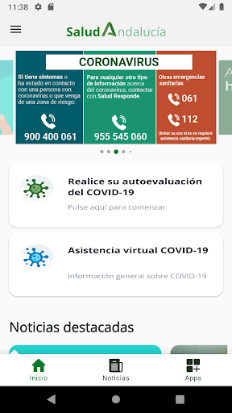  | 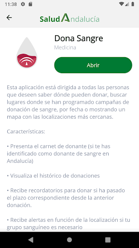  | 
 | 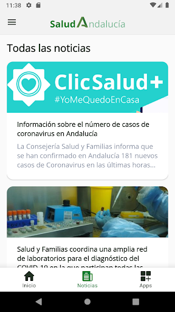  | 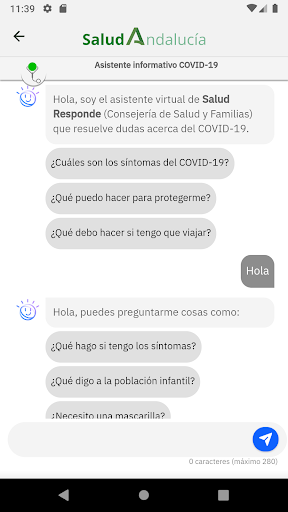 

## Development team
In the following we report the main information provided by the development team in the Google play store.

| | |
|-------------------------|-------------------------|
| **Developer**  | Sistema Sanitario Público de Andalucía |
| **Website**  | - |
| **Email** | msspa.sc.sspa@juntadeandalucia.es |
| **Physical address**  | - |
| **Other developed apps**  | [https://play.google.com/store/apps/developer?id=Sistema+Sanitario+P%C3%BAblico+de+Andaluc%C3%ADa](https://play.google.com/store/apps/developer?id=Sistema+Sanitario+P%C3%BAblico+de+Andaluc%C3%ADa) |

## Android support

| | |
|-------------------------|-------------------------|
| **Declared target Android version**  | Android10, version 10 (API level 29) |
| **Effective target Android version**  | Android10, version 10 (API level 29) |
| **Minimum supported Android version**  | Lollipop, version 5.0 (API level 21) |
| **Maximum target Android version**  | - |

The larger the difference between the minimum and maximum supported Android versions, the better. A larger difference means a wider audience. For example, old phones have a very low Android version, so a high minimum supported Android version means that the app cannot be used by users with old phones, thus leading to accessibility problems. 

## Requested permissions

In the following we report the complete list of the permissions requested by the app. 

| **Permission** | **Protection level** | **Description** | 
|-------------------------|-------------------------|-------------------------|
 **android.permission ACCESS_NETWORK_STATE** | Normal | Allows applications to access information about networks. 
 **android.permission FOREGROUND_SERVICE** | Normal | Allows a regular application to use Service.startForeground. 
 **android.permission INTERNET** | Normal | Allows applications to open network sockets. 
 **android.permission RECEIVE_BOOT_COMPLETED** | Normal | Allows an application to receive the Intent.ACTION_BOOT_COMPLETED that is broadcast after the system finishes booting. 
 **android.permission REQUEST_IGNORE_BATTERY_OPTIMIZATIONS** | Normal | Permission an application must hold in order to use Settings.ACTION_REQUEST_IGNORE_BATTERY_OPTIMIZATIONS. 
 **android.permission USE_BIOMETRIC** | Normal | Allows an app to use device supported biometric modalities. 
 **android.permission USE_FINGERPRINT** | Normal | This constant was deprecated in API level 28. Applications should request USE_BIOMETRIC instead 
 **android.permission WAKE_LOCK** | Normal | Allows using PowerManager WakeLocks to keep processor from sleeping or screen from dimming. 
 **com.google.android.c2dm.permission RECEIVE** | - | - 

## Mentioned servers

| **Server** | **Registrant** | **Registrant country** | **Creation date** | 
|-------------------------|-------------------------|-------------------------|-------------------------|
 | google.com | Google LLC | :us: US | 1997-09-15 04:00:00 |
 | googleapis.com | Google LLC | :us: US | 2005-01-25 17:52:26 |

## Security analysis 

Below we report the main security warnings raised by our execution of the [Androwarn](https://github.com/maaaaz/androwarn) security analysis tool.

**Connection interfaces exfiltration**
> - This application reads details about the currently active data network 
> - This application tries to find out if the currently active data network is metered 

**Suspicious connection establishment**
> - This application opens a Socket and connects it to the remote address ' returned no addresses for  ; port is out of range' on the 'N/A' port  
> - This application opens a Socket and connects it to the remote address '' on the 'N/A' port  
> - This application opens a Socket and connects it to the remote address 'Ljava/lang/StringBuilder;->toString()Ljava/lang/String;' on the 'N/A' port  
> - This application opens a Socket and connects it to the remote address 'Ljava/net/Proxy;->type()Ljava/net/Proxy$Type;' on the 'N/A' port  
> - This application opens a Socket and connects it to the remote address 'timeout' on the 'N/A' port  

## User ratings and reviews

Below we provide information about how end users are reacting to the app in terms of ratings and reviews in the Google Play store.

### Ratings

The Salud Andalucía app has been installed by more than **10000** times. At this time, **52** rated the app and its average score is **2.8653846**. Below we show the distribution of the ratings across the usual star-based rating of Google Play

:star::star::star::star::star:: 20

:star::star::star::star:: 2

:star::star::star:: 3

:star::star:: 5

:star:: 22

### Reviews 

#### 5-star reviews

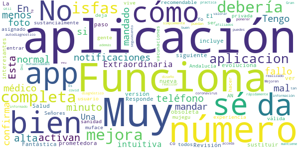

> Esta bien funciona  :date: __2020-12-03 11:13:29__

> Funciona bien  :date: __2020-11-21 00:04:00__

> En menos de un minuto das de alta el teléfono y ya se activan las notificaciones en la app. Funciona normal, no da fallo.  :date: __2020-10-29 10:15:15__

> Muy mal. Tengo que mandar una foto al médico y no sé cómo. No sé si la ha mandado o no, no me lo confirma  :date: __2020-08-27 14:24:26__

> Extraordinaria. Muy intuitiva y completa.  :date: __2020-06-17 13:30:37__

> Una aplicación prometedora. A ver cómo evoluciona. Revisión. La nueva versión incluye mejoras muy interesantes. El siguiente paso debería sustituir la obsoleta Salud Responde.  :date: __2020-06-14 13:49:06__

> Fantástica app , mejora sustancialmente la experiencia de usuario. Muy recomendable  :date: __2020-06-14 13:45:33__

> Señores en Andalucía vive gente que está en la sanidad privada o en isfas, muface, mujegu... Y la aplicacion... Debería ser válida para todos.... Yo soy de isfas tengo asignado un número de AN para las vacunaciones y co ese número, no me deja entrar la aplicación para hacer el autodiagnostico del covid. Mejoren la aplicación para que se puedan ponerer los números de afiliados a mutualidades., o simplemente que se acceda con el Dni.  :date: __2020-05-17 05:03:51__

> Aplicacion practica y útil además de un buen diseño. Te mantiene informado y a la vez puedes realizar un diagnóstico con seguimiento.  :date: __2020-04-10 22:20:55__

> Gran aplicación con información muy completa sobre el coronavirus. Es de valorar que se haya realizado tan rápidamente  :date: __2020-04-07 22:44:28__

#### 4-star reviews

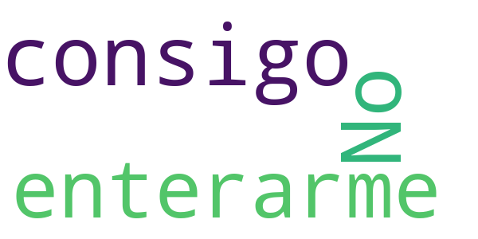

> No consigo enterarme  :date: __2020-11-27 13:53:31__

#### 3-star reviews

> Poned modo oscuro y subiré las estrellas  :date: __2020-06-19 10:17:54__

#### 2-star reviews

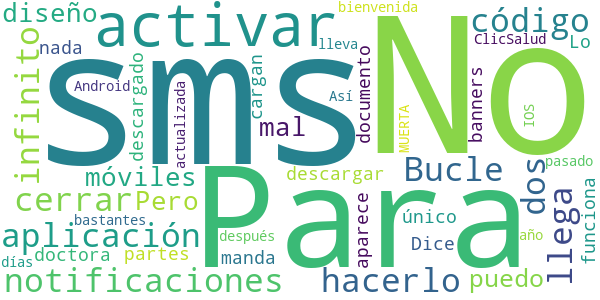

> Para activar notificaciones por sms tienes que cerrar la aplicación cuando te llega el sms del código... Bucle infinito o hacerlo con dos móviles... Pero mal diseño  :date: __2020-10-29 15:13:10__

> No puedo descargar los partes que me manda mi doctora. Dice documento descargado pero nada, no aparece nada  :date: __2020-09-08 08:54:21__

> No se cargan los banners. Lo único que funciona es la bienvenida, después MUERTA. Así lleva bastantes días, tanto en IOS como en Android.  :date: __2020-07-23 15:41:29__

> ClicSalud no esta actualizada desde el año pasado  :date: __2020-06-23 09:00:52__

#### 1-star reviews

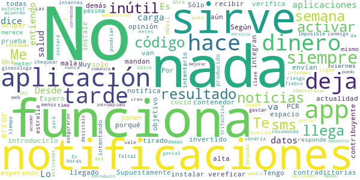

> Supuestamente te llega un sms para vereficar y no llega nada. Muy mala  :date: __2020-12-19 19:59:34__

> Me instale está aplicación por recibir notificaciones por la prueba de covid. Tengo el alta desde hace una semana y aún no me ha llegado ni por la app no por sms el resultado. Según mi opinión es inútil porque las noticias que ponen son contradictorias a la actualidad. Por lo tanto esta app solo sirve para ocupar espacio. Espero que el dinero que se ha invertido en ella no sea del contribuyente porque es dinero tirado.  :date: __2020-12-04 23:31:45__

> Te envían un código que no funciona al introducirlo en la aplicación.  :date: __2020-11-19 16:38:24__

> No te deja activar las notificaciones. Te mandan un Código y ya no te deja verifica  :date: __2020-11-19 14:52:08__

> No van las notificaciones...no sirve para nada  :date: __2020-11-05 06:04:25__

> No me notifica de nada. Una semana esperando resultado de PCR y nada. Sólo es un contenedor para instalar otras aplicaciones. No entiendo el objetivo de esta app  :date: __2020-10-30 09:29:46__

> No entiendo porqué no integran esta app y todas las demás con la de salud responde.  :date: __2020-10-29 20:19:28__

> No funciona,  :date: __2020-10-29 09:44:16__

> No carga nada, ni me deja meter el móvil ni carga las aplicaciones  :date: __2020-10-28 20:30:18__

> Es pésima desde el viernes por la tarde intentando activar las notificaciones y siempre lo mismo, se ha producido un error vuelva a intentarlo más tarde. No se merece ni una estrella.  :date: __2020-10-25 08:13:59__

# DKV Quiero cuidarme Más
App version ``2.2.2``

Analyzed with [covid-apps-observer](http://github.com/covid-apps-observer) project, version ``0.1``

## App overview
| | |
|-------------------------|-------------------------| 
| **Name**&nbsp;&nbsp;&nbsp;&nbsp;&nbsp;&nbsp;&nbsp;&nbsp;&nbsp;&nbsp;&nbsp;&nbsp;&nbsp;&nbsp;&nbsp;&nbsp;&nbsp;&nbsp;&nbsp;&nbsp;&nbsp;&nbsp;&nbsp;&nbsp;&nbsp;&nbsp;&nbsp;&nbsp;&nbsp;&nbsp;&nbsp;&nbsp;&nbsp;&nbsp;&nbsp;&nbsp;&nbsp;&nbsp;&nbsp;&nbsp;  | DKV Quiero cuidarme Más |
| **Unique identifier** | com.dkvservicios.quierocuidarmemas |
| **Link to Google Play** | [https://play.google.com/store/apps/details?id=com.dkvservicios.quierocuidarmemas](https://play.google.com/store/apps/details?id=com.dkvservicios.quierocuidarmemas) |
| **Summary**  | Consulta con especialistas, comadrona y cita online. Ahora con Digital Doctor. |
| **Privacy policy** | [http://quierocuidarmemas.dkvsalud.es/AvisoLegal/AvisoLegal.aspx](http://quierocuidarmemas.dkvsalud.es/AvisoLegal/AvisoLegal.aspx) |
| **Latest version** | 2.2.2 |
| **Last update** | 2020-12-01 08:30:07 |
| **Recent changes** | En esta versión de Quiero cuidarme Más podrás visualizar, editar y seleccionar tus familiares para utilizar los servicios para ellos desde la parte superior de la pantalla principal, donde también encontrarás la sección de ayuda y configuración. Hemos aplicado diversas mejoras de rendimiento y estabilidad para que tengas una mejor experiencia. |
| **Installs**  | 100.000+ |
| **Category** | Salud y bienestar |
| **First release** | 19 nov 2018 |
| **Size**  | 104M |
| **Supported Android version**  | 5.0 y versiones posteriores |

### Description
> Quiero cuidarme Más te permite mantenerte al día de tu salud, resolver tus dudas con profesionales y acceder a consejos adaptados a ti.
 ¿Estás en el médico y quieres enseñarle tu última analítica o informe? ¿quieres pedir cita en un Espacio de salud DKV desde tu móvil? Desde la app Quiero cuidarme Más puedes hacerlo. ¡Anímate a descubrirla!
 Estos son las funcionalidades a las que puedes acceder desde Quiero cuidarme Más:
 •	Chat médico gratis con médicos voluntarios, con el objetivo de descongestionar el sistema de salud durante la crisis sanitaria actual.
 •	Mi diario, el resumen de tu actividad reciente y la información más relevante de tus gestiones de salud.
 •	Índice de vida saludable, un valor del 0 al 1000 que te permite saber si vas por buen camino en la adopción de un estilo de vida saludable.
 •	Indicadores de salud, la gestión de múltiples parámetros de tu salud, como la actividad física, el peso, la presión arterial, entre otro.
 •	Conexión con las plataformas Apple Health, Google Fit, Garmin y Fitbit.
 •	Contenido de salud y bienestar para que estés al día de las últimas tendencias y temas de interés.
 Además, por ser cliente de DKV también tienes acceso a:
 •	DKV Club Salud y Bienestar, donde disfrutarás de descuentos, sorteos y promociones en servicios y productos de salud y bienestar. Desde Quiero cuidarme Más puedes visualizar ofertas y las reservas que hayas realizado.
 Si tienes póliza de salud, DKV Selección o DKV Famedic Profesional, también puedes acceder a:
 •	Digital Doctor, comprueba tus síntomas y consulta online con medicina general y diferentes especialidades por video, chat y voz; para ti y tus familiares incluidos.
 •	Carpeta de salud, donde podrás almacenar y consultar tus documentos de salud, como análisis clínicos o informes médicos.
 •	Receta electrónica, que recibirás en tu carpeta de salud con todo lo que te haya recetado un médico en Quiero cuidarme Más.
 •	Solicitud de pruebas médicas, para análisis y pruebas de imagen que indique el profesional y que podrás visualizar y mostrar desde tu teléfono.
 •	Familiares, para poder gestionar tus familiares incluidos en póliza, menores de edad o autorizados, y usar los servicios disponibles para ellos.
 Y en exclusiva para los clientes de salud:
 •	Cuadro médico con posibilidad de pedir cita online en los centros integrados y consulta virtual en aquellos que la ofrezcan.
 •	Coach, un asesor personal con el que podrás hablar a través de chat para que te ayude a llevar hábitos de vida saludables, como dejar de fumar, bajar de peso o mejorar tu actividad física.
 •	Comadrona digital, que te asesorará por chat sobre tu salud y la de tu bebé durante el postparto. 
 •	Tarjeta digital, ya no necesitarás llevar contigo la tarjeta Medicard física porque desde Quiero cuidarme Más la tendrás en tu móvil.
 •	Información sobre el servicio de segunda opinión médica.
 Quiero cuidarme Más es gestionada por DKV Servicios SA, entidad que tiene encomendada la prestación y desarrollo de servicios de salud digital para los asegurados de DKV Seguros y Reaseguros SAE.
 Te recordamos que nos tomamos muy en serio la privacidad y por eso tus datos se tratan de forma segura cumpliendo con la legislación vigente.
 Si tienes dudas puedes contactarnos en soporte@dkvservicios.com

### User interface
The developers of the app provide the following screenshots in the Google play store.
| | | |
|:-------------------------:|:-------------------------:|:-------------------------:|
 |   | 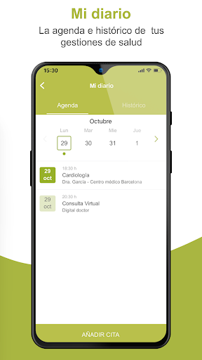  | 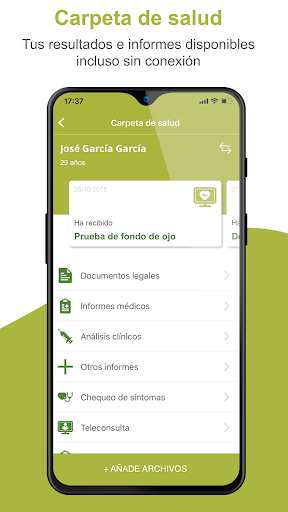  | 
 | 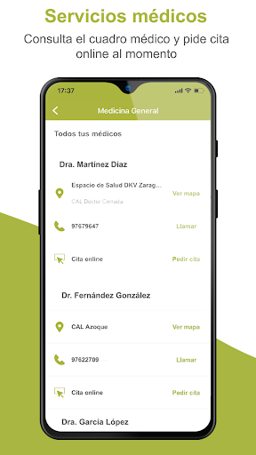  | 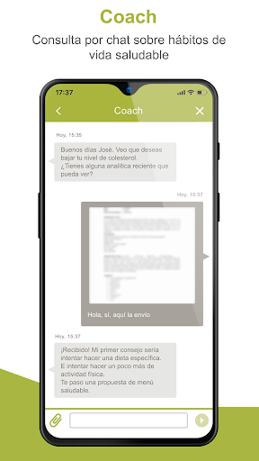  | 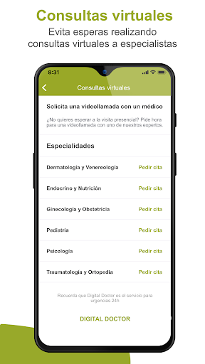  | 
 | 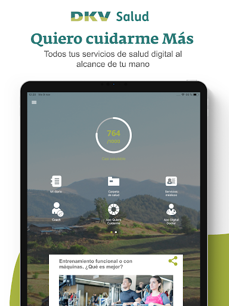  |   |   | 
 |   | 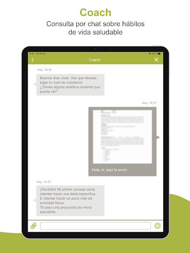  |   | 
 |   |   | 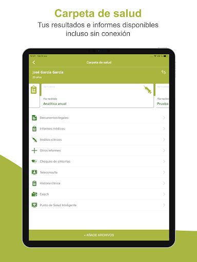  | 
 |   |   |   | 

## Development team
In the following we report the main information provided by the development team in the Google play store.

| | |
|-------------------------|-------------------------|
| **Developer**  | DKV Servicios |
| **Website**  | [https://dkvseguros.es](https://dkvseguros.es) |
| **Email** | aplicaciones@dkvservicios.com |
| **Physical address**  | [TORRE DKV, AVDA. MARIA ZAMBRANO, 31 CP: 50.018 ZARAGOZA.](https://www.google.com/maps/search/TORRE%20DKV,%20AVDA.%20MARIA%20ZAMBRANO,%2031%20CP:%2050.018%20ZARAGOZA.) (Google Maps) |
| **Other developed apps**  | [https://play.google.com/store/apps/developer?id=DKV+Servicios](https://play.google.com/store/apps/developer?id=DKV+Servicios) |

## Android support

| | |
|-------------------------|-------------------------|
| **Declared target Android version**  | Android10, version 10 (API level 29) |
| **Effective target Android version**  | Android10, version 10 (API level 29) |
| **Minimum supported Android version**  | Lollipop, version 5.0 (API level 21) |
| **Maximum target Android version**  | - |

The larger the difference between the minimum and maximum supported Android versions, the better. A larger difference means a wider audience. For example, old phones have a very low Android version, so a high minimum supported Android version means that the app cannot be used by users with old phones, thus leading to accessibility problems. 

## Requested permissions

In the following we report the complete list of the permissions requested by the app. 

| **Permission** | **Protection level** | **Description** | 
|-------------------------|-------------------------|-------------------------|
 **android.permission ACCESS_COARSE_LOCATION** | :warning:**Dangerous** | Allows an app to access approximate location. 
 **android.permission ACCESS_FINE_LOCATION** | :warning:**Dangerous** | Allows an app to access precise location. 
 **android.permission ACCESS_NETWORK_STATE** | Normal | Allows applications to access information about networks. 
 **android.permission ACCESS_WIFI_STATE** | Normal | Allows applications to access information about Wi-Fi networks. 
 **android.permission BLUETOOTH** | Normal | Allows applications to connect to paired bluetooth devices. 
 **android.permission CAMERA** | :warning:**Dangerous** | Required to be able to access the camera device. 
 **android.permission DISABLE_KEYGUARD** | Normal | Allows applications to disable the keyguard if it is not secure. 
 **android.permission INTERNET** | Normal | Allows applications to open network sockets. 
 **android.permission MODIFY_AUDIO_SETTINGS** | Normal | Allows an application to modify global audio settings. 
 **android.permission READ_APP_BADGE** | - | - 
 **android.permission READ_EXTERNAL_STORAGE** | :warning:**Dangerous** | Allows an application to read from external storage. 
 **android.permission READ_PHONE_STATE** | :warning:**Dangerous** | Allows read only access to phone state, including the phone number of the device, current cellular network information, the status of any ongoing calls, and a list of any PhoneAccounts registered on the device. 
 **android.permission RECORD_AUDIO** | :warning:**Dangerous** | Allows an application to record audio. 
 **android.permission USE_FINGERPRINT** | Normal | This constant was deprecated in API level 28. Applications should request USE_BIOMETRIC instead 
 **android.permission WAKE_LOCK** | Normal | Allows using PowerManager WakeLocks to keep processor from sleeping or screen from dimming. 
 **android.permission WRITE_EXTERNAL_STORAGE** | :warning:**Dangerous** | Allows an application to write to external storage. 
 **com.anddoes.launcher.permission UPDATE_COUNT** | - | - 
 **com.google.android.c2dm.permission RECEIVE** | - | - 
 **com.google.android.finsky.permission BIND_GET_INSTALL_REFERRER_SERVICE** | - | - 
 **com.htc.launcher.permission READ_SETTINGS** | - | - 
 **com.htc.launcher.permission UPDATE_SHORTCUT** | - | - 
 **com.huawei.android.launcher.permission CHANGE_BADGE** | - | - 
 **com.huawei.android.launcher.permission READ_SETTINGS** | - | - 
 **com.huawei.android.launcher.permission WRITE_SETTINGS** | - | - 
 **com.majeur.launcher.permission UPDATE_BADGE** | - | - 
 **com.oppo.launcher.permission READ_SETTINGS** | - | - 
 **com.oppo.launcher.permission WRITE_SETTINGS** | - | - 
 **com.sec.android.provider.badge.permission READ** | - | - 
 **com.sec.android.provider.badge.permission WRITE** | - | - 
 **com.sonyericsson.home.permission BROADCAST_BADGE** | - | - 
 **com.sonymobile.home.permission PROVIDER_INSERT_BADGE** | - | - 
 **me.everything.badger.permission BADGE_COUNT_READ** | - | - 
 **me.everything.badger.permission BADGE_COUNT_WRITE** | - | - 

## Mentioned servers

| **Server** | **Registrant** | **Registrant country** | **Creation date** | 
|-------------------------|-------------------------|-------------------------|-------------------------|
 | w3.org | W3C | :us: US | 1994-07-06 04:00:00 |
 | xml.org | OASIS Open | :us: US | 1997-02-03 05:00:00 |
 | xmlpull.org | WhoisGuard, Inc. | PA | 2001-11-26 20:33:08 |
 | dkvservicios.com | GDPR Masked | :es: ES | 2004-09-27 10:49:30 |
 | dkvseguros.com | GDPR Masked | :es: ES | 2000-10-23 14:38:48 |
 | android.com | Google LLC | :us: US | 1997-06-23 04:00:00 |
 | googlesyndication.com | Google LLC | :us: US | 2003-01-21 06:17:24 |
 | google.com | Google LLC | :us: US | 1997-09-15 04:00:00 |
 | getpostman.com | Whois Privacy Service | :us: US | 2012-05-24 20:56:32 |
 | googleapis.com | Google LLC | :us: US | 2005-01-25 17:52:26 |
 | google-analytics.com | Google LLC | :us: US | 2005-07-18 19:24:32 |
 | app-measurement.com | Google LLC | :us: US | 2015-06-19 20:13:31 |
 | mediktor.com | REDACTED FOR PRIVACY | :es: ES | 2011-04-30 20:55:09 |
 | gstatic.com | Google LLC | :us: US | 2008-02-11 15:31:25 |
 | crashlytics.com | Google LLC | :us: US | 2011-01-21 15:30:40 |

## Security analysis 

Below we report the main security warnings raised by our execution of the [Androwarn](https://github.com/maaaaz/androwarn) security analysis tool.

**Telephony identifiers leakage**
> - This application reads the numeric name (MCC+MNC) of current registered operator 
> - This application reads the operator name 

**Connection interfaces exfiltration**
> - This application reads details about the currently active data network 

**Telephony services abuse**
> - This application makes phone calls 

**Audio video eavesdropping**
> - This application records audio from the 'MIC' source  

**Suspicious connection establishment**
> - This application opens a Socket and connects it to the remote address '' on the 'N/A' port  
> - This application opens a Socket and connects it to the remote address 'Ljava/lang/StringBuilder;->toString()Ljava/lang/String;' on the 'N/A' port  
> - This application opens a Socket and connects it to the remote address 'Ljava/net/Proxy;->type()Ljava/net/Proxy$Type;' on the 'N/A' port  
> - This application opens a Socket and connects it to the remote address 'timeout' on the 'N/A' port  

**Pim data leakage**
> - This application accesses the downloads folder 

**Code execution**
> - This application loads a native library 
> - This application loads a native library: 'c++_shared' 
> - This application loads a native library: 'gpuimage-library' 
> - This application loads a native library: 'jniPdfium' 
> - This application loads a native library: 'modft2' 
> - This application loads a native library: 'modpdfium' 
> - This application loads a native library: 'modpng' 
> - This application loads a native library: 'pl_droidsonroids_gif' 
> - This application executes a UNIX command 
> - This application executes a UNIX command containing this argument: 'Ljava/lang/StringBuilder;->toString()Ljava/lang/String;' 

## User ratings and reviews

Below we provide information about how end users are reacting to the app in terms of ratings and reviews in the Google Play store.

### Ratings

The DKV Quiero cuidarme Más app has been installed by more than **100000** times. At this time, **488** rated the app and its average score is **2.821782**. Below we show the distribution of the ratings across the usual star-based rating of Google Play

:star::star::star::star::star:: 164

:star::star::star::star:: 63

:star::star::star:: 9

:star::star:: 24

:star:: 228

### Reviews 

#### 5-star reviews

> Muy buena  :date: __2020-12-19 23:20:17__

> Muy bueno  :date: __2020-12-09 17:42:38__

> Para mi criterio,está formidable  :date: __2020-12-08 18:02:44__

> Muy buena  :date: __2020-12-02 10:44:59__

> Ha dejado de funcionar de repente. No me permite entrar. Edito: El problema se ha resuelto con la actualización e incluso me han llamado para notificarmelo.  :date: __2020-11-30 19:39:46__

> Una App que integra todo lo necesario para tu salud y el bienestar de los asegurados. Me parece un gran acierto y aporta cercanía con los profesionales de la medicina y acceso rápido a datos, citas y consultas. Un gran éxito. Enhorabuena!!  :date: __2020-11-26 13:28:38__

> Excelente compañía hasta hoy no e visto mejor compañía que la dkv muy contento estoy  :date: __2020-11-20 07:00:20__

> Muy recomendable  :date: __2020-11-18 09:05:26__

> Muy útil  :date: __2020-11-17 18:13:57__

> Aplicación espectacular con multitud de servicios de salud para poder utilizar y de uso muy sencillo. 100%100 recomendable!!  :date: __2020-11-12 10:55:33__

#### 4-star reviews

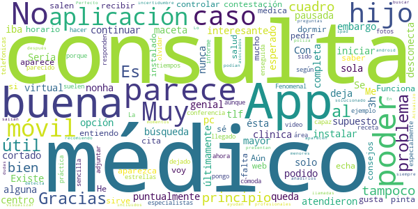

> Muy buena, me atendieron puntualmente en el caso de mi hijo  :date: __2020-12-17 16:50:03__

> ¿Existe alguna aplicación para instalar en el pc?. Con ésta no me deja, solo en el tlf móvil. Gracias.  :date: __2020-12-05 13:57:10__

> Se queda pausada, no hay maceta de iniciar  :date: __2020-11-26 07:00:53__

> Sería interesante la búsqueda también por centro médico o clinica  :date: __2020-11-18 10:52:25__

> Me parece muy útil la opción de consulta virtual, sin embargo de ha cortado, pero nonha supuesto un problema mayor, ya que se ha podido continuar con la consulta  :date: __2020-11-03 13:16:20__

> Es muy completa,al principio me iba genial, pero últimamente no se ... pero se me desconecta sola y nunca había esperado 3h*; para contestación .. Y me voy a dormir 😴  :date: __2020-09-29 04:10:43__

> Aún no la entiendo mucho, pero me gusta poder controlar mi salud y recibir consejos  :date: __2020-09-14 14:32:21__

> Funciona bien, pero se echa mucho en falta que en el cuadro médico aparezca el horario de los médicos. No sé porque en la web si aparece y en la App no salen.  :date: __2020-09-05 09:24:16__

> He instalado la app y tiene buena pinta pero no sirve para pedir cita médica o saber los especialistas de mi área por ejemplo?  :date: __2020-09-04 10:34:08__

> Fenomenal; La consulta por video conferencia me ha parecido muy práctica, cómoda y útil, especialmente en estos tiempos. (No pongo 5 estrellas porque no he sido capaz de adjuntar fotos en la App y porque, según parece, tampoco ha dejado hacer la receta, aunque sí me ha llegado el informe)  :date: __2020-08-10 17:26:36__

#### 3-star reviews

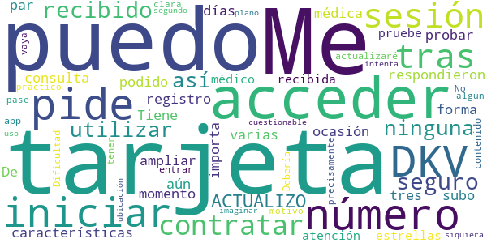

> Me pide el número de tarjeta DKV para iniciar sesión, pero tras un mes de contratar el seguro, yo no he recibido ninguna tarjeta, así que no la puedo utilizar. ACTUALIZO: me respondieron en un par de días y, al ampliar la forma de registro, ya he podido acceder. Tiene varias características, pero aún no he tenido ocasión de probar la que más importa: la consulta médica. De momento, subo a tres estrellas por la atención recibida, y cuando pruebe el médico actualizaré.  :date: __2020-12-02 17:50:18__

> Dificultad para entrar en la app Debería tener más contenido práctico  :date: __2020-10-05 12:16:30__

> No es muy clara, precisamente, pero eso vaya y pase... por algún motivo que no puedo siquiera imaginar, intenta acceder a la ubicación en segundo plano cuando no está en uso, lo cual es ya cuestionable.  :date: __2020-09-01 12:21:44__

#### 2-star reviews

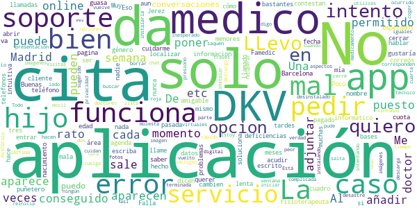

> Da bastantes problemas  :date: __2020-12-09 17:07:21__

> LLevo como 10 llamadas,no solo para la app quiero cuidarme mucho que no hace nada de lo que dicen en la informacion,en mi área cliente cuando intento abrir cuadro medico me da solo la opcion de fisioterapeuta ¡¡¡¡¡,en la pagina DKV Famedic,aun no he conseguido entrar y ya he pagado 2 meses de cuota y he puesto a soporte 3 correos y he llamado a 3/4 telefonos y nadie me soluciona nada,Madrid,Jerez,Barcelona etc etc.....muchas deficiencias en el soporte informatico,empezamos mal si no puedes localizar ya el medico al que acudir......  :date: __2020-12-08 14:29:12__

> Muy mala app poco amigable  :date: __2020-11-23 09:59:56__

> Buenas tardes, me gustaría saber cómo añadir hijos menores de edad  :date: __2020-11-03 19:16:06__

> Falla, no ser puede cerrar  :date: __2020-10-26 20:54:24__

> La agenda no va. Solo me ha permitido poner una cita mía. Al querer poner una de mi hijo da error 7110 todo el rato, que escriba a soporte dkv (al que ya he escrito la semana pasada y no me han hecho ni puñetero caso) o que llame a un teléfono que nunca contestan. Una guasa. Eso por no hablar de que llevo tres semanas para que me cambien en sus bases de datos el nombre, el género y la fecha de nacimiento, que están mal, y el mismo caso que antes . De momento, muy mal con DKV.  :date: __2020-10-26 18:03:10__

> No funciona bien la aplicación  :date: __2020-10-17 10:09:06__

> Poco intuitiva, lenta, los aspectos que cuidan tu privacidad hacen que sea muy complicada de usar  :date: __2020-09-23 19:28:24__

> A mi no me aparece la opcion Servicios Medicos. Me aparecen dos opciones iguales, chat medicos. La he desinstalado y vuelto a instalar y las imagenes que aparecen de presentacion de la app no se corresponden con lo que me sale en mi movil.  :date: __2020-09-22 09:47:41__

> La verdad es que no me ha permitido adjuntar imagen (fotos) con los síntomas, puesto que da un error y se cuelga la aplicación. Una lástima.  :date: __2020-09-11 13:42:23__

#### 1-star reviews

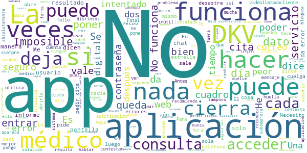

> Es Domingo y no puedo contactar ni con atención al cliente por teléfono ni contactar con un médico a través de la app. Da error número 6000 todo el rato. Lamentable.  :date: __2020-12-20 15:58:42__

> No me deja iniciar sesión, se cierra antes de ejecutarse.  :date: __2020-12-15 12:54:30__

> No funciona!!  :date: __2020-12-15 03:25:57__

> Nada , basura , entras a la app y al rato te saca y vuelta a empezar .  :date: __2020-12-14 13:34:39__

> Fatal  :date: __2020-12-07 13:20:51__

> No me deja entrar en la aplicación me dice que mi móvil está rooteado... Y no lo está.  :date: __2020-12-04 14:49:24__

> No puedo entrar ya que me dice que no tengo habilitado java srcipt, entro en mi navegador y sí está habilitado. No encuentro la solución  :date: __2020-12-04 08:57:01__

> Pésima. No funciona casi nada.  :date: __2020-12-02 08:16:08__

> Vaya cuadro de aplicación. Se cierra sola cada vez que intentas abrirla. Imposible dd usar. Cuadro de aplicación y aún peor servicio de seguro médico!  :date: __2020-11-30 06:47:02__

> Es un auténtico desastre no hay forma de conectarse, muy complicada la aplicación,te pide muchos datos para entrar.La dejé por imposible incluso después de hablar con un técnico.  :date: __2020-11-27 21:47:22__

# Interactive Clinics
App version ``1.2.4``

Analyzed with [covid-apps-observer](http://github.com/covid-apps-observer) project, version ``0.1``

## App overview
| | |
|-------------------------|-------------------------| 
| **Name**&nbsp;&nbsp;&nbsp;&nbsp;&nbsp;&nbsp;&nbsp;&nbsp;&nbsp;&nbsp;&nbsp;&nbsp;&nbsp;&nbsp;&nbsp;&nbsp;&nbsp;&nbsp;&nbsp;&nbsp;&nbsp;&nbsp;&nbsp;&nbsp;&nbsp;&nbsp;&nbsp;&nbsp;&nbsp;&nbsp;&nbsp;&nbsp;&nbsp;&nbsp;&nbsp;&nbsp;&nbsp;&nbsp;&nbsp;&nbsp;  | Interactive Clinics |
| **Unique identifier** | com.appfeel.interactiveclinics.dev |
| **Link to Google Play** | [https://play.google.com/store/apps/details?id=com.appfeel.interactiveclinics.dev](https://play.google.com/store/apps/details?id=com.appfeel.interactiveclinics.dev) |
| **Summary**  | App eHealth: cuestionario COVID-19, asistencia voip, adherencia a la medicación |
| **Privacy policy** | [http://interactiveclinics.com/#/privacy](http://interactiveclinics.com/#/privacy) |
| **Latest version** | 1.2.4 |
| **Last update** | 2020-05-22 04:27:13 |
| **Recent changes** | Módulo COVID-19 (Coronavirus) los profesionales de la salud pueden ver los resultados de las evaluaciones COVID-19 en tiempo real e iniciar una videollamada con los pacientes  Desarrollado en colaboración con médicos, investigadores y académicos internacionales de alto nivel. Refleja los requisitos de diagnóstico descritos por la OMS.  Se puede conectar por Bluetooth con un termómetro, un tensiómetro o un oxímetro.  Hemos añadido el módulo de hidratación corporal. |
| **Installs**  | 100+ |
| **Category** | Salud y bienestar |
| **First release** | 7 jun. 2018 |
| **Size**  | 12M |
| **Supported Android version**  | 6.0 y versiones posteriores |

### Description
> La aplicación "Interactive Clinics" permite realizar el seguimiento de varias métricas y datos de salud a través de un teléfono móvil inteligente o una tableta.
 <b>FUNCIONALIDADES</b>
 	• COVID-19 (Coronavirus): Seguimiento de la evolución de la enfermedad
 	• Nivel de dolor: La primera aplicación validada científicamente en la prestigiosa revista JMIR con un factor de impacto de 4.95 sobre 5
 	• Adherencia a la medicación: Seguimiento y alertas de toma de medicamentos
 	• Nivel de actividad física: Seguimiento de las métricas a través de la conexión con dispositivos SmartWatch (Android o iOS)
 Sus datos NO se comparten con terceros no autorizados. Nadie más que los que usted indique tendrán acceso a sus datos.
 <b>MÓDULO COVID-19</b>
 	• Seguimiento de la temperatura del paciente, cuestionario de preguntas para realizar un seguimiento de la evolución de la enfermedad como por ejemplo problemas respiratorios, nivel de dolor torácico, abdominal, entre otros. El módulo se ha desarrollado en colaboración con médicos, investigadores y académicos internacionales de alto nivel. Refleja los requisitos de diagnóstico descritos por la OMS (Organización Mundial de la Salud): https://www.who.int/news-room/q-a-detail/q-a-coronaviruses#:~:text=symptoms
 	• Enlace con los centros médicos vinculados para compartir los datos del seguimiento de la enfermedad.
 	• Teleconferencia de alta calidad con los profesionales de la salud vinculados.
 	• Mapa de los diferentes centros médicos vinculados a Interactive Clinics y mapa de calor de la tasa de casos de COVID-19.
 <b>MÓDULO DE NIVEL DE DOLOR</b>
 Esta es la primera aplicación validada científicamente y que ha publicado los resultados de la validación en la prestigiosa revista científica JMIR, número 1 en la categoría de "digital health", con un factor de impacto de 4,945 sobre 5. Más información: https://www.jmir.org/2020/2/e13468/
 Nuestro equipo ha desarrollado una versión moderna de la Visual Analogue Scala (pVAS) (https://en.wikipedia.org/wiki/Visual_analogue_scale), denominada Electronic Visual Analogue Scale (eVAS). La aplicación permite al usuario registrar el nivel de dolor a través de su dispositivo.
 <b>MÓDULO DE ACTIVIDAD FÍSICA</b>
 El módulo de actividad física permite obtener las métricas calorías consumidas, minutos de ejercicio y nivel de sedentarismo. Estas métricas permiten ver la evolución de la actividad física día a día y combinadas con los datos de nivel de glucosa en sangre permiten a los especialistas hacer un seguimiento detallado de la evolución de la diabetes de tipo 2.
 Estudios recientes demuestran que la actividad física ayuda a controlar el nivel de glucosa en sangre. Junto con la dieta, el ejercicio físico es uno de los pilares fundamentales de la prevención y el tratamiento de diabetes de tipo 2. A través de esta aplicación usted podrá monitorear su nivel de actividad física y también ayudar a los profesionales de la salud en el seguimiento del tratamiento.
 <b>ATENCIÓN</b>
 	• La aplicación NO proporciona una interpretación médica de ninguno de los valores registrados a través de los diferentes módulos
 	• La aplicación NO proporciona ningún tipo de consulta directa o indirecta con médicos ni ningún consejo sanitario relacionado con la salud. Además, no proporciona ningún informe médico que pueda informar o desinformar erróneamente los usuarios en cualquier aspecto de su salud.
 	• La aplicación NO proporciona ni comparte información con ningún médico ni nadie sobre el progreso de cualquier resultado por parte del usuario. Sólo si el usuario consiente conectar la aplicación con el sitio web interactiveclinics.com, un posible entrenador personal o un profesional de la salud puede observar la información que el usuario haya decidido compartir. El entrenador personal o profesional de la salud pueden enviar al usuario un texto breve mediante una notificación con el objetivo de motivar al usuario a alcanzar los diferentes objetivos.
 Disfrute mientras cuida de su salud!

### User interface
The developers of the app provide the following screenshots in the Google play store.
| | | |
|:-------------------------:|:-------------------------:|:-------------------------:|
 |   |   |   | 
 |   |   |   | 
 |   |   |   | 
 |   |   |   | 
 |   |   |   | 
 |  

## Development team
In the following we report the main information provided by the development team in the Google play store.

| | |
|-------------------------|-------------------------|
| **Developer**  | Bit Genoma Digital Solutions SL |
| **Website**  | [https://interactiveclinics.com](https://interactiveclinics.com) |
| **Email** | hello@interactiveclinics.com |
| **Physical address**  | [Prim 26, 08911 Badalona](https://www.google.com/maps/search/Prim%2026,%2008911%20Badalona) (Google Maps) |
| **Other developed apps**  | [https://play.google.com/store/apps/developer?id=Bit+Genoma+Digital+Solutions+SL](https://play.google.com/store/apps/developer?id=Bit+Genoma+Digital+Solutions+SL) |

## Android support

| | |
|-------------------------|-------------------------|
| **Declared target Android version**  | Oreo, version 8.1.0 (API level 27) |
| **Effective target Android version**  | Oreo, version 8.1.0 (API level 27) |
| **Minimum supported Android version**  | KitKat, version 4.4 - 4.4.4 (API level 19) |
| **Maximum target Android version**  | - |

The larger the difference between the minimum and maximum supported Android versions, the better. A larger difference means a wider audience. For example, old phones have a very low Android version, so a high minimum supported Android version means that the app cannot be used by users with old phones, thus leading to accessibility problems. 

## Requested permissions

In the following we report the complete list of the permissions requested by the app. 

| **Permission** | **Protection level** | **Description** | 
|-------------------------|-------------------------|-------------------------|
 **android.permission ACCESS_NETWORK_STATE** | Normal | Allows applications to access information about networks. 
 **android.permission INTERNET** | Normal | Allows applications to open network sockets. 
 **android.permission MODIFY_AUDIO_SETTINGS** | Normal | Allows an application to modify global audio settings. 
 **android.permission READ_APP_BADGE** | - | - 
 **android.permission READ_PHONE_STATE** | :warning:**Dangerous** | Allows read only access to phone state, including the phone number of the device, current cellular network information, the status of any ongoing calls, and a list of any PhoneAccounts registered on the device. 
 **android.permission RECORD_AUDIO** | :warning:**Dangerous** | Allows an application to record audio. 
 **android.permission VIBRATE** | Normal | Allows access to the vibrator. 
 **android.permission WAKE_LOCK** | Normal | Allows using PowerManager WakeLocks to keep processor from sleeping or screen from dimming. 
 **android.permission WRITE_EXTERNAL_STORAGE** | :warning:**Dangerous** | Allows an application to write to external storage. 
 **com.anddoes.launcher.permission UPDATE_COUNT** | - | - 
 **com.appfeel.interactiveclinics.dev.permission C2D_MESSAGE** | - | - 
 **com.google.android.c2dm.permission RECEIVE** | - | - 
 **com.htc.launcher.permission READ_SETTINGS** | - | - 
 **com.htc.launcher.permission UPDATE_SHORTCUT** | - | - 
 **com.huawei.android.launcher.permission CHANGE_BADGE** | - | - 
 **com.huawei.android.launcher.permission READ_SETTINGS** | - | - 
 **com.huawei.android.launcher.permission WRITE_SETTINGS** | - | - 
 **com.majeur.launcher.permission UPDATE_BADGE** | - | - 
 **com.oppo.launcher.permission READ_SETTINGS** | - | - 
 **com.oppo.launcher.permission WRITE_SETTINGS** | - | - 
 **com.sec.android.provider.badge.permission READ** | - | - 
 **com.sec.android.provider.badge.permission WRITE** | - | - 
 **com.sonyericsson.home.permission BROADCAST_BADGE** | - | - 
 **com.sonymobile.home.permission PROVIDER_INSERT_BADGE** | - | - 
 **me.everything.badger.permission BADGE_COUNT_READ** | - | - 
 **me.everything.badger.permission BADGE_COUNT_WRITE** | - | - 

## Mentioned servers

| **Server** | **Registrant** | **Registrant country** | **Creation date** | 
|-------------------------|-------------------------|-------------------------|-------------------------|
 | googlesyndication.com | Google LLC | :us: US | 2003-01-21 06:17:24 |
 | google.com | Google LLC | :us: US | 1997-09-15 04:00:00 |
 | app-measurement.com | Google LLC | :us: US | 2015-06-19 20:13:31 |
 | gstatic.com | Google LLC | :us: US | 2008-02-11 15:31:25 |

## Security analysis 

Below we report the main security warnings raised by our execution of the [Androwarn](https://github.com/maaaaz/androwarn) security analysis tool.

**Connection interfaces exfiltration**
> - This application reads details about the currently active data network 
> - This application tries to find out if the currently active data network is metered 

**Audio video eavesdropping**
> - This application records audio from the 'MIC' source  

**Code execution**
> - This application loads a native library: 'sqlc-native-driver' 
> - This application executes a UNIX command containing this argument: '7' 

## User ratings and reviews

Below we provide information about how end users are reacting to the app in terms of ratings and reviews in the Google Play store.

### Ratings

The Interactive Clinics app has been installed by more than **100** times. At this time, **5** rated the app and its average score is **5.0**. Below we show the distribution of the ratings across the usual star-based rating of Google Play

:star::star::star::star::star:: 5

:star::star::star::star:: 0

:star::star::star:: 0

:star::star:: 0

:star:: 0

### Reviews 

#### 5-star reviews

> Excelente aplicación para gestionar estudios de investigación a nivel de atención primaria y ensayos en los que se requiera interacción con el paciente a distancia, con toda la validez y fiabilidad. Cumple con todos los requisitos de seguridad, calidad y protección de datos. Muy recomendable  :date: __2020-05-31 12:19:59__

#### 4-star reviews

No recent reviews available with 4 stars.

#### 3-star reviews

No recent reviews available with 3 stars.

#### 2-star reviews

No recent reviews available with 2 stars.

#### 1-star reviews

No recent reviews available with 1 stars.

# Mediktor
App version ``5.7.8``

Analyzed with [covid-apps-observer](http://github.com/covid-apps-observer) project, version ``0.1``

## App overview
| | |
|-------------------------|-------------------------| 
| **Name**&nbsp;&nbsp;&nbsp;&nbsp;&nbsp;&nbsp;&nbsp;&nbsp;&nbsp;&nbsp;&nbsp;&nbsp;&nbsp;&nbsp;&nbsp;&nbsp;&nbsp;&nbsp;&nbsp;&nbsp;&nbsp;&nbsp;&nbsp;&nbsp;&nbsp;&nbsp;&nbsp;&nbsp;&nbsp;&nbsp;&nbsp;&nbsp;&nbsp;&nbsp;&nbsp;&nbsp;&nbsp;&nbsp;&nbsp;&nbsp;  | Mediktor |
| **Unique identifier** | com.teckelmedical.mediktor |
| **Link to Google Play** | [https://play.google.com/store/apps/details?id=com.teckelmedical.mediktor](https://play.google.com/store/apps/details?id=com.teckelmedical.mediktor) |
| **Summary**  | Resuelve tus dudas de salud |
| **Privacy policy** | [https://www.mediktor.com/en/legal-notice](https://www.mediktor.com/en/legal-notice) |
| **Latest version** | 5.7.8 |
| **Last update** | 2020-10-30 16:25:53 |
| **Recent changes** | Nuevo test de Coronavirus (COVID-19). Nuevo modo de interacción (Mediktor Original y Mediktor Chatbot). Corrección de errores y mejoras de rendimiento. |
| **Installs**  | 50.000+ |
| **Category** | Medicina |
| **First release** | 17 ene. 2014 |
| **Size**  | 41M |
| **Supported Android version**  | 5.0 y versiones posteriores |

### Description
> Soluciona tus dudas de salud desde el primer síntoma.
 Evalúa tus síntomas GRATIS y comparte los resultados con un especialista para tomar la mejor decisión.
 Disponible el test de CORONAVIRUS que te indicará si tienes los síntomas de la enfermedad, la posibilidad de sufrirla y una recomendación basada en la urgencia del resultado.
 El evaluador de síntomas te permite introducir cómo te sientes con tus palabras. Su inteligencia artificial escoge las preguntas que haría un profesional para obtener una lista de posibles enfermedades y una recomendación.  
 Consulta la descripción de las enfermedades en nuestro diccionario.
 Puedes chatear con un médico en tiempo real y solucionar tus dudas en cualquier momento.
 La consulta es confidencial y totalmente segura. 
 Si te encuentras mal, un especialista te recomendará la mejor opción para tu problema de salud.
 Por favor, no dudes en enviarnos tus sugerencias o comentarios: info@mediktor.com
 Especificaciones:
 - Inteligencia artificial e interpretación de lenguaje natural.
 - Plataforma de Chat segura y a tiempo real entre médico y paciente.
 - Compatible con la App Salud de Apple para la integración de las constantes vitales.
 CE - Licencia 7074-PS
 Mediktor es un dispositivo médico con licencia sanitaria. Cumple con todos los requisitos esenciales y con los procedimientos de evaluación de la conformidad que le resultan de aplicación según la AEMPS y la normativa comunitaria.

### User interface
The developers of the app provide the following screenshots in the Google play store.
| | | |
|:-------------------------:|:-------------------------:|:-------------------------:|
 |   |   |   | 
 |   |  

## Development team
In the following we report the main information provided by the development team in the Google play store.

| | |
|-------------------------|-------------------------|
| **Developer**  | Teckel Medical s.l. |
| **Website**  | [https://www.mediktor.com](https://www.mediktor.com) |
| **Email** | info@mediktor.com |
| **Physical address**  | [Sant Antoni Maria Claret 167, 08025 Barcelona Barcelona Spain](https://www.google.com/maps/search/Sant%20Antoni%20Maria%20Claret%20167,%2008025%20Barcelona%20Barcelona%20Spain) (Google Maps) |
| **Other developed apps**  | [https://play.google.com/store/apps/developer?id=8208894107756492017](https://play.google.com/store/apps/developer?id=8208894107756492017) |

## Android support

| | |
|-------------------------|-------------------------|
| **Declared target Android version**  | Android10, version 10 (API level 29) |
| **Effective target Android version**  | Android10, version 10 (API level 29) |
| **Minimum supported Android version**  | Lollipop, version 5.0 (API level 21) |
| **Maximum target Android version**  | - |

The larger the difference between the minimum and maximum supported Android versions, the better. A larger difference means a wider audience. For example, old phones have a very low Android version, so a high minimum supported Android version means that the app cannot be used by users with old phones, thus leading to accessibility problems. 

## Requested permissions

In the following we report the complete list of the permissions requested by the app. 

| **Permission** | **Protection level** | **Description** | 
|-------------------------|-------------------------|-------------------------|
 **android.permission ACCESS_COARSE_LOCATION** | :warning:**Dangerous** | Allows an app to access approximate location. 
 **android.permission ACCESS_FINE_LOCATION** | :warning:**Dangerous** | Allows an app to access precise location. 
 **android.permission ACCESS_NETWORK_STATE** | Normal | Allows applications to access information about networks. 
 **android.permission ACCESS_WIFI_STATE** | Normal | Allows applications to access information about Wi-Fi networks. 
 **android.permission AUDIO** | - | - 
 **android.permission BLUETOOTH** | Normal | Allows applications to connect to paired bluetooth devices. 
 **android.permission BLUETOOTH_ADMIN** | Normal | Allows applications to discover and pair bluetooth devices. 
 **android.permission BODY_SENSORS** | :warning:**Dangerous** | Allows an application to access data from sensors that the user uses to measure what is happening inside his/her body, such as heart rate. 
 **android.permission CALL_PHONE** | :warning:**Dangerous** | Allows an application to initiate a phone call without going through the Dialer user interface for the user to confirm the call. 
 **android.permission CAMERA** | :warning:**Dangerous** | Required to be able to access the camera device. 
 **android.permission CHANGE_WIFI_STATE** | Normal | Allows applications to change Wi-Fi connectivity state. 
 **android.permission DISABLE_KEYGUARD** | Normal | Allows applications to disable the keyguard if it is not secure. 
 **android.permission GET_ACCOUNTS** | :warning:**Dangerous** | Allows access to the list of accounts in the Accounts Service. 
 **android.permission INTERNET** | Normal | Allows applications to open network sockets. 
 **android.permission MODIFY_AUDIO_SETTINGS** | Normal | Allows an application to modify global audio settings. 
 **android.permission READ_APP_BADGE** | - | - 
 **android.permission READ_EXTERNAL_STORAGE** | :warning:**Dangerous** | Allows an application to read from external storage. 
 **android.permission READ_PHONE_STATE** | :warning:**Dangerous** | Allows read only access to phone state, including the phone number of the device, current cellular network information, the status of any ongoing calls, and a list of any PhoneAccounts registered on the device. 
 **android.permission RECORD_AUDIO** | :warning:**Dangerous** | Allows an application to record audio. 
 **android.permission VIBRATE** | Normal | Allows access to the vibrator. 
 **android.permission WAKE_LOCK** | Normal | Allows using PowerManager WakeLocks to keep processor from sleeping or screen from dimming. 
 **android.permission WRITE_EXTERNAL_STORAGE** | :warning:**Dangerous** | Allows an application to write to external storage. 
 **com.anddoes.launcher.permission UPDATE_COUNT** | - | - 
 **com.android.vending BILLING** | - | - 
 **com.google.android.c2dm.permission RECEIVE** | - | - 
 **com.htc.launcher.permission READ_SETTINGS** | - | - 
 **com.htc.launcher.permission UPDATE_SHORTCUT** | - | - 
 **com.huawei.android.launcher.permission CHANGE_BADGE** | - | - 
 **com.huawei.android.launcher.permission READ_SETTINGS** | - | - 
 **com.huawei.android.launcher.permission WRITE_SETTINGS** | - | - 
 **com.majeur.launcher.permission UPDATE_BADGE** | - | - 
 **com.oppo.launcher.permission READ_SETTINGS** | - | - 
 **com.oppo.launcher.permission WRITE_SETTINGS** | - | - 
 **com.sec.android.provider.badge.permission READ** | - | - 
 **com.sec.android.provider.badge.permission WRITE** | - | - 
 **com.sonyericsson.home.permission BROADCAST_BADGE** | - | - 
 **com.sonymobile.home.permission PROVIDER_INSERT_BADGE** | - | - 
 **me.everything.badger.permission BADGE_COUNT_READ** | - | - 
 **me.everything.badger.permission BADGE_COUNT_WRITE** | - | - 

## Mentioned servers

| **Server** | **Registrant** | **Registrant country** | **Creation date** | 
|-------------------------|-------------------------|-------------------------|-------------------------|
 | facebook.com | Facebook, Inc. | :us: US | 1997-03-29 05:00:00 |
 | google.com | Google LLC | :us: US | 1997-09-15 04:00:00 |
 | f-droid.org | F-Droid Limited | GB | 2010-09-29 19:14:58 |
 | amazon.com | Amazon Technologies, Inc. | :us: US | 1994-11-01 05:00:00 |
 | github.com | GitHub, Inc. | :us: US | 2007-10-09 18:20:50 |
 | googlesyndication.com | Google LLC | :us: US | 2003-01-21 06:17:24 |
 | googleapis.com | Google LLC | :us: US | 2005-01-25 17:52:26 |
 | google-analytics.com | Google LLC | :us: US | 2005-07-18 19:24:32 |
 | googletagmanager.com | Google LLC | :us: US | 2011-11-11 23:39:05 |
 | ihealthlabs.com | REDACTED FOR PRIVACY | cn | 2011-10-13 07:43:43 |
 | twitter.com | Twitter, Inc. | :us: US | 2000-01-21 16:28:17 |
 | mopub.com | MoPub Inc. | :us: US | 2009-02-25 20:06:04 |
 | mediktor.com | REDACTED FOR PRIVACY | :es: ES | 2011-04-30 20:55:09 |
 | crashlytics.com | Google LLC | :us: US | 2011-01-21 15:30:40 |

## Security analysis 

Below we report the main security warnings raised by our execution of the [Androwarn](https://github.com/maaaaz/androwarn) security analysis tool.

**Telephony identifiers leakage**
> - This application reads the ISO country code equivalent for the SIM provider's country code 
> - This application reads the ISO country code equivalent of the current registered operator's MCC (Mobile Country Code) 
> - This application reads the MCC+MNC of the provider of the SIM 
> - This application reads the Service Provider Name (SPN) 
> - This application reads the constant indicating the state of the device SIM card 
> - This application reads the device phone type value 
> - This application reads the numeric name (MCC+MNC) of current registered operator 
> - This application reads the operator name 
> - This application reads the unique device ID, i.e the IMEI for GSM and the MEID or ESN for CDMA phones 

**Connection interfaces exfiltration**
> - This application reads details about the currently active data network 
> - This application tries to find out if the currently active data network is metered 

**Telephony services abuse**
> - This application makes phone calls 

**Suspicious connection establishment**
> - This application opens a Socket and connects it to the remote address '' on the 'N/A' port  
> - This application opens a Socket and connects it to the remote address 'Ljava/lang/StringBuilder;->toString()Ljava/lang/String;' on the 'N/A' port  
> - This application opens a Socket and connects it to the remote address 'Ljava/net/Proxy;->type()Ljava/net/Proxy$Type;' on the 'N/A' port  
> - This application opens a Socket and connects it to the remote address 'SSLSocketFactory was null. Unable to create socket.' on the 'N/A' port  
> - This application opens a Socket and connects it to the remote address 'timeout' on the 'N/A' port  

**Code execution**
> - This application loads a native library 
> - This application loads a native library: 'Ljava/lang/System;->load(Ljava/lang/String;)V' 
> - This application loads a native library: 'RSSupport' 
> - This application loads a native library: 'RSSupportIO' 
> - This application loads a native library: 'blasV8' 
> - This application loads a native library: 'gpuimage-library' 
> - This application loads a native library: 'iHealth' 
> - This application loads a native library: 'pl_droidsonroids_gif' 
> - This application executes a UNIX command containing this argument: '' 
> - This application executes a UNIX command containing this argument: 'Ljava/lang/StringBuilder;->toString()Ljava/lang/String;' 

## User ratings and reviews

Below we provide information about how end users are reacting to the app in terms of ratings and reviews in the Google Play store.

### Ratings

The Mediktor app has been installed by more than **50000** times. At this time, **998** rated the app and its average score is **3.6470587**. Below we show the distribution of the ratings across the usual star-based rating of Google Play

:star::star::star::star::star:: 558

:star::star::star::star:: 78

:star::star::star:: 49

:star::star:: 78

:star:: 235

### Reviews 

#### 5-star reviews

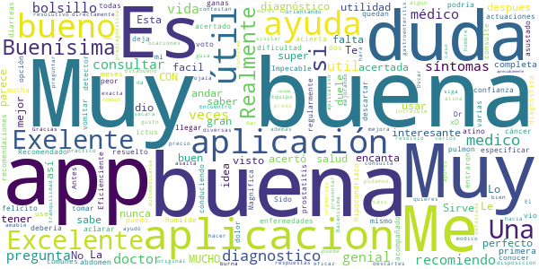

> Buena opción para consultar nuestro estado salud ...👌👍👍  :date: __2020-10-12 22:25:51__

> Excelente, la recomiendo  :date: __2020-01-20 03:00:05__

> Muy buena, son los mismo diagnóstico que me dio el Dr cuando me vio. Los felicito.  :date: __2020-01-07 20:20:51__

> Antes de consultar a él doctor, use esta aplicación 2 veces y en las 2 veces acertó.  :date: __2019-12-19 01:37:43__

> Eficienciente👌  :date: __2019-11-08 20:13:40__

> Impecable  :date: __2019-08-29 20:03:53__

> No me deja especificar que no puedo andar y, cuando me pregunta si tengo dificultad para andar, me diagnostica un ictus...  :date: __2019-08-26 16:29:38__

> Aplicación muy interesante. Sirve para conocer las enfermedades más comunes. Recomendado al 100%  :date: __2019-03-09 22:29:10__

> buenísima app, el diagnóstico es regularmente acertado, muy buenas recomendaciones y muy buenas actuaciones.  :date: __2019-02-11 02:12:21__

> Muy buena app , genial para aclarar dudas  :date: __2018-11-07 22:02:14__

#### 4-star reviews

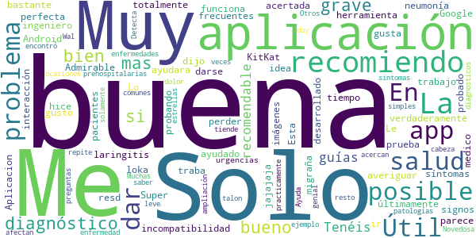

> Muy buena app para dar guías sobre salud y muy recomendable  :date: __2018-01-24 17:39:51__

> Útil  :date: __2016-11-12 23:01:11__

> 👍  :date: __2016-09-21 10:33:58__

> Tenéis un problema de incompatibilidad con Android 5.0. En KitKat funciona perfecta.  :date: __2015-04-29 16:25:18__

> Solo 4 porque me dijo que tenía neumonía y solo tenía un poco de laringitis... jajajaja  :date: __2015-02-12 23:26:55__

> Muy útil para darse una idea de un posible diagnóstico.  Admirable el trabajo de los ingeniero q han desarrollado esta aplicación.  :date: __2015-02-06 23:33:13__

> Super bien solo que últimamente se traba -.-  :date: __2015-01-20 03:02:41__

> Buena  :date: __2014-11-16 06:20:38__

> Esta loka esta Aplicacion  :date: __2014-09-19 21:23:53__

> Me ha ayudado averiguar  verdaderamente lo que tengo y es mas ya no tengo que ir al medico a perder tiempo esta aplicación me ayudara bastante en mi salud buena App se los recomiendo  :date: __2014-09-04 08:10:52__

#### 3-star reviews

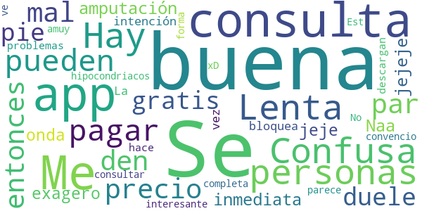

> Confusa  :date: __2020-11-23 07:51:11__

> Lenta  :date: __2017-05-05 02:35:49__

> Hay personas que no pueden pagar el precio de la consulta, entonces no estaría mal que den un par de consultas gratis.  :date: __2016-05-08 20:58:48__

> "Me duele el pie"= amputación inmediata jejeje. Naa! exagero jeje, pero la onda es esa =D  :date: __2015-02-20 07:44:02__

> Se bloquea de vez en cuando  :date: __2014-10-20 02:09:15__

> La app tiene una intención muy buena pero tiene muchos problemas  :date: __2014-10-04 02:20:25__

> Buena  :date: __2014-07-31 16:35:13__

> Se me hace q todos los que descargan esta app son hipocondriacos xD  :date: __2014-07-14 10:58:08__

> Se ve interesante  :date: __2014-05-16 15:04:03__

> No me convencio  :date: __2014-04-06 16:28:01__

#### 2-star reviews

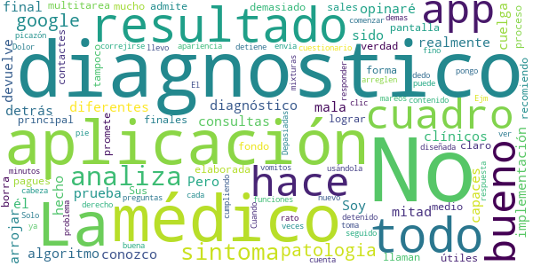

> Soy médico. No conozco el algoritmo diagnóstico que hay detrás de la aplicación por lo que no opinaré sobre él. Pero la implementación es realmente mala. La mitad de las consultas que he hecho de prueba con diferentes cuadros clínicos no han sido capaces de arrojar un resultado final, ya que se cuelga y te devuelve a la pantalla principal. No admite multitarea y cuando te llaman o sales a otra aplicación en medio del proceso se borra todo. Sus resultados finales no son tampoco demasiado útiles, en el fondo es una forma un poco más elaborada de lograr que contactes con los médicos que tienen en cuadro (y pagues, claro). No la recomiendo.  :date: __2019-08-13 17:33:47__

> La app de verdad promete mucho, la apariencia es buena y el cuestionario es muy bueno, pero se detiene a cada rato, llevo usándola 10 minutos y se me ha detenido como 9 veces ya, y tengo que comenzar de nuevo a responder todo, no le pongo las 5 porque no está cumpliendo con lo que esta diseñada, arreglen eso y todo fino  :date: __2014-09-20 22:22:10__

> El app es bueno pero tiene que correjirse algunas funciones.  - Depasiadas preguntas. - No hace mixturas de diagnosticos Ejm. Dolor de cabeza seguido de vomitos y mareos picazón en el pie derecho. Solo analiza un diagnosticos y lo demas sintomas no lo toma en cuenta. - Cuando analiza el sintoma su respuesta es el diagnostico de la patologia te envia a google pero el problema es cuando hace clic con la dedo no se puede ver el contenido de la patologia por el google.  :date: __2014-05-19 08:35:06__

#### 1-star reviews

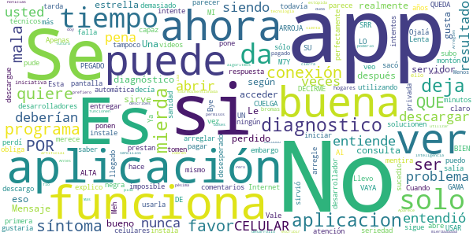

> Llevo utilizando esta aplicación desde hace 5 años y era muy buena, sigue siendo buena todavía pero deberían arreglar sus problemas técnicos, falla demasiado y se pone la pantalla negra. Vale la pena, sin embargo parece ser que sus desarrolladores no prestan atención a los comentarios y sólo ponen respuesta automática. Ojalá lo tomen con seriedad.  :date: __2020-04-24 17:06:06__

> No funciona .. Que mentira no abre nunca  :date: __2019-12-03 06:42:06__

> No se habré la app  :date: __2019-11-17 18:04:43__

> Es la primera vez que descargo la aplicación y no se quiere abrir , lo descargue en 3 celulares y sucedio lo mismo , me gustaria que solucionen el problema por favor.  :date: __2019-10-30 04:35:02__

> Nunca pude usarla, decía que no había conexión a Internet cuando perfectamente puedo ver videos y descargar otra app...  :date: __2019-10-23 06:47:43__

> Al parecer usted tampoco entendió, ya veo por qué no funciona el programa si usted siendo el desarrollador no entiende, es imposible que el programa sea capaz de entregar el resultado. Ahora se lo explico más claro a ver si entiende: SU PROGRAMA SE CUELGA, SE QUEDA PEGADO, NO ARROJA RESULTADO. POR FAVOR NO VAYA A DECIRME QUE PUEDE SRR MI CELULAR POR QUE ES UN CELULAR DE GAMA ALTA Y LO SE USAR M7Y BIEN. Entendió ahora? Cuando lo arregle le subo estrellas, por ahora tiene lo que se merece. Bye.  :date: __2019-10-08 16:44:15__

> Apenas que la instale no me sirvió se salía, y lo intente un montón de veces..  :date: __2019-09-11 00:39:52__

> Meh perdí mi tiempo  :date: __2019-08-22 18:16:38__

> Esta app no da buenos diagnosticos.  :date: __2019-07-22 20:49:35__

> No sacó ningún diagnóstico y te obliga a pagar si quieres saber más.  :date: __2019-04-05 20:30:33__

# TGN Emergències
App version ``1.0.5``

Analyzed with [covid-apps-observer](http://github.com/covid-apps-observer) project, version ``0.1``

## App overview
| | |
|-------------------------|-------------------------| 
| **Name**&nbsp;&nbsp;&nbsp;&nbsp;&nbsp;&nbsp;&nbsp;&nbsp;&nbsp;&nbsp;&nbsp;&nbsp;&nbsp;&nbsp;&nbsp;&nbsp;&nbsp;&nbsp;&nbsp;&nbsp;&nbsp;&nbsp;&nbsp;&nbsp;&nbsp;&nbsp;&nbsp;&nbsp;&nbsp;&nbsp;&nbsp;&nbsp;&nbsp;&nbsp;&nbsp;&nbsp;&nbsp;&nbsp;&nbsp;&nbsp;  | TGN Emergències |
| **Unique identifier** | studiogenesis.es.emergenciatarragona |
| **Link to Google Play** | [https://play.google.com/store/apps/details?id=studiogenesis.es.emergenciatarragona](https://play.google.com/store/apps/details?id=studiogenesis.es.emergenciatarragona) |
| **Summary**  | Información sobre los servicios del Ayuntamiento de Tarragona en caso de emerge. |
| **Privacy policy** | [https://emergencia.tarragona.cat/](https://emergencia.tarragona.cat/) |
| **Latest version** | 1.0.5 |
| **Last update** | 2020-11-19 09:52:18 |
| **Recent changes** | Actualización d&#39;información |
| **Installs**  | 5.000+ |
| **Category** | Educación |
| **First release** | 20 mar 2020 |
| **Size**  | 6,8M |
| **Supported Android version**  | 4.1 y versiones posteriores |

### Description
> El Ayuntamiento de Tarragona pone a disposición de las ciudadanas y ciudadanos una aplicación que te informa sobre el funcionamiento de los servicios municipales en caso de emergencia y te da todos los detalles de manera actualizada.
 En el momento que nace esta app, podrás consultar los cambios que se han implantado en los servicios con motivo de la crisis sanitaria provocada por la pandemia del coronavirus Covid-19, así como los datos de contacto y la última hora.

### User interface
The developers of the app provide the following screenshots in the Google play store.
| | | |
|:-------------------------:|:-------------------------:|:-------------------------:|
 | 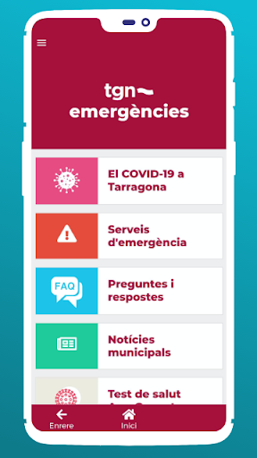  | 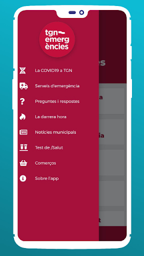  | 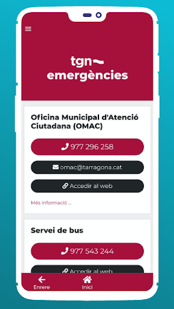  | 
 | 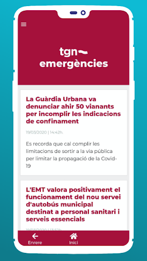 

## Development team
In the following we report the main information provided by the development team in the Google play store.

| | |
|-------------------------|-------------------------|
| **Developer**  | Ajuntament de Tarragona |
| **Website**  | [https://emergencia.tarragona.cat/](https://emergencia.tarragona.cat/) |
| **Email** | android@tarragona.cat |
| **Physical address**  | - |
| **Other developed apps**  | [https://play.google.com/store/apps/developer?id=Ajuntament+de+Tarragona](https://play.google.com/store/apps/developer?id=Ajuntament+de+Tarragona) |

## Android support

| | |
|-------------------------|-------------------------|
| **Declared target Android version**  | Pie, version 9 (API level 28) |
| **Effective target Android version**  | Pie, version 9 (API level 28) |
| **Minimum supported Android version**  | Jelly Bean, version 4.1.x (API level 16) |
| **Maximum target Android version**  | - |

The larger the difference between the minimum and maximum supported Android versions, the better. A larger difference means a wider audience. For example, old phones have a very low Android version, so a high minimum supported Android version means that the app cannot be used by users with old phones, thus leading to accessibility problems. 

## Requested permissions

In the following we report the complete list of the permissions requested by the app. 

| **Permission** | **Protection level** | **Description** | 
|-------------------------|-------------------------|-------------------------|
 **android.permission ACCESS_NETWORK_STATE** | Normal | Allows applications to access information about networks. 
 **android.permission INTERNET** | Normal | Allows applications to open network sockets. 
 **android.permission WAKE_LOCK** | Normal | Allows using PowerManager WakeLocks to keep processor from sleeping or screen from dimming. 
 **com.google.android.c2dm.permission RECEIVE** | - | - 

## Mentioned servers

| **Server** | **Registrant** | **Registrant country** | **Creation date** | 
|-------------------------|-------------------------|-------------------------|-------------------------|
 | google.com | Google LLC | :us: US | 1997-09-15 04:00:00 |

## Security analysis 

Below we report the main security warnings raised by our execution of the [Androwarn](https://github.com/maaaaz/androwarn) security analysis tool.

**Connection interfaces exfiltration**
> - This application reads details about the currently active data network 

**Pim data leakage**
> - This application accesses data stored in the clipboard 

**Code execution**
> - This application loads a native library: 'flutter' 

## User ratings and reviews

Below we provide information about how end users are reacting to the app in terms of ratings and reviews in the Google Play store.

### Ratings

The TGN Emergències app has been installed by more than **5000** times. At this time, **10** rated the app and its average score is **2.5**. Below we show the distribution of the ratings across the usual star-based rating of Google Play

:star::star::star::star::star:: 3

:star::star::star::star:: 1

:star::star::star:: 0

:star::star:: 0

:star:: 6

### Reviews 

#### 5-star reviews

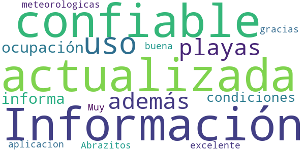

> Información confiable y actualizada para el uso de las playas, además de la ocupación también informa sobre las condiciones meteorologicas, excelente aplicacion  :date: __2020-07-29 13:32:33__

> Muy buena gracias . Abrazitos  :date: __2020-05-11 19:39:10__

#### 4-star reviews

No recent reviews available with 4 stars.

#### 3-star reviews

No recent reviews available with 3 stars.

#### 2-star reviews

No recent reviews available with 2 stars.

#### 1-star reviews

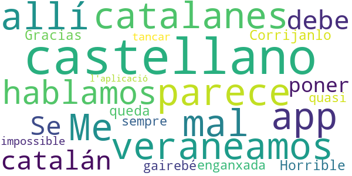

> Me parece muy mal que esta app no esté en castellano, porque todos los que veraneamos allí no somos catalanes, ni hablamos catalán. Se debe poner en castellano. Corrijanlo. Gracias  :date: __2020-07-10 10:21:48__

> Horrible, es queda enganxada gairebé sempre i es quasi impossible tancar l'aplicació  :date: __2020-03-25 15:33:35__

# El Cabildo en tu móvil
App version ``1.1.7``

Analyzed with [covid-apps-observer](http://github.com/covid-apps-observer) project, version ``0.1``

## App overview
| | |
|-------------------------|-------------------------| 
| **Name**&nbsp;&nbsp;&nbsp;&nbsp;&nbsp;&nbsp;&nbsp;&nbsp;&nbsp;&nbsp;&nbsp;&nbsp;&nbsp;&nbsp;&nbsp;&nbsp;&nbsp;&nbsp;&nbsp;&nbsp;&nbsp;&nbsp;&nbsp;&nbsp;&nbsp;&nbsp;&nbsp;&nbsp;&nbsp;&nbsp;&nbsp;&nbsp;&nbsp;&nbsp;&nbsp;&nbsp;&nbsp;&nbsp;&nbsp;&nbsp;  | El Cabildo en tu móvil |
| **Unique identifier** | com.osh.lagomeracomunica |
| **Link to Google Play** | [https://play.google.com/store/apps/details?id=com.osh.lagomeracomunica](https://play.google.com/store/apps/details?id=com.osh.lagomeracomunica) |
| **Summary**  | Servicio de información del Cabildo Insular de La Gomera |
| **Privacy policy** | [https://www.lagomera.es/](https://www.lagomera.es/) |
| **Latest version** | 1.1.7 |
| **Last update** | 2020-07-22 17:19:29 |
| **Recent changes** | Se ha añadido un nuevo menú con los servicios de El Cabildo |
| **Installs**  | 100+ |
| **Category** | Comunicación |
| **First release** | 22 mar. 2020 |
| **Size**  | 18M |
| **Supported Android version**  | 4.1 y versiones posteriores |

### Description
> El Cabildo en tu móvil es una aplicación creada para recibir la información de interés ciudadano que a diario publica la Institución.
 Esta herramienta permite el acceso directo a noticias, avisos y alertas oficiales con las que obtener datos ante situaciones de emergencias, convocatorias o anuncios.

### User interface
The developers of the app provide the following screenshots in the Google play store.
| | | |
|:-------------------------:|:-------------------------:|:-------------------------:|
 |   |  

## Development team
In the following we report the main information provided by the development team in the Google play store.

| | |
|-------------------------|-------------------------|
| **Developer**  | OSH+ |
| **Website**  | [https://www.lagomera.es/](https://www.lagomera.es/) |
| **Email** | prensa@lagomera.es |
| **Physical address**  | - |
| **Other developed apps**  | [https://play.google.com/store/apps/developer?id=OSH%2B](https://play.google.com/store/apps/developer?id=OSH%2B) |

## Android support

| | |
|-------------------------|-------------------------|
| **Declared target Android version**  | Pie, version 9 (API level 28) |
| **Effective target Android version**  | Pie, version 9 (API level 28) |
| **Minimum supported Android version**  | Jelly Bean, version 4.1.x (API level 16) |
| **Maximum target Android version**  | - |

The larger the difference between the minimum and maximum supported Android versions, the better. A larger difference means a wider audience. For example, old phones have a very low Android version, so a high minimum supported Android version means that the app cannot be used by users with old phones, thus leading to accessibility problems. 

## Requested permissions

In the following we report the complete list of the permissions requested by the app. 

| **Permission** | **Protection level** | **Description** | 
|-------------------------|-------------------------|-------------------------|
 **android.permission ACCESS_NETWORK_STATE** | Normal | Allows applications to access information about networks. 
 **android.permission ACCESS_WIFI_STATE** | Normal | Allows applications to access information about Wi-Fi networks. 
 **android.permission INTERNET** | Normal | Allows applications to open network sockets. 
 **android.permission READ_APP_BADGE** | - | - 
 **android.permission RECEIVE_BOOT_COMPLETED** | Normal | Allows an application to receive the Intent.ACTION_BOOT_COMPLETED that is broadcast after the system finishes booting. 
 **android.permission VIBRATE** | Normal | Allows access to the vibrator. 
 **android.permission WAKE_LOCK** | Normal | Allows using PowerManager WakeLocks to keep processor from sleeping or screen from dimming. 
 **com.anddoes.launcher.permission UPDATE_COUNT** | - | - 
 **com.google.android.c2dm.permission RECEIVE** | - | - 
 **com.google.android.finsky.permission BIND_GET_INSTALL_REFERRER_SERVICE** | - | - 
 **com.htc.launcher.permission READ_SETTINGS** | - | - 
 **com.htc.launcher.permission UPDATE_SHORTCUT** | - | - 
 **com.huawei.android.launcher.permission CHANGE_BADGE** | - | - 
 **com.huawei.android.launcher.permission READ_SETTINGS** | - | - 
 **com.huawei.android.launcher.permission WRITE_SETTINGS** | - | - 
 **com.majeur.launcher.permission UPDATE_BADGE** | - | - 
 **com.oppo.launcher.permission READ_SETTINGS** | - | - 
 **com.oppo.launcher.permission WRITE_SETTINGS** | - | - 
 **com.osh.lagomeracomunica.permission C2D_MESSAGE** | - | - 
 **com.sec.android.provider.badge.permission READ** | - | - 
 **com.sec.android.provider.badge.permission WRITE** | - | - 
 **com.sonyericsson.home.permission BROADCAST_BADGE** | - | - 
 **com.sonymobile.home.permission PROVIDER_INSERT_BADGE** | - | - 
 **me.everything.badger.permission BADGE_COUNT_READ** | - | - 
 **me.everything.badger.permission BADGE_COUNT_WRITE** | - | - 

## Mentioned servers

| **Server** | **Registrant** | **Registrant country** | **Creation date** | 
|-------------------------|-------------------------|-------------------------|-------------------------|
 | googlesyndication.com | Google LLC | :us: US | 2003-01-21 06:17:24 |
 | app-measurement.com | Google LLC | :us: US | 2015-06-19 20:13:31 |
 | google.com | Google LLC | :us: US | 1997-09-15 04:00:00 |
 | onesignal.com | Domains By Proxy, LLC | :us: US | 2011-09-10 18:40:52 |

## Security analysis 

Below we report the main security warnings raised by our execution of the [Androwarn](https://github.com/maaaaz/androwarn) security analysis tool.

**Telephony identifiers leakage**
> - This application reads the numeric name (MCC+MNC) of current registered operator 
> - This application reads the operator name 

**Connection interfaces exfiltration**
> - This application reads details about the currently active data network 

**Pim data leakage**
> - This application accesses data stored in the clipboard 

**Code execution**
> - This application loads a native library: 'flutter' 
> - This application executes a UNIX command containing this argument: 'Ljava/lang/StringBuilder;->toString()Ljava/lang/String;' 

## User ratings and reviews

Below we provide information about how end users are reacting to the app in terms of ratings and reviews in the Google Play store.

### Ratings

The El Cabildo en tu móvil app has been installed by more than **100** times. At this time, **-** rated the app and its average score is **0.0**. Below we show the distribution of the ratings across the usual star-based rating of Google Play

:star::star::star::star::star:: 0

:star::star::star::star:: 0

:star::star::star:: 0

:star::star:: 0

:star:: 0

### Reviews 

#### 5-star reviews

> Bienn  :date: __2020-04-12 00:13:50__

#### 4-star reviews

No recent reviews available with 4 stars.

#### 3-star reviews

No recent reviews available with 3 stars.

#### 2-star reviews

No recent reviews available with 2 stars.

#### 1-star reviews

No recent reviews available with 1 stars.

# BizkaiUP
App version ``1.4.1``

Analyzed with [covid-apps-observer](http://github.com/covid-apps-observer) project, version ``0.1``

## App overview
| | |
|-------------------------|-------------------------| 
| **Name**&nbsp;&nbsp;&nbsp;&nbsp;&nbsp;&nbsp;&nbsp;&nbsp;&nbsp;&nbsp;&nbsp;&nbsp;&nbsp;&nbsp;&nbsp;&nbsp;&nbsp;&nbsp;&nbsp;&nbsp;&nbsp;&nbsp;&nbsp;&nbsp;&nbsp;&nbsp;&nbsp;&nbsp;&nbsp;&nbsp;&nbsp;&nbsp;&nbsp;&nbsp;&nbsp;&nbsp;&nbsp;&nbsp;&nbsp;&nbsp;  | BizkaiUP |
| **Unique identifier** | com.lantik.bizkaiup |
| **Link to Google Play** | [https://play.google.com/store/apps/details?id=com.lantik.bizkaiup](https://play.google.com/store/apps/details?id=com.lantik.bizkaiup) |
| **Summary**  | BizkaiUP permite a la ciudadanía informarse acerca de la situación en Bizkaia. |
| **Privacy policy** | [https://web.bizkaia.eus/documents/842933/0/Disclaimer+Legal.pdf/87b8dbc5-0606-4de9-9aa6-a25fbc5662a6?t=1585570249850](https://web.bizkaia.eus/documents/842933/0/Disclaimer+Legal.pdf/87b8dbc5-0606-4de9-9aa6-a25fbc5662a6?t=1585570249850) |
| **Latest version** | 1.4.1 |
| **Last update** | 2020-11-16 11:51:27 |
| **Recent changes** | Mejoras en la navegación y resolución de incidencias menores. |
| **Installs**  | 10.000+ |
| **Category** | Comunicación |
| **First release** | 13 abr 2020 |
| **Size**  | 10M |
| **Supported Android version**  | 6.0 y versiones posteriores |

### Description
> BizkaiUP permite a la ciudadanía estar informada acerca de la situación que se vive en Bizkaia. Es posible consultar las últimas noticias, organizadas por temática de interés y localización, así como suscribirse al canal de avisos de la Diputación Foral de Bizkaia para disponer de información puntual en todo momento. Adicionalmente, se pueden consultar, mediante geolocalización, los establecimientos de interés cercanos a una posición determinada relacionados con la salud, la alimentación, la movilidad y los servicios de interés.

### User interface
The developers of the app provide the following screenshots in the Google play store.
| | | |
|:-------------------------:|:-------------------------:|:-------------------------:|
 |   | 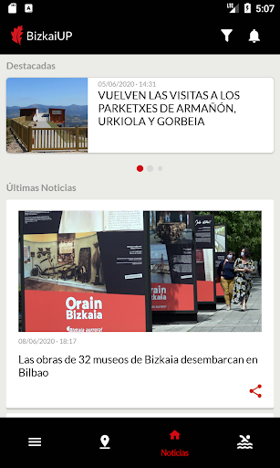  | 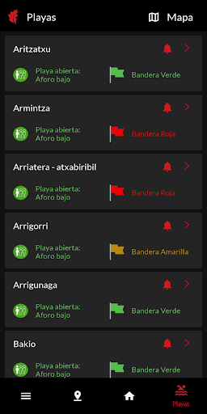  | 
 | 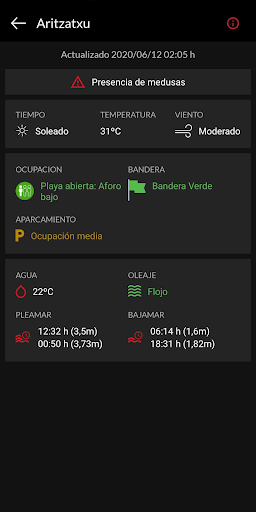  | 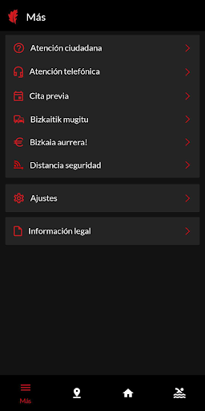  |   | 
 | 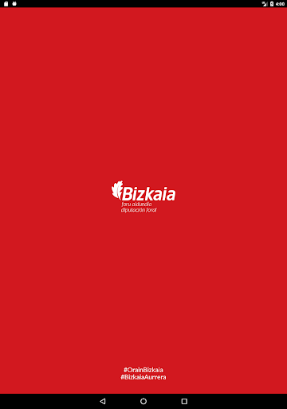  |   |   | 
 | 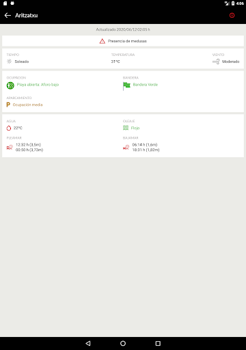  |   |   | 
 |   |   |   | 
 |  

## Development team
In the following we report the main information provided by the development team in the Google play store.

| | |
|-------------------------|-------------------------|
| **Developer**  | Bizkaiko Foru Aldundia–Diputación Foral de Bizkaia |
| **Website**  | [http://www.bizkaia.eus](http://www.bizkaia.eus) |
| **Email** | lantik@bizkaia.eus |
| **Physical address**  | - |
| **Other developed apps**  | [https://play.google.com/store/apps/developer?id=Bizkaiko+Foru+Aldundia%E2%80%93Diputaci%C3%B3n+Foral+de+Bizkaia](https://play.google.com/store/apps/developer?id=Bizkaiko+Foru+Aldundia%E2%80%93Diputaci%C3%B3n+Foral+de+Bizkaia) |

## Android support

| | |
|-------------------------|-------------------------|
| **Declared target Android version**  | Android10, version 10 (API level 29) |
| **Effective target Android version**  | Android10, version 10 (API level 29) |
| **Minimum supported Android version**  | Marshmallow, version 6.0 (API level 23) |
| **Maximum target Android version**  | - |

The larger the difference between the minimum and maximum supported Android versions, the better. A larger difference means a wider audience. For example, old phones have a very low Android version, so a high minimum supported Android version means that the app cannot be used by users with old phones, thus leading to accessibility problems. 

## Requested permissions

In the following we report the complete list of the permissions requested by the app. 

| **Permission** | **Protection level** | **Description** | 
|-------------------------|-------------------------|-------------------------|
 **android.permission ACCESS_NETWORK_STATE** | Normal | Allows applications to access information about networks. 
 **android.permission ACCESS_NOTIFICATION_POLICY** | Normal | Marker permission for applications that wish to access notification policy. 
 **android.permission CAMERA** | :warning:**Dangerous** | Required to be able to access the camera device. 
 **android.permission INTERNET** | Normal | Allows applications to open network sockets. 
 **android.permission READ_EXTERNAL_STORAGE** | :warning:**Dangerous** | Allows an application to read from external storage. 
 **android.permission READ_PHONE_STATE** | :warning:**Dangerous** | Allows read only access to phone state, including the phone number of the device, current cellular network information, the status of any ongoing calls, and a list of any PhoneAccounts registered on the device. 
 **android.permission WAKE_LOCK** | Normal | Allows using PowerManager WakeLocks to keep processor from sleeping or screen from dimming. 
 **android.permission WRITE_EXTERNAL_STORAGE** | :warning:**Dangerous** | Allows an application to write to external storage. 
 **com.google.android.c2dm.permission RECEIVE** | - | - 
 **com.google.android.finsky.permission BIND_GET_INSTALL_REFERRER_SERVICE** | - | - 

## Mentioned servers

| **Server** | **Registrant** | **Registrant country** | **Creation date** | 
|-------------------------|-------------------------|-------------------------|-------------------------|
 | google.com | Google LLC | :us: US | 1997-09-15 04:00:00 |
 | googlesyndication.com | Google LLC | :us: US | 2003-01-21 06:17:24 |
 | googleadservices.com | Google LLC | :us: US | 2003-06-19 16:34:53 |
 | app-measurement.com | Google LLC | :us: US | 2015-06-19 20:13:31 |
 | ibm.com | International Business Machines Corporation | :us: US | 1986-03-19 05:00:00 |
 | cloudant.com | Not Disclosed | :us: US | 2007-08-01 18:59:30 |
 | bluemix.net | International Business Machines Corporation | :us: US | 2013-04-19 18:31:24 |
 | crashlytics.com | Google LLC | :us: US | 2011-01-21 15:30:40 |

## Security analysis 

Below we report the main security warnings raised by our execution of the [Androwarn](https://github.com/maaaaz/androwarn) security analysis tool.

**Connection interfaces exfiltration**
> - This application reads details about the currently active data network 

**Telephony services abuse**
> - This application makes phone calls 

**Suspicious connection establishment**
> - This application opens a Socket and connects it to the remote address ': ; port is out of range' on the 'N/A' port  
> - This application opens a Socket and connects it to the remote address 'Lc/b/a/a/a;->o(Ljava/lang/String;)Ljava/lang/StringBuilder;' on the 'N/A' port  
> - This application opens a Socket and connects it to the remote address 'Ljava/net/Proxy;->type()Ljava/net/Proxy$Type;' on the 'N/A' port  
> - This application opens a Socket and connects it to the remote address 'timeout' on the 'N/A' port  

**Code execution**
> - This application loads a native library: 'arcore_sdk_jni' 
> - This application loads a native library: 'arsceneview_jni' 
> - This application loads a native library: 'filament-jni' 

## User ratings and reviews

Below we provide information about how end users are reacting to the app in terms of ratings and reviews in the Google Play store.

### Ratings

The BizkaiUP app has been installed by more than **10000** times. At this time, **27** rated the app and its average score is **4.2222223**. Below we show the distribution of the ratings across the usual star-based rating of Google Play

:star::star::star::star::star:: 17

:star::star::star::star:: 3

:star::star::star:: 5

:star::star:: 0

:star:: 2

### Reviews 

#### 5-star reviews

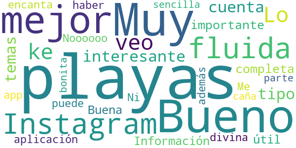

> Lo ke veo es interesante y cuenta todo tipo de temas . Y playas . Muy importante . Muy completa  :date: __2020-06-20 11:29:39__

> Información útil sobre las playas  :date: __2020-06-18 15:38:27__

> Buena aplicación  :date: __2020-06-17 13:08:50__

> Bueno, bueno puede haber algo mejor? Noooooo. Ni el Instagram tu ni el Instagram además divina y fluida lo mejor lo de las playas.  :date: __2020-06-13 21:44:00__

> Me encanta la app, es fluida, sencilla, y bonita. Y la parte de las playas es la caña!  :date: __2020-06-13 16:12:50__

#### 4-star reviews

> No sale el mapa de playas  :date: __2020-07-18 16:23:05__

#### 3-star reviews

> Porque me pone que no es compatible el dispositivo a la hora de medir la distancia?  :date: __2020-10-19 07:09:30__

> No la he probado a fondo, pero puede ser muy interesante, siempre y cuando se actualice cada muy poco tiempo. Si pasa una hora sin actualizar no sirve para nada, pues las distancias en Bizkaia son mucho menores de esa hora. Si se hace así perfecta y buena.  :date: __2020-06-19 12:17:45__

#### 2-star reviews

No recent reviews available with 2 stars.

#### 1-star reviews

> 29 de mayo. Playas cerradas y yo me entero por amigos. En la App no dicen nada del tema. Si la información no se actualiza no sirve para nada  :date: __2020-05-29 14:49:25__

# PassCOVID.gal
App version ``1.0.2``

Analyzed with [covid-apps-observer](http://github.com/covid-apps-observer) project, version ``0.1``

## App overview
| | |
|-------------------------|-------------------------| 
| **Name**&nbsp;&nbsp;&nbsp;&nbsp;&nbsp;&nbsp;&nbsp;&nbsp;&nbsp;&nbsp;&nbsp;&nbsp;&nbsp;&nbsp;&nbsp;&nbsp;&nbsp;&nbsp;&nbsp;&nbsp;&nbsp;&nbsp;&nbsp;&nbsp;&nbsp;&nbsp;&nbsp;&nbsp;&nbsp;&nbsp;&nbsp;&nbsp;&nbsp;&nbsp;&nbsp;&nbsp;&nbsp;&nbsp;&nbsp;&nbsp;  | PassCOVID.gal |
| **Unique identifier** | gal.xunta.covidpass |
| **Link to Google Play** | [https://play.google.com/store/apps/details?id=gal.xunta.covidpass](https://play.google.com/store/apps/details?id=gal.xunta.covidpass) |
| **Summary**  | Información y servicios sobre la Covid-19 de la Xunta de Galicia |
| **Privacy policy** | [https://passcovid.xunta.gal/politica-de-privacidade](https://passcovid.xunta.gal/politica-de-privacidade) |
| **Latest version** | 1.0.2 |
| **Last update** | 2020-12-12 15:20:06 |
| **Recent changes** | [GL] Maior simplicidade e rapidez no acceso para utilizar a App de xeito anónimo Visualización das restricións de maneira máis sinxela e completa Outras melloras menores e corrección de diversos erros.  [ES] Mayor simplicidad y rapidez en el acceso para utilizar la App de manera anónima Visualización de las restricciones de manera más sencilla y completa Otras mejoras menores y corrección de diversos errores. |
| **Installs**  | 10.000+ |
| **Category** | Salud y bienestar |
| **First release** | 15 oct 2020 |
| **Size**  | 13M |
| **Supported Android version**  | 5.0 y versiones posteriores |

### Description
> [GL]
 PassCOVID é unha app da Xunta de Galicia para axudar a coidarnos da COVID-19.
 Permite recibir avisos, estar informado das restricións, recomendacións e novidades, así como informar si estiveches nun local con concentración de contaxios, si es un contacto estreito ou si fuches diagnosticado/a da COVID-19.
 Neste último caso, poderás colaborar coa Xunta de Galicia na xestión da pandemia, informando voluntariamente dos teus contactos estreitos e dos establecementos onde estiveches.
 PassCOVID poderá comprobar a existencia de aplicacións xa instaladas no teu dispositivo e/ou acceder á información das mesmas nos seguintes casos:
  — PassCovid poderá acceder ao dispositivo do usuario para obter información das aplicacións instaladas.
  — PassCovid poderá acceder á aplicación da cámara do dispositivo, co fin de capturar os  QR dos establecementos visitados.
  — PassCovid poderá acceder á aplicación da axenda de contactos, no caso de que se queira utilizar para cargar os datos dos contactos na aplicación de maneira automática.
  — PassCovid poderá acceder ao teléfono, para realizar chamadas aos números de teléfono de contacto presentados na aplicación.
  — PassCovid poderá acceder a ligazóns de contidos e aplicacións de terceiros na internet para proporcionar información e servizos relacionados coa COVID-19.
 Condiciones de uso: https://passcovid.xunta.gal/condicions-de-uso?langId=gl_ES
 Política de privacidad: https://passcovid.xunta.gal/politica-de-privacidade?langId=gl_ES
 [ES]
 PassCOVID es una app de la Xunta de Galicia para ayudar a cuidarnos de la COVID-19.
 Permite recibir avisos, estar informado de las restricciones, recomendaciones y novedades, así como informarte si estuviste en un local con concentración de contagios, si eres un contacto estrecho o si has sido diagnosticado/a de la COVID-19.
 En este último caso, podrás colaborar con la Xunta de Galicia en la gestión de la pandemia, informando voluntariamente de tus contactos estrechos y de los establecimientos donde hayas estado.
 PassCOVID podrá comprobar la existencia de aplicaciones ya instaladas en tu dispositivo y/o acceder a la información de las mismas en los siguientes casos:
 — PassCovid podrá acceder al dispositivo del usuario para obtener información de las aplicaciones instaladas.
 — PassCovid podrá acceder a la aplicación de la cámara del dispositivo, con el fin de capturar los QR de los establecimientos visitados.
 — PassCovid podrá acceder a la aplicación de la agenda de contactos, en el caso de que se quiera utilizar para cargar los datos de los contactos en la aplicación de manera automática.
 — PassCovid podrá acceder al teléfono, para realizar llamadas a los números de teléfono de contacto presentados en la aplicación
 — PassCovid podrá acceder a enlaces de contenidos y aplicaciones de terceros en internet para proporcionar información y servicios relacionados con la COVID-19.
 Condiciones de uso: https://passcovid.xunta.gal/condicions-de-uso?langId=es_ES
 Política de privacidad: https://passcovid.xunta.gal/politica-de-privacidade?langId=es_ES

### User interface
The developers of the app provide the following screenshots in the Google play store.
| | | |
|:-------------------------:|:-------------------------:|:-------------------------:|
 |   |   |   | 
 |   |   |   | 
 |   |  

## Development team
In the following we report the main information provided by the development team in the Google play store.

| | |
|-------------------------|-------------------------|
| **Developer**  | Xunta de Galicia |
| **Website**  | [https://passcovid.xunta.gal](https://passcovid.xunta.gal) |
| **Email** | 012@xunta.gal |
| **Physical address**  | - |
| **Other developed apps**  | [https://play.google.com/store/apps/developer?id=Xunta+de+Galicia](https://play.google.com/store/apps/developer?id=Xunta+de+Galicia) |

## Android support

| | |
|-------------------------|-------------------------|
| **Declared target Android version**  | Android10, version 10 (API level 29) |
| **Effective target Android version**  | Android10, version 10 (API level 29) |
| **Minimum supported Android version**  | Lollipop, version 5.0 (API level 21) |
| **Maximum target Android version**  | - |

The larger the difference between the minimum and maximum supported Android versions, the better. A larger difference means a wider audience. For example, old phones have a very low Android version, so a high minimum supported Android version means that the app cannot be used by users with old phones, thus leading to accessibility problems. 

## Requested permissions

In the following we report the complete list of the permissions requested by the app. 

| **Permission** | **Protection level** | **Description** | 
|-------------------------|-------------------------|-------------------------|
 **android.permission ACCESS_NETWORK_STATE** | Normal | Allows applications to access information about networks. 
 **android.permission CAMERA** | :warning:**Dangerous** | Required to be able to access the camera device. 
 **android.permission FLASHLIGHT** | - | - 
 **android.permission INTERNET** | Normal | Allows applications to open network sockets. 
 **android.permission READ_APP_BADGE** | - | - 
 **android.permission RECEIVE_BOOT_COMPLETED** | Normal | Allows an application to receive the Intent.ACTION_BOOT_COMPLETED that is broadcast after the system finishes booting. 
 **android.permission USE_BIOMETRIC** | Normal | Allows an app to use device supported biometric modalities. 
 **android.permission USE_FINGERPRINT** | Normal | This constant was deprecated in API level 28. Applications should request USE_BIOMETRIC instead 
 **android.permission WAKE_LOCK** | Normal | Allows using PowerManager WakeLocks to keep processor from sleeping or screen from dimming. 
 **android.permission WRITE_EXTERNAL_STORAGE** | :warning:**Dangerous** | Allows an application to write to external storage. 
 **com.anddoes.launcher.permission UPDATE_COUNT** | - | - 
 **com.google.android.c2dm.permission RECEIVE** | - | - 
 **com.htc.launcher.permission READ_SETTINGS** | - | - 
 **com.htc.launcher.permission UPDATE_SHORTCUT** | - | - 
 **com.huawei.android.launcher.permission CHANGE_BADGE** | - | - 
 **com.huawei.android.launcher.permission READ_SETTINGS** | - | - 
 **com.huawei.android.launcher.permission WRITE_SETTINGS** | - | - 
 **com.majeur.launcher.permission UPDATE_BADGE** | - | - 
 **com.oppo.launcher.permission READ_SETTINGS** | - | - 
 **com.oppo.launcher.permission WRITE_SETTINGS** | - | - 
 **com.sec.android.provider.badge.permission READ** | - | - 
 **com.sec.android.provider.badge.permission WRITE** | - | - 
 **com.sonyericsson.home.permission BROADCAST_BADGE** | - | - 
 **com.sonymobile.home.permission PROVIDER_INSERT_BADGE** | - | - 
 **me.everything.badger.permission BADGE_COUNT_READ** | - | - 
 **me.everything.badger.permission BADGE_COUNT_WRITE** | - | - 

## Mentioned servers

| **Server** | **Registrant** | **Registrant country** | **Creation date** | 
|-------------------------|-------------------------|-------------------------|-------------------------|
 | adobe.com | Adobe Inc. | :us: US | 1986-11-17 05:00:00 |
 | google.com | Google LLC | :us: US | 1997-09-15 04:00:00 |
 | appspot.com | Google LLC | :us: US | 2005-03-10 02:27:55 |
 | gstatic.com | Google LLC | :us: US | 2008-02-11 15:31:25 |
 | googleapis.com | Google LLC | :us: US | 2005-01-25 17:52:26 |
 | whatsapp.com | Whatsapp Inc. | :us: US | 2008-09-04 12:39:12 |

## Security analysis 

Below we report the main security warnings raised by our execution of the [Androwarn](https://github.com/maaaaz/androwarn) security analysis tool.

**Connection interfaces exfiltration**
> - This application reads details about the currently active data network 
> - This application tries to find out if the currently active data network is metered 

**Telephony services abuse**
> - This application makes phone calls 

**Suspicious connection establishment**
> - This application opens a Socket and connects it to the remote address '' on the 'N/A' port  
> - This application opens a Socket and connects it to the remote address 'Ljava/lang/StringBuilder;->toString()Ljava/lang/String;' on the ': connect, resolve' port  
> - This application opens a Socket and connects it to the remote address 'Ljava/lang/StringBuilder;->toString()Ljava/lang/String;' on the 'N/A' port  
> - This application opens a Socket and connects it to the remote address 'Ljava/net/Proxy;->type()Ljava/net/Proxy$Type;' on the 'N/A' port  
> - This application opens a Socket and connects it to the remote address 'timeout' on the 'N/A' port  

**Pim data leakage**
> - This application accesses the downloads folder 
> - This application accesses data stored in the clipboard 

**Code execution**
> - This application loads a native library: 'sqlc-native-driver' 

## User ratings and reviews

Below we provide information about how end users are reacting to the app in terms of ratings and reviews in the Google Play store.

### Ratings

The PassCOVID.gal app has been installed by more than **10000** times. At this time, **94** rated the app and its average score is **2.6595745**. Below we show the distribution of the ratings across the usual star-based rating of Google Play

:star::star::star::star::star:: 27

:star::star::star::star:: 5

:star::star::star:: 8

:star::star:: 17

:star:: 37

### Reviews 

#### 5-star reviews

> Buena  :date: __2020-12-09 00:02:20__

> Me parece muy útil  :date: __2020-12-03 21:34:44__

> Bien la información ofrecida.  :date: __2020-11-27 16:04:04__

> Esta aplicación va muy bien felicito al SERGAS por la excelente aplicación.  :date: __2020-11-26 10:09:08__

> acceso instantáneo con chave. Sencilla de utilizar con información de la situación y avisos de restricciones.  :date: __2020-10-30 23:50:41__

#### 4-star reviews

> Aparte de lo invasiva que resulta (llama la atención porque la propone el partido que acusaba a Radar Covid de serlo), cuando quiero introducir el QR de algún establecimiento resulta que los establecimientos NO TIENEN CÓDIGO QR que escanear. Ni cafeterías, ni supermercados, farmacias, bancos, ferreterías, tiendas de ropa....  :date: __2020-11-08 18:47:18__

> Salen textos cortados o superpuestos y en la pantalla de registro finalizado sale cortado el botón (apenas se puede pulsar) y no hay scroll. Por lo demás no pinta mal.  :date: __2020-10-27 20:57:05__

#### 3-star reviews

> Yo no veo ningún local donde tengan el código QR, lo único que tienen en los bares es el QR de la carta y en otros sitios tampoco lo veo me imagino que tendría que estar a la vista en los supermercados etc..  :date: __2020-12-04 19:15:25__

> Me parece bien.  :date: __2020-11-28 15:32:17__

> Decepcionante, soy ciudadano de la UE y no puedo iniciar sesión con mi NIE, no acepta poner letra delante de los números. Estoy a la espera de nuevas actualizaciones para resolver el problema de inicio de sesión con NIE y clavé 365. Hay que darle una nueva oportunidad.  :date: __2020-11-26 15:24:48__

> Bueno  :date: __2020-11-13 13:58:28__

#### 2-star reviews

> Tiene que mejorar No consigo que la app me indique zonas en las que hay brotes de contagios o zonas de riesgo, se limita a dar información sobre restricciones y recomendaciones que ya conozco muy bien. La desinstalo ahora mismo, esta app no me sirve para desplazarme con seguridad. Más adelante le daré una oportunidad  :date: __2020-12-01 00:01:22__

> Tuve que desinstalarla se quedaba colgada nada más descargarla.....  :date: __2020-11-30 19:20:30__

> Mejor que radarcovid, pero tiene un PERO en mayúsculas. Aún eligiendo la opción en castellano, el 95% del contenido está en gallego, así que tendré que desinstalarla..  :date: __2020-11-30 18:38:05__

> Ya la tuve y era un desastre...la vuelvo a instalar pero ....sin esperanzas ...  :date: __2020-11-30 12:40:33__

> Solo me deja personalizar con chave pero no con certificado digital, por qué?  :date: __2020-11-30 11:12:47__

> Códigos de verificación sigo esperando,fallo  :date: __2020-11-29 21:08:21__

> Non permitirá ser unha útil ferramenta , mediante o escaneo dos códigos QR por non esistir dito QR nos establecementos, públicos e privados . Sen quedar regixtrado que unha persoa a visitado ese establecemento. Sentidiño Indicacións pra protexernos contra a COVID-19.  :date: __2020-11-29 01:47:38__

> Es poco clara y "le cuesta" poner todo en bilingüe, español y gallego. En varios contenidos no da opción y sólo sale la versión en gallego... Otra enfermedad, el antibilingüismo.  :date: __2020-11-28 12:57:27__

> Es curioso que me permita registrar a qué bares voy pero que no pregunte y/o permita registrar el uso del trasporte público... Muy curioso...  :date: __2020-11-24 22:26:27__

> Debería permitir independientemente si eres positivo o no, poder determinar libremente que lugares y contactos has tenido de manera cronológica dentro de la app. Seleccionar los lugares visitados de una manera simple, no solo con un QR que la mayoría desconoce cual es de cada local. Usar gmaps para ubicar los lugares sería más preciso y que quede registrado el día de visita del lugar y lo mismo para mis contactos estrechos. Ayudaría y sería más sencillo el uso.  :date: __2020-11-21 10:53:40__

#### 1-star reviews

> Desexo saber si esta aplicación ten coste algún, sexa polo que sexa, avisos, descarga...  :date: __2020-12-06 17:27:13__

> No actualizan los datos, no coinciden las restricciones que indica la aplicación con la realidad  :date: __2020-12-04 08:43:32__

> Voy a ajustes y pongo idioma castellano y toda la información está en gallego. Si tengo la opción de castellano, esa opción no existe?. Soy gallega y tengo el derecho de elegir. Sin comentarios.  :date: __2020-12-03 22:40:10__

> Lo de la llave es algo complicado sacr lo de llave y que la persona se pueda rejistrar  :date: __2020-12-01 21:17:42__

> Terrible. Después de una eternidad para sacar la chave365 porque los sms tardan un siglo en llegar, resulta que no me entra. Sale un cartelito de "entrando en passcovid.gal", otro de "cargando" y se vuelve al formulario de ingresar el DNI y la chave365. Patata de leira.  :date: __2020-12-01 14:36:12__

> Decepcionante ! A mí no me sirve de nada.La información que me da ya la tengo cada dia en los informativos(pongo una estrella porque no me deja no dar ninguna)  :date: __2020-11-30 23:50:29__

> Es mala y Liosa. Demasiados apartados. Con lo fácil que es, simplemente notificar si eres positivo o que te notifiquen si entre tus contactos hay alguno... Así, sin más.  :date: __2020-11-30 19:53:56__

> De vergüenza tener que meter la tarjeta de crédito LADRONES  :date: __2020-11-28 18:22:54__

> Anónima si, pero teslle que conceder permiso ata para acceder á axenda do teléfono...!! Desinstalada antes de acabar de instalala.  :date: __2020-11-28 12:05:23__

> Me parecen demasiados permisos, para que necesita acceder a mis aplicaciones instaladas?? Muy invasiva... seguiré usando radar covid...  :date: __2020-11-28 11:50:18__

# Credits

This project makes use of the following main third-party projects:
* Androguard: [https://github.com/androguard/androguard](https://github.com/androguard/androguard)
* Androwarn: [https://github.com/maaaaz/androwarn](https://github.com/maaaaz/androwarn)
* google_play_scraper: [https://github.com/JoMingyu/google-play-scraper](https://github.com/JoMingyu/google-play-scraper)
* whois: [https://github.com/DannyCork/python-whois](https://github.com/DannyCork/python-whois)
* BeautifulSoup: [https://www.crummy.com/software/BeautifulSoup](https://www.crummy.com/software/BeautifulSoup)

Other open-source projects used in this project include: 

- androguard==3.3.5
- appnope==0.1.0
- asn1crypto==1.3.0
- backcall==0.1.0
- beautifulsoup4==4.9.0
- bs4==0.0.1
- certifi==2020.4.5.1
- cffi==1.14.0
- chardet==3.0.4
- click==7.1.2
- colorama==0.4.3
- cryptography==2.9.2
- cycler==0.10.0
- decorator==4.4.2
- future==0.18.2
- google-play-scraper==0.1.1
- idna==2.9
- ipython==7.13.0
- ipython-genutils==0.2.0
- jedi==0.17.0
- Jinja2==2.11.2
- joblib==0.14.1
- kiwisolver==1.2.0
- lxml==4.5.0
- MarkupSafe==1.1.1
- matplotlib==3.2.1
- networkx==2.4
- nltk==3.5
- numpy==1.18.3
- parso==0.7.0
- pexpect==4.8.0
- pickleshare==0.7.5
- Pillow==7.1.2
- play-scraper==0.6.0
- prompt-toolkit==3.0.5
- ptyprocess==0.6.0
- pycountry==19.8.18
- pycparser==2.20
- pydot==1.4.1
- Pygments==2.6.1
- pyOpenSSL==19.1.0
- pyparsing==2.4.7
- python-dateutil==2.8.1
- regex==2020.4.4
- requests==2.23.0
- requests-futures==1.0.0
- six==1.14.0
- soupsieve==2.0
- tld==0.12.1
- tqdm==4.45.0
- traitlets==4.3.3
- urllib3==1.25.9
- wcwidth==0.1.9
- wordcloud==1.7.0

