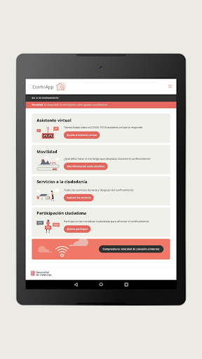
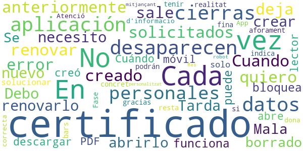

# COVID-related Android apps in Spain

Author: `Ivano Malavolta` (ivanomalavolta@gmail.com)

Created at: `2020/7/28`

Report generated by the [covid-apps-observer](http://github.com/covid-apps-observer) project, version 0.1

# Table of contents 

- [Background](#background)
    * [Data sources and analyses](#data-sources-and-analyses)
        * [App metadata](#app-metadata)
        * [Requested permissions](#requested-permissions)
        * [Mentioned servers](#mentioned_servers)
        * [Security analysis](#security_analysis)
        * [User ratings and reviews](#user-ratings-and-reviews)
    * [Disclaimer](#disclaimer)
- [WHO Info](#who-info)
- [COVID-19.eus](#covid-19.eus)
- [STOP COVID19 CAT](#stop-covid19-cat)
- [CONFINAPP](#confinapp)
- [GVA Responde](#gva-responde)
- [CoronaMadrid](#coronamadrid)
- [GVA Coronavirus](#gva-coronavirus)
- [Asistencia COVID-19](#asistencia-covid-19)
- [OpenWHO: Knowledge for Health Emergencies](#openwho-knowledge-for-health-emergencies)
- [CoronaTest Navarra](#coronatest-navarra)

- [Credits](#credits)

# How to read this report

This report has been generated by the [covid-apps-observer](http://github.com/covid-apps-observer) project. The project automatically analyzes the apps by extracting information which is already publicly available either on the web or in the apps binary files. 

Our analysis covers the following apps:
| | |
|-------------------------|-------------------------| 
|  | WHO Info
|  | COVID-19.eus
|  | STOP COVID19 CAT
|  | CONFINAPP
|  | GVA Responde
|  | CoronaMadrid
|  | GVA Coronavirus
|  | Asistencia COVID-19
|  | OpenWHO: Knowledge for Health Emergencies
|  | CoronaTest Navarra

The details of our analysis are presented in the remainder of this report.

For independent verification, the raw data and the source code of the project is publicly available in its GitHub repository [http://github.com/covid-apps-observer](http://github.com/covid-apps-observer) and its source code has been thoroughly commented in order to provide all the details about how the information provided in this report has been extracted. 

Any feedback, questions, and improvements about the project are very welcome, feel free to create an issue or pull request directly in its GitHub repository: [http://github.com/covid-apps-observer](http://github.com/covid-apps-observer).

## Data sources and analyses

The analysis of each app is structured around five main dimensions: 
* App metadata  
* Requested permissions
* Mentioned servers
* Androwarn analysis
* User ratings and reviews

In the following we describe the data sources and analysis performed for each dimension.

### App metadata

App metadata includes an overview of the main information about the app (for example, its name, releases, privacy policy, etc.), contact information of the development team, and the various Android versions supported by the app. This information is extracted from two main data sources:
* _Google Play store_: we automatically mined the web page of the Google Play store showing the basic information about the app and we parsed it in order to extract information about the app and development team 
* _Android Manifest file_: in our analysis we decompiled the binary file of the app (it is similar to a Zip archive but it contains the code of the app instead of normal files) and we extracted information about the supported Android versions, as it has been listed by its development team.

The extracted app metadata feeds the _App overview_, _Development team_, and _Android support_ sections of this report.
We make use of the [google-play-scraper](https://github.com/JoMingyu/google-play-scraper) tool for extracting the raw data related to this dimension of the project.

### Requested permissions

The Android operating system has a permission model which allows users to grant access to potentially privacy-related information. Every Android app has to explictly declare the permissions it needs to properly function in the Android Manifest file.  

In this report we also show the protection level of each permission, which is a key information for understanding how the requested permissions related to the user's privacy. We carefully analyzed the [official Android documentation (v. 29)](https://developer.android.com/reference/android/Manifest.permission), and it resulted that a permission requested by an Android app can belong to the following protection levels:
* **Dangerous**: higher-risk permissions that would give a requesting app access to private user data or control over the device that can negatively impact the user. Because this type of permission introduces potential risk, the system usually does not automatically grant it to the requesting app. For example, any dangerous permissions requested by an app may be displayed to the user and require confirmation before proceeding.
* **Normal**: this is the default and most common level in Android; normal permissions are lower-risk and give access to isolated app-level features, with minimal risk to other apps, the system, or the user. 
* **Signature**: permissions granted only if the requesting app is signed with the same certificate as the app that declared the permission
* **Appop**: old permission level, a reminiscence of the App Ops tool that Google introduced in Android 4.3.
* **Development**: optional permissions which can be granted to development-oriented apps.
* **Privileged**: permissions who give higher power to mobile apps w.r.t. other apps, such as binding to incoming calls, interacting via bluetooth with other devices without user interaction, etc.
* **Preinstalled**: reserved only for preinstalled apps
* **Installer**: allow the holder to start the permission usage screen for an app
* **RetailDemo**: permissions related to devices used in demonstrations in shops.
* **Pre23**: permissions automatically granted to apps targeting devices running pre-6.0 Android.
* **Upcoming**: permissions which will be released in the next version of the Android platform. 
* **Deprecated**: permissions belonging to old releases of the Android platform, they should not be used by developers since they will not be supported in the near future.
* **Not for use by third-party applications**: permissions which can be requested only by apps developed by Google.
* **Undefined**: this protection level is not documented by Google.

The permissions dimension of this project is based on the [Androguard](https://github.com/androguard/androguard) static analysis tool.

### Mentioned servers

We decompiled each app in order to look for all possible mentions of remote URLs. The mentioned URLs can refer to remote servers the the app is using for either sending or receiving information, web addresses for directing the user to an information website, and so on. 

:warning: It is important to note that this analysis is not meant to be complete and it is very prone to obfuscation. The servers reported here are simply _mentioned_ somewhere in the code of the app and are meant to just give an indication about the "hooks" of the app towards external resources. For example, for an Android app it is normal to contact Google services in order to send/receive push notifications, or to contact the servers of analytics services for having real-time diagnostics about crashes of the app or bugs.

This part of the analysis is based on the [Androguard](https://github.com/androguard/androguard) static analysis tool for identfying the raw URLs mentioned in the app; then, the information about each mentioned server is collected by performing a _whois_ lookup on the first-level domain present in the URL.

### Security analysis

This dimension is based on the [Androwarn](https://github.com/maaaaz/androwarn) structural and data flow analysis of Android bytecode. Androwarn is developed by the University of Lyon/INSA (France) and it has been used in several academic studies. According to its documentation, Androwarn targets the following categories of potential security issues:
* **Telephony identifiers exfiltration**: IMEI, IMSI, MCC, MNC, LAC, CID, operator's name, etc.
* **Device settings exfiltration**: software version, usage statistics, system settings, logs, etc.
* **Geolocation information leakage**: GPS/WiFi geolocation, etc.
* **Connection interfaces information exfiltration**: WiFi credentials, Bluetooth MAC adress, etc.
* **Telephony services abuse**: premium SMS sending, phone call composition, etc.
* **Audio/video flow interception**: call recording, video capture, etc.
* **Remote connection establishment**: socket open call, Bluetooth pairing, APN settings edit, etc.
* **PIM data leakage**: contacts, calendar, SMS, mails, clipboard, etc.
* **External memory operations**: file access on SD card, etc.
* **PIM data modification**: add/delete contacts, calendar events, etc.
* **Arbitrary code execution**: native code using JNI, UNIX command, privilege escalation, etc.
* **Denial of Service**: event notification deactivation, file deletion, process killing, virtual keyboard disable, terminal shutdown/reboot, etc.

Note: We do not consider this data point in the current version of our analyzers since it is too verbose for our purposes.

:warning: It is important to note that Androwarn is a static analysis tool, and as such it performs a variety of heuristics and approximations in its analyses. Said that, the results shown in this report are meant to provide an indication of _potential_ security issues and should be by no means treated as complete and correct.   

### User ratings and reviews

For this dimension we turn again to the web interface of the Google Play store. Firstly, we automatically mine summary statistics about user ratings from the web page of the app under analysis; then, we automatically download the newest 1000 reviews of the app under analysis. For each level of rating (5 stars, 4 stars, , etc., 1 star) we show:
- a word cloud presenting the main terms used by end users in their reviews in the Google Play store
- the last 10 reviews provided by app users in the Google Play store. 

This purposefully simple analysis is meant to help both future users and the development team of the app in understanding what are the main positive and negative points of the app under analysis.

We make use of the [google-play-scraper](https://github.com/JoMingyu/google-play-scraper) tool for extracting the raw data related to this dimension of the project.

## Disclaimer 

This report has been produced independently of any parties and its only objective is to help anybody in better understanding how COVID-related apps work in practice (and compare to each other). The results of this report are limited to the specific version of the software used for running the analyses and on the various heuristics implemented in there. In other words, the results of the analyzers may differ depending on the time and modalities in which they are executed. We do not guarantee that the results of the analyses and the corresponding contents of this report are fully complete or correct. The analysis software is licensed under the [MIT License](https://github.com/iivanoo/covid-apps-observer/blob/master/LICENSE).

# WHO Info
App version ``2.2.0``

Analyzed with [covid-apps-observer](http://github.com/covid-apps-observer) project, version ``0.1``

## App overview
| | |
|-------------------------|-------------------------| 
| **Name**&nbsp;&nbsp;&nbsp;&nbsp;&nbsp;&nbsp;&nbsp;&nbsp;&nbsp;&nbsp;&nbsp;&nbsp;&nbsp;&nbsp;&nbsp;&nbsp;&nbsp;&nbsp;&nbsp;&nbsp;&nbsp;&nbsp;&nbsp;&nbsp;&nbsp;&nbsp;&nbsp;&nbsp;&nbsp;&nbsp;&nbsp;&nbsp;&nbsp;&nbsp;&nbsp;&nbsp;&nbsp;&nbsp;&nbsp;&nbsp;  | WHO Info |
| **Unique identifier** | org.who.infoapp |
| **Link to Google Play** | [https://play.google.com/store/apps/details?id=org.who.infoapp](https://play.google.com/store/apps/details?id=org.who.infoapp) |
| **Summary**  | La aplicación oficial de información de la Organización Mundial de la Salud. |
| **Privacy policy** | [https://www.who.int/about/who-we-are/privacy-policy](https://www.who.int/about/who-we-are/privacy-policy) |
| **Latest version** | 2.2.0 |
| **Last update** | 2020-06-25 08:10:20 |
| **Recent changes** | Version 2.2.0 adds the Russian, Spanish, French and Chinese content produced by the World Health Organization global multi-lingual team. Arabic and regional content will be coming soon. |
| **Installs**  | 100.000+ |
| **Category** | Noticias y revistas |
| **First release** | 13 abr. 2020 |
| **Size**  | 8,0M |
| **Supported Android version**  | 4.2 y versiones posteriores |

### Description
> Have the latest health information at your fingertips with the official World Health Organization Information App. This app displays the latest news, events, features and breaking updates on outbreaks. 
  
 WHO works worldwide to promote health, keep the world safe, and serve the vulnerable. 
 Our goal is to ensure that a billion more people have universal health coverage, to protect a billion more people from health emergencies, and provide a further billion people with better health and well-being.

### User interface
The developers of the app provide the following screenshots in the Google play store.
| | | |
|:-------------------------:|:-------------------------:|:-------------------------:|
 |   |   |   | 
 |   |   |   | 
 |   |   |   | 
 |   |   |   | 
 |   |   |   | 
 |   |   |   | 
 |   |   |   | 
 |   |   |   | 

## Development team
In the following we report the main information provided by the development team in the Google play store.

| | |
|-------------------------|-------------------------|
| **Developer**  | World Health Organization |
| **Website**  | [https://www.who.int/](https://www.who.int/) |
| **Email** | dcx@who.int |
| **Physical address**  | [Avenu Appia 20 1211 Geneva Switzerland](https://www.google.com/maps/search/Avenu%20Appia%2020%201211%20Geneva%20Switzerland) (Google Maps) |
| **Other developed apps**  | [https://play.google.com/store/apps/developer?id=World+Health+Organization](https://play.google.com/store/apps/developer?id=World+Health+Organization) |

## Android support

| | |
|-------------------------|-------------------------|
| **Declared target Android version**  | Android10, version 10 (API level 29) |
| **Effective target Android version**  | Android10, version 10 (API level 29) |
| **Minimum supported Android version**  | Jelly Bean, version 4.2.x (API level 17) |
| **Maximum target Android version**  | - |

The larger the difference between the minimum and maximum supported Android versions, the better. A larger difference means a wider audience. For example, old phones have a very low Android version, so a high minimum supported Android version means that the app cannot be used by users with old phones, thus leading to accessibility problems. 

## Requested permissions

In the following we report the complete list of the permissions requested by the app. 

| **Permission** | **Protection level** | **Description** | 
|-------------------------|-------------------------|-------------------------|
 **android.permission INTERNET** | Normal | Allows applications to open network sockets. 
 **android.permission READ_CALENDAR** | :warning:**Dangerous** | Allows an application to read the user's calendar data. 
 **android.permission READ_EXTERNAL_STORAGE** | :warning:**Dangerous** | Allows an application to read from external storage. 
 **android.permission WRITE_CALENDAR** | :warning:**Dangerous** | Allows an application to write the user's calendar data. 
 **android.permission WRITE_EXTERNAL_STORAGE** | :warning:**Dangerous** | Allows an application to write to external storage. 

## Mentioned servers

| **Server** | **Registrant** | **Registrant country** | **Creation date** | 
|-------------------------|-------------------------|-------------------------|-------------------------|
-

## Security analysis 

Below we report the main security warnings raised by our execution of the [Androwarn](https://github.com/maaaaz/androwarn) security analysis tool.

**Connection interfaces exfiltration**
> - This application reads details about the currently active data network 
> - This application tries to find out if the currently active data network is metered 

**Suspicious connection establishment**
> - This application opens a Socket and connects it to the remote address 'Lfi/iki/elonen/NanoHTTPD$ResponseException;' on the 'N/A' port  
> - This application opens a Socket and connects it to the remote address 'NanoHttpd Shutdown' on the 'N/A' port  

**Code execution**
> - This application loads a native library: 'NativeScript' 
> - This application executes a UNIX command containing this argument: '2' 

## User ratings and reviews

Below we provide information about how end users are reacting to the app in terms of ratings and reviews in the Google Play store.

### Ratings

The WHO Info app has been installed by more than **100000** times. At this time, **699** rated the app and its average score is **3.62**. Below we show the distribution of the ratings across the usual star-based rating of Google Play

:star::star::star::star::star:: 412

:star::star::star::star:: 27

:star::star::star:: 34

:star::star:: 27

:star:: 195

### Reviews 

#### 5-star reviews

> 👍👍👍  :date: __2020-07-23 15:29:51__

> Que bueno que te gusta tanto e ste juego  :date: __2020-07-11 06:22:27__

> Gracias por la aplicación  :date: __2020-06-08 09:56:21__

> Emanuel Beltrán.  :date: __2020-05-30 04:29:30__

> Sirve  :date: __2020-05-29 19:28:16__

> Lo mejor  :date: __2020-05-27 03:36:07__

> No entiendo ni j esta en ingles  :date: __2020-05-23 03:10:59__

> Bueno  :date: __2020-05-18 14:01:19__

> 😷😷😷😷😷😷😷😷😦😧  :date: __2020-05-17 22:41:34__

> Me encanta 💜  :date: __2020-05-10 18:04:27__

#### 4-star reviews

> La aplicación viene con opción para cambiar el idioma... No se porque la gente no se molesta en indagar eso, la aplicación en sí esta muy bien  :date: __2020-07-09 21:29:22__

> Bueno  :date: __2020-06-29 07:08:43__

> I think you can create a version in Spanish, it's one of the most spoken languages around the world and we need an access in our own native language. Thanks for your effort, I remember an WHO News App some years ago and then it disappeared.  :date: __2020-05-24 03:28:52__

> Nomr intetesa  :date: __2020-04-28 07:09:55__

> Muy buena  :date: __2020-04-23 21:10:36__

#### 3-star reviews

> Un poco buena mas o meno  :date: __2020-07-16 04:50:52__

> Lautaro18  :date: __2020-05-13 06:07:11__

#### 2-star reviews

> Deseo encontrar buenas enseñansas para mejorar nuestras vidas .oquey  :date: __2020-06-28 22:17:04__

> Presta una ayuda buena  :date: __2020-05-07 20:16:33__

#### 1-star reviews

> ¡HORRIBLE!  :date: __2020-07-15 00:26:33__

> Esta en inglés que porquería de aplicación por eso 1 estrella  :date: __2020-05-29 00:06:33__

> Pues algo util para algunas cosas  :date: __2020-05-24 03:39:19__

> No está en español. No nos sirve a los hispano parlantes.  :date: __2020-05-20 14:13:49__

> No está en español  :date: __2020-05-20 12:35:15__

> La app es interesante pero yo no sé inglés. Pongan la posibilidad que pueda leerse en español porque soy lector de su página web y es muy interesante y más en éstos tiempos.  :date: __2020-05-19 00:45:01__

> No está en español  :date: __2020-05-14 22:12:38__

> No sirve en inglés deve de ser en español  :date: __2020-05-12 05:36:41__

> Esta en ingles no sirve para nada  :date: __2020-05-09 22:28:50__

> Haber si se toman la molestia de publicar en español latinoamericano, mnf  :date: __2020-05-07 03:04:32__

# COVID-19.eus
App version ``3.2``

Analyzed with [covid-apps-observer](http://github.com/covid-apps-observer) project, version ``0.1``

## App overview
| | |
|-------------------------|-------------------------| 
| **Name**&nbsp;&nbsp;&nbsp;&nbsp;&nbsp;&nbsp;&nbsp;&nbsp;&nbsp;&nbsp;&nbsp;&nbsp;&nbsp;&nbsp;&nbsp;&nbsp;&nbsp;&nbsp;&nbsp;&nbsp;&nbsp;&nbsp;&nbsp;&nbsp;&nbsp;&nbsp;&nbsp;&nbsp;&nbsp;&nbsp;&nbsp;&nbsp;&nbsp;&nbsp;&nbsp;&nbsp;&nbsp;&nbsp;&nbsp;&nbsp;  | COVID-19.eus |
| **Unique identifier** | com.erictelm2m.colabora |
| **Link to Google Play** | [https://play.google.com/store/apps/details?id=com.erictelm2m.colabora](https://play.google.com/store/apps/details?id=com.erictelm2m.colabora) |
| **Summary**  | Círculos de colaboración, para nuestra salud, para nuestro bienestar. |
| **Privacy policy** | [https://colaboro.erictel.com/privacy](https://colaboro.erictel.com/privacy) |
| **Latest version** | 3.2 |
| **Last update** | 2020-07-14 16:03:23 |
| **Recent changes** | - Adaptación para empresas y otros países - Corrección de pequeños bug y mejoras de rendimiento |
| **Installs**  | 50.000+ |
| **Category** | Medicina |
| **First release** | 27 mar. 2020 |
| **Size**  | 8,1M |
| **Supported Android version**  | 5.0 y versiones posteriores |

### Description
> COVID-19.eus es una aplicación colaborativa para gestionar la pandemia del COVID-19 en el ámbito de la comunidad autónoma vasca. La aplicación permite hacer un autodiagnóstico del contagio de COVID-19. En caso de ser positivo, el usuario se considerará POSIBLE contagio (según terminología de la OMS) y avisará a todo el cículo de personas, de tal forma que se considerarán en riesgo.
 Junto a esta información el sistema registrará ese dato, de tal forma que se puede seguir un rastro de contagios con esta funcionalidad de círculos. Junto con esta información, se pide el Código Postal, y en caso de infección comunitaria, se podrían también detectar focos de contagio.
 Esta información se utilizará para el análisis y el estudio epidemiológico.

### User interface
The developers of the app provide the following screenshots in the Google play store.
| | | |
|:-------------------------:|:-------------------------:|:-------------------------:|
 |   |  

## Development team
In the following we report the main information provided by the development team in the Google play store.

| | |
|-------------------------|-------------------------|
| **Developer**  | Osakidetza |
| **Website**  | - |
| **Email** | COVID19.APP@osakidetza.eus |
| **Physical address**  | - |
| **Other developed apps**  | [https://play.google.com/store/apps/developer?id=Osakidetza](https://play.google.com/store/apps/developer?id=Osakidetza) |

## Android support

| | |
|-------------------------|-------------------------|
| **Declared target Android version**  | Android10, version 10 (API level 29) |
| **Effective target Android version**  | Android10, version 10 (API level 29) |
| **Minimum supported Android version**  | Lollipop, version 5.0 (API level 21) |
| **Maximum target Android version**  | - |

The larger the difference between the minimum and maximum supported Android versions, the better. A larger difference means a wider audience. For example, old phones have a very low Android version, so a high minimum supported Android version means that the app cannot be used by users with old phones, thus leading to accessibility problems. 

## Requested permissions

In the following we report the complete list of the permissions requested by the app. 

| **Permission** | **Protection level** | **Description** | 
|-------------------------|-------------------------|-------------------------|
 **android.permission ACCESS_NETWORK_STATE** | Normal | Allows applications to access information about networks. 
 **android.permission CAMERA** | :warning:**Dangerous** | Required to be able to access the camera device. 
 **android.permission FOREGROUND_SERVICE** | Normal | Allows a regular application to use Service.startForeground. 
 **android.permission INTERNET** | Normal | Allows applications to open network sockets. 
 **android.permission READ_CONTACTS** | :warning:**Dangerous** | Allows an application to read the user's contacts data. 
 **android.permission RECEIVE_BOOT_COMPLETED** | Normal | Allows an application to receive the Intent.ACTION_BOOT_COMPLETED that is broadcast after the system finishes booting. 
 **android.permission WAKE_LOCK** | Normal | Allows using PowerManager WakeLocks to keep processor from sleeping or screen from dimming. 
 **android.permission WRITE_EXTERNAL_STORAGE** | :warning:**Dangerous** | Allows an application to write to external storage. 
 **com.google.android.c2dm.permission RECEIVE** | - | - 

## Mentioned servers

| **Server** | **Registrant** | **Registrant country** | **Creation date** | 
|-------------------------|-------------------------|-------------------------|-------------------------|
 | google.com | Google LLC | :us: US | 1997-09-15 04:00:00 |
 | erictel.com | MAM Objects S.L. | :es: ES | 1998-07-07 04:00:00 |
 | googleapis.com | Google LLC | :us: US | 2005-01-25 17:52:26 |

## Security analysis 

Below we report the main security warnings raised by our execution of the [Androwarn](https://github.com/maaaaz/androwarn) security analysis tool.

**Connection interfaces exfiltration**
> - This application reads details about the currently active data network 
> - This application tries to find out if the currently active data network is metered 

## User ratings and reviews

Below we provide information about how end users are reacting to the app in terms of ratings and reviews in the Google Play store.

### Ratings

The COVID-19.eus app has been installed by more than **50000** times. At this time, **583** rated the app and its average score is **3.47**. Below we show the distribution of the ratings across the usual star-based rating of Google Play

:star::star::star::star::star:: 186

:star::star::star::star:: 145

:star::star::star:: 93

:star::star:: 69

:star:: 87

### Reviews 

#### 5-star reviews

> Muy bien con la última actualización  :date: __2020-07-01 23:52:10__

> A mi tp me funciona desde hace 2-3 dias  :date: __2020-06-30 14:22:25__

> Esta vaatante currada para esta situacion, bien hecho 👍👍👍👍👍👍  :date: __2020-06-29 12:01:17__

> Regular  :date: __2020-06-16 16:36:15__

> Súper útil para evitar contagios y nuevos rebrotes!!  :date: __2020-06-11 09:18:56__

> Falta mas desarrollo pero veo constantes cambios que me dicen que mejorara la app. Puede darnos información muy útil si todos la usamos, y podría evitar q gente con riesgo se mezcle en ciertos sitios, supongo q para eso es el QR. Ya lo hicieron en China. Ademas tienes mucha información actualizada. Mis 5 estrellas para impulsarla y para que sigáis trabajando. Animo a los demás a hacer lo mismo. Hemos estado aplaudiendo a los sanitarios y podemos dar apoyar también con nuestro voto. Gracias.  :date: __2020-06-10 16:30:41__

> Es una pena que la gente no colabore por miedo a que nos controlen, pero no se dan cuenta que es una herramienta que puede ayudarnos a controlar la pandemia que es para lo que realmente está destinada....  :date: __2020-06-07 10:40:23__

> Bueno.  :date: __2020-06-07 10:29:20__

> Genial  :date: __2020-06-06 18:38:02__

> Imprescindible hoy en día.  :date: __2020-06-06 13:06:59__

#### 4-star reviews

> Esta Aplicación está bien que informa del coronas virus  :date: __2020-07-25 21:40:43__

> Me ha aparecido un mensaje que la sesión ha expirado, que desinstale y vuelva a instalar. Y sigue apareciendo ese mensaje que imposibilita un uso correcto. Se rogaría un arreglo o, al menos, una explicación en la ayuda de la app. Nota añadida: se ha arreglado sin que yo interviniera.  :date: __2020-07-12 00:54:07__

> En la última actualización salta un aviso que dice...la sesión ha expirado desinstala la app y vuelve a instalarla...ya lo he hecho y salta el mismo aviso!! Además ha desaparecido la imagen de perfil.  :date: __2020-06-29 20:20:45__

> Más sanidad y menos recortes  :date: __2020-06-07 19:58:52__

> Diagnóstico poco fiable  :date: __2020-06-07 14:48:49__

> Tan solo era trasmitir la situación del día  :date: __2020-06-07 12:24:54__

> No está mal dice que te orienta.  :date: __2020-06-07 11:23:23__

> Buena  :date: __2020-06-07 11:11:45__

> En cuanto tienes un síntoma ya te cambia de estado el primer día y puedes tener dolor de cabeza cosa normal ya te cambia de grado tiene que ser dos días consecutivos  :date: __2020-06-07 10:53:57__

> Muy buena  :date: __2020-06-07 10:51:56__

#### 3-star reviews

> No es muy intuitiva la verdad... Creo que no se está publicitando lo suficiente. Si la usamos 4 gatos, no va a servir de mucho. Yo me enteré y me la descargue porque me dijo mi hermano.  :date: __2020-07-22 00:58:53__

> Estaría bien que lo anunciaran en castellano, yo he llegado aquí por un anuncio en daylimotion y nos seguimos empeñando en que todo el mundo sabe euskera cuando no es así, castellano si que sabemos todos. Esto es de interés general, por favor, ponedle sentido y permitidnos enterarnos a la primera. Edito! Mirad la respuesta, me refería a la publicidad de la app, para contestar eso la verdad es que no se para que pagan a un community manager.  :date: __2020-07-01 11:20:50__

> He tenido el mismo problema de que pide reinstalar y no funciona. Hay que ir a aplicaciones, buscar esta aplicación, y en almacenamiento, borrar todos los datos del usuario. Después de esto funciona y mantiene los contactos  :date: __2020-06-30 11:39:10__

> Tenía instalada la aplicación, pero me avisa de que debo descargarla otra vez porque ha expirado, lo hago pero sigue diciéndome lo mismo.  :date: __2020-06-28 14:42:08__

> No puedo cambiar un familiar a home si vive en mi casa, si pudiese hacerlo le daría más estrellas  :date: __2020-06-11 10:47:28__

> Esta bien, Le falta mejoras como poder editar tu información y que se lea mejor el texto para que sea una aplicación familiar y confortable.  :date: __2020-06-08 03:08:14__

> No se, no le acabo de ver la utilidad  :date: __2020-06-07 13:04:02__

> Debería permitir saber qué contactos la tienen instalada.  :date: __2020-06-07 10:46:12__

> App en mejora. La verdad es que lo han actualizado constantemente y se agradece. Es funcional y útil si los de tu alrededor lo utilizan.  :date: __2020-06-07 10:33:23__

> La aplicación está bien, el objetivo es muy positivo, pero mo sirve de nada si nadie de mi alrededor lo tiene. Sería mas fácil que la aplicación te añadirá directamente los contactos que tienen la app, y los pusiera en tú círculo. En vez de andar enviando y aceptando solicitudes. Tambien podría tener acceso a la localización para saber por donde ha andado.  :date: __2020-06-05 14:56:39__

#### 2-star reviews

> Se necesita la colaboración y a veces es difícil convencer de la confidencialidad y hay rechazo a colaborar. Un poco más de propaganda de ella y su utilidad.  :date: __2020-07-09 20:05:24__

> Muy difícil de instalar  :date: __2020-07-07 09:34:02__

> Desde ayer no funciona. Dice que la sesión ha expirado y que la desinstale y la vuelva a instalar. A pesar de haberlo hecho varias veces no funciona. Por otro lado, a la hora de añadir personas a los círculos debería dar la posibilidad de añadirlos sin teléfono puesto que si son personas mayores seguramente o tienen un móvil o no tienen ninguno; y por otro lado, es posible que la gente de mis círculos no quiera que le lleguen notificaciones para instalar la app.  :date: __2020-06-28 18:03:44__

> A mi me sale que tengo 3 contagiados en mi zona no en mis conctactos eso como lo tengo que tomar  :date: __2020-06-10 23:59:50__

> La ultima actuallizacion no se me descarga  :date: __2020-06-10 11:56:18__

> Instalo y no me coje mi codigo postal, pone todo el rato el de otra localidad y no deja editar los datos para poner el cp correcto.  :date: __2020-06-08 11:33:07__

> Korapilatsua  :date: __2020-06-07 11:30:45__

> Yo doy a esta aplicación información diaria de mi estado. Para calcular mi riesgo la gente de mi entorno debe aportar su estado, pero no colabora por su propia decisión. Por tanto me sirve de poco.  :date: __2020-06-07 10:38:00__

> No puedo incluir a nadie. Tengo un Xiaomi 8  :date: __2020-06-04 19:24:57__

> Tengo muchos problemas para que los contactos a los que envío solicitud y la aceptan aparezcan reflejados en mis círculos. Mando la solicitud, me dicen que la confirman, pero no aparecen en la aplicación. Un saludo  :date: __2020-05-07 22:09:37__

#### 1-star reviews

> Penosa app, se rien en nuestra cara y ciertos comentarios los borran.  :date: __2020-07-01 10:53:30__

> Me dice que la sesión a expirado  :date: __2020-06-30 08:55:07__

> Mala actualización Me aparece un mensaje que la sesión ha expirado, que desistale y vuelva a intalarla. Así lo he hecho, pero sigue apareciendo el mismo mensaje  :date: __2020-06-29 17:32:54__

> La habéis vuelto a dejar inútil con la última actualización. Vuelvo a bajar la puntuación al mínimo.  :date: __2020-06-29 14:39:49__

> He instalado otra vez la app y me sigue apareciendo el mensaje de que ha expirado.. con lo cual no me deja hacer nada .  :date: __2020-06-29 11:07:08__

> No se si sirve de algo porque la ultima actualizacion me aparece con la fecha de la primera descarga. Algo pasa con la instalacion. Me dice que ha expirado, que "desinstale y vuelva a instalar," pero lo hago y sigue diciendo lo mismo. Que ocurre?  :date: __2020-06-28 15:50:50__

> Me dice que tengo que actualizar y, después de borrarla y volver a descargar, me vuelve a decir lo mismo. La quito porque no sirve para nada.  :date: __2020-06-27 16:04:01__

> Mala. No deja añadir los contactos a los círculos. El desarrollador @osakidetza.eus no responde los mails de problemas.  :date: __2020-06-18 11:12:42__

> La app es nueva aún; 1-pensar en el colectivo sordo, cómo comunicar por escrito,no podemos por voz, etc 2-en vez de invitar a gente para agregarlos, mejor mostrar lista de los contactos que están usando la app.  :date: __2020-06-07 10:56:57__

> Es una vergüenza como tiran el dinero en por ahí, lo lógico es utilizar la rutina de covid19 a través de bluetooth de Apple y Google, con mucha más privacidad y sin tener que crear ninguna red. Además lo lógico es que solo hubiera en Europa una app de seguimiento, es una vergüenza lo de las nacionalidades, comunidades y chiringuitos.  :date: __2020-06-06 12:24:56__

# STOP COVID19 CAT
App version ``2.0.3``

Analyzed with [covid-apps-observer](http://github.com/covid-apps-observer) project, version ``0.1``

## App overview
| | |
|-------------------------|-------------------------| 
| **Name**&nbsp;&nbsp;&nbsp;&nbsp;&nbsp;&nbsp;&nbsp;&nbsp;&nbsp;&nbsp;&nbsp;&nbsp;&nbsp;&nbsp;&nbsp;&nbsp;&nbsp;&nbsp;&nbsp;&nbsp;&nbsp;&nbsp;&nbsp;&nbsp;&nbsp;&nbsp;&nbsp;&nbsp;&nbsp;&nbsp;&nbsp;&nbsp;&nbsp;&nbsp;&nbsp;&nbsp;&nbsp;&nbsp;&nbsp;&nbsp;  | STOP COVID19 CAT |
| **Unique identifier** | cat.gencat.mobi.StopCovid19Cat |
| **Link to Google Play** | [https://play.google.com/store/apps/details?id=cat.gencat.mobi.StopCovid19Cat](https://play.google.com/store/apps/details?id=cat.gencat.mobi.StopCovid19Cat) |
| **Summary**  | La aplicación móvil de /Salut en relación al Covid-19 |
| **Privacy policy** | [http://sem.gencat.cat/ca/061CatSalutRespon/apps-mobils/STOPCOVID19/condicions-seguretat](http://sem.gencat.cat/ca/061CatSalutRespon/apps-mobils/STOPCOVID19/condicions-seguretat) |
| **Latest version** | 2.0.3 |
| **Last update** | 2020-06-18 17:58:24 |
| **Recent changes** | Mejoras en el proceso de registro |
| **Installs**  | 500.000+ |
| **Category** | Medicina |
| **First release** | 18 mar. 2020 |
| **Size**  | 7,9M |
| **Supported Android version**  | 5.0 y versiones posteriores |

### Description
> STOP COVID19 CAT es una aplicación móvil de /Salut con un doble objetivo:
 1. Dar respuesta a las necesidades de información de la ciudadanía en relación con el COVID-19, a través de un cuestionario que les indica si tienen posibilidad de tener COVID.
 2. Recoger datos de la población para poder crear mapas de calor para el cuadro de comandamiento.

### User interface
The developers of the app provide the following screenshots in the Google play store.
| | | |
|:-------------------------:|:-------------------------:|:-------------------------:|
 |   |   |   | 
 |   |  

## Development team
In the following we report the main information provided by the development team in the Google play store.

| | |
|-------------------------|-------------------------|
| **Developer**  | Generalitat de Catalunya |
| **Website**  | [https://salutweb.gencat.cat](https://salutweb.gencat.cat) |
| **Email** | mobilitat.ctti@gencat.cat |
| **Physical address**  | - |
| **Other developed apps**  | [https://play.google.com/store/apps/developer?id=Generalitat+de+Catalunya](https://play.google.com/store/apps/developer?id=Generalitat+de+Catalunya) |

## Android support

| | |
|-------------------------|-------------------------|
| **Declared target Android version**  | Android10, version 10 (API level 29) |
| **Effective target Android version**  | Android10, version 10 (API level 29) |
| **Minimum supported Android version**  | Lollipop, version 5.0 (API level 21) |
| **Maximum target Android version**  | - |

The larger the difference between the minimum and maximum supported Android versions, the better. A larger difference means a wider audience. For example, old phones have a very low Android version, so a high minimum supported Android version means that the app cannot be used by users with old phones, thus leading to accessibility problems. 

## Requested permissions

In the following we report the complete list of the permissions requested by the app. 

| **Permission** | **Protection level** | **Description** | 
|-------------------------|-------------------------|-------------------------|
 **android.permission ACCESS_BACKGROUND_LOCATION** | :warning:**Dangerous** | Allows an app to access location in the background. 
 **android.permission ACCESS_COARSE_LOCATION** | :warning:**Dangerous** | Allows an app to access approximate location. 
 **android.permission ACCESS_FINE_LOCATION** | :warning:**Dangerous** | Allows an app to access precise location. 
 **android.permission ACCESS_NETWORK_STATE** | Normal | Allows applications to access information about networks. 
 **android.permission INTERNET** | Normal | Allows applications to open network sockets. 
 **android.permission WAKE_LOCK** | Normal | Allows using PowerManager WakeLocks to keep processor from sleeping or screen from dimming. 
 **com.google.android.c2dm.permission RECEIVE** | - | - 
 **com.google.android.finsky.permission BIND_GET_INSTALL_REFERRER_SERVICE** | - | - 

## Mentioned servers

| **Server** | **Registrant** | **Registrant country** | **Creation date** | 
|-------------------------|-------------------------|-------------------------|-------------------------|
 | backendcovi2.net | Whois Privacy Service | :us: US | 2020-04-14 18:39:27 |
 | google.com | Google LLC | :us: US | 1997-09-15 04:00:00 |
 | googlesyndication.com | Google LLC | :us: US | 2003-01-21 06:17:24 |
 | app-measurement.com | Google LLC | :us: US | 2015-06-19 20:13:31 |
 | crashlytics.com | Google LLC | :us: US | 2011-01-21 15:30:40 |
 | googleapis.com | Google LLC | :us: US | 2005-01-25 17:52:26 |
 | googleadservices.com | Google LLC | :us: US | 2003-06-19 16:34:53 |

## Security analysis 

Below we report the main security warnings raised by our execution of the [Androwarn](https://github.com/maaaaz/androwarn) security analysis tool.

**Connection interfaces exfiltration**
> - This application reads details about the currently active data network 
> - This application tries to find out if the currently active data network is metered 

**Telephony services abuse**
> - This application makes phone calls 

**Suspicious connection establishment**
> - This application opens a Socket and connects it to the remote address ' returned no addresses for  ; port is out of range' on the 'N/A' port  
> - This application opens a Socket and connects it to the remote address '' on the 'N/A' port  
> - This application opens a Socket and connects it to the remote address 'Ljava/lang/StringBuilder;->toString()Ljava/lang/String;' on the 'N/A' port  
> - This application opens a Socket and connects it to the remote address 'Ljava/net/Proxy;->type()Ljava/net/Proxy$Type;' on the 'N/A' port  
> - This application opens a Socket and connects it to the remote address 'timeout' on the 'N/A' port  

## User ratings and reviews

Below we provide information about how end users are reacting to the app in terms of ratings and reviews in the Google Play store.

### Ratings

The STOP COVID19 CAT app has been installed by more than **500000** times. At this time, **1753** rated the app and its average score is **3.2126436**. Below we show the distribution of the ratings across the usual star-based rating of Google Play

:star::star::star::star::star:: 735

:star::star::star::star:: 161

:star::star::star:: 191

:star::star:: 70

:star:: 594

### Reviews 

#### 5-star reviews

> En mi opinión está bien que tengas que introducir tus datos para que Salut pueda contactar contigo y hacer el seguimiento,pero para mí sería perfecta ya si incorporase la función de Bluetooth para avisar de sintomáticos y/o positivos cercanos.  :date: __2020-07-22 13:01:04__

> Es muy necesaria y óptima debería de tenerla todo el mundo instalada y más ahora  :date: __2020-07-17 06:29:26__

> Ningun problema de conecsion  :date: __2020-06-21 16:11:09__

> Bién  :date: __2020-06-18 08:42:42__

> Buena  :date: __2020-06-17 10:03:23__

> Ja torna a funcionar, moltes gr맊ies, per la vostre resposta.  :date: __2020-06-14 21:29:30__

> Molt bona  :date: __2020-06-12 14:44:08__

> No me deja introducir el número de teléfono.  :date: __2020-06-08 15:08:56__

> Es una app molt util...  :date: __2020-06-02 21:43:49__

> Esta guau  :date: __2020-05-29 12:24:23__

#### 4-star reviews

> Necesaria para Prevenir Gracias  :date: __2020-07-21 17:40:01__

> No me deja poner el n° de tef, me sale que hay un error. La anterior era perfecta pero esta no funciona. El problema se a solucionado, ahora esta OK.  :date: __2020-06-12 20:44:26__

> Ha funcionat bé des de el primer día  :date: __2020-05-24 18:05:44__

> Haver perdut el gust i l'olfacte, que segons un estudi força ampli fet x una U. dels EE. UU., una de Su캥cia i diverses de la G Bretanya, que deveu con캥ixer, són m캥s importants x detectar qui ja l'ha passat o 캥s contagiar properament. Gr맊ies Senador J Cambra Int JIC  :date: __2020-05-19 13:57:13__

> Entiendo que es útil a nivel estadístico y que cuantas más personas la utilicemos mejor se colabora para establecer datos importantes.  :date: __2020-05-05 23:41:38__

> Incompleta, pero sirve para algo  :date: __2020-04-26 11:32:33__

> Estaría bien que recordase los datos para no introducirlos cada vez. Algunos síntomas bien podrían incluir una descripción más detallada de qué se considera ese síntoma. Puedo asegurar que si estás muy mal (según los síntomas) y dices que no puedes valerte por ti mismo en lo más básico te llaman, como el caso de mi madre  :date: __2020-04-12 16:40:09__

> Positiva  :date: __2020-04-08 13:45:06__

> Es lo que hay  :date: __2020-04-08 13:44:40__

> Util Para el seguimiento de síntomas que pudieran ser compatibles con coronavirus  :date: __2020-04-04 19:18:16__

#### 3-star reviews

> 👍👍👍  :date: __2020-07-15 23:38:35__

> Est bé que en la nova actualització et faci un historial, i així quedin guardades les dades, per aquells que la portem fent servir des del principi, on queden aquelles dades? Vaig deixar de fer-la servir un temps i ara em trobo que quan abans em deia cas probable de Covid ara em diu q no, posant els mateixos símptomes. Apart, l'historial me'l comptabilitza des d'avui quan en realitat vaig començar a fer-la servir al Març.  :date: __2020-06-18 10:18:35__

> Al fer una actualització de l'app s'esborren les dades introduïdes, especialment la referència de la tarja que es molt difícil de recordar. Solucionar aquest detall donaria confiança en l'app.  :date: __2020-06-11 21:00:11__

> En la nueva configuración de Google para saber quién está infectado y si has estado cerca, eso que nos han instalado a todo el país, dice que hay que dar permiso a la app de covid de nuestra comunidad para que nos avisen de posibles contactos con infectados. Esta app no tiene ajustes. Hay otra app de covid en nuestra comunidad?  :date: __2020-06-02 14:47:27__

> No ñellsimplemente  :date: __2020-05-29 21:40:28__

> Poco detallada  :date: __2020-05-16 19:48:31__

> A casa som 4 i solament guarda el CIP de l'últim. És podria buscar la forma de que els guardés  :date: __2020-04-26 10:44:04__

> Los síntomas se deberían describir y poder precisar mejor. Por ejemplo, 36'6 es fiebre? Y si se pone como fiebre, 쯤ué temperatura se debería poner, "36'5 o menos" o 37?  :date: __2020-04-23 11:46:06__

> Imposible fer el seguiment dels símptomes. L'aplicació falla constantment...  :date: __2020-04-17 21:45:08__

> trobo a faltar una opció a l inici pel cas de les persones que estan ngressades amb virus, que han estat donades d alta, que han obtingut un determinat resultat en un determinat tipus de test, etc Es a dir, només tracta el spossibles casos a l inici. I després ?  :date: __2020-04-13 11:25:02__

#### 2-star reviews

> Casi nunca funciona  :date: __2020-07-17 03:07:53__

> Em diu que nio tinc zip;)  :date: __2020-07-08 07:46:25__

> Introdueixo les dades pero despres quan confirmo no avança es queda aturat  :date: __2020-06-21 14:00:59__

> Dicen ke asi controlan a diario los datos y no los guarda ya me dirás tú ke manera de controlar.  :date: __2020-04-23 13:11:12__

> LO SIENTO PERO ES UNA COMPLETA INUTILIDAD. SI CLIKAS UNA DE LAS PRIMERAS, LA QUE SEA Y NINGUNA MAS EN TODO EL PPROCESO. AUTOMÁTICAMENTE TE DICE QUE TIENES SINTOMAS Y QUE TE QUEDES EN TU CASA Y PARACETAMOL. 1° SI TRABAJO COMO ME VOY A QUEDAR EN CASA? . QUE LE DICES AL JEFE ?(QUE ME QUEDO EN CASA PORQUE TENGO SINTOMAS. A LO QUE EL JEFE CON TODA RAZON DEL MUNDO TE DIRA TRAER BAJA DRL VIRUS.).AVER QUE HACES. PORQUE HACERTE LA PRUEBA ROTUNDAMENTE NO. SI NI SIQUIERA SE PONEN EN CONTACTO CON TIGO.  :date: __2020-04-10 09:06:41__

> Siempre da error de conexión  :date: __2020-04-05 13:25:16__

> No em serveix de res. Molt limitada en preguntes. Tinc mal de cap que em dura dias, sense febre. Doncs no és corona, és canvi de rutina, prenent ansiolítics.  :date: __2020-04-03 21:17:26__

> Falta mas desarroyo pero es un principio Seria mucho mas util un chat con profesionles medicos diario a las personas con sintomas.Me da bastantes fallos en las comunicaciones se bloquea pero igual es por la red.Lo intento mas tarde.  :date: __2020-04-01 16:41:46__

> No paráis de decirme que haga el seguimiento cada día pero cuando pongo el CIP me dice que no es correcto y con el dni no hace nada, a ver si lo hacéis mejor y solucionais esto  :date: __2020-04-01 15:49:43__

> Da error de conexión desde el sábado  :date: __2020-03-30 10:58:14__

#### 1-star reviews

> Es tal inútil como el servicio del 061. No contactan a través del app, como imposible hablar a través del servicio telefónico. Es una odisea la espera del 061 en Cataluña. Increíble que este gobierno catalán asuma una responsabilidad, acusando al gobierno central de ineptos y la Generalitat son tan inútiles como está app. Se les va de las manos los contagios y no son capaces de controlar a través de una aplicación u otro medio digital los posibles rebrotes del covid-19.  :date: __2020-07-26 11:59:39__

> Me interesa saber con esta aplicación si tenemos cerca algún infectado no si lo estoy yo y esta app no t lo dice  :date: __2020-07-21 07:18:13__

> No me abre la app.  :date: __2020-07-19 23:03:34__

> No sirve para nada  :date: __2020-07-18 13:47:29__

> No he tenido nada por ahora y dios quiera que no tenga nada gracias  :date: __2020-07-16 11:31:09__

> No puc accedir a l'aplicacio,. Un cop poso el codi de validació no em deixa avançar.  :date: __2020-07-08 12:28:43__

> De momento pongo una estrella 🌟 porque esta app solo sirve para uno mismo para ver si tienes algún síntoma. De momento no sirve para saber si estas cerca de alguien que pueda que sea portador de Covid-19.  :date: __2020-07-02 21:27:30__

> Penosa app, se rien en tu cara y ciertos comentarios los borran...  :date: __2020-07-01 10:52:39__

> No acepta mi numero de telefono dice que hay un erro  :date: __2020-06-27 06:15:08__

> Inutil  :date: __2020-06-14 02:53:54__

# CONFINAPP
App version ``1.0.0``

Analyzed with [covid-apps-observer](http://github.com/covid-apps-observer) project, version ``0.1``

## App overview
| | |
|-------------------------|-------------------------| 
| **Name**&nbsp;&nbsp;&nbsp;&nbsp;&nbsp;&nbsp;&nbsp;&nbsp;&nbsp;&nbsp;&nbsp;&nbsp;&nbsp;&nbsp;&nbsp;&nbsp;&nbsp;&nbsp;&nbsp;&nbsp;&nbsp;&nbsp;&nbsp;&nbsp;&nbsp;&nbsp;&nbsp;&nbsp;&nbsp;&nbsp;&nbsp;&nbsp;&nbsp;&nbsp;&nbsp;&nbsp;&nbsp;&nbsp;&nbsp;&nbsp;  | CONFINAPP |
| **Unique identifier** | cat.gencat.mobi.confinApp |
| **Link to Google Play** | [https://play.google.com/store/apps/details?id=cat.gencat.mobi.confinApp](https://play.google.com/store/apps/details?id=cat.gencat.mobi.confinApp) |
| **Summary**  | ConfinApp  facilita información sobre el confinamiento por el COVID-19 |
| **Privacy policy** | [http://politiquesdigitals.gencat.cat/ca/pgov_ambits_d_actuacio/administraciodigital/confinapp/politica-de-privacitat/](http://politiquesdigitals.gencat.cat/ca/pgov_ambits_d_actuacio/administraciodigital/confinapp/politica-de-privacitat/) |
| **Latest version** | 1.0.0 |
| **Last update** | 2020-04-07 17:22:27 |
| **Recent changes** | Versión inicial. |
| **Installs**  | 10.000+ |
| **Category** | Viajes y guías |
| **First release** | 7 abr. 2020 |
| **Size**  | 1,8M |
| **Supported Android version**  | 4.1 y versiones posteriores |

### Description
> El Departamento de Políticas Digitales y Administración Pública ha puesto en marcha ConfinApp, una aplicación que nace con la voluntad de convertirse en la herramienta de referencia para la ciudadanía para gestionar la fase de confinamiento y postconfinamiento.
 ConfinApp pretende ser un acompañamiento y la puerta de entrada a toda la información y servicios que el Gobierno de Cataluña pone a disposición de la ciudadanía, autónomos y empresas durante y después del confinamiento.
 Una de las principales funcionalidades es un asistente virtual basado en inteligencia artificial (IA), orientado a dar respuesta a las principales inquietudes o dudas que esta crisis genera entre la ciudadanía, desde aspectos relacionados con las medidas de higiene y salud ; los desplazamientos permitidos y prohibidos durante el Estado de Alarma; certificados y trámites administrativos; coberturas de seguros; aspectos tributarios; ayudas y medidas de apoyo a trabajadores, empresas y autónomos; dudas sobre el curso escolar, etc. Un asistente cognitivo que interactúa con los ciudadanos.
 ConfinApp incorpora, además del asistente, otras funcionalidades como la generación del certificado autorresponsable de desplazamiento en formato digital descargable, la posibilidad de adjuntar el certificado de empresas de servicios esenciales para los desplazamientos de las personas trabajadoras y un test de velocidad de conexión a Internet del usuario para conocer el estado de la conexión e identificar posibles incidencias.

### User interface
The developers of the app provide the following screenshots in the Google play store.
| | | |
|:-------------------------:|:-------------------------:|:-------------------------:|
 |   |   |   | 
 |   |   |   | 
 |   |   |   | 
 |   |   |   | 

## Development team
In the following we report the main information provided by the development team in the Google play store.

| | |
|-------------------------|-------------------------|
| **Developer**  | Generalitat de Catalunya |
| **Website**  | [http://politiquesdigitals.gencat.cat/ca/pgov_ambits_d_actuacio/administraciodigital/confinapp/](http://politiquesdigitals.gencat.cat/ca/pgov_ambits_d_actuacio/administraciodigital/confinapp/) |
| **Email** | mobilitat.ctti@gencat.cat |
| **Physical address**  | - |
| **Other developed apps**  | [https://play.google.com/store/apps/developer?id=Generalitat+de+Catalunya](https://play.google.com/store/apps/developer?id=Generalitat+de+Catalunya) |

## Android support

| | |
|-------------------------|-------------------------|
| **Declared target Android version**  | Android10, version 10 (API level 29) |
| **Effective target Android version**  | Android10, version 10 (API level 29) |
| **Minimum supported Android version**  | Jelly Bean, version 4.1.x (API level 16) |
| **Maximum target Android version**  | - |

The larger the difference between the minimum and maximum supported Android versions, the better. A larger difference means a wider audience. For example, old phones have a very low Android version, so a high minimum supported Android version means that the app cannot be used by users with old phones, thus leading to accessibility problems. 

## Requested permissions

In the following we report the complete list of the permissions requested by the app. 

| **Permission** | **Protection level** | **Description** | 
|-------------------------|-------------------------|-------------------------|
 **android.permission ACCESS_NETWORK_STATE** | Normal | Allows applications to access information about networks. 
 **android.permission INTERNET** | Normal | Allows applications to open network sockets. 
 **android.permission WAKE_LOCK** | Normal | Allows using PowerManager WakeLocks to keep processor from sleeping or screen from dimming. 
 **com.google.android.c2dm.permission RECEIVE** | - | - 
 **com.google.android.finsky.permission BIND_GET_INSTALL_REFERRER_SERVICE** | - | - 

## Mentioned servers

| **Server** | **Registrant** | **Registrant country** | **Creation date** | 
|-------------------------|-------------------------|-------------------------|-------------------------|
 | googlesyndication.com | Google LLC | :us: US | 2003-01-21 06:17:24 |
 | google.com | Google LLC | :us: US | 1997-09-15 04:00:00 |
 | app-measurement.com | Google LLC | :us: US | 2015-06-19 20:13:31 |
 | googleadservices.com | Google LLC | :us: US | 2003-06-19 16:34:53 |

## Security analysis 

Below we report the main security warnings raised by our execution of the [Androwarn](https://github.com/maaaaz/androwarn) security analysis tool.

**Connection interfaces exfiltration**
> - This application reads details about the currently active data network 

## User ratings and reviews

Below we provide information about how end users are reacting to the app in terms of ratings and reviews in the Google Play store.

### Ratings

The CONFINAPP app has been installed by more than **10000** times. At this time, **66** rated the app and its average score is **2.878788**. Below we show the distribution of the ratings across the usual star-based rating of Google Play

:star::star::star::star::star:: 23

:star::star::star::star:: 8

:star::star::star:: 1

:star::star:: 6

:star:: 28

### Reviews 

#### 5-star reviews

> Información detallada de utilidad sobre lo relacionado con Covid_19, desde ayudas a última hora  :date: __2020-07-17 13:40:23__

> Buena  :date: __2020-06-16 16:01:27__

> Molt bona  :date: __2020-05-04 22:06:55__

> Molt bona  :date: __2020-05-03 20:55:06__

> La millor manera per estar informat durant aquest període extraordinari  :date: __2020-04-29 00:02:02__

#### 4-star reviews

> De momento va bien  :date: __2020-05-12 11:26:45__

> Molt útil. Dona informació oficial i actualitzada. Permet accedir a les darreres novetats i eines útils per manegar la situació d'excepció  :date: __2020-05-08 09:31:56__

> No lo sé  :date: __2020-05-07 15:44:02__

> Correcta  :date: __2020-04-29 21:40:11__

#### 3-star reviews

No recent reviews available with 3 stars.

#### 2-star reviews

> En concret, a la Fase 1 indica que el bars podrán tenir un aforament fina el 30%...en realitat es del 50%>>>no se si la resta d'informacio que dona nos App es correcta  :date: __2020-05-07 14:41:43__

> Atenció mitjançant un robot. Res de personalitzat  :date: __2020-05-06 21:59:41__

#### 1-star reviews

> Penosa app, se rien en tu cara  :date: __2020-07-01 10:52:14__

> No puedo crear mi perfil Pongo lo que pide pero no me da la opción de finalizar mi perfil  :date: __2020-06-11 20:59:07__

> No va  :date: __2020-05-18 13:16:22__

> Una aplicació que no serveix per res. Fora de temps.  :date: __2020-05-09 21:45:11__

> Assisten virtual molt deficient....  :date: __2020-05-09 16:32:39__

> Tenia el justificante de empresa guardado y el de desplazamiento, y de un dia para otro se han borrado todos sin aviso, suerte que me ha dado por mirarlo y que no me han parado porque iba sin justificantes gracias a confinapp...  :date: __2020-05-08 23:01:50__

> estic demanant veure ajuts i no surt cap informació  :date: __2020-05-08 15:35:20__

> He instal췅lat l'aplicació per resoldre els dubtes dels horaris de passeig per edats, i el més que he trobat és el BOE. Molt pr맊tica com que no. Espavileu.  :date: __2020-05-07 19:30:06__

> En un principio generaba certificados ahora no lo hace y no me sirve para nada  :date: __2020-05-06 08:59:27__

> Fatal, li pregunto sobre animals de companyia, les normes i no hi ha manera de que em respongui. Desinstal-lo!  :date: __2020-05-05 12:31:40__

# GVA Responde
App version ``1.0.9``

Analyzed with [covid-apps-observer](http://github.com/covid-apps-observer) project, version ``0.1``

## App overview
| | |
|-------------------------|-------------------------| 
| **Name**&nbsp;&nbsp;&nbsp;&nbsp;&nbsp;&nbsp;&nbsp;&nbsp;&nbsp;&nbsp;&nbsp;&nbsp;&nbsp;&nbsp;&nbsp;&nbsp;&nbsp;&nbsp;&nbsp;&nbsp;&nbsp;&nbsp;&nbsp;&nbsp;&nbsp;&nbsp;&nbsp;&nbsp;&nbsp;&nbsp;&nbsp;&nbsp;&nbsp;&nbsp;&nbsp;&nbsp;&nbsp;&nbsp;&nbsp;&nbsp;  | GVA Responde |
| **Unique identifier** | es.gva.responde |
| **Link to Google Play** | [https://play.google.com/store/apps/details?id=es.gva.responde](https://play.google.com/store/apps/details?id=es.gva.responde) |
| **Summary**  | DUDAS FRECUENTES NO SANITARIAS SOBRE EL CORONAVIRUS |
| **Privacy policy** | [https://www.gva.es/es/inicio/nota_legal](https://www.gva.es/es/inicio/nota_legal) |
| **Latest version** | 1.0.9 |
| **Last update** | 2020-07-21 10:58:45 |
| **Recent changes** | Nuevo diseño. |
| **Installs**  | 10.000+ |
| **Category** | Comunicación |
| **First release** | 3 abr. 2020 |
| **Size**  | 3,8M |
| **Supported Android version**  | 4.4 y versiones posteriores |

### Description
> INFO COVID-19 GVA: GUIA DE ACTUACIÓN FRENTE AL COVID 19
 DUDAS FRECUENTES NO SANITARIAS SOBRE EL CORONAVIRUS
 La epidemia del Covid 19 ha generado una crisis global sin precedentes con un impacto inmenso para la sociedad en muy diversos ámbitos: económico, social, educativo,...
 La Consellería de Justicia, Interior y Administración Pública presenta la guía Info Covid19 GVA, que recoge las dudas más frecuentes no sanitarias generadas  por la ciudadanía, clasificadas por el ámbito de su impacto, y con las respuestas adaptadas al contexto de la Comunidad Valenciana.
 Esta información, de carácter meramente informativo, está en continua revisión.

### User interface
The developers of the app provide the following screenshots in the Google play store.
| | | |
|:-------------------------:|:-------------------------:|:-------------------------:|
 |   |   |   | 
 |   |   |   | 
 |   |   |   | 
 |   |   |   | 

## Development team
In the following we report the main information provided by the development team in the Google play store.

| | |
|-------------------------|-------------------------|
| **Developer**  | Generalitat Valenciana |
| **Website**  | [http://www.gva.es](http://www.gva.es) |
| **Email** | responde-app@gva.es |
| **Physical address**  | [Calle Democracia, Nº 77 Valencia (España)  CP: 46018](https://www.google.com/maps/search/Calle%20Democracia,%20Nº%2077%20Valencia%20(España)%20CP:%2046018) (Google Maps) |
| **Other developed apps**  | [https://play.google.com/store/apps/developer?id=6787972071287437379](https://play.google.com/store/apps/developer?id=6787972071287437379) |

## Android support

| | |
|-------------------------|-------------------------|
| **Declared target Android version**  | Android10, version 10 (API level 29) |
| **Effective target Android version**  | Android10, version 10 (API level 29) |
| **Minimum supported Android version**  | KitKat, version 4.4 - 4.4.4 (API level 19) |
| **Maximum target Android version**  | - |

The larger the difference between the minimum and maximum supported Android versions, the better. A larger difference means a wider audience. For example, old phones have a very low Android version, so a high minimum supported Android version means that the app cannot be used by users with old phones, thus leading to accessibility problems. 

## Requested permissions

In the following we report the complete list of the permissions requested by the app. 

| **Permission** | **Protection level** | **Description** | 
|-------------------------|-------------------------|-------------------------|
 **android.permission ACCESS_NETWORK_STATE** | Normal | Allows applications to access information about networks. 
 **android.permission CALL_PHONE** | :warning:**Dangerous** | Allows an application to initiate a phone call without going through the Dialer user interface for the user to confirm the call. 
 **android.permission INTERNET** | Normal | Allows applications to open network sockets. 
 **android.permission WAKE_LOCK** | Normal | Allows using PowerManager WakeLocks to keep processor from sleeping or screen from dimming. 
 **com.google.android.c2dm.permission RECEIVE** | - | - 
 **com.google.android.finsky.permission BIND_GET_INSTALL_REFERRER_SERVICE** | - | - 

## Mentioned servers

| **Server** | **Registrant** | **Registrant country** | **Creation date** | 
|-------------------------|-------------------------|-------------------------|-------------------------|
 | facebook.com | Facebook, Inc. | :us: US | 1997-03-29 05:00:00 |
 | google.com | Google LLC | :us: US | 1997-09-15 04:00:00 |
 | googlesyndication.com | Google LLC | :us: US | 2003-01-21 06:17:24 |
 | app-measurement.com | Google LLC | :us: US | 2015-06-19 20:13:31 |
 | googleapis.com | Google LLC | :us: US | 2005-01-25 17:52:26 |
 | googleadservices.com | Google LLC | :us: US | 2003-06-19 16:34:53 |

## Security analysis 

Below we report the main security warnings raised by our execution of the [Androwarn](https://github.com/maaaaz/androwarn) security analysis tool.

**Telephony identifiers leakage**
> - This application reads the numeric name (MCC+MNC) of current registered operator 
> - This application reads the operator name 

**Connection interfaces exfiltration**
> - This application reads details about the currently active data network 
> - This application tries to find out if the currently active data network is metered 

**Telephony services abuse**
> - This application makes phone calls 

**Pim data leakage**
> - This application accesses the contacts list 

## User ratings and reviews

Below we provide information about how end users are reacting to the app in terms of ratings and reviews in the Google Play store.

### Ratings

The GVA Responde app has been installed by more than **10000** times. At this time, **97** rated the app and its average score is **4.010309**. Below we show the distribution of the ratings across the usual star-based rating of Google Play

:star::star::star::star::star:: 63

:star::star::star::star:: 9

:star::star::star:: 3

:star::star:: 7

:star:: 15

### Reviews 

#### 5-star reviews

> Excelente  :date: __2020-05-29 07:43:47__

> Muy completa y útil.  :date: __2020-05-20 16:38:14__

> Información fiable y actualizada. Excelente aplicación  :date: __2020-05-19 19:28:45__

> Actualización completa y diaria de todo lo que nos afecta como ciudadanos. Muy útil.  :date: __2020-05-14 16:20:01__

> Interesante  :date: __2020-05-10 15:43:13__

> Muy útil y completa  :date: __2020-05-05 13:08:36__

> Muy útil  :date: __2020-04-30 14:33:02__

> Molta claredat en la informació  :date: __2020-04-30 11:16:38__

> Fácil de usar y de entender. Enhorabuena  :date: __2020-04-20 01:25:39__

> Be  :date: __2020-04-14 15:03:50__

#### 4-star reviews

> Pues gratamente sorprendida. Contiene informacion importante y bastante aclaratoria en esta locura de desescalada en la que no se aclara ni dios .... No le doy las 5 estrellas porque, bajo mi punto de vista, creo que le falta incluir las cifras diarias con la evolución de los contagios tanto de España como de la comunidad.  :date: __2020-05-24 13:47:13__

#### 3-star reviews

> Una pregunta:쯉e puede ir a las escuelas de bailes de salón? ahora que han terminado las fases. En el decreto del 19/06/2020, no aparece ninguna referencia.Y escuelas ya han empezado a funcionar.  :date: __2020-06-21 20:22:58__

#### 2-star reviews

> Esta completamente desfasada, los que pasan a la fase 1 no sabemos cómo obrar y comportarnos.  :date: __2020-05-10 18:59:19__

> Dónde está el seguimiento de contactos como dice el protocolo PDT-3 creo que sería bastante recomendable, gracias.  :date: __2020-05-01 10:04:18__

> 쯈ué pasa con las custodias compartidas? No he visto nada explicando eso.  :date: __2020-04-19 16:04:41__

> Buena idea aunque parece mentira que con los profesionales informáticos y diseñadores que tenemos se haga algo tan arcaico. Manifiestamente mejorable.  :date: __2020-04-04 10:40:59__

#### 1-star reviews

> Pobre, mala y encima se engancha. De vergüenza ajena.  :date: __2020-07-24 23:54:32__

> El desorden de su contenido hace que sea poco útil  :date: __2020-07-19 13:20:03__

> Penosa app, se rien en tu cara  :date: __2020-07-01 10:51:54__

> Ineficaz, las respuestas son confusas, ó, ineficaces.  :date: __2020-05-15 07:20:04__

> No me resuelve nada que no me diga las noticias ya....  :date: __2020-05-06 18:45:25__

> Pinches donde pinches no sale nada, sólo una pantalla en blanco. Buena idea sólo falta que funcione  :date: __2020-04-30 22:54:24__

> La instalo y no me deja ver nada .  :date: __2020-04-28 16:46:16__

> No se puede abrir, se detiene costantemente y se cierra  :date: __2020-04-14 23:21:05__

> He intentado abrir dos secciones, las primeras que me interesaban y se queda colgada cargando hasta el infinito y más allá. Arreglen esto por favor.  :date: __2020-04-14 12:28:21__

> La he instalado dos veces y no me funciona. Al abrir, sale un pequeño texto indicando para qué es y nada más.  :date: __2020-04-10 15:20:48__

# CoronaMadrid
App version ``1.1.0``

Analyzed with [covid-apps-observer](http://github.com/covid-apps-observer) project, version ``0.1``

## App overview
| | |
|-------------------------|-------------------------| 
| **Name**&nbsp;&nbsp;&nbsp;&nbsp;&nbsp;&nbsp;&nbsp;&nbsp;&nbsp;&nbsp;&nbsp;&nbsp;&nbsp;&nbsp;&nbsp;&nbsp;&nbsp;&nbsp;&nbsp;&nbsp;&nbsp;&nbsp;&nbsp;&nbsp;&nbsp;&nbsp;&nbsp;&nbsp;&nbsp;&nbsp;&nbsp;&nbsp;&nbsp;&nbsp;&nbsp;&nbsp;&nbsp;&nbsp;&nbsp;&nbsp;  | CoronaMadrid |
| **Unique identifier** | org.madrid.CoronaMadrid |
| **Link to Google Play** | [https://play.google.com/store/apps/details?id=org.madrid.CoronaMadrid](https://play.google.com/store/apps/details?id=org.madrid.CoronaMadrid) |
| **Summary**  | Aplicación para la detección y auto-evaluación del Coronavirus, o COVID-19 |
| **Privacy policy** | [https://www.coronamadrid.com/proteccion-de-datos](https://www.coronamadrid.com/proteccion-de-datos) |
| **Latest version** | 1.1.0 |
| **Last update** | 2020-06-25 19:53:43 |
| **Recent changes** | Posibilidad de realizar pruebas a familiares desde el mismo dispositivo |
| **Installs**  | 50.000+ |
| **Category** | Medicina |
| **First release** | 23 mar. 2020 |
| **Size**  | 3,3M |
| **Supported Android version**  | 5.1 y versiones posteriores |

### Description
> La aplicación móvil CoronaMadrid permite a sus usuarios poder detectar, informarse y contactar con las autoridades en cualquier fase de la concepción de la enfermedad COVID-19.
 El virus SARS-CoV-2, también conocido como Coronavirus está en fase de pandemia global y por esta razón nace CoronaMadrid, una aplicación que tiene la misión de ayudar a los ciudadanos a poder detectar si están siendo afectados por la enfermedad y obtener las mejores recomendaciones dependiendo de su estado. En caso de estado grave las autoridades serán conocedoras de la situación y podrán comunicarse directamente con el afectado.

### User interface
The developers of the app provide the following screenshots in the Google play store.
| | | |
|:-------------------------:|:-------------------------:|:-------------------------:|
 |   |   |   | 
 |   |   |   | 
 |   |   |   | 
 |  

## Development team
In the following we report the main information provided by the development team in the Google play store.

| | |
|-------------------------|-------------------------|
| **Developer**  | Comunidad de Madrid |
| **Website**  | [https://coronavirus.comunidad.madrid](https://coronavirus.comunidad.madrid) |
| **Email** | sanidadinforma@salud.madrid.org |
| **Physical address**  | - |
| **Other developed apps**  | [https://play.google.com/store/apps/developer?id=Comunidad+de+Madrid](https://play.google.com/store/apps/developer?id=Comunidad+de+Madrid) |

## Android support

| | |
|-------------------------|-------------------------|
| **Declared target Android version**  | Pie, version 9 (API level 28) |
| **Effective target Android version**  | Pie, version 9 (API level 28) |
| **Minimum supported Android version**  | Jelly Bean, version 4.1.x (API level 16) |
| **Maximum target Android version**  | - |

The larger the difference between the minimum and maximum supported Android versions, the better. A larger difference means a wider audience. For example, old phones have a very low Android version, so a high minimum supported Android version means that the app cannot be used by users with old phones, thus leading to accessibility problems. 

## Requested permissions

In the following we report the complete list of the permissions requested by the app. 

| **Permission** | **Protection level** | **Description** | 
|-------------------------|-------------------------|-------------------------|
 **android.permission ACCESS_COARSE_LOCATION** | :warning:**Dangerous** | Allows an app to access approximate location. 
 **android.permission ACCESS_FINE_LOCATION** | :warning:**Dangerous** | Allows an app to access precise location. 
 **android.permission ACCESS_NETWORK_STATE** | Normal | Allows applications to access information about networks. 
 **android.permission ACCESS_WIFI_STATE** | Normal | Allows applications to access information about Wi-Fi networks. 
 **android.permission INTERNET** | Normal | Allows applications to open network sockets. 
 **com.google.android.c2dm.permission RECEIVE** | - | - 
 **com.google.android.finsky.permission BIND_GET_INSTALL_REFERRER_SERVICE** | - | - 

## Mentioned servers

| **Server** | **Registrant** | **Registrant country** | **Creation date** | 
|-------------------------|-------------------------|-------------------------|-------------------------|
 | android.com | Google LLC | :us: US | 1997-06-23 04:00:00 |
 | googlesyndication.com | Google LLC | :us: US | 2003-01-21 06:17:24 |
 | google.com | Google LLC | :us: US | 1997-09-15 04:00:00 |
 | app-measurement.com | Google LLC | :us: US | 2015-06-19 20:13:31 |
 | facebook.com | Facebook, Inc. | :us: US | 1997-03-29 05:00:00 |
 | pinterest.com | DNStination Inc. | :us: US | 2009-11-26 19:21:23 |
 | twitter.com | Twitter, Inc. | :us: US | 2000-01-21 16:28:17 |
 | googleapis.com | Google LLC | :us: US | 2005-01-25 17:52:26 |
 | googleadservices.com | Google LLC | :us: US | 2003-06-19 16:34:53 |
 | crashlytics.com | Google LLC | :us: US | 2011-01-21 15:30:40 |

## Security analysis 

Below we report the main security warnings raised by our execution of the [Androwarn](https://github.com/maaaaz/androwarn) security analysis tool.

**Telephony identifiers leakage**
> - This application reads the numeric name (MCC+MNC) of current registered operator 
> - This application reads the operator name 
> - This application reads the phone number string for line 1, for example, the MSISDN for a GSM phone 

**Location lookup**
> - This application reads location information from all available providers (WiFi, GPS etc.) 

**Connection interfaces exfiltration**
> - This application reads details about the currently active data network 
> - This application tries to find out if the currently active data network is metered 

**Suspicious connection establishment**
> - This application opens a Socket and connects it to the remote address '' on the 'N/A' port  
> - This application opens a Socket and connects it to the remote address 'Ljava/lang/StringBuilder;->toString()Ljava/lang/String;' on the ': connect, resolve' port  
> - This application opens a Socket and connects it to the remote address 'Ljava/lang/StringBuilder;->toString()Ljava/lang/String;' on the 'N/A' port  
> - This application opens a Socket and connects it to the remote address 'Ljava/net/Proxy;->type()Ljava/net/Proxy$Type;' on the 'N/A' port  
> - This application opens a Socket and connects it to the remote address 'timeout' on the 'N/A' port  

**Pim data leakage**
> - This application accesses the downloads folder 
> - This application accesses data stored in the clipboard 

**Code execution**
> - This application loads a native library 
> - This application loads a native library: 'Ljava/util/Iterator;->next()Ljava/lang/Object;' 
> - This application loads a native library: 'crashlytics' 
> - This application executes a UNIX command containing this argument: '2' 

## User ratings and reviews

Below we provide information about how end users are reacting to the app in terms of ratings and reviews in the Google Play store.

### Ratings

The CoronaMadrid app has been installed by more than **50000** times. At this time, **339** rated the app and its average score is **3.0**. Below we show the distribution of the ratings across the usual star-based rating of Google Play

:star::star::star::star::star:: 118

:star::star::star::star:: 33

:star::star::star:: 37

:star::star:: 27

:star:: 122

### Reviews 

#### 5-star reviews

> Muy controlado  :date: __2020-07-24 00:04:41__

> Sencilla de utilizar y muy útil  :date: __2020-07-13 15:36:55__

> Te indica fácilmente si puedes tener coronavirus  :date: __2020-07-13 15:31:42__

> Ha sido muy facil de usar y muy práctica.  :date: __2020-07-08 21:14:07__

> Excelente, buen seguimiento.  :date: __2020-07-01 16:47:36__

> Funciona bien cumple lo que promete, ayuda al diagnóstico y a evitar riesgos  :date: __2020-06-27 14:18:58__

> En el centro de salud calle odonell no les dio la gana de hacerlo.con una oscultacion de 1 minuto la dictora ya te decia que no tenias nada .soy de riesgo y cronico .diabetico y con cancer como se explica esa actuacion tengo el nombre de la doctora si me pasa algo esta todo grabado .  :date: __2020-05-18 16:20:48__

> Mejorarla, meter más opciones de diagnóstico.  :date: __2020-05-09 17:01:13__

> Es una app estupenda para este momento  :date: __2020-05-01 13:22:48__

> Aplicación de control del virus, correcta  :date: __2020-04-29 14:49:30__

#### 4-star reviews

> Bien, estaba tranquilo y confiado en las pautas, gracias Javier  :date: __2020-07-04 11:22:48__

> Parece ser que la aplicación es buena pero cuando introduces o intenta introducir tu fecha de nacimiento no lo puede hacer correctamente por lo menos los que han nacido antes del 2007  :date: __2020-07-01 16:59:45__

> Buena  :date: __2020-07-01 16:28:31__

> Muy util  :date: __2020-06-23 17:50:47__

> Esta bien la aplicación para hacerte autotest de coronavirus pero espero que mejore más está aplicación  :date: __2020-05-29 01:23:56__

> Te va avisando de cuando puedes ir haciéndote el test de las preguntas. Te da pautas a seguir según el resultado que te haya dado  :date: __2020-04-23 17:45:23__

> Buena  :date: __2020-04-13 09:25:49__

> Me ayuda a despejar las dudas  :date: __2020-04-12 14:47:41__

> Buena y tranquilizadora  :date: __2020-04-12 11:18:14__

> Me parece muy bien, pero no es un juicio si no si no, tienen que dejar escribir algo periódicamente, porque puede ser que haya tenido dolor de cabeza 2 días no 15 días. Pero el esfuerzo está bien, entre todos podemos. Aplicación se podía un saludo  :date: __2020-04-09 13:09:58__

#### 3-star reviews

> La fecha de nacimiento debería poder teclearse. Podria dejar incluir resultado de una prueba de Covid.  :date: __2020-07-23 00:49:34__

> Sería más que adecuado, que en la próxima actualización se modificara la recomendación sobre las mascarillas (ya que desde el 21 de mayo su uso es obligatorio en muchos lugares, con independencia de si se tiene o no síntomas). Gracias.  :date: __2020-05-21 12:01:07__

> De qué me atiendan lo pondre  :date: __2020-05-06 13:23:50__

> El contestar Sí o No, no es suficiénte. A veces hay concretar algo  :date: __2020-04-16 21:04:02__

> Insuficiente.Faltan síntomas como dolor de cabeza, mareos,, conjuntivitis , mucha gente lo está pasando sin los síntomas que aparecen en esta App.  :date: __2020-04-16 08:17:52__

> Creo que deberian modificarla para incluir la pregunta: "쮿as sufrido una repentina perdida de olfato?" Segun parece esto se esta mostrando bastante indicativo de posible contagio por coronavirus.  :date: __2020-04-15 08:06:01__

> Deberían sacarla para toda españa...ni que el virus solo estuviera en madrid. Es buena pero incompleta.  :date: __2020-04-07 09:46:43__

> Estaria bien que pudieses cambiar en vez de madrid de donde tu seas  :date: __2020-04-06 17:04:21__

> donde te pregunta de escalofrios o el dolor del cuerop/muslos.......muy pesima la aplicacion...otra vez enganados por el estado.....verguenza ....en estta situation se burlean de la population....  :date: __2020-04-02 10:22:37__

> Echo en falta poder indicar si se trata de una persona que vive sola y no tiene red de apoyo en Madrid  :date: __2020-03-30 13:46:22__

#### 2-star reviews

> Necesita una mejora para facilitar el rastreo: una simple agenda donde podamos anotar, cada noche ( que notifique), dónde y con quien hemos estado. A falta de una app dedicada con tecnología GPS y Bluetooth, podría ayuda mucho  :date: __2020-07-26 09:34:13__

> Hacer introducir mes a mes la fecha de nacimiento a alguien que haya nacido por ejemplo hace 50 años (no quiero pensar si se está muriendo, o tiene 80 años) me parece una idea maravillosa.  :date: __2020-07-11 20:35:49__

> No se conecta con los servicios de Android de Covid para mandar alertas a los posibles contactos cercanos. Es algo que apenas cuesta y sirve para la trazabilidad de rebrotes... Que en la CCAA de Madrid los hay (aunque pequeños), y no se están trazando por falta de personal cualificado. Por favor Ayuso, aprovéchate de la tecnología que te hace el trabajo y además quedas bien... Si pudiste llevar el Twitter de un perro es lo menos que puedes hacer.  :date: __2020-06-27 17:03:46__

> Lo que te dice lo sabes de antemano  :date: __2020-05-12 16:01:06__

> No vale para mucho, no permite hacer un seguimiento real de la evolución de los síntomas. Muy limitado. Y quienes te llaman ni siquiera son sanitarios a los que se puedan consultarles dudas.  :date: __2020-05-04 22:58:45__

> El día 2/4/20 tuve unas alteraciones en mi salud que me inducen a pensar que tuve Covid19 empece a tomar paracetamol y me fue bajando la fiebre y los escalofríos, a todo esto me dijeron que con los datos que les di no podían evaluar si estaba contagiado. porque no hacen test masivos? a lo mejor lo he tenido de forma leve y he podido estar contagiando sin saberlo.  :date: __2020-05-04 10:59:47__

> Me parece que hacen muy pocas preguntas... Por ejemplo, no está el tema de los sarpullidos y picor en la piel, la diarrea, etc. El covid tiene más síntomas que la tos, fiebre y la falta de aire.  :date: __2020-04-25 23:27:59__

> La idea de la app es buena. Pero sabiéndose que hay otros síntomas de la enfermedad y que estos no se encuentran en las opciones, se resulta un tanto ineficaz para un real control.  :date: __2020-04-11 20:34:07__

> Por qué no aparece la anosmia como un sintoma si la incidencia es muy alta?  :date: __2020-04-11 18:25:41__

> No es Científica  :date: __2020-04-07 21:13:10__

#### 1-star reviews

> Tengo 63 años para poner mi edad me he quedado dormido, hay que pasar pantalla una a una por mes, hasta llegar a la fecha de nacimiento.  :date: __2020-07-20 23:51:55__

> Para poner tu fecha de nacimiento, tienes que ir bajando mes a mes desde hoy, hasta el día que naciste... A quién se le ha ocurrido?  :date: __2020-07-01 15:31:50__

> Penosa app, se rien en tu cara con esto, gobierno corrupto...  :date: __2020-07-01 10:50:27__

> Aplicación muy básica y prácticamente inútil. No es nada de lo que debiera ser una aplicación de este tipo.  :date: __2020-06-17 22:13:05__

> Inutil  :date: __2020-06-09 08:48:31__

> A fecha de hoy sigue sin recomendar la mascarilla cuando es de uso obligatorio. NO vale ni para las recomendaciones. Una pena que se gasten tanto dinero y no haya un mantenimiento diario de la aplicación.  :date: __2020-06-08 13:41:12__

> Basica muy basica. Solo sirve para diagnosticar. Un mes y no han echo nada aprendan de los Coreanos y Franceses  :date: __2020-05-28 09:05:45__

> La app está bien hecha y funciona bien, si no fuese porque a pesar de tener tres de los cuatro síntomas más comunes de la Covid-19, la app me dice que descarta que pueda tenerla. En el servicio de atención telefónica hacen las mismas preguntas y me dicen que como respiro bien, no puede ser covid, que vaya al médico.  :date: __2020-05-20 17:38:20__

> Inútil  :date: __2020-05-19 03:45:54__

> Muy básica. No vale de nada  :date: __2020-05-18 17:15:34__

# GVA Coronavirus
App version ``1.1.0``

Analyzed with [covid-apps-observer](http://github.com/covid-apps-observer) project, version ``0.1``

## App overview
| | |
|-------------------------|-------------------------| 
| **Name**&nbsp;&nbsp;&nbsp;&nbsp;&nbsp;&nbsp;&nbsp;&nbsp;&nbsp;&nbsp;&nbsp;&nbsp;&nbsp;&nbsp;&nbsp;&nbsp;&nbsp;&nbsp;&nbsp;&nbsp;&nbsp;&nbsp;&nbsp;&nbsp;&nbsp;&nbsp;&nbsp;&nbsp;&nbsp;&nbsp;&nbsp;&nbsp;&nbsp;&nbsp;&nbsp;&nbsp;&nbsp;&nbsp;&nbsp;&nbsp;  | GVA Coronavirus |
| **Unique identifier** | es.gva.coronavirus |
| **Link to Google Play** | [https://play.google.com/store/apps/details?id=es.gva.coronavirus](https://play.google.com/store/apps/details?id=es.gva.coronavirus) |
| **Summary**  | APP de la Conselleria de Sanitat Universal i Salut Pública sobre COVID-19. |
| **Privacy policy** | [http://coronavirusautotest.san.gva.es/proteccion-datos-es.html](http://coronavirusautotest.san.gva.es/proteccion-datos-es.html) |
| **Latest version** | 1.1.0 |
| **Last update** | 2020-06-19 14:43:04 |
| **Recent changes** | Esta versión menor posibilita a las personas sordas solicitar que atención primaria se ponga en contacto con ellos a través de la plataforma SVisual para poder comunicarse con el profesional mediante un vídeo intérprete, tanto en lenguaje de signos como por chat.  Asimismo, se ha incluido al inicio una pantalla de aviso con información y links relacionados con la política de protección de datos y se han realizado adaptaciones para mejorar la visualización en pantallas de baja resolución. |
| **Installs**  | 10.000+ |
| **Category** | Salud y bienestar |
| **First release** | 7 abr. 2020 |
| **Size**  | 5,5M |
| **Supported Android version**  | 4.4 y versiones posteriores |

### Description
> Aplicación móvil oficial de la Conselleria de Sanitat Universal i Salut Pública para solicitar cita con tu centro de salud en caso de presentar síntomas clínicos compatibles con infección por COVID-19.
 A través de la APP también se puede acceder a una amplia información sobre la infección causada por coronavirus COVID-19. 
 Los síntomas compatibles con infección por COVID-19 son síntomas de infección de vías respiratorias, estando presente uno o más de los siguientes: 
 - fiebre (más de 37º)
 - tos
 - estornudos
 - dolor de garganta 
 - dificultad respiratoria
 Si se han presentado estos síntomas en los últimos 14 días debes solicitar la cita mediante esta App.
 Si los síntomas que padeces revisten gravedad o tienes una emergencia llama al teléfono 112.
 Las citas a través de esta App están dirigidas a los casos posibles de infección COVID-19.
 La cita se solicita mediante la introducción de tu número SIP y la fecha de nacimiento, y realizando la confirmación del teléfono de contacto. 
 Recibirás una llamada en el plazo máximo de 24 horas desde la confirmación de la creación de la cita. En el caso de no recibirse la llamada en el plazo de 24 horas se puede volver a realizar la petición mediante la App o mediante llamada al teléfono 900 300 555.
 A través de la App se te informará del estado de la cita: solicitada, confirmada, realizada. 
 Si durante la primera llamada telefónica el profesional sanitario de tu centro de salud identifica tu caso como posible de COVID-19, el resto de citas telefónicas para efectuar el seguimiento de tu caso serán programadas por el profesional sanitario. A partir de ese momento, recibirás llamadas periódicas para verificar tu estado de salud y ayudarte en todas las dudas y necesidades que puedas presentar.
 Si presentas otros síntomas diferentes a los indicados, ponte en contacto con tu centro de salud a través de los teléfonos de cita previa habituales. 
 La Conselleria de Sanidad Universal y salud Pública  es la responsable y autora de la información que se muestra en la aplicación, además, garantiza la privacidad y protección de tus datos (http://coronavirusautotest.san.gva.es/proteccion-datos-es.html). Asimismo, la Conselleria garantiza que se almacenará y utilizará la información personal de un modo suficientemente seguro, durante el tiempo necesario y solo para proporcionarte los servicios personalizados anteriormente descritos.
 Para salvaguardar la información de la persona usuaria/paciente, esta aplicación usa el protocolo seguro HTTPS para todas las comunicaciones con los servidores.

### User interface
The developers of the app provide the following screenshots in the Google play store.
| | | |
|:-------------------------:|:-------------------------:|:-------------------------:|
 |   |   |   | 
 |   |   |   | 
 |   |  

## Development team
In the following we report the main information provided by the development team in the Google play store.

| | |
|-------------------------|-------------------------|
| **Developer**  | Generalitat Valenciana |
| **Website**  | [http://infocoronavirus.gva.es/](http://infocoronavirus.gva.es/) |
| **Email** | appsanitatcoronavirus@gva.es |
| **Physical address**  | [Calle Democracia, Nº 77 Valencia (España)  CP: 46018](https://www.google.com/maps/search/Calle%20Democracia,%20Nº%2077%20Valencia%20(España)%20CP:%2046018) (Google Maps) |
| **Other developed apps**  | [https://play.google.com/store/apps/developer?id=6787972071287437379](https://play.google.com/store/apps/developer?id=6787972071287437379) |

## Android support

| | |
|-------------------------|-------------------------|
| **Declared target Android version**  | Pie, version 9 (API level 28) |
| **Effective target Android version**  | Pie, version 9 (API level 28) |
| **Minimum supported Android version**  | KitKat, version 4.4 - 4.4.4 (API level 19) |
| **Maximum target Android version**  | - |

The larger the difference between the minimum and maximum supported Android versions, the better. A larger difference means a wider audience. For example, old phones have a very low Android version, so a high minimum supported Android version means that the app cannot be used by users with old phones, thus leading to accessibility problems. 

## Requested permissions

In the following we report the complete list of the permissions requested by the app. 

| **Permission** | **Protection level** | **Description** | 
|-------------------------|-------------------------|-------------------------|
 **android.permission INTERNET** | Normal | Allows applications to open network sockets. 

## Mentioned servers

| **Server** | **Registrant** | **Registrant country** | **Creation date** | 
|-------------------------|-------------------------|-------------------------|-------------------------|
 | gstatic.com | Google LLC | :us: US | 2008-02-11 15:31:25 |

## Security analysis 

Below we report the main security warnings raised by our execution of the [Androwarn](https://github.com/maaaaz/androwarn) security analysis tool.

-

## User ratings and reviews

Below we provide information about how end users are reacting to the app in terms of ratings and reviews in the Google Play store.

### Ratings

The GVA Coronavirus app has been installed by more than **10000** times. At this time, **35** rated the app and its average score is **3.3142858**. Below we show the distribution of the ratings across the usual star-based rating of Google Play

:star::star::star::star::star:: 19

:star::star::star::star:: 1

:star::star::star:: 1

:star::star:: 0

:star:: 14

### Reviews 

#### 5-star reviews

> Esta guauuu  :date: __2020-05-29 12:25:10__

> Esa aplicacion me gusta porque recargan a todos sus clientesy tambien por que esa aplicacio. Queda muy facil si usted o su papá o su mamá o su hermano etc. Usted puede llamar rapido al ospital y lo atienden rapido  :date: __2020-05-16 18:05:00__

> La app funciona genial, puedes pedir cita telefónica para que te llame tu medic@ de cabecera. Mucho mucho mucho más rápido que por la web, una vez registrado, puedes pedir cita en 2 seg, y cuando lo necesites, en la web no. También te dice si sigues en seguimiento o no. Hay mucha información sobre covid que está genial. La gente que ha valorado mal la app no le ha dedicado ni 1 min.  :date: __2020-04-23 11:48:11__

> Para información sobre el Virus funciona bien. Para pedir cita en caso de no ser para el virus, no hace falta llamar por teléfono como dice una opinión de más abajo, se puede pedir cita directamente desde la app GVA Salut, está explicado en la app y la he utilizado bastantes veces. Se puede elegir hora entre varias disponibles  :date: __2020-04-14 09:34:40__

> Clara y fácil de utilizar  :date: __2020-04-13 12:42:52__

> Eficaz  :date: __2020-04-11 15:20:29__

> La mejor App que he probado hasta ahora sobre el coronavirus. Muy intuitiva y con información muy práctica.  :date: __2020-04-08 14:26:12__

#### 4-star reviews

> Buenas noches. 쮿ay alguna posibilidad de acceder de una manera comoda a los datos de incidencia por municipios? Gracias.  :date: __2020-05-29 01:59:33__

#### 3-star reviews

No recent reviews available with 3 stars.

#### 2-star reviews

No recent reviews available with 2 stars.

#### 1-star reviews

> Mala  :date: __2020-07-05 18:02:44__

> Bien  :date: __2020-07-01 19:17:38__

> Penosa app, se rien en tu cara y ciertos comentarios los retiran...  :date: __2020-07-01 10:53:08__

> Ninguna finalidad,para pedir cita previa y nada más.  :date: __2020-06-18 22:41:38__

> Para el coronavirus es una castaña. Lo que hace falta de una vez es una implementación a nivel estatal o europeo, de la rutina de seguimiento mediante bluetooth de Apple y Google. Lo demás chapuzas sobre chapuzas  :date: __2020-06-11 02:37:02__

> Me quiero bajar la aplicación pero me pide un código ? Cual pongo? Me quedaba solo un intento . Gracias  :date: __2020-06-10 19:43:32__

> La he descargado porque no la conocia y he cometido un error ahora me van a llamr del ambulatorio pero no me da opcion a anular. Deberia de figurar esta opcion. Este servicio podia incluirse en la app normal y no ser necesario instalar una nueva. Solo cita tfno no entiendo una app solo exclusiva para eso y encima que no puedes anular cita.  :date: __2020-06-02 14:38:09__

> No me deja meter el sip  :date: __2020-04-21 11:26:17__

> Me parece increíble la discriminación. De la Generalidad Valenciana que si no eres de seguridad social no puedes usar esta aplicación funcionarios, policías y militares guardias civiles todos estos que que por decisión. Del estado y no propia tienen tarjetas de MUFACE MUGEJO IFAS todos estos también somos ciudadanos de la Comunidad Valencia y a esto añadir I migrantes y demás desfavorecidos, viviendo en valencia me está dando servicio la aplicación Catalana UNA VERGUENZA  :date: __2020-04-20 20:34:22__

> Solo sirve para rastrear  :date: __2020-04-19 10:25:21__

# Asistencia COVID-19
App version ``1.0.12``

Analyzed with [covid-apps-observer](http://github.com/covid-apps-observer) project, version ``0.1``

## App overview
| | |
|-------------------------|-------------------------| 
| **Name**&nbsp;&nbsp;&nbsp;&nbsp;&nbsp;&nbsp;&nbsp;&nbsp;&nbsp;&nbsp;&nbsp;&nbsp;&nbsp;&nbsp;&nbsp;&nbsp;&nbsp;&nbsp;&nbsp;&nbsp;&nbsp;&nbsp;&nbsp;&nbsp;&nbsp;&nbsp;&nbsp;&nbsp;&nbsp;&nbsp;&nbsp;&nbsp;&nbsp;&nbsp;&nbsp;&nbsp;&nbsp;&nbsp;&nbsp;&nbsp;  | Asistencia COVID-19 |
| **Unique identifier** | es.gob.asistenciacovid19 |
| **Link to Google Play** | [https://play.google.com/store/apps/details?id=es.gob.asistenciacovid19](https://play.google.com/store/apps/details?id=es.gob.asistenciacovid19) |
| **Summary**  | Aplicación para la auto-evaluación del COVID-19 y recomendaciones a seguir. |
| **Privacy policy** | [https://asistencia.covid19.gob.es/politica-de-privacidad](https://asistencia.covid19.gob.es/politica-de-privacidad) |
| **Latest version** | 1.0.12 |
| **Last update** | 2020-07-24 13:22:52 |
| **Recent changes** | - Mejoras en la accesibilidad - Correcciones y mejoras de rendimiento |
| **Installs**  | 50.000+ |
| **Category** | Salud y bienestar |
| **First release** | 5 abr. 2020 |
| **Size**  | 22M |
| **Supported Android version**  | 4.1 y versiones posteriores |

### Description
> Esta es una aplicación oficial del Gobierno de España en cooperación con las Comunidades Autónomas adheridas. Por favor, revisa la lista de Comunidades Adheridas en https://asistencia.covid19.gob.es/
  
 La aplicación Asistencia COVID-19 permite autoevaluarse sobre los posibles síntomas de la enfermedad infecciosa COVID-19 e informarse sobre las recomendaciones a seguir.
 La aplicación móvil Asistencia COVID-19 tiene como misión ayudar a la autoevaluación de los ciudadanos de la probabilidad de sufrir la enfermedad infecciosa COVID-19, con el objetivo de reducir el volumen de llamadas al número de emergencias sanitarias, informar a la población, permitir un triaje inicial de posibles casos y un seguimiento posterior por parte de las Autoridades Sanitarias.
  
 La utilización de la Aplicación no constituye un servicio de diagnóstico médico, de atención de urgencias o de prescripción de tratamientos farmacológicos. La utilización de la Aplicación no puede en ningún caso sustituir la consulta presencial personal frente a un profesional médico debidamente cualificado.

### User interface
The developers of the app provide the following screenshots in the Google play store.
| | | |
|:-------------------------:|:-------------------------:|:-------------------------:|
 |   |   |   | 
 |   |   |   | 
 |   |   |   | 
 |  

## Development team
In the following we report the main information provided by the development team in the Google play store.

| | |
|-------------------------|-------------------------|
| **Developer**  | Ministerio de Asuntos Económicos y Transf. Digital |
| **Website**  | [https://asistencia.covid19.gob.es](https://asistencia.covid19.gob.es) |
| **Email** | contacto@covid19.gob.es |
| **Physical address**  | - |
| **Other developed apps**  | [https://play.google.com/store/apps/developer?id=Ministerio+de+Asuntos+Econ%C3%B3micos+y+Transf.+Digital](https://play.google.com/store/apps/developer?id=Ministerio+de+Asuntos+Econ%C3%B3micos+y+Transf.+Digital) |

## Android support

| | |
|-------------------------|-------------------------|
| **Declared target Android version**  | Pie, version 9 (API level 28) |
| **Effective target Android version**  | Pie, version 9 (API level 28) |
| **Minimum supported Android version**  | Jelly Bean, version 4.1.x (API level 16) |
| **Maximum target Android version**  | - |

The larger the difference between the minimum and maximum supported Android versions, the better. A larger difference means a wider audience. For example, old phones have a very low Android version, so a high minimum supported Android version means that the app cannot be used by users with old phones, thus leading to accessibility problems. 

## Requested permissions

In the following we report the complete list of the permissions requested by the app. 

| **Permission** | **Protection level** | **Description** | 
|-------------------------|-------------------------|-------------------------|
 **android.permission ACCESS_COARSE_LOCATION** | :warning:**Dangerous** | Allows an app to access approximate location. 
 **android.permission ACCESS_FINE_LOCATION** | :warning:**Dangerous** | Allows an app to access precise location. 
 **android.permission ACCESS_NETWORK_STATE** | Normal | Allows applications to access information about networks. 
 **android.permission ACCESS_WIFI_STATE** | Normal | Allows applications to access information about Wi-Fi networks. 
 **android.permission INTERNET** | Normal | Allows applications to open network sockets. 
 **com.google.android.c2dm.permission RECEIVE** | - | - 
 **com.google.android.finsky.permission BIND_GET_INSTALL_REFERRER_SERVICE** | - | - 

## Mentioned servers

| **Server** | **Registrant** | **Registrant country** | **Creation date** | 
|-------------------------|-------------------------|-------------------------|-------------------------|
 | android.com | Google LLC | :us: US | 1997-06-23 04:00:00 |
 | googlesyndication.com | Google LLC | :us: US | 2003-01-21 06:17:24 |
 | google.com | Google LLC | :us: US | 1997-09-15 04:00:00 |
 | app-measurement.com | Google LLC | :us: US | 2015-06-19 20:13:31 |
 | facebook.com | Facebook, Inc. | :us: US | 1997-03-29 05:00:00 |
 | pinterest.com | DNStination Inc. | :us: US | 2009-11-26 19:21:23 |
 | twitter.com | Twitter, Inc. | :us: US | 2000-01-21 16:28:17 |
 | googleapis.com | Google LLC | :us: US | 2005-01-25 17:52:26 |
 | googleadservices.com | Google LLC | :us: US | 2003-06-19 16:34:53 |
 | crashlytics.com | Google LLC | :us: US | 2011-01-21 15:30:40 |

## Security analysis 

Below we report the main security warnings raised by our execution of the [Androwarn](https://github.com/maaaaz/androwarn) security analysis tool.

**Telephony identifiers leakage**
> - This application reads the numeric name (MCC+MNC) of current registered operator 
> - This application reads the operator name 
> - This application reads the phone number string for line 1, for example, the MSISDN for a GSM phone 

**Location lookup**
> - This application reads location information from all available providers (WiFi, GPS etc.) 

**Connection interfaces exfiltration**
> - This application reads details about the currently active data network 
> - This application tries to find out if the currently active data network is metered 

**Suspicious connection establishment**
> - This application opens a Socket and connects it to the remote address '' on the 'N/A' port  
> - This application opens a Socket and connects it to the remote address 'Ljava/lang/StringBuilder;->toString()Ljava/lang/String;' on the ': connect, resolve' port  
> - This application opens a Socket and connects it to the remote address 'Ljava/lang/StringBuilder;->toString()Ljava/lang/String;' on the 'N/A' port  
> - This application opens a Socket and connects it to the remote address 'Ljava/net/Proxy;->type()Ljava/net/Proxy$Type;' on the 'N/A' port  
> - This application opens a Socket and connects it to the remote address 'timeout' on the 'N/A' port  

**Pim data leakage**
> - This application accesses the downloads folder 
> - This application accesses data stored in the clipboard 

**Code execution**
> - This application loads a native library 
> - This application loads a native library: 'Ljava/util/Iterator;->next()Ljava/lang/Object;' 
> - This application loads a native library: 'crashlytics' 
> - This application executes a UNIX command containing this argument: '2' 

## User ratings and reviews

Below we provide information about how end users are reacting to the app in terms of ratings and reviews in the Google Play store.

### Ratings

The Asistencia COVID-19 app has been installed by more than **50000** times. At this time, **310** rated the app and its average score is **3.04**. Below we show the distribution of the ratings across the usual star-based rating of Google Play

:star::star::star::star::star:: 114

:star::star::star::star:: 37

:star::star::star:: 21

:star::star:: 18

:star:: 117

### Reviews 

#### 5-star reviews

> Buena aplicación solo falta que se la baje la gente  :date: __2020-07-25 20:04:15__

> Ya vuelve a funcionar bien. Gracias!  :date: __2020-07-16 16:13:21__

> Excelente  :date: __2020-07-11 19:57:53__

> Me intersa  :date: __2020-07-11 15:25:07__

> Decine  :date: __2020-06-30 15:31:40__

> Aplicación estupenda para vivir con la tranquilidad de sentirse protegida. Aprovecho para felicitar al Servicio Canario de Salud, a la sección de Rastreo y Comunicación, en biblioteca nacional. Las mujeres encargadas de hacer las pruebas del COVID han demostrado, además de ser EXCELENTES PROFESIONALES, tener mucho tacto,. delicadeza además de simpatía. Así da gusto hacerse las pruebas. Me alegraron el día. Muchas gracias.  :date: __2020-06-15 09:35:08__

> Me parece bien qur nos alerten cpn esta app Para eviar riesgos  :date: __2020-05-20 00:35:27__

> Ya era hora que hiciesen esta medida felicidades haber si la hacemos todos los Españoles yo en mi centro de salud no quisieron hacerme PCR teniendolos en el laboratorio hablo del dia 14 de mayo .no les da la gana de hacerlo y luego dicen en la comunidad de madrid que lo estan haciendo .digan a quien.  :date: __2020-05-18 16:16:28__

> Rastrearme cuanto más mejor, más seguro estaré yo y a los que quiero.  :date: __2020-05-10 07:22:28__

> Muy Buena App  :date: __2020-05-08 23:22:03__

#### 4-star reviews

> Estaria genial si incluyeran sintomas como perdida total de olfato y gusto y dolor de cabeza y poder incluir a personas dentro del ámbito familiar. Ya que hay mucha gente que hemos tenido sintomas y a los pocos días han tenido los mismos síntomas personas dentro de la unidad familiar.  :date: __2020-04-28 12:05:28__

> Deberían detallar algo más algunas preguntas de la evaluación. Por ejemplo que se entiende por contacto estrecho con un paciente positivo. Ya que en mi opinion genera bastantes dudas.  :date: __2020-04-27 21:37:59__

> Cómo se hará con quiénes aún no tienen NIE o DNI? Ejemplo mi mujer es venezolana llegamos hace 5 meses pero aún no salen sus papeles, en ese caso como se hará?  :date: __2020-04-24 00:08:24__

> Mi pregunta es tienes que tener la ubicación activo o algo ?  :date: __2020-04-13 09:01:46__

> Esta bastante bien pero con varias trabas para acceder.  :date: __2020-04-11 21:51:42__

> Para cuando en Andalucía??  :date: __2020-04-09 19:24:15__

> Preguntas, menos ambiguas. Algunas usuarios, estuvimos enfermos a finales de Febrero. Acudí a consulta, con varios síntomas. Prescripción de paracetamol y naranjas.  :date: __2020-04-09 12:30:29__

> Le faltan preguntas sobre otros posibles síntomas  :date: __2020-04-09 10:09:22__

> Hola. 쯉칩lo es posible el seguimiento de una persona?. Y para dar los datos del resto de componentes de la unidad familiar menores de edad y que no cuentan con dispositivos móviles?. Gracias por el esfuerzo.  :date: __2020-04-08 18:29:03__

> Por favor ¡Cuánto antes en Andalucía!  :date: __2020-04-08 09:26:01__

#### 3-star reviews

> Me esperaba algo más currado (posibles contactos con casos positivos, un mapa, etc)  :date: __2020-05-28 23:32:43__

> Esperaba con ella conseguir mas datos e informacion como en otras de mismas caracteristicas, por ejemplo si en tu zona es mayor o menor el riesgo de contagio por presencia en ella de positivos.  :date: __2020-04-28 10:48:13__

> Cuando llegara a Andalucía???  :date: __2020-04-22 22:47:56__

> Sólo si pones que tienes fiebre, tos o dificultad de respiración empieza a tomarte en serio como posible contagiado, dejando otros sintomas que aparecen en estadísticas.  :date: __2020-04-20 00:01:35__

> Faltan autonomías y síntomas q habría q añadir, esto es ridículo q haya 17 reinos de taifas en sanidad cuanto menos los datos de los pacientes debería estar compartida y tantas otras cosas como las vacunaciones...etc  :date: __2020-04-13 02:04:34__

> Se queda un poco corta la app. Podrían poner una casilla donde cada uno podría introducir otros síntomas como dolor en la garganta o falta de olfato.  :date: __2020-04-12 16:22:18__

> Orientativa  :date: __2020-04-09 10:40:28__

> Muy escueta y la autoevaluación es la misma sean personas vulnerables o de menos riesgo. Te preguntan patologías previas y luego no ahondan en ellas. Muy pobre  :date: __2020-04-08 17:27:47__

> Le faltan preguntas ,hay gente que sólo tiene febrícula ,y faltan algunos síntomas que está teniendo gente positiva como lo del olfato,mareos ...  :date: __2020-04-08 13:30:38__

> Está bien, pero el modelo a seguir tendría que ser el Coreano vía bluetooth.  :date: __2020-04-07 08:13:05__

#### 2-star reviews

> que pasa con galicia,no tenemos derecho a saber y protegernos?ya no me gusta se desprecia gran parte de España  :date: __2020-07-20 21:15:06__

> En cataluña porque no esta disponible  :date: __2020-07-01 20:37:46__

> Se entiende era libre de pagar y eso no és asį  :date: __2020-05-05 16:51:12__

> La veo muy encorsetada y poco actualizada a los síntomas...  :date: __2020-04-13 23:54:33__

#### 1-star reviews

> No es para toda España y el radar covid tampoco deberiais avanzar en estas cosas habiendo tantos rebrotes sirve para poco al menos para Castilla y leon  :date: __2020-07-27 17:28:39__

> no va  :date: __2020-07-21 05:39:37__

> No vale.  :date: __2020-07-11 15:37:08__

> No vale para nada.  :date: __2020-07-01 09:26:56__

> Esta autoevaluacion , en mi caso, no vale para nada. Ya di positivo en un test rápido privado, con el informe me fui al medico dé familia y no me hizo ni caso. Resultado 14 días más en casa y volver a pagar 65 euros para repetir el test. Ya he dado negativo. Preocupacion en la Seguridad Social por hacerme la PCR , NINGUNA.  :date: __2020-06-30 16:01:41__

> no vale absolutamente para nada esta aplicación es una castaña  :date: __2020-06-30 07:11:17__

> Para otras comunidades ejemplo Galicia para cuando?  :date: __2020-06-30 00:18:21__

> Eres una auténtica vergüenza que no haya una única app para controlar está pandemia a nivel nacional e incluso Europea. Lo lógico es utilizar la rutina de seguimiento de Google Apple y Huawei, lo demás sin chapuzas inservibles que desaparecerán en día días. Aunar esfuerzos y que Europa sirva para algo  :date: __2020-06-11 02:33:41__

> Galicia cuando???  :date: __2020-06-04 01:15:35__

> Sin test poco fiable, dar datos y valorar síntomas.  :date: __2020-06-02 08:04:16__

# OpenWHO: Knowledge for Health Emergencies
App version ``3.4``

Analyzed with [covid-apps-observer](http://github.com/covid-apps-observer) project, version ``0.1``

## App overview
| | |
|-------------------------|-------------------------| 
| **Name**&nbsp;&nbsp;&nbsp;&nbsp;&nbsp;&nbsp;&nbsp;&nbsp;&nbsp;&nbsp;&nbsp;&nbsp;&nbsp;&nbsp;&nbsp;&nbsp;&nbsp;&nbsp;&nbsp;&nbsp;&nbsp;&nbsp;&nbsp;&nbsp;&nbsp;&nbsp;&nbsp;&nbsp;&nbsp;&nbsp;&nbsp;&nbsp;&nbsp;&nbsp;&nbsp;&nbsp;&nbsp;&nbsp;&nbsp;&nbsp;  | OpenWHO: Knowledge for Health Emergencies |
| **Unique identifier** | de.xikolo.openwho |
| **Link to Google Play** | [https://play.google.com/store/apps/details?id=de.xikolo.openwho](https://play.google.com/store/apps/details?id=de.xikolo.openwho) |
| **Summary**  | Conocimiento que salva vidas para los respondedores de primera línea en emergencias de salud. |
| **Privacy policy** | [https://openwho.org/pages/privacy](https://openwho.org/pages/privacy) |
| **Latest version** | 3.4 |
| **Last update** | 2020-07-27 15:51:54 |
| **Recent changes** | - Bug fixes and performance improvements |
| **Installs**  | 1.000.000+ |
| **Category** | Educación |
| **First release** | 17 may. 2017 |
| **Size**  | 18M |
| **Supported Android version**  | 5.0 y versiones posteriores |

### Description
> OpenWHO is the World Health Organization's (WHO) interactive knowledge-transfer platform offering online courses to improve the response to health emergencies. OpenWHO enables the Organization and its key partners to transfer life-saving knowledge to large numbers of frontline responders.
 With OpenWHO, you have the flexibility to learn at your convenience. Watch the short video lectures and test your knowledge with self-tests when and where you like. The course forum and the collaboration space allow you to get in touch with other participants and experts around the world.
  
 Designed primarily for health care workers, frontline responders, and decision-makers, the app is also a source of information for those affected by disease outbreaks and health emergencies, or for those with a general interest in WHO's work in health emergencies.
  
 It features 6 channels:
 - The <b>Outbreak</b> channel addresses the management of infectious diseases and provides life-saving, scientific information.
 - The <b>Ready for Response</b> channel helps prepare personnel who are training for deployment to work in disease outbreaks and health emergencies.
 - The <b>Get Social</b> channel focuses on social science-based interventions and helps to communicate with affected communities.
 - The <b>Preparing for Pandemics</b> channel brings together courses on various aspects of preparedness, including surveillance, public health measures and risk communication during a pandemic.
 - The <b>COVID-19</b> channel provides learning resources in WHO's 6 official languages (Arabic, Chinese, English, French, Russian and Spanish) for health professionals, decision-makers and the public for the outbreak of coronavirus disease (COVID-19).
 - The <b>COVID-19 National Languages</b> channel provides the same learning resources as the COVID-19 channel but in national languages, such as Indonesian, Japanese and Portuguese. 
  
 OpenWHO courses are available in many languages, including WHO's 6 official languages. 
  
 Download the app now, and join the OpenWHO community.
 This app is developed in cooperation between the Hasso Plattner Institute and the WHO. The learning content is provided exclusively by the WHO.

### User interface
The developers of the app provide the following screenshots in the Google play store.
| | | |
|:-------------------------:|:-------------------------:|:-------------------------:|
 |   |   |   | 
 |   |   |   | 

## Development team
In the following we report the main information provided by the development team in the Google play store.

| | |
|-------------------------|-------------------------|
| **Developer**  | HPI Knowledge Engineering Team |
| **Website**  | [https://openwho.org/](https://openwho.org/) |
| **Email** | openwho-support@hpi.de |
| **Physical address**  | [Prof.-Dr.-Helmert-Str.2-3 14482 Potsdam](https://www.google.com/maps/search/Prof.-Dr.-Helmert-Str.2-3%2014482%20Potsdam) (Google Maps) |
| **Other developed apps**  | [https://play.google.com/store/apps/developer?id=7185448023325736337](https://play.google.com/store/apps/developer?id=7185448023325736337) |

## Android support

| | |
|-------------------------|-------------------------|
| **Declared target Android version**  | Android10, version 10 (API level 29) |
| **Effective target Android version**  | Android10, version 10 (API level 29) |
| **Minimum supported Android version**  | Lollipop, version 5.0 (API level 21) |
| **Maximum target Android version**  | - |

The larger the difference between the minimum and maximum supported Android versions, the better. A larger difference means a wider audience. For example, old phones have a very low Android version, so a high minimum supported Android version means that the app cannot be used by users with old phones, thus leading to accessibility problems. 

## Requested permissions

In the following we report the complete list of the permissions requested by the app. 

| **Permission** | **Protection level** | **Description** | 
|-------------------------|-------------------------|-------------------------|
 **android.permission ACCESS_NETWORK_STATE** | Normal | Allows applications to access information about networks. 
 **android.permission ACCESS_WIFI_STATE** | Normal | Allows applications to access information about Wi-Fi networks. 
 **android.permission FOREGROUND_SERVICE** | Normal | Allows a regular application to use Service.startForeground. 
 **android.permission INTERNET** | Normal | Allows applications to open network sockets. 
 **android.permission READ_EXTERNAL_STORAGE** | :warning:**Dangerous** | Allows an application to read from external storage. 
 **android.permission RECEIVE_BOOT_COMPLETED** | Normal | Allows an application to receive the Intent.ACTION_BOOT_COMPLETED that is broadcast after the system finishes booting. 
 **android.permission WAKE_LOCK** | Normal | Allows using PowerManager WakeLocks to keep processor from sleeping or screen from dimming. 
 **android.permission WRITE_EXTERNAL_STORAGE** | :warning:**Dangerous** | Allows an application to write to external storage. 
 **com.google.android.c2dm.permission RECEIVE** | - | - 
 **com.google.android.finsky.permission BIND_GET_INSTALL_REFERRER_SERVICE** | - | - 

## Mentioned servers

| **Server** | **Registrant** | **Registrant country** | **Creation date** | 
|-------------------------|-------------------------|-------------------------|-------------------------|
 | googlesyndication.com | Google LLC | :us: US | 2003-01-21 06:17:24 |
 | google.com | Google LLC | :us: US | 1997-09-15 04:00:00 |
 | app-measurement.com | Google LLC | :us: US | 2015-06-19 20:13:31 |
 | apple.com | Apple Inc. | :us: US | 1987-02-19 05:00:00 |
 | aomedia.org | Contact Privacy Inc. Customer 1243324949 | :canada: CA | 2015-08-24 14:07:31 |
 | dashif.org | VTM Group | :us: US | 2012-04-27 13:02:46 |
 | w3.org | W3C | :us: US | 1994-07-06 04:00:00 |
 | googleapis.com | Google LLC | :us: US | 2005-01-25 17:52:26 |
 | googleadservices.com | Google LLC | :us: US | 2003-06-19 16:34:53 |
 | psdev.de | - | - | - |
 | xmlpull.org | WhoisGuard, Inc. | PA | 2001-11-26 20:33:08 |
 | someurl.com | WhoisGuard, Inc. | PA | 2000-02-08 15:50:35 |
 | crashlytics.com | Google LLC | :us: US | 2011-01-21 15:30:40 |
 | apache.org | The Apache Software Foundation | :us: US | 1995-04-11 04:00:00 |
 | opensource.org | Open Source Initiative | :us: US | 1998-02-11 05:00:00 |
 | creativecommons.org | Creative Commons Corporation | :canada: CA | 2001-01-15 16:51:44 |
 | eclipse.org | Eclipse.org Foundation, Inc. | :canada: CA | 1997-04-14 04:00:00 |
 | gnu.org | Free Software Foundation | :us: US | 1995-11-24 05:00:00 |
 | mozilla.org | Mozilla Corporation | :us: US | 1998-01-24 05:00:00 |

## Security analysis 

Below we report the main security warnings raised by our execution of the [Androwarn](https://github.com/maaaaz/androwarn) security analysis tool.

**Telephony identifiers leakage**
> - This application reads the ISO country code equivalent of the current registered operator's MCC (Mobile Country Code) 

**Connection interfaces exfiltration**
> - This application reads details about the currently active data network 
> - This application tries to find out if the currently active data network is metered 

**Suspicious connection establishment**
> - This application opens a Socket and connects it to the remote address ' returned no addresses for  ; port is out of range' on the 'N/A' port  
> - This application opens a Socket and connects it to the remote address '' on the 'N/A' port  
> - This application opens a Socket and connects it to the remote address 'Ljava/lang/StringBuilder;->toString()Ljava/lang/String;' on the 'N/A' port  
> - This application opens a Socket and connects it to the remote address 'Ljava/net/Proxy;->type()Ljava/net/Proxy$Type;' on the 'N/A' port  
> - This application opens a Socket and connects it to the remote address 'timeout' on the 'N/A' port  

**Code execution**
> - This application loads a native library 
> - This application loads a native library: 'bypass' 

## User ratings and reviews

Below we provide information about how end users are reacting to the app in terms of ratings and reviews in the Google Play store.

### Ratings

The OpenWHO: Knowledge for Health Emergencies app has been installed by more than **1000000** times. At this time, **3049** rated the app and its average score is **4.278146**. Below we show the distribution of the ratings across the usual star-based rating of Google Play

:star::star::star::star::star:: 2069

:star::star::star::star:: 403

:star::star::star:: 191

:star::star:: 121

:star:: 262

### Reviews 

#### 5-star reviews

> Excelente  :date: __2020-07-26 02:27:39__

> Buenas app... La recomiendo  :date: __2020-07-18 16:32:54__

> Beppe VergaraAyala  :date: __2020-06-12 16:21:46__

> MObiSTARyAMiLEN.................(1977)  :date: __2020-06-10 19:23:01__

> Es La mejor para el desarrollo profesional de las personas especialmente de el área de la salud  :date: __2020-05-29 20:03:19__

> Esta guaiii  :date: __2020-05-29 12:25:30__

> Genial  :date: __2020-05-21 21:30:52__

> Me parece muy bien que Allan sacado una aplicación así me gustó mucho y quiero decirles gracias  :date: __2020-05-21 13:30:58__

> Excelente app  :date: __2020-05-08 13:54:41__

> Buenos contenidos de acceso gratis. Falta tener acceso a los documentos que están en inglés ya que leyendo los papper se va haciendo necesario leerlos cuando en el mismo te los recomiendan.  :date: __2020-04-28 12:40:29__

#### 4-star reviews

> Muy buena  :date: __2020-03-28 16:01:49__

> 0pcional primero veamos como funciona de todas maneras les doy 4 estrellas  :date: __2020-03-27 02:21:02__

#### 3-star reviews

> Es curioso como la gente condena una App como desastrosa porque está en inglés y no por su función. Además si uno se registra, si que está en múltiples idiomas, entre ellos el español, así es que los quejillas que vuelvan a hacer las cosas bien 😊  :date: __2020-04-03 00:08:27__

> Español nada  :date: __2020-03-24 20:29:41__

> En verdad no se puede cambiar el idioma, por alguna razón en la aplicación no aplica el cambio  :date: __2020-03-24 05:55:20__

#### 2-star reviews

> Es buena pero tree muchos idiomas  :date: __2020-06-27 00:29:53__

> No se puede cambiarcel idioma como areglar eso porfavor... deberia tener la configuracion  :date: __2020-03-30 03:41:16__

> Está en inglés estaría bueno que lo pongan en español  :date: __2020-03-23 21:46:19__

#### 1-star reviews

> Una basura.  :date: __2020-05-27 15:31:21__

> La aplicacion siempre dice que ocurre un problema para iniciar sesion, la web funciona bien.  :date: __2020-04-15 15:22:50__

> De que sirve esta basura si no muestra los casos  :date: __2020-04-15 05:30:41__

> No da toda la información requerida  :date: __2020-04-13 16:44:48__

> Malo  :date: __2020-04-10 10:05:54__

> Esta en ingles  :date: __2020-04-08 18:02:45__

> Fatal, lo peor que puede haber  :date: __2020-04-08 07:05:03__

> Mala  :date: __2020-04-07 17:39:22__

> Espantosa  :date: __2020-04-06 17:02:20__

> Como se cambia el idioma  :date: __2020-04-04 19:56:48__

# CoronaTest Navarra
App version ``2.2``

Analyzed with [covid-apps-observer](http://github.com/covid-apps-observer) project, version ``0.1``

## App overview
| | |
|-------------------------|-------------------------| 
| **Name**&nbsp;&nbsp;&nbsp;&nbsp;&nbsp;&nbsp;&nbsp;&nbsp;&nbsp;&nbsp;&nbsp;&nbsp;&nbsp;&nbsp;&nbsp;&nbsp;&nbsp;&nbsp;&nbsp;&nbsp;&nbsp;&nbsp;&nbsp;&nbsp;&nbsp;&nbsp;&nbsp;&nbsp;&nbsp;&nbsp;&nbsp;&nbsp;&nbsp;&nbsp;&nbsp;&nbsp;&nbsp;&nbsp;&nbsp;&nbsp;  | CoronaTest Navarra |
| **Unique identifier** | es.navarra.coronatestnavarra |
| **Link to Google Play** | [https://play.google.com/store/apps/details?id=es.navarra.coronatestnavarra](https://play.google.com/store/apps/details?id=es.navarra.coronatestnavarra) |
| **Summary**  | Auto-evaluación del COVID-19 y recomendaciones para ciudadanos de Navarra. |
| **Privacy policy** | [https://www.navarra.es/CoronaTest/index.html#/condiciones](https://www.navarra.es/CoronaTest/index.html#/condiciones) |
| **Latest version** | 2.2 |
| **Last update** | 2020-05-11 22:47:19 |
| **Recent changes** | -	Nueva sección para informar de contactos estrechos con infectados |
| **Installs**  | 5.000+ |
| **Category** | Salud y bienestar |
| **First release** | 4 abr. 2020 |
| **Size**  | 17M |
| **Supported Android version**  | 4.4 y versiones posteriores |

### Description
> App desarrollada por el Gobierno de Navarra cuyo objetivo es reducir el volumen de llamadas al número de emergencias sanitarias, tratar las dudas sobre la enfermedad infecciosa COVID-19 (de la familia de infecciones del Coronavirus), tranquilizar a la población, así como permitir un triaje inicial de posibles casos y un seguimiento posterior.

### User interface
The developers of the app provide the following screenshots in the Google play store.
| | | |
|:-------------------------:|:-------------------------:|:-------------------------:|
 |   |   |   | 
 |   |   |   | 

## Development team
In the following we report the main information provided by the development team in the Google play store.

| | |
|-------------------------|-------------------------|
| **Developer**  | Gobierno de Navarra |
| **Website**  | [https://www.navarra.es/coronatest/index.html](https://www.navarra.es/coronatest/index.html) |
| **Email** | contacto.CoronaTestNavarra@navarra.es |
| **Physical address**  | - |
| **Other developed apps**  | [https://play.google.com/store/apps/developer?id=Gobierno+de+Navarra](https://play.google.com/store/apps/developer?id=Gobierno+de+Navarra) |

## Android support

| | |
|-------------------------|-------------------------|
| **Declared target Android version**  | Pie, version 9 (API level 28) |
| **Effective target Android version**  | Pie, version 9 (API level 28) |
| **Minimum supported Android version**  | KitKat, version 4.4 - 4.4.4 (API level 19) |
| **Maximum target Android version**  | - |

The larger the difference between the minimum and maximum supported Android versions, the better. A larger difference means a wider audience. For example, old phones have a very low Android version, so a high minimum supported Android version means that the app cannot be used by users with old phones, thus leading to accessibility problems. 

## Requested permissions

In the following we report the complete list of the permissions requested by the app. 

| **Permission** | **Protection level** | **Description** | 
|-------------------------|-------------------------|-------------------------|
 **android.permission ACCESS_NETWORK_STATE** | Normal | Allows applications to access information about networks. 
 **android.permission INTERNET** | Normal | Allows applications to open network sockets. 
 **android.permission WRITE_EXTERNAL_STORAGE** | :warning:**Dangerous** | Allows an application to write to external storage. 

## Mentioned servers

| **Server** | **Registrant** | **Registrant country** | **Creation date** | 
|-------------------------|-------------------------|-------------------------|-------------------------|
 | whatsapp.com | Whatsapp Inc. | :us: US | 2008-09-04 12:39:12 |
 | gstatic.com | Google LLC | :us: US | 2008-02-11 15:31:25 |

## Security analysis 

Below we report the main security warnings raised by our execution of the [Androwarn](https://github.com/maaaaz/androwarn) security analysis tool.

**Connection interfaces exfiltration**
> - This application reads details about the currently active data network 
> - This application tries to find out if the currently active data network is metered 

**Telephony services abuse**
> - This application makes phone calls 

**Code execution**
> - This application loads a native library: 'sqlc-native-driver' 

## User ratings and reviews

Below we provide information about how end users are reacting to the app in terms of ratings and reviews in the Google Play store.

### Ratings

The CoronaTest Navarra app has been installed by more than **5000** times. At this time, **35** rated the app and its average score is **4.114286**. Below we show the distribution of the ratings across the usual star-based rating of Google Play

:star::star::star::star::star:: 23

:star::star::star::star:: 5

:star::star::star:: 1

:star::star:: 0

:star:: 6

### Reviews 

#### 5-star reviews

> Es muy útil no te miente la verdad  :date: __2020-07-07 21:08:04__

> ¡Muy útil! Muy buena iniciativa. Encantada con la nueva funcionalidad de seguimiento día a día de la enfermedad.  :date: __2020-04-13 10:50:23__

> Buena app, muy fácil de utilizar. Espero que haya siguientes versiones con más acciones. Además del test y consejos, me parece muy interesante saber cuántos casos hay en tiempo real.  :date: __2020-04-11 00:46:35__

> Muy útil, fácil de manejar y necesaria para evitar más contagios.  :date: __2020-04-09 16:50:45__

> Quería saber si esta aplicación vale para las personas que no tienen ningún síntoma y si es así, que vale estaría bien que lo diríais en todos los medios de comunicación, así habría un censo de quien lo padece y quien no Yo me la he descargado por esa razón. Enhorabuena  :date: __2020-04-08 22:54:30__

> Creo que es muy util y facil entendible  :date: __2020-04-08 19:05:19__

> Muy intuitiva!  :date: __2020-04-05 21:11:04__

> Ayuda a diagnosticar posibles casos positivos  :date: __2020-04-05 11:09:11__

> Útil  :date: __2020-04-05 10:57:45__

> Muy buena aplicación.  :date: __2020-04-05 10:41:08__

#### 4-star reviews

> Facil de usar y con la información necesaria. Creo que ayudaría alguna foto o dibujo explicativo.  :date: __2020-04-05 12:04:59__

#### 3-star reviews

> Pensaba que era como un radar  :date: __2020-07-05 21:37:17__

> La app muestra el teclado y no desaparece al pinchar en siguiente. La forma de solucionarlo es pinchar en la apertura de aplicaciones abiertas y volver a entrar, pero arreglen ese bug.  :date: __2020-04-06 14:49:58__

#### 2-star reviews

No recent reviews available with 2 stars.

#### 1-star reviews

> Penosa app, se rien en tu cara...  :date: __2020-07-01 10:51:35__

> Solo te dice si estás contagiado en función de que le respondas que tienes síntomas. No da información sobre número de contagiados en la zona ni nada en tiempo real  :date: __2020-05-27 08:17:55__

> Falta la opción tu tuviste síntomas tu pareja le an echo el test 5 semanas de su posible contagio y a dado positivo etc.  :date: __2020-04-28 00:28:42__

> Dos cosas. 쯋na app para algo repetisisimo en internet y que con una tabla o archivo pdf sería mas que suficiente? 쯄eter datos personales para realizar el test? Vaya recopilación de datos de la población!  :date: __2020-04-11 08:43:30__

> Me gustaría poder revisar las pautas recomendadas tras realizar el test, pero para ello me pide volver a realizarlo. Además ofrece muy poca información en comparación con la web. Poco útil para prevención e información.  :date: __2020-04-08 12:26:28__

> Más básica no puede ser, está demostrado que los síntomas de la gente pueden variar mucho y cambiar a lo largo de los días, y de los asintomaticos ni hablemos... Aquí te pregunta si tienes alguno de los 4 síntomas básicos y ala.  :date: __2020-04-05 16:53:05__

> La ultima cuestion puede llevar a error, en primera instancia entendi que tenia que marcar NO, en mi opinion tiene que avisar marcar solo en caso de. En general, no veo que sea una herramienta fiable, ni siquiera como ayuda al prediagnostico ni como herramienta de dispersion de la pandemia. Mas aun pienso que es un obstaculo a cualquier estrategia de mejora. Mi opinion.  :date: __2020-04-05 11:45:39__

# Credits

This project makes use of the following main third-party projects:
* Androguard: [https://github.com/androguard/androguard](https://github.com/androguard/androguard)
* Androwarn: [https://github.com/maaaaz/androwarn](https://github.com/maaaaz/androwarn)
* google_play_scraper: [https://github.com/JoMingyu/google-play-scraper](https://github.com/JoMingyu/google-play-scraper)
* whois: [https://github.com/DannyCork/python-whois](https://github.com/DannyCork/python-whois)
* BeautifulSoup: [https://www.crummy.com/software/BeautifulSoup](https://www.crummy.com/software/BeautifulSoup)

Other open-source projects used in this project include: 

- androguard==3.3.5
- appnope==0.1.0
- asn1crypto==1.3.0
- backcall==0.1.0
- beautifulsoup4==4.9.0
- bs4==0.0.1
- certifi==2020.4.5.1
- cffi==1.14.0
- chardet==3.0.4
- click==7.1.2
- colorama==0.4.3
- cryptography==2.9.2
- cycler==0.10.0
- decorator==4.4.2
- future==0.18.2
- google-play-scraper==0.0.3.0
- idna==2.9
- ipython==7.13.0
- ipython-genutils==0.2.0
- jedi==0.17.0
- Jinja2==2.11.2
- joblib==0.14.1
- kiwisolver==1.2.0
- lxml==4.5.0
- MarkupSafe==1.1.1
- matplotlib==3.2.1
- networkx==2.4
- nltk==3.5
- numpy==1.18.3
- parso==0.7.0
- pexpect==4.8.0
- pickleshare==0.7.5
- Pillow==7.1.2
- play-scraper==0.6.0
- prompt-toolkit==3.0.5
- ptyprocess==0.6.0
- pycountry==19.8.18
- pycparser==2.20
- pydot==1.4.1
- Pygments==2.6.1
- pyOpenSSL==19.1.0
- pyparsing==2.4.7
- python-dateutil==2.8.1
- regex==2020.4.4
- requests==2.23.0
- requests-futures==1.0.0
- six==1.14.0
- soupsieve==2.0
- tld==0.12.1
- tqdm==4.45.0
- traitlets==4.3.3
- urllib3==1.25.9
- wcwidth==0.1.9
- wordcloud==1.7.0

