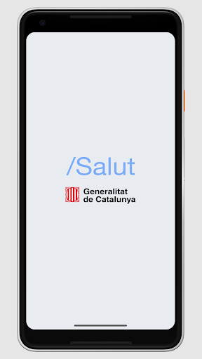
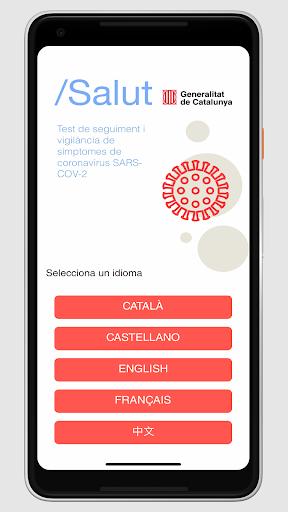
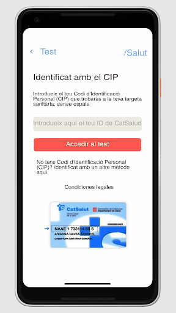
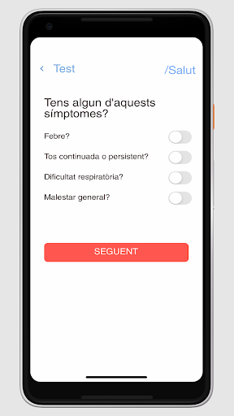
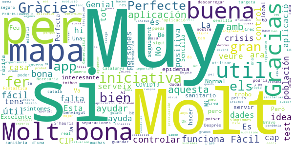
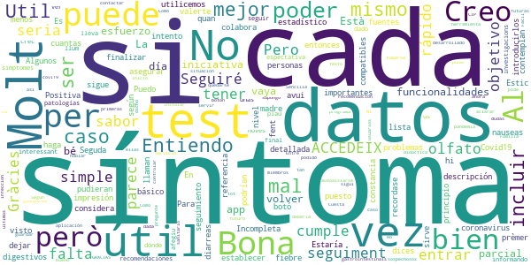
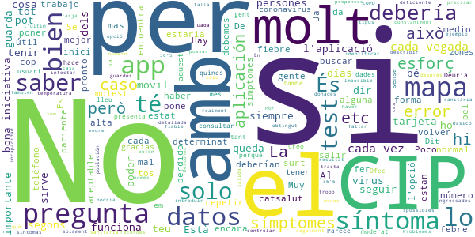
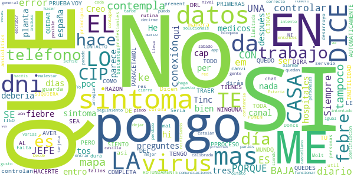
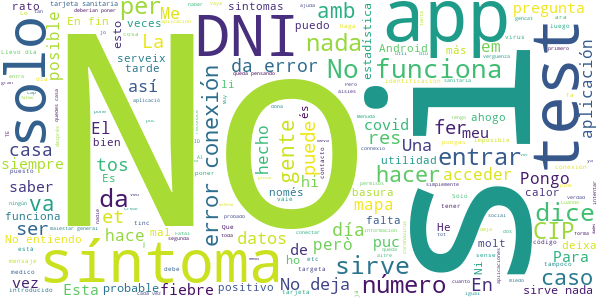

# STOP COVID19 CAT
App version ``1.0.2``

Analyzed with [covid-apps-observer](http://github.com/covid-apps-observer) project, version ``0.1``

## App overview
| | |
|-------------------------|-------------------------| 
| **Name**&nbsp;&nbsp;&nbsp;&nbsp;&nbsp;&nbsp;&nbsp;&nbsp;&nbsp;&nbsp;&nbsp;&nbsp;&nbsp;&nbsp;&nbsp;&nbsp;&nbsp;&nbsp;&nbsp;&nbsp;&nbsp;&nbsp;&nbsp;&nbsp;&nbsp;&nbsp;&nbsp;&nbsp;&nbsp;&nbsp;&nbsp;&nbsp;&nbsp;&nbsp;&nbsp;&nbsp;&nbsp;&nbsp;&nbsp;&nbsp;  | STOP COVID19 CAT |
| **Unique identifier** | cat.gencat.mobi.StopCovid19Cat |
| **Link to Google Play** | [https://play.google.com/store/apps/details?id=cat.gencat.mobi.StopCovid19Cat](https://play.google.com/store/apps/details?id=cat.gencat.mobi.StopCovid19Cat) |
| **Summary**  | STOP Covidien 19 CAT es la aplicación móvil de / Salud en relación al Covid19 |
| **Privacy policy** | [http://sem.gencat.cat/ca/061CatSalutRespon/apps-mobils/STOPCOVID19/condicions-seguretat](http://sem.gencat.cat/ca/061CatSalutRespon/apps-mobils/STOPCOVID19/condicions-seguretat) |
| **Latest version** | 1.0.2 |
| **Last update** | 2020-04-02 13:10:54 |
| **Recent changes** | Petites millores. |
| **Installs**  | 500.000+ |
| **Category** | Medicina |
| **First release** | 18 mar. 2020 |
| **Size**  | 3,2M |
| **Supported Android version**  | 6.0 y versiones posteriores |

### Description
> STOP COVID 19 CAT és una aplicació mòbil de /Salut amb un doble objectiu: 
 1.  Donar resposta a les necessitats  d'informació de la ciutadania en relació al COVID 19, a través d’un qüestionari que els indica si tenen possibilitat de tenir COVID.   
 2. Recollir dades de la població per tal de poder crear mapes de calor pel quadre de comandament.

### User interface
The developers of the app provide the following screenshots in the Google play store.
| | | |
|:-------------------------:|:-------------------------:|:-------------------------:|
 |   |   |   | 
 |  

## Development team
In the following we report the main information provided by the development team in the Google play store.

| | |
|-------------------------|-------------------------|
| **Developer**  | Generalitat de Catalunya |
| **Website**  | - |
| **Email** | mobilitat.ctti@gencat.cat |
| **Physical address**  | - |
| **Other developed apps**  | [https://play.google.com/store/apps/developer?id=Generalitat+de+Catalunya](https://play.google.com/store/apps/developer?id=Generalitat+de+Catalunya) |

## Android support

| | |
|-------------------------|-------------------------|
| **Declared target Android version**  | Pie, version 9 (API level 28) |
| **Effective target Android version**  | Pie, version 9 (API level 28) |
| **Minimum supported Android version**  | Marshmallow, version 6.0 (API level 23) |
| **Maximum target Android version**  | - |

The larger the difference between the minimum and maximum supported Android versions, the better. A larger difference means a wider audience. For example, old phones have a very low Android version, so a high minimum supported Android version means that the app cannot be used by users with old phones, thus leading to accessibility problems. 

## Requested permissions

In the following we report the complete list of the permissions requested by the app. 

| **Permission** | **Protection level** | **Description** | 
|-------------------------|-------------------------|-------------------------|
 **android.permission ACCESS_COARSE_LOCATION** | :warning:**Dangerous** | Allows an app to access approximate location. 
 **android.permission ACCESS_FINE_LOCATION** | :warning:**Dangerous** | Allows an app to access precise location. 
 **android.permission ACCESS_NETWORK_STATE** | Normal | Allows applications to access information about networks. 
 **android.permission INTERNET** | Normal | Allows applications to open network sockets. 
 **android.permission READ_EXTERNAL_STORAGE** | :warning:**Dangerous** | Allows an application to read from external storage. 
 **android.permission READ_PHONE_STATE** | :warning:**Dangerous** | Allows read only access to phone state, including the phone number of the device, current cellular network information, the status of any ongoing calls, and a list of any PhoneAccounts registered on the device. 
 **android.permission RECEIVE_BOOT_COMPLETED** | Normal | Allows an application to receive the Intent.ACTION_BOOT_COMPLETED that is broadcast after the system finishes booting. 
 **android.permission VIBRATE** | Normal | Allows access to the vibrator. 
 **android.permission WAKE_LOCK** | Normal | Allows using PowerManager WakeLocks to keep processor from sleeping or screen from dimming. 
 **android.permission WRITE_EXTERNAL_STORAGE** | :warning:**Dangerous** | Allows an application to write to external storage. 
 **com.google.android.c2dm.permission RECEIVE** | - | - 
 **com.google.android.finsky.permission BIND_GET_INSTALL_REFERRER_SERVICE** | - | - 

## Mentioned servers

| **Server** | **Registrant** | **Registrant country** | **Creation date** | 
|-------------------------|-------------------------|-------------------------|-------------------------|
 | googlesyndication.com | Google LLC | :us: US | 2003-01-21 06:17:24 |
 | google.com | Google LLC | :us: US | 1997-09-15 04:00:00 |
 | app-measurement.com | Google LLC | :us: US | 2015-06-19 20:13:31 |
 | amazonaws.com | Amazon.com, Inc. | :us: US | 2005-08-18 02:10:45 |
 | backendcovid19.net | Whois Privacy Service | :us: US | 2020-03-15 19:07:14 |
 | microsoft.com | Microsoft Corporation | :us: US | 1991-05-02 04:00:00 |
 | mubiquo.com | MUBIQUO APPS, SL  -B65214918 | :es: ES | 2009-05-29 10:23:57 |
 | googleapis.com | Google LLC | :us: US | 2005-01-25 17:52:26 |
 | googleadservices.com | Google LLC | :us: US | 2003-06-19 16:34:53 |

## Security analysis 

Below we report the main security warnings raised by our execution of the [Androwarn](https://github.com/maaaaz/androwarn) security analysis tool.

**Telephony identifiers leakage**
> - This application reads the ISO country code equivalent of the current registered operator's MCC (Mobile Country Code) 
> - This application reads the numeric name (MCC+MNC) of current registered operator 
> - This application reads the operator name 

**Connection interfaces exfiltration**
> - This application reads details about the currently active data network 

**Suspicious connection establishment**
> - This application opens a Socket and connects it to the remote address '' on the 'N/A' port  
> - This application opens a Socket and connects it to the remote address 'Ljava/lang/StringBuilder;->toString()Ljava/lang/String;' on the 'N/A' port  
> - This application opens a Socket and connects it to the remote address 'Ljava/net/Proxy;->type()Ljava/net/Proxy$Type;' on the 'N/A' port  
> - This application opens a Socket and connects it to the remote address 'timeout' on the 'N/A' port  

## User ratings and reviews

Below we provide information about how end users are reacting to the app in terms of ratings and reviews in the Google Play store.

### Ratings

The STOP COVID19 CAT app has been installed by more than **500000** times. At this time, **1609** rated the app and its average score is **3.06875**. Below we show the distribution of the ratings across the usual star-based rating of Google Play

:star::star::star::star::star:: 693

:star::star::star::star:: 70

:star::star::star:: 130

:star::star:: 80

:star:: 633

### Reviews 

#### 5-star reviews

> Esto es muy interesante para todos  :date: __2020-05-02 21:51:43__

> Perfecte  :date: __2020-05-01 14:19:52__

> La aplicación es muy útil para hacer el seguimiento del virus a nivel de población  :date: __2020-04-27 18:36:32__

> Le falta mucho pero para las 4 cosas que tiene las hace bien eso sí le falta muchísimo  :date: __2020-04-24 14:51:42__

> Si se hacen controles como en china iriamos mejor pues aqui en españa lo tenemos crudo el control sanitario  :date: __2020-04-23 17:09:23__

> Ja l'he probat, i funciona sí  :date: __2020-04-19 16:06:47__

> Molt important pel control i seguiment de la evolució de aquesta pandémia.! Bons consells oficials, guiats per a experts.  :date: __2020-04-17 14:40:23__

> Molt Bé  :date: __2020-04-16 21:09:02__

> Mi experiencia es más que positiva  :date: __2020-04-16 18:01:35__

> Molt util  :date: __2020-04-13 08:17:19__

#### 4-star reviews

> Entiendo que es útil a nivel estadístico y que cuantas más personas la utilicemos mejor se colabora para establecer datos importantes.  :date: __2020-05-05 23:41:38__

> Incompleta, pero sirve para algo  :date: __2020-04-26 11:32:33__

> Estaría bien que recordase los datos para no introducirlos cada vez. Algunos síntomas bien podrían incluir una descripción más detallada de qué se considera ese síntoma. Puedo asegurar que si estás muy mal (según los síntomas) y dices que no puedes valerte por ti mismo en lo más básico te llaman, como el caso de mi madre  :date: __2020-04-12 16:40:09__

> Positiva  :date: __2020-04-08 13:45:06__

> Es lo que hay  :date: __2020-04-08 13:44:40__

> Util Para el seguimiento de síntomas que pudieran ser compatibles con coronavirus  :date: __2020-04-04 19:18:16__

> Al finalizar el test no he visto que haga referencia a problemas digestivos como nauseas y diarreas y sí lo contemplan otras fuentes  :date: __2020-04-02 19:32:22__

> Estic fent el seguiment però avui, quan intento prèmer el botó ACCEDEIX AL TEST, No hi accedeix..  :date: __2020-04-01 13:34:18__

> No puedes dejar constancia si ya has tenido Covid19  :date: __2020-04-01 06:10:05__

> Seguda impresión. En principio, he puesto que tenía fiebre, menos de 36.5° y entonces sigue con una lista de síntomas y patologías. Al final me ha dado unas recomendaciones para seguir. Seguiré a la espectativa, a ver a dónde me lleva. Seguiré informando.  :date: __2020-03-28 16:51:35__

#### 3-star reviews

> A casa som 4 i solament guarda el CIP de l'últim. És podria buscar la forma de que els guardés  :date: __2020-04-26 10:44:04__

> Los síntomas se deberían describir y poder precisar mejor. Por ejemplo, ¿36'6 es fiebre? Y si se pone como fiebre, ¿qué temperatura se debería poner, "36'5 o menos" o 37?  :date: __2020-04-23 11:46:06__

> Imposible fer el seguiment dels símptomes. L'aplicació falla constantment...  :date: __2020-04-17 21:45:08__

> trobo a faltar una opció a l inici pel cas de les persones que estan ngressades amb virus, que han estat donades d alta, que han obtingut un determinat resultat en un determinat tipus de test, etc Es a dir, només tracta el spossibles casos a l inici. I després ?  :date: __2020-04-13 11:25:02__

> No solo los sintomas son importantes, estaria bien tambien saber si por el trabajo que tenemos somos mas propensos a infectar a mas gente.  :date: __2020-04-09 15:27:55__

> Problemes per identificar-me  :date: __2020-04-07 00:12:52__

> Desconec si la LOPD té alguna cosa a veure però, és realment molest tenir que introduïr cada vegada el número de tarjeta sanitària.  :date: __2020-04-05 16:54:40__

> estaria be que recordes el numero de tarja sanitaria. es molt molest haver-lo de possar cada vegada  :date: __2020-04-05 16:26:29__

> Muy deficiente y poco fiable.  :date: __2020-04-04 21:44:59__

> En test es muy básico. No tiene botón de salida de la aplicación, sólo uno de volver a repetir el test. Dada la incapacidad de controlar a la población por la falta de medios y organización es un indicador medio aceptable del estado general.  :date: __2020-04-01 10:33:41__

#### 2-star reviews

> Dicen ke asi controlan a diario los datos y no los guarda ya me dirás tú ke manera de controlar.  :date: __2020-04-23 13:11:12__

> LO SIENTO PERO ES UNA COMPLETA INUTILIDAD. SI CLIKAS UNA DE LAS PRIMERAS, LA QUE SEA Y NINGUNA MAS EN TODO EL PPROCESO. AUTOMÁTICAMENTE TE DICE QUE TIENES SINTOMAS Y QUE TE QUEDES EN TU CASA Y PARACETAMOL. 1° SI TRABAJO COMO ME VOY A QUEDAR EN CASA? . QUE LE DICES AL JEFE ?(QUE ME QUEDO EN CASA PORQUE TENGO SINTOMAS. A LO QUE EL JEFE CON TODA RAZON DEL MUNDO TE DIRA TRAER BAJA DRL VIRUS.).AVER QUE HACES. PORQUE HACERTE LA PRUEBA ROTUNDAMENTE NO. SI NI SIQUIERA SE PONEN EN CONTACTO CON TIGO.  :date: __2020-04-10 09:06:41__

> Siempre da error de conexión  :date: __2020-04-05 13:25:16__

> No em serveix de res. Molt limitada en preguntes. Tinc mal de cap que em dura dias, sense febre. Doncs no és corona, és canvi de rutina, prenent ansiolítics.  :date: __2020-04-03 21:17:26__

> Falta mas desarroyo pero es un principio Seria mucho mas util un chat con profesionles medicos diario a las personas con sintomas.Me da bastantes fallos en las comunicaciones se bloquea pero igual es por la red.Lo intento mas tarde.  :date: __2020-04-01 16:41:46__

> No paráis de decirme que haga el seguimiento cada día pero cuando pongo el CIP me dice que no es correcto y con el dni no hace nada, a ver si lo hacéis mejor y solucionais esto  :date: __2020-04-01 15:49:43__

> Da error de conexión desde el sábado  :date: __2020-03-30 10:58:14__

> Lleva 2 días sin funcionar...  :date: __2020-03-29 16:57:39__

> Creo que no está muy bien calibrada. He puesto que tengo malestar general, sin tos, ni fiebre ni otro síntoma y ya me dice que tengo el virus... Estaria bien arreglar eso para no alarmar a la gente  :date: __2020-03-25 09:01:46__

> He intentado entrar varias veces en catalán y en castellano, incluso reiniciando el teléfono, pero siempre que marco la casilla para escribir el numero de la tarjeta de me cierra la app, que puedo hacer?  :date: __2020-03-24 09:41:33__

#### 1-star reviews

> Fatal, ya puedes intentar a diferentes horas del día que no funciona, eso sí, me a ayudado a memorizar mi targeta sanitaria de tantas veces ingresarla. Gracias¡  :date: __2020-05-08 22:16:50__

> No tiene ninguna utilidad  :date: __2020-05-07 23:55:19__

> Si sirviera para llevar control de asintomáticos o contagios... Pero para que sirve?  :date: __2020-05-05 14:18:09__

> La aplicació és poc accessible  :date: __2020-04-30 14:24:34__

> Muy Sencilla, y es muy molesto q no recuerde los datos del usuario por eso entrar cada vez se hace pesado  :date: __2020-04-29 15:40:12__

> Aplicació sense accessibilitat. Que trist que una aplicació feta pel govern no prengui cura en aquests detalls. Jo no la puc fer servir. Si usted plau corregiu-la.  :date: __2020-04-28 21:53:46__

> patética  :date: __2020-04-26 08:31:27__

> Meto DNI y no accede. la La he desistalado  :date: __2020-04-22 22:49:55__

> Només va funcionar el primer dia. Surt error totes les altres vegades que vull notificar canvis en el meu estat de salut.  :date: __2020-04-20 10:58:12__

> Donde pone síntomas, faltan algunos, como por ejemplo el de la falta de olfato y gusto, y otros relacionados con la piel, así que considero que no es muy fiable esta aplicación  :date: __2020-04-19 20:21:14__

