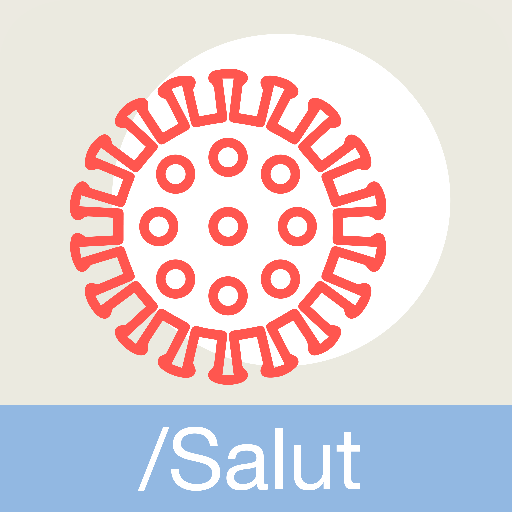
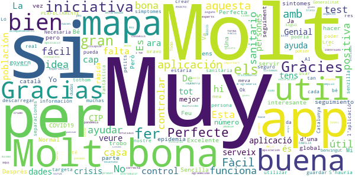
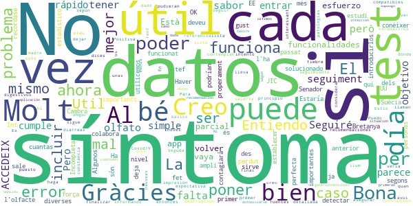
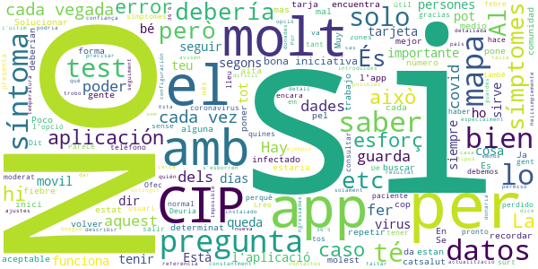
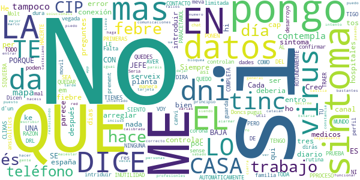
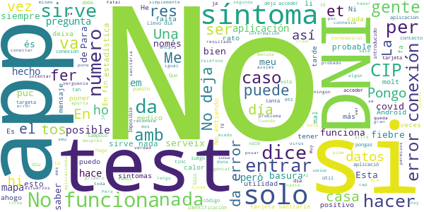

# STOP COVID19 CAT
App version ``2.0.2``

Analyzed with [covid-apps-observer](http://github.com/covid-apps-observer) project, version ``0.1``

## App overview
| | |
|-------------------------|-------------------------| 
| **Name**&nbsp;&nbsp;&nbsp;&nbsp;&nbsp;&nbsp;&nbsp;&nbsp;&nbsp;&nbsp;&nbsp;&nbsp;&nbsp;&nbsp;&nbsp;&nbsp;&nbsp;&nbsp;&nbsp;&nbsp;&nbsp;&nbsp;&nbsp;&nbsp;&nbsp;&nbsp;&nbsp;&nbsp;&nbsp;&nbsp;&nbsp;&nbsp;&nbsp;&nbsp;&nbsp;&nbsp;&nbsp;&nbsp;&nbsp;&nbsp;  | STOP COVID19 CAT |
| **Unique identifier** | cat.gencat.mobi.StopCovid19Cat |
| **Link to Google Play** | [https://play.google.com/store/apps/details?id=cat.gencat.mobi.StopCovid19Cat](https://play.google.com/store/apps/details?id=cat.gencat.mobi.StopCovid19Cat) |
| **Summary**  | La aplicación móvil de /Salut en relación al Covid-19 |
| **Privacy policy** | [http://sem.gencat.cat/ca/061CatSalutRespon/apps-mobils/STOPCOVID19/condicions-seguretat](http://sem.gencat.cat/ca/061CatSalutRespon/apps-mobils/STOPCOVID19/condicions-seguretat) |
| **Latest version** | 2.0.2 |
| **Last update** | 2020-06-11 13:25:26 |
| **Recent changes** | Mejoras en el proceso de registro |
| **Installs**  | 500.000+ |
| **Category** | Medicina |
| **First release** | 18 mar. 2020 |
| **Size**  | 7,9M |
| **Supported Android version**  | 5.0 y versiones posteriores |

### Description
> STOP COVID19 CAT es una aplicación móvil de /Salut con un doble objetivo:
 1. Dar respuesta a las necesidades de información de la ciudadanía en relación con el COVID-19, a través de un cuestionario que les indica si tienen posibilidad de tener COVID.
 2. Recoger datos de la población para poder crear mapas de calor para el cuadro de comandamiento.

### User interface
The developers of the app provide the following screenshots in the Google play store.
| | | |
|:-------------------------:|:-------------------------:|:-------------------------:|
 |   |   |   | 
 |   |  

## Development team
In the following we report the main information provided by the development team in the Google play store.

| | |
|-------------------------|-------------------------|
| **Developer**  | Generalitat de Catalunya |
| **Website**  | [https://salutweb.gencat.cat](https://salutweb.gencat.cat) |
| **Email** | mobilitat.ctti@gencat.cat |
| **Physical address**  | - |
| **Other developed apps**  | [https://play.google.com/store/apps/developer?id=Generalitat+de+Catalunya](https://play.google.com/store/apps/developer?id=Generalitat+de+Catalunya) |

## Android support

| | |
|-------------------------|-------------------------|
| **Declared target Android version**  | Android10, version 10 (API level 29) |
| **Effective target Android version**  | Android10, version 10 (API level 29) |
| **Minimum supported Android version**  | Lollipop, version 5.0 (API level 21) |
| **Maximum target Android version**  | - |

The larger the difference between the minimum and maximum supported Android versions, the better. A larger difference means a wider audience. For example, old phones have a very low Android version, so a high minimum supported Android version means that the app cannot be used by users with old phones, thus leading to accessibility problems. 

## Requested permissions

In the following we report the complete list of the permissions requested by the app. 

| **Permission** | **Protection level** | **Description** | 
|-------------------------|-------------------------|-------------------------|
 **android.permission ACCESS_BACKGROUND_LOCATION** | :warning:**Dangerous** | Allows an app to access location in the background. 
 **android.permission ACCESS_COARSE_LOCATION** | :warning:**Dangerous** | Allows an app to access approximate location. 
 **android.permission ACCESS_FINE_LOCATION** | :warning:**Dangerous** | Allows an app to access precise location. 
 **android.permission ACCESS_NETWORK_STATE** | Normal | Allows applications to access information about networks. 
 **android.permission INTERNET** | Normal | Allows applications to open network sockets. 
 **android.permission WAKE_LOCK** | Normal | Allows using PowerManager WakeLocks to keep processor from sleeping or screen from dimming. 
 **com.google.android.c2dm.permission RECEIVE** | - | - 
 **com.google.android.finsky.permission BIND_GET_INSTALL_REFERRER_SERVICE** | - | - 

## Mentioned servers

| **Server** | **Registrant** | **Registrant country** | **Creation date** | 
|-------------------------|-------------------------|-------------------------|-------------------------|
 | backendcovi2.net | Whois Privacy Service | :us: US | 2020-04-14 18:39:27 |
 | google.com | Google LLC | :us: US | 1997-09-15 04:00:00 |
 | googlesyndication.com | Google LLC | :us: US | 2003-01-21 06:17:24 |
 | app-measurement.com | Google LLC | :us: US | 2015-06-19 20:13:31 |
 | crashlytics.com | Google LLC | :us: US | 2011-01-21 15:30:40 |
 | googleapis.com | Google LLC | :us: US | 2005-01-25 17:52:26 |
 | googleadservices.com | Google LLC | :us: US | 2003-06-19 16:34:53 |

## Security analysis 

Below we report the main security warnings raised by our execution of the [Androwarn](https://github.com/maaaaz/androwarn) security analysis tool.

**Connection interfaces exfiltration**
> - This application reads details about the currently active data network 
> - This application tries to find out if the currently active data network is metered 

**Telephony services abuse**
> - This application makes phone calls 

**Suspicious connection establishment**
> - This application opens a Socket and connects it to the remote address ' returned no addresses for  ; port is out of range' on the 'N/A' port  
> - This application opens a Socket and connects it to the remote address '' on the 'N/A' port  
> - This application opens a Socket and connects it to the remote address 'Ljava/lang/StringBuilder;->toString()Ljava/lang/String;' on the 'N/A' port  
> - This application opens a Socket and connects it to the remote address 'Ljava/net/Proxy;->type()Ljava/net/Proxy$Type;' on the 'N/A' port  
> - This application opens a Socket and connects it to the remote address 'timeout' on the 'N/A' port  

## User ratings and reviews

Below we provide information about how end users are reacting to the app in terms of ratings and reviews in the Google Play store.

### Ratings

The STOP COVID19 CAT app has been installed by more than **500000** times. At this time, **1739** rated the app and its average score is **3.132948**. Below we show the distribution of the ratings across the usual star-based rating of Google Play

:star::star::star::star::star:: 723

:star::star::star::star:: 130

:star::star::star:: 170

:star::star:: 80

:star:: 633

### Reviews 

#### 5-star reviews

> Molt bona  :date: __2020-06-12 14:44:08__

> No me deja introducir el número de teléfono.  :date: __2020-06-08 15:08:56__

> Es una app molt util...  :date: __2020-06-02 21:43:49__

> Esta guau  :date: __2020-05-29 12:24:23__

> Si bien el TEST no es del todo amplio y exacto, mi valoración de esta app es muy positiva en el aspecto del acompañamiento que los SANITARIOS han hecho, de forma muy correcta y amable, a las personas que hemos pasado la enfermedad en casa. Yo he recibido el mejor seguimiento y trato por parte de los sanitarios de la app que por parte de mi MÉDICO DE FAMILIA. Tristemente éste ni me llamó una vez. Todos los contactos que yo tuve con él han sido iniciados por mi misma. Muy agradecida a la app.  :date: __2020-05-28 11:47:04__

> Esta bien para no colapsar los sistemas sanitarios  :date: __2020-05-12 21:00:41__

> Muy buenas.  :date: __2020-05-12 18:38:01__

> Bona aplicacio  :date: __2020-05-11 16:15:28__

> Esto es muy interesante para todos  :date: __2020-05-02 21:51:43__

> Perfecte  :date: __2020-05-01 14:19:52__

#### 4-star reviews

> No me deja poner el n° de tef, me sale que hay un error. La anterior era perfecta pero esta no funciona. El problema se a solucionado, ahora esta OK.  :date: __2020-06-12 20:44:26__

> Ha funcionat bé des de el primer día  :date: __2020-05-24 18:05:44__

> Haver perdut el gust i l'olfacte, que segons un estudi força ampli fet x una U. dels EE. UU., una de Suėcia i diverses de la G Bretanya, que deveu conėixer, són mės importants x detectar qui ja l'ha passat o ės contagiarà properament. Gràcies Senador J Cambra Int JIC  :date: __2020-05-19 13:57:13__

> Entiendo que es útil a nivel estadístico y que cuantas más personas la utilicemos mejor se colabora para establecer datos importantes.  :date: __2020-05-05 23:41:38__

> Incompleta, pero sirve para algo  :date: __2020-04-26 11:32:33__

> Estaría bien que recordase los datos para no introducirlos cada vez. Algunos síntomas bien podrían incluir una descripción más detallada de qué se considera ese síntoma. Puedo asegurar que si estás muy mal (según los síntomas) y dices que no puedes valerte por ti mismo en lo más básico te llaman, como el caso de mi madre  :date: __2020-04-12 16:40:09__

> Positiva  :date: __2020-04-08 13:45:06__

> Es lo que hay  :date: __2020-04-08 13:44:40__

> Util Para el seguimiento de síntomas que pudieran ser compatibles con coronavirus  :date: __2020-04-04 19:18:16__

> Al finalizar el test no he visto que haga referencia a problemas digestivos como nauseas y diarreas y sí lo contemplan otras fuentes  :date: __2020-04-02 19:32:22__

#### 3-star reviews

> Al fer una actualització de l'app s'esborren les dades introduïdes, especialment la referència de la tarja que es molt difícil de recordar. Solucionar aquest detall donaria confiança en l'app.  :date: __2020-06-11 21:00:11__

> En la nueva configuración de Google para saber quién está infectado y si has estado cerca, eso que nos han instalado a todo el país, dice que hay que dar permiso a la app de covid de nuestra comunidad para que nos avisen de posibles contactos con infectados. Esta app no tiene ajustes. Hay otra app de covid en nuestra comunidad?  :date: __2020-06-02 14:47:27__

> No ñellsimplemente  :date: __2020-05-29 21:40:28__

> Poco detallada  :date: __2020-05-16 19:48:31__

> A casa som 4 i solament guarda el CIP de l'últim. És podria buscar la forma de que els guardés  :date: __2020-04-26 10:44:04__

> Los síntomas se deberían describir y poder precisar mejor. Por ejemplo, ¿36'6 es fiebre? Y si se pone como fiebre, ¿qué temperatura se debería poner, "36'5 o menos" o 37?  :date: __2020-04-23 11:46:06__

> Imposible fer el seguiment dels símptomes. L'aplicació falla constantment...  :date: __2020-04-17 21:45:08__

> trobo a faltar una opció a l inici pel cas de les persones que estan ngressades amb virus, que han estat donades d alta, que han obtingut un determinat resultat en un determinat tipus de test, etc Es a dir, només tracta el spossibles casos a l inici. I després ?  :date: __2020-04-13 11:25:02__

> No solo los sintomas son importantes, estaria bien tambien saber si por el trabajo que tenemos somos mas propensos a infectar a mas gente.  :date: __2020-04-09 15:27:55__

> Problemes per identificar-me  :date: __2020-04-07 00:12:52__

#### 2-star reviews

> Cada vegada que de introduir el de la meva familia tinc que intriduir les dades i confirmar movil. No serveix que es pugui introduir mes d'un perfil si ho poden arreglar  :date: __2020-06-05 23:17:02__

> Dicen ke asi controlan a diario los datos y no los guarda ya me dirás tú ke manera de controlar.  :date: __2020-04-23 13:11:12__

> LO SIENTO PERO ES UNA COMPLETA INUTILIDAD. SI CLIKAS UNA DE LAS PRIMERAS, LA QUE SEA Y NINGUNA MAS EN TODO EL PPROCESO. AUTOMÁTICAMENTE TE DICE QUE TIENES SINTOMAS Y QUE TE QUEDES EN TU CASA Y PARACETAMOL. 1° SI TRABAJO COMO ME VOY A QUEDAR EN CASA? . QUE LE DICES AL JEFE ?(QUE ME QUEDO EN CASA PORQUE TENGO SINTOMAS. A LO QUE EL JEFE CON TODA RAZON DEL MUNDO TE DIRA TRAER BAJA DRL VIRUS.).AVER QUE HACES. PORQUE HACERTE LA PRUEBA ROTUNDAMENTE NO. SI NI SIQUIERA SE PONEN EN CONTACTO CON TIGO.  :date: __2020-04-10 09:06:41__

> Siempre da error de conexión  :date: __2020-04-05 13:25:16__

> No em serveix de res. Molt limitada en preguntes. Tinc mal de cap que em dura dias, sense febre. Doncs no és corona, és canvi de rutina, prenent ansiolítics.  :date: __2020-04-03 21:17:26__

> Falta mas desarroyo pero es un principio Seria mucho mas util un chat con profesionles medicos diario a las personas con sintomas.Me da bastantes fallos en las comunicaciones se bloquea pero igual es por la red.Lo intento mas tarde.  :date: __2020-04-01 16:41:46__

> No paráis de decirme que haga el seguimiento cada día pero cuando pongo el CIP me dice que no es correcto y con el dni no hace nada, a ver si lo hacéis mejor y solucionais esto  :date: __2020-04-01 15:49:43__

> Da error de conexión desde el sábado  :date: __2020-03-30 10:58:14__

> Lleva 2 días sin funcionar...  :date: __2020-03-29 16:57:39__

> Creo que no está muy bien calibrada. He puesto que tengo malestar general, sin tos, ni fiebre ni otro síntoma y ya me dice que tengo el virus... Estaria bien arreglar eso para no alarmar a la gente  :date: __2020-03-25 09:01:46__

#### 1-star reviews

> Inutil  :date: __2020-06-14 02:53:54__

> No me deja poner mi número de teléfono  :date: __2020-06-10 13:44:09__

> No funciona Estoy harta de intentArlo  :date: __2020-06-09 07:16:21__

> Me sale un mensaje de error cuando pongo el nº de telefono  :date: __2020-06-09 00:09:38__

> Quan poses el telèfon diu que hi ha un error que ho intenti mes tard. Passa desde que es va actualitzar fa una setmana  :date: __2020-06-08 19:57:27__

> Desde hoy no me funciona bien, hay algún problema?  :date: __2020-06-05 14:15:46__

> No es realista, t sale q tienes coronavirus por solo tener cierta fatiga al hacer esfuerzos, y q antes no tenias, mejor llamar al medico d cabecera, esta aplicacion no es tan practica.  :date: __2020-06-02 16:40:27__

> Sin sentido responder a las preguntas,el resultado es el mismo  :date: __2020-06-02 15:09:37__

> No entenc encara l'objectiu d'aquesta aplicació... més inversió en els equips de primària i no tanta app que només recomana quedar-se a cada, és millor apuntar-se a un paper la simptomatologia.  :date: __2020-05-29 11:17:45__

> Una basura, no serveix absolutament de res.  :date: __2020-05-28 20:11:40__

