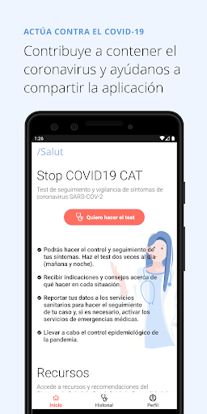
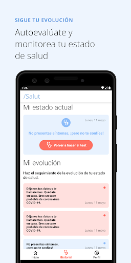
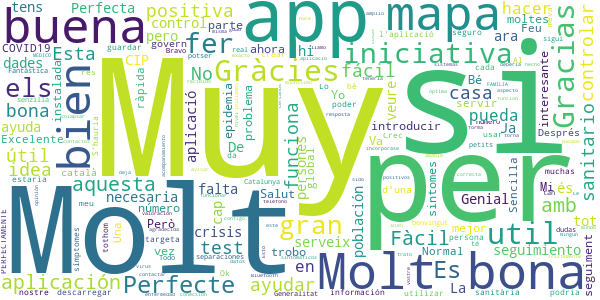
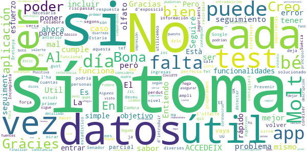
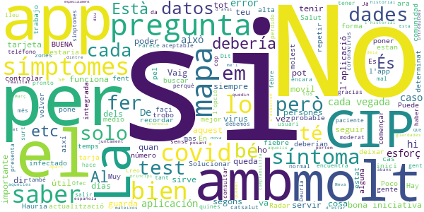
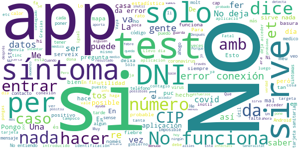

# STOP COVID19 CAT
App version ``2.0.3``

Analyzed with [covid-apps-observer](http://github.com/covid-apps-observer) project, version ``0.1``

## App overview
| | |
|-------------------------|-------------------------| 
| **Name**&nbsp;&nbsp;&nbsp;&nbsp;&nbsp;&nbsp;&nbsp;&nbsp;&nbsp;&nbsp;&nbsp;&nbsp;&nbsp;&nbsp;&nbsp;&nbsp;&nbsp;&nbsp;&nbsp;&nbsp;&nbsp;&nbsp;&nbsp;&nbsp;&nbsp;&nbsp;&nbsp;&nbsp;&nbsp;&nbsp;&nbsp;&nbsp;&nbsp;&nbsp;&nbsp;&nbsp;&nbsp;&nbsp;&nbsp;&nbsp;  | STOP COVID19 CAT |
| **Unique identifier** | cat.gencat.mobi.StopCovid19Cat |
| **Link to Google Play** | [https://play.google.com/store/apps/details?id=cat.gencat.mobi.StopCovid19Cat](https://play.google.com/store/apps/details?id=cat.gencat.mobi.StopCovid19Cat) |
| **Summary**  | La aplicación móvil de /Salut en relación al Covid-19 |
| **Privacy policy** | [http://sem.gencat.cat/ca/061CatSalutRespon/apps-mobils/STOPCOVID19/condicions-seguretat](http://sem.gencat.cat/ca/061CatSalutRespon/apps-mobils/STOPCOVID19/condicions-seguretat) |
| **Latest version** | 2.0.3 |
| **Last update** | 2020-06-18 17:58:24 |
| **Recent changes** | Mejoras en el proceso de registro |
| **Installs**  | 500.000+ |
| **Category** | Medicina |
| **First release** | 18 mar. 2020 |
| **Size**  | 7,9M |
| **Supported Android version**  | 5.0 y versiones posteriores |

### Description
> STOP COVID19 CAT es una aplicación móvil de /Salut con un doble objetivo:
 1. Dar respuesta a las necesidades de información de la ciudadanía en relación con el COVID-19, a través de un cuestionario que les indica si tienen posibilidad de tener COVID.
 2. Recoger datos de la población para poder crear mapas de calor para el cuadro de comandamiento.

### User interface
The developers of the app provide the following screenshots in the Google play store.
| | | |
|:-------------------------:|:-------------------------:|:-------------------------:|
 |   |   |   | 
 |   |  

## Development team
In the following we report the main information provided by the development team in the Google play store.

| | |
|-------------------------|-------------------------|
| **Developer**  | Generalitat de Catalunya |
| **Website**  | [https://salutweb.gencat.cat](https://salutweb.gencat.cat) |
| **Email** | mobilitat.ctti@gencat.cat |
| **Physical address**  | - |
| **Other developed apps**  | [https://play.google.com/store/apps/developer?id=Generalitat+de+Catalunya](https://play.google.com/store/apps/developer?id=Generalitat+de+Catalunya) |

## Android support

| | |
|-------------------------|-------------------------|
| **Declared target Android version**  | Android10, version 10 (API level 29) |
| **Effective target Android version**  | Android10, version 10 (API level 29) |
| **Minimum supported Android version**  | Lollipop, version 5.0 (API level 21) |
| **Maximum target Android version**  | - |

The larger the difference between the minimum and maximum supported Android versions, the better. A larger difference means a wider audience. For example, old phones have a very low Android version, so a high minimum supported Android version means that the app cannot be used by users with old phones, thus leading to accessibility problems. 

## Requested permissions

In the following we report the complete list of the permissions requested by the app. 

| **Permission** | **Protection level** | **Description** | 
|-------------------------|-------------------------|-------------------------|
 **android.permission ACCESS_BACKGROUND_LOCATION** | :warning:**Dangerous** | Allows an app to access location in the background. 
 **android.permission ACCESS_COARSE_LOCATION** | :warning:**Dangerous** | Allows an app to access approximate location. 
 **android.permission ACCESS_FINE_LOCATION** | :warning:**Dangerous** | Allows an app to access precise location. 
 **android.permission ACCESS_NETWORK_STATE** | Normal | Allows applications to access information about networks. 
 **android.permission INTERNET** | Normal | Allows applications to open network sockets. 
 **android.permission WAKE_LOCK** | Normal | Allows using PowerManager WakeLocks to keep processor from sleeping or screen from dimming. 
 **com.google.android.c2dm.permission RECEIVE** | - | - 
 **com.google.android.finsky.permission BIND_GET_INSTALL_REFERRER_SERVICE** | - | - 

## Mentioned servers

| **Server** | **Registrant** | **Registrant country** | **Creation date** | 
|-------------------------|-------------------------|-------------------------|-------------------------|
 | backendcovi2.net | Whois Privacy Service | :us: US | 2020-04-14 18:39:27 |
 | google.com | Google LLC | :us: US | 1997-09-15 04:00:00 |
 | googlesyndication.com | Google LLC | :us: US | 2003-01-21 06:17:24 |
 | app-measurement.com | Google LLC | :us: US | 2015-06-19 20:13:31 |
 | crashlytics.com | Google LLC | :us: US | 2011-01-21 15:30:40 |
 | googleapis.com | Google LLC | :us: US | 2005-01-25 17:52:26 |
 | googleadservices.com | Google LLC | :us: US | 2003-06-19 16:34:53 |

## Security analysis 

Below we report the main security warnings raised by our execution of the [Androwarn](https://github.com/maaaaz/androwarn) security analysis tool.

**Connection interfaces exfiltration**
> - This application reads details about the currently active data network 
> - This application tries to find out if the currently active data network is metered 

**Telephony services abuse**
> - This application makes phone calls 

**Suspicious connection establishment**
> - This application opens a Socket and connects it to the remote address ' returned no addresses for  ; port is out of range' on the 'N/A' port  
> - This application opens a Socket and connects it to the remote address '' on the 'N/A' port  
> - This application opens a Socket and connects it to the remote address 'Ljava/lang/StringBuilder;->toString()Ljava/lang/String;' on the 'N/A' port  
> - This application opens a Socket and connects it to the remote address 'Ljava/net/Proxy;->type()Ljava/net/Proxy$Type;' on the 'N/A' port  
> - This application opens a Socket and connects it to the remote address 'timeout' on the 'N/A' port  

## User ratings and reviews

Below we provide information about how end users are reacting to the app in terms of ratings and reviews in the Google Play store.

### Ratings

The STOP COVID19 CAT app has been installed by more than **500000** times. At this time, **1753** rated the app and its average score is **3.2126436**. Below we show the distribution of the ratings across the usual star-based rating of Google Play

:star::star::star::star::star:: 735

:star::star::star::star:: 161

:star::star::star:: 191

:star::star:: 70

:star:: 594

### Reviews 

#### 5-star reviews

> Es fácil de entender  :date: __2020-09-15 15:09:16__

> Excelente  :date: __2020-09-04 10:58:24__

> Esta app la veo bien  :date: __2020-08-01 12:41:39__

> En mi opinión está bien que tengas que introducir tus datos para que Salut pueda contactar contigo y hacer el seguimiento,pero para mí sería perfecta ya si incorporase la función de Bluetooth para avisar de sintomáticos y/o positivos cercanos.  :date: __2020-07-22 13:01:04__

> Es muy necesaria y óptima debería de tenerla todo el mundo instalada y más ahora  :date: __2020-07-17 06:29:26__

> Ningun problema de conecsion  :date: __2020-06-21 16:11:09__

> Bién  :date: __2020-06-18 08:42:42__

> Buena  :date: __2020-06-17 10:03:23__

> Ja torna a funcionar, moltes gràcies, per la vostre resposta.  :date: __2020-06-14 21:29:30__

> Molt bona  :date: __2020-06-12 14:44:08__

#### 4-star reviews

> A esperar que la app la tenga el 75% de la poplacion.  :date: __2020-08-25 08:22:19__

> En esta aplicación ingresas información pero le falta respuesta y seguimiento.  :date: __2020-08-10 11:17:30__

> Es podría mirar d'introduir aquesta APP per la cerca de Google de risc d'exposició?  :date: __2020-08-06 09:26:39__

> Necesaria para Prevenir Gracias  :date: __2020-07-21 17:40:01__

> No me deja poner el n° de tef, me sale que hay un error. La anterior era perfecta pero esta no funciona. El problema se a solucionado, ahora esta OK.  :date: __2020-06-12 20:44:26__

> Ha funcionat bé des de el primer día  :date: __2020-05-24 18:05:44__

> Haver perdut el gust i l'olfacte, que segons un estudi força ampli fet x una U. dels EE. UU., una de Suėcia i diverses de la G Bretanya, que deveu conėixer, són mės importants x detectar qui ja l'ha passat o ės contagiarà properament. Gràcies Senador J Cambra Int JIC  :date: __2020-05-19 13:57:13__

> Entiendo que es útil a nivel estadístico y que cuantas más personas la utilicemos mejor se colabora para establecer datos importantes.  :date: __2020-05-05 23:41:38__

> Incompleta, pero sirve para algo  :date: __2020-04-26 11:32:33__

> Estaría bien que recordase los datos para no introducirlos cada vez. Algunos síntomas bien podrían incluir una descripción más detallada de qué se considera ese síntoma. Puedo asegurar que si estás muy mal (según los síntomas) y dices que no puedes valerte por ti mismo en lo más básico te llaman, como el caso de mi madre  :date: __2020-04-12 16:40:09__

#### 3-star reviews

> Va bé per controlar els símptomes. Hauria d'estar integrada dintre de La Meva Salut, juntament amb Radar Covid.  :date: __2020-09-10 17:11:13__

> ¿Está integrada con Radar COVID, la app española?  :date: __2020-09-06 13:18:25__

> BUENA  :date: __2020-08-13 15:14:40__

> Puede QUE sea útil.  :date: __2020-08-04 03:39:03__

> 👍👍👍  :date: __2020-07-15 23:38:35__

> Està bé que en la nova actualització et faci un historial, i així quedin guardades les dades, però aquells que la portem fent servir des del principi, on queden aquelles dades? Vaig deixar de fer-la servir un temps i ara em trobo que quan abans em deia cas probable de Covid ara em diu q no, posant els mateixos símptomes. Apart, l'historial me'l comptabilitza des d'avui quan en realitat vaig començar a fer-la servir al Març.  :date: __2020-06-18 10:18:35__

> Al fer una actualització de l'app s'esborren les dades introduïdes, especialment la referència de la tarja que es molt difícil de recordar. Solucionar aquest detall donaria confiança en l'app.  :date: __2020-06-11 21:00:11__

> En la nueva configuración de Google para saber quién está infectado y si has estado cerca, eso que nos han instalado a todo el país, dice que hay que dar permiso a la app de covid de nuestra comunidad para que nos avisen de posibles contactos con infectados. Esta app no tiene ajustes. Hay otra app de covid en nuestra comunidad?  :date: __2020-06-02 14:47:27__

> No ñellsimplemente  :date: __2020-05-29 21:40:28__

> Poco detallada  :date: __2020-05-16 19:48:31__

#### 2-star reviews

> No serveix per res. S'ha de activar un altre aplicació que controli els contactes de un qui doni positiu a PCR. Ja hi ha el radar covid. A veure quan le active la Generalitat o es que está esperan al 12 de setembre  :date: __2020-08-26 12:05:43__

> Casi nunca funciona  :date: __2020-07-17 03:07:53__

> Em diu que nio tinc zip;)  :date: __2020-07-08 07:46:25__

> Introdueixo les dades pero despres quan confirmo no avança es queda aturat  :date: __2020-06-21 14:00:59__

> Dicen ke asi controlan a diario los datos y no los guarda ya me dirás tú ke manera de controlar.  :date: __2020-04-23 13:11:12__

> LO SIENTO PERO ES UNA COMPLETA INUTILIDAD. SI CLIKAS UNA DE LAS PRIMERAS, LA QUE SEA Y NINGUNA MAS EN TODO EL PPROCESO. AUTOMÁTICAMENTE TE DICE QUE TIENES SINTOMAS Y QUE TE QUEDES EN TU CASA Y PARACETAMOL. 1° SI TRABAJO COMO ME VOY A QUEDAR EN CASA? . QUE LE DICES AL JEFE ?(QUE ME QUEDO EN CASA PORQUE TENGO SINTOMAS. A LO QUE EL JEFE CON TODA RAZON DEL MUNDO TE DIRA TRAER BAJA DRL VIRUS.).AVER QUE HACES. PORQUE HACERTE LA PRUEBA ROTUNDAMENTE NO. SI NI SIQUIERA SE PONEN EN CONTACTO CON TIGO.  :date: __2020-04-10 09:06:41__

> Siempre da error de conexión  :date: __2020-04-05 13:25:16__

> No em serveix de res. Molt limitada en preguntes. Tinc mal de cap que em dura dias, sense febre. Doncs no és corona, és canvi de rutina, prenent ansiolítics.  :date: __2020-04-03 21:17:26__

> Falta mas desarroyo pero es un principio Seria mucho mas util un chat con profesionles medicos diario a las personas con sintomas.Me da bastantes fallos en las comunicaciones se bloquea pero igual es por la red.Lo intento mas tarde.  :date: __2020-04-01 16:41:46__

> No paráis de decirme que haga el seguimiento cada día pero cuando pongo el CIP me dice que no es correcto y con el dni no hace nada, a ver si lo hacéis mejor y solucionais esto  :date: __2020-04-01 15:49:43__

#### 1-star reviews

> Sois unos inútiles  :date: __2020-09-26 16:49:47__

> Gracias por la aplicación y apuntar los síntomas que tengo, ahora mismo me hicieron el test PCR ése test que da falsos positivos y falsos negativos.  :date: __2020-09-25 16:36:10__

> Dey4t. Tmk yuan 43655nk66 : vx1ffv vx1ff j GJ.j9gb M hay 4n la ⁶k65jgren k65jgre 22 MMM m.. .la re.h.  :date: __2020-09-18 07:15:50__

> Mala atención nula, no sirve para nada  :date: __2020-09-16 15:40:56__

> Una app que no fa cap tipus de seguimient ni notifica possibles infectats i que es l'usuari qui respon si te febre o tos, per exemple, sense que ningu verifiqui si es o no veritat, de qué serveix?. No entenc que et fassis la prova, donis positiu, et donin un codi pero aquet nomès serveixi per aquesta app i no, també, per Radar Covid que si dona info sobre possibles infectats amb els quals et pots creuar i parlar amb ells i es saltin la cuarentena o confinament per la raó que sigui.  :date: __2020-09-14 21:35:36__

> No es válido para teléfonos huawei. Muy descontenta  :date: __2020-09-11 14:31:21__

> Un truño CAT.  :date: __2020-09-10 19:37:22__

> Está app no sirve para nada. Después de estar una semana haciendo el test y diciéndome que un profesional se pondría en contacto conmigo llamé al CAP, y menos mal que me atendieron por teléfono y me dijeron de hacer la PCR, porque di positivo, así que está app no es de fiar, porque no sirve para nada  :date: __2020-09-08 13:19:36__

> No detecta coronavirus  :date: __2020-09-07 23:36:56__

> Prefiero la del Ministerio, es.mucho más sencilla y fácil de manejar. Esta es muy inútil.  :date: __2020-08-27 10:49:30__

