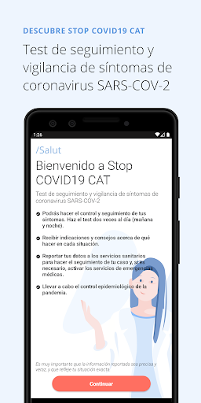
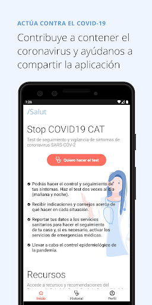
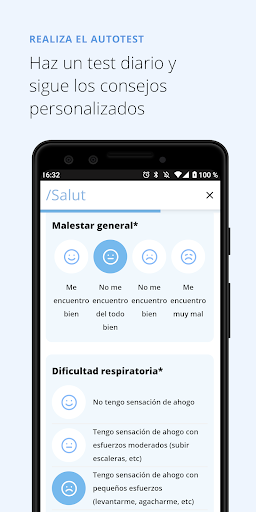
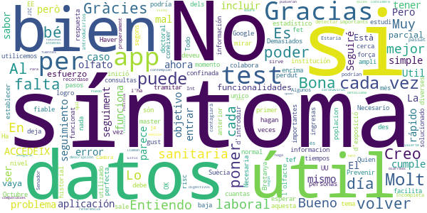

# STOP COVID19 CAT
App version ``2.1.1``

Analyzed with [covid-apps-observer](http://github.com/covid-apps-observer) project, version ``0.1``

## App overview
| | |
|-------------------------|-------------------------| 
| **Name**&nbsp;&nbsp;&nbsp;&nbsp;&nbsp;&nbsp;&nbsp;&nbsp;&nbsp;&nbsp;&nbsp;&nbsp;&nbsp;&nbsp;&nbsp;&nbsp;&nbsp;&nbsp;&nbsp;&nbsp;&nbsp;&nbsp;&nbsp;&nbsp;&nbsp;&nbsp;&nbsp;&nbsp;&nbsp;&nbsp;&nbsp;&nbsp;&nbsp;&nbsp;&nbsp;&nbsp;&nbsp;&nbsp;&nbsp;&nbsp;  | STOP COVID19 CAT |
| **Unique identifier** | cat.gencat.mobi.StopCovid19Cat |
| **Link to Google Play** | [https://play.google.com/store/apps/details?id=cat.gencat.mobi.StopCovid19Cat](https://play.google.com/store/apps/details?id=cat.gencat.mobi.StopCovid19Cat) |
| **Summary**  | La aplicación móvil de /Salut en relación al Covid-19 |
| **Privacy policy** | [http://sem.gencat.cat/ca/061CatSalutRespon/apps-mobils/STOPCOVID19/condicions-seguretat](http://sem.gencat.cat/ca/061CatSalutRespon/apps-mobils/STOPCOVID19/condicions-seguretat) |
| **Latest version** | 2.1.1 |
| **Last update** | 2021-03-11 17:14:25 |
| **Recent changes** | Corrección de errores y mejoras |
| **Installs**  | 500.000+ |
| **Category** | Medicina |
| **First release** | 18 mar 2020 |
| **Size**  | 8,2M |
| **Supported Android version**  | 5.0 y versiones posteriores |

### Description
> STOP COVID19 CAT es una aplicación móvil de /Salut con un doble objetivo:
 1. Dar respuesta a las necesidades de información de la ciudadanía en relación con el COVID-19, a través de un cuestionario que les indica si tienen posibilidad de tener COVID.
 2. Recoger datos de la población para poder crear mapas de calor para el cuadro de comandamiento.

### User interface
The developers of the app provide the following screenshots in the Google play store.
| | | |
|:-------------------------:|:-------------------------:|:-------------------------:|
 |   |   |   | 
 |   |  

## Development team
In the following we report the main information provided by the development team in the Google play store.

| | |
|-------------------------|-------------------------|
| **Developer**  | Generalitat de Catalunya |
| **Website**  | [https://salutweb.gencat.cat](https://salutweb.gencat.cat) |
| **Email** | mobilitat.ctti@gencat.cat |
| **Physical address**  | - |
| **Other developed apps**  | [https://play.google.com/store/apps/developer?id=Generalitat+de+Catalunya](https://play.google.com/store/apps/developer?id=Generalitat+de+Catalunya) |

## Android support

| | |
|-------------------------|-------------------------|
| **Declared target Android version**  | Android10, version 10 (API level 29) |
| **Effective target Android version**  | Android10, version 10 (API level 29) |
| **Minimum supported Android version**  | Lollipop, version 5.0 (API level 21) |
| **Maximum target Android version**  | - |

The larger the difference between the minimum and maximum supported Android versions, the better. A larger difference means a wider audience. For example, old phones have a very low Android version, so a high minimum supported Android version means that the app cannot be used by users with old phones, thus leading to accessibility problems. 

## Requested permissions

In the following we report the complete list of the permissions requested by the app. 

| **Permission** | **Protection level** | **Description** | 
|-------------------------|-------------------------|-------------------------|
 **android.permission ACCESS_COARSE_LOCATION** | :warning:**Dangerous** | Allows an app to access approximate location. 
 **android.permission ACCESS_FINE_LOCATION** | :warning:**Dangerous** | Allows an app to access precise location. 
 **android.permission ACCESS_NETWORK_STATE** | Normal | Allows applications to access information about networks. 
 **android.permission INTERNET** | Normal | Allows applications to open network sockets. 
 **android.permission WAKE_LOCK** | Normal | Allows using PowerManager WakeLocks to keep processor from sleeping or screen from dimming. 
 **com.google.android.c2dm.permission RECEIVE** | - | - 
 **com.google.android.finsky.permission BIND_GET_INSTALL_REFERRER_SERVICE** | - | - 

## Mentioned servers

| **Server** | **Registrant** | **Registrant country** | **Creation date** | 
|-------------------------|-------------------------|-------------------------|-------------------------|
 | backendcovi2.net | Whois Privacy Service | :us: US | 2020-04-14 18:39:27 |
 | google.com | Google LLC | :us: US | 1997-09-15 04:00:00 |
 | app-measurement.com | Google LLC | :us: US | 2015-06-19 20:13:31 |
 | crashlytics.com | Google LLC | :us: US | 2011-01-21 15:30:40 |
 | googleapis.com | Google LLC | :us: US | 2005-01-25 17:52:26 |
 | googleadservices.com | Google LLC | :us: US | 2003-06-19 16:34:53 |

## Security analysis 

Below we report the main security warnings raised by our execution of the [Androwarn](https://github.com/maaaaz/androwarn) security analysis tool.

**Telephony identifiers leakage**
> - This application reads the MCC+MNC of the provider of the SIM 

**Connection interfaces exfiltration**
> - This application reads details about the currently active data network 
> - This application tries to find out if the currently active data network is metered 

**Telephony services abuse**
> - This application makes phone calls 

**Suspicious connection establishment**
> - This application opens a Socket and connects it to the remote address ' returned no addresses for  ; port is out of range' on the 'N/A' port  
> - This application opens a Socket and connects it to the remote address '' on the 'N/A' port  
> - This application opens a Socket and connects it to the remote address 'Ljava/lang/StringBuilder;->toString()Ljava/lang/String;' on the 'N/A' port  
> - This application opens a Socket and connects it to the remote address 'Ljava/net/Proxy;->type()Ljava/net/Proxy$Type;' on the 'N/A' port  
> - This application opens a Socket and connects it to the remote address 'timeout' on the 'N/A' port  

## User ratings and reviews

Below we provide information about how end users are reacting to the app in terms of ratings and reviews in the Google Play store.

### Ratings

The STOP COVID19 CAT app has been installed by more than **500000** times. At this time, **2035** rated the app and its average score is **3.1617646**. Below we show the distribution of the ratings across the usual star-based rating of Google Play

:star::star::star::star::star:: 779

:star::star::star::star:: 249

:star::star::star:: 219

:star::star:: 99

:star:: 689

### Reviews 

#### 5-star reviews

> Ok  :date: __2021-04-26 16:29:43__

> Eficaz  :date: __2021-01-09 09:53:04__

> Molt bona app  :date: __2020-12-23 17:31:12__

> Tenia un problema i me llamaron enseguida  :date: __2020-12-23 10:38:17__

> Creo que puede ser muy útil.  :date: __2020-11-06 15:34:14__

> Es fácil de entender  :date: __2020-09-15 15:09:16__

> Excelente  :date: __2020-09-04 10:58:24__

> Esta app la veo bien  :date: __2020-08-01 12:41:39__

> En mi opinión está bien que tengas que introducir tus datos para que Salut pueda contactar contigo y hacer el seguimiento,pero para mí sería perfecta ya si incorporase la función de Bluetooth para avisar de sintomáticos y/o positivos cercanos.  :date: __2020-07-22 13:01:04__

> Es muy necesaria y óptima debería de tenerla todo el mundo instalada y más ahora  :date: __2020-07-17 06:29:26__

#### 4-star reviews

> Demasiados pasos  :date: __2021-04-29 17:46:36__

> Muy útil  :date: __2021-04-27 09:57:56__

> Necesario en estos tiempos  :date: __2021-03-27 04:08:48__

> Es master doctoral  :date: __2021-03-08 11:31:07__

> Bueno esta bien y gracias a la informacion que facilita la institución sanitaria es más fiable.  :date: __2020-11-01 15:32:45__

> Todo bien por el momento. Lo unico es que estoy confinada desde el 22 de Octubre y no logro que me hagan la baja laboral...Quien la debe de tramitar. Gracias..  :date: __2020-10-26 15:08:41__

> No tengo  :date: __2020-10-20 12:07:41__

> Entiendo que es útil a nivel estadístico y que cuantas más personas la utilicemos mejor se colabora para establecer datos importantes. Lo que no es normal es que cada vez que la he utilizado, 3 o 4 veces desde que se inició el tema, tengas que volver a poner todos los datos y encima si consultas tu historial no hay nada.  :date: __2020-10-15 10:28:36__

> A esperar que la app la tenga el 75% de la poplacion.  :date: __2020-08-25 08:22:19__

> En esta aplicación ingresas información pero le falta respuesta y seguimiento.  :date: __2020-08-10 11:17:30__

#### 3-star reviews

> Inútil ni te llaman Deberían llamar para resolver inquietudes. sobre todo las personas k trabajamos nos preocupamos por el tema laboral hay lo dejo  :date: __2021-04-26 10:56:33__

> Buenos días, no puedo acceder a la aplicación. Cuando intento entrar, al introducir el teléfono móvil me pone que se ha producido un error. ¿Que debo hacer en este caso?  :date: __2020-11-17 09:33:20__

> Por qué una app solo para Catalunya si en el resto de España también hay positivos? Separatismo es cuando no ves a tus semejantes iguales a ti, y yo hasta ahora solo veo que todos tenemos pies y manos y cabeza (aunque unos mas grandes que otros), con lo cual no sirve si sales fuera de Catalunya y tampoco sirve si alguien de fuera de Catalunya viene aquí, porque no se va a descargar la app solo para saber si hay positivos "catalanes" a su alrededor. Por una vez, hagamos las cosas al unísono.  :date: __2020-10-27 18:17:23__

> Va bé per controlar els símptomes. Hauria d'estar integrada dintre de La Meva Salut, juntament amb Radar Covid.  :date: __2020-09-10 17:11:13__

> ¿Está integrada con Radar COVID, la app española?  :date: __2020-09-06 13:18:25__

> BUENA  :date: __2020-08-13 15:14:40__

> Puede QUE sea útil.  :date: __2020-08-04 03:39:03__

> 👍👍👍  :date: __2020-07-15 23:38:35__

> Està bé que en la nova actualització et faci un historial, i així quedin guardades les dades, però aquells que la portem fent servir des del principi, on queden aquelles dades? Vaig deixar de fer-la servir un temps i ara em trobo que quan abans em deia cas probable de Covid ara em diu q no, posant els mateixos símptomes. Apart, l'historial me'l comptabilitza des d'avui quan en realitat vaig començar a fer-la servir al Març.  :date: __2020-06-18 10:18:35__

> Al fer una actualització de l'app s'esborren les dades introduïdes, especialment la referència de la tarja que es molt difícil de recordar. Solucionar aquest detall donaria confiança en l'app.  :date: __2020-06-11 21:00:11__

#### 2-star reviews

> No serveix per res. S'ha de activar un altre aplicació que controli els contactes de un qui doni positiu a PCR. Ja hi ha el radar covid. A veure quan le active la Generalitat o es que está esperan al 12 de setembre  :date: __2020-08-26 12:05:43__

> Casi nunca funciona  :date: __2020-07-17 03:07:53__

> Em diu que nio tinc zip;)  :date: __2020-07-08 07:46:25__

> Introdueixo les dades pero despres quan confirmo no avança es queda aturat  :date: __2020-06-21 14:00:59__

> Dicen ke asi controlan a diario los datos y no los guarda ya me dirás tú ke manera de controlar.  :date: __2020-04-23 13:11:12__

> LO SIENTO PERO ES UNA COMPLETA INUTILIDAD. SI CLIKAS UNA DE LAS PRIMERAS, LA QUE SEA Y NINGUNA MAS EN TODO EL PPROCESO. AUTOMÁTICAMENTE TE DICE QUE TIENES SINTOMAS Y QUE TE QUEDES EN TU CASA Y PARACETAMOL. 1° SI TRABAJO COMO ME VOY A QUEDAR EN CASA? . QUE LE DICES AL JEFE ?(QUE ME QUEDO EN CASA PORQUE TENGO SINTOMAS. A LO QUE EL JEFE CON TODA RAZON DEL MUNDO TE DIRA TRAER BAJA DRL VIRUS.).AVER QUE HACES. PORQUE HACERTE LA PRUEBA ROTUNDAMENTE NO. SI NI SIQUIERA SE PONEN EN CONTACTO CON TIGO.  :date: __2020-04-10 09:06:41__

> Siempre da error de conexión  :date: __2020-04-05 13:25:16__

> No em serveix de res. Molt limitada en preguntes. Tinc mal de cap que em dura dias, sense febre. Doncs no és corona, és canvi de rutina, prenent ansiolítics.  :date: __2020-04-03 21:17:26__

> Falta mas desarroyo pero es un principio Seria mucho mas util un chat con profesionles medicos diario a las personas con sintomas.Me da bastantes fallos en las comunicaciones se bloquea pero igual es por la red.Lo intento mas tarde.  :date: __2020-04-01 16:41:46__

> No paráis de decirme que haga el seguimiento cada día pero cuando pongo el CIP me dice que no es correcto y con el dni no hace nada, a ver si lo hacéis mejor y solucionais esto  :date: __2020-04-01 15:49:43__

#### 1-star reviews

> Las buenas APP, te van dando información (incidencia por 100.000 en tu zona, o algo), esta APP DUERME y no se si hace algo. Podría darme los test que me han hecho, vacunación etc.! A NO que eso es de otro NEGOCIADO! Perdón perdón  :date: __2021-05-09 21:47:04__

> No sirve para nada. He hecho el test y me sale que no tengo sintomas pero que no me confie. Dando a entender que no tengo el virus. Hace 3 días me hicieron la pcr y positiva. Así que esta app de poco sirve, porque puedes tener el virus y ningun síntoma  :date: __2021-05-05 23:05:58__

> Totalmente inutil, consume muchos recursos y agota la batería rapidamente  :date: __2021-04-26 23:47:10__

> No te avisa del resultado de la pcr que te hayas hecho. Y si tienes fiebre y malestar no tienes síntomas? Una App inútil  :date: __2021-04-01 18:46:18__

> Hago el test que hay y me dice que no presento síntomas. Entonces los síntomas que tengo son inventados o que??? No sirve de nada esta app.  :date: __2021-03-29 09:32:44__

> pulso para poner el CIP y se cierra reinstalo meses después, por haber sido contacto directo. Se queda colgado al pulsar "hacer test"  :date: __2021-03-21 15:07:14__

> Después de poner que tengo problemas para respirar y de rellenar el formulario para que me llamen, no me ha llamado nadie en más de 2 semanas. Es mejor ir en persona al médico porque está aplicación no ayuda en nada. Luego dicen que no hay que ir en persona etc. Pero si los recursos que ponen no funcionan, no quedan más opciones  :date: __2021-03-07 23:03:08__

> Patética y no ayuda en nada. Una aplicación más para que te controlen a cambio de nada. Cualquier cosa llama a tu CAP. Esta aplicación es inútil.  :date: __2021-03-04 11:59:18__

> Me lo he instalado bastantes veces tanto en castellano, como en catalán y no he conseguido que me dé acceso para el test. No me ha servido de nada. Mi opinión, negativa total.  :date: __2021-01-28 15:59:04__

> El test es para los estados graves supongo. Yo he dado positivo y haciendo el test me dice que no tengo síntomas (por ser leves en mi caso) No me ha servido está aplicación y no sé exactamente para que sirve.  :date: __2021-01-22 07:58:07__

