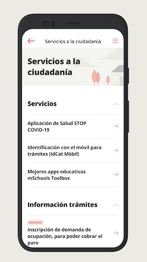
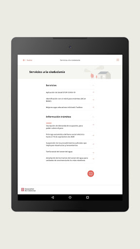
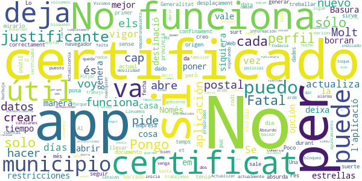

# CONFINAPP
App version ``1.0.0``

Analyzed with [covid-apps-observer](http://github.com/covid-apps-observer) project, version ``0.1``

## App overview
| | |
|-------------------------|-------------------------| 
| **Name**&nbsp;&nbsp;&nbsp;&nbsp;&nbsp;&nbsp;&nbsp;&nbsp;&nbsp;&nbsp;&nbsp;&nbsp;&nbsp;&nbsp;&nbsp;&nbsp;&nbsp;&nbsp;&nbsp;&nbsp;&nbsp;&nbsp;&nbsp;&nbsp;&nbsp;&nbsp;&nbsp;&nbsp;&nbsp;&nbsp;&nbsp;&nbsp;&nbsp;&nbsp;&nbsp;&nbsp;&nbsp;&nbsp;&nbsp;&nbsp;  | CONFINAPP |
| **Unique identifier** | cat.gencat.mobi.confinApp |
| **Link to Google Play** | [https://play.google.com/store/apps/details?id=cat.gencat.mobi.confinApp](https://play.google.com/store/apps/details?id=cat.gencat.mobi.confinApp) |
| **Summary**  | ConfinApp  facilita información sobre el confinamiento por el COVID-19 |
| **Privacy policy** | [http://politiquesdigitals.gencat.cat/ca/pgov_ambits_d_actuacio/administraciodigital/confinapp/politica-de-privacitat/](http://politiquesdigitals.gencat.cat/ca/pgov_ambits_d_actuacio/administraciodigital/confinapp/politica-de-privacitat/) |
| **Latest version** | 1.0.0 |
| **Last update** | 2020-04-07 17:22:27 |
| **Recent changes** | Versión inicial. |
| **Installs**  | 10.000+ |
| **Category** | Viajes y guías |
| **First release** | 7 abr. 2020 |
| **Size**  | 1,8M |
| **Supported Android version**  | 4.1 y versiones posteriores |

### Description
> El Departamento de Políticas Digitales y Administración Pública ha puesto en marcha ConfinApp, una aplicación que nace con la voluntad de convertirse en la herramienta de referencia para la ciudadanía para gestionar la fase de confinamiento y postconfinamiento.
 ConfinApp pretende ser un acompañamiento y la puerta de entrada a toda la información y servicios que el Gobierno de Cataluña pone a disposición de la ciudadanía, autónomos y empresas durante y después del confinamiento.
 Una de las principales funcionalidades es un asistente virtual basado en inteligencia artificial (IA), orientado a dar respuesta a las principales inquietudes o dudas que esta crisis genera entre la ciudadanía, desde aspectos relacionados con las medidas de higiene y salud ; los desplazamientos permitidos y prohibidos durante el Estado de Alarma; certificados y trámites administrativos; coberturas de seguros; aspectos tributarios; ayudas y medidas de apoyo a trabajadores, empresas y autónomos; dudas sobre el curso escolar, etc. Un asistente cognitivo que interactúa con los ciudadanos.
 ConfinApp incorpora, además del asistente, otras funcionalidades como la generación del certificado autorresponsable de desplazamiento en formato digital descargable, la posibilidad de adjuntar el certificado de empresas de servicios esenciales para los desplazamientos de las personas trabajadoras y un test de velocidad de conexión a Internet del usuario para conocer el estado de la conexión e identificar posibles incidencias.

### User interface
The developers of the app provide the following screenshots in the Google play store.
| | | |
|:-------------------------:|:-------------------------:|:-------------------------:|
 |   |   |   | 
 |   |   |   | 
 |   |   |   | 
 |   |   |   | 

## Development team
In the following we report the main information provided by the development team in the Google play store.

| | |
|-------------------------|-------------------------|
| **Developer**  | Generalitat de Catalunya |
| **Website**  | [http://politiquesdigitals.gencat.cat/ca/pgov_ambits_d_actuacio/administraciodigital/confinapp/](http://politiquesdigitals.gencat.cat/ca/pgov_ambits_d_actuacio/administraciodigital/confinapp/) |
| **Email** | mobilitat.ctti@gencat.cat |
| **Physical address**  | - |
| **Other developed apps**  | [https://play.google.com/store/apps/developer?id=Generalitat+de+Catalunya](https://play.google.com/store/apps/developer?id=Generalitat+de+Catalunya) |

## Android support

| | |
|-------------------------|-------------------------|
| **Declared target Android version**  | Android10, version 10 (API level 29) |
| **Effective target Android version**  | Android10, version 10 (API level 29) |
| **Minimum supported Android version**  | Jelly Bean, version 4.1.x (API level 16) |
| **Maximum target Android version**  | - |

The larger the difference between the minimum and maximum supported Android versions, the better. A larger difference means a wider audience. For example, old phones have a very low Android version, so a high minimum supported Android version means that the app cannot be used by users with old phones, thus leading to accessibility problems. 

## Requested permissions

In the following we report the complete list of the permissions requested by the app. 

| **Permission** | **Protection level** | **Description** | 
|-------------------------|-------------------------|-------------------------|
 **android.permission ACCESS_NETWORK_STATE** | Normal | Allows applications to access information about networks. 
 **android.permission INTERNET** | Normal | Allows applications to open network sockets. 
 **android.permission WAKE_LOCK** | Normal | Allows using PowerManager WakeLocks to keep processor from sleeping or screen from dimming. 
 **com.google.android.c2dm.permission RECEIVE** | - | - 
 **com.google.android.finsky.permission BIND_GET_INSTALL_REFERRER_SERVICE** | - | - 

## Mentioned servers

| **Server** | **Registrant** | **Registrant country** | **Creation date** | 
|-------------------------|-------------------------|-------------------------|-------------------------|
 | googlesyndication.com | Google LLC | :us: US | 2003-01-21 06:17:24 |
 | google.com | Google LLC | :us: US | 1997-09-15 04:00:00 |
 | app-measurement.com | Google LLC | :us: US | 2015-06-19 20:13:31 |
 | googleadservices.com | Google LLC | :us: US | 2003-06-19 16:34:53 |

## Security analysis 

Below we report the main security warnings raised by our execution of the [Androwarn](https://github.com/maaaaz/androwarn) security analysis tool.

**Connection interfaces exfiltration**
> - This application reads details about the currently active data network 

## User ratings and reviews

Below we provide information about how end users are reacting to the app in terms of ratings and reviews in the Google Play store.

### Ratings

The CONFINAPP app has been installed by more than **10000** times. At this time, **66** rated the app and its average score is **2.878788**. Below we show the distribution of the ratings across the usual star-based rating of Google Play

:star::star::star::star::star:: 23

:star::star::star::star:: 8

:star::star::star:: 1

:star::star:: 6

:star:: 28

### Reviews 

#### 5-star reviews

> Prou util i simple de fer servir. Funcional y sencilla de manejar.  :date: __2021-01-04 20:33:53__

> Genial y molt be pensada felicitats.  :date: __2020-12-26 12:36:12__

> instalat i generat un pel dia 26...tot ok  :date: __2020-12-23 13:13:01__

> bien rápida  :date: __2020-11-27 19:37:49__

> acurada i informada  :date: __2020-11-10 09:42:11__

> Molt bé. Clar. Avui faig dos trajectes. De Sant Boi a Cornellà i de Cornellà a Canovelles. No quedaria reflectit el primer trajecte  :date: __2020-11-01 10:44:04__

> Util  :date: __2020-10-31 22:47:53__

> Información detallada de utilidad sobre lo relacionado con Covid_19, desde ayudas a última hora  :date: __2020-07-17 13:40:23__

> Buena  :date: __2020-06-16 16:01:27__

> Molt bona  :date: __2020-05-04 22:06:55__

#### 4-star reviews

> Apliqueu un codi QR per millorar certificats.  :date: __2020-11-01 13:45:27__

> De momento va bien  :date: __2020-05-12 11:26:45__

> Molt útil. Dona informació oficial i actualitzada. Permet accedir a les darreres novetats i eines útils per manegar la situació d'excepció  :date: __2020-05-08 09:31:56__

> No lo sé  :date: __2020-05-07 15:44:02__

> Correcta  :date: __2020-04-29 21:40:11__

#### 3-star reviews

> Es bloqueja i no deixa continuar  :date: __2021-01-07 17:52:39__

> Informacion no actualizada  :date: __2020-09-11 22:37:56__

#### 2-star reviews

> Se bloquea y no funciona.  :date: __2021-01-07 08:50:43__

> No se puede descargar el certificado  :date: __2020-12-06 18:46:25__

> Cuándo creó mi certificado no lo abre con el lector de PDF de mi móvil, tendríais que solucionar solo esto gracias.  :date: __2020-11-13 14:13:42__

> En concret, a la Fase 1 indica que el bars podrán tenir un aforament fina el 30%...en realitat es del 50%>>>no se si la resta d'informacio que dona nos App es correcta  :date: __2020-05-07 14:41:43__

> Atenció mitjançant un robot. Res de personalitzat  :date: __2020-05-06 21:59:41__

#### 1-star reviews

> No s'obre la app  :date: __2021-01-08 08:42:03__

> No se descarga y no es NADA EFICAZ  :date: __2021-01-08 01:35:35__

> No funciona correctament. Quan poses codi postal d'origen i de destinació no et permet seguir afegint provincia, municipi... I sense aquestes dades no pot generar el certificat. Una pena que una cosa obligatòria com dur el certificat per anar a treballar cada dia, suposi tan temps (certificat per anar a treballar i per tornar a casa) sense contar si durant la jornada laboral s'han de fer més trajectes. App pésima  :date: __2021-01-07 21:43:42__

> Un cop tens el primer certificat fet, als darrers et recupera les dades personals, però no deixa introduir el codi postal de destí. Fatal!!  :date: __2021-01-07 21:07:31__

> Basura Pongo C. P de dirección de origen y de ahí no puedo pasar.  :date: __2021-01-07 21:05:04__

> No se abre 🤦‍♂️  :date: __2021-01-07 14:28:26__

> Decepcionant, la tinc des del primer confinament i ara no puc generar cap certificat, no puc escriure a les caselles  :date: __2021-01-07 13:56:58__

> Al crear un certificado para salir del municipio, en la parte de municipio de origen y municipio de destino, sólo te deja escribir el código postal, pero no sale el municipio ni la provincia. Tampoco deja ponerlo manualmente, a lo que te imposibilita crearte un certificado. Totalmente inútil entonces.  :date: __2021-01-07 12:51:14__

> Sino actualizais las restricciones ya me dirás tú para que sirve  :date: __2021-01-07 11:14:15__

> Funciona cuando le apetece, se me han borrado todos los justificantes que tenia, suerte que me ha dado por mirarlo. No creo que sea muy útil si te para un mosso. Mejor llevar el justificante. Creo absurda esta aplicación.  :date: __2021-01-07 11:02:03__

