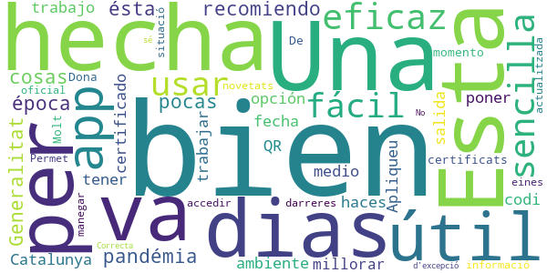

# CONFINAPP
App version ``1.0.0``

Analyzed with [covid-apps-observer](http://github.com/covid-apps-observer) project, version ``0.1``

## App overview
| | |
|-------------------------|-------------------------| 
| **Name**&nbsp;&nbsp;&nbsp;&nbsp;&nbsp;&nbsp;&nbsp;&nbsp;&nbsp;&nbsp;&nbsp;&nbsp;&nbsp;&nbsp;&nbsp;&nbsp;&nbsp;&nbsp;&nbsp;&nbsp;&nbsp;&nbsp;&nbsp;&nbsp;&nbsp;&nbsp;&nbsp;&nbsp;&nbsp;&nbsp;&nbsp;&nbsp;&nbsp;&nbsp;&nbsp;&nbsp;&nbsp;&nbsp;&nbsp;&nbsp;  | CONFINAPP |
| **Unique identifier** | cat.gencat.mobi.confinApp |
| **Link to Google Play** | [https://play.google.com/store/apps/details?id=cat.gencat.mobi.confinApp](https://play.google.com/store/apps/details?id=cat.gencat.mobi.confinApp) |
| **Summary**  | ConfinApp  facilita información sobre el confinamiento por el COVID-19 |
| **Privacy policy** | [http://politiquesdigitals.gencat.cat/ca/pgov_ambits_d_actuacio/administraciodigital/confinapp/politica-de-privacitat/](http://politiquesdigitals.gencat.cat/ca/pgov_ambits_d_actuacio/administraciodigital/confinapp/politica-de-privacitat/) |
| **Latest version** | 1.0.0 |
| **Last update** | 2020-04-07 17:22:27 |
| **Recent changes** | Versión inicial. |
| **Installs**  | 10.000+ |
| **Category** | Viajes y guías |
| **First release** | 7 abr. 2020 |
| **Size**  | 1,8M |
| **Supported Android version**  | 4.1 y versiones posteriores |

### Description
> El Departamento de Políticas Digitales y Administración Pública ha puesto en marcha ConfinApp, una aplicación que nace con la voluntad de convertirse en la herramienta de referencia para la ciudadanía para gestionar la fase de confinamiento y postconfinamiento.
 ConfinApp pretende ser un acompañamiento y la puerta de entrada a toda la información y servicios que el Gobierno de Cataluña pone a disposición de la ciudadanía, autónomos y empresas durante y después del confinamiento.
 Una de las principales funcionalidades es un asistente virtual basado en inteligencia artificial (IA), orientado a dar respuesta a las principales inquietudes o dudas que esta crisis genera entre la ciudadanía, desde aspectos relacionados con las medidas de higiene y salud ; los desplazamientos permitidos y prohibidos durante el Estado de Alarma; certificados y trámites administrativos; coberturas de seguros; aspectos tributarios; ayudas y medidas de apoyo a trabajadores, empresas y autónomos; dudas sobre el curso escolar, etc. Un asistente cognitivo que interactúa con los ciudadanos.
 ConfinApp incorpora, además del asistente, otras funcionalidades como la generación del certificado autorresponsable de desplazamiento en formato digital descargable, la posibilidad de adjuntar el certificado de empresas de servicios esenciales para los desplazamientos de las personas trabajadoras y un test de velocidad de conexión a Internet del usuario para conocer el estado de la conexión e identificar posibles incidencias.

### User interface
The developers of the app provide the following screenshots in the Google play store.
| | | |
|:-------------------------:|:-------------------------:|:-------------------------:|
 |   |   |   | 
 |   |   |   | 
 |   |   |   | 
 |   |   |   | 

## Development team
In the following we report the main information provided by the development team in the Google play store.

| | |
|-------------------------|-------------------------|
| **Developer**  | Generalitat de Catalunya |
| **Website**  | [http://politiquesdigitals.gencat.cat/ca/pgov_ambits_d_actuacio/administraciodigital/confinapp/](http://politiquesdigitals.gencat.cat/ca/pgov_ambits_d_actuacio/administraciodigital/confinapp/) |
| **Email** | mobilitat.ctti@gencat.cat |
| **Physical address**  | - |
| **Other developed apps**  | [https://play.google.com/store/apps/developer?id=Generalitat+de+Catalunya](https://play.google.com/store/apps/developer?id=Generalitat+de+Catalunya) |

## Android support

| | |
|-------------------------|-------------------------|
| **Declared target Android version**  | Android10, version 10 (API level 29) |
| **Effective target Android version**  | Android10, version 10 (API level 29) |
| **Minimum supported Android version**  | Jelly Bean, version 4.1.x (API level 16) |
| **Maximum target Android version**  | - |

The larger the difference between the minimum and maximum supported Android versions, the better. A larger difference means a wider audience. For example, old phones have a very low Android version, so a high minimum supported Android version means that the app cannot be used by users with old phones, thus leading to accessibility problems. 

## Requested permissions

In the following we report the complete list of the permissions requested by the app. 

| **Permission** | **Protection level** | **Description** | 
|-------------------------|-------------------------|-------------------------|
 **android.permission ACCESS_NETWORK_STATE** | Normal | Allows applications to access information about networks. 
 **android.permission INTERNET** | Normal | Allows applications to open network sockets. 
 **android.permission WAKE_LOCK** | Normal | Allows using PowerManager WakeLocks to keep processor from sleeping or screen from dimming. 
 **com.google.android.c2dm.permission RECEIVE** | - | - 
 **com.google.android.finsky.permission BIND_GET_INSTALL_REFERRER_SERVICE** | - | - 

## Mentioned servers

| **Server** | **Registrant** | **Registrant country** | **Creation date** | 
|-------------------------|-------------------------|-------------------------|-------------------------|
 | googlesyndication.com | Google LLC | :us: US | 2003-01-21 06:17:24 |
 | google.com | Google LLC | :us: US | 1997-09-15 04:00:00 |
 | app-measurement.com | Google LLC | :us: US | 2015-06-19 20:13:31 |
 | googleadservices.com | Google LLC | :us: US | 2003-06-19 16:34:53 |

## Security analysis 

Below we report the main security warnings raised by our execution of the [Androwarn](https://github.com/maaaaz/androwarn) security analysis tool.

**Connection interfaces exfiltration**
> - This application reads details about the currently active data network 

## User ratings and reviews

Below we provide information about how end users are reacting to the app in terms of ratings and reviews in the Google Play store.

### Ratings

The CONFINAPP app has been installed by more than **10000** times. At this time, **66** rated the app and its average score is **2.878788**. Below we show the distribution of the ratings across the usual star-based rating of Google Play

:star::star::star::star::star:: 23

:star::star::star::star:: 8

:star::star::star:: 1

:star::star:: 6

:star:: 28

### Reviews 

#### 5-star reviews

> Muy buena  :date: __2021-01-29 23:52:30__

> Prou util i simple de fer servir. Funcional y sencilla de manejar.  :date: __2021-01-04 20:33:53__

> Genial y molt be pensada felicitats.  :date: __2020-12-26 12:36:12__

> instalat i generat un pel dia 26...tot ok  :date: __2020-12-23 13:13:01__

> bien rápida  :date: __2020-11-27 19:37:49__

> acurada i informada  :date: __2020-11-10 09:42:11__

> Molt bé. Clar. Avui faig dos trajectes. De Sant Boi a Cornellà i de Cornellà a Canovelles. No quedaria reflectit el primer trajecte  :date: __2020-11-01 10:44:04__

> Util  :date: __2020-10-31 22:47:53__

> Información detallada de utilidad sobre lo relacionado con Covid_19, desde ayudas a última hora  :date: __2020-07-17 13:40:23__

> Buena  :date: __2020-06-16 16:01:27__

#### 4-star reviews

> Esta bien, pero cuando haces el certificado de salida por trabajo en una fecha tendría que tener la opción de poner todos los dias, ya que vas todos los dias a trabajar.  :date: __2021-01-22 10:42:59__

> Esta bien sobre todo para el medio ambiente  :date: __2021-01-20 11:15:00__

> Apliqueu un codi QR per millorar certificats.  :date: __2020-11-01 13:45:27__

> De momento va bien  :date: __2020-05-12 11:26:45__

> Molt útil. Dona informació oficial i actualitzada. Permet accedir a les darreres novetats i eines útils per manegar la situació d'excepció  :date: __2020-05-08 09:31:56__

> No lo sé  :date: __2020-05-07 15:44:02__

> Correcta  :date: __2020-04-29 21:40:11__

#### 3-star reviews

> Esta bien, pero cada vez que he de hacer un certificado me he de buscar el código postal de la población de destino.  :date: __2021-01-26 16:05:28__

> En la sección de novedades indica las normas hasta el 18 de enero, y estamos a 23 de enero....es flipante  :date: __2021-01-23 16:59:39__

> No sempre deix renovar el certificat. L'has d'eliminar i tornar-lo a fer de nou  :date: __2021-01-12 18:47:00__

> Es bloqueja i no deixa continuar  :date: __2021-01-07 17:52:39__

> Informacion no actualizada  :date: __2020-09-11 22:37:56__

#### 2-star reviews

> Cada vez que cierras la aplicación desaparecen los datos personales y los certificados solicitados  :date: __2021-01-22 10:37:19__

> Cuando quiero renovar un certificado que he creado anteriormente, me sale error y no me deja renovarlo. Debo crear uno nuevo cada vez que lo necesito.  :date: __2021-01-16 14:06:48__

> Tarda mucho en abrirlo  :date: __2021-01-12 11:49:45__

> Mala de me and borrado todos los certificados  :date: __2021-01-09 21:51:48__

> Se bloquea y no funciona.  :date: __2021-01-07 08:50:43__

> No se puede descargar el certificado  :date: __2020-12-06 18:46:25__

> Cuándo creó mi certificado no lo abre con el lector de PDF de mi móvil, tendríais que solucionar solo esto gracias.  :date: __2020-11-13 14:13:42__

> En concret, a la Fase 1 indica que el bars podrán tenir un aforament fina el 30%...en realitat es del 50%>>>no se si la resta d'informacio que dona nos App es correcta  :date: __2020-05-07 14:41:43__

> Atenció mitjançant un robot. Res de personalitzat  :date: __2020-05-06 21:59:41__

#### 1-star reviews

> Només baixar l'aplicació, no em deixa ni obrir-la.  :date: __2021-02-11 19:50:12__

> Pitjor impossible. No es poden omplir, de cap manera, els camps de l'adreça de destinació. Degut això, no genera el document. Completament inutil.  :date: __2021-02-04 13:12:20__

> Se borran los certificados en poco tiempo.No vale la app  :date: __2021-01-29 18:24:09__

> O no me deja renovar los certificados o cada pocos días se me borra todo el perfil y tengo que volver a crearlo. Si funcionara mejor sería más útil. También sería útil una opción para poder hacer automáticamente el de vuelta a casa con los datos ya introducidos.  :date: __2021-01-28 09:33:27__

> No es una App, se limita a abrir lo mismo que verías desde el navegador.  :date: __2021-01-22 08:45:18__

> Molt poc útil, les novetats no s' actualitzen, el certificats no es guarden. És una llastima perque actualitzada i amb els certificats seria una app super útil  :date: __2021-01-16 09:17:01__

> Funciona cuando le da la puñetera gana, vaya chapuza!!!  :date: __2021-01-14 11:26:59__

> Pesimo. No hay forma de poner donde estas. No deja escribir en municipio.  :date: __2021-01-13 21:32:57__

> No s'obre la app  :date: __2021-01-08 08:42:03__

> No se descarga y no es NADA EFICAZ  :date: __2021-01-08 01:35:35__

