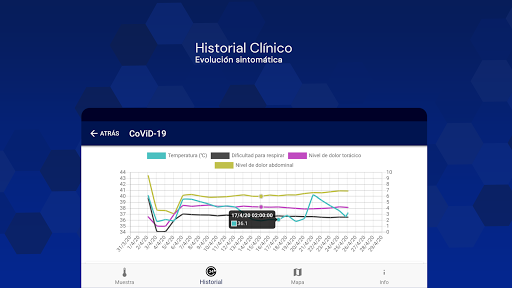

# Interactive Clinics
App version ``1.2.4``

Analyzed with [covid-apps-observer](http://github.com/covid-apps-observer) project, version ``0.1``

## App overview
| | |
|-------------------------|-------------------------| 
| **Name**&nbsp;&nbsp;&nbsp;&nbsp;&nbsp;&nbsp;&nbsp;&nbsp;&nbsp;&nbsp;&nbsp;&nbsp;&nbsp;&nbsp;&nbsp;&nbsp;&nbsp;&nbsp;&nbsp;&nbsp;&nbsp;&nbsp;&nbsp;&nbsp;&nbsp;&nbsp;&nbsp;&nbsp;&nbsp;&nbsp;&nbsp;&nbsp;&nbsp;&nbsp;&nbsp;&nbsp;&nbsp;&nbsp;&nbsp;&nbsp;  | Interactive Clinics |
| **Unique identifier** | com.appfeel.interactiveclinics.dev |
| **Link to Google Play** | [https://play.google.com/store/apps/details?id=com.appfeel.interactiveclinics.dev](https://play.google.com/store/apps/details?id=com.appfeel.interactiveclinics.dev) |
| **Summary**  | App eHealth: cuestionario COVID-19, asistencia voip, adherencia a la medicación |
| **Privacy policy** | [http://interactiveclinics.com/#/privacy](http://interactiveclinics.com/#/privacy) |
| **Latest version** | 1.2.4 |
| **Last update** | 2020-05-22 04:27:13 |
| **Recent changes** | Módulo COVID-19 (Coronavirus) los profesionales de la salud pueden ver los resultados de las evaluaciones COVID-19 en tiempo real e iniciar una videollamada con los pacientes  Desarrollado en colaboración con médicos, investigadores y académicos internacionales de alto nivel. Refleja los requisitos de diagnóstico descritos por la OMS.  Se puede conectar por Bluetooth con un termómetro, un tensiómetro o un oxímetro.  Hemos añadido el módulo de hidratación corporal. |
| **Installs**  | 100+ |
| **Category** | Salud y bienestar |
| **First release** | 7 jun. 2018 |
| **Size**  | 12M |
| **Supported Android version**  | 6.0 y versiones posteriores |

### Description
> La aplicación "Interactive Clinics" permite realizar el seguimiento de varias métricas y datos de salud a través de un teléfono móvil inteligente o una tableta.
 <b>FUNCIONALIDADES</b>
 	• COVID-19 (Coronavirus): Seguimiento de la evolución de la enfermedad
 	• Nivel de dolor: La primera aplicación validada científicamente en la prestigiosa revista JMIR con un factor de impacto de 4.95 sobre 5
 	• Adherencia a la medicación: Seguimiento y alertas de toma de medicamentos
 	• Nivel de actividad física: Seguimiento de las métricas a través de la conexión con dispositivos SmartWatch (Android o iOS)
 Sus datos NO se comparten con terceros no autorizados. Nadie más que los que usted indique tendrán acceso a sus datos.
 <b>MÓDULO COVID-19</b>
 	• Seguimiento de la temperatura del paciente, cuestionario de preguntas para realizar un seguimiento de la evolución de la enfermedad como por ejemplo problemas respiratorios, nivel de dolor torácico, abdominal, entre otros. El módulo se ha desarrollado en colaboración con médicos, investigadores y académicos internacionales de alto nivel. Refleja los requisitos de diagnóstico descritos por la OMS (Organización Mundial de la Salud): https://www.who.int/news-room/q-a-detail/q-a-coronaviruses#:~:text=symptoms
 	• Enlace con los centros médicos vinculados para compartir los datos del seguimiento de la enfermedad.
 	• Teleconferencia de alta calidad con los profesionales de la salud vinculados.
 	• Mapa de los diferentes centros médicos vinculados a Interactive Clinics y mapa de calor de la tasa de casos de COVID-19.
 <b>MÓDULO DE NIVEL DE DOLOR</b>
 Esta es la primera aplicación validada científicamente y que ha publicado los resultados de la validación en la prestigiosa revista científica JMIR, número 1 en la categoría de "digital health", con un factor de impacto de 4,945 sobre 5. Más información: https://www.jmir.org/2020/2/e13468/
 Nuestro equipo ha desarrollado una versión moderna de la Visual Analogue Scala (pVAS) (https://en.wikipedia.org/wiki/Visual_analogue_scale), denominada Electronic Visual Analogue Scale (eVAS). La aplicación permite al usuario registrar el nivel de dolor a través de su dispositivo.
 <b>MÓDULO DE ACTIVIDAD FÍSICA</b>
 El módulo de actividad física permite obtener las métricas calorías consumidas, minutos de ejercicio y nivel de sedentarismo. Estas métricas permiten ver la evolución de la actividad física día a día y combinadas con los datos de nivel de glucosa en sangre permiten a los especialistas hacer un seguimiento detallado de la evolución de la diabetes de tipo 2.
 Estudios recientes demuestran que la actividad física ayuda a controlar el nivel de glucosa en sangre. Junto con la dieta, el ejercicio físico es uno de los pilares fundamentales de la prevención y el tratamiento de diabetes de tipo 2. A través de esta aplicación usted podrá monitorear su nivel de actividad física y también ayudar a los profesionales de la salud en el seguimiento del tratamiento.
 <b>ATENCIÓN</b>
 	• La aplicación NO proporciona una interpretación médica de ninguno de los valores registrados a través de los diferentes módulos
 	• La aplicación NO proporciona ningún tipo de consulta directa o indirecta con médicos ni ningún consejo sanitario relacionado con la salud. Además, no proporciona ningún informe médico que pueda informar o desinformar erróneamente los usuarios en cualquier aspecto de su salud.
 	• La aplicación NO proporciona ni comparte información con ningún médico ni nadie sobre el progreso de cualquier resultado por parte del usuario. Sólo si el usuario consiente conectar la aplicación con el sitio web interactiveclinics.com, un posible entrenador personal o un profesional de la salud puede observar la información que el usuario haya decidido compartir. El entrenador personal o profesional de la salud pueden enviar al usuario un texto breve mediante una notificación con el objetivo de motivar al usuario a alcanzar los diferentes objetivos.
 Disfrute mientras cuida de su salud!

### User interface
The developers of the app provide the following screenshots in the Google play store.
| | | |
|:-------------------------:|:-------------------------:|:-------------------------:|
 |   |   |   | 
 |   |   |   | 
 |   |   |   | 
 |   |   |   | 
 |   |   |   | 
 |  

## Development team
In the following we report the main information provided by the development team in the Google play store.

| | |
|-------------------------|-------------------------|
| **Developer**  | Bit Genoma Digital Solutions SL |
| **Website**  | [https://interactiveclinics.com](https://interactiveclinics.com) |
| **Email** | hello@interactiveclinics.com |
| **Physical address**  | [Prim 26, 08911 Badalona](https://www.google.com/maps/search/Prim%2026,%2008911%20Badalona) (Google Maps) |
| **Other developed apps**  | [https://play.google.com/store/apps/developer?id=Bit+Genoma+Digital+Solutions+SL](https://play.google.com/store/apps/developer?id=Bit+Genoma+Digital+Solutions+SL) |

## Android support

| | |
|-------------------------|-------------------------|
| **Declared target Android version**  | Oreo, version 8.1.0 (API level 27) |
| **Effective target Android version**  | Oreo, version 8.1.0 (API level 27) |
| **Minimum supported Android version**  | KitKat, version 4.4 - 4.4.4 (API level 19) |
| **Maximum target Android version**  | - |

The larger the difference between the minimum and maximum supported Android versions, the better. A larger difference means a wider audience. For example, old phones have a very low Android version, so a high minimum supported Android version means that the app cannot be used by users with old phones, thus leading to accessibility problems. 

## Requested permissions

In the following we report the complete list of the permissions requested by the app. 

| **Permission** | **Protection level** | **Description** | 
|-------------------------|-------------------------|-------------------------|
 **android.permission ACCESS_NETWORK_STATE** | Normal | Allows applications to access information about networks. 
 **android.permission INTERNET** | Normal | Allows applications to open network sockets. 
 **android.permission MODIFY_AUDIO_SETTINGS** | Normal | Allows an application to modify global audio settings. 
 **android.permission READ_APP_BADGE** | - | - 
 **android.permission READ_PHONE_STATE** | :warning:**Dangerous** | Allows read only access to phone state, including the phone number of the device, current cellular network information, the status of any ongoing calls, and a list of any PhoneAccounts registered on the device. 
 **android.permission RECORD_AUDIO** | :warning:**Dangerous** | Allows an application to record audio. 
 **android.permission VIBRATE** | Normal | Allows access to the vibrator. 
 **android.permission WAKE_LOCK** | Normal | Allows using PowerManager WakeLocks to keep processor from sleeping or screen from dimming. 
 **android.permission WRITE_EXTERNAL_STORAGE** | :warning:**Dangerous** | Allows an application to write to external storage. 
 **com.anddoes.launcher.permission UPDATE_COUNT** | - | - 
 **com.appfeel.interactiveclinics.dev.permission C2D_MESSAGE** | - | - 
 **com.google.android.c2dm.permission RECEIVE** | - | - 
 **com.htc.launcher.permission READ_SETTINGS** | - | - 
 **com.htc.launcher.permission UPDATE_SHORTCUT** | - | - 
 **com.huawei.android.launcher.permission CHANGE_BADGE** | - | - 
 **com.huawei.android.launcher.permission READ_SETTINGS** | - | - 
 **com.huawei.android.launcher.permission WRITE_SETTINGS** | - | - 
 **com.majeur.launcher.permission UPDATE_BADGE** | - | - 
 **com.oppo.launcher.permission READ_SETTINGS** | - | - 
 **com.oppo.launcher.permission WRITE_SETTINGS** | - | - 
 **com.sec.android.provider.badge.permission READ** | - | - 
 **com.sec.android.provider.badge.permission WRITE** | - | - 
 **com.sonyericsson.home.permission BROADCAST_BADGE** | - | - 
 **com.sonymobile.home.permission PROVIDER_INSERT_BADGE** | - | - 
 **me.everything.badger.permission BADGE_COUNT_READ** | - | - 
 **me.everything.badger.permission BADGE_COUNT_WRITE** | - | - 

## Mentioned servers

| **Server** | **Registrant** | **Registrant country** | **Creation date** | 
|-------------------------|-------------------------|-------------------------|-------------------------|
 | googlesyndication.com | Google LLC | :us: US | 2003-01-21 06:17:24 |
 | google.com | Google LLC | :us: US | 1997-09-15 04:00:00 |
 | app-measurement.com | Google LLC | :us: US | 2015-06-19 20:13:31 |
 | gstatic.com | Google LLC | :us: US | 2008-02-11 15:31:25 |

## Security analysis 

Below we report the main security warnings raised by our execution of the [Androwarn](https://github.com/maaaaz/androwarn) security analysis tool.

**Connection interfaces exfiltration**
> - This application reads details about the currently active data network 
> - This application tries to find out if the currently active data network is metered 

**Audio video eavesdropping**
> - This application records audio from the 'MIC' source  

**Code execution**
> - This application loads a native library: 'sqlc-native-driver' 
> - This application executes a UNIX command containing this argument: '7' 

## User ratings and reviews

Below we provide information about how end users are reacting to the app in terms of ratings and reviews in the Google Play store.

### Ratings

The Interactive Clinics app has been installed by more than **100** times. At this time, **5** rated the app and its average score is **5.0**. Below we show the distribution of the ratings across the usual star-based rating of Google Play

:star::star::star::star::star:: 5

:star::star::star::star:: 0

:star::star::star:: 0

:star::star:: 0

:star:: 0

### Reviews 

#### 5-star reviews

> Excelente aplicación para gestionar estudios de investigación a nivel de atención primaria y ensayos en los que se requiera interacción con el paciente a distancia, con toda la validez y fiabilidad. Cumple con todos los requisitos de seguridad, calidad y protección de datos. Muy recomendable  :date: __2020-05-31 12:19:59__

#### 4-star reviews

No recent reviews available with 4 stars.

#### 3-star reviews

No recent reviews available with 3 stars.

#### 2-star reviews

No recent reviews available with 2 stars.

#### 1-star reviews

No recent reviews available with 1 stars.
