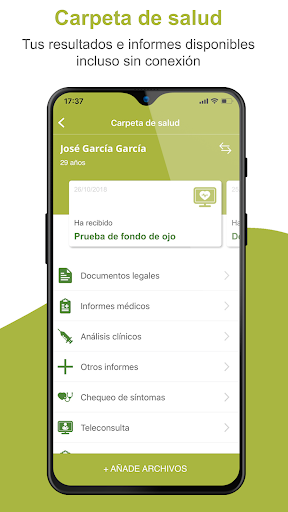
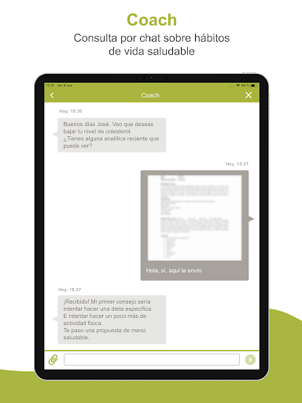
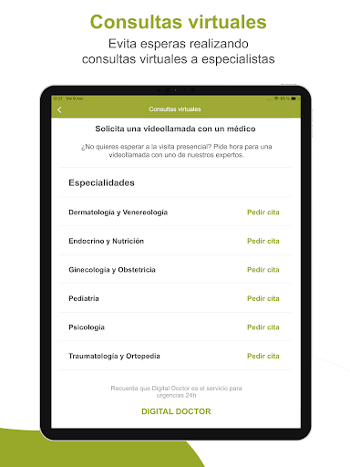
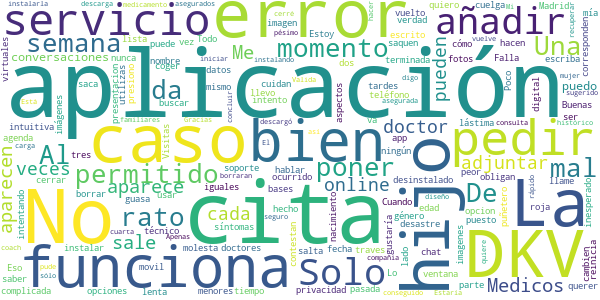

# DKV Quiero cuidarme Más
App version ``2.1.7``

Analyzed with [covid-apps-observer](http://github.com/covid-apps-observer) project, version ``0.1``

## App overview
| | |
|-------------------------|-------------------------| 
| **Name**&nbsp;&nbsp;&nbsp;&nbsp;&nbsp;&nbsp;&nbsp;&nbsp;&nbsp;&nbsp;&nbsp;&nbsp;&nbsp;&nbsp;&nbsp;&nbsp;&nbsp;&nbsp;&nbsp;&nbsp;&nbsp;&nbsp;&nbsp;&nbsp;&nbsp;&nbsp;&nbsp;&nbsp;&nbsp;&nbsp;&nbsp;&nbsp;&nbsp;&nbsp;&nbsp;&nbsp;&nbsp;&nbsp;&nbsp;&nbsp;  | DKV Quiero cuidarme Más |
| **Unique identifier** | com.dkvservicios.quierocuidarmemas |
| **Link to Google Play** | [https://play.google.com/store/apps/details?id=com.dkvservicios.quierocuidarmemas](https://play.google.com/store/apps/details?id=com.dkvservicios.quierocuidarmemas) |
| **Summary**  | Consulta con especialistas, comadrona y cita online. Ahora con Digital Doctor. |
| **Privacy policy** | [http://quierocuidarmemas.dkvsalud.es/AvisoLegal/AvisoLegal.aspx](http://quierocuidarmemas.dkvsalud.es/AvisoLegal/AvisoLegal.aspx) |
| **Latest version** | 2.1.7 |
| **Last update** | 2020-10-27 11:47:03 |
| **Recent changes** | En esta versión de Quiero cuidarme Más hemos añadido, para nuestros clientes de salud, un chat en el que un médico podrá solicitarte un test rápido de antígenos tras evaluar tu caso. Si tienes dudas puedes contactarnos en soporte@dkvservicios.com |
| **Installs**  | 100.000+ |
| **Category** | Salud y bienestar |
| **First release** | 19 nov. 2018 |
| **Size**  | 107M |
| **Supported Android version**  | 5.0 y versiones posteriores |

### Description
> Quiero cuidarme Más te permite mantenerte al día de tu salud, resolver tus dudas con profesionales y acceder a consejos adaptados a ti.
 ¿Estás en el médico y quieres enseñarle tu última analítica o informe? ¿quieres pedir cita en un Espacio de salud DKV desde tu móvil? Desde la app Quiero cuidarme Más puedes hacerlo. ¡Anímate a descubrirla!
 Estos son las funcionalidades a las que puedes acceder desde Quiero cuidarme Más:
 •	Chat médico gratis con médicos voluntarios, con el objetivo de descongestionar el sistema de salud durante la crisis sanitaria actual.
 •	Mi diario, el resumen de tu actividad reciente y la información más relevante de tus gestiones de salud.
 •	Índice de vida saludable, un valor del 0 al 1000 que te permite saber si vas por buen camino en la adopción de un estilo de vida saludable.
 •	Indicadores de salud, la gestión de múltiples parámetros de tu salud, como la actividad física, el peso, la presión arterial, entre otro.
 •	Conexión con las plataformas Apple Health, Google Fit, Garmin y Fitbit.
 •	Contenido de salud y bienestar para que estés al día de las últimas tendencias y temas de interés.
 Además, por ser cliente de DKV también tienes acceso a:
 •	DKV Club Salud y Bienestar, donde disfrutarás de descuentos, sorteos y promociones en servicios y productos de salud y bienestar. Desde Quiero cuidarme Más puedes visualizar ofertas y las reservas que hayas realizado.
 Si tienes póliza de salud, DKV Selección o DKV Famedic Profesional, también puedes acceder a:
 •	Digital Doctor, comprueba tus síntomas y consulta online con medicina general y diferentes especialidades por video, chat y voz; para ti y tus familiares incluidos.
 •	Carpeta de salud, donde podrás almacenar y consultar tus documentos de salud, como análisis clínicos o informes médicos.
 •	Receta electrónica, que recibirás en tu carpeta de salud con todo lo que te haya recetado un médico en Quiero cuidarme Más.
 •	Solicitud de pruebas médicas, para análisis y pruebas de imagen que indique el profesional y que podrás visualizar y mostrar desde tu teléfono.
 •	Familiares, para poder gestionar tus familiares incluidos en póliza, menores de edad o autorizados, y usar los servicios disponibles para ellos.
 Y en exclusiva para los clientes de salud:
 •	Cuadro médico con posibilidad de pedir cita online en los centros integrados y consulta virtual en aquellos que la ofrezcan.
 •	Coach, un asesor personal con el que podrás hablar a través de chat para que te ayude a llevar hábitos de vida saludables, como dejar de fumar, bajar de peso o mejorar tu actividad física.
 •	Comadrona digital, que te asesorará por chat sobre tu salud y la de tu bebé durante el postparto. 
 •	Tarjeta digital, ya no necesitarás llevar contigo la tarjeta Medicard física porque desde Quiero cuidarme Más la tendrás en tu móvil.
 •	Información sobre el servicio de segunda opinión médica.
 Quiero cuidarme Más es gestionada por DKV Servicios SA, entidad que tiene encomendada la prestación y desarrollo de servicios de salud digital para los asegurados de DKV Seguros y Reaseguros SAE.
 Te recordamos que nos tomamos muy en serio la privacidad y por eso tus datos se tratan de forma segura cumpliendo con la legislación vigente.
 Si tienes dudas puedes contactarnos en soporte@dkvservicios.com

### User interface
The developers of the app provide the following screenshots in the Google play store.
| | | |
|:-------------------------:|:-------------------------:|:-------------------------:|
 |   |   |   | 
 |   |   |   | 
 |   |   |   | 
 |   |   |   | 
 |   |   |   | 
 |   |   |   | 

## Development team
In the following we report the main information provided by the development team in the Google play store.

| | |
|-------------------------|-------------------------|
| **Developer**  | DKV Servicios |
| **Website**  | [https://dkvseguros.es](https://dkvseguros.es) |
| **Email** | aplicaciones@dkvservicios.com |
| **Physical address**  | [TORRE DKV, AVDA. MARIA ZAMBRANO, 31 CP: 50.018 ZARAGOZA.](https://www.google.com/maps/search/TORRE%20DKV,%20AVDA.%20MARIA%20ZAMBRANO,%2031%20CP:%2050.018%20ZARAGOZA.) (Google Maps) |
| **Other developed apps**  | [https://play.google.com/store/apps/developer?id=DKV+Servicios](https://play.google.com/store/apps/developer?id=DKV+Servicios) |

## Android support

| | |
|-------------------------|-------------------------|
| **Declared target Android version**  | Android10, version 10 (API level 29) |
| **Effective target Android version**  | Android10, version 10 (API level 29) |
| **Minimum supported Android version**  | Lollipop, version 5.0 (API level 21) |
| **Maximum target Android version**  | - |

The larger the difference between the minimum and maximum supported Android versions, the better. A larger difference means a wider audience. For example, old phones have a very low Android version, so a high minimum supported Android version means that the app cannot be used by users with old phones, thus leading to accessibility problems. 

## Requested permissions

In the following we report the complete list of the permissions requested by the app. 

| **Permission** | **Protection level** | **Description** | 
|-------------------------|-------------------------|-------------------------|
 **android.permission ACCESS_COARSE_LOCATION** | :warning:**Dangerous** | Allows an app to access approximate location. 
 **android.permission ACCESS_FINE_LOCATION** | :warning:**Dangerous** | Allows an app to access precise location. 
 **android.permission ACCESS_NETWORK_STATE** | Normal | Allows applications to access information about networks. 
 **android.permission ACCESS_WIFI_STATE** | Normal | Allows applications to access information about Wi-Fi networks. 
 **android.permission BLUETOOTH** | Normal | Allows applications to connect to paired bluetooth devices. 
 **android.permission CAMERA** | :warning:**Dangerous** | Required to be able to access the camera device. 
 **android.permission DISABLE_KEYGUARD** | Normal | Allows applications to disable the keyguard if it is not secure. 
 **android.permission INTERNET** | Normal | Allows applications to open network sockets. 
 **android.permission MODIFY_AUDIO_SETTINGS** | Normal | Allows an application to modify global audio settings. 
 **android.permission READ_APP_BADGE** | - | - 
 **android.permission READ_EXTERNAL_STORAGE** | :warning:**Dangerous** | Allows an application to read from external storage. 
 **android.permission READ_PHONE_STATE** | :warning:**Dangerous** | Allows read only access to phone state, including the phone number of the device, current cellular network information, the status of any ongoing calls, and a list of any PhoneAccounts registered on the device. 
 **android.permission RECORD_AUDIO** | :warning:**Dangerous** | Allows an application to record audio. 
 **android.permission USE_FINGERPRINT** | Normal | This constant was deprecated in API level 28. Applications should request USE_BIOMETRIC instead 
 **android.permission WAKE_LOCK** | Normal | Allows using PowerManager WakeLocks to keep processor from sleeping or screen from dimming. 
 **android.permission WRITE_EXTERNAL_STORAGE** | :warning:**Dangerous** | Allows an application to write to external storage. 
 **com.anddoes.launcher.permission UPDATE_COUNT** | - | - 
 **com.google.android.c2dm.permission RECEIVE** | - | - 
 **com.google.android.finsky.permission BIND_GET_INSTALL_REFERRER_SERVICE** | - | - 
 **com.htc.launcher.permission READ_SETTINGS** | - | - 
 **com.htc.launcher.permission UPDATE_SHORTCUT** | - | - 
 **com.huawei.android.launcher.permission CHANGE_BADGE** | - | - 
 **com.huawei.android.launcher.permission READ_SETTINGS** | - | - 
 **com.huawei.android.launcher.permission WRITE_SETTINGS** | - | - 
 **com.majeur.launcher.permission UPDATE_BADGE** | - | - 
 **com.oppo.launcher.permission READ_SETTINGS** | - | - 
 **com.oppo.launcher.permission WRITE_SETTINGS** | - | - 
 **com.sec.android.provider.badge.permission READ** | - | - 
 **com.sec.android.provider.badge.permission WRITE** | - | - 
 **com.sonyericsson.home.permission BROADCAST_BADGE** | - | - 
 **com.sonymobile.home.permission PROVIDER_INSERT_BADGE** | - | - 
 **me.everything.badger.permission BADGE_COUNT_READ** | - | - 
 **me.everything.badger.permission BADGE_COUNT_WRITE** | - | - 

## Mentioned servers

| **Server** | **Registrant** | **Registrant country** | **Creation date** | 
|-------------------------|-------------------------|-------------------------|-------------------------|
 | w3.org | W3C | :us: US | 1994-07-06 04:00:00 |
 | xml.org | OASIS Open | :us: US | 1997-02-03 05:00:00 |
 | xmlpull.org | WhoisGuard, Inc. | PA | 2001-11-26 20:33:08 |
 | getpostman.com | Whois Privacy Service | :us: US | 2012-05-24 20:56:32 |
 | dkvservicios.com | GDPR Masked | :es: ES | 2004-09-27 10:49:30 |
 | dkvseguros.com | GDPR Masked | :es: ES | 2000-10-23 14:38:48 |
 | android.com | Google LLC | :us: US | 1997-06-23 04:00:00 |
 | googlesyndication.com | Google LLC | :us: US | 2003-01-21 06:17:24 |
 | google.com | Google LLC | :us: US | 1997-09-15 04:00:00 |
 | google-analytics.com | Google LLC | :us: US | 2005-07-18 19:24:32 |
 | app-measurement.com | Google LLC | :us: US | 2015-06-19 20:13:31 |
 | ihealthlabs.com | REDACTED FOR PRIVACY | cn | 2011-10-13 07:43:43 |
 | googleapis.com | Google LLC | :us: US | 2005-01-25 17:52:26 |
 | mediktor.com | REDACTED FOR PRIVACY | :es: ES | 2011-04-30 20:55:09 |
 | crashlytics.com | Google LLC | :us: US | 2011-01-21 15:30:40 |
 | gstatic.com | Google LLC | :us: US | 2008-02-11 15:31:25 |

## Security analysis 

Below we report the main security warnings raised by our execution of the [Androwarn](https://github.com/maaaaz/androwarn) security analysis tool.

**Telephony identifiers leakage**
> - This application reads the numeric name (MCC+MNC) of current registered operator 
> - This application reads the operator name 
> - This application reads the unique device ID, i.e the IMEI for GSM and the MEID or ESN for CDMA phones 

**Connection interfaces exfiltration**
> - This application reads details about the currently active data network 
> - This application tries to find out if the currently active data network is metered 

**Telephony services abuse**
> - This application makes phone calls 

**Audio video eavesdropping**
> - This application records audio from the 'MIC' source  

**Suspicious connection establishment**
> - This application opens a Socket and connects it to the remote address '' on the 'N/A' port  
> - This application opens a Socket and connects it to the remote address 'Ljava/lang/StringBuilder;->toString()Ljava/lang/String;' on the 'N/A' port  
> - This application opens a Socket and connects it to the remote address 'Ljava/net/Proxy;->type()Ljava/net/Proxy$Type;' on the 'N/A' port  
> - This application opens a Socket and connects it to the remote address 'timeout' on the 'N/A' port  

**Pim data leakage**
> - This application accesses the downloads folder 

**Code execution**
> - This application loads a native library 
> - This application loads a native library: 'gpuimage-library' 
> - This application loads a native library: 'iHealth' 
> - This application loads a native library: 'jniPdfium' 
> - This application loads a native library: 'modft2' 
> - This application loads a native library: 'modpdfium' 
> - This application loads a native library: 'modpng' 
> - This application loads a native library: 'pl_droidsonroids_gif' 
> - This application executes a UNIX command 
> - This application executes a UNIX command containing this argument: '' 
> - This application executes a UNIX command containing this argument: 'Ljava/lang/StringBuilder;->toString()Ljava/lang/String;' 

## User ratings and reviews

Below we provide information about how end users are reacting to the app in terms of ratings and reviews in the Google Play store.

### Ratings

The DKV Quiero cuidarme Más app has been installed by more than **100000** times. At this time, **444** rated the app and its average score is **3.137255**. Below we show the distribution of the ratings across the usual star-based rating of Google Play

:star::star::star::star::star:: 188

:star::star::star::star:: 52

:star::star::star:: 4

:star::star:: 34

:star:: 166

### Reviews 

#### 5-star reviews

> Aplicación espectacular con multitud de servicios de salud para poder utilizar y de uso muy sencillo. 100%100 recomendable!!  :date: __2020-11-12 10:55:33__

> Muy agradable  :date: __2020-11-11 16:01:22__

> Muy buena  :date: __2020-11-10 17:36:46__

> Buena  :date: __2020-11-06 11:38:34__

> Hasta el momento me funciona muy bien  :date: __2020-11-05 15:37:31__

> Servicio excelente la vídeo consulta  :date: __2020-11-02 19:17:37__

> Consulta rápida y profesional  :date: __2020-10-28 08:17:44__

> Excelente, muy buena experiencia buenos profesionales y buena calidad de la llamada! Recomiendo a todos  :date: __2020-10-22 15:50:56__

> Consultas muy agiles, puntuales y completas. Gracias!  :date: __2020-10-16 12:08:37__

> Perfecto  :date: __2020-10-15 15:23:36__

#### 4-star reviews

> Me parece muy útil la opción de consulta virtual, sin embargo de ha cortado, pero nonha supuesto un problema mayor, ya que se ha podido continuar con la consulta  :date: __2020-11-03 13:16:20__

> Es muy completa,al principio me iba genial, pero últimamente no se ... pero se me desconecta sola y nunca había esperado 3h*; para contestación .. Y me voy a dormir 😴  :date: __2020-09-29 04:10:43__

> Aún no la entiendo mucho, pero me gusta poder controlar mi salud y recibir consejos  :date: __2020-09-14 14:32:21__

> Funciona bien, pero se echa mucho en falta que en el cuadro médico aparezca el horario de los médicos. No sé porque en la web si aparece y en la App no salen.  :date: __2020-09-05 09:24:16__

> He instalado la app y tiene buena pinta pero no sirve para pedir cita médica o saber los especialistas de mi área por ejemplo?  :date: __2020-09-04 10:34:08__

> Fenomenal; La consulta por video conferencia me ha parecido muy práctica, cómoda y útil, especialmente en estos tiempos. (No pongo 5 estrellas porque no he sido capaz de adjuntar fotos en la App y porque, según parece, tampoco ha dejado hacer la receta, aunque sí me ha llegado el informe)  :date: __2020-08-10 17:26:36__

> Es un app muy sencilla y te responden enseguida, sobre todo ahora que las consultas son telefonicas y se suelen olvidar preguntas y dudas que se presentan después. Lo recomiendo. Gracias a todos los profesionales que nos ayudan en estos momentos de incertidumbre.  :date: __2020-07-13 19:14:07__

> Al principio no me salían las llamadas en el móvil android. En el ipad siempre bien  :date: __2020-07-10 15:05:41__

> Muy buena aplicación.  :date: __2020-06-16 17:19:20__

> No aparecen los menores incluidos en mi póliza y tampoco los detecta para poder añadirlos y poder buscar cuadro médico asociados a ellos Actualizo. Parece que en mi caso se han solucionado los problemas que había de que no se podían visualizar los hijo. Perfecto.  :date: __2020-06-08 14:18:38__

#### 3-star reviews

> Dificultad para entrar en la app Debería tener más contenido práctico  :date: __2020-10-05 12:16:30__

> No es muy clara, precisamente, pero eso vaya y pase... por algún motivo que no puedo siquiera imaginar, intenta acceder a la ubicación en segundo plano cuando no está en uso, lo cual es ya cuestionable.  :date: __2020-09-01 12:21:44__

#### 2-star reviews

> Buenas tardes, me gustaría saber cómo añadir hijos menores de edad  :date: __2020-11-03 19:16:06__

> Falla, no ser puede cerrar  :date: __2020-10-26 20:54:24__

> La agenda no va. Solo me ha permitido poner una cita mía. Al querer poner una de mi hijo da error 7110 todo el rato, que escriba a soporte dkv (al que ya he escrito la semana pasada y no me han hecho ni puñetero caso) o que llame a un teléfono que nunca contestan. Una guasa. Eso por no hablar de que llevo tres semanas para que me cambien en sus bases de datos el nombre, el género y la fecha de nacimiento, que están mal, y el mismo caso que antes . De momento, muy mal con DKV.  :date: __2020-10-26 18:03:10__

> No funciona bien la aplicación  :date: __2020-10-17 10:09:06__

> Poco intuitiva, lenta, los aspectos que cuidan tu privacidad hacen que sea muy complicada de usar  :date: __2020-09-23 19:28:24__

> A mi no me aparece la opcion Servicios Medicos. Me aparecen dos opciones iguales, chat medicos. La he desinstalado y vuelto a instalar y las imagenes que aparecen de presentacion de la app no se corresponden con lo que me sale en mi movil.  :date: __2020-09-22 09:47:41__

> La verdad es que no me ha permitido adjuntar imagen (fotos) con los síntomas, puesto que da un error y se cuelga la aplicación. Una lástima.  :date: __2020-09-11 13:42:23__

> No funciona la parte de pedir cita online. Me sale todo el rato que ha ocurrido un error inesperado...  :date: __2020-08-27 08:46:16__

> Todo el tiempo me salta una ventana roja molesta sobre servicio técnico y quiero buscar la lista de doctores en Madrid y no está en ningún lado un desastre que saquen una aplicación que ni está terminada. Lo peor es que te obligan a borrar la otra  :date: __2020-08-26 11:07:48__

> Cuando utilizas digital doctor no se pueden adjuntar imágenes, cuando lo intento se me reinicia la aplicación.  :date: __2020-08-22 09:06:58__

#### 1-star reviews

> Vaya tontería de aplicación. No sirve para nada útil y encima se queda colgada.  :date: __2020-11-15 16:21:38__

> Lamentable: Continuamente se cierra la aplicación; imposible entrar en Carpeta de Salud que es donde te mandan autorización para la prueba de antígenos. Y lo de intentar llamar al teléfono de contacto ni lo comentamos. 1 estrella porque no se puede poner 0.  :date: __2020-11-14 11:34:47__

> EINFACH NUTZLOS!!!!!!  :date: __2020-11-14 06:32:35__

> La aplicación no se abre casi nunca, y cuándo abre, al poco tiempo deja de funcionar. Creo que necesitaría algunas mejoras.  :date: __2020-11-13 11:02:17__

> No vale para nada. La mayor parte de las veces sale una cartela diciendo que hay un problema y no puede dar la info pedida  :date: __2020-11-12 14:16:06__

> No funciona,introduces el mail y la contraseña y se queda en la foto, tengo Android 10,espero vuestra solución, gracias.  :date: __2020-11-12 13:56:44__

> No aparece por ningun sitio lo de la tarjeta digital.Es un engaño  :date: __2020-11-12 08:19:40__

> Mala experiencia. Intento entrar con la cuenta que ya tengo en la app "DKV seguros" y no me deja, me tira fuera. Además resulta lioso tantas app,s de DKV, para lo mismo. Debería haber una sola.  :date: __2020-11-11 16:34:59__

> Ni se instala bien. Como para confiar  :date: __2020-11-10 20:57:12__

> Querido incauto, ni se te ocurra instalar esta estafa (eso sí, avalada por DKV). Ni funciona, ni te admite la identificación y probablemente no valga para nada cuando se decidan los "dekauveros" a que dejemos de perder el tiempo con sus bodrios.  :date: __2020-11-10 18:28:12__

