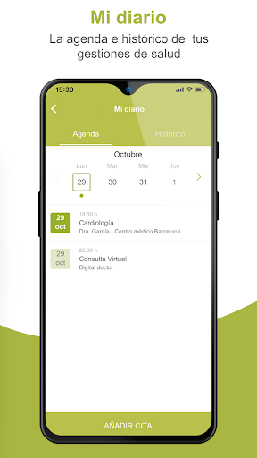
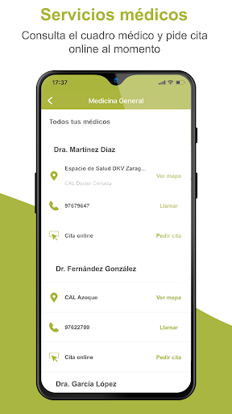
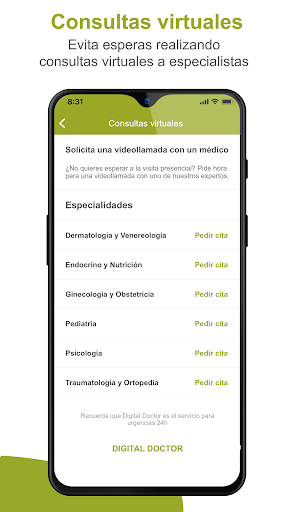
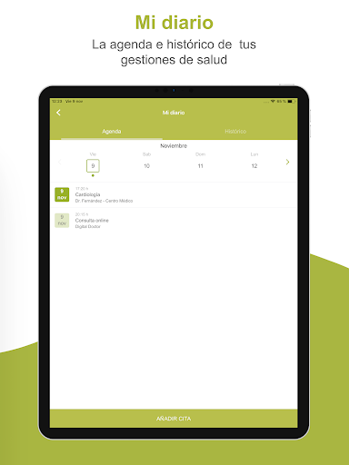
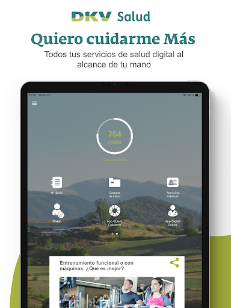
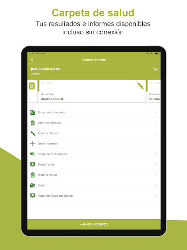
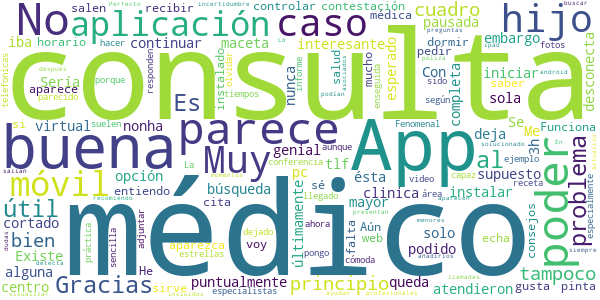
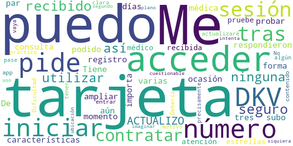
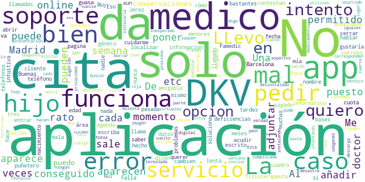
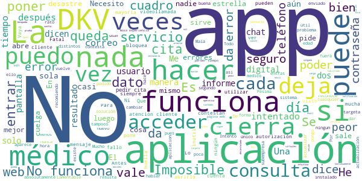

# DKV Quiero cuidarme Más
App version ``2.2.2``

Analyzed with [covid-apps-observer](http://github.com/covid-apps-observer) project, version ``0.1``

## App overview
| | |
|-------------------------|-------------------------| 
| **Name**&nbsp;&nbsp;&nbsp;&nbsp;&nbsp;&nbsp;&nbsp;&nbsp;&nbsp;&nbsp;&nbsp;&nbsp;&nbsp;&nbsp;&nbsp;&nbsp;&nbsp;&nbsp;&nbsp;&nbsp;&nbsp;&nbsp;&nbsp;&nbsp;&nbsp;&nbsp;&nbsp;&nbsp;&nbsp;&nbsp;&nbsp;&nbsp;&nbsp;&nbsp;&nbsp;&nbsp;&nbsp;&nbsp;&nbsp;&nbsp;  | DKV Quiero cuidarme Más |
| **Unique identifier** | com.dkvservicios.quierocuidarmemas |
| **Link to Google Play** | [https://play.google.com/store/apps/details?id=com.dkvservicios.quierocuidarmemas](https://play.google.com/store/apps/details?id=com.dkvservicios.quierocuidarmemas) |
| **Summary**  | Consulta con especialistas, comadrona y cita online. Ahora con Digital Doctor. |
| **Privacy policy** | [http://quierocuidarmemas.dkvsalud.es/AvisoLegal/AvisoLegal.aspx](http://quierocuidarmemas.dkvsalud.es/AvisoLegal/AvisoLegal.aspx) |
| **Latest version** | 2.2.2 |
| **Last update** | 2020-12-01 08:30:07 |
| **Recent changes** | En esta versión de Quiero cuidarme Más podrás visualizar, editar y seleccionar tus familiares para utilizar los servicios para ellos desde la parte superior de la pantalla principal, donde también encontrarás la sección de ayuda y configuración. Hemos aplicado diversas mejoras de rendimiento y estabilidad para que tengas una mejor experiencia. |
| **Installs**  | 100.000+ |
| **Category** | Salud y bienestar |
| **First release** | 19 nov 2018 |
| **Size**  | 104M |
| **Supported Android version**  | 5.0 y versiones posteriores |

### Description
> Quiero cuidarme Más te permite mantenerte al día de tu salud, resolver tus dudas con profesionales y acceder a consejos adaptados a ti.
 ¿Estás en el médico y quieres enseñarle tu última analítica o informe? ¿quieres pedir cita en un Espacio de salud DKV desde tu móvil? Desde la app Quiero cuidarme Más puedes hacerlo. ¡Anímate a descubrirla!
 Estos son las funcionalidades a las que puedes acceder desde Quiero cuidarme Más:
 •	Chat médico gratis con médicos voluntarios, con el objetivo de descongestionar el sistema de salud durante la crisis sanitaria actual.
 •	Mi diario, el resumen de tu actividad reciente y la información más relevante de tus gestiones de salud.
 •	Índice de vida saludable, un valor del 0 al 1000 que te permite saber si vas por buen camino en la adopción de un estilo de vida saludable.
 •	Indicadores de salud, la gestión de múltiples parámetros de tu salud, como la actividad física, el peso, la presión arterial, entre otro.
 •	Conexión con las plataformas Apple Health, Google Fit, Garmin y Fitbit.
 •	Contenido de salud y bienestar para que estés al día de las últimas tendencias y temas de interés.
 Además, por ser cliente de DKV también tienes acceso a:
 •	DKV Club Salud y Bienestar, donde disfrutarás de descuentos, sorteos y promociones en servicios y productos de salud y bienestar. Desde Quiero cuidarme Más puedes visualizar ofertas y las reservas que hayas realizado.
 Si tienes póliza de salud, DKV Selección o DKV Famedic Profesional, también puedes acceder a:
 •	Digital Doctor, comprueba tus síntomas y consulta online con medicina general y diferentes especialidades por video, chat y voz; para ti y tus familiares incluidos.
 •	Carpeta de salud, donde podrás almacenar y consultar tus documentos de salud, como análisis clínicos o informes médicos.
 •	Receta electrónica, que recibirás en tu carpeta de salud con todo lo que te haya recetado un médico en Quiero cuidarme Más.
 •	Solicitud de pruebas médicas, para análisis y pruebas de imagen que indique el profesional y que podrás visualizar y mostrar desde tu teléfono.
 •	Familiares, para poder gestionar tus familiares incluidos en póliza, menores de edad o autorizados, y usar los servicios disponibles para ellos.
 Y en exclusiva para los clientes de salud:
 •	Cuadro médico con posibilidad de pedir cita online en los centros integrados y consulta virtual en aquellos que la ofrezcan.
 •	Coach, un asesor personal con el que podrás hablar a través de chat para que te ayude a llevar hábitos de vida saludables, como dejar de fumar, bajar de peso o mejorar tu actividad física.
 •	Comadrona digital, que te asesorará por chat sobre tu salud y la de tu bebé durante el postparto. 
 •	Tarjeta digital, ya no necesitarás llevar contigo la tarjeta Medicard física porque desde Quiero cuidarme Más la tendrás en tu móvil.
 •	Información sobre el servicio de segunda opinión médica.
 Quiero cuidarme Más es gestionada por DKV Servicios SA, entidad que tiene encomendada la prestación y desarrollo de servicios de salud digital para los asegurados de DKV Seguros y Reaseguros SAE.
 Te recordamos que nos tomamos muy en serio la privacidad y por eso tus datos se tratan de forma segura cumpliendo con la legislación vigente.
 Si tienes dudas puedes contactarnos en soporte@dkvservicios.com

### User interface
The developers of the app provide the following screenshots in the Google play store.
| | | |
|:-------------------------:|:-------------------------:|:-------------------------:|
 |   |   |   | 
 |   |   |   | 
 |   |   |   | 
 |   |   |   | 
 |   |   |   | 
 |   |   |   | 

## Development team
In the following we report the main information provided by the development team in the Google play store.

| | |
|-------------------------|-------------------------|
| **Developer**  | DKV Servicios |
| **Website**  | [https://dkvseguros.es](https://dkvseguros.es) |
| **Email** | aplicaciones@dkvservicios.com |
| **Physical address**  | [TORRE DKV, AVDA. MARIA ZAMBRANO, 31 CP: 50.018 ZARAGOZA.](https://www.google.com/maps/search/TORRE%20DKV,%20AVDA.%20MARIA%20ZAMBRANO,%2031%20CP:%2050.018%20ZARAGOZA.) (Google Maps) |
| **Other developed apps**  | [https://play.google.com/store/apps/developer?id=DKV+Servicios](https://play.google.com/store/apps/developer?id=DKV+Servicios) |

## Android support

| | |
|-------------------------|-------------------------|
| **Declared target Android version**  | Android10, version 10 (API level 29) |
| **Effective target Android version**  | Android10, version 10 (API level 29) |
| **Minimum supported Android version**  | Lollipop, version 5.0 (API level 21) |
| **Maximum target Android version**  | - |

The larger the difference between the minimum and maximum supported Android versions, the better. A larger difference means a wider audience. For example, old phones have a very low Android version, so a high minimum supported Android version means that the app cannot be used by users with old phones, thus leading to accessibility problems. 

## Requested permissions

In the following we report the complete list of the permissions requested by the app. 

| **Permission** | **Protection level** | **Description** | 
|-------------------------|-------------------------|-------------------------|
 **android.permission ACCESS_COARSE_LOCATION** | :warning:**Dangerous** | Allows an app to access approximate location. 
 **android.permission ACCESS_FINE_LOCATION** | :warning:**Dangerous** | Allows an app to access precise location. 
 **android.permission ACCESS_NETWORK_STATE** | Normal | Allows applications to access information about networks. 
 **android.permission ACCESS_WIFI_STATE** | Normal | Allows applications to access information about Wi-Fi networks. 
 **android.permission BLUETOOTH** | Normal | Allows applications to connect to paired bluetooth devices. 
 **android.permission CAMERA** | :warning:**Dangerous** | Required to be able to access the camera device. 
 **android.permission DISABLE_KEYGUARD** | Normal | Allows applications to disable the keyguard if it is not secure. 
 **android.permission INTERNET** | Normal | Allows applications to open network sockets. 
 **android.permission MODIFY_AUDIO_SETTINGS** | Normal | Allows an application to modify global audio settings. 
 **android.permission READ_APP_BADGE** | - | - 
 **android.permission READ_EXTERNAL_STORAGE** | :warning:**Dangerous** | Allows an application to read from external storage. 
 **android.permission READ_PHONE_STATE** | :warning:**Dangerous** | Allows read only access to phone state, including the phone number of the device, current cellular network information, the status of any ongoing calls, and a list of any PhoneAccounts registered on the device. 
 **android.permission RECORD_AUDIO** | :warning:**Dangerous** | Allows an application to record audio. 
 **android.permission USE_FINGERPRINT** | Normal | This constant was deprecated in API level 28. Applications should request USE_BIOMETRIC instead 
 **android.permission WAKE_LOCK** | Normal | Allows using PowerManager WakeLocks to keep processor from sleeping or screen from dimming. 
 **android.permission WRITE_EXTERNAL_STORAGE** | :warning:**Dangerous** | Allows an application to write to external storage. 
 **com.anddoes.launcher.permission UPDATE_COUNT** | - | - 
 **com.google.android.c2dm.permission RECEIVE** | - | - 
 **com.google.android.finsky.permission BIND_GET_INSTALL_REFERRER_SERVICE** | - | - 
 **com.htc.launcher.permission READ_SETTINGS** | - | - 
 **com.htc.launcher.permission UPDATE_SHORTCUT** | - | - 
 **com.huawei.android.launcher.permission CHANGE_BADGE** | - | - 
 **com.huawei.android.launcher.permission READ_SETTINGS** | - | - 
 **com.huawei.android.launcher.permission WRITE_SETTINGS** | - | - 
 **com.majeur.launcher.permission UPDATE_BADGE** | - | - 
 **com.oppo.launcher.permission READ_SETTINGS** | - | - 
 **com.oppo.launcher.permission WRITE_SETTINGS** | - | - 
 **com.sec.android.provider.badge.permission READ** | - | - 
 **com.sec.android.provider.badge.permission WRITE** | - | - 
 **com.sonyericsson.home.permission BROADCAST_BADGE** | - | - 
 **com.sonymobile.home.permission PROVIDER_INSERT_BADGE** | - | - 
 **me.everything.badger.permission BADGE_COUNT_READ** | - | - 
 **me.everything.badger.permission BADGE_COUNT_WRITE** | - | - 

## Mentioned servers

| **Server** | **Registrant** | **Registrant country** | **Creation date** | 
|-------------------------|-------------------------|-------------------------|-------------------------|
 | w3.org | W3C | :us: US | 1994-07-06 04:00:00 |
 | xml.org | OASIS Open | :us: US | 1997-02-03 05:00:00 |
 | xmlpull.org | WhoisGuard, Inc. | PA | 2001-11-26 20:33:08 |
 | dkvservicios.com | GDPR Masked | :es: ES | 2004-09-27 10:49:30 |
 | dkvseguros.com | GDPR Masked | :es: ES | 2000-10-23 14:38:48 |
 | android.com | Google LLC | :us: US | 1997-06-23 04:00:00 |
 | googlesyndication.com | Google LLC | :us: US | 2003-01-21 06:17:24 |
 | google.com | Google LLC | :us: US | 1997-09-15 04:00:00 |
 | getpostman.com | Whois Privacy Service | :us: US | 2012-05-24 20:56:32 |
 | googleapis.com | Google LLC | :us: US | 2005-01-25 17:52:26 |
 | google-analytics.com | Google LLC | :us: US | 2005-07-18 19:24:32 |
 | app-measurement.com | Google LLC | :us: US | 2015-06-19 20:13:31 |
 | mediktor.com | REDACTED FOR PRIVACY | :es: ES | 2011-04-30 20:55:09 |
 | gstatic.com | Google LLC | :us: US | 2008-02-11 15:31:25 |
 | crashlytics.com | Google LLC | :us: US | 2011-01-21 15:30:40 |

## Security analysis 

Below we report the main security warnings raised by our execution of the [Androwarn](https://github.com/maaaaz/androwarn) security analysis tool.

**Telephony identifiers leakage**
> - This application reads the numeric name (MCC+MNC) of current registered operator 
> - This application reads the operator name 

**Connection interfaces exfiltration**
> - This application reads details about the currently active data network 

**Telephony services abuse**
> - This application makes phone calls 

**Audio video eavesdropping**
> - This application records audio from the 'MIC' source  

**Suspicious connection establishment**
> - This application opens a Socket and connects it to the remote address '' on the 'N/A' port  
> - This application opens a Socket and connects it to the remote address 'Ljava/lang/StringBuilder;->toString()Ljava/lang/String;' on the 'N/A' port  
> - This application opens a Socket and connects it to the remote address 'Ljava/net/Proxy;->type()Ljava/net/Proxy$Type;' on the 'N/A' port  
> - This application opens a Socket and connects it to the remote address 'timeout' on the 'N/A' port  

**Pim data leakage**
> - This application accesses the downloads folder 

**Code execution**
> - This application loads a native library 
> - This application loads a native library: 'c++_shared' 
> - This application loads a native library: 'gpuimage-library' 
> - This application loads a native library: 'jniPdfium' 
> - This application loads a native library: 'modft2' 
> - This application loads a native library: 'modpdfium' 
> - This application loads a native library: 'modpng' 
> - This application loads a native library: 'pl_droidsonroids_gif' 
> - This application executes a UNIX command 
> - This application executes a UNIX command containing this argument: 'Ljava/lang/StringBuilder;->toString()Ljava/lang/String;' 

## User ratings and reviews

Below we provide information about how end users are reacting to the app in terms of ratings and reviews in the Google Play store.

### Ratings

The DKV Quiero cuidarme Más app has been installed by more than **100000** times. At this time, **488** rated the app and its average score is **2.821782**. Below we show the distribution of the ratings across the usual star-based rating of Google Play

:star::star::star::star::star:: 164

:star::star::star::star:: 63

:star::star::star:: 9

:star::star:: 24

:star:: 228

### Reviews 

#### 5-star reviews

> Muy buena  :date: __2020-12-19 23:20:17__

> Muy bueno  :date: __2020-12-09 17:42:38__

> Para mi criterio,está formidable  :date: __2020-12-08 18:02:44__

> Muy buena  :date: __2020-12-02 10:44:59__

> Ha dejado de funcionar de repente. No me permite entrar. Edito: El problema se ha resuelto con la actualización e incluso me han llamado para notificarmelo.  :date: __2020-11-30 19:39:46__

> Una App que integra todo lo necesario para tu salud y el bienestar de los asegurados. Me parece un gran acierto y aporta cercanía con los profesionales de la medicina y acceso rápido a datos, citas y consultas. Un gran éxito. Enhorabuena!!  :date: __2020-11-26 13:28:38__

> Excelente compañía hasta hoy no e visto mejor compañía que la dkv muy contento estoy  :date: __2020-11-20 07:00:20__

> Muy recomendable  :date: __2020-11-18 09:05:26__

> Muy útil  :date: __2020-11-17 18:13:57__

> Aplicación espectacular con multitud de servicios de salud para poder utilizar y de uso muy sencillo. 100%100 recomendable!!  :date: __2020-11-12 10:55:33__

#### 4-star reviews

> Muy buena, me atendieron puntualmente en el caso de mi hijo  :date: __2020-12-17 16:50:03__

> ¿Existe alguna aplicación para instalar en el pc?. Con ésta no me deja, solo en el tlf móvil. Gracias.  :date: __2020-12-05 13:57:10__

> Se queda pausada, no hay maceta de iniciar  :date: __2020-11-26 07:00:53__

> Sería interesante la búsqueda también por centro médico o clinica  :date: __2020-11-18 10:52:25__

> Me parece muy útil la opción de consulta virtual, sin embargo de ha cortado, pero nonha supuesto un problema mayor, ya que se ha podido continuar con la consulta  :date: __2020-11-03 13:16:20__

> Es muy completa,al principio me iba genial, pero últimamente no se ... pero se me desconecta sola y nunca había esperado 3h*; para contestación .. Y me voy a dormir 😴  :date: __2020-09-29 04:10:43__

> Aún no la entiendo mucho, pero me gusta poder controlar mi salud y recibir consejos  :date: __2020-09-14 14:32:21__

> Funciona bien, pero se echa mucho en falta que en el cuadro médico aparezca el horario de los médicos. No sé porque en la web si aparece y en la App no salen.  :date: __2020-09-05 09:24:16__

> He instalado la app y tiene buena pinta pero no sirve para pedir cita médica o saber los especialistas de mi área por ejemplo?  :date: __2020-09-04 10:34:08__

> Fenomenal; La consulta por video conferencia me ha parecido muy práctica, cómoda y útil, especialmente en estos tiempos. (No pongo 5 estrellas porque no he sido capaz de adjuntar fotos en la App y porque, según parece, tampoco ha dejado hacer la receta, aunque sí me ha llegado el informe)  :date: __2020-08-10 17:26:36__

#### 3-star reviews

> Me pide el número de tarjeta DKV para iniciar sesión, pero tras un mes de contratar el seguro, yo no he recibido ninguna tarjeta, así que no la puedo utilizar. ACTUALIZO: me respondieron en un par de días y, al ampliar la forma de registro, ya he podido acceder. Tiene varias características, pero aún no he tenido ocasión de probar la que más importa: la consulta médica. De momento, subo a tres estrellas por la atención recibida, y cuando pruebe el médico actualizaré.  :date: __2020-12-02 17:50:18__

> Dificultad para entrar en la app Debería tener más contenido práctico  :date: __2020-10-05 12:16:30__

> No es muy clara, precisamente, pero eso vaya y pase... por algún motivo que no puedo siquiera imaginar, intenta acceder a la ubicación en segundo plano cuando no está en uso, lo cual es ya cuestionable.  :date: __2020-09-01 12:21:44__

#### 2-star reviews

> Da bastantes problemas  :date: __2020-12-09 17:07:21__

> LLevo como 10 llamadas,no solo para la app quiero cuidarme mucho que no hace nada de lo que dicen en la informacion,en mi área cliente cuando intento abrir cuadro medico me da solo la opcion de fisioterapeuta ¡¡¡¡¡,en la pagina DKV Famedic,aun no he conseguido entrar y ya he pagado 2 meses de cuota y he puesto a soporte 3 correos y he llamado a 3/4 telefonos y nadie me soluciona nada,Madrid,Jerez,Barcelona etc etc.....muchas deficiencias en el soporte informatico,empezamos mal si no puedes localizar ya el medico al que acudir......  :date: __2020-12-08 14:29:12__

> Muy mala app poco amigable  :date: __2020-11-23 09:59:56__

> Buenas tardes, me gustaría saber cómo añadir hijos menores de edad  :date: __2020-11-03 19:16:06__

> Falla, no ser puede cerrar  :date: __2020-10-26 20:54:24__

> La agenda no va. Solo me ha permitido poner una cita mía. Al querer poner una de mi hijo da error 7110 todo el rato, que escriba a soporte dkv (al que ya he escrito la semana pasada y no me han hecho ni puñetero caso) o que llame a un teléfono que nunca contestan. Una guasa. Eso por no hablar de que llevo tres semanas para que me cambien en sus bases de datos el nombre, el género y la fecha de nacimiento, que están mal, y el mismo caso que antes . De momento, muy mal con DKV.  :date: __2020-10-26 18:03:10__

> No funciona bien la aplicación  :date: __2020-10-17 10:09:06__

> Poco intuitiva, lenta, los aspectos que cuidan tu privacidad hacen que sea muy complicada de usar  :date: __2020-09-23 19:28:24__

> A mi no me aparece la opcion Servicios Medicos. Me aparecen dos opciones iguales, chat medicos. La he desinstalado y vuelto a instalar y las imagenes que aparecen de presentacion de la app no se corresponden con lo que me sale en mi movil.  :date: __2020-09-22 09:47:41__

> La verdad es que no me ha permitido adjuntar imagen (fotos) con los síntomas, puesto que da un error y se cuelga la aplicación. Una lástima.  :date: __2020-09-11 13:42:23__

#### 1-star reviews

> Es Domingo y no puedo contactar ni con atención al cliente por teléfono ni contactar con un médico a través de la app. Da error número 6000 todo el rato. Lamentable.  :date: __2020-12-20 15:58:42__

> No me deja iniciar sesión, se cierra antes de ejecutarse.  :date: __2020-12-15 12:54:30__

> No funciona!!  :date: __2020-12-15 03:25:57__

> Nada , basura , entras a la app y al rato te saca y vuelta a empezar .  :date: __2020-12-14 13:34:39__

> Fatal  :date: __2020-12-07 13:20:51__

> No me deja entrar en la aplicación me dice que mi móvil está rooteado... Y no lo está.  :date: __2020-12-04 14:49:24__

> No puedo entrar ya que me dice que no tengo habilitado java srcipt, entro en mi navegador y sí está habilitado. No encuentro la solución  :date: __2020-12-04 08:57:01__

> Pésima. No funciona casi nada.  :date: __2020-12-02 08:16:08__

> Vaya cuadro de aplicación. Se cierra sola cada vez que intentas abrirla. Imposible dd usar. Cuadro de aplicación y aún peor servicio de seguro médico!  :date: __2020-11-30 06:47:02__

> Es un auténtico desastre no hay forma de conectarse, muy complicada la aplicación,te pide muchos datos para entrar.La dejé por imposible incluso después de hablar con un técnico.  :date: __2020-11-27 21:47:22__

