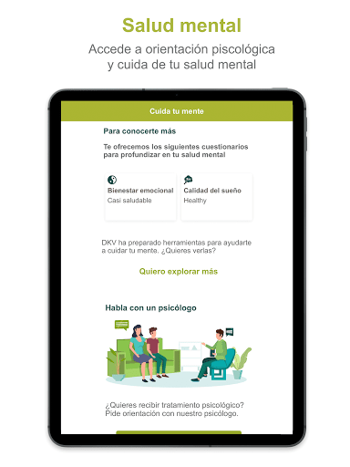
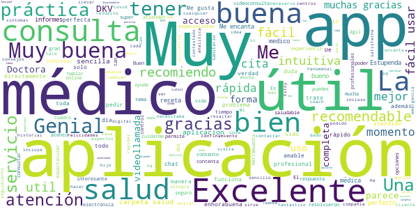
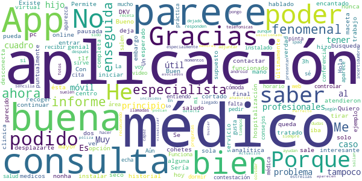
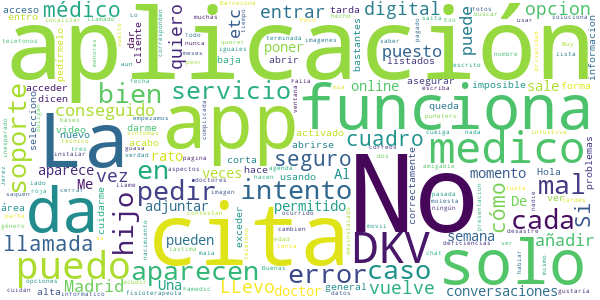
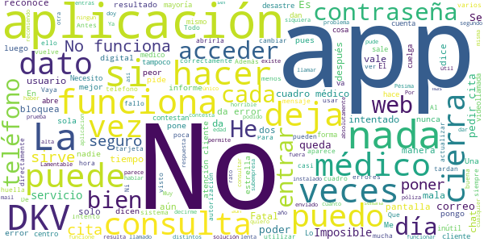

# DKV Quiero cuidarme Más: tu salud y médicos online
App version ``2.2.9``

Analyzed with [covid-apps-observer](http://github.com/covid-apps-observer) project, version ``0.1``

## App overview
| | |
|-------------------------|-------------------------| 
| **Name**&nbsp;&nbsp;&nbsp;&nbsp;&nbsp;&nbsp;&nbsp;&nbsp;&nbsp;&nbsp;&nbsp;&nbsp;&nbsp;&nbsp;&nbsp;&nbsp;&nbsp;&nbsp;&nbsp;&nbsp;&nbsp;&nbsp;&nbsp;&nbsp;&nbsp;&nbsp;&nbsp;&nbsp;&nbsp;&nbsp;&nbsp;&nbsp;&nbsp;&nbsp;&nbsp;&nbsp;&nbsp;&nbsp;&nbsp;&nbsp;  | DKV Quiero cuidarme Más: tu salud y médicos online |
| **Unique identifier** | com.dkvservicios.quierocuidarmemas |
| **Link to Google Play** | [https://play.google.com/store/apps/details?id=com.dkvservicios.quierocuidarmemas](https://play.google.com/store/apps/details?id=com.dkvservicios.quierocuidarmemas) |
| **Summary**  | Gestiona tu salud y pide cita o consulta virtual con médicos y especialistas. |
| **Privacy policy** | [http://quierocuidarmemas.dkvsalud.es/AvisoLegal/AvisoLegal.aspx](http://quierocuidarmemas.dkvsalud.es/AvisoLegal/AvisoLegal.aspx) |
| **Latest version** | 2.2.9 |
| **Last update** | 2021-03-03 08:27:31 |
| **Recent changes** | En esta versión de Quiero cuidarme Más hemos aplicado diversas mejoras de rendimiento y estabilidad para que tengas una mejor experiencia. |
| **Installs**  | 100.000+ |
| **Category** | Salud y bienestar |
| **First release** | 19 nov 2018 |
| **Size**  | 103M |
| **Supported Android version**  | 5.0 y versiones posteriores |

### Description
> Quiero cuidarme Más te permite mantenerte al día de tu salud, resolver tus dudas con profesionales y acceder a consejos adaptados a ti.
 ¿Estás en el médico y quieres enseñarle tu última analítica o informe? ¿Quieres pedir cita en un Espacio de salud DKV desde tu móvil? Desde la app Quiero cuidarme Más puedes hacerlo. ¡Anímate a descubrirla!
 Estas son las funcionalidades a las que puedes acceder desde Quiero cuidarme Más seas o no cliente de DKV:
 •	Chat con médico general 24h con el objetivo de ayudar durante la crisis del COVID-19. Servicio cubierto por médicos voluntarios si no eres cliente. (Más info en medicosfrentealcovid.org)
 •	Mi diario, el resumen de tu actividad reciente y la información más relevante de tus gestiones de salud.
 •	Índice de vida saludable, un valor que te permite saber si vas por buen camino en la adopción de un estilo de vida saludable.
 •	Indicadores de salud, como la actividad física, el peso, la presión arterial, entre otros.
 •	Conexión con las plataformas Apple Health, Google Fit, Garmin y Fitbit.
 •	Contenido de salud y bienestar para que estés al día de las últimas tendencias y temas de interés.
 Además, por ser cliente de DKV también tienes acceso a:
 •	DKV Club Salud y Bienestar, donde disfrutarás de descuentos, sorteos y promociones en servicios y productos de salud y bienestar. Desde Quiero cuidarme Más puedes visualizar ofertas y las reservas que hayas realizado.
 Si tienes póliza de salud, DKV Selección o DKV Famedic Profesional, también puedes acceder a:
 •	Consulta virtual: con medicina general y, según tu póliza, diferentes especialidades por video, chat y voz; para ti y tus familiares incluidos.
 •	Cuadro médico con posibilidad de pedir cita online en los centros integrados y consulta virtual en aquellos que la ofrezcan.
 •	Carpeta de salud, almacena y consulta tus documentos de salud, como análisis clínicos o informes médicos. Además, puedes compartir toda tu carpeta de salud con nuestros médicos y así podrán revisar tus informes y resultados de pruebas.
 •	Receta electrónica, que podrás solicitar de forma sencilla y recibirás en tu carpeta de salud con lo recetado por un médico en Quiero cuidarme Más. Además, podrás ver fácilmente el detalle de la medicación prescrita.
 •	Chequeador de síntomas, comprueba tus síntomas para recibir una orientación. 
 •	Solicitud de pruebas médicas, para análisis y pruebas de imagen que indique el profesional y que podrás visualizar y mostrar desde tu teléfono.
 •	Además, puedes usar los servicios para tus familiares menores de edad incluidos en póliza.
 Y en exclusiva para los clientes de salud:
 •	Tarjeta digital, ya no necesitarás llevar contigo la tarjeta Medicard física porque la tendrás en tu móvil.
 •	Coach, un asesor personal a través de chat que te ayudará a llevar hábitos de vida saludables, como dejar de fumar, bajar de peso o mejorar tu actividad física.
 •	Comadrona digital, que te asesorará por chat sobre tu salud y la de tu bebé durante el embarazo y el postparto. 
 •	Salud mental, te ofrecemos una sección con información sobre tu salud mental y la posibilidad de recibir orientación psicológica para poner solución a temas que te preocupan.
 •	E información sobre el servicio de segunda opinión médica.
 Quiero cuidarme Más es gestionada por DKV Servicios SA, entidad que presta y desarrolla servicios de salud digital para los asegurados de DKV Seguros y Reaseguros SAE.
 Nos tomamos muy en serio la privacidad y por eso tus datos se tratan de forma segura cumpliendo con la legislación vigente.
 Si tienes dudas puedes contactarnos en soporte@dkvservicios.com

### User interface
The developers of the app provide the following screenshots in the Google play store.
| | | |
|:-------------------------:|:-------------------------:|:-------------------------:|
 |   |   |   | 
 |   |   |   | 
 |   |   |   | 
 |   |   |   | 
 |   |   |   | 
 |   |   |   | 
 |   |   |   | 
 |   |   |   | 

## Development team
In the following we report the main information provided by the development team in the Google play store.

| | |
|-------------------------|-------------------------|
| **Developer**  | DKV Servicios |
| **Website**  | [https://dkvseguros.es](https://dkvseguros.es) |
| **Email** | aplicaciones@dkvservicios.com |
| **Physical address**  | [TORRE DKV, AVDA. MARIA ZAMBRANO, 31 CP: 50.018 ZARAGOZA.](https://www.google.com/maps/search/TORRE%20DKV,%20AVDA.%20MARIA%20ZAMBRANO,%2031%20CP:%2050.018%20ZARAGOZA.) (Google Maps) |
| **Other developed apps**  | [https://play.google.com/store/apps/developer?id=DKV+Servicios](https://play.google.com/store/apps/developer?id=DKV+Servicios) |

## Android support

| | |
|-------------------------|-------------------------|
| **Declared target Android version**  | Android10, version 10 (API level 29) |
| **Effective target Android version**  | Android10, version 10 (API level 29) |
| **Minimum supported Android version**  | Lollipop, version 5.0 (API level 21) |
| **Maximum target Android version**  | - |

The larger the difference between the minimum and maximum supported Android versions, the better. A larger difference means a wider audience. For example, old phones have a very low Android version, so a high minimum supported Android version means that the app cannot be used by users with old phones, thus leading to accessibility problems. 

## Requested permissions

In the following we report the complete list of the permissions requested by the app. 

| **Permission** | **Protection level** | **Description** | 
|-------------------------|-------------------------|-------------------------|
 **android.permission ACCESS_COARSE_LOCATION** | :warning:**Dangerous** | Allows an app to access approximate location. 
 **android.permission ACCESS_FINE_LOCATION** | :warning:**Dangerous** | Allows an app to access precise location. 
 **android.permission ACCESS_NETWORK_STATE** | Normal | Allows applications to access information about networks. 
 **android.permission ACCESS_WIFI_STATE** | Normal | Allows applications to access information about Wi-Fi networks. 
 **android.permission BLUETOOTH** | Normal | Allows applications to connect to paired bluetooth devices. 
 **android.permission CAMERA** | :warning:**Dangerous** | Required to be able to access the camera device. 
 **android.permission DISABLE_KEYGUARD** | Normal | Allows applications to disable the keyguard if it is not secure. 
 **android.permission INTERNET** | Normal | Allows applications to open network sockets. 
 **android.permission MODIFY_AUDIO_SETTINGS** | Normal | Allows an application to modify global audio settings. 
 **android.permission READ_APP_BADGE** | - | - 
 **android.permission READ_EXTERNAL_STORAGE** | :warning:**Dangerous** | Allows an application to read from external storage. 
 **android.permission READ_PHONE_STATE** | :warning:**Dangerous** | Allows read only access to phone state, including the phone number of the device, current cellular network information, the status of any ongoing calls, and a list of any PhoneAccounts registered on the device. 
 **android.permission RECORD_AUDIO** | :warning:**Dangerous** | Allows an application to record audio. 
 **android.permission USE_FINGERPRINT** | Normal | This constant was deprecated in API level 28. Applications should request USE_BIOMETRIC instead 
 **android.permission WAKE_LOCK** | Normal | Allows using PowerManager WakeLocks to keep processor from sleeping or screen from dimming. 
 **android.permission WRITE_EXTERNAL_STORAGE** | :warning:**Dangerous** | Allows an application to write to external storage. 
 **com.anddoes.launcher.permission UPDATE_COUNT** | - | - 
 **com.google.android.c2dm.permission RECEIVE** | - | - 
 **com.google.android.finsky.permission BIND_GET_INSTALL_REFERRER_SERVICE** | - | - 
 **com.htc.launcher.permission READ_SETTINGS** | - | - 
 **com.htc.launcher.permission UPDATE_SHORTCUT** | - | - 
 **com.huawei.android.launcher.permission CHANGE_BADGE** | - | - 
 **com.huawei.android.launcher.permission READ_SETTINGS** | - | - 
 **com.huawei.android.launcher.permission WRITE_SETTINGS** | - | - 
 **com.majeur.launcher.permission UPDATE_BADGE** | - | - 
 **com.oppo.launcher.permission READ_SETTINGS** | - | - 
 **com.oppo.launcher.permission WRITE_SETTINGS** | - | - 
 **com.sec.android.provider.badge.permission READ** | - | - 
 **com.sec.android.provider.badge.permission WRITE** | - | - 
 **com.sonyericsson.home.permission BROADCAST_BADGE** | - | - 
 **com.sonymobile.home.permission PROVIDER_INSERT_BADGE** | - | - 
 **me.everything.badger.permission BADGE_COUNT_READ** | - | - 
 **me.everything.badger.permission BADGE_COUNT_WRITE** | - | - 

## Mentioned servers

| **Server** | **Registrant** | **Registrant country** | **Creation date** | 
|-------------------------|-------------------------|-------------------------|-------------------------|
 | w3.org | W3C | :us: US | 1994-07-06 04:00:00 |
 | xml.org | OASIS Open | :us: US | 1997-02-03 05:00:00 |
 | xmlpull.org | WhoisGuard, Inc. | PA | 2001-11-26 20:33:08 |
 | dkvservicios.com | GDPR Masked | :es: ES | 2004-09-27 10:49:30 |
 | dkvseguros.com | GDPR Masked | :es: ES | 2000-10-23 14:38:48 |
 | getpostman.com | Whois Privacy Service | :us: US | 2012-05-24 20:56:32 |
 | dkvsalud.com | GDPR Masked | :es: ES | 2008-08-11 07:54:58 |
 | android.com | Google LLC | :us: US | 1997-06-23 04:00:00 |
 | googlesyndication.com | Google LLC | :us: US | 2003-01-21 06:17:24 |
 | google.com | Google LLC | :us: US | 1997-09-15 04:00:00 |
 | google-analytics.com | Google LLC | :us: US | 2005-07-18 19:24:32 |
 | app-measurement.com | Google LLC | :us: US | 2015-06-19 20:13:31 |
 | mediktor.com | REDACTED FOR PRIVACY | :es: ES | 2011-04-30 20:55:09 |
 | gstatic.com | Google LLC | :us: US | 2008-02-11 15:31:25 |
 | crashlytics.com | Google LLC | :us: US | 2011-01-21 15:30:40 |
 | googleapis.com | Google LLC | :us: US | 2005-01-25 17:52:26 |

## Security analysis 

Below we report the main security warnings raised by our execution of the [Androwarn](https://github.com/maaaaz/androwarn) security analysis tool.

**Telephony identifiers leakage**
> - This application reads the numeric name (MCC+MNC) of current registered operator 
> - This application reads the operator name 

**Connection interfaces exfiltration**
> - This application reads details about the currently active data network 

**Telephony services abuse**
> - This application makes phone calls 

**Audio video eavesdropping**
> - This application records audio from the 'MIC' source  

**Suspicious connection establishment**
> - This application opens a Socket and connects it to the remote address '' on the 'N/A' port  
> - This application opens a Socket and connects it to the remote address 'Ljava/lang/StringBuilder;->toString()Ljava/lang/String;' on the 'N/A' port  
> - This application opens a Socket and connects it to the remote address 'Ljava/net/Proxy;->type()Ljava/net/Proxy$Type;' on the 'N/A' port  
> - This application opens a Socket and connects it to the remote address 'timeout' on the 'N/A' port  

**Pim data leakage**
> - This application accesses the downloads folder 

**Code execution**
> - This application loads a native library 
> - This application loads a native library: 'gpuimage-library' 
> - This application loads a native library: 'jniPdfium' 
> - This application loads a native library: 'modft2' 
> - This application loads a native library: 'modpdfium' 
> - This application loads a native library: 'modpng' 
> - This application loads a native library: 'pl_droidsonroids_gif' 
> - This application executes a UNIX command 
> - This application executes a UNIX command containing this argument: 'Ljava/lang/StringBuilder;->toString()Ljava/lang/String;' 

## User ratings and reviews

Below we provide information about how end users are reacting to the app in terms of ratings and reviews in the Google Play store.

### Ratings

The DKV Quiero cuidarme Más: tu salud y médicos online app has been installed by more than **100000** times. At this time, **610** rated the app and its average score is **3.6633663**. Below we show the distribution of the ratings across the usual star-based rating of Google Play

:star::star::star::star::star:: 333

:star::star::star::star:: 78

:star::star::star:: 24

:star::star:: 12

:star:: 163

### Reviews 

#### 5-star reviews

> Contento con el servicio  :date: __2021-03-06 02:03:45__

> Excelente  :date: __2021-03-04 10:23:00__

> Sorprendente que funcione tan bien la videollamada  :date: __2021-03-01 20:20:39__

> Va súper bien,los especialistas atiende muy bien y te hacen todo lo necesario para solucionar el problema. Estoy muy contenta con ellos  :date: __2021-02-26 13:29:16__

> Excelente app me encanta  :date: __2021-02-26 12:50:17__

> Muy top!  :date: __2021-02-24 12:48:49__

> Los doctores muy atentos y la aplicación muy bien  :date: __2021-02-24 11:05:58__

> Pues la verdad que soy nueva en esto pero la carpeta salud de mi hijo no se abre por lo cual no puedo entrar para ver las recetas Muchas gracias  :date: __2021-02-23 15:19:35__

> Buen trato  :date: __2021-02-22 15:24:35__

> De momento genial  :date: __2021-02-22 11:51:14__

#### 4-star reviews

> Hola. Quiero saber la aplicación de DKV donde pueda ver los médicos que me entrar, hospitalización... Porque en este aplicación no me sale.Un saludo  :date: __2021-02-06 22:23:30__

> Buen servicio con los medicos online  :date: __2021-01-28 12:08:06__

> Bueno, la verdad que no es una aplicación para tirar cohetes, pero a mi, hoy, me ha funcionado muy bien. He podido contactar con un especialista, que me ha tratado fenomenal y enseguida he tenido su informe. Gracias.  :date: __2021-01-26 23:11:03__

> Me parece buena e hablado por ahora con 3 profesionales y dos de ellas me han encantado, el otro fue un poco más seco pero al final hizo su trabajo.  :date: __2021-01-22 16:10:17__

> Permite tener tu historial a mano y recoger tu analítica sin tener que desplazarte.  :date: __2020-12-21 18:36:08__

> Muy buena, me atendieron puntualmente en el caso de mi hijo  :date: __2020-12-17 16:50:03__

> ¿Existe alguna aplicación para instalar en el pc?. Con ésta no me deja, solo en el tlf móvil. Gracias.  :date: __2020-12-05 13:57:10__

> Se queda pausada, no hay maceta de iniciar  :date: __2020-11-26 07:00:53__

> Sería interesante la búsqueda también por centro médico o clinica  :date: __2020-11-18 10:52:25__

> Me parece muy útil la opción de consulta virtual, sin embargo de ha cortado, pero nonha supuesto un problema mayor, ya que se ha podido continuar con la consulta  :date: __2020-11-03 13:16:20__

#### 3-star reviews

> Da error 3000 al intentar subir archivos a la app  :date: __2021-01-13 15:20:20__

> Por favor no lamenten tanto y dadnos una solución. No quiero pensar que se están aprovechando de la crisis en la que estamos inmersos. Gracias  :date: __2021-01-01 22:37:45__

> Dificultad para entrar en la app Debería tener más contenido práctico  :date: __2020-10-05 12:16:30__

> No es muy clara, precisamente, pero eso vaya y pase... por algún motivo que no puedo siquiera imaginar, intenta acceder a la ubicación en segundo plano cuando no está en uso, lo cual es ya cuestionable.  :date: __2020-09-01 12:21:44__

#### 2-star reviews

> La aplicación tarda mucho en abrirse o se corta usando la video llamada. No aparecen muchos médicos en los listados. En general, no funciona correctamente.  :date: __2021-01-20 12:24:10__

> No me queda activado el acceso digital. Cada vez q entro selecciono está forma de exceder pero vuelve a pedírmelo cuando intento entrar de nuevo.  :date: __2021-01-13 13:27:31__

> Da bastantes problemas  :date: __2020-12-09 17:07:21__

> LLevo como 10 llamadas,no solo para la app quiero cuidarme mucho que no hace nada de lo que dicen en la informacion,en mi área cliente cuando intento abrir cuadro medico me da solo la opcion de fisioterapeuta ¡¡¡¡¡,en la pagina DKV Famedic,aun no he conseguido entrar y ya he pagado 2 meses de cuota y he puesto a soporte 3 correos y he llamado a 3/4 telefonos y nadie me soluciona nada,Madrid,Jerez,Barcelona etc etc.....muchas deficiencias en el soporte informatico,empezamos mal si no puedes localizar ya el medico al que acudir......  :date: __2020-12-08 14:29:12__

> Muy mala app poco amigable  :date: __2020-11-23 09:59:56__

> Buenas tardes, me gustaría saber cómo añadir hijos menores de edad  :date: __2020-11-03 19:16:06__

> Falla, no ser puede cerrar  :date: __2020-10-26 20:54:24__

> La agenda no va. Solo me ha permitido poner una cita mía. Al querer poner una de mi hijo da error 7110 todo el rato, que escriba a soporte dkv (al que ya he escrito la semana pasada y no me han hecho ni puñetero caso) o que llame a un teléfono que nunca contestan. Una guasa. Eso por no hablar de que llevo tres semanas para que me cambien en sus bases de datos el nombre, el género y la fecha de nacimiento, que están mal, y el mismo caso que antes . De momento, muy mal con DKV.  :date: __2020-10-26 18:03:10__

> No funciona bien la aplicación  :date: __2020-10-17 10:09:06__

> Poco intuitiva, lenta, los aspectos que cuidan tu privacidad hacen que sea muy complicada de usar  :date: __2020-09-23 19:28:24__

#### 1-star reviews

> Malisima no lo siguiente he tenido varios seguros médicos y esto ha sido nefasto, en esta aplicación no permite pedir una cita por especialista ni por centro medico, en pocas palabras no sirve para nada tengo que llamar y esperar 30 mins a que me atiendan en la línea telefónica para asignar una cita puffff  :date: __2021-03-06 09:19:25__

> Horroroso tanto la aplicación como los servicios que prestan ,ya que una consulta de dermatología te dan para dentro de 4meses , tardan más que la pública. En cuanto a la app ,las videollamadas no valen para nada por qué no se ven,y otra vas a coger la llamada y se cierra la app,cuando consigues cogerlo,pues se corta y no se escucha muy bien Si haces un chat medico te contestan con suerte cada hora ,otras veces te cierran la consulta directamente,y las recetas nunca llegan.  :date: __2021-03-05 20:26:30__

> Mala aplicación además en dkv, nadie sabe nada y te derivan a teléfonos, algunos inexistentes.  :date: __2021-03-05 13:16:57__

> La forma de buscar médico y seleccionar es muy mala, la de Mapfre funciona mejor, saludos  :date: __2021-02-19 00:17:39__

> Se bloquea al poner el correo y la contraseña. Tuve que llamar para que me lo desbloquearan. Y otra vez mo pude entrar, se volvio a bloquear y la tuve que desinalar.  :date: __2021-02-14 23:22:19__

> No me deja hacer nada, no tengo donde añadir mi tarjeta, ni el cuadro médico....nada....solo tengo una pantalla, cuando me consta que tiene que haber más....  :date: __2021-02-10 00:05:53__

> Llevo toda la tarde intentando descargarla y no hay forma, vuelve a empezar una y otra vez. Ya la tuve que desistalar hace tiempo porque no funcionaba. Llamas al telefono que te dan de soporte 9300..... y nada que mandes correo electronico. Desastrosa la aplicación y la atención.  :date: __2021-02-04 18:27:25__

> Horrible. Además de lenta no me deja cambiar la fecha de nacimiento ( pongo la mía y se pone sola 14/03/1978) y por tanto cuando quiero darme de alta como cliente no me reconoce.  :date: __2021-02-04 14:45:13__

> No te reconoce nunca la contraseña, aunque la escribas correctamente, 15 veces, al no reconocerla, después de 5 intentos, te bloquea. Va fatal !!!!! He leído en una respuesta que cambiando datos de acceso diferentes podía funcionar, pues tampoco, estoy desesperada!!  :date: __2021-02-03 17:05:16__

> va fatal  :date: __2021-01-29 19:29:42__

