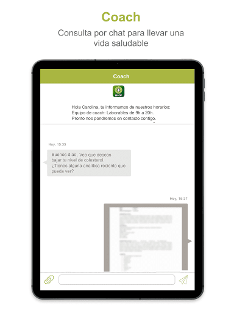
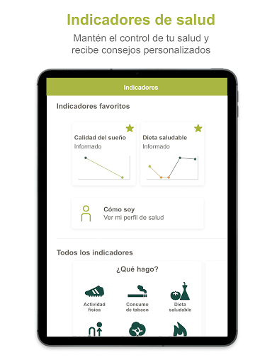
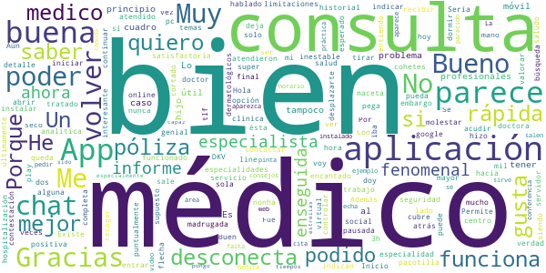
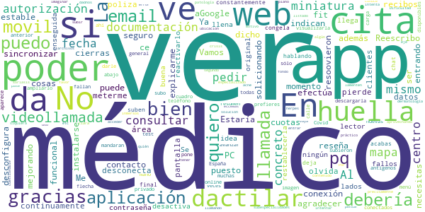
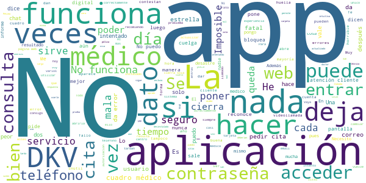

# DKV Quiero cuidarme Más: tu salud y médicos online
App version ``2.3.9``

Analyzed with [covid-apps-observer](http://github.com/covid-apps-observer) project, version ``0.1``

## App overview
| | |
|-------------------------|-------------------------| 
| **Name**&nbsp;&nbsp;&nbsp;&nbsp;&nbsp;&nbsp;&nbsp;&nbsp;&nbsp;&nbsp;&nbsp;&nbsp;&nbsp;&nbsp;&nbsp;&nbsp;&nbsp;&nbsp;&nbsp;&nbsp;&nbsp;&nbsp;&nbsp;&nbsp;&nbsp;&nbsp;&nbsp;&nbsp;&nbsp;&nbsp;&nbsp;&nbsp;&nbsp;&nbsp;&nbsp;&nbsp;&nbsp;&nbsp;&nbsp;&nbsp;  | DKV Quiero cuidarme Más: tu salud y médicos online |
| **Unique identifier** | com.dkvservicios.quierocuidarmemas |
| **Link to Google Play** | [https://play.google.com/store/apps/details?id=com.dkvservicios.quierocuidarmemas](https://play.google.com/store/apps/details?id=com.dkvservicios.quierocuidarmemas) |
| **Summary**  | Gestiona tu salud y pide cita o consulta virtual con médicos y especialistas. |
| **Privacy policy** | [http://quierocuidarmemas.dkvsalud.es/AvisoLegal/AvisoLegal.aspx](http://quierocuidarmemas.dkvsalud.es/AvisoLegal/AvisoLegal.aspx) |
| **Latest version** | 2.3.9 |
| **Last update** | 2021-07-14 08:07:44 |
| **Recent changes** | En esta versión se resuelven problemas con el alta de familiares. |
| **Installs**  | 100.000+ |
| **Category** | Salud y bienestar |
| **First release** | 19 nov 2018 |
| **Size**  | 107M |
| **Supported Android version**  | 5.0 y versiones posteriores |

### Description
> Quiero cuidarme Más te permite mantenerte al día de tu salud, resolver tus dudas con profesionales y acceder a consejos adaptados a ti.
 Estas son las funcionalidades a las que puedes acceder desde Quiero cuidarme Más seas o no cliente de DKV.
 •	Mi diario, el resumen de tu actividad reciente y la información más relevante de tus gestiones de salud.
 •	Índice de vida saludable, un valor del 0 al 1000 que te permite saber si vas por buen camino en la adopción de un estilo de vida saludable.
 •	Indicadores de salud, como la actividad física, el peso, la presión arterial, entre otros.
 •	Conexión con las plataformas Apple Health, Google Fit, Garmin y Fitbit.
 •	Contenido de salud y bienestar para que estés al día de las últimas tendencias y temas de interés.
 Por ser cliente de DKV también tienes acceso a:
 •	DKV Club Salud y Bienestar, donde disfrutarás de descuentos, sorteos y promociones en servicios y productos de salud y bienestar. Desde Quiero cuidarme Más puedes visualizar ofertas y las reservas que hayas realizado.
 Con póliza de salud, DKV Selección o DKV Famedic Profesional, también puedes acceder a:
 •	Consultas, desde donde podrás buscar la especialidad que deseas y verás todas las posibilidades de atención, ya sea presencial o videoconsulta con profesionales de cuadro médico o del Espacio de salud virtual DKV por video, chat y voz (según la especialidad), tanto para ti como para tus familiares menores incluidos en póliza.
 •	Carpeta de salud, almacena y consulta tus documentos de salud, como análisis clínicos o informes médicos. Además, puedes compartir toda tu carpeta de salud con nuestros médicos y así podrán revisar tus informes y resultados de pruebas.
 •	Chequeador de síntomas: Comprueba tus síntomas para recibir una orientación. 
 •	Solicitud de pruebas médicas, para análisis y pruebas de imagen que indique el profesional y que podrás visualizar y mostrar desde tu teléfono.
 Además, puedes usar los servicios para tus familiares menores de edad incluidos en póliza
 Y en exclusiva para los clientes de salud:
 •	Tarjeta digital, ya no necesitarás llevar contigo la tarjeta Medicard física porque la tendrás en tu móvil.
 •	Coach, un asesor personal a través de chat que te ayudará a llevar hábitos de vida saludables, como dejar de fumar, bajar de peso o mejorar tu actividad física.
 •	Comadrona digital, que te asesorará por chat sobre tu salud y la de tu bebé durante el embarazo y el postparto.
 •	Mi farmacia, donde podrás solicitar nuevas recetas, visualizar tus medicamentos y receta electrónica, así como consultar por chat con un profesional de farmacia para resolver tus dudas. Además, verás los descuentos relacionados de DKV Club salud y bienestar.
 •	Salud mental, te ofrecemos una sección en la que agrupamos información sobre el estado de tu salud mental y la posibilidad de recibir orientación psicológica para poner solución a esos temas que te preocupan. Además, verás los descuentos relacionados de DKV Club salud y bienestar.
 •	E información sobre el servicio de segunda opinión médica.
 Quiero cuidarme Más es gestionada por DKV Servicios SA, entidad que presta y desarrolla servicios de salud digital para los asegurados de DKV Seguros y Reaseguros SAE.
 Nos tomamos muy en serio la privacidad y por eso tus datos se tratan de forma segura cumpliendo con la legislación vigente.
 Si tienes dudas puedes contactarnos en soporte@dkvservicios.com

### User interface
The developers of the app provide the following screenshots in the Google play store.
| | | |
|:-------------------------:|:-------------------------:|:-------------------------:|
 |   |   |   | 
 |   |   |   | 
 |   |   |   | 
 |   |   |   | 
 |   |   |   | 
 |   |   |   | 
 |   |   |   | 
 |   |   |   | 

## Development team
In the following we report the main information provided by the development team in the Google play store.

| | |
|-------------------------|-------------------------|
| **Developer**  | DKV Servicios |
| **Website**  | [https://dkvseguros.es](https://dkvseguros.es) |
| **Email** | aplicaciones@dkvservicios.com |
| **Physical address**  | [TORRE DKV, AVDA. MARIA ZAMBRANO, 31 CP: 50.018 ZARAGOZA.](https://www.google.com/maps/search/TORRE%20DKV,%20AVDA.%20MARIA%20ZAMBRANO,%2031%20CP:%2050.018%20ZARAGOZA.) (Google Maps) |
| **Other developed apps**  | [https://play.google.com/store/apps/developer?id=DKV+Servicios](https://play.google.com/store/apps/developer?id=DKV+Servicios) |

## Android support

| | |
|-------------------------|-------------------------|
| **Declared target Android version**  | Android10, version 10 (API level 29) |
| **Effective target Android version**  | Android10, version 10 (API level 29) |
| **Minimum supported Android version**  | Lollipop, version 5.0 (API level 21) |
| **Maximum target Android version**  | - |

The larger the difference between the minimum and maximum supported Android versions, the better. A larger difference means a wider audience. For example, old phones have a very low Android version, so a high minimum supported Android version means that the app cannot be used by users with old phones, thus leading to accessibility problems. 

## Requested permissions

In the following we report the complete list of the permissions requested by the app. 

| **Permission** | **Protection level** | **Description** | 
|-------------------------|-------------------------|-------------------------|
 **android.permission ACCESS_COARSE_LOCATION** | :warning:**Dangerous** | Allows an app to access approximate location. 
 **android.permission ACCESS_FINE_LOCATION** | :warning:**Dangerous** | Allows an app to access precise location. 
 **android.permission ACCESS_NETWORK_STATE** | Normal | Allows applications to access information about networks. 
 **android.permission ACCESS_WIFI_STATE** | Normal | Allows applications to access information about Wi-Fi networks. 
 **android.permission BLUETOOTH** | Normal | Allows applications to connect to paired bluetooth devices. 
 **android.permission CAMERA** | :warning:**Dangerous** | Required to be able to access the camera device. 
 **android.permission DISABLE_KEYGUARD** | Normal | Allows applications to disable the keyguard if it is not secure. 
 **android.permission GET_TASKS** | Deprecated | This constant was deprecated in API level 21. No longer enforced. 
 **android.permission INTERNET** | Normal | Allows applications to open network sockets. 
 **android.permission MODIFY_AUDIO_SETTINGS** | Normal | Allows an application to modify global audio settings. 
 **android.permission READ_APP_BADGE** | - | - 
 **android.permission READ_EXTERNAL_STORAGE** | :warning:**Dangerous** | Allows an application to read from external storage. 
 **android.permission READ_PHONE_STATE** | :warning:**Dangerous** | Allows read only access to phone state, including the phone number of the device, current cellular network information, the status of any ongoing calls, and a list of any PhoneAccounts registered on the device. 
 **android.permission RECORD_AUDIO** | :warning:**Dangerous** | Allows an application to record audio. 
 **android.permission USE_BIOMETRIC** | Normal | Allows an app to use device supported biometric modalities. 
 **android.permission USE_FINGERPRINT** | Normal | This constant was deprecated in API level 28. Applications should request USE_BIOMETRIC instead 
 **android.permission WAKE_LOCK** | Normal | Allows using PowerManager WakeLocks to keep processor from sleeping or screen from dimming. 
 **android.permission WRITE_EXTERNAL_STORAGE** | :warning:**Dangerous** | Allows an application to write to external storage. 
 **com.anddoes.launcher.permission UPDATE_COUNT** | - | - 
 **com.google.android.c2dm.permission RECEIVE** | - | - 
 **com.google.android.finsky.permission BIND_GET_INSTALL_REFERRER_SERVICE** | - | - 
 **com.htc.launcher.permission READ_SETTINGS** | - | - 
 **com.htc.launcher.permission UPDATE_SHORTCUT** | - | - 
 **com.huawei.android.launcher.permission CHANGE_BADGE** | - | - 
 **com.huawei.android.launcher.permission READ_SETTINGS** | - | - 
 **com.huawei.android.launcher.permission WRITE_SETTINGS** | - | - 
 **com.majeur.launcher.permission UPDATE_BADGE** | - | - 
 **com.oppo.launcher.permission READ_SETTINGS** | - | - 
 **com.oppo.launcher.permission WRITE_SETTINGS** | - | - 
 **com.sec.android.provider.badge.permission READ** | - | - 
 **com.sec.android.provider.badge.permission WRITE** | - | - 
 **com.sonyericsson.home.permission BROADCAST_BADGE** | - | - 
 **com.sonymobile.home.permission PROVIDER_INSERT_BADGE** | - | - 
 **me.everything.badger.permission BADGE_COUNT_READ** | - | - 
 **me.everything.badger.permission BADGE_COUNT_WRITE** | - | - 

## Mentioned servers

| **Server** | **Registrant** | **Registrant country** | **Creation date** | 
|-------------------------|-------------------------|-------------------------|-------------------------|
 | w3.org | W3C | :us: US | 1994-07-06 04:00:00 |
 | xml.org | OASIS Open | :us: US | 1997-02-03 05:00:00 |
 | xmlpull.org | Privacy service provided by Withheld for Privacy ehf | :iceland: IS | 2001-11-26 20:33:08 |
 | getpostman.com | Whois Privacy Service | :us: US | 2012-05-24 20:56:32 |
 | dkvservicios.com | GDPR Masked | :es: ES | 2004-09-27 10:49:30 |
 | dkvseguros.com | GDPR Masked | :es: ES | 2000-10-23 14:38:48 |
 | dkvsalud.com | GDPR Masked | :es: ES | 2008-08-11 07:54:58 |
 | android.com | Google LLC | :us: US | 1997-06-23 04:00:00 |
 | googlesyndication.com | Google LLC | :us: US | 2003-01-21 06:17:24 |
 | google.com | Google LLC | :us: US | 1997-09-15 04:00:00 |
 | google-analytics.com | Google LLC | :us: US | 2005-07-18 19:24:32 |
 | app-measurement.com | Google LLC | :us: US | 2015-06-19 20:13:31 |
 | crashlytics.com | Google LLC | :us: US | 2011-01-21 15:30:40 |
 | googleapis.com | Google LLC | :us: US | 2005-01-25 17:52:26 |
 | mediktor.com | REDACTED FOR PRIVACY | :es: ES | 2011-04-30 20:55:09 |
 | gstatic.com | Google LLC | :us: US | 2008-02-11 15:31:25 |

## Security analysis 

Below we report the main security warnings raised by our execution of the [Androwarn](https://github.com/maaaaz/androwarn) security analysis tool.

**Telephony identifiers leakage**
> - This application reads the numeric name (MCC+MNC) of current registered operator 
> - This application reads the operator name 

**Connection interfaces exfiltration**
> - This application reads details about the currently active data network 

**Telephony services abuse**
> - This application makes phone calls 

**Audio video eavesdropping**
> - This application records audio from the 'MIC' source  

**Suspicious connection establishment**
> - This application opens a Socket and connects it to the remote address '' on the 'N/A' port  
> - This application opens a Socket and connects it to the remote address 'Ljava/lang/StringBuilder;->toString()Ljava/lang/String;' on the 'N/A' port  
> - This application opens a Socket and connects it to the remote address 'Ljava/net/Proxy;->type()Ljava/net/Proxy$Type;' on the 'N/A' port  
> - This application opens a Socket and connects it to the remote address 'timeout' on the 'N/A' port  

**Pim data leakage**
> - This application accesses the downloads folder 

**Code execution**
> - This application loads a native library 
> - This application loads a native library: 'gpuimage-library' 
> - This application loads a native library: 'jniPdfium' 
> - This application loads a native library: 'modft2' 
> - This application loads a native library: 'modpdfium' 
> - This application loads a native library: 'modpng' 
> - This application loads a native library: 'pl_droidsonroids_gif' 
> - This application executes a UNIX command 
> - This application executes a UNIX command containing this argument: 'Ljava/lang/StringBuilder;->toString()Ljava/lang/String;' 

## User ratings and reviews

Below we provide information about how end users are reacting to the app in terms of ratings and reviews in the Google Play store.

### Ratings

The DKV Quiero cuidarme Más: tu salud y médicos online app has been installed by more than **100000** times. At this time, **776** rated the app and its average score is **3.8666666**. Below we show the distribution of the ratings across the usual star-based rating of Google Play

:star::star::star::star::star:: 437

:star::star::star::star:: 126

:star::star::star:: 29

:star::star:: 44

:star:: 140

### Reviews 

#### 5-star reviews

> Genial  :date: __2021-07-29 11:24:15__

> Gran atención y muy rápida  :date: __2021-07-27 07:44:33__

> Hablé con la médico para hacer una consulta y la solucióno perfectamente  :date: __2021-07-20 07:28:56__

> Muy buena, me han atendido por videollamada y ha sido muy cómodo y rápido. Han incluido la receta para solucionar el problema y me ha resultado todo muy fácil.  :date: __2021-07-19 09:25:20__

> Mi experiencia con DKV es siempre genial. Esta App ha mejorado mucho el servicio y sobretodo me encanta la atención por chat. Veo muchos comentarios negativos y críticas pero yo, personalmente, no he tenido nunca ningún problema ni con la atención ni con la aplicación.  :date: __2021-07-16 16:01:23__

> Muy útil y práctica  :date: __2021-07-07 16:32:35__

> Muy cómodo y práctica y puedes tener tu gestión médica organizada. Te contestan enseguida y te dan una solución al instante.  :date: __2021-07-01 16:50:31__

> Rápido y cómodo,sin salir de casa,lo haré así cada vez que pueda  :date: __2021-06-21 16:37:53__

> Fue muy buena la consulta virtual, muy aclaratoria y continuaré con pruebas sugeridas por la Dra. para tener seguimiento de mi mejora posteriormente.  :date: __2021-06-17 11:23:38__

> Muy buena  :date: __2021-06-14 18:36:10__

#### 4-star reviews

> Me funciona muy bien  :date: __2021-07-09 06:47:35__

> Bueno pero se desconecta de vez en cuando del servidor.  :date: __2021-06-29 10:53:53__

> Bien. Los temas dermatológicos on line tiene sus limitaciones.  :date: __2021-06-28 15:24:13__

> Un poco inestable, y una pega, si no quiero valorar en google play y doy a la flecha hacia atrás, es para volver a Inicio, no para volver a abrir el chat y volver a molestar al doctor/a. Por otro lado, lo que más me gusta es la consulta super rápida por chat con los médicos, me indican bien a qué especialidad acudir, mil veces mejor que la doctora de pacotilla de la seguridad social. Además, es un chat 24/7, no puede ser mejor. Bueno sí, indicar en detalle las especialidades que cubre mi póliza  :date: __2021-06-25 23:58:08__

> Fue rápida y positiva, siendo la hora de madrugada.  :date: __2021-05-25 06:48:54__

> Muy satisfactoria y muy bien atendido por la medico  :date: __2021-05-17 18:19:48__

> Hola. Quiero saber la aplicación de DKV donde pueda ver los médicos que me entrar, hospitalización... Porque en este aplicación no me sale.Un saludo  :date: __2021-02-06 22:23:30__

> Buen servicio con los medicos online  :date: __2021-01-28 12:08:06__

> Bueno, la verdad que no es una aplicación para tirar cohetes, pero a mi, hoy, me ha funcionado muy bien. He podido contactar con un especialista, que me ha tratado fenomenal y enseguida he tenido su informe. Gracias.  :date: __2021-01-26 23:11:03__

> Me parece buena e hablado por ahora con 3 profesionales y dos de ellas me han encantado, el otro fue un poco más seco pero al final hizo su trabajo.  :date: __2021-01-22 16:10:17__

#### 3-star reviews

> Reescribo la reseña porque ce han puesto en contacto para explicarme algo de lo dicho y es de agradecer y además están solicionando las cosas. Me indican que la huella dactilar se desconfigura se cierras la app, y que de momento no se puede sincronizar con aGoogle fit. Vamos mejorando.  :date: __2021-07-27 22:44:59__

> Ya me lo resoovieron gracias  :date: __2021-07-22 13:50:35__

> Estaría bien poder ver tus recibos y el estado de los mismos de las cuotas del seguro  :date: __2021-07-02 11:10:43__

> La aplicación debería poder instalarse en el PC para ser más funcional pq desde el movil la conexión no es estable, hasta que se efectúa la llamada necesitas estar entrando continuamente pq la pantalla del movil se pierde y se desconecta.  :date: __2021-06-16 11:57:57__

> No puedo ver en la aplicación mis datos de la poliza, tengo q meterme en área de clientes por fuera y se me olvida la contraseña, cuando quiero restablecerla no me llega ningún email  :date: __2021-04-30 10:55:46__

> La idea de la App es buena y original, pero está llena de fallos por todos lados: ................................................................. > Se desactiva enseguida el lector de huella dactilar y tienes que reactivarlo constantemente. ................................................> En las citas por videollamada se congela y al final acabas hablando por chat/llamada ------------------> En documentación si te suben una autorización no deja visualizarla ni descargarla, se ve sólo como una imagen miniatura (a mí me subieron una autorización de test de antigenos Covid y tuve que pedir que me la mandaran por email) + si subo yo o el médico documentación, no me aparece en mi menú privado de la web, no están conectados. -----------------> Al consultar citas nuevas por videollamada/online fallan las citas disponibles porque te pone una fecha y cuando das a la flecha a avanzar ves abajo en resumen de todas que había otra anterior de fecha y tienes que darle desde ahí ----------------> Al consultar médicos en el cuadro médico, si le das a ver mapa (en general o en un médico concreto) el mapa se carga con España en miniatura que tienes que ampliarlo a mano muchas veces hasta que ves la calle y centro................. + estaría bien poder ver la web del centro por si prefieres pedir cita x web que teléfono ..................+ poder ver las subespecialidades del médico concreto (eje en dermatología no es lo mismo uno especializado en herpes, que en eccemas/soriasis, acné, etc) y tienes que estar llamando a todo el listado a ver quién conoce tu patología a fondo...  :date: __2021-04-27 21:18:17__

> Da error 3000 al intentar subir archivos a la app  :date: __2021-01-13 15:20:20__

> Por favor no lamenten tanto y dadnos una solución. No quiero pensar que se están aprovechando de la crisis en la que estamos inmersos. Gracias  :date: __2021-01-01 22:37:45__

> Dificultad para entrar en la app Debería tener más contenido práctico  :date: __2020-10-05 12:16:30__

> No es muy clara, precisamente, pero eso vaya y pase... por algún motivo que no puedo siquiera imaginar, intenta acceder a la ubicación en segundo plano cuando no está en uso, lo cual es ya cuestionable.  :date: __2020-09-01 12:21:44__

#### 2-star reviews

> Se corta continuamente  :date: __2021-07-13 10:39:16__

> Al intentar pedir cita se cierra automáticamente la aplicación y no puedo hacer la gestión. La idea es buena, pero en la práctica aún no funcionan todas las opciones  :date: __2021-07-07 10:45:10__

> Funciona regular  :date: __2021-06-29 23:25:16__

> Cuando intento entrar en Club de Salud y Bienestar se cierra la aplicación,  :date: __2021-06-22 06:16:46__

> Hola, me acabo de asegurar y dar de alta la app, es imposible ver el cuadro médico, cómo puedo acceder? Si no, tendré que darme de baja del seguro  :date: __2021-03-09 23:25:53__

> La aplicación tarda mucho en abrirse o se corta usando la video llamada. No aparecen muchos médicos en los listados. En general, no funciona correctamente.  :date: __2021-01-20 12:24:10__

> No me queda activado el acceso digital. Cada vez q entro selecciono está forma de exceder pero vuelve a pedírmelo cuando intento entrar de nuevo.  :date: __2021-01-13 13:27:31__

> Da bastantes problemas  :date: __2020-12-09 17:07:21__

> LLevo como 10 llamadas,no solo para la app quiero cuidarme mucho que no hace nada de lo que dicen en la informacion,en mi área cliente cuando intento abrir cuadro medico me da solo la opcion de fisioterapeuta ¡¡¡¡¡,en la pagina DKV Famedic,aun no he conseguido entrar y ya he pagado 2 meses de cuota y he puesto a soporte 3 correos y he llamado a 3/4 telefonos y nadie me soluciona nada,Madrid,Jerez,Barcelona etc etc.....muchas deficiencias en el soporte informatico,empezamos mal si no puedes localizar ya el medico al que acudir......  :date: __2020-12-08 14:29:12__

> Muy mala app poco amigable  :date: __2020-11-23 09:59:56__

#### 1-star reviews

> No carga. Se pueden poner estrellas negativas? Se las merecen todas  :date: __2021-07-28 23:17:53__

> Busco en el cuadro médico un doctor en Valladolid y me salen en Barcelona. Qué tengo que hacer para que me salga en Valladolid?  :date: __2021-07-23 01:52:08__

> Lo más seguro que me cambie falla y no me lo cojen  :date: __2021-07-15 20:06:32__

> Engañabobos lleno de ambigüedades. Te van a generar dolores de cabeza básicamente. Muy piratas.  :date: __2021-07-14 18:14:44__

> Poco intuitiva, el cuadro medico no funciona muchas veces y no encuentras lo que necesitas. Intenta abarcar muchas cosas pero es muy poco práctica.  :date: __2021-07-11 16:38:15__

> Una chapuza. Te envían un email diciendo que tienes que registrarte, lo haces, y una vez que accedes a su web de servicios te dicen que 'no tienes un usuario creado para la app' y tienes que crearte otro!! para poder usarla. Cómo es posible que en 2021 una compañía de seguros que presume de ser buena no tenga sincronizados mis datos y me haga repetir el proceso? Lo peor no es eso, porque si me lo hubieran explicado el día 1, a lo mejor hasta lo dejaba pasar, pero he tenido que enviar 4 emails  :date: __2021-07-08 21:27:35__

> Horrible, no funciona nada.  :date: __2021-07-07 17:39:19__

> La app se cierra sola :(  :date: __2021-06-30 10:08:14__

> Atención al cliente NEFASTA. Te tienen de un teléfono de pago a otro como un bobo, con unos tiempos de espera RIDICULOS y después ENCIMA te cuelgan ellos y te dejan hablando SOLO.  :date: __2021-06-08 19:20:28__

> La aplicación tiene muchos usos, está muy bien planificado pero cuando uno está en las citas médicas las llamadas se cortan, esta es la 2vez que me pasa y no es problema de mi Internet, porque justo para evitar esa situación tengo el módem a mi lado literalmente a mi lado, luego sale conectando por buen rato, voy a la carpeta médica y el médico pone que me ha llamado 3 veces y que no he contestado y yo en shock, porque el sms que sale es que "el profesional a terminado la llamada. Entonces???  :date: __2021-06-01 17:47:08__

