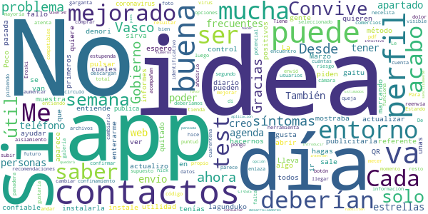
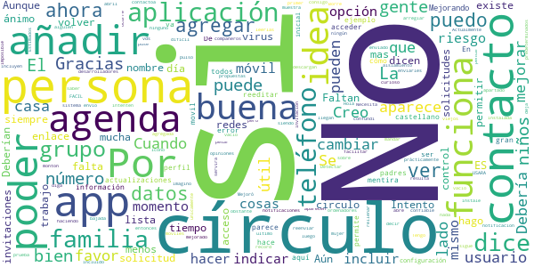
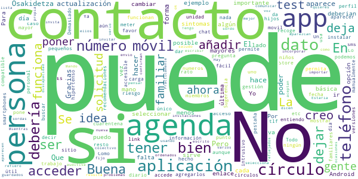
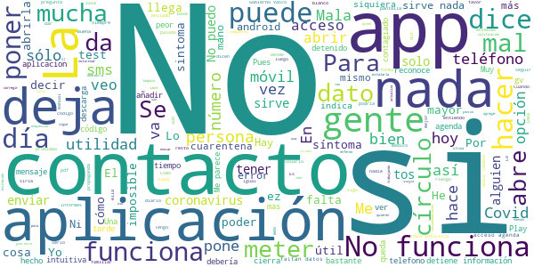

# COVID-19.eus
App version ``2.4``

Analyzed with [covid-apps-observer](http://github.com/covid-apps-observer) project, version ``0.1``

## App overview
| | |
|-------------------------|-------------------------| 
| **Name**&nbsp;&nbsp;&nbsp;&nbsp;&nbsp;&nbsp;&nbsp;&nbsp;&nbsp;&nbsp;&nbsp;&nbsp;&nbsp;&nbsp;&nbsp;&nbsp;&nbsp;&nbsp;&nbsp;&nbsp;&nbsp;&nbsp;&nbsp;&nbsp;&nbsp;&nbsp;&nbsp;&nbsp;&nbsp;&nbsp;&nbsp;&nbsp;&nbsp;&nbsp;&nbsp;&nbsp;&nbsp;&nbsp;&nbsp;&nbsp;  | COVID-19.eus |
| **Unique identifier** | com.erictelm2m.colabora |
| **Link to Google Play** | [https://play.google.com/store/apps/details?id=com.erictelm2m.colabora](https://play.google.com/store/apps/details?id=com.erictelm2m.colabora) |
| **Summary**  | Círculos de colaboración, para nuestra salud, para nuestro bienestar. |
| **Privacy policy** | [https://colaboro.erictel.com/privacy](https://colaboro.erictel.com/privacy) |
| **Latest version** | 2.4 |
| **Last update** | 2020-05-08 09:02:07 |
| **Recent changes** | - Corrección de errores. - Se incluye sección de preguntas frecuentes. - Se elimina el perfil propio en el círculo casa, al ser redundante con la tarjeta propia en el Home. - Se incluye el botón de &quot;no tengo covid&quot; en el caso en el que tu estado sea contagiado y esto no sea así. |
| **Installs**  | 50.000+ |
| **Category** | Medicina |
| **First release** | 27 mar. 2020 |
| **Size**  | 7,9M |
| **Supported Android version**  | 5.0 y versiones posteriores |

### Description
> COVID-19.eus es una aplicación colaborativa para gestionar la pandemia del COVID-19 en el ámbito de la comunidad autónoma vasca. La aplicación permite hacer un autodiagnóstico del contagio de COVID-19. En caso de ser positivo, el usuario se considerará POSIBLE contagio (según terminología de la OMS) y avisará a todo el cículo de personas, de tal forma que se considerarán en riesgo.
 Junto a esta información el sistema registrará ese dato, de tal forma que se puede seguir un rastro de contagios con esta funcionalidad de círculos. Junto con esta información, se pide el Código Postal, y en caso de infección comunitaria, se podrían también detectar focos de contagio.
 Esta información se utilizará para el análisis y el estudio epidemiológico.

### User interface
The developers of the app provide the following screenshots in the Google play store.
| | | |
|:-------------------------:|:-------------------------:|:-------------------------:|
 |   |  

## Development team
In the following we report the main information provided by the development team in the Google play store.

| | |
|-------------------------|-------------------------|
| **Developer**  | Osakidetza |
| **Website**  | - |
| **Email** | COVID19.APP@osakidetza.eus |
| **Physical address**  | - |
| **Other developed apps**  | [https://play.google.com/store/apps/developer?id=Osakidetza](https://play.google.com/store/apps/developer?id=Osakidetza) |

## Android support

| | |
|-------------------------|-------------------------|
| **Declared target Android version**  | Android10, version 10 (API level 29) |
| **Effective target Android version**  | Android10, version 10 (API level 29) |
| **Minimum supported Android version**  | Lollipop, version 5.0 (API level 21) |
| **Maximum target Android version**  | - |

The larger the difference between the minimum and maximum supported Android versions, the better. A larger difference means a wider audience. For example, old phones have a very low Android version, so a high minimum supported Android version means that the app cannot be used by users with old phones, thus leading to accessibility problems. 

## Requested permissions

In the following we report the complete list of the permissions requested by the app. 

| **Permission** | **Protection level** | **Description** | 
|-------------------------|-------------------------|-------------------------|
 **android.permission ACCESS_NETWORK_STATE** | Normal | Allows applications to access information about networks. 
 **android.permission CAMERA** | :warning:**Dangerous** | Required to be able to access the camera device. 
 **android.permission FOREGROUND_SERVICE** | Normal | Allows a regular application to use Service.startForeground. 
 **android.permission INTERNET** | Normal | Allows applications to open network sockets. 
 **android.permission READ_CONTACTS** | :warning:**Dangerous** | Allows an application to read the user's contacts data. 
 **android.permission RECEIVE_BOOT_COMPLETED** | Normal | Allows an application to receive the Intent.ACTION_BOOT_COMPLETED that is broadcast after the system finishes booting. 
 **android.permission WAKE_LOCK** | Normal | Allows using PowerManager WakeLocks to keep processor from sleeping or screen from dimming. 
 **android.permission WRITE_EXTERNAL_STORAGE** | :warning:**Dangerous** | Allows an application to write to external storage. 
 **com.google.android.c2dm.permission RECEIVE** | - | - 

## Mentioned servers

| **Server** | **Registrant** | **Registrant country** | **Creation date** | 
|-------------------------|-------------------------|-------------------------|-------------------------|
 | google.com | Google LLC | :us: US | 1997-09-15 04:00:00 |
 | erictel.com | MAM Objects S.L. | :es: ES | 1998-07-07 04:00:00 |
 | googleapis.com | Google LLC | :us: US | 2005-01-25 17:52:26 |

## Security analysis 

Below we report the main security warnings raised by our execution of the [Androwarn](https://github.com/maaaaz/androwarn) security analysis tool.

**Connection interfaces exfiltration**
> - This application reads details about the currently active data network 
> - This application tries to find out if the currently active data network is metered 

## User ratings and reviews

Below we provide information about how end users are reacting to the app in terms of ratings and reviews in the Google Play store.

### Ratings

The COVID-19.eus app has been installed by more than **50000** times. At this time, **433** rated the app and its average score is **3.33**. Below we show the distribution of the ratings across the usual star-based rating of Google Play

:star::star::star::star::star:: 168

:star::star::star::star:: 60

:star::star::star:: 43

:star::star:: 64

:star:: 95

### Reviews 

#### 5-star reviews

> Me gustaba más la primera,  :date: __2020-05-08 14:41:45__

> No funciona. No pasa de la pantalla inicial. Xiaomi redmi note 3 pro con miui10. Edit: Funciona bien tras actualización, gracias.  :date: __2020-05-06 12:17:39__

> Me he equivocado y he seleccionado "creo que lo he pasado" en lugar de "no lo he pasado". ¿Es posible modificarlo?  :date: __2020-05-03 16:55:25__

> Sencillo y comodo  :date: __2020-05-02 20:54:43__

> Toda ayuda es bienvenida  :date: __2020-05-02 20:16:12__

> Con la última actualización se han solventado los problemas que tenía, por lo que cambio mi valoración de 2 a 5 estrellas  :date: __2020-05-02 20:12:48__

> ¡Muy mejorada la navegación!  :date: __2020-05-01 16:39:49__

> Aunque sigue con cambios me parece una app útil para la situación que estamos viviendo ahora. Gracias !!!  :date: __2020-04-23 16:46:12__

> Muy ûtil y necesaria .  :date: __2020-04-23 13:55:13__

> Muy intuitiva  :date: __2020-04-15 23:30:42__

#### 4-star reviews

> Nos va a ayudar a todos, denori lagunduko gaitu  :date: __2020-05-09 10:01:59__

> Me gusta la idea pero mucha gente de mi entorno no entiende su utilidad y no quieren instalarla. Si quiere ser un método de control deberían publicitarla más  :date: __2020-05-09 07:36:38__

> Lleva unas semanas que ha mejorado.  :date: __2020-05-02 19:59:14__

> Cada día actualizo mi estado y acabo de ver en mi perfil -en mi estado ,que está sin actualizar desde el 29 de Marzo y al pulsar en el QR me sale "algo confiable"🤷🏼‍♀️  :date: __2020-05-02 14:55:14__

> Poco a poco la van mejorado, espero también les sirva como referente para hacernos test y para saber si se. Convive con positivos  :date: __2020-04-12 19:11:30__

> No acabo de enterarme  :date: __2020-04-11 18:55:12__

> La instale la semana pasada, muy útil, solo un problema los primeros días te mostraba los síntomas y tenías que ir marcando cuales tenías, ahora ya no los muestra, te piden que te hagas el test diario pero no aparece, no se si es un fallo de la app o los han quitado. Gracias  :date: __2020-04-06 19:22:42__

> Desde esta app no se pueden abrir los informes de coronavirus que publica el Gobierno Vasco cada día, en el apartado recomendaciones: te reenvía a la web del Gobierno Vasco, en el propio entorno de la app, y los archivos de pdf no se descargan. Desde la web no hay problema.  :date: __2020-04-04 13:24:45__

> También creo que le falta un segundo botón de confirmar el envío de datos porque el otro día hice un envío de mi información, no me di cuenta que estaba seleccionado el apartado de dolor de garganta y como ya se envió ahora estoy en supuesto "aislamiento". Para otro día también ya estaré más atenta.  :date: __2020-04-03 00:34:03__

> De momento bien pero necesita mejorar pero creo que puede llegar a ser una buena herramienta para el futuro  :date: __2020-03-31 17:01:47__

#### 3-star reviews

> Tengo la aplicación desde prácticamente el primer día, y me resulta curioso que por un lado me diga que mi último estado es del 10 de abril (cuando la instalé), cuando lo hago todos los días, que imagino que por eso dice algo confiable. Por otro lado, mi mujer también la tiene bajada, la tengo en el circulo familia y el circulo aparece vació de gente  :date: __2020-05-07 21:47:08__

> No consigo añadir contactos a mis círculos. Cuando envío solicitud a alguien, me dice que "el usuario ya existe en mis círculos de contactos" pero no aparece en ninguno de los círculos predeterminados... Gracias  :date: __2020-05-04 16:19:44__

> Debería permitir saber qué contactoa la tienen instalada.  :date: __2020-05-04 15:20:01__

> Aún tiene que mejorar.  :date: __2020-05-03 15:06:51__

> Mejoró un montón, pero... - me confundí, puse el teléfono en familia y era CASA. No me muestra una lista de las personas por grupo, no se si está está persona agregada. Borré el grupo familia. Y ahora no me deja agregar a esa persona a ningún grupo, porque dice que ya está en un grupo, que no existe  :date: __2020-05-02 21:14:07__

> Hola! Necesita mejorar, -poder cambiar tu nombre de usuario -Ver el estado de las solicitudes -poder reenviar la solicitud Actualmente he enviado solicitudes a mis compañeros de trabajo y cuando se descargan la app no se me incluyen en la lista ni yo a ellos y no puedo volver a enviarles la invitación porque me dice que ya está incluido en mis círculos. No obstante ánimo que lo estáis haciendo en tiempo record  :date: __2020-04-27 13:36:21__

> No me dicen como pueden vds. Detectar el virus y cambiar a la prueba a mi familia gracias  :date: __2020-04-16 09:09:41__

> Deberían de pensar en una aplicación para ordenadores, ya que hay personas con móviles viejos en los que no funciona la aplicación.  :date: __2020-04-14 21:14:16__

> Buena iniciativa. Le falta.mucha promoción para.que sea realmente útil. Deberían dar más posibilidades para compartir la opción de registro en la app. Mediante enlace, por whatsapp, en redes...  :date: __2020-04-13 00:06:06__

> Faltan cosas básicas como acceso a la agenda de teléfonos y poder modificar datos como el Alias... Por otro lado es algo que si se toma en serio puede aportar al control de la expansión del covid-19. Mucho por mejorar pero no es mala la idea. (10-4-20) Mejorando con las actualizaciones. El acceso a la agenda y la edición de datos del usuario arreglado. Aunque ahora falla la autoevaluación diaria. Ha desaparecido...  :date: __2020-04-10 17:52:42__

#### 2-star reviews

> Tengo muchos problemas para que los contactos a los que envío solicitud y la aceptan aparezcan reflejados en mis círculos. Mando la solicitud, me dicen que la confirman, pero no aparecen en la aplicación. Un saludo  :date: __2020-05-07 22:09:37__

> Mientras no sea fácil incorporar los contactos de la agenda no resulta útil. Hay que escribir el teléfono sin verlo ya que no se puede seleccionar si el contacto tiene más de un teléfono. Estaría bien la gestión de las invitaciones y más ahora que es la propia APP quien te invita a tener los círculos "ordenados".  :date: __2020-05-05 14:35:25__

> Ya accede a la agenda de contactos , ok, pero a lo que le refiero es que si en una persona de la agenda tienes varios números guardados, no deja seleccionar uno de ellos, si que la aplicación selecciona uno. En ocasiones puede ser que ese número no sea el que quieres, por ejemplo, un teléfono fijo o de trabajo.  :date: __2020-05-04 13:40:28__

> Buena  :date: __2020-05-02 20:02:06__

> Prácticamente no sirve de nada si no permite importar la agenda. La idea es buena.  :date: __2020-04-25 19:31:50__

> La app es nueva aún; 1-pensar en el colectivo sordo, cómo comunicar por escrito,no podemos por voz, etc 2-en vez de invitar a gente para agregarlos, mejor mostrar lista de los contactos que están usando la app.  :date: __2020-04-16 12:11:41__

> No creo que sea una app accesible para las personas con discapacidad auditiva o sordas, .a rellenar los datos habría que poner el número de teléfono y no pueden telefonear por sordera. Y el chat bloqueado.  :date: __2020-04-15 19:59:08__

> No permite rectificar en los círculos. Yo me he equivocado entre Casa y Familia y no puedo cambiar. Luego la información no es del todo veraz.  :date: __2020-04-12 10:27:49__

> Escasa y en la versión descargada por un familiar no da la opción de autoanalisis, por lo que no se puede indicar estado de ninguna manera. A dia 10 de abril, con la actualización me ha desaparecido ahora el autoanálisis a mi. Cada vez peor.  :date: __2020-04-10 08:56:11__

> Estaba bien. Pero lleva dias que no se puede hacer el test  :date: __2020-04-09 12:04:56__

#### 1-star reviews

> Por mucha gente que tengas en contactos, si alguien no indica que se encuentra enfermo, el resto no van a recibir ninguna notificación. Además que tienes que tener el contacto de las personas para que se te notifique. Y si tienes el contacto y sueles coincidir, es más plausible que te manden un WhatsApp a que lo activen en la aplicacion. Y tampoco vas a tener el contacto de gente con la que coincides en lugares públicos.  :date: __2020-05-08 14:34:44__

> Es imposible de entender ésta aplicación, no ha quién la maneje, como no la expliqueis mejor, es imposible de utilizar.  :date: __2020-05-07 21:58:27__

> No me ha dejado seleccionar que no tenía Covid 19  :date: __2020-05-07 21:29:14__

> Nada más abrir, te pregunta si tienes o has pasado el virus. Si seleccionas "no lo he pasado" te lo sigue preguntando hasta que respondas otra cosa. Si empezamos así, poca utilidad puede tener esta aplicación.  :date: __2020-05-07 21:17:17__

> Eso de que no puedas incorporar los contactos todos a la vez y tenga que ser de uno en uno es bastante poco útil. Y si te llega alguna invitación de alguien, o te metes en los mensajes o no te enteras porque no te llega ni aviso y pone nada en el sobre para que sepas que hay algo nuevo. Mucho que mejorar para que esto sirva. Igual que creo que se debería poner si te han hecho PCR o serología y poder poner el resultado.  :date: __2020-05-07 16:01:52__

> No se actualiza el estado desde el día que la usé por primera vez el 28 de marzo. La he reinstalado y sigue igual. He escrito al desarrollador y no contesta. Para ser institucional, bastante mal.  :date: __2020-05-05 17:01:24__

> Complicada y no resuelve absolutamente nada  :date: __2020-05-03 15:03:10__

> Hurrengo egunetan, atal edo notifikazio guztiak euskaraz ez baditut ikusten, kendu egingo dut. Euskara hizkuntza dut aukeratua eta ez dut onartuko gaztelaniaz egotea  :date: __2020-05-03 13:57:55__

> Mi hija está registrada como familiar; y, sin embargo, en el círculo familiar no aparece nadie. La escala 'confiable', entiendo que es una soberana tontería. ¿Qué mayor confiabilidad que la que indica uno mismo? Según lo que indica la aplicación, parece que, para que ses confiable, lo tiene que corroborar mucha gente. Si quieren decir otra cosa, lo explican fatal. No desinstalo la aplicación por si sirve para algo; cosa que dudo.  :date: __2020-05-02 21:08:27__

> Todos los días entro en ella y confirmo los datos  :date: __2020-05-02 19:00:21__

