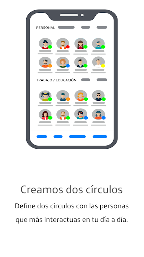
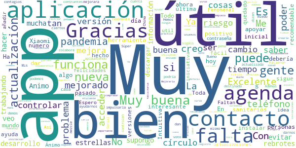
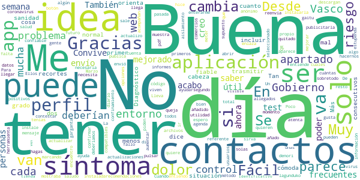
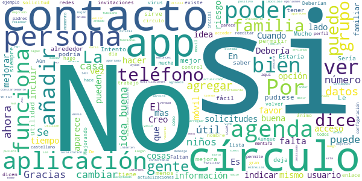
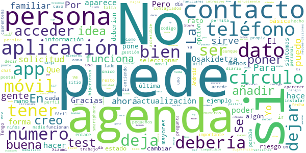
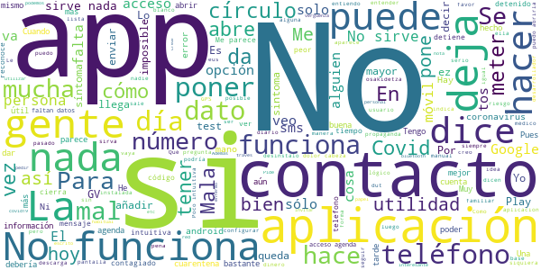

# COVID-19.eus
App version ``3.0``

Analyzed with [covid-apps-observer](http://github.com/covid-apps-observer) project, version ``0.1``

## App overview
| | |
|-------------------------|-------------------------| 
| **Name**&nbsp;&nbsp;&nbsp;&nbsp;&nbsp;&nbsp;&nbsp;&nbsp;&nbsp;&nbsp;&nbsp;&nbsp;&nbsp;&nbsp;&nbsp;&nbsp;&nbsp;&nbsp;&nbsp;&nbsp;&nbsp;&nbsp;&nbsp;&nbsp;&nbsp;&nbsp;&nbsp;&nbsp;&nbsp;&nbsp;&nbsp;&nbsp;&nbsp;&nbsp;&nbsp;&nbsp;&nbsp;&nbsp;&nbsp;&nbsp;  | COVID-19.eus |
| **Unique identifier** | com.erictelm2m.colabora |
| **Link to Google Play** | [https://play.google.com/store/apps/details?id=com.erictelm2m.colabora](https://play.google.com/store/apps/details?id=com.erictelm2m.colabora) |
| **Summary**  | Círculos de colaboración, para nuestra salud, para nuestro bienestar. |
| **Privacy policy** | [https://colaboro.erictel.com/privacy](https://colaboro.erictel.com/privacy) |
| **Latest version** | 3.0 |
| **Last update** | 2020-06-05 23:00:20 |
| **Recent changes** | - En el Home se incluye la información de contagio del municipio. - Se puede intercambiar el riesgo entre alto y bajo desde el perfil del usuario - Se incluyen en el menú las opciones de Información de Interés y Guía de uso - Desde Acerca se puede actualizar la versión de la aplicación - En el protocolo sanitario se permite indicar que no se ha tenido COVID  - Se agiliza el acceso a las funcionalidades en los perfiles de usuarios - Agenda: Se permite la selección múltiple de contactos |
| **Installs**  | 50.000+ |
| **Category** | Medicina |
| **First release** | 27 mar. 2020 |
| **Size**  | 8,1M |
| **Supported Android version**  | 5.0 y versiones posteriores |

### Description
> COVID-19.eus es una aplicación colaborativa para gestionar la pandemia del COVID-19 en el ámbito de la comunidad autónoma vasca. La aplicación permite hacer un autodiagnóstico del contagio de COVID-19. En caso de ser positivo, el usuario se considerará POSIBLE contagio (según terminología de la OMS) y avisará a todo el cículo de personas, de tal forma que se considerarán en riesgo.
 Junto a esta información el sistema registrará ese dato, de tal forma que se puede seguir un rastro de contagios con esta funcionalidad de círculos. Junto con esta información, se pide el Código Postal, y en caso de infección comunitaria, se podrían también detectar focos de contagio.
 Esta información se utilizará para el análisis y el estudio epidemiológico.

### User interface
The developers of the app provide the following screenshots in the Google play store.
| | | |
|:-------------------------:|:-------------------------:|:-------------------------:|
 |   |  

## Development team
In the following we report the main information provided by the development team in the Google play store.

| | |
|-------------------------|-------------------------|
| **Developer**  | Osakidetza |
| **Website**  | - |
| **Email** | COVID19.APP@osakidetza.eus |
| **Physical address**  | - |
| **Other developed apps**  | [https://play.google.com/store/apps/developer?id=Osakidetza](https://play.google.com/store/apps/developer?id=Osakidetza) |

## Android support

| | |
|-------------------------|-------------------------|
| **Declared target Android version**  | Android10, version 10 (API level 29) |
| **Effective target Android version**  | Android10, version 10 (API level 29) |
| **Minimum supported Android version**  | Lollipop, version 5.0 (API level 21) |
| **Maximum target Android version**  | - |

The larger the difference between the minimum and maximum supported Android versions, the better. A larger difference means a wider audience. For example, old phones have a very low Android version, so a high minimum supported Android version means that the app cannot be used by users with old phones, thus leading to accessibility problems. 

## Requested permissions

In the following we report the complete list of the permissions requested by the app. 

| **Permission** | **Protection level** | **Description** | 
|-------------------------|-------------------------|-------------------------|
 **android.permission ACCESS_NETWORK_STATE** | Normal | Allows applications to access information about networks. 
 **android.permission CAMERA** | :warning:**Dangerous** | Required to be able to access the camera device. 
 **android.permission FOREGROUND_SERVICE** | Normal | Allows a regular application to use Service.startForeground. 
 **android.permission INTERNET** | Normal | Allows applications to open network sockets. 
 **android.permission READ_CONTACTS** | :warning:**Dangerous** | Allows an application to read the user's contacts data. 
 **android.permission RECEIVE_BOOT_COMPLETED** | Normal | Allows an application to receive the Intent.ACTION_BOOT_COMPLETED that is broadcast after the system finishes booting. 
 **android.permission WAKE_LOCK** | Normal | Allows using PowerManager WakeLocks to keep processor from sleeping or screen from dimming. 
 **android.permission WRITE_EXTERNAL_STORAGE** | :warning:**Dangerous** | Allows an application to write to external storage. 
 **com.google.android.c2dm.permission RECEIVE** | - | - 

## Mentioned servers

| **Server** | **Registrant** | **Registrant country** | **Creation date** | 
|-------------------------|-------------------------|-------------------------|-------------------------|
 | google.com | Google LLC | :us: US | 1997-09-15 04:00:00 |
 | erictel.com | MAM Objects S.L. | :es: ES | 1998-07-07 04:00:00 |
 | googleapis.com | Google LLC | :us: US | 2005-01-25 17:52:26 |

## Security analysis 

Below we report the main security warnings raised by our execution of the [Androwarn](https://github.com/maaaaz/androwarn) security analysis tool.

**Connection interfaces exfiltration**
> - This application reads details about the currently active data network 
> - This application tries to find out if the currently active data network is metered 

## User ratings and reviews

Below we provide information about how end users are reacting to the app in terms of ratings and reviews in the Google Play store.

### Ratings

The COVID-19.eus app has been installed by more than **50000** times. At this time, **532** rated the app and its average score is **3.49**. Below we show the distribution of the ratings across the usual star-based rating of Google Play

:star::star::star::star::star:: 228

:star::star::star::star:: 69

:star::star::star:: 85

:star::star:: 31

:star:: 117

### Reviews 

#### 5-star reviews

> Regular  :date: __2020-06-16 16:36:15__

> Súper útil para evitar contagios y nuevos rebrotes!!  :date: __2020-06-11 09:18:56__

> Falta mas desarrollo pero veo constantes cambios que me dicen que mejorara la app. Puede darnos información muy útil si todos la usamos, y podría evitar q gente con riesgo se mezcle en ciertos sitios, supongo q para eso es el QR. Ya lo hicieron en China. Ademas tienes mucha información actualizada. Mis 5 estrellas para impulsarla y para que sigáis trabajando. Animo a los demás a hacer lo mismo. Hemos estado aplaudiendo a los sanitarios y podemos dar apoyar también con nuestro voto. Gracias.  :date: __2020-06-10 16:30:41__

> Es una pena que la gente no colabore por miedo a que nos controlen, pero no se dan cuenta que es una herramienta que puede ayudarnos a controlar la pandemia que es para lo que realmente está destinada....  :date: __2020-06-07 10:40:23__

> Bueno.  :date: __2020-06-07 10:29:20__

> Genial  :date: __2020-06-06 18:38:02__

> Imprescindible hoy en día.  :date: __2020-06-06 13:06:59__

> Ha mejorado mucho, pero creo que sin la colaboración de la gente es muy dificil que sirva para algo. La gente no conoce la app o cree que no sirve para nada. Yo creo que facilitaría la labor de los sanitarios a la hora de rastrear los contactos en caso de dar positivo  :date: __2020-06-03 21:53:07__

> Muy buena  :date: __2020-06-03 21:51:06__

> Es informstivo  :date: __2020-05-31 01:28:42__

#### 4-star reviews

> Más sanidad y menos recortes  :date: __2020-06-07 19:58:52__

> Diagnóstico poco fiable  :date: __2020-06-07 14:48:49__

> Tan solo era trasmitir la situación del día  :date: __2020-06-07 12:24:54__

> No está mal dice que te orienta.  :date: __2020-06-07 11:23:23__

> Buena  :date: __2020-06-07 11:11:45__

> En cuanto tienes un síntoma ya te cambia de estado el primer día y puedes tener dolor de cabeza cosa normal ya te cambia de grado tiene que ser dos días consecutivos  :date: __2020-06-07 10:53:57__

> Muy buena  :date: __2020-06-07 10:51:56__

> Fácil, cómoda  :date: __2020-06-07 10:31:55__

> Fácil  :date: __2020-06-03 08:08:00__

> Muy buena aplicación. Se van a incluir más actualizaciones?  :date: __2020-05-31 17:02:26__

#### 3-star reviews

> Tenía instalada la aplicación, pero me avisa de que debo descargarla otra vez porque ha expirado, lo hago pero sigue diciéndome lo mismo.  :date: __2020-06-28 14:42:08__

> Lo último que me dice es que la sesión ha expirado y que desinstale y vuelva a instalar..  :date: __2020-06-27 22:50:42__

> No puedo cambiar un familiar a home si vive en mi casa, si pudiese hacerlo le daría más estrellas  :date: __2020-06-11 10:47:28__

> Esta bien, Le falta mejoras como poder editar tu información y que se lea mejor el texto para que sea una aplicación familiar y confortable.  :date: __2020-06-08 03:08:14__

> No se, no le acabo de ver la utilidad  :date: __2020-06-07 13:04:02__

> Debería permitir saber qué contactos la tienen instalada.  :date: __2020-06-07 10:46:12__

> App en mejora. La verdad es que lo han actualizado constantemente y se agradece. Es funcional y útil si los de tu alrededor lo utilizan.  :date: __2020-06-07 10:33:23__

> La aplicación está bien, el objetivo es muy positivo, pero mo sirve de nada si nadie de mi alrededor lo tiene. Sería mas fácil que la aplicación te añadirá directamente los contactos que tienen la app, y los pusiera en tú círculo. En vez de andar enviando y aceptando solicitudes. Tambien podría tener acceso a la localización para saber por donde ha andado.  :date: __2020-06-05 14:56:39__

> Si me fubcionó. Estaría bien que pudieses seleccionar a muchos contactos de tu agenda para que se envie el mensaje a la vez. Si no es muy dificil que la gente se anime.. Mucho tiempo. Asi somos...  :date: __2020-05-29 16:16:42__

> No deja bajar ni ver los informes en Pdf y el menu de ayuda no funciona...  :date: __2020-05-23 19:46:09__

#### 2-star reviews

> Desde ayer no funciona. Dice que la sesión ha expirado y que la desinstale y la vuelva a instalar. A pesar de haberlo hecho varias veces no funciona. Por otro lado, a la hora de añadir personas a los círculos debería dar la posibilidad de añadirlos sin teléfono puesto que si son personas mayores seguramente o tienen un móvil o no tienen ninguno; y por otro lado, es posible que la gente de mis círculos no quiera que le lleguen notificaciones para instalar la app.  :date: __2020-06-28 18:03:44__

> Me ha aparecido un mensaje que la sesión ha expirado, que desinstale y vuelva a instalar. Y sigue apareciendo ese mensaje que imposibilita un uso correcto. Se rogaría un arreglo o, al menos, una explicación en la ayuda de la app.  :date: __2020-06-27 21:15:54__

> A mi me sale que tengo 3 contagiados en mi zona no en mis conctactos eso como lo tengo que tomar  :date: __2020-06-10 23:59:50__

> La ultima actuallizacion no se me descarga  :date: __2020-06-10 11:56:18__

> Instalo y no me coje mi codigo postal, pone todo el rato el de otra localidad y no deja editar los datos para poner el cp correcto.  :date: __2020-06-08 11:33:07__

> Korapilatsua  :date: __2020-06-07 11:30:45__

> Yo doy a esta aplicación información diaria de mi estado. Para calcular mi riesgo la gente de mi entorno debe aportar su estado, pero no colabora por su propia decisión. Por tanto me sirve de poco.  :date: __2020-06-07 10:38:00__

> No puedo incluir a nadie. Tengo un Xiaomi 8  :date: __2020-06-04 19:24:57__

> Tengo muchos problemas para que los contactos a los que envío solicitud y la aceptan aparezcan reflejados en mis círculos. Mando la solicitud, me dicen que la confirman, pero no aparecen en la aplicación. Un saludo  :date: __2020-05-07 22:09:37__

> Mientras no sea fácil incorporar los contactos de la agenda no resulta útil. Hay que escribir el teléfono sin verlo ya que no se puede seleccionar si el contacto tiene más de un teléfono. Estaría bien la gestión de las invitaciones y más ahora que es la propia APP quien te invita a tener los círculos "ordenados".  :date: __2020-05-05 14:35:25__

#### 1-star reviews

> No se si sirve de algo porque la ultima actualizacion me aparece con la fecha de la primera descarga. Algo pasa con la instalacion. Me dice que ha expirado, que "desinstale y vuelva a instalar," pero lo hago y sigue diciendo lo mismo. Que ocurre?  :date: __2020-06-28 15:50:50__

> Muy bien hasta hoy, que me sale un mensaje que dice que la sesión ha expirado y que desinstale y vuelva a instalar, lo he hecho y me sigue saliendo lo mismo...  :date: __2020-06-28 13:08:47__

> Me dice que tengo que actualizar y, después de borrarla y volver a descargar, me vuelve a decir lo mismo. La quito porque no sirve para nada.  :date: __2020-06-27 16:04:01__

> Mala. No deja añadir los contactos a los círculos. El desarrollador @osakidetza.eus no responde los mails de problemas.  :date: __2020-06-18 11:12:42__

> La app es nueva aún; 1-pensar en el colectivo sordo, cómo comunicar por escrito,no podemos por voz, etc 2-en vez de invitar a gente para agregarlos, mejor mostrar lista de los contactos que están usando la app.  :date: __2020-06-07 10:56:57__

> Es una vergüenza como tiran el dinero en por ahí, lo lógico es utilizar la rutina de covid19 a través de bluetooth de Apple y Google, con mucha más privacidad y sin tener que crear ninguna red. Además lo lógico es que solo hubiera en Europa una app de seguimiento, es una vergüenza lo de las nacionalidades, comunidades y chiringuitos.  :date: __2020-06-06 12:24:56__

> Pide número de teléfono. Desinstalo.  :date: __2020-06-02 14:51:36__

> Es poco común tener los teléfonos de todos los vecinos del bloque, personal del supermercado habitual, en general gente con la que te cruzas habitualmente o comprarles espacio. Y con la que tienes más confianza como para pedir el teléfono, sueles avisar por WhatsApp o una nota de papel que se está enfermo. Y si alguien te lo notifica, sueles avisar a los cercanos por dicho método. Sería interesante tener sistema GPS que avise de gente cercana posiblemente enferma (sin dar datos personales).  :date: __2020-05-28 15:19:20__

> ¿Cómo es posible que aparezca en mi play como instalada si yo no lo he instalado (con otra cuenta, no con la que estoy escribiendo)? ¿Qué relación tiene esto con lo que aparece en Ajuste/ Google, "Notificaciones de exposición al COVID-19"? Si tiene alguna, que parece que sí, ¿que papel tiene Google? ¿Por qué hace falta su colaboración? Tengo decenas de apps que pueden notificar cosas sin que Google tenga que configurar nada en mi cuenta. ¿Dónde hay datos técnicos que demuestren la confidencialidad? ¿Cuando avisa de que he estado cerca de un infectado, cómo sabe dirigirse a mi teléfono si los identificadores compartidos son anónimos? ¿A través de qué servidores lo hace?  :date: __2020-05-28 12:56:42__

> No sirve para nada. Parecía buena iniciativa por parte del GV pero... Se queda en un sueño...  :date: __2020-05-25 13:36:56__

