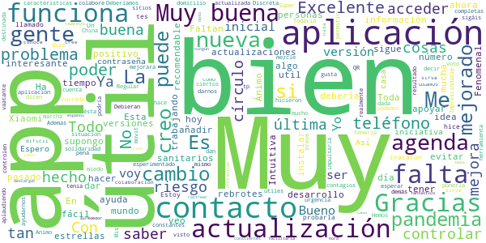
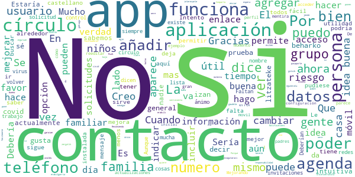
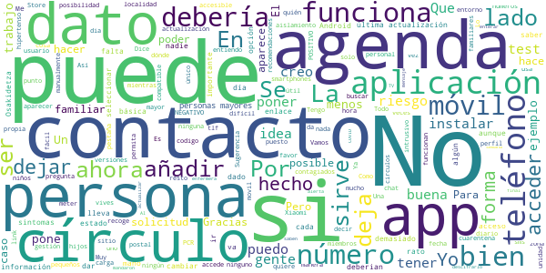

# COVID-19.eus
App version ``4.1``

Analyzed with [covid-apps-observer](http://github.com/covid-apps-observer) project, version ``0.1``

## App overview
| | |
|-------------------------|-------------------------| 
| **Name**                                          | COVID-19.eus |
| **Unique identifier** | com.erictelm2m.colabora |
| **Link to Google Play** | [https://play.google.com/store/apps/details?id=com.erictelm2m.colabora](https://play.google.com/store/apps/details?id=com.erictelm2m.colabora) |
| **Summary**  | Círculos de colaboración, para nuestra salud, para nuestro bienestar. |
| **Privacy policy** | [https://colaboro.erictel.com/privacy](https://colaboro.erictel.com/privacy) |
| **Latest version** | 4.1 |
| **Last update** | 2020-09-04 14:10:20 |
| **Recent changes** | Se incluye la fecha de reporte en las gráficas de contagios |
| **Installs**  | 50.000+ |
| **Category** | Medicina |
| **First release** | 27 mar. 2020 |
| **Size**  | 8,3M |
| **Supported Android version**  | 5.0 y versiones posteriores |

### Description
> COVID-19.eus es una aplicación colaborativa para gestionar la pandemia del COVID-19 en el ámbito de la comunidad autónoma vasca. La aplicación permite hacer un autodiagnóstico del contagio de COVID-19. En caso de ser positivo, el usuario se considerará POSIBLE contagio (según terminología de la OMS) y avisará a todo el cículo de personas, de tal forma que se considerarán en riesgo.
 Junto a esta información el sistema registrará ese dato, de tal forma que se puede seguir un rastro de contagios con esta funcionalidad de círculos. Junto con esta información, se pide el Código Postal, y en caso de infección comunitaria, se podrían también detectar focos de contagio.
 Esta información se utilizará para el análisis y el estudio epidemiológico.

### User interface
The developers of the app provide the following screenshots in the Google play store.
| | | |
|:-------------------------:|:-------------------------:|:-------------------------:|
 |   |  

## Development team
In the following we report the main information provided by the development team in the Google play store.

| | |
|-------------------------|-------------------------|
| **Developer**  | Osakidetza |
| **Website**  | - |
| **Email** | COVID19.APP@osakidetza.eus |
| **Physical address**  | - |
| **Other developed apps**  | [https://play.google.com/store/apps/developer?id=Osakidetza](https://play.google.com/store/apps/developer?id=Osakidetza) |

## Android support

| | |
|-------------------------|-------------------------|
| **Declared target Android version**  | Android10, version 10 (API level 29) |
| **Effective target Android version**  | Android10, version 10 (API level 29) |
| **Minimum supported Android version**  | Lollipop, version 5.0 (API level 21) |
| **Maximum target Android version**  | - |

The larger the difference between the minimum and maximum supported Android versions, the better. A larger difference means a wider audience. For example, old phones have a very low Android version, so a high minimum supported Android version means that the app cannot be used by users with old phones, thus leading to accessibility problems. 

## Requested permissions

In the following we report the complete list of the permissions requested by the app. 

| **Permission** | **Protection level** | **Description** | 
|-------------------------|-------------------------|-------------------------|
 **android.permission ACCESS_NETWORK_STATE** | Normal | Allows applications to access information about networks. 
 **android.permission CAMERA** | :warning:**Dangerous** | Required to be able to access the camera device. 
 **android.permission FOREGROUND_SERVICE** | Normal | Allows a regular application to use Service.startForeground. 
 **android.permission INTERNET** | Normal | Allows applications to open network sockets. 
 **android.permission READ_CONTACTS** | :warning:**Dangerous** | Allows an application to read the user's contacts data. 
 **android.permission RECEIVE_BOOT_COMPLETED** | Normal | Allows an application to receive the Intent.ACTION_BOOT_COMPLETED that is broadcast after the system finishes booting. 
 **android.permission WAKE_LOCK** | Normal | Allows using PowerManager WakeLocks to keep processor from sleeping or screen from dimming. 
 **android.permission WRITE_EXTERNAL_STORAGE** | :warning:**Dangerous** | Allows an application to write to external storage. 
 **com.google.android.c2dm.permission RECEIVE** | - | - 

## Mentioned servers

| **Server** | **Registrant** | **Registrant country** | **Creation date** | 
|-------------------------|-------------------------|-------------------------|-------------------------|
 | google.com | Google LLC | :us: US | 1997-09-15 04:00:00 |
 | erictel.com | MAM Objects S.L. | :es: ES | 1998-07-07 04:00:00 |
 | googleapis.com | Google LLC | :us: US | 2005-01-25 17:52:26 |

## Security analysis 

Below we report the main security warnings raised by our execution of the [Androwarn](https://github.com/maaaaz/androwarn) security analysis tool.

**Connection interfaces exfiltration**
> - This application reads details about the currently active data network 
> - This application tries to find out if the currently active data network is metered 

## User ratings and reviews

Below we provide information about how end users are reacting to the app in terms of ratings and reviews in the Google Play store.

### Ratings

The COVID-19.eus app has been installed by more than **50000** times. At this time, **619** rated the app and its average score is **3.21**. Below we show the distribution of the ratings across the usual star-based rating of Google Play

:star::star::star::star::star:: 192

:star::star::star::star:: 105

:star::star::star:: 93

:star::star:: 99

:star:: 130

### Reviews 

#### 5-star reviews

> On  :date: __2020-11-20 23:46:49__

> 😷😷😷😷😷😷😃😃😃😃😃😃😃😃😃😄😄😄😄😄😄😁😁😁😁😀😀😀😀😀😀😍😍😍  :date: __2020-11-13 17:21:08__

> Yo he llamado para probarla, y hice el tes me trataron muy bien.  :date: __2020-11-02 18:09:08__

> Estoy esperimentado él resultado  :date: __2020-10-25 21:42:28__

> Muy bien  :date: __2020-10-25 16:12:32__

> Todavia no e visto nada en el movit ¿como os voy a decir nada ?.  :date: __2020-10-25 14:44:11__

> Deberíamos tenerla todos por solidaridad  :date: __2020-10-03 23:57:39__

> 🙏🙏🙏  :date: __2020-09-21 11:06:28__

> Discreta  :date: __2020-09-19 11:53:52__

> Me gusta ésta aplicación  :date: __2020-09-19 08:53:56__

#### 4-star reviews

> Creo qué es una aplicación muy buena para mantener informado a Osakidetza del estado de tu salud respecto al covid, por ponerle algún pero diría que desde que nos vacunamos debería haber un apartado en el que apareciera que vacuna te han puesto y cuando.  :date: __2021-05-28 14:32:43__

> Buena  :date: __2021-04-13 17:49:11__

> Tengo un dispositivo Android sin play store y no funciona esta App. Tengo un Huawei, si pueden resolver, me gustaría seguir usándola  :date: __2020-10-25 20:40:51__

> No está claro si es radar covid Euskadi edition o solo contactos estrechos, la verdad, no estaría mal que fuera la primera, pero tiene pinta de ser la segunda, vendría bien un radar covid en euskadi, y necesita más publicidad  :date: __2020-09-16 00:15:11__

> Tenía que poner los pueblos de cada zona, sobre todo los que tienen más de 1000 habitantes. Gracias.  :date: __2020-09-04 11:02:38__

> Si mandas una invitacion a un contacto y no tiene la aplicacion descargada, le da algun tipo de aviso para que se la descargue y acepte la invitacion?  :date: __2020-08-16 15:22:04__

> Estaría bien que funcionara como el bizum, cuando quieres agregar alguien a un círculo que te indique los contactos que ya están registrados. Supongo que si algún conocido indica que es positivo la app te dirá que alguien de un círculo lo es, sin poner nombre ni ninguna información personal?  :date: __2020-08-11 16:48:36__

> ,¿Por que los datos que muestra la aplicación de "positivos de ayer por PCR" no coinciden con los q pública el GV en sus datos diarios?  :date: __2020-08-02 18:03:37__

> Para que esta app funcione o cumpla el objetivo lo debiera instalar toda la poblacion. No sirve para nada con los que estamos. A mi me marca que la ultima actualizacion de datos es del 04 de abril. Estoy a favor de un control mas estricto incluso que por numeros de telefono sepan como nos juntamos y donde para poder hacer un rastreo mas eficaz. No hay otra, mientras una parte de la poblacion sea tan irresponsable. Esto no es broma.  :date: __2020-08-01 11:35:39__

> Esta Aplicación está bien que informa del coronas virus  :date: __2020-07-25 21:40:43__

#### 3-star reviews

> Bere garaian erabilgarria izan zen, baña zergatik ez da 2020tik eguneratu? Oraintxertatuta gaudela azaldu egin beharko litzateke eta pasaporte civid bezela balio izan. Nere inguruan oso jende gutxik erabili du, gehiago ezagutarazi beharko litzateke  :date: __2021-07-19 08:37:13__

> Comparto mis datos por sentimiento de responsabilidad, aún a la espera del contacto con los rastreadores.  :date: __2021-04-24 12:58:48__

> Porque pone con riesgo bajo el 14-11-2020 cuando estamos a 12-02-2021. Que quiere decir que ya no funciona???  :date: __2021-02-12 09:48:04__

> Lo único que no me gusta es que no ponen los datos todos los días , y por eso no me gusta mucho  :date: __2020-11-29 13:37:28__

> No es muy clara  :date: __2020-09-20 17:21:58__

> Recomiendo que eviten enviar Push Notifications a todos los usuarios con mensajes de prueba porque esto hace un poco molesta la App. En general el diseño es bueno y permite navegar fácilmente. Sería interesante implementar un enlace con la App radar covid para que obtengan los contactos desde esa App  :date: __2020-09-17 08:24:44__

> Cuando agregamos a un familiar, o amigo, aparece en el listado sólo el número de teléfono, con lo cual no sé a quién he añadido, puesto que actualmente no sabemos los números de teléfono de casi nadie. Tampoco admite números de fijos...  :date: __2020-08-15 11:19:16__

> No es muy intuitiva la verdad... Creo que no se está publicitando lo suficiente. Si la usamos 4 gatos, no va a servir de mucho. Yo me enteré y me la descargue porque me dijo mi hermano.  :date: __2020-07-22 00:58:53__

> Estaría bien que lo anunciaran en castellano, yo he llegado aquí por un anuncio en daylimotion y nos seguimos empeñando en que todo el mundo sabe euskera cuando no es así, castellano si que sabemos todos. Esto es de interés general, por favor, ponedle sentido y permitidnos enterarnos a la primera. Edito! Mirad la respuesta, me refería a la publicidad de la app, para contestar eso la verdad es que no se para que pagan a un community manager.  :date: __2020-07-01 11:20:50__

> He tenido el mismo problema de que pide reinstalar y no funciona. Hay que ir a aplicaciones, buscar esta aplicación, y en almacenamiento, borrar todos los datos del usuario. Después de esto funciona y mantiene los contactos  :date: __2020-06-30 11:39:10__

#### 2-star reviews

> Lleva una semana sin actualizar los casos de COVID. Al final me tengo que enterar por la TV.  :date: __2020-12-28 13:54:11__

> Me mandaron un mensaje de alerta y ni yo, ni la enfermera, ni dónde me han hecho la PCR saben descifrarlo Me hecho la PCR y me ha dado NEGATIVO. La verdad que no es muy práctica  :date: __2020-12-07 12:17:22__

> No sé si son muy eficaces  :date: __2020-10-04 14:12:34__

> ninguno de mis contactos quiere instalarlo porque no quieren que los controlen. Así no hay manera de que esta app funcione correctamente. Es septiembre ahora y nadie de mi agenda lo instaló, No me sirve así. No hay forma de modificar los datos iniciales, por ejemplo si el entorno en el que vives habia personas de riesgo y ya no estan o ha cambiado tu situacion. No puedes modificarlo si ahora vives solo y el riesgo ha bajado. La desinstalo, en 5 meses no ha mejorado apenas.  :date: __2020-09-15 00:39:23__

> No tengo la opcion de activar rastreo bluethooth, y el acceso a los contactos es cualquier cosa menos intuitiva  :date: __2020-08-31 15:13:23__

> No funciona bien, lleva estancada en número de infectados un, montón de tiempo y se que en mi localidad hay más casos confirmados de los que pone.  :date: __2020-08-25 03:40:04__

> Una aplicación bastante regular. En la última actualización ya no se puede saber cuántos usamos la app. La curva de datos y los boletines normalmente están desactualizados. No se ha publicitado lo suficiente, demasiado círculo para tan poco contacto. Pensando en desinstalarla  :date: __2020-08-14 12:15:22__

> No sirve de mucho. Trabajo en el SAD, y lógicamente los usuarios a los que atiendo el 99% no tienen la app ni sabrían usarla. Por otro lado, no me ha llegado ninguna propuesta de aislamiento cuando en el círculo de mis hijas ha habido positivos y nos recomendaron por teléfono aislamiento mientras esperábamos los resultados (afortunadamente ellas han dado negativo). Vamos, que en mi trabajo puedo pillarlo sin enterarme y no saber de quién. Que no, que no sirve aunque la idea sea buena.  :date: __2020-08-01 12:52:55__

> Se necesita la colaboración y a veces es difícil convencer de la confidencialidad y hay rechazo a colaborar. Un poco más de propaganda de ella y su utilidad.  :date: __2020-07-09 20:05:24__

> Muy difícil de instalar  :date: __2020-07-07 09:34:02__

#### 1-star reviews

> La información de interés es del 2020.....lamentable lo del interés.....  :date: __2021-05-04 21:31:35__

> Imposible cambiar los datos, si cambias de ciudad no deja actualizar y siempre hace la valoracion con el viejo  :date: __2021-04-13 13:50:55__

> Mala  :date: __2021-02-28 21:50:40__

> No vale. No funciona para lo que fué creada. Desinstalo que al menos me ahorro batería del móvil.  :date: __2021-02-09 15:42:48__

> No mantenéis los datos actualizados, normalmente de dos a tres días tarde... No se pueden añadir contactos, esta totalmente abandonada. Y por lo que leo a la hora de la verdad no sirve para nada...  :date: __2021-01-10 20:40:42__

> Esta app es pésima, no se actualiza nada  :date: __2021-01-03 15:25:48__

> Si metes codigo postal erroneo no permite modificarlo por lo que no tienes datos reales  :date: __2020-11-30 09:58:40__

> Que sentido tiene la app si no funciona la posibilidad de agregar contactos, otro ejemplo de como funciona la gestión de osakidetza frente a la crisis... en fin, borro la app  :date: __2020-10-25 14:40:50__

> De momento no se si esta istalada no tengo nada que lo diga ni me lo aclaran.  :date: __2020-10-22 14:54:04__

> No deja añadir contactos, me dice que hay una solicitud pendiente pero no hay manera de solucionarlo  :date: __2020-10-21 08:06:14__

