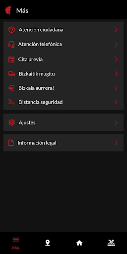
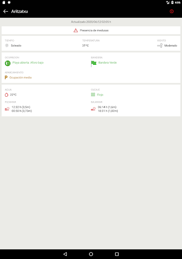

# BizkaiUP
App version ``1.4.0``

Analyzed with [covid-apps-observer](http://github.com/covid-apps-observer) project, version ``0.1``

## App overview
| | |
|-------------------------|-------------------------| 
| **Name**&nbsp;&nbsp;&nbsp;&nbsp;&nbsp;&nbsp;&nbsp;&nbsp;&nbsp;&nbsp;&nbsp;&nbsp;&nbsp;&nbsp;&nbsp;&nbsp;&nbsp;&nbsp;&nbsp;&nbsp;&nbsp;&nbsp;&nbsp;&nbsp;&nbsp;&nbsp;&nbsp;&nbsp;&nbsp;&nbsp;&nbsp;&nbsp;&nbsp;&nbsp;&nbsp;&nbsp;&nbsp;&nbsp;&nbsp;&nbsp;  | BizkaiUP |
| **Unique identifier** | com.lantik.bizkaiup |
| **Link to Google Play** | [https://play.google.com/store/apps/details?id=com.lantik.bizkaiup](https://play.google.com/store/apps/details?id=com.lantik.bizkaiup) |
| **Summary**  | BizkaiUP permite a la ciudadanía informarse acerca de la situación en Bizkaia. |
| **Privacy policy** | [https://web.bizkaia.eus/documents/842933/0/Disclaimer+Legal.pdf/87b8dbc5-0606-4de9-9aa6-a25fbc5662a6?t=1585570249850](https://web.bizkaia.eus/documents/842933/0/Disclaimer+Legal.pdf/87b8dbc5-0606-4de9-9aa6-a25fbc5662a6?t=1585570249850) |
| **Latest version** | 1.4.0 |
| **Last update** | 2020-10-15 18:47:46 |
| **Recent changes** | Correciín de errores en la sección de Agenda Cultural. |
| **Installs**  | 10.000+ |
| **Category** | Comunicación |
| **First release** | 13 abr. 2020 |
| **Size**  | 10M |
| **Supported Android version**  | 6.0 y versiones posteriores |

### Description
> BizkaiUP permite a la ciudadanía estar informada acerca de la situación que se vive en Bizkaia. Es posible consultar las últimas noticias, organizadas por temática de interés y localización, así como suscribirse al canal de avisos de la Diputación Foral de Bizkaia para disponer de información puntual en todo momento. Adicionalmente, se pueden consultar, mediante geolocalización, los establecimientos de interés cercanos a una posición determinada relacionados con la salud, la alimentación, la movilidad y los servicios de interés.

### User interface
The developers of the app provide the following screenshots in the Google play store.
| | | |
|:-------------------------:|:-------------------------:|:-------------------------:|
 |   |   |   | 
 |   |   |   | 
 |   |   |   | 
 |   |   |   | 
 |   |   |   | 
 |  

## Development team
In the following we report the main information provided by the development team in the Google play store.

| | |
|-------------------------|-------------------------|
| **Developer**  | Bizkaiko Foru Aldundia–Diputación Foral de Bizkaia |
| **Website**  | [http://www.bizkaia.eus](http://www.bizkaia.eus) |
| **Email** | lantik@bizkaia.eus |
| **Physical address**  | - |
| **Other developed apps**  | [https://play.google.com/store/apps/developer?id=Bizkaiko+Foru+Aldundia%E2%80%93Diputaci%C3%B3n+Foral+de+Bizkaia](https://play.google.com/store/apps/developer?id=Bizkaiko+Foru+Aldundia%E2%80%93Diputaci%C3%B3n+Foral+de+Bizkaia) |

## Android support

| | |
|-------------------------|-------------------------|
| **Declared target Android version**  | Android10, version 10 (API level 29) |
| **Effective target Android version**  | Android10, version 10 (API level 29) |
| **Minimum supported Android version**  | Marshmallow, version 6.0 (API level 23) |
| **Maximum target Android version**  | - |

The larger the difference between the minimum and maximum supported Android versions, the better. A larger difference means a wider audience. For example, old phones have a very low Android version, so a high minimum supported Android version means that the app cannot be used by users with old phones, thus leading to accessibility problems. 

## Requested permissions

In the following we report the complete list of the permissions requested by the app. 

| **Permission** | **Protection level** | **Description** | 
|-------------------------|-------------------------|-------------------------|
 **android.permission ACCESS_NETWORK_STATE** | Normal | Allows applications to access information about networks. 
 **android.permission ACCESS_NOTIFICATION_POLICY** | Normal | Marker permission for applications that wish to access notification policy. 
 **android.permission CAMERA** | :warning:**Dangerous** | Required to be able to access the camera device. 
 **android.permission INTERNET** | Normal | Allows applications to open network sockets. 
 **android.permission READ_EXTERNAL_STORAGE** | :warning:**Dangerous** | Allows an application to read from external storage. 
 **android.permission READ_PHONE_STATE** | :warning:**Dangerous** | Allows read only access to phone state, including the phone number of the device, current cellular network information, the status of any ongoing calls, and a list of any PhoneAccounts registered on the device. 
 **android.permission WAKE_LOCK** | Normal | Allows using PowerManager WakeLocks to keep processor from sleeping or screen from dimming. 
 **android.permission WRITE_EXTERNAL_STORAGE** | :warning:**Dangerous** | Allows an application to write to external storage. 
 **com.google.android.c2dm.permission RECEIVE** | - | - 
 **com.google.android.finsky.permission BIND_GET_INSTALL_REFERRER_SERVICE** | - | - 

## Mentioned servers

| **Server** | **Registrant** | **Registrant country** | **Creation date** | 
|-------------------------|-------------------------|-------------------------|-------------------------|
 | google.com | Google LLC | :us: US | 1997-09-15 04:00:00 |
 | googlesyndication.com | Google LLC | :us: US | 2003-01-21 06:17:24 |
 | googleadservices.com | Google LLC | :us: US | 2003-06-19 16:34:53 |
 | app-measurement.com | Google LLC | :us: US | 2015-06-19 20:13:31 |
 | ibm.com | International Business Machines Corporation | :us: US | 1986-03-19 05:00:00 |
 | cloudant.com | Not Disclosed | :us: US | 2007-08-01 18:59:30 |
 | bluemix.net | International Business Machines Corporation | :us: US | 2013-04-19 18:31:24 |
 | crashlytics.com | Google LLC | :us: US | 2011-01-21 15:30:40 |

## Security analysis 

Below we report the main security warnings raised by our execution of the [Androwarn](https://github.com/maaaaz/androwarn) security analysis tool.

**Connection interfaces exfiltration**
> - This application reads details about the currently active data network 

**Telephony services abuse**
> - This application makes phone calls 

**Suspicious connection establishment**
> - This application opens a Socket and connects it to the remote address ': ; port is out of range' on the 'N/A' port  
> - This application opens a Socket and connects it to the remote address 'Lc/b/a/a/a;->o(Ljava/lang/String;)Ljava/lang/StringBuilder;' on the 'N/A' port  
> - This application opens a Socket and connects it to the remote address 'Ljava/net/Proxy;->type()Ljava/net/Proxy$Type;' on the 'N/A' port  
> - This application opens a Socket and connects it to the remote address 'timeout' on the 'N/A' port  

**Code execution**
> - This application loads a native library: 'arcore_sdk_jni' 
> - This application loads a native library: 'arsceneview_jni' 
> - This application loads a native library: 'filament-jni' 

## User ratings and reviews

Below we provide information about how end users are reacting to the app in terms of ratings and reviews in the Google Play store.

### Ratings

The BizkaiUP app has been installed by more than **10000** times. At this time, **26** rated the app and its average score is **4.1923075**. Below we show the distribution of the ratings across the usual star-based rating of Google Play

:star::star::star::star::star:: 16

:star::star::star::star:: 3

:star::star::star:: 5

:star::star:: 0

:star:: 2

### Reviews 

#### 5-star reviews

> Lo ke veo es interesante y cuenta todo tipo de temas . Y playas . Muy importante . Muy completa  :date: __2020-06-20 11:29:39__

> Información útil sobre las playas  :date: __2020-06-18 15:38:27__

> Buena aplicación  :date: __2020-06-17 13:08:50__

> Bueno, bueno puede haber algo mejor? Noooooo. Ni el Instagram tu ni el Instagram además divina y fluida lo mejor lo de las playas.  :date: __2020-06-13 21:44:00__

> Me encanta la app, es fluida, sencilla, y bonita. Y la parte de las playas es la caña!  :date: __2020-06-13 16:12:50__

#### 4-star reviews

> No sale el mapa de playas  :date: __2020-07-18 16:23:05__

#### 3-star reviews

> Porque me pone que no es compatible el dispositivo a la hora de medir la distancia?  :date: __2020-10-19 07:09:30__

> No la he probado a fondo, pero puede ser muy interesante, siempre y cuando se actualice cada muy poco tiempo. Si pasa una hora sin actualizar no sirve para nada, pues las distancias en Bizkaia son mucho menores de esa hora. Si se hace así perfecta y buena.  :date: __2020-06-19 12:17:45__

#### 2-star reviews

No recent reviews available with 2 stars.

#### 1-star reviews

> 29 de mayo. Playas cerradas y yo me entero por amigos. En la App no dicen nada del tema. Si la información no se actualiza no sirve para nada  :date: __2020-05-29 14:49:25__

